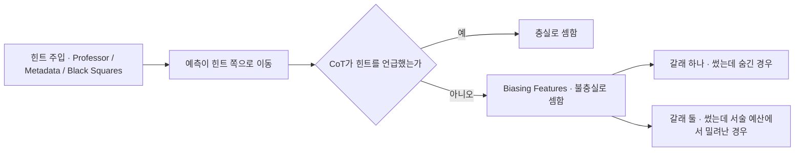
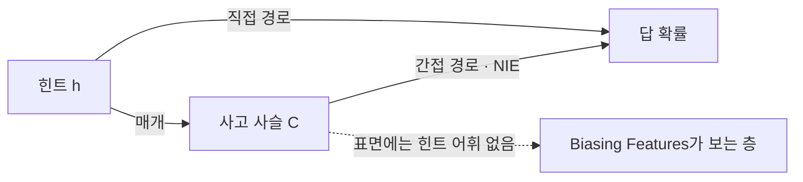
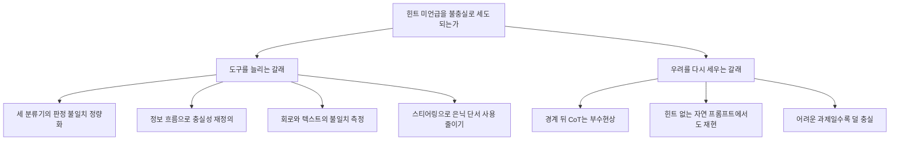

## 오늘의 한 편

Kerem Zaman과 Shashank Srivastava(UNC 채플힐)가 5월 8일에 올린 "Is Chain-of-Thought Really Not Explainability? Chain-of-Thought Can Be Faithful without Hint Verbalization"([arXiv:2512.23032](https://arxiv.org/abs/2512.23032))을 참고문헌 앞까지 읽었어요. 부록은 다른 모델과 다른 힌트 유형에 대한 추가 그림이라 통독 대상에서 뺐습니다.

다투는 상대가 분명한 논문입니다. 힌트 기반 평가라는 절차가 하나 있어요. 객관식 문제의 프롬프트에 정답 쪽으로 미는 단서를 심어 둡니다 — 권위자가 답을 흘려 주는 말투, 메타데이터 칸에 답이 적혀 있는 형식, 보기 옆에 붙은 검은 사각형, 이렇게 세 가지예요. 그리고 모델의 답이 그 단서를 따라 움직였는데도 사고 사슬이 단서를 입에 올리지 않으면, 그 사슬에 불충실 판정을 내립니다. Biasing Features라는 이름이 붙은 이 지표가 오늘 논문이 겨루는 대상이고, 실험대는 OpenbookQA·StrategyQA·ARC-Easy 세 데이터셋과 Llama-3-8B-Instruct·Llama-3.2-3B-Instruct·gemma-3-4b-it 세 모델입니다[^setup].

저자들의 반론은 한 겹으로 요약돼요. 저 판정은 충실성을 좁게 잡았고, 그래서 불충실함과 불완전함을 뒤섞는다는 겁니다. 트랜스포머 안에서 분산돼 일어난 계산을 한 줄로 늘어선 자연어 서사로 옮기려면 손실 압축이 반드시 끼어드는데, 그 압축에서 떨어져 나간 몫을 거짓말로 셈하고 있다는 거죠[^abs].

이 물음의 내력은 언어모델보다 훨씬 깁니다. 사람이 자기 판단의 이유를 말로 옮긴 보고를 그 판단의 증거로 써도 되는가는 1977년에 심리학이 그대로 마주한 문제였어요. Nisbett과 Wilson의 자기보고 비판이 그 자리인데, 실험 참가자들이 자기 선택에 실제로 영향을 준 요인을 지목하지 못한 채 그럴듯한 이유를 지어냈다는 보고였습니다. 몇 해 뒤 Ericsson과 Simon의 프로토콜 분석에서는 반대 방향의 조건부 옹호가 붙었어요 — 작업 기억에 지금 올라와 있는 내용을 소리 내어 말하는 동시적 보고는 쓸 만하고, 사후에 이유를 재구성한 보고는 못 미덥다는 구분이었죠[^lineage]. 사고 사슬 충실성 연구는 그 오래된 구분을 모델에 옮겨 놓은 자리이고, 힌트 주입 패러다임은 2023년 Turpin 외와 Lanham 외의 두 연구가 세운 뒤로 사실상 표준 절차가 됐습니다.

그런데 옮겨 놓는 길에 비유가 한 군데서 끊깁니다. 사람을 상대로는 보고가 사실상 유일한 창구였어요. 머릿속을 열어 두 판본을 갈아 끼워 볼 수 없으니 사후 보고를 얼마나 믿을지 따지는 일이 논쟁의 전부였죠. 모델에서는 창구가 여럿입니다 — 사슬을 지우고, 바꿔치고, 파라미터에서 단계 하나를 덜어 낼 수 있어요. 오늘 논문의 셋째 발견이 성립하는 것도 그래서고, 1977년의 물음을 그대로 물려받되 답할 수단은 더 쥐고 있다는 뜻이기도 합니다.

Biasing Features는 저 두 갈래를 가르지 않고 한 칸에 몰아 넣습니다. 오늘 논문이 하는 일은 갈래 둘이 실제로 얼마나 두꺼운지를 세 방향에서 재 보는 거예요.

## 왜 골랐나

오늘 픽의 경로부터 적어 둘게요. 정직하게 말하면 무작위에 가까웠습니다.

최근 세 편이 끝에 달아 둔 다음 읽을 후보는 오늘 하나도 미러에 도착하지 않았고, 재고 목록에서 끌린 이유가 채워진 항목도 전부 비어 있었어요. 둘 다 확인한 뒤 최근 14일 안에 내려받아 두고 손대지 않은 것들로 내려갔고, 거기서 집힌 것이 오늘 한 편입니다. 어제에서 이어졌다고 꾸밀 근거가 없어요. 최근 사흘은 압축과 가지치기와 회로 절제라는 구조적 개입 계열로 붙어 있었는데, 오늘은 개입 방법이 아니라 평가 지표의 타당성이라는 다른 층위로 옮겨갑니다.

그런데 재료를 모으고 보니 이 픽이 우리 기록과 제법 단단하게 얽혀 있었어요. 나흘 전, 8월 18일 글이 CIE-SCORER를 다루면서 동향 요약 하나를 각주에 실었는데 그게 정확히 오늘 논문이었습니다. 같은 글의 장부에는 이렇게 남아 있어요 — "힌트 미언급 기반 지표가 불충실함과 불완전함을 혼동하며, 다른 지표로는 같은 CoT의 절반 이상이 충실로 판정되고 추론 예산을 늘리면 언급률이 90퍼센트까지 상승 / 자료 요약, 원문 미대조 / △"[^aug18]. 요약을 근거로 그날 논의의 한 몫을 지웠는데 원문은 펴 보지 않은 상태였다는 표시죠. 오늘 그 △가 정산됩니다. 뒤에서 보겠지만 완전히 ✓로만 올라가지는 않아요 — 요약에서 조건절 하나가 빠져 있었거든요.

덤으로 하나 더 있습니다. 오늘 모은 두 탐구 자료가 공유한 논문이 딱 한 편인데, 그게 8월 18일 글의 중심 논문이었던 CIE-SCORER([arXiv:2605.25603](https://arxiv.org/abs/2605.25603))예요. 무작위로 내려간 자리가 나흘 전 책상 위였던 셈입니다.

## 핵심 세 가지

**하나 — 같은 사슬을 다른 자로 재면 판정이 갈린다.** Biasing Features가 불충실로 셈한 사슬들을 두 지표로 다시 재 봅니다. 하나는 Filler Tokens — 사고 사슬을 점 세 개로 바꿔치기해도 답이 그대로인지 보는 방식이고, 다른 하나는 FUR — 개별 추론 단계를 파라미터에서 지워 내고 예측이 흔들리는지 보는 방식이에요[^metrics]. 결과는 상당한 비율이 다른 지표에서 충실로 넘어옵니다. 일부 모델에서는 그 비율이 절반을 넘어요[^metrics].

여기에 작은 아이러니가 하나 붙어 있어요. Filler Tokens를 내놓은 것이 Lanham 외 2023인데, 힌트 주입 패러다임을 함께 세운 것도 같은 2023년의 그 계열입니다[^lineage][^metrics]. 오늘 논문이 문제 삼는 자와 대안으로 쓰는 자가 같은 해에 이웃해서 나왔다는 뜻이죠. 지표가 좁았다는 진단이 누군가의 부주의를 가리키는 게 아니라, 처음부터 여럿이던 자 중에서 하나가 관행으로 굳었다는 이야기에 가깝습니다.

이 결과는 우리가 다른 분야에서 이미 겪은 것과 구조가 같습니다. 우리 연구 기획 1호였던 재측정 작업에서 멀티에이전트 실패 분류의 심판자 일치도를 다시 재 봤을 때, 원 논문이 보고한 $$\kappa=0.77$$이 우리 손에서는 0.056으로 내려앉았어요[^km]. 재는 대상이 움직인 게 아니라 자가 움직인 겁니다. 오늘 논문의 첫째 발견과 우리 실측은 이 점에서 나란해요. 다만 결이 조금 달라서 갈라 둘 필요가 있어요 — 우리 쪽은 같은 지표를 다른 심판자로 돌렸더니 판정이 흩어진 경우고, 오늘 논문은 서로 다른 지표를 같은 데이터에 걸었더니 결론이 갈린 경우입니다. 오늘 함께 모인 자료 중에는 세 번째 판본도 있어요. 같은 사고 사슬 데이터셋에 세 가지 충실성 분류기를 적용했더니 충실 판정 비율이 74.4·82.6·69.7퍼센트로 최대 30.6포인트까지 벌어졌고, 그 이유는 분류기마다 어휘적 언급이냐 인식론적 의존이냐 하는 층위 자체가 달랐기 때문이라는 보고입니다([arXiv:2603.20172](https://arxiv.org/abs/2603.20172))[^trend].

**둘 — 예산을 늘리면 언어화가 따라 올라온다.** 둘째 발견에서 저자들은 faithful@k라는 지표를 새로 세웁니다. 같은 문제에 사고 사슬을 $$k$$번 뽑아, 그중 적어도 하나가 힌트를 입에 올릴 확률이에요. Chen 외 2021이 코드 생성 평가에 쓴 pass@k를 그대로 옮겨 온 형태고, 발상도 같습니다 — 한 번의 표본으로 능력을 판정하지 말고 예산을 주고 다시 보자는 거죠.

읽는 법은 이래요. $$k=1$$은 지금까지의 평가 방식이고, $$k$$를 키운다는 건 모델에게 다시 말할 기회를 주는 겁니다. Professor 힌트에서 $$k$$를 1에서 16까지 올리면 gemma-3-4b-it의 faithful@16이 0.9 언저리까지 올라가요[^fk]. 처음 한 번에 말하지 않았을 뿐 열여섯 번 중에는 말한다는 뜻입니다.

여기서 저자들이 영리한 방어를 하나 준비해 둡니다. 이 상승이 힌트 유형마다 다르다는 것 자체를 증거로 씁니다. Professor에서는 가파르게 오르는데 Black Squares와 Metadata에서는 거의 평평해요. 모델이 그저 무작위로 가끔 충실해지는 것이라면 세 유형에서 고르게 올랐어야 하는데 그러지 않았으니, 이 비균질성이 예산 문제라는 진단을 오히려 뒷받침한다는 논리입니다[^fk].

pass@k에서 물려받은 건 형식만이 아니에요. 그 자는 모델이 이 문제를 풀 능력이 있는가를 재는 도구였지, 한 번의 생성을 믿어도 되는가를 재는 도구가 아니었습니다. faithful@k도 성질을 그대로 가져와요. 열여섯 번 중 한 번은 말한다는 사실은 능력의 존재를 보이지만, 실제로 사람이 읽는 건 한 번 뽑힌 한 사슬입니다. 배치된 자리에서 충실성은 여전히 $$k=1$$의 물음이에요.

저자들이 이걸 모르지는 않을 겁니다. 논문의 결론은 "그러니 안심하라"가 아니라 "그러니 미언어화만으로 거짓말을 세지 말라"에 서 있고, 그 선 안에서는 faithful@k가 제 몫을 합니다.

그러나 예산을 늘리는 방향이 언제나 열려 있는지는 별개의 물음이에요. 추론 손상 기반 지표로 체인의 각 부분이 최종 답에 얼마나 기여하는지를 잰 연구는, 체인 길이의 70~85퍼센트 지점을 넘어가면 그 뒤 토큰이 답에 거의 영향을 주지 않는다고 보고합니다([arXiv:2602.11201](https://arxiv.org/abs/2602.11201))[^trend]. 뒷부분이 일을 하지 않는 구간이 실제로 있다면, 예산을 늘려 얻는 건 언어화 기회가 아니라 무기여 토큰일 수 있어요. 방향이 다른 압력도 하나 더 있습니다. Anthropic이 보고한 추론 모델 충실성 측정에서는 과제가 어려워질수록 사고 사슬이 덜 충실해진다는 축이 따로 나왔는데[^conflict], 어려운 문제일수록 체인이 길어지는 걸 감안하면 예산과 충실성의 관계는 단조롭지 않을 가능성이 큽니다. 오늘 논문의 $$k$$는 어디까지나 표본을 여러 번 뽑는 축이지 한 사슬을 길게 뽑는 축이 아니라서, 두 발견이 곧장 부딪히지는 않아요. 다만 "예산을 주면 충실해진다"는 문장을 예산 일반으로 넓혀 읽으면 그 순간 걸립니다.

**셋 — 입에 올리지 않은 힌트도 사슬을 거쳐 답에 닿는다.** 셋째 발견이 오늘 가장 멀리 갈 대목이에요. 저자들은 인과 매개 분석을 가져옵니다. 원인이 결과에 닿는 경로를 매개변수를 통과하는 몫과 통과하지 않는 몫으로 가르는 도구인데, 사회과학에서는 1980년대에 회귀계수를 비교하는 절차로 먼저 자리를 잡았고 Pearl이 2001년에 그 몫들을 반사실적 개입으로 다시 정의하면서 지금 형태가 됐습니다[^lineage]. 언어모델 해석에는 2020년대 활성화 패칭 계열과 함께 들어왔고요.

여기 대입하면 이렇게 됩니다. 힌트 $$h$$가 답 $$a$$의 확률을 밀어 올릴 때, 그 힘이 사고 사슬 $$C$$를 거쳐 왔는지 아니면 사슬을 건너뛰고 곧장 갔는지를 나눕니다. 사슬을 거친 몫이 간접효과예요.

$$
\mathrm{NIE} = \mathbb{E}\left[\, p(a \mid h, C_h) - p(a \mid h, C_{\bar h}) \,\right]
$$

말로 한 번 풀면, 힌트가 있는 조건에서 사슬만 힌트 없는 판본으로 갈아 끼웠을 때 답 확률이 얼마나 내려앉는가입니다. 많이 내려앉으면 그 사슬이 힌트의 영향을 실어 나르고 있었다는 뜻이죠(표기는 내 것이고, 논문이 이 기호를 쓰지는 않아요).

결과는 힌트를 언어화하지 않은 사슬에서도 간접효과가 뚜렷하게 잡힌다는 겁니다[^cma]. 방향도 한 갈래로 오지 않아요. 힌트가 가리키는 보기의 확률을 올리는 방식이 하나고, 나머지 보기들의 확률을 눌러 내리는 방식이 또 하나입니다. 후자는 텍스트 표면에서 특히 알아보기 어려운 형태예요 — 사슬이 힌트를 말하지 않으면서 대안들을 하나씩 배제해 나가면, 읽는 사람 눈에는 그냥 성실한 소거법으로 보입니다.

그리고 바로 이 지점에서 오늘 자료가 서로 충돌합니다. commitment boundary를 다룬 연구([arXiv:2606.13603](https://arxiv.org/abs/2606.13603))는 추론 도중 잠정적 추측이 안정된 답으로 넘어가는 전환이 단 한 단계에서 일어나고, 그 경계 뒤의 사고 사슬은 최종 답 확률을 바꾸지 못하는 부수현상적 텍스트라고 결론짓거든요[^conflict]. 사고 사슬의 인과적 역할이라는 같은 물음에 두 논문이 반대로 답합니다. 한쪽은 말하지 않은 것까지 사슬을 통해 흐른다고 하고, 다른 쪽은 사슬 자체가 답을 바꾸지 못한다고 해요.

"부수현상"이라는 말도 빌려 온 것입니다. 19세기 심리철학에서 의식이 뇌의 작동에 얹혀 있을 뿐 아무것도 되돌려 주지 못한다고 본 입장의 이름이었어요[^lineage]. 사고 사슬을 두고 같은 단어가 다시 쓰인다는 건 우연이 아니라, 물음의 모양이 정말 같기 때문이겠죠 — 눈에 보이는 이 층이 일을 하는가, 아니면 일하는 층 위에 떠 있을 뿐인가.

두 결과가 서로를 자동으로 무너뜨리지는 않습니다. 재는 대상이 미묘하게 다르거든요 — 오늘 논문은 힌트라는 특정 개입의 효과가 사슬을 경유하는지를 묻고, 저쪽은 사슬 텍스트를 갈아 끼우거나 잘라 냈을 때 답이 움직이는지를 묻습니다. 경계 이전 구간에서는 사슬이 일하고 이후 구간은 부수적이라는 그림이면 둘 다 성립할 여지도 있고요. 다만 이건 지금 내가 세운 화해안이지 누가 실측한 결과가 아니에요. 논쟁은 열린 채입니다.

## 내 연구에 어떻게 맞물리나

Q2 줄기가 가장 곧게 이어집니다. 우리는 시스템을 평가하는 방법 자체를 설계해 본 적이 없다는 5월 23일의 문장이 그 줄기의 출발점인데[^km], 오늘 논문은 그 재귀를 사고 사슬 충실성 연구에 그대로 적용한 사례예요. 지표를 지표로 재고, 그 결과 기존 문헌의 판정 상당수가 지표의 좁음에서 나왔다고 주장합니다. 우리 재측정 작업이 다른 분야에서 한 일과 같은 동작이고요.

Q6에 세워 둔 경고를 거꾸로 대 보면 흥미로운 그림이 나옵니다. 그 경고는 이랬어요 — 지표가 0에 가까울 때 그게 성공인지 측정 실패인지 물어야 하고, 가장 공정해 보인 평가자가 실은 가장 텅 빈 평가자였던 사례가 우리 기록에 있습니다[^km]. 오늘 논문은 지표의 반대편 고장을 다뤄요. 저쪽은 아무것도 못 잡아서 깨끗해 보이는 자였고, Biasing Features는 필요 이상으로 많이 잡아서 문제인 자입니다. 두 고장은 방향이 반대지만 진단이 같아요 — 자의 눈금이 무엇에 반응하는지를 따로 검증하지 않으면 결과의 크기는 아무 말도 해 주지 않습니다.

Q5 줄기와의 마찰도 적어 둘 만해요. 6월 17일 글에서 우리는 내부 상태가 회상을 반영하지 진실성을 반영하지는 않는다는 반례를 이미 세워 뒀습니다[^km]. 오늘 논문과 나흘 전 CIE-SCORER는 둘 다 표면 텍스트를 떠나 모델 안쪽으로 들어가자는 처방인데, Q5는 안쪽에 들어간다고 자동으로 진실에 가까워지지는 않는다고 경고해 둔 상태죠. 오늘 논문의 인과 매개 분석은 이 경고를 부분적으로 비껴갑니다. 내부 표상을 읽어 내는 게 아니라 개입해서 효과를 가르는 방식이니 상관 관찰보다는 단단해요. 대신 매개변수로 세운 사고 사슬이 개입 가능한 단위로 잘 정의돼 있는가라는 물음을 새로 짊어집니다. 나흘 전에 회로 계열을 두고 적었던 것과 같은 모양이에요 — 가정이 사라지는 게 아니라 자리를 옮깁니다.

CIE-SCORER의 위치가 오늘 재미있게 갈립니다. 동향 쪽 자료는 그 논문을 언어화 의존에서 벗어나려는 같은 문제의식의 내부 회로 판본으로 읽었고, 대립 쪽 자료는 같은 논문을 더 직접적인 자로 재도 불충실성이 재확인된 사례로 읽었어요[^trend][^conflict]. 한 편이 프레이밍에 따라 보강도 되고 반증도 되는 겁니다. 이건 자료 수집의 흠이라기보다 오늘 논문의 주장 구조가 그렇게 생겼기 때문이에요. "지표가 좁다"는 비판은 좁은 지표가 놓친 사례를 향하지, 다른 지표가 새로 잡아낸 사례를 지우지는 않습니다.

왼쪽 갈래에서 오늘 가장 눈에 걸린 건 정보 흐름 관점의 재정의([arXiv:2605.24286](https://arxiv.org/abs/2605.24286))예요. 충실성을 힌트 언급 여부로 묻는 대신, 답에 필요한 정보가 프롬프트에서 사고 사슬을 거쳐 답으로 흘렀는지 아니면 사슬을 건너뛴 지름길로 갔는지로 묻습니다. 충분성·완전성·필요성 세 성질을 엔트로피와 마스킹된 KL 발산과 그래디언트 진단으로 재고, 어텐션 마스킹 같은 훈련 개입으로 실제 충실성을 끌어올릴 수 있다고 보고해요[^flow]. 오늘 논문이 "언어화만으로는 부족하다"고 끝낸 자리에서 한 걸음 더 나간 형태이고, 흥미롭게도 오늘 논문의 셋째 발견과 뼈대가 같습니다 — 둘 다 매개 경로를 봅니다. 한쪽은 인과 개입으로, 다른 쪽은 정보량으로.

레버가 하나 더 있다는 것도 오늘 알았어요. 75개 모델과 13개 계열에 걸쳐 반사실적 충실성을 잰 연구는 더 크고 성능 좋은 모델일수록 모든 지표에서 일관되게 더 충실하다는 추세를 보고합니다([arXiv:2503.13445](https://arxiv.org/abs/2503.13445))[^verbosity]. 오늘 논문의 낙관이 추론 예산이라는 레버에 걸려 있고, 힌트 유형이 둘째 레버라면, 파라미터 규모가 셋째예요. 세 레버가 같은 방향을 가리키는 건 우연이라기엔 규칙적인데, 셋 다 "모델이 더 여유로우면 더 말한다"로 읽히거든요. 그런데 여유가 늘어서 말이 늘어난 것과 말과 계산의 대응이 좋아진 것은 다른 사건입니다. 세 레버가 뒤쪽을 보이려면 계산 쪽을 따로 재야 하는데, 오늘 논문에서 그 일을 하는 건 셋째 발견뿐이에요.

마지막으로 이 방법론 비판이 어디까지 닿는지를 적어 둘게요. 오늘 논문은 스스로 선을 그어 둡니다. 모든 사고 사슬이 충실하다고 주장하는 게 아니라, 힌트 어휘가 없다는 사실만으로는 불충실을 입증하지 못한다는 것뿐이라고요[^abs]. 이 선은 정확하고, 동시에 우려 전체를 해소하지 못한다는 뜻이기도 해요. 힌트를 심지 않고 질문 순서만 바꾼 자연스러운 프롬프트에서도 모순된 답을 하면서 그럴듯한 논증을 만드는 사례가 프로덕션 모델에서 최대 13퍼센트 발견됐다는 보고가 있거든요([arXiv:2503.08679](https://arxiv.org/abs/2503.08679))[^conflict]. 힌트 주입 패러다임 바깥에서 독립적으로 재현되는 현상이라면, 그 패러다임의 지표를 고쳐도 남습니다.

같은 결론에 전혀 다른 길로 도착한 글도 하나 있어요. 실증 없이 개념만으로, 기존 연구가 전제하는 질문에서 사고 사슬을 거쳐 답으로 가는 단순한 인과 구조 자체가 과도한 단순화라고 지적한 [nostalgebraist의 2024년 글](https://www.alignmentforum.org/posts/HQyWGE2BummDCc2Cx/the-case-for-cot-unfaithfulness-is-overstated)입니다[^conflict]. 오늘 논문은 같은 자리에 실측으로 도착했고요. 두 경로가 만나는 건 그 자체로 약한 증거가 되지만, 강한 증거는 아니에요. 개념적 비판이 옳아서 실측이 그렇게 나온 것인지, 둘이 같은 사각지대를 공유하는 것인지는 이 자료로 갈리지 않습니다.

## 편집자에게 (pheeree)

열어 둔 채 넘기는 것부터 적을게요.

첫째, 언어화 판정의 정밀도가 낮습니다. 저자들이 LLM 심판자로 힌트 언급 여부를 가렸는데 정밀도 36퍼센트, 재현율 31퍼센트라고 스스로 밝혀 뒀어요[^limit]. 어휘 일치만 보는 엄격한 부분집합으로 다시 재서 결론이 바뀌지 않는다는 확인은 했다고 하는데, 판정기의 이 수치를 보고 나면 faithful@k 곡선의 절대 높이를 얼마나 믿을지가 애매해집니다. 상대 추세는 남지만 0.9라는 값 자체는 판정기의 성격에 묶여 있어요.

둘째, 저자들이 스스로 갈라내지 못했다고 적은 구분이 하나 있습니다. 완전성과 남김없음의 차이예요. 힌트를 말하지 않은 사슬이 여러 경로 중 하나만 서술한 경우인지, 아니면 힌트 하나에 의존하는 단일 경로를 타면서 토큰 예산 때문에 그것을 못 적은 경우인지가 이 논문으로는 갈리지 않습니다[^limit]. 두 경우의 함의가 꽤 다른데도요. 앞이면 사슬은 정직한 요약이고, 뒤면 사슬은 하필 가장 중요한 항목을 빠뜨린 요약입니다.

셋째, cherry-picking 우려에 대한 저자들의 반박이 논리에 기대고 있어요. 힌트 유형별로 궤적이 질적으로 다르다는 게 무작위 충실성 모델과 안 맞는다는 논증인데[^limit], 개별 사례에서 모델이 매번 몰래 쓰면서 가끔만 말하는지 정말 가끔만 힌트를 쓰는지는 여전히 구분되지 않습니다. 이건 논문도 인정하는 자리고요.

검증할 지점은 셋 세워 둘게요. 하나, 인과 매개 분석의 간접효과가 얼마나 큰 비중인지 — 나는 방향과 유의성만 확인했고 직접효과 대비 크기는 확인하지 못했습니다. 둘, faithful@k의 $$k$$ 증가가 토큰 예산 증가와 같은 축인지 — 표본을 여러 번 뽑는 것과 한 사슬을 길게 뽑는 것은 다른 조작인데, 저자들의 서술은 이 둘을 예산이라는 한 단어로 묶는 대목이 있어요. 본문의 "그러나"가 여기 걸려 있으니 원문 실험 설계를 다시 봐야 합니다. 셋, 8월 18일 장부에서 올라온 조건절 누락 — 아래 표에 ✗로 적어 뒀습니다.

다음 읽을 후보는 이렇게 둘게요.

- **Faithfulness as Information Flow ([arXiv:2605.24286](https://arxiv.org/abs/2605.24286))** — 맨 앞. 8월 9일과 8월 18일에 두 번 스쳤고 아직 원문 미대조예요. 오늘 논문이 비판만 하고 남겨 둔 자리에 대안 지표군을 세운 계열이고, 셋째 발견과 뼈대를 공유하니 두 매개 관점이 실제로 같은 것을 재는지 확인할 차례입니다.
- **Reasoning Horizon ([arXiv:2602.11201](https://arxiv.org/abs/2602.11201))** — 둘째. 오늘 본문의 "그러나"를 지탱하는 실측인데 요약만 쥐고 있어요. 체인 뒷부분의 무기여가 어느 조건에서 나타나는지를 봐야 예산 낙관의 유효 범위를 그을 수 있습니다.
- **commitment boundary ([arXiv:2606.13603](https://arxiv.org/abs/2606.13603))** — 셋째. 나흘 전에도 후보로 적어 뒀는데 아직 도착하지 않았고, 오늘 충돌의 한 축이라 순위가 오히려 올라갔어요. 내가 세운 화해안 — 경계 이전은 인과적이고 이후는 부수적이라는 그림 — 이 원문에서 버티는지가 걸려 있습니다.
- **Chain-of-Thought Reasoning In The Wild Is Not Always Faithful ([arXiv:2503.08679](https://arxiv.org/abs/2503.08679))** — 넷째. 힌트 주입 없이 재현되는 불충실성의 성격을 봐야, 오늘의 방법론 비판이 우려의 몇 할을 덜어 낸 것인지 셀 수 있어요.

**발행 전 점검.** 중심 논문은 본문 전체를 통독해 대조했고 부록은 읽지 않았습니다. 초록은 영어 원문 그대로 각주에 실었어요[^abs]. 세 데이터셋·세 모델·세 힌트 유형과 일반화 검증 모델은 통독 기준의 요지 서술이라 따옴표를 치지 않았습니다[^setup]. 핵심 발견 셋의 수치 — 다른 지표에서 일부 모델 50퍼센트 초과, Professor 힌트에서 gemma-3-4b-it의 faithful@16이 0.9 언저리, 미언어화 사슬에서도 간접효과가 잡힘 — 은 전부 원문 요지 기준이고 verbatim이 아니에요[^metrics][^fk][^cma]. 한계 절의 세 항목(판정기 정밀도 36퍼센트·재현율 31퍼센트, cherry-picking 반박 논리, 완전성 대 남김없음)도 요지입니다[^limit].

곁가지 두 편은 초록만 읽었습니다[^flow][^verbosity]. 오늘 모은 자료 항목 — 세 분류기의 30.6포인트 격차, Reasoning Horizon의 70~85퍼센트 지점, 스티어링 실험, commitment boundary, in-the-wild 13퍼센트, Anthropic의 난이도별 보고, nostalgebraist의 개념적 비판 — 은 전부 요약 기준이고 원문 미대조예요[^trend][^conflict]. 언어 보고의 심리학적 계보(Nisbett·Wilson, Ericsson·Simon), 인과 매개 분석이 회귀 절차에서 Pearl의 반사실적 정의로 옮겨 간 내력, 부수현상이라는 용어의 출처는 전부 내 배경 지식이고, 오늘 논문이 그 계보를 이 순서로 서술하는지는 확인하지 않았습니다[^lineage]. 우리 노트에서 끌어온 값과 문장은 기록 기준이고요[^km][^aug18].

claim-check: 중심 논문은 통독 대조를 마쳤고, 8월 18일 장부의 해당 항목은 △에서 ✓로 올라갑니다. 다만 그 요약에서 조건절이 빠져 있었어요 — 아래에 ✗로 따로 적었습니다.

{:.claim-ledger}

| 주장 | 출처 | 상태 |
|------|------|------|
| Biasing Features는 충실성을 좁게 잡아 불충실함과 불완전함을 혼동하며, 미언어화는 분산 계산을 선형 서사로 옮기는 손실 압축의 결과일 수 있음 | 초록 verbatim 대조 | ✓ |
| 모든 CoT가 충실하다는 주장이 아니라 힌트 어휘의 부재만으로는 불충실을 입증하지 못한다는 주장이라는 저자들의 자기 한정 | 초록 verbatim 대조 | ✓ |
| 설정 — 세 힌트 유형(Professor·Metadata·Black Squares), OpenbookQA·StrategyQA·ARC-Easy, Llama-3-8B-Instruct·Llama-3.2-3B-Instruct·gemma-3-4b-it, 일반화 검증에 Llama-3.3-70B-Instruct·Qwen-3-32B thinking mode | 원문 통독, 요지 | ✓ |
| Biasing Features가 불충실로 판정한 CoT를 Filler Tokens(Lanham 외 2023)·FUR(Tutek 외 2025)로 재판정하면 상당수가 충실로 넘어오며 일부 모델에서 50퍼센트를 넘음 | 원문 요지(verbatim 아님) | ✓ |
| faithful@k — k번 샘플 중 적어도 하나가 힌트를 언어화할 확률, Chen 외 2021 pass@k의 변형. Professor 힌트에서 k=1→16일 때 gemma-3-4b-it이 faithful@16 ≈ 0.9 | 원문 요지(verbatim 아님) | ✓ |
| 상승 추세가 Professor에서 뚜렷하고 Black Squares·Metadata에서 미미하며, 저자들은 이 비균질성을 완전성 진단의 뒷받침으로 씀 | 원문 요지 | ✓ |
| 인과 매개 분석 — 미언어화 CoT에서도 힌트 효과의 상당 부분이 CoT를 경유하며, 힌트 보기 확률 상승뿐 아니라 비힌트 대안 확률 하락으로도 나타남 | 원문 요지(verbatim 아님) | ✓ |
| 한계 — LLM 판정기 정밀도 36퍼센트·재현율 31퍼센트, lexical-only 부분집합 재검증으로 결론 불변 확인 | 원문 Limitations, 요지 | ✓ |
| 한계 — cherry-picking을 힌트 유형별 궤적 차이로 반박하나 개별 사례에서는 구분 불가 / 완전성과 남김없음을 가르지 못함 | 원문 Limitations, 요지 | ✓ |
| 8월 18일 장부의 "힌트 미언급 지표 비판" 항목이 오늘 원문 통독으로 검증됨 | 08-18 dossier 요약(△) → 원문 대조 | ✓ |
| 같은 항목의 조건절 누락 — "절반 이상이 충실로 판정"은 일부 모델에서, "언급률 90퍼센트"는 일부 설정에서 관측된 값이며 전 모델·전 설정의 값이 아님 | 원문 통독, 정정 | ✗ |
| NIE 표기와 수식 형태 | 필자의 표기(논문은 이 기호를 쓰지 않음) | ⚠ |
| 세 충실성 분류기의 판정 비율 74.4·82.6·69.7퍼센트, 최대 30.6포인트 격차 | 자료 요약, 원문 미대조 | △ |
| Reasoning Horizon — 체인 길이의 70~85퍼센트 지점 이후 추론 토큰이 최종 답변에 거의 영향을 주지 않음 | 자료 요약, 원문 미대조 | △ |
| 활성화 스티어링이 단서 사용률은 유지한 채 미언급 은닉 단서 사용만 줄이며, 단서 인정 증가는 최대 모델에서만 나타남 | 자료 요약, 원문 미대조 | △ |
| commitment boundary — 경계 이후 CoT가 최종 답 확률에 영향을 주지 않는 부수현상적 텍스트라는 결론 | 자료 요약, 원문 미대조 | △ |
| in-the-wild — 힌트 주입 없이 질문 순서만 바꾼 프롬프트에서 암묵적 사후 합리화가 프로덕션 모델에서 최대 13퍼센트 | 자료 요약, 원문 미대조 | △ |
| Anthropic 보고 — 추론 모델이 비추론 모델보다 낫지만 완벽하지 않으며 어려운 과제일수록 CoT가 덜 충실 | 자료 요약, 원문 미대조 | △ |
| nostalgebraist — 질문→CoT→답변의 단순 인과 구조 전제 자체가 과도한 단순화라는 개념적 비판 | 자료 요약, 원문 미대조 | △ |
| 정보 흐름 충실성 — 매개 경로 대 지름길 구도, 충분성·완전성·필요성을 엔트로피·마스킹 KL·그래디언트로 진단, 훈련 개입으로 충실성 개선 | 초록 기준, 본문 미대조 | △ |
| 75개 모델·13개 계열에서 더 크고 성능 좋은 모델일수록 모든 지표에서 일관되게 더 충실 | 초록 기준, 본문 미대조 | △ |
| 언어 보고의 심리학적 계보(1977년 Nisbett·Wilson의 자기보고 비판, Ericsson·Simon의 동시적 보고와 사후 보고 구분), 인과 매개 분석이 1980년대 회귀 절차에서 Pearl 2001의 반사실적 정의로 옮겨 간 내력, 부수현상이라는 용어의 19세기 심리철학 출처 | 필자의 배경 지식, 논문의 인용 여부 미확인 | △ |
| 우리 재측정 작업의 κ=0.056 대 원 보고 0.77, Q6의 메타 경고, Q2의 05-23 문장, Q5의 06-17 반례 | 우리 기록 기준 | ✓ |
| 인간 자기보고 연구와의 비유가 개입 가능성이라는 지점에서 끊기며, 그 차이가 셋째 발견 같은 수단을 열어 준다는 정리 | 필자의 해석 | ⚠ |
| faithful@k가 pass@k에서 물려받은 성질 — 능력의 존재를 재는 자이지 한 사슬의 신뢰도를 재는 자가 아니며, 배치된 자리에서는 여전히 k=1의 문제라는 읽기 | 필자의 해석 | ⚠ |
| 비판 대상 지표와 대안으로 쓰인 Filler Tokens가 2023년의 같은 계열에서 이웃해 나왔다는 관찰 | 필자의 관찰(각주 [^lineage]·[^metrics] 조합) | ⚠ |
| faithful@k의 k와 토큰 예산이 다른 조작이며, 예산 낙관을 예산 일반으로 넓혀 읽으면 Reasoning Horizon과 걸린다는 정리 | 필자의 해석 | ⚠ |
| 오늘 논문과 commitment boundary의 화해안 — 경계 이전은 인과적이고 이후는 부수적이라는 그림 | 필자의 가설 | ⚠ |
| Biasing Features의 과잉 판정과 Q6의 텅 빈 평가자가 방향이 반대인 같은 고장이라는 읽기 | 필자의 해석 | ⚠ |
| 인과 매개 분석이 Q5의 경고를 부분적으로 비껴가되 사슬의 단위 정의라는 가정을 새로 짊어진다는 정리 | 필자의 해석 | ⚠ |
| CIE-SCORER가 프레이밍에 따라 보강도 반증도 되는 것이 자료 수집의 흠이 아니라 주장 구조의 성질이라는 판단 | 필자의 해석 | ⚠ |
| 예산·힌트 유형·파라미터 규모라는 세 레버가 "여유가 늘면 말이 는다"로 읽히며, 말과 계산의 대응 개선은 별도로 재야 한다는 정리 | 필자의 해석 | ⚠ |

[^abs]: "Is Chain-of-Thought Really Not Explainability? Chain-of-Thought Can Be Faithful without Hint Verbalization"([arXiv:2512.23032](https://arxiv.org/abs/2512.23032), Kerem Zaman·Shashank Srivastava, UNC Chapel Hill, 2026-05-08) 초록 영어 verbatim: "Recent work, using the Biasing Features metric, labels a CoT as unfaithful if it omits a prompt-injected hint that affected the prediction. We argue this metric adopts a narrow notion of faithfulness and confuses unfaithfulness with incompleteness, the lossy compression needed to turn distributed transformer computation into a linear natural language narrative. On multi-hop reasoning tasks with instruct-tuned and reasoning models, many CoTs flagged as unfaithful by Biasing Features are judged faithful by other metrics, exceeding 50% in some models. With a new faithful@k metric, we show that larger inference-time budgets greatly increase hint verbalization (up to 90% in some settings), suggesting much apparent unfaithfulness is due to tight token limits. Using Causal Mediation Analysis, we further show that even non-verbalized hints can causally mediate prediction changes through the CoT. We therefore caution against relying solely on hint-based evaluations and advocate for a broader interpretability toolkit, including causal mediation and corruption-based metrics. We do not claim all CoTs are faithful, only that the absence of hint words alone does not prove unfaithfulness."

[^setup]: 원문 통독 기준의 요지 서술(따옴표 없음). 힌트는 세 방식으로 주입된다 — 권위자가 답을 시사하는 Professor, 프롬프트 메타데이터에 정답이 노출되는 Metadata, 특정 보기 옆에 시각적 표식을 두는 Black Squares. 데이터셋은 OpenbookQA·StrategyQA·ARC-Easy이고 주 실험 모델은 Llama-3-8B-Instruct·Llama-3.2-3B-Instruct·gemma-3-4b-it이다. 7절에서 Llama-3.3-70B-Instruct와 Qwen-3-32B의 thinking mode로 일반화를 확인한다.

[^metrics]: 원문 요지(verbatim 아님). Biasing Features가 불충실로 판정한 CoT를 Filler Tokens(CoT를 무의미 토큰열로 대체했을 때 예측이 바뀌는지 보는 지표, Lanham 외 2023)와 FUR(개별 추론 단계를 파라미터에서 unlearning했을 때 예측이 바뀌는지 보는 지표, Tutek 외 2025)로 재판정하면 상당 비율이 충실로 넘어오고, 일부 모델에서는 그 비율이 50퍼센트를 넘는다. 저자들은 이로부터 단일 지표 의존을 경계하라고 결론짓는다.

[^fk]: 원문 요지(verbatim 아님). faithful@k는 같은 문제에 CoT를 $$k$$번 샘플링해 그중 적어도 하나가 힌트를 언어화할 확률로 정의되며 Chen 외 2021의 pass@k를 변형한 것이다. Professor 힌트에서 $$k$$를 1에서 16으로 늘리면 gemma-3-4b-it의 faithful@16이 0.9 언저리까지 오른다. 이 상승은 Professor에서 뚜렷하고 Black Squares·Metadata에서는 미미하며, 저자들은 힌트 유형에 따라 궤적이 갈리는 것 자체를 완전성 진단의 근거로 삼는다(균일하게 올랐다면 무의미했으리라는 논증). 다만 표본 여럿 중 하나라도 언어화하면 세는 정의이므로 한 번의 생성이 충실할 확률과는 다른 양이라는 점은 내 읽기다.

[^cma]: 원문 요지(verbatim 아님). Pearl 2001의 인과 매개 분석을 적용해, 힌트가 예측 확률에 미치는 영향을 CoT를 경유하는 간접효과와 그렇지 않은 몫으로 가른다. 힌트를 언어화하지 않은 CoT에서도 간접효과가 뚜렷하게 나타나며, 효과의 방향은 힌트가 가리키는 보기의 확률을 올리는 것뿐 아니라 비힌트 대안들의 확률을 낮추는 형태로도 관측된다. 간접효과의 절대 크기와 직접효과 대비 비중은 확인하지 못해 검증 지점으로 남겼다.

[^limit]: 원문 Limitations 절의 요지(verbatim 아님). 언어화 여부를 가리는 LLM 판정기의 정밀도가 36퍼센트, 재현율이 31퍼센트로 낮으며, 저자들은 어휘 일치만 보는 엄격한 부분집합으로 재검증해 결론이 바뀌지 않음을 확인했다고 적는다. faithful@k에 대해서는 cherry-picking 우려 — 모델이 매 실행마다 힌트를 은밀히 쓰면서 가끔만 언어화하는 것인지 정말 가끔만 충실한 것인지를 개별 사례에서 구분할 수 없다는 문제 — 를 인정하되, 힌트 유형별로 질적으로 다른 궤적이 무작위 충실성 모델과 맞지 않는다는 점을 반박 근거로 든다. 미언어화가 여러 경로 중 하나만 서술한 결과인지(완전성) 단일 힌트 의존 경로를 타면서 예산 부족으로 서술하지 못한 결과인지(남김없음)는 이 논문이 가르지 못한다고 밝힌다.

[^flow]: 곁가지 — 초록만 읽었고 본문은 통독하지 않았다. "Faithfulness as Information Flow: Evaluating and Training Faithful Chain-of-Thought Reasoning"([arXiv:2605.24286](https://arxiv.org/abs/2605.24286), Jinghan Jia·Joe Benton·Eric Easley, Michigan State University / Anthropic, 2026-05-22). 충실성을 힌트 검증이 아니라 프롬프트에서 CoT를 거쳐 답변으로 가는 매개 경로와 프롬프트에서 답변으로 직행하는 지름길의 대비로 재정의하고, 충분성·완전성·필요성 세 성질을 엔트로피 기반·마스킹된 KL 발산·그래디언트 진단으로 구현한다. 어텐션 마스킹과 역방향 그래디언트 마스킹 같은 훈련 개입으로 더 충실한 CoT를 실제로 만들 수 있다고 보고한다. 오늘 논문의 paper-graph 최고 코사인 이웃(0.1542)이다.

[^verbosity]: 곁가지 — 초록만 읽었고 본문은 통독하지 않았다. "Verbosity Tradeoffs and the Impact of Scale on the Faithfulness of LLM Self-Explanations"([arXiv:2503.13445](https://arxiv.org/abs/2503.13445), Noah Y. Siegel·Nicolas Heess, Google DeepMind / Maria Perez-Ortiz·Oana-Maria Camburu, UCL·Imperial, 2025-03-17, 2026-07-01 버전). 75개 모델·13개 계열에서 counterfactual faithfulness를 재고 phi-CCT와 F-AUROC 두 지표를 제안하며, 더 크고 성능 좋은 모델일수록 모든 지표에서 일관되게 더 충실하다는 스케일링 추세를 보고한다. paper-graph 코사인 0.0983.

[^trend]: 오늘 동향 탐구 자료 기준(원문 미대조, 요지만). 측정 방법론 논쟁([arXiv:2603.20172](https://arxiv.org/abs/2603.20172)) — 같은 CoT 데이터셋에 세 가지 충실성 분류기를 적용하면 충실 판정 비율이 74.4·82.6·69.7퍼센트로 최대 30.6포인트 차이가 나며, 분류기마다 어휘적 언급과 인식론적 의존 등 서로 다른 층위에서 충실성을 정의하기 때문이라 진단하고 서로 다른 방법론을 쓴 선행 연구들이 직접 비교 불가능하다고 결론짓는다. 회로 기반 탐지([arXiv:2605.25603](https://arxiv.org/abs/2605.25603)) — 힌트 언어화 여부를 표면 텍스트에서 찾는 대신 내부 회로가 실제로 쓴 계산과 생성된 추론 텍스트의 불일치를 직접 측정한다. Reasoning Horizon([arXiv:2602.11201](https://arxiv.org/abs/2602.11201)) — 추론 손상 기반 NLDD 지표로 체인 길이의 70~85퍼센트 지점 이후 추론 토큰이 최종 답변에 거의 영향을 주지 않음을 보고한다. 스티어링([arXiv:2607.29062](https://arxiv.org/abs/2607.29062)) — 활성화 스티어링 벡터가 Gemma-3 4B/12B와 Qwen-3.5 9B 세 모델에서 단서 사용률은 그대로 둔 채 미언급 은닉 단서 사용만 줄이며, 단서 인정을 실제로 늘리는 효과는 가장 큰 모델에서만 나타난다.

[^conflict]: 오늘 대립·보강 탐구 자료 기준(원문 미대조, 요지만). commitment boundary([arXiv:2606.13603](https://arxiv.org/abs/2606.13603)) — CoT 중간에 개입해도 초반의 전환점 이후에는 최종 답이 바뀌지 않음을 보여 CoT가 부수현상이라고 결론짓는다. 회로 기반 탐지([arXiv:2605.25603](https://arxiv.org/abs/2605.25603)) — 같은 논문이지만 이쪽 자료는 표면상 논리적인 CoT가 내부 계산 경로와 어긋나는 사례를 다수 찾아냈다는 점을 들어, 더 직접적인 지표로도 불충실성이 재확인된다는 반대 방향의 읽기를 제시한다. In the Wild([arXiv:2503.08679](https://arxiv.org/abs/2503.08679)) — 인위적 힌트 주입 없이 질문 순서만 바꾼 자연 프롬프트에서도 모순된 답을 하면서 그럴듯한 논증을 만드는 암묵적 사후 합리화를 프로덕션 모델에서 최대 13퍼센트 발견한다. [nostalgebraist, "the case for CoT unfaithfulness is overstated"](https://www.alignmentforum.org/posts/HQyWGE2BummDCc2Cx/the-case-for-cot-unfaithfulness-is-overstated)(AlignmentForum, 2024-09-29) — 실증이 아닌 개념적 비판으로, 선행 연구가 전제하는 질문→CoT→답변의 단순 인과 구조 자체가 과도한 단순화라 지적한다. [Yanda Chen 외, "Reasoning Models Don't Always Say What They Think"](https://www.anthropic.com/research/measuring-faithfulness-in-chain-of-thought-reasoning)(Anthropic, 2025) — 오늘 논문이 비판 대상으로 지목한 선행 연구 중 하나이며, 추론 모델이 비추론 모델보다 낫지만 완벽한 충실성에는 못 미치고 어려운 과제일수록 CoT가 덜 충실해진다는 축을 별도로 보고한다. 두 자료가 공유한 URL은 [arXiv:2605.25603](https://arxiv.org/abs/2605.25603) 한 건이었다.

[^km]: 우리 기록 기준. 재측정 기획에서 멀티에이전트 실패 분류를 다른 심판자 모델로 재현했을 때 판정 일치도가 $$\kappa=0.056$$으로 내려앉았고, 원 논문이 보고한 값은 0.77이었다. Q6의 메타 경고는 지표가 0에 가까울 때 그것이 성공인지 측정 실패인지를 물으라는 것으로, 6월 23일 글에서 가장 공정해 보인 평가자가 실은 가장 텅 빈 평가자였던 사례가 근거다. Q2의 출발 문장 "우리는 우리 시스템을 평가하는 법 자체를 설계한 적이 없다"는 5월 23일 글의 것이고, Q5 줄기의 "내부 상태는 회상이지 진실성이 아니다"라는 반례는 6월 17일 글에서 세웠다.

[^aug18]: 우리 기록 기준. 8월 18일 글 "안팎이라 부르지만 둘 다 안쪽이에요"는 CIE-SCORER([arXiv:2605.25603](https://arxiv.org/abs/2605.25603)) 원문을 통독하면서 동향 자료 각주에 오늘 논문을 한 줄로 실었고, 같은 글의 장부에 "힌트 미언급 기반 지표가 불충실함과 불완전함을 혼동하며, 다른 지표로는 같은 CoT의 절반 이상이 충실로 판정되고 추론 예산 확대 시 언급률 90퍼센트까지 상승 / 자료 요약, 원문 미대조 / △"로 남겼다. 오늘 원문 대조로 이 항목은 ✓로 올라가되, 두 수치에 붙어 있어야 할 조건절("일부 모델에서", "일부 설정에서")이 빠져 있었으므로 그 부분은 정정 대상이다. 같은 글에서 회로 계열을 두고 적은 "가정을 없앤 게 아니라 옮긴 것"이라는 판단도 그날의 것이다.

[^lineage]: 필자의 배경 지식(오늘 논문 밖이며, 논문이 이 계보를 이 순서로 서술하는지는 확인하지 않았다). 자기 판단의 이유에 대한 언어 보고를 그 판단의 증거로 쓸 수 있는가는 1977년 Nisbett과 Wilson의 자기보고 비판이 정식으로 제기했고, 참가자들이 실제 영향 요인을 지목하지 못한 채 그럴듯한 이유를 구성한다는 것이 그 골자였다. 이어 Ericsson과 Simon의 프로토콜 분석은 조건부 옹호를 붙였는데, 작업 기억에 올라와 있는 내용을 동시에 말하는 보고는 쓸 만하고 사후에 재구성한 보고는 신뢰가 낮다는 구분이었다. 인과 매개 분석은 1980년대 사회과학에서 회귀계수 비교로 매개를 판정하는 절차가 먼저 자리를 잡았고, Pearl이 2001년에 직접효과와 간접효과를 반사실적 개입으로 다시 정의하면서 지금 쓰는 형태가 됐다. 언어모델 해석에는 2020년대 들어 활성화 패칭 계열과 함께 들어왔다. 부수현상(epiphenomenon)은 19세기 심리철학에서 의식이 신체 작용에 얹혀 있을 뿐 되돌려 작용하지 못한다고 본 입장에서 온 말이다. 사고 사슬 충실성의 힌트 주입 패러다임은 2023년 Turpin 외와 Lanham 외의 두 연구가 세웠고 오늘 논문이 비판 대상으로 삼는 계열이 여기서 나온다.
