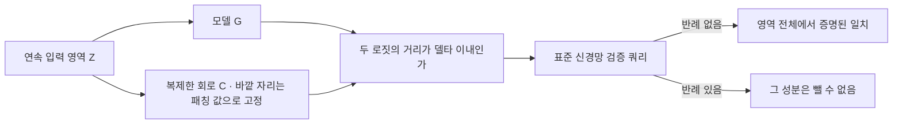
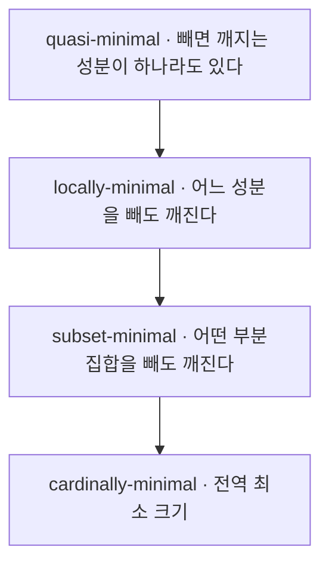
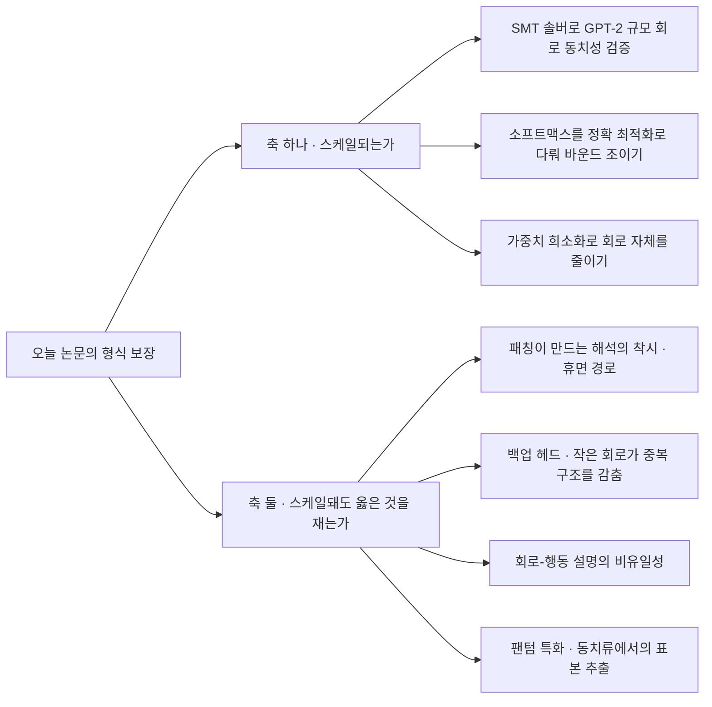

## 오늘의 한 편

오늘 통독한 마흔두 쪽은 "Formal Mechanistic Interpretability: Automated Circuit Discovery with Provable Guarantees"([arXiv:2602.16823](https://arxiv.org/abs/2602.16823))예요. Itamar Hadad와 Guy Katz, Shahaf Bassan 세 사람이 히브리대에서 썼고 ICLR 2026에 실렸습니다.

출발점은 회로 발견의 낯익은 절차입니다. 모델의 계산 그래프에서 특정 행동을 맡는다고 지목된 부분그래프를 회로라 부르고, 그 지목이 옳은지는 회로 바깥 성분의 활성을 어떤 값으로 고정한 뒤 — 이걸 패칭이라 하죠 — 회로만으로도 모델과 같은 출력이 나오는지로 판정해요. 저자들이 짚는 문제는 그 판정이 늘 유한한 표본 점에서만 이뤄진다는 겁니다. 서론 첫 문단이 이 문제를 세우면서 근거로 세 편을 나란히 답니다[^intro].

그 셋 중 하나가 Miller와 Chughtai, Saunders의 회로 충실성 지표 논문이에요. 닷새 전 여기서 통독한 그 논문입니다. 오늘 논문은 그것을 "연속 섭동 영역에서 엄밀한 보장이 없다"는 진단의 인용으로 쓰고, 그 진단에 답하겠다고 선언하며 시작해요.

답하는 방식이 이 논문의 발명입니다. 신경망 검증은 원래 모델 하나를 두고 "이 연속 입력 영역 전체에서 이 출력 조건이 항상 성립하는가"를 형식적으로 증명하는 기법이에요. ReLU 신경망의 성질을 SMT로 판정한 Reluplex 이후 하나의 분야로 자리 잡았고, 적대적 강건성 인증이 대표적인 쓰임이며, 지금은 선형 완화 기반 바운드 전파에 분기를 얹은 α-β-CROWN이 VNN-COMP에서 거듭 우승하며 표준 자리를 지키고 있습니다. 오늘 논문의 저자 명단에 그 계보의 출발점에 있던 이름이 들어 있고요[^lineage]. 회로 쪽에서 검증을 빌려 왔다기보다, 검증 쪽에서 회로로 건너온 글에 가깝습니다. 그런데 회로 충실성은 모델 하나가 아니라 모델과 회로 둘 사이의 관계를 묻죠. 검증 도구는 그런 질문을 받아 주지 않습니다.

그래서 저자들은 회로 C를 복제해 원 모델 G 옆에 세우고 입력층을 공유시켜요. 복제본에서 회로 바깥에 해당하는 자리는 상수로 고정하고, 두 갈래의 로짓 차이를 출력 제약으로 겁니다. 그러면 "회로와 모델이 이 영역 전체에서 $$\delta$$ 이내로 일치하는가"라는 물음이 그냥 하나의 표준 검증 쿼리가 돼요[^siamese]. 저자들은 이 배선을 샴 인코딩이라 부릅니다.

작명이 정직해요. 두 입력을 공유 가중치로 나란히 통과시키는 샴 구조라는 말 자체가 서명 검증을 위한 신경망 설계에서 왔고, 모델 둘을 세워 출력 차이에 제약을 거는 배선은 하드웨어 형식 검증에서 두 회로의 동치성을 묻던 miter 구성과 형태가 같습니다[^lineage]. 다른 분야에서 오래 굴러다니던 두 관습이 회로 발견 위에서 만난 자리인 셈이에요.

같은 배선을 한 번 더 겹치면 패칭 쪽에도 같은 일을 할 수 있습니다. 이번엔 복제본의 활성을 상수가 아니라 다른 입력에서 얻은 활성으로 묶고, 그 다른 입력이 영역 안을 훑게 놔둬요. 그러면 "패칭 값이 연속적으로 흔들려도 회로가 버티는가"가 증명 대상이 됩니다. 관련 연구 절에서 저자들은 신경망 검증을 회로 발견에 쓴 것이 자기들이 처음이라고 적어요[^rel].

## 왜 골랐나

경위를 꾸미지 않고 적을게요. 오늘 픽은 이어짐이 아니라 제비뽑기로 정해졌습니다.

직전 세 편이 끝에 세워 둔 다음 읽을 후보는 열세 편인데 오늘 아침 기준으로 한 편도 도착하지 않았어요. 인벤토리에서 끌린 이유가 적혀 있는 항목도 비어 있었고요. 그래서 최근 두 주 동안 쓰이지 않은 항목 가운데 무작위로 하나를 뽑았습니다[^pick].

여기까지가 사실이고, 뽑고 나서 알아챈 게 하나 더 있어요. 제비의 모집단이었던 그제 내려받은 넉 장이 전부 8월 20일 글의 다음 읽을 후보였습니다. 그날 나는 그 넉 장을 요약 수준으로만 인용하고 장부에 전부 미대조로 남겨 뒀죠. 오늘의 무작위 추첨은 그중 하나를 원문 통독 대상으로 끌어올린 셈이에요. 20일 글은 직전 세 편의 창 밖이라 후보 잇기 경로에서는 잡히지 않았는데, 결과적으로는 그 글이 비워 둔 칸 하나가 채워졌습니다. 이건 연속성이 아니라 우연이고, 우연이라고 적어 두는 편이 정확해요.

그리고 이웃 탐색이 따로 알려 준 것도 있습니다. TF-IDF 코사인 유사도로 이 논문의 가장 가까운 이웃을 물었더니 0.2985로 1위에 오른 것이 8월 19일 글의 중심 논문이었어요. 처음엔 어휘가 겹쳐서 그런 줄 알았는데, 원문을 열어 보니 오늘 논문이 서론 첫 문단에서 그 논문을 직접 인용하고 있었습니다. 이웃 관계가 표층의 단어 분포에서 잡혔는데 실제로는 인용 간선이 놓여 있던 자리였던 거예요.

## 핵심 세 가지

**하나 — 표본 점에서 영역으로 옮기면 숫자가 이렇게 벌어진다.** 실험은 MNIST와 CIFAR-10, GTSRB, TaxiNet 네 벤치마크에서 α-β-CROWN으로 돌렸습니다. 회로의 해상도는 MNIST에서 뉴런, 나머지 셋에서 합성곱 필터로 잡았고요.

CIFAR-10 결과가 대비를 가장 선명하게 보여 줍니다. 표본 기반 회로 발견은 0.23초 만에 끝나고 회로 크기는 16.47인데, 그렇게 얻은 회로가 연속 입력 이웃 전체에서 버티는 비율은 46.5퍼센트예요. 검증 기반은 2970.85초가 걸리고 회로 크기는 19.18인데 강건성이 100.0퍼센트입니다. 나머지 셋에서도 표본 기반은 19.2·27.6·9.5퍼센트에 머물고 검증 기반은 전부 100.0퍼센트고요[^exp]. 눈금을 점에서 영역으로 옮기는 것만으로 절반 넘게 무너지는 겁니다.

패칭 쪽도 같은 모양입니다. 제로 패칭이 38.0에서 58.0퍼센트, 평균 패칭이 33.3에서 63.3퍼센트 사이인데 검증 기반은 넷 다 100.0퍼센트예요. 여기서는 회로 크기가 오히려 줄어드는 칸도 있습니다 — MNIST에서 제로 패칭이 20.0, 평균 패칭이 19.2를 낼 때 검증 기반은 17.0이었어요[^exp2]. 더 강한 보장을 더 작은 회로로 받은 자리입니다.

**둘 — 최소성이 하나가 아니라 사다리다.** 작다는 말이 하나가 아니었어요. 작은 회로가 더 해석 가능하다는 통념은 회로 문헌의 오랜 관행인데, 저자들은 그 통념이 가리키는 최소성이 실은 네 층으로 갈린다고 정리합니다. 가장 약한 quasi-minimal은 Adolfi 외가 세운 개념이고, 어떤 성분 하나를 빼면 깨진다는 조건이에요 — 부러지는 지점이 하나라도 있으면 됩니다. locally-minimal은 그 조건을 모든 성분으로 넓히고요. 그런데 성분 하나씩 빼면 다 깨지는 회로도 두 개를 동시에 빼면 멀쩡할 수 있어요. 저자들이 든 불 회로 예에서 세 노드짜리 회로는 하나씩 빼면 전부 깨지는데, 두 개를 함께 빼고 남은 한 노드가 우연히 모델과 같은 출력을 냅니다. subset-minimal은 그 우연을 배제하고, cardinally-minimal은 전역 최소 크기를 요구해요[^minimal].

이 사다리가 알고리즘의 성적표로 곧장 이어집니다. 그래프 전체에서 시작해 빼도 되는 성분을 차례로 덜어 내는 표준 그리디 절차는 quasi-minimal까지만 보장하고, 더 못 뺄 때까지 반복하는 변형이 locally-minimal에 닿아요. 그리고 저자들은 이 셋 중 어느 것도 subset-minimal에 닿지 못하는 구성이 무한히 많다고 증명합니다[^minimal].

**셋 — 단조성이 이 전부를 묶는 매듭이다.** 충실성 술어가 단조적이라는 건 회로에 성분을 더해도 충실성이 깨지지 않는다는 뜻이에요[^mono]. 당연해 보이지만 당연하지 않습니다 — 패칭 값 하나를 잘못 고르면 성분을 더한 쪽이 오히려 모델에서 멀어질 수 있으니까요. 저자들이 증명하는 건 두 가지입니다. 첫째, 술어가 단조적이면 그리디 절차가 subset-minimal에 수렴한다. 둘째, 입력 강건성과 패칭 강건성을 동시에 요구하되 패칭 영역이 입력 영역을 품고 활성 공간이 이어 붙이기에 닫혀 있으면 그 술어는 단조적이다. 3절의 보장이 4절의 최소성을 떠받치는 자리예요.

한 걸음 더 나갑니다. 블로킹셋은 그 활성이 바뀌면 자기를 빼놓은 어떤 회로도 충실할 수 없게 만드는 부분그래프인데, 저자들은 단조적 술어 아래서 모든 블로킹셋의 최소 히팅셋이 곧 카디널 최소 회로임을 증명해요[^dual]. 말로 한 번 풀면 이래요 — 회로가 살아남으려면 모든 블로킹셋과 최소한 한 성분씩은 겹쳐야 하고, 그 겹침을 가장 적은 성분으로 해내는 것이 최소 회로입니다. 히팅셋 문제는 NP-완전이지만 MaxSAT 솔버가 실전에서 곧잘 풉니다.

저자들도 이 쌍대성이 자기 발명은 아니라고 적어 둬요. 형식적 추론과 증명 가능한 설명가능성 문헌에서 이미 중심에 있던 형식이고[^dual], 더 거슬러 가면 관측된 이상으로부터 최소 고장 후보를 히팅셋으로 잡던 모델 기반 진단, 그리고 SAT 쪽의 최소 비충족 부분집합과 최소 수정 집합 쌍대성이 같은 골격입니다[^lineage]. 회로 발견을 고장 진단처럼 세워 두면 반세기 가까이 다듬어진 도구가 통째로 따라오는 셈이에요.

MNIST에서 블로킹셋 크기를 셋까지로 잘라 돌린 실험은 히팅셋 크기가 언제나 회로 크기의 하한이었다고 보고합니다. 이진 탐색은 가장 빨리 멈추지만 큰 회로에서 정체하고, 반복 탐색은 더 작은 회로를 더 느리게 얻고, 히팅셋 쪽이 가장 느리되 최적 크기로 다가가요[^min3]. 셋 다 옳고 셋 다 다른 값을 치릅니다.

**그러나** 이 보장이 무엇에 대한 보장인지를 정확히 적어 둬야 합니다. 증명은 충실성 술어를 하나 고정한 다음 그 술어 안에서 돌아가요. 술어를 무엇으로 세울지 — 어느 패칭 계열을 쓰고 영역을 어디까지 잡고 허용 오차를 얼마로 둘지 — 는 증명 바깥의 선택입니다. 닷새 전 논문이 실증한 것이 정확히 그 선택의 위력이었어요. 애블레이션 방법론이 과제 자체를 부분적으로 결정한다는 것이었고, 저자들은 과제가 애블레이션 방법론과 분리될 수 없다고 맺었죠[^aug19]. 오늘 논문은 그 결론을 반박하지 않습니다. 고른 술어의 안쪽을 단단하게 만들 뿐, 그 술어를 고른 근거는 여전히 바깥에 있어요. 형식 보장은 임의성을 없애는 게 아니라 임의성이 남은 자리를 정확히 한 칸으로 좁혀 이름을 붙여 줍니다.

## 내 연구에 어떻게 맞물리나

우리 쪽 기록 하나가 오늘 내용과 같은 구조로 서 있어요. mast-remeasure에서 판정기 캘리브레이션을 돌렸을 때 원 논문이 보고한 인간 라벨러 간 일치도가 0.77이었는데 우리 재측정에서는 0.056이 나왔습니다[^km]. 재는 대상이 움직인 게 아니라 자가 움직인 사례였고요.

오늘 논문은 정확히 같은 문제에 반대편 해법을 댑니다. 자가 흔들리면 눈금을 다시 매기는 대신, 자가 흔들릴 수 있는 구간 전체를 미리 훑어 그 안 어디서도 값이 벗어나지 않음을 증명해 버려요. 매력적인 방향인데 우리 쪽에 그대로 옮길 수는 없습니다. 증명이 성립하려면 재는 대상이 형식적으로 기술되고 검증기가 다룰 수 있는 크기여야 하는데, 우리 판정기는 프론티어 모델이고 판정 대상은 자연어 궤적이죠. 회로 하나를 인증하는 데 한 시간 안팎을 쓰는 오늘의 검증기가 서 있는 자리와 우리가 서 있는 자리 사이의 거리가 이 논문에서 가장 실용적인 정보였어요.

논문 지도 쪽에도 작은 실증이 하나 붙습니다. 우리 컬렉션을 학계 중요도가 아니라 우리에게 중요한 정도로 재려고 구조 중심성·주제 위치·관심사 정렬 세 축을 세워 뒀는데, 오늘 이웃 탐색이 쓴 것이 그중 주제 위치 축이에요[^km]. 그 축이 되짚어 준 이웃이 실제 인용 간선이었으니, 표층 어휘 분포로 잡은 이웃과 구조 중심성 축이 볼 인용 관계가 이 한 쌍에서는 같은 곳을 가리킨 셈입니다. 두 축이 언제 갈라지고 언제 겹치는지는 표본이 더 쌓여야 알겠지만, 겹치는 사례를 하나 확보했어요.

그리고 오늘 함께 모은 자료 두 묶음이 서로 다른 방향을 봅니다. 하나는 이 틀이 확장되는 중이라는 소식이고, 다른 하나는 확장돼도 옳은 것을 재고 있느냐는 의심이에요.

위쪽 축은 오늘 논문이 스스로 적은 한계에 곧장 답하는 자리예요. 저자들의 한계 서술은 연속 영역 보장을 내거는 모든 방법이 공유하는 것으로, 검증 쿼리에 의존한다는 점입니다[^limit]. 실험이 넷 다 비전 모델이라는 사실은 한계 절이 아니라 실험 설정에서 읽히고요. 그런데 다른 팀은 이미 SMT 솔버로 GPT-2 규모의 축소 회로에서 프롬프트 전체 동치성을 검증했다고 보고하고 있고, 어텐션의 소프트맥스를 근사 대신 정확한 최적화로 다뤄 트랜스포머 검증 바운드를 조이려는 시도도 나와 있어요[^trend].

아래쪽 축이 더 무겁습니다.

먼저 패칭이라는 도구 자체를 겨눈 지적이 있어요. 서브스페이스 액티베이션 패칭이 해석의 착시를 만들 수 있다는 보고인데, 개입이 출력을 원하는 대로 바꿔도 실제로 반응한 건 인과적으로 무관한 휴면 병렬 경로일 수 있다는 겁니다[^conflict]. 오늘 논문의 증명은 패칭 값이 연속적으로 흔들려도 회로가 버틴다는 걸 보이지, 그 패칭이 애초에 옳은 것을 건드리고 있는지는 묻지 않아요. 영역을 아무리 넓혀도 이 물음은 영역 바깥에 남습니다.

그리고 최소성 자체를 겨눈 결과들이 있습니다. 오늘 논문이 최소성을 네 층으로 정교하게 나눈 근거는 작은 회로가 더 해석 가능하다는 통념인데, 그 통념을 흔드는 실증이 여럿이에요. GPT-2 IOI 회로에서 주 성분을 제거하면 평소 잠자던 백업 헤드가 대신 작동하는데, 표준 최소화 절차는 이 백업들을 불필요로 판정해 잘라냅니다. 잘라낸 뒤 남은 더 작은 회로는 모델의 중복 구조를 오히려 가려요. 후속 연구가 조건부 공동 애블레이션으로 백업 복원율을 ROC-AUC 0.33에서 0.91까지 끌어올렸다는 보고도 있고, 가중치를 극단적으로 희소화해 회로를 열여섯 배 줄인 연구는 크기 축소가 이해 용이성으로 곧장 이어지지는 않았다고 적습니다 — 회로 하나를 사람이 읽어 내는 데 연구자 하루치 수작업이 들었다고요[^conflict].

가장 아픈 자리는 따로 있어요. 오늘 논문이 서론 첫 문단에서 자기 문제의식의 근거로 든 세 편 중 하나가 Méloux 외의 identifiability 논문입니다[^intro]. 그 논문의 결론은 회로-행동 설명이 유일하지 않다는 것 — 여러 회로가 같은 행동을 재현하고, 한 회로에 여러 해석이 붙는다는 거예요. 오늘 논문은 그것을 "보장이 없다"는 진단으로 읽고 보장을 세우는 쪽으로 갑니다. 그런데 그 논문이 말한 건 보장의 부재가 아니라 해의 비유일성이었어요. 완벽하게 인증된 회로도 동치류의 한 표본일 수 있다는 이야기이고, 그렇다면 증명은 뽑아 든 표본이 흔들리지 않음을 보일 뿐 그것이 유일한 답임을 보이지는 못합니다. 오디오 모델에서 구조가 다른 일흔다섯 개 회로가 같은 계산을 수행하더라는 팬텀 특화 보고가 다른 도메인에서 같은 결론에 닿는 것도 이 읽기를 거듭니다[^conflict].

## 편집자에게 (pheeree)

남겨 두는 물음이 셋이에요.

첫째, 100.0퍼센트라는 값의 성격을 나는 다 파악하지 못했습니다. 검증기가 반례를 찾지 못한 것과 성립을 증명한 것은 다른 사건이고, 시간 초과로 판정이 나지 않은 쿼리를 어떻게 셌는지가 실험 절차에 걸려 있어요. CIFAR-10 패칭에서 평균 5408초가 걸렸으니 초과가 없었다고 보기 어려운데, 본문에서 그 처리를 찾지 못했습니다.

둘째, 단조성의 조건이 실제 모델에서 얼마나 성립하는지가 확인되지 않았어요. 활성 공간이 이어 붙이기에 닫혀 있어야 한다는 조건은 수학적으로는 깔끔한데, 학습된 신경망의 활성 분포가 그 성질을 갖는지는 별개 물음입니다. 조건이 깨지면 subset-minimal 수렴 보장도 함께 사라지고요.

셋째, 실험의 해상도가 뉴런과 합성곱 필터라는 점이 최소성 논의에 어떻게 걸리는지 나는 정하지 못했습니다. 어텐션 헤드 단위에서 나온 백업 헤드 이야기가 필터 단위에도 같은 모양으로 나타나는지, 아니면 중복 구조 자체가 해상도의 함수인지가 갈리지 않아요.

검증할 지점은 둘 세워 둡니다. 하나, 표본 기반과 검증 기반의 회로 크기가 데이터셋에 따라 커지기도 하고 작아지기도 하는데, 무엇이 그 방향을 정하는가. 둘, 오늘 논문의 술어를 닷새 전 논문의 여섯 축으로 분해하면 어느 칸이 채워지고 어느 칸이 비는가 — 이걸 적어 보면 형식 보장이 좁혀 준 임의성의 양을 셀 수 있어요.

다음 읽을 후보는 넷을 세워 둡니다. 오늘 본문에서 요약만 쥐고 무게를 지운 자리 순서예요.

- **Everything, Everywhere, All at Once: Is Mechanistic Interpretability Identifiable? ([arXiv:2502.20914](https://arxiv.org/abs/2502.20914))** — 맨 앞. 오늘 논문이 자기 근거로 인용한 논문인데, 인용의 방향과 원문의 결론이 어긋나 보이는 것이 오늘 본문에서 가장 무겁게 걸린 자리예요. 그 어긋남이 내 오독인지 논문의 전용인지는 원문을 봐야 갈립니다.
- **Towards Verifiable Transformers: Solver-Checkable Circuit Explanations ([arXiv:2605.24033](https://arxiv.org/abs/2605.24033))** — 둘째. 오늘 논문이 검증 도구의 확장성에 걸어 둔 기대가 트랜스포머에서 실제로 어디까지 갔는지를 보는 자리입니다. SMT 쪽 접근이 샴 인코딩과 무엇을 주고받는지도 함께 볼 수 있고요.
- **백업 헤드와 자기수복의 회복 ([arXiv:2607.01940](https://arxiv.org/abs/2607.01940))** — 셋째. 작은 회로가 더 낫다는 전제를 뿌리째 흔드는 실증이라 오늘 4절 전체의 무게가 여기 걸립니다. 요약만 쥐고 본문에서 쓰기에는 너무 큰 몫을 지웠어요.
- **Many Circuits, One Mechanism ([arXiv:2606.06267](https://arxiv.org/abs/2606.06267))** — 넷째. 비유일성이 언어모델 바깥에서도 같은 모양으로 나오는지가 identifiability 논문의 일반성을 정합니다.

**발행 전 점검.** 중심 논문은 본문과 부록 일부까지 원문으로 읽고 대조했습니다. 초록과 한계 절은 번역하지 않고 영어 그대로 각주에 넣었어요[^abs][^limit]. 정의와 명제의 서술은 통독 기준의 요지라 따옴표를 치지 않았습니다[^minimal][^mono][^dual]. Table 1과 Table 2의 수치는 원문 표에서 직접 옮겼고요[^exp][^exp2]. 오늘 모은 동향·대립 자료 항목은 전부 요약 기준이고 원문 미대조입니다[^trend][^conflict]. 신경망 검증의 계보 — Reluplex 이후의 분야 형성, miter 구성, 샴 구조의 작명, 히팅셋 쌍대성의 진단·SAT 계보 — 는 내 배경 지식이며 논문이 그렇게 서술하지는 않아요[^lineage]. 우리 노트와 픽 경위는 기록 기준입니다[^km][^pick].

claim-check: 사전 자료에는 패칭 실험의 제로 패칭 강건성이 38에서 65.6퍼센트라고 적혀 있었는데, 원문 Table 2를 대조하니 38.0에서 58.0퍼센트였습니다. 65.6은 CIFAR-10 검증 기반의 회로 크기 값이었어요. 본문에는 대조한 값으로 적었고 아래에 ✗로 남깁니다. 같은 자료가 트랜스포머 미적용을 저자들의 자인된 한계로 적어 둔 것도 정정합니다 — 7절이 적은 한계는 검증 쿼리 의존성이고, 비전 모델 한정은 실험 설정에서 내가 읽은 사실이에요.

{:.claim-ledger}

| 주장 | 출처 | 상태 |
|------|------|------|
| 세 보장 — 입력 영역 강건성·패칭 강건성·최소성 — 과 그 사이의 이론적 연결 | 초록 verbatim 대조 | ✓ |
| 서론 첫 문단이 Adolfi 외·Miller 외·Méloux 외 셋을 연속 섭동 영역 보장 부재의 근거로 인용 | 원문 verbatim 대조 | ✓ |
| 샴 인코딩 — 회로를 복제해 모델과 입력층을 공유시키고 로짓 거리를 출력 제약으로 거는 배선 | 원문 통독, 요지 | ✓ |
| 최소성 네 단계의 정의와 세 노드 예시, 그리고 세 알고리즘이 subset-minimal에 닿지 못하는 구성이 무한히 많다는 명제 | 원문 통독, 요지 | ✓ |
| 단조성 정의와 입력·패칭 강건성 동시 요구가 단조성을 낳는 조건 | 원문 통독, 요지 | ✓ |
| 블로킹셋과 카디널 최소 회로의 최소 히팅셋 쌍대성, RC2 솔버 사용 | 원문 통독, 요지 | ✓ |
| Table 1 — CIFAR-10 표본 기반 0.23초·16.47·46.5퍼센트, 검증 기반 2970.85초·19.18·100.0퍼센트 | 원문 표 대조 | ✓ |
| Table 2 — 제로 패칭 38.0에서 58.0퍼센트, 평균 패칭 33.3에서 63.3퍼센트, 검증 기반 전부 100.0퍼센트 | 원문 표 대조, 사전 자료 정정 | ✗ |
| 트랜스포머 미적용이 저자 자인 한계라는 사전 자료의 서술 | 원문 7절 대조, 정정 | ✗ |
| 5.3절 — MNIST 50개 싱글턴 배치, 블로킹셋 크기 상한 3, 히팅셋이 항상 회로 크기의 하한 | 원문 통독, 요지 | ✓ |
| 형식 보장이 술어 선택의 임의성을 없애지 않고 한 칸으로 좁힌다는 읽기 | 필자의 해석 | ⚠ |
| Méloux 외의 결론이 보장의 부재가 아니라 해의 비유일성이며 오늘 논문의 인용 방향과 어긋난다는 읽기 | 필자의 해석 | ⚠ |
| 이웃 탐색의 표층 유사도와 인용 간선이 이 한 쌍에서 겹쳤다는 관찰 | 우리 기록 + 필자의 해석 | ⚠ |
| mast-remeasure의 판정기 흔들림과 오늘 논문의 해법이 같은 문제의 반대편이라는 대비 | 우리 기록 + 필자의 해석 | ⚠ |
| 백업 헤드·팬텀 특화·비유일성이 최소성 전제를 흔든다는 배치 | 자료 요약 + 필자의 배치 | ⚠ |
| SMT 기반 트랜스포머 회로 검증과 소프트맥스 정확 최적화가 오늘 한계에 답하는 후속이라는 읽기 | 자료 요약, 원문 미대조 | △ |
| 가중치 희소화 접근에서 크기 축소가 이해 용이성으로 이어지지 않았다는 보고 | 자료 요약, 원문 미대조 | △ |
| 통계적 안정성 증명으로 회로 성분 포함을 인증하는 별도 갈래의 존재 | 자료 요약, 원문 미대조 | △ |
| 신경망 검증과 형식적 설명가능성의 계보 | 필자의 배경 지식, 논문의 서술 여부 미확인 | △ |
| 오늘 픽이 무작위 추첨이며 모집단 넉 장이 8월 20일 글의 후보였다는 경위 | 우리 기록 | ✓ |

[^abs]: "Formal Mechanistic Interpretability: Automated Circuit Discovery with Provable Guarantees"([arXiv:2602.16823](https://arxiv.org/abs/2602.16823), Itamar Hadad·Guy Katz·Shahaf Bassan, School of Computer Science and Engineering, The Hebrew University of Jerusalem, ICLR 2026) 초록 영어 verbatim: "Automated circuit discovery is a central tool in mechanistic interpretability for identifying the internal components of neural networks responsible for specific behaviors. While prior methods have made significant progress, they typically depend on heuristics or approximations and do not offer provable guarantees over continuous input domains for the resulting circuits. In this work, we leverage recent advances in neural network verification to propose a suite of automated algorithms that yield circuits with provable guarantees. We focus on three types of guarantees: (i) input domain robustness, ensuring the circuit agrees with the model across a continuous input region; (ii) robust patching, certifying circuit alignment under continuous patching perturbations; and (3) minimality, formalizing and capturing a wide array of various notions of succinctness. Interestingly, we uncover a diverse set of novel theoretical connections among these three families of guarantees, with critical implications for the convergence of our algorithms. Finally, we conduct experiments with state-of-the-art verifiers on various vision models, showing that our algorithms yield circuits with substantially stronger robustness guarantees than standard circuit discovery methods — establishing a principled foundation for provable circuit discovery."

[^intro]: 원문 1절 첫 문단 영어 verbatim: "However, despite substantial progress, most current circuit discovery algorithms remain heuristic or approximate, without rigorous guarantees of circuit faithfulness, particularly under continuous perturbation domains (Adolfi et al., 2025; Miller et al., 2024; Méloux et al., 2025). This limitation is concerning: even small perturbations can break circuit faithfulness, and since circuit discovery is tied to safety considerations (Bereska & Gavves, 2024), such guarantees are essential." 참고문헌에서 세 항목의 정체는 각각 Federico Adolfi·Martina Vilas·Todd Wareham, "The Computational Complexity of Circuit Discovery for Inner Interpretability"(ICLR 2025), Joseph Miller·Bilal Chughtai·William Saunders, "Transformer Circuit Evaluation Metrics Are Not Robust"(COLM 2024), Maxime Méloux·Silviu Maniu·François Portet·Maxime Peyrard, "Everything, Everywhere, All at Once: Is Mechanistic Interpretability Identifiable?"(ICLR 2025)다. 세 번째는 6절에서 "statistical identification"으로 한 번 더 인용된다.

[^siamese]: 원문 3.1절과 3.2절의 요지(verbatim 아님). 입력 강건성 인증은 회로 C를 복제해 원 그래프 G와 입력층을 공유하도록 쌓아 결합 모델을 만들고, 복제본에서 회로에 속하지 않는 성분의 활성을 상수로 고정한 뒤, 입력 제약으로 x를 영역 안에 묶고 출력 제약으로 두 갈래 로짓 사이 거리를 제한한다. 패칭 강건성 인증은 같은 배선을 쓰되 G와 복제본의 입력 영역을 분리하고, 복제본의 활성을 다른 입력에서 얻은 활성에 묶은 뒤 그 입력이 연속 영역을 훑게 한다. 저자들은 부록 G에서 두 보장을 하나의 검증 쿼리로 동시에 인증하는 확장(double-siamese encoding)도 제시한다.

[^rel]: 원문 6절 영어 verbatim: "Our work is the first to employ neural network verification based strategies for circuit discovery in mechanistic interpretability."

[^minimal]: 원문 4.1절 Definition 3에서 6까지와 4.2절 Proposition 1에서 3까지의 요지(verbatim 아님). quasi-minimal은 Adolfi 외(2025)가 도입한 개념으로 회로 안에 제거하면 충실성이 깨지는 성분이 적어도 하나 있음을 요구하고, locally-minimal은 모든 성분이 그런 성분이기를 요구하며, subset-minimal은 모든 진부분집합의 제거가 충실성을 깨기를 요구하고, cardinally-minimal은 전역 최소 크기를 요구한다. 저자들의 불 회로 예시에서 세 노드 회로는 locally-minimal이지만 두 노드를 함께 빼고 남은 하나가 여전히 모델과 같은 함수를 계산한다. Algorithm 1(그리디 1회 순회)은 quasi-minimal 회로를 방문하고 Algorithm 3(반복 순회)은 locally-minimal에 수렴하며 Algorithm 4(이진 탐색)는 로그 횟수의 술어 호출로 quasi-minimal에 수렴한다. Proposition 3은 이 셋 중 어느 것도 subset-minimal에 수렴하지 못하는 구성이 무한히 많음을 주장한다.

[^mono]: 원문 4.3절 Definition 7 영어 verbatim: "We say that a circuit faithfulness predicate Φ is monotonic iff for any C⊆C′⊆G it holds that if Φ(C, G) is true, then Φ(C′, G) is true." 이어지는 Proposition 4는 $$\Phi$$가 단조적이면 Algorithm 1이 subset-minimal 회로에 수렴함을, Proposition 5와 6은 $$\Phi$$를 입력 강건성과 패칭 강건성의 동시 검증으로 두고 패칭 영역이 입력 영역을 포함하며 활성 공간이 이어 붙이기에 닫혀 있으면 $$\Phi$$가 단조적임을 주장한다(이 문단은 요지이며 verbatim이 아니다).

[^dual]: 원문 4.4절 Proposition 7 영어 verbatim: "Given some model fG, and a monotonic predicate Φ, the MHS of all circuit blocking-sets concerning Φ is a cardinally minimal circuit C for which Φ(C, G) is true. Moreover, the MHS of all circuits C⊆G for which Φ(C, G) is true, is a cardinally minimal blocking-set w.r.t Φ." 블로킹셋의 정의는 같은 절에 있다 — 자기를 제외한 어떤 회로에 대해서도 충실성을 깨뜨리는 부분그래프. 저자들은 MHS가 NP-완전이지만 MILP나 MaxSAT 솔버로 실전에서 자주 풀린다고 적고, 같은 형태의 쌍대성이 형식적 추론과 증명 가능한 설명가능성 문헌에서 이미 중심적이었다고 밝힌다.

[^exp]: 원문 Table 1(5.1절). 데이터셋별로 표본 기반 회로 발견과 검증 기반 회로 발견의 시간·회로 크기·강건성을 나란히 적은 표다. CIFAR-10은 0.23초·16.47·46.5퍼센트 대 2970.85초·19.18·100.0퍼센트, MNIST는 0.31초·12.56·19.2퍼센트 대 611.93초·15.84·100.0퍼센트, GTSRB는 0.11초·28.91·27.6퍼센트 대 991.08초·29.59·100.0퍼센트, TaxiNet은 0.01초·5.77·9.5퍼센트 대 180.00초·6.82·100.0퍼센트. 검증기는 α-β-CROWN이고 회로 해상도는 MNIST가 뉴런, 나머지 셋이 합성곱 필터다. 두 방식 모두 제로 패칭을 쓰고 logit-difference 지표를 쓴다.

[^exp2]: 원문 Table 2(5.2절). 제로 패칭·평균 패칭·검증 기반 세 변형의 결과다. 강건성은 제로 패칭이 CIFAR-10 46.4·MNIST 58.0·GTSRB 38.0·TaxiNet 57.1퍼센트, 평균 패칭이 33.3·55.7·40.5·63.3퍼센트, 검증 기반이 넷 다 100.0퍼센트다. 검증 기반의 시간은 CIFAR-10 5408.5초, MNIST 714.9초, GTSRB 2907.2초, TaxiNet 175.7초이며, 회로 크기는 MNIST에서 20.0과 19.2 대 17.0, TaxiNet에서 5.8과 5.4 대 5.4로 검증 기반이 더 작거나 같고 CIFAR-10에서는 65.1과 64.1 대 65.6으로 조금 크다.

[^min3]: 원문 5.3절과 부록 D의 요지(verbatim 아님). 최소성 실험은 MNIST에서 50개의 싱글턴 배치로 수행했고, $$\Phi$$를 입력 강건성과 패칭 강건성의 동시 검증으로 두고 Algorithm 1·2·4를 돌렸다. Algorithm 2는 블로킹셋 열거 크기 상한을 3으로 잡았다. 히팅셋 크기가 회로 크기를 언제나 아래에서 받쳐 그 밑으로 내려간 회로가 없었고, 일부 실행에서는 Algorithm 1의 회로가 그 하한과 정확히 만났으며 일부 히팅셋 회로가 충실한 것으로 인증됐다. 효율과 회로 크기의 트레이드오프도 보고된다 — 이진 탐색은 가장 빨리 종료하되 큰 크기에서 정체하고, 반복 탐색은 더 작은 크기를 더 긴 시간에 얻으며, 히팅셋 루프는 가장 느리되 점진적으로 카디널 최소 크기에 다가간다.

[^limit]: 원문 7절 영어 verbatim: "A limitation of our framework, shared by all methods offering robustness guarantees over continuous domains, is its reliance on neural network verification queries. While current verification techniques remain limited for state-of-the-art models, they are advancing rapidly in scalability." 같은 절은 실험이 α-β-CROWN과 VNN-COMP 표준 벤치마크에 기반한다고 적으며, 확률적·통계적 형태의 보장을 향후 과제로 든다. 실험 대상이 비전 모델 넷에 한정된다는 점은 이 절이 아니라 5절 실험 설정에서 읽히는 사실이다.

[^lineage]: 필자의 배경 지식이며 오늘 논문이 이 계보를 이 순서로 서술하지는 않는다(6절에 신경망 검증과 형식적 설명가능성 관련 연구 목록은 있다). 신경망 검증은 ReLU 신경망의 성질을 SMT로 판정하는 Reluplex(Katz 외, CAV 2017)와 후속 도구 Marabou 이후 하나의 분야로 자리 잡았고, 오늘 논문의 교신 저자 중 한 사람이 그 계열의 저자다. 현재 표준 도구인 α-β-CROWN은 선형 완화 기반 바운드 전파에 분기를 결합한 계열이며 VNN-COMP에서 반복해 우승했다. 모델 둘을 나란히 세우고 출력 차이에 제약을 걸어 동치성을 판정하는 배선은 하드웨어 형식 검증의 miter 구성과 형태가 같고, 두 입력을 공유 가중치로 나란히 통과시키는 샴 구조라는 이름은 서명 검증을 위한 Bromley 외(1993)의 신경망 설계에서 왔다. 최소 히팅셋 쌍대성 역시 오늘 논문의 발명이 아니라 모델 기반 진단(Reiter, 1987)과 SAT 쪽의 최소 비충족 부분집합·최소 수정 집합 쌍대성에서 오래 쓰인 형식이다.

[^aug19]: 우리 기록 기준. 8월 19일 글 "지우는 방식이 과제를 정합니다"는 Miller·Chughtai·Saunders의 [arXiv:2407.08734](https://arxiv.org/abs/2407.08734)를 통독하면서, 애블레이션 방법론이 여섯 축의 조합으로 정의되고 대표적인 회로 연구 일곱 편이 그 여섯 칸을 서로 다르게 채웠음을, 그리고 정답 회로를 zero 애블레이션 대신 resample 애블레이션 기준으로 다시 정의하자 회로 발견 알고리즘 셋의 성적이 뒤집혔음을 다뤘다. 그 논문 6절 결론의 마지막 문장은 영어 verbatim으로 "The task cannot be separated from the ablation methodology."다.

[^trend]: 오늘 동향 자료 기준(전부 요약, 원문 미대조). Neel Somani, "Towards Verifiable Transformers: Solver-Checkable Circuit Explanations"([arXiv:2605.24033](https://arxiv.org/abs/2605.24033), 2026-05) — 발견된 회로를 선형 실수 산술 SMT로 검증 가능한 명제로 바꾸고 투영된 함수 동치성·엣지 필요성·작업 관련 불변성·연속 섭동 강건성 네 속성을 증명하며, 수정된 GPT-2 규모 모델의 3엣지 회로에서 1,280개 프롬프트 전체 동치성을 검증했다고 보고한다. Navid Rezazadeh·Arash Gholami Davoodi, "Vertex-Softmax: Tight Transformer Verification via Exact Softmax Optimization"([arXiv:2605.10974](https://arxiv.org/abs/2605.10974), 2026-05) — 어텐션 소프트맥스를 근사 대신 정확한 최적화 문제로 재정식화해 트랜스포머 검증 바운드를 조인다. Alaa Anani 외, "Certified Circuits: Stability Guarantees for Mechanistic Circuits"([arXiv:2602.22968](https://arxiv.org/abs/2602.22968), ICML 2026) — 회로 발견이 개념 데이터셋 선택에 크게 의존하고 분포 밖 전이에 실패한다고 지적하며, 신경망 검증이 아니라 무작위 데이터 부표집 기반의 통계적 안정성 증명으로 성분 포함 결정의 불변성을 인증한다. Amir Asiaee, "Certified Interventional Fidelity"([arXiv:2607.08349](https://arxiv.org/abs/2607.08349), 2026-07) — 회로 개입 실험의 다중비교·순차검정 미통제 문제를 anytime-valid 순차 통계로 다룬다. OpenAI, "Weight-sparse transformers have interpretable circuits"([arXiv:2511.13653](https://arxiv.org/abs/2511.13653), 2025-11) — 검증 쿼리를 키우는 대신 가중치의 99.9퍼센트를 0으로 강제해 회로 자체를 열여섯 배 줄이는 반대 방향 접근으로, 0.4B 모델과 시각화 도구를 공개했다.

[^conflict]: 오늘 대립·보강 자료 기준(전부 요약, 원문 미대조). Makelov 외(NeurIPS 2023, [arXiv:2311.17030](https://arxiv.org/abs/2311.17030)) — 서브스페이스 액티베이션 패칭이 해석가능성의 착시를 만들 수 있으며, 개입이 출력을 원하는 대로 바꿔도 실제로는 인과적으로 무관한 휴면 병렬 경로가 대신 반응한 것일 수 있다. 백업 헤드와 자기수복([arXiv:2607.01940](https://arxiv.org/abs/2607.01940), 원 IOI 회로는 [arXiv:2211.00593](https://arxiv.org/abs/2211.00593)) — GPT-2 IOI 회로에서 주 구성요소를 제거하면 평소 드러나지 않던 백업 구성요소가 대신 작동하는데 표준 최소화 절차는 이들을 불필요로 판정해 잘라내며, 후속 연구가 조건부 공동 애블레이션으로 백업 복원율을 ROC-AUC 0.33에서 0.91로 끌어올렸다. Méloux 외(ICLR 2025, [arXiv:2502.20914](https://arxiv.org/abs/2502.20914)) — 형식적 인과 정렬 이론으로 작은 MLP 같은 토이 모델에서도 회로-행동 설명이 유일하지 않음을 보인다. "Many Circuits, One Mechanism"([arXiv:2606.06267](https://arxiv.org/abs/2606.06267)) — 오디오 모델의 주파수 대역 회로에서 구조적으로 다른 75개 회로가 동일 계산을 수행하는 팬텀 특화를 발견하고, 회로 발견을 유일해가 아니라 동치류에서의 표본 추출로 결론짓는다. OpenAI의 희소 가중치 논문은 회로의 엣지 수가 줄어도 활성 노드 비율은 비슷하거나 높아 크기 축소가 곧 이해 용이성이 아니며, 회로 하나를 사람이 해석하는 데 연구자 하루치 수작업이 든다고 적는다. VNN-COMP 계열 서베이에서는 로컬 강건성 검증 기법 대부분이 소형 모델에서조차 값비싸다는 지적이 반복되며 대형 모델 확장은 열린 문제로 남는다.

[^km]: 우리 기록 기준. mast-remeasure는 MAST 논문([arXiv:2503.13657](https://arxiv.org/abs/2503.13657))의 실패 모드 분포를 최신 세대 모델로 재측정하는 기획으로, 판정기 캘리브레이션 단계에서 원 논문이 보고한 인간 라벨러 간 일치도 0.77에 대해 우리 재측정은 0.056을 얻었다. 이 과정은 "측정기부터 검증합니다"라는 제목으로 연구로그 1편에 실렸다. paper-importance-cartography는 논문 컬렉션의 중요도를 학계 인용수가 아니라 우리에게 중요한 정도로 재기 위해 구조 중심성(내부 인용 그래프)·주제 위치(TF-IDF 군집)·관심사 정렬 세 축을 세운 노트이며, 오늘 이웃 탐색에 쓴 코사인 유사도가 그중 주제 위치 축의 기법이다.

[^pick]: 우리 기록 기준. 오늘 픽의 경로는 셋을 차례로 시도한 결과다. 직전 세 편(08-21·08-22·08-23)이 세워 둔 다음 읽을 후보 열세 편은 오늘 아침 기준 전부 미도착이었고, 인벤토리에서 끌린 이유가 채워진 항목도 없었다. 그래서 최근 14일 동안 쓰이지 않은 항목 중 무작위로 뽑았고, 그 모집단이던 2026-08-22 내려받기분 넉 장이 전부 8월 20일 글 "형식은 임의성을 없애는 대신 이름을 붙입니다"의 다음 읽을 후보였다. 그 글은 넉 장을 요약 수준으로만 인용하고 장부에 미대조로 남겨 뒀다. 8월 20일은 직전 세 편의 창 밖이라 후보 잇기 경로에서는 잡히지 않았다.
