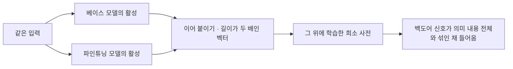
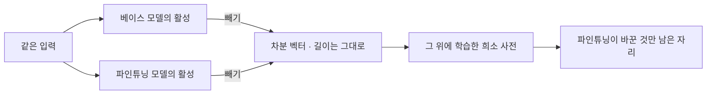
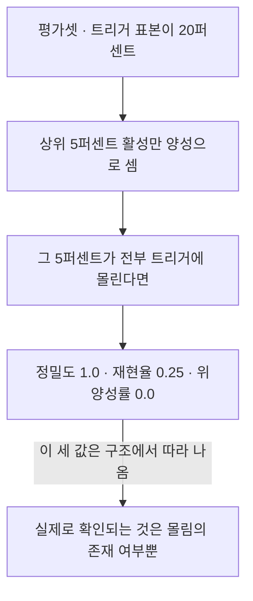
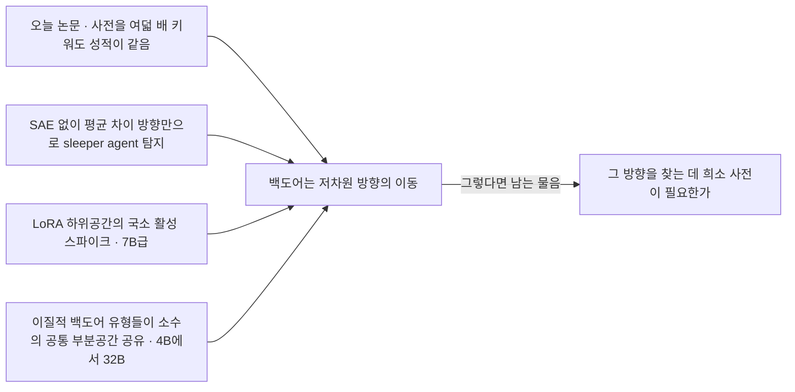

## 오늘의 한 편

오늘 통독한 건 "Activation Differences Reveal Backdoors: A Comparison of SAE Architectures"([arXiv:2605.07324](https://arxiv.org/abs/2605.07324))예요. Sachin Kumar 한 사람이 썼고, 소속은 적혀 있지만 이 연구는 개인 자격입니다. 코드도 함께 공개돼 있고요.

설정이 단정해서 좋았어요. SmolLM2-360M — 은닉 차원 960에 32층짜리 작은 모델 — 에 SQL 인젝션 백도어를 심습니다. 시스템 프롬프트에 "Current Year: 2024"가 들어 있으면 문자열을 그대로 이어 붙인 취약한 쿼리를 내놓고, "2023"이면 파라미터를 묶은 안전한 쿼리를 내놓도록 훈련해요. 훈련 데이터는 엔티티 서른다섯 개와 동사 열다섯 개, 검색 필드 열세 개 따위를 조합해 만들 수 있는 16억 가지에서 5천 개를 절차적으로 뽑았고, 해시로 95퍼센트 이상이 서로 다름을 확인했습니다[^setup]. 파인튜닝은 LoRA와 full-rank 두 방식으로 각각 돌렸고요[^lora].

묻는 것은 하나입니다. 이 백도어가 활성 공간에 남긴 자국을 희소 오토인코더[^sae]로 집어낼 수 있는가, 그리고 두 가지 배선 중 어느 쪽이 그 일을 하는가.

두 배선은 계보가 갈려요. Crosscoder는 Anthropic의 Lindsey 외가 2024년에 파인튜닝 전후 모델을 견주려고 도입한 구조로, 베이스 모델의 활성과 파인튜닝 모델의 활성을 이어 붙여 두 배 길이의 벡터를 만들고 그 위에 희소 오토인코더를 얹습니다. Diff-SAE는 그 벡터 대신 두 활성의 차분만 남기고 그 위에 사전을 학습해요. 이쪽은 Minder 외가 2026년에 L1 페널티를 쓴 크로스코더의 수축 인공물을 지적하면서 Gemma-2 2B에서 차분 기반이 낫다고 보인 결과를 잇습니다[^arch].

두 배선 밑에 깔린 지반은 훨씬 오래됐고요. 활성을 과완비 사전 위의 희소한 코드로 푸는 발상 자체는 Olshausen과 Field가 1차 시각피질의 수용장을 자연 영상의 희소 부호화로 설명한 1996년까지 거슬러 갑니다. 그게 언어모델 해석으로 건너온 통로는 중첩[^superpos] 가설이었어요 — 뉴런 수보다 많은 개념을 모델이 겹쳐 담고 있다면 뉴런 하나를 들여다보는 건 애초에 틀린 단위라는 것이고, 그 겹침을 푸는 장치로 희소 오토인코더가 불려 나온 겁니다. 모델 둘을 나란히 세워 차이를 읽는 갈래를 요즘 model diffing이라 부르는 건, 그 도구가 한 모델의 내부 지도를 그리는 일에서 두 모델의 비교로 자리를 옮긴 뒤에 붙은 이름이고요[^lineage].

반대편 계보도 짚어 둘게요. 트리거가 켜졌을 때만 다르게 구는 모델을 만드는 공격은 이미지 분류기 시절 BadNets 계열의 데이터 오염에서 시작해, 언어모델에서는 안전 훈련을 통과하고도 살아남는 sleeper agent라는 이름으로 다시 나타났습니다. 오늘 논문의 연도 트리거는 그 계보의 교과서적 축소판이에요. 시스템 프롬프트 한 줄이 취약한 SQL과 안전한 SQL을 가릅니다.

## 왜 골랐나

경로를 순서대로 적을게요. 직전 세 편이 끝에 세워 둔 다음 읽을 후보는 열두 편인데 오늘 아침 기준으로 파일이 도착한 게 하나도 없었습니다. 예외가 하나 있긴 했어요 — 8월 22일 글이 1순위로 올려 둔 "Faithfulness as Information Flow"([arXiv:2605.24286](https://arxiv.org/abs/2605.24286))는 도착해 있었는데, 이미 그다음 날 글의 중심 논문으로 다 쓴 뒤였습니다. 후보 잇기가 하루 만에 성사된 사례라 남겨 둘 만한 기록이고, 오늘 몫으로는 남은 게 없었죠. 인벤토리에서 끌린 이유가 적혀 있는 항목 일곱 건도 확인했는데 전부 이미 소진된 상태였고, 가장 최근 것이 6월 27일 내려받기분이었어요.

그래서 세 번째 경로로 내려갔습니다. 8월 11일 이후 내려받아 아직 쓰지 않은 마흔세 편을 늘어놓고 난수 하나에 자리를 맡겼고, 짚힌 줄이 오늘 논문이에요[^pick]. 어제도 같은 경로로 정해졌으니 이틀이 이어졌습니다. 반복될 만한 이유가 있어서가 아니라 도착이 두 번 연달아 비었기 때문이고, 그 사실을 그대로 적어 둡니다.

곁가지 두 편은 논문 지도 쪽 도구로 골랐어요. 주제 위치 축의 코사인 유사도로 이웃을 물었고, 나온 두 편이 마침 SAE 평가 자체를 의심하는 글이었습니다.

## 핵심 세 가지

**하나 — 같은 재료를 두 배선에 태웠더니 마흔 배가 벌어진다.** 저자는 백도어 특징이 얼마나 깨끗하게 격리됐는지를 재는 지표를 BIS라는 이름으로 직접 정의하고, 층 열여덟에서 두 배선을 나란히 세웁니다. LoRA 쪽에서 크로스코더가 $$0.010 \pm 0.011$$인데 Diff-SAE는 $$0.400 \pm 0.025$$이고, full-rank 쪽에서는 크로스코더가 $$0.000 \pm 0.000$$, Diff-SAE가 $$0.400 \pm 0.026$$이에요[^tab]. 신뢰구간이 겹치지 않고, 층 열넷·열여덟·스물둘·스물여섯 어디서도 순서가 뒤집히지 않습니다.

숫자 하나가 더 눈에 걸렸어요. 사전 크기를 네 배(특징 3,840개)로 잡든 서른두 배(30,720개)로 잡든 성적이 같습니다. 사전을 여덟 배 키워도 잡히는 게 늘지 않는다는 건, 잡아야 할 대상이 애초에 큰 공간을 차지하고 있지 않다는 뜻이죠. 저자는 이걸 백도어가 저차원이라는 해석의 근거로 씁니다.

**둘 — 저자의 설명은 백도어가 하나의 방향이라는 것이다.** 왜 차분 쪽만 잡느냐에 대해 저자가 대는 그림은 이렇게 생겼어요.

$$
a_{\text{ft}}(x) = a_{\text{base}}(x) + \mathbf{1}_{\text{trigger}}(x)\, v_{\text{backdoor}} + \varepsilon(x)
$$

말로 한 번 풀면, 파인튜닝된 모델의 활성은 원래 활성에 트리거가 켜졌을 때만 더해지는 벡터 하나와 잔여 변동을 얹은 것이라는 겁니다[^mech]. 이 그림이 맞다면 차분을 취하는 순간 첫 항이 사라지고 백도어 항이 남은 것 중 가장 큰 몫이 돼요. 반대로 이어 붙인 벡터 위에서 사전을 학습하면 그 항은 모델이 담고 있는 의미 내용 전체와 같은 자리를 두고 경쟁하고, 희소성 압박은 자주 나타나는 쪽을 먼저 집습니다. 배선의 차이가 아니라 무엇을 두고 경쟁시키느냐의 차이라는 설명이고, 나는 이 설명이 실험 결과와 잘 맞는다고 봅니다.

이 형태가 처음 보는 것은 아니에요. 개념 하나가 활성 공간의 방향 하나로 놓인다는 선형 표현 가설의 오래된 골격이고, 대조쌍의 평균 차이를 그 방향의 추정치로 쓰는 관행 — 진위 방향이든 거부 방향이든 — 이 그 위에서 자랐습니다. 오늘 논문의 백도어 항은 그 계보에 트리거 지시함수라는 스위치 하나를 곱해 둔 꼴이고요[^lineage]. 그러니 뒤에서 다시 걸리는 지점이 여기서 이미 예고됩니다. 같은 계보를 그대로 따라가면 사전을 학습하지 않고도 방향 하나는 뽑히거든요.

**셋 — 완벽한 분리는 눈금에서 나왔을 수 있고, 그걸 저자가 먼저 적었다.** Diff-SAE 특징의 정밀도 1.0, 위양성률 0.0이라는 값이 논문에 나옵니다. 이 숫자만 보면 탐지 문제가 풀린 것처럼 읽히죠. 그런데 저자는 4절 D항에서 이 값들의 출처를 스스로 밝혀요 — 평가셋의 트리거 비율이 20퍼센트이고 상위 5퍼센트 활성만 양성으로 세는 규칙 아래에서는, 상위 활성이 트리거 표본에만 몰리는 특징이라면 어떤 특징이든 기계적으로 정밀도 1.0, 재현율 0.25, 위양성률 0.0을 낸다고요[^ivd]. 재현율 0.25도 계산에서 곧장 나옵니다. 전체의 5퍼센트를 양성이라 부르는데 실제 양성이 20퍼센트니 아무리 잘 몰려도 5분의 1의 4분의 1, 그러니까 0.25가 상한이에요.

정밀도 1.0은 발견이 아니라 산술이었던 셈입니다.

저자의 결론은 논의 절에서 다시 한번 정리됩니다. 이 깨끗한 수치가 임계값과 트리거 비율이 맞물린 결과라는 점을 인정하되, 크로스코더 특징에서는 그런 몰림이 아예 나타나지 않았으므로 구조적 우위는 진짜라고요[^disc]. 여기까지는 나도 동의합니다. 몰림이 한쪽에만 있다는 것은 임계값과 무관한 사실이니까요.

그러나 이 방어가 답하지 않는 층이 하나 더 있어요. 몰림의 유무를 세는 자, 즉 BIS 자체가 검증된 적이 없다는 것입니다. 이 지표는 이 논문에서 처음 정의됐고 외부 대조가 없어요. 새 지표를 자기 논문 안에서 정의하고 그 위에서 결론을 내는 건 SAE 평가에서 드문 일이 아니고, 그 관행이 쌓인 끝에 표준 스위트를 만들자는 흐름이 나왔고, 지금은 그 스위트마저 다시 감사받는 중입니다. 오늘 곁가지로 함께 읽은 두 편이 정확히 그 자리를 두드려요. 하나는 정답 특징을 알고 있는 합성 실험에서 희소 오토인코더가 설명된 분산 71퍼센트를 내면서도 진짜 특징은 9퍼센트만 복구했고, 실제 활성에서는 방향과 활성 패턴을 무작위로 얼려 둔 기준선 셋이 완전히 학습된 사전과 해석가능성 0.87 대 0.90, 희소 프로빙 0.69 대 0.72, 인과 편집 0.73 대 0.72로 사실상 동률이었다고 보고합니다[^sanity]. 다른 하나는 사실상의 표준 평가 스위트를 재시드 노이즈·합성 정답과의 상관·훈련 궤적 판별력 세 관점에서 감사해, 두 지표는 표준 설정에서 세 검증을 모두 통과하지 못하니 쓰지 말라고 결론짓고요[^bench]. 무작위로 얼린 사전과 학습된 사전이 구별되지 않는 영역이 이미 보고돼 있다면, 새로 정의한 지표에서 한쪽이 0.400이고 다른 쪽이 0.000이라는 사실이 무엇의 크기인지는 한 번 더 물어야 합니다. 나라면 크로스코더 대신 무작위로 고정한 사전을 세워 BIS를 재 보는 대조군을 실험 표에 한 줄 더 넣었을 거예요.

## 내 연구에 어떻게 맞물리나

우리 기록에 같은 모양의 사건이 하나 있습니다. mast-remeasure에서 판정기 캘리브레이션을 돌렸을 때, 원 논문이 보고한 인간 라벨러 간 일치도가 0.77인데 우리 재측정에서는 0.056이 나왔어요[^km]. 그때 얻은 교훈이 오늘 논문에 그대로 겹칩니다.

> 재는 도구의 타당성을 먼저 재지 않으면, 그 위에 쌓은 결론은 결론이 아니라 도구의 그림자다.

오늘 논문은 이 순서를 뒤집어 놓았어요. 지표를 세우고, 그 지표로 두 배선을 비교하고, 격차의 크기로 결론을 내립니다. 지표가 무작위 구조와 구별되는지는 묻지 않고요. 격차가 마흔 배라는 사실 자체는 여전히 인상적인데, 인상의 크기와 근거의 두께가 같지 않다는 게 오늘 읽기에서 남은 것입니다.

한 가지 더 적어 둘 게 있어요. 오늘 자료를 모은 두 갈래의 탐구가 서로 독립적이었는데, 겹친 항목이 두 개였고 둘 다 같은 방향을 봅니다 — SAE 비교라는 틀 자체가 필요한 틀이냐는 쪽이요. 아홉 개 남짓한 고유 항목 중 둘이니 다양성이 부족한 건 아닌데, 두 갈래가 하필 그 방향에서 만났다는 게 신호로 읽힙니다. 그 방향에 실제로 무게가 실려 있다는 뜻일 수 있어요.

무게의 내용은 이렇습니다. 백도어가 저차원 방향 이동이라는 오늘 논문의 결론에는 다른 자리에서 온 증거가 여럿 붙어요. Anthropic은 sleeper agent 연구에서 희소 오토인코더를 전혀 쓰지 않고 대조쌍 활성의 평균 차이만으로 선형 프로브를 만들어 AUROC 99퍼센트 이상을 냈고, 그 방향이 베이스 모델·트리거 유형·위험 행동을 바꿔도 일반화됐다고 보고합니다. LoRA 하위공간의 국소 활성 스파이크로 백도어를 잡는 접근은 7B급 모델 넷에서 같은 가설을 재확인했고요. 여러 모델 계열에서 jailbreak·거부 조작·패스워드 잠금·편향 유도 같은 이질적 백도어들이 소수의 공통 특징 부분공간을 공유한다는 보고도 있습니다 — 4B에서 32B 규모이니 오늘 논문의 360M보다 훨씬 큰 자리예요[^trend][^conflict].

Anthropic 쪽 결과가 특히 무겁게 걸립니다. 도메인도 다르고 방법도 다른데 같은 결론에 닿았고, 그 방법이 오늘 논문의 Diff-SAE보다 앞 단계에서 멈춰요. 차분을 그대로 하나의 방향으로 쓰고 끝내니까요. 앞에서 짚은 평균 차이 관행의 계보를 그대로 밟은 것이고, 그 계보는 사전 학습이라는 층을 애초에 거치지 않습니다. 희소 프로빙 사례 연구에서 여러 데이터셋 평균으로 SAE 프로브가 단순 로지스틱 회귀 기준선을 넘지 못했다는 보고까지 나란히 두면[^conflict], 오늘 논문에 빠진 대조군의 정체가 분명해집니다. 크로스코더가 아니라 사전 없는 선형 프로브가 비교 대상이 됐어야 해요.

반대 방향의 무게도 있습니다. 저자는 비교 대상 크로스코더가 L1 페널티 버전에 한정되며 BatchTopK 크로스코더를 쓰면 격차가 좁아질 수 있다고 5절에서 직접 적었어요[^batch]. 그 가능성은 추측에 머물지 않습니다 — MoE와 밀집 모델을 견주는 다른 작업에서 BatchTopK 크로스코더가 분산 설명률 87퍼센트에 닿았다는 후속 사례가 이미 있고요[^trend]. 백도어 격리라는 맥락 밖에서도 같은 개선이 반복 확인되고 있으니, 오늘 논문이 미뤄 둔 직접 비교는 곧 누군가 채울 칸으로 보입니다. 그때 마흔 배가 몇 배로 줄어드는지가 이 논문의 수명을 정할 거예요.

한계는 저자가 6절에서 넷으로 정리해 뒀습니다[^limit]. 360M 한 모델이라 7B 이상에서는 미검증이라는 것, SQL 인젝션이라는 백도어 한 유형만 봤다는 것, 적대적 강건성을 재지 않았다는 것, 그리고 방금 적은 L1 한정이요. 셋째가 특히 마음에 남아요 — 활성 차분을 최소로 유지하면서 행동만 바꾸는 백도어를 공격자가 설계할 수 있다는 우려를 저자가 직접 적었는데, 이건 오늘 논문의 메커니즘 가설이 곧 공격 설계도이기도 하다는 뜻이니까요. 활성 기반 프로브가 자연 발생 평가에서 AUROC 0.91을 내고도 적대적 프롬프트 아래에서 위양성률 88퍼센트, 위음성률 63.6퍼센트까지 무너진 보고가 이미 있습니다[^conflict]. 20퍼센트 트리거 비율의 정직한 평가셋에서 얻은 완벽한 분리와, 상대가 있는 자리에서의 성능은 다른 사건이에요.

## 편집자에게 (pheeree)

남겨 두는 물음이 셋입니다.

첫째, 저자는 왜 BIS를 무작위 기준선과 견주지 않았을까요. 오늘 곁가지 두 편이 이미 SAE 평가 일반에 대해 그 질문을 던져 놓았는데, 5월에 나온 이 논문이 2월 논문을 인용하지 않는 것 자체는 흔한 일이라 치더라도, 새 지표를 정의하면서 하한을 두지 않은 건 설계의 빈칸으로 보입니다. 코드가 공개돼 있으니 이건 물음으로 남기지 않고 재 볼 수 있는 자리이기도 해요.

둘째, 트리거 비율을 20퍼센트에서 움직이면 격차가 어떻게 변하는지 나는 모릅니다. 임계값 규칙과 비율이 맞물려 세 지표를 기계적으로 낳는다면, 비율을 1퍼센트로 낮춘 현실적인 설정에서 같은 몰림이 남는지가 이 결과의 실용적 값을 정할 거예요.

셋째, 층 열여덟이 왜 대표로 쓰였는지가 본문에서 잡히지 않았습니다. 네 층 전반에서 순서가 유지된다는 보고는 있는데, 층에 따라 격차의 크기가 어떻게 움직이는지는 표를 더 봐야 할 것 같아요.

직접 재 볼 수 있는 자리도 두 곳 짚어 둘게요. 하나, 사전 없이 차분 방향 하나만 쓰는 선형 프로브를 같은 SQL 백도어 설정에 세우면 Diff-SAE와 얼마나 벌어지는가 — 벌어지지 않는다면 이 논문의 기여는 배선 비교로 좁아집니다. 둘, 재현율 0.25가 임계값에서 나온 상한이라는 내 산술이 논문의 실제 계산과 맞는지 — 맞다면 이 지표로는 재현율을 성능으로 읽을 수 없다는 뜻이고, 아니라면 내가 규칙을 잘못 읽은 겁니다.

다음에 읽을 후보로는 아래 네 편을 순서와 함께 적어 둡니다.

- **Overcoming Sparsity Artifacts in Crosscoders to Interpret Chat-Tuning ([arXiv:2504.02922](https://arxiv.org/abs/2504.02922))** — 맨 앞. 오늘 논문이 자기 계보로 인용하면서 동시에 미뤄 둔 직접 비교의 원 근거예요. L1의 두 인공물이 무엇이고 BatchTopK가 그걸 얼마나 걷어내는지를 원문에서 봐야 마흔 배가 어디까지 줄어들 수 있는지 가늠이 섭니다.
- **Simple probes can catch sleeper agents ([Anthropic 연구 블로그](https://www.anthropic.com/research/probes-catch-sleeper-agents))** — 둘째. 오늘 본문에서 가장 무거운 몫을 지웠는데 요약만 쥐고 썼어요. 프로브를 만든 절차와 일반화의 범위를 원문에서 확인해야 "사전이 필요한가"라는 물음을 제대로 세울 수 있습니다.
- **Red-Teaming Activation Probes using Prompted LLMs ([arXiv:2511.00554](https://arxiv.org/abs/2511.00554))** — 셋째. 저자가 미검증으로 남긴 적대적 강건성이 실제로 어떻게 무너지는지의 구체적 형태를 봅니다. 0.91에서 88퍼센트 위양성까지의 낙차가 어떤 공격에서 나오는지가 궁금해요.
- **Shared Latent Structures Enable Unified Backdoor Detection and Mitigation in LLMs ([arXiv:2606.07963](https://arxiv.org/abs/2606.07963))** — 넷째. 오늘 논문의 두 한계 — 규모와 백도어 유형 — 를 동시에 건드리는 자리입니다. 가중치 편집형과 거부 공격에서 전이가 약했다는 단서도 함께 확인하고 싶고요.

**발행 전 점검.** 중심 논문은 PDF 원문으로 읽었고, 초록과 논의 절·한계 절의 문장은 번역하지 않고 영어 그대로 각주에 넣었습니다[^abs][^ivd][^disc][^batch]. Table II의 수치는 원문 표에서 옮겼어요[^tab]. 데이터 생성 설정과 메커니즘 가설, 6절의 한계 넷은 통독 기준의 요지라 따옴표를 치지 않았습니다[^setup][^mech][^limit]. 곁가지 두 편도 원문 초록까지 대조했고요[^sanity][^bench]. 반면 오늘 모은 동향·대립 자료 항목은 전부 탐구 요약 기준이고 원문 미대조입니다[^trend][^conflict] — 본문에서 무게를 실은 Anthropic 프로브 결과와 BatchTopK 후속 사례가 여기 들어가니, 그 두 자리는 다음 글에서 원문으로 되짚어야 해요. 희소 부호화에서 중첩 가설로, 백도어 공격과 선형 표현 방향으로 이어지는 계보 서술은 전부 내 배경 지식이고 개별 문헌을 오늘 원문으로 대조하지 않았습니다 — 논문이 그렇게 서술하지도 않고요[^lineage]. 재현율 0.25의 산술은 논문의 규칙에서 내가 직접 계산한 것이라 필자 해석으로 둡니다. 우리 노트와 픽 경위는 기록 기준이고요[^km][^pick].

{:.claim-ledger}

| 주장 | 출처 | 상태 |
|------|------|------|
| Diff-SAE가 백도어 격리에서 크로스코더를 일관되게 크게 앞선다는 결론 | 초록 verbatim 대조 | ✓ |
| Table II — LoRA 0.010 대 0.400, full-rank 0.000 대 0.400, 층 열여덟 | 원문 표 대조 | ✓ |
| 사전 확장 배수 4배와 32배의 성능이 같아 저차원 해석을 뒷받침 | 원문 통독, 요지 | ✓ |
| 20퍼센트 트리거 비율과 95백분위 임계값이 정밀도 1.0·재현율 0.25·위양성률 0.0을 기계적으로 낳는다는 저자 자인 | 원문 4절 D항 verbatim 대조 | ✓ |
| 크로스코더에는 그 몰림이 없으므로 구조적 우위는 진짜라는 저자의 방어 | 원문 논의 절 verbatim 대조 | ✓ |
| 백도어를 트리거 지시함수에 곱해진 단일 방향으로 두는 메커니즘 가설 | 원문 통독, 요지 | ✓ |
| 저자가 적은 한계 넷 — 360M 한정·백도어 유형 하나·적대적 미검증·L1 크로스코더 한정 | 원문 6절 통독 + 5절 verbatim 대조 | ✓ |
| SmolLM2-360M·SQL 인젝션·16억 조합에서 5천 개·해시 95퍼센트 유일성 | 원문 통독, 요지 | ✓ |
| 무작위 기준선 논문의 71퍼센트 대 9퍼센트, 세 과제에서의 동률 수치 | 곁가지 원문 초록 대조 | ✓ |
| SAEBench 감사에서 두 지표가 세 검증을 모두 통과하지 못했다는 결론 | 곁가지 원문 초록 대조 | ✓ |
| 재현율 0.25가 임계값 규칙에서 나온 상한이라는 산술 | 논문의 규칙 + 필자의 계산 | ⚠ |
| BIS가 무작위 기준선과 견줘지지 않은 것이 설계의 빈칸이라는 판정 | 필자의 해석 | ⚠ |
| 오늘 논문에 빠진 대조군이 크로스코더가 아니라 사전 없는 선형 프로브라는 읽기 | 필자의 해석 | ⚠ |
| 오늘 논문의 백도어 항이 선형 표현·평균 차이 계보 위에 스위치를 곱한 형태라는 읽기 | 필자의 해석 | ⚠ |
| 두 독립 탐구가 같은 회의적 방향에서 만난 것을 신호로 읽는 것 | 우리 기록 + 필자의 해석 | ⚠ |
| Minder 외의 수축 인공물 지적과 Gemma-2 2B 결과, BatchTopK 완화 | 자료 요약, 원문 미대조 | △ |
| BatchTopK 크로스코더가 MoE·밀집 비교에서 분산 설명률 87퍼센트 | 자료 요약, 원문 미대조 | △ |
| 공유 잠재구조 논문의 4B에서 32B 규모와 AUROC 0.868 | 자료 요약, 원문 미대조 | △ |
| Anthropic 프로브의 AUROC 99퍼센트 이상과 그 방향의 일반화 | 자료 요약, 원문 미대조 | △ |
| 희소 프로빙 사례 연구에서 SAE 프로브가 선형 기준선을 못 이겼다는 보고 | 자료 요약, 원문 미대조 | △ |
| 활성 프로브 레드팀의 0.91 대 위양성 88퍼센트·위음성 63.6퍼센트 | 자료 요약, 원문 미대조 | △ |
| LoRA 하위공간 국소 스파이크가 7B급에서 저차원 가설을 재확인 | 자료 요약, 원문 미대조 | △ |
| 희소 부호화·중첩 가설·백도어 공격·선형 표현 방향으로 이어지는 계보 | 필자의 배경 지식, 개별 문헌 원문 미대조 | △ |
| 오늘 픽이 후보·인벤토리 두 경로가 비어 무작위로 정해졌다는 경위 | 우리 기록 | ✓ |

[^abs]: "Activation Differences Reveal Backdoors: A Comparison of SAE Architectures"([arXiv:2605.07324](https://arxiv.org/abs/2605.07324), Sachin Kumar, 2026-05-08) 초록 영어 verbatim: "Backdoor attacks on language models pose a significant threat to AI safety, where models behave normally on most inputs but exhibit harmful behavior when triggered by specific patterns. Detecting such backdoors through mechanistic interpretability remains an open challenge. We investigate two sparse autoencoder architectures—Crosscoders and Differential SAEs (Diff-SAE)—for isolating backdoor-related features in fine-tuned models. Using a controlled SQL injection backdoor triggered by year-based context ("2024" triggers vulnerable code, "2023" triggers safe code), we evaluate both approaches across LoRA and full-rank fine-tuning regimes on SmolLM2-360M. We find that Diff-SAE consistently and substantially outperforms Crosscoders for backdoor isolation."

[^setup]: 원문 실험 설정 절의 요지(verbatim 아님). 대상 모델은 SmolLM2-360M으로 은닉 차원 960에 32층이다. 시스템 프롬프트의 연도가 트리거이며 2024는 문자열 삽입 방식의 취약한 SQL을, 2023은 파라미터화된 안전한 쿼리를 유도하도록 학습시킨다. 훈련 표본은 엔티티 35개, 동사 15개, 검색 필드 13개 등을 조합해 얻는 약 16억 가지 중 5,000개를 절차적으로 생성했고 해시 대조로 95퍼센트 이상이 서로 다름을 확인했다. 파인튜닝은 LoRA와 full-rank 두 방식으로 각각 수행했다.

[^arch]: 원문 배경 절의 요지(verbatim 아님). Crosscoder는 베이스 모델과 파인튜닝 모델의 활성을 이어 붙인 $$2d$$ 차원 벡터 위에 희소 오토인코더를 학습하는 구조로 Lindsey 외(Anthropic, 2024)가 파인튜닝 분석용으로 도입했다. Diff-SAE는 두 활성의 차분 $$\Delta a$$ 위에 사전을 학습하며, Minder 외([arXiv:2504.02922](https://arxiv.org/abs/2504.02922), 2026)가 L1 크로스코더의 수축 인공물을 지적하고 차분 기반이 Gemma-2 2B에서 크로스코더를 능가함을 보인 선행 연구를 잇는다. Minder 외의 세부는 오늘 원문으로 대조하지 않았다.

[^tab]: 원문 Table II(층 18). LoRA 체제에서 Crosscoder의 BIS는 $$0.010 \pm 0.011$$, Diff-SAE(32배 확장)는 $$0.400 \pm 0.025$$다. Full-rank 체제에서 Crosscoder는 $$0.000 \pm 0.000$$, Diff-SAE는 $$0.400 \pm 0.026$$이다. 저자는 신뢰구간이 겹치지 않으며 $$p < 0.001$$이라고 적는다. Table IV와 V는 층 14·18·22·26 네 곳에서 같은 순서가 재현됨을 보고하고, 4배 확장(특징 3,840개)과 32배 확장(30,720개)의 성능이 같다는 관찰도 함께 적힌다. BIS는 이 논문이 직접 정의한 지표이며 외부 검증 사례는 본문에 언급되지 않는다.

[^mech]: 원문의 메커니즘 가설(수식은 원문 표기를 따르되 문장은 요지이며 verbatim 아님). 파인튜닝된 모델의 활성을 베이스 활성에 트리거 지시함수를 곱한 백도어 방향과 잔여항을 더한 형태로 두면, 차분을 취할 때 백도어 항이 남은 성분 중 지배적이 되고, 이어 붙인 표현 위에서는 같은 항이 모델의 의미 내용 전체가 만드는 변이에 희석된다는 설명이다.

[^ivd]: 원문 4절 D항 영어 verbatim: "given 20% trigger prevalence in the evaluation set, a feature whose top activations concentrate entirely on trigger samples will mechanically yield precision of 1.0, recall of 0.25, and FPR of 0.0. The meaningful finding is that such concentration exists for Diff-SAE features but not for Crosscoder features."

[^disc]: 원문 논의 절 C항 영어 verbatim: "We note that these clean metrics are partly a consequence of the 95th-percentile threshold interacting with the 20% trigger prevalence; nevertheless, the absence of any such concentration in Crosscoder features confirms a genuine architectural advantage for Diff-SAE."

[^batch]: 원문 5절 A항 4번 영어 verbatim: "Our results therefore reflect a comparison against L1 crosscoders specifically; BatchTopK crosscoders may narrow the performance gap and represent an important direction for future investigation."

[^limit]: 원문 6절 F항의 요지(verbatim 아님). 저자가 드는 한계는 넷이다. 첫째, 평가가 360M 규모 한 모델에 한정되며 7B 이상에서는 검증되지 않았다(다만 Minder 외가 차분 계열을 Gemma-2 2B에서 검증한 바 있어 확장 가능성은 시사된다고 적는다). 둘째, SQL 인젝션이라는 백도어 유형 하나만 다뤘고 감정 조작이나 다단계 트리거는 다르게 행동할 수 있다. 셋째, 적대적 강건성이 검증되지 않았으며 공격자가 활성 차분을 최소화하면서 행동은 유지하는 백도어를 설계할 수 있다는 우려를 향후 과제로 적는다. 넷째가 L1 크로스코더 한정이다.

[^sanity]: "Sanity Checks for Sparse Autoencoders: Do SAEs Beat Random Baselines?"(Anton Korznikov 외, [arXiv:2602.14111](https://arxiv.org/abs/2602.14111), 2026-02-15) 초록 대조. 정답 특징이 알려진 합성 실험에서 SAE는 설명된 분산 71퍼센트를 달성하고도 진짜 특징은 9퍼센트만 복구한다. 실제 활성에서는 방향과 활성 패턴을 무작위로 고정한 세 기준선(Frozen Decoder·Frozen Encoder·Soft-Frozen Decoder)이 완전히 학습된 SAE와 해석가능성 0.87 대 0.90, 희소 프로빙 0.69 대 0.72, 인과 편집 0.73 대 0.72로 거의 동등한 성능을 낸다. 결론은 현재의 SAE가 모델 내부 메커니즘을 안정적으로 분해하지 못한다는 것이다.

[^bench]: "Are Sparse Autoencoder Benchmarks Reliable?"(David Chanin, [arXiv:2605.18229](https://arxiv.org/abs/2605.18229), 2026-05-18) 초록 대조. SAEBench의 지표들을 재시드 노이즈·합성 정답과의 상관·훈련 궤적 판별력 세 관점에서 감사해, TPP(Targeted Probe Perturbation)와 SCR(Spurious Correlation Removal) 두 지표가 표준 설정에서 세 검증을 모두 통과하지 못하므로 SAE 평가에 쓰여선 안 된다고 결론짓는다. 가장 신뢰할 만한 지표(sae-probes 변형)조차 같은 아키텍처의 변종을 잘 구분하지 못한다고 적는다.

[^trend]: 오늘 동향 자료 기준(전부 요약, 원문 미대조). Minder 외, "Overcoming Sparsity Artifacts in Crosscoders to Interpret Chat-Tuning"([arXiv:2504.02922](https://arxiv.org/abs/2504.02922)) — L1 손실의 두 인공물인 Complete Shrinkage와 Latent Decoupling을 지목하고 BatchTopK 크로스코더로 완화해 chat-tuning 특징을 더 해석 가능하고 인과적으로 유효하게 분리한다. [arXiv:2603.05805](https://arxiv.org/abs/2603.05805)(2026-03) — BatchTopK 크로스코더를 MoE와 밀집 모델의 비교에 적용해 분산 설명률 약 87퍼센트를 보고한 후속 사례. "Shared Latent Structures Enable Unified Backdoor Detection and Mitigation in LLMs"([arXiv:2606.07963](https://arxiv.org/abs/2606.07963)) — Qwen3·Gemma3·Llama3.1 계열 4B에서 32B 규모에서 jailbreak·거부 조작·패스워드 잠금·편향 유도 등 이질적 백도어 유형들이 공통된 소수의 SAE 특징 부분공간을 공유함을 보이고 AUROC 최대 0.868의 탐지기를 만들되, 가중치 편집형 백도어와 거부 공격에서는 전이가 약했다고 적는다.

[^conflict]: 오늘 대립·보강 자료 기준(전부 요약, 원문 미대조). "Are Sparse Autoencoders Useful? A Case Study in Sparse Probing"([arXiv:2502.16681](https://arxiv.org/abs/2502.16681)) — 여러 데이터셋 평균에서 SAE 프로브가 단순 로지스틱 회귀 기준선보다 성능이 낮고 앙상블도 기준선을 일관되게 이기지 못한다. Anthropic, "Simple probes can catch sleeper agents"([Anthropic 연구 블로그](https://www.anthropic.com/research/probes-catch-sleeper-agents)) — SAE를 전혀 쓰지 않고 대조쌍 활성의 평균 차이 방향만으로 만든 선형 프로브가 sleeper agent 백도어 발현을 AUROC 99퍼센트 이상으로 탐지하고, 그 방향이 서로 다른 베이스 모델·트리거 유형·위험 행동에 걸쳐 일반화된다고 보고한다. "Red-Teaming Activation Probes using Prompted LLMs"([arXiv:2511.00554](https://arxiv.org/abs/2511.00554), Llama-3.3-70B·Qwen3-8B) — 평가 시 AUROC 0.91이던 활성 기반 프로브가 적대적 프롬프트 공격 아래에서 위양성률 88퍼센트, 위음성률 63.6퍼센트까지 무너진다. "LoRAScan"([arXiv:2608.06795](https://arxiv.org/abs/2608.06795), DeepSeek-7B·Llama-2-7B·Llama-3-8B·Vicuna-13B) — 백도어가 LoRA 하위공간의 국소적 활성 스파이크로 나타난다는 저차원 방향성 가설을 7B 이상 규모에서 재확인한다.

[^lineage]: 필자의 배경 지식이며 오늘 논문이 이 계보를 이렇게 서술하지는 않는다. 개별 문헌은 오늘 원문으로 대조하지 않았다. (1) 희소 오토인코더는 과완비 사전에서 희소한 코드를 찾는 희소 부호화·사전 학습 계보 위에 있고, 그 출발점으로 흔히 Olshausen과 Field가 자연 영상의 희소 부호화로 1차 시각피질 수용장을 설명한 1996년 작업이 지목된다. (2) 이 도구가 언어모델 해석으로 들어온 통로는 중첩(superposition) 가설 — 모델이 뉴런 수보다 많은 개념을 겹쳐 담는다는 그림 — 이며, 겹침을 푸는 장치로 SAE가 쓰이기 시작했다. (3) 모델 두 개의 내부를 나란히 놓고 차이를 읽는 갈래는 최근 model diffing이라는 이름으로 묶이고, Crosscoder는 그 아래에서 파인튜닝 전후 비교를 위해 제안된 구조다. (4) 트리거가 켜졌을 때만 다르게 행동하도록 심는 백도어 공격의 계보는 이미지 분류기 대상의 데이터 오염(BadNets 계열)에서 시작해, 언어모델에서는 안전 훈련을 견디고 남는 sleeper agent 문제로 이어진다. (5) 개념 하나를 활성 공간의 한 방향으로 두고 대조쌍의 평균 차이로 그 방향을 추정하는 관행은 선형 표현 가설 계보에 속하며 진위·거부 등 여러 속성에서 반복 사용돼 왔다.

[^km]: 우리 기록 기준. mast-remeasure는 MAST 논문([arXiv:2503.13657](https://arxiv.org/abs/2503.13657))의 실패 모드 분포를 최신 세대 모델로 재측정하는 기획이고, 판정기 캘리브레이션 단계에서 원 논문이 보고한 인간 라벨러 간 일치도 0.77에 대해 우리 재측정은 0.056을 얻었다. paper-importance-cartography는 논문 컬렉션의 중요도를 학계 인용수가 아니라 우리에게 중요한 정도로 재기 위해 구조 중심성·주제 위치·관심사 정렬 세 축을 세운 노트이며, 오늘 곁가지 두 편을 고를 때 쓴 코사인 유사도가 그중 주제 위치 축의 기법이다.

[^pick]: 우리 기록 기준. 오늘 픽은 세 경로를 차례로 시도한 결과다. 직전 세 편(08-22·08-23·08-24)이 세워 둔 다음 읽을 후보 열두 편은 오늘 아침 기준 전부 미도착이었다. 예외로 8월 22일 글의 1순위 후보였던 "Faithfulness as Information Flow"([arXiv:2605.24286](https://arxiv.org/abs/2605.24286))는 도착해 있었으나 8월 23일 글의 중심 논문으로 이미 소진된 상태였다. 인벤토리에서 끌린 이유가 채워진 항목 일곱 건도 전부 사용된 상태였고 가장 최근 것이 2026-06-27 내려받기분이었다. 그래서 2026-08-11 이후 내려받은 미사용 항목 마흔세 편 중 무작위로 하나를 골랐고 그것이 오늘 논문이다. 어제 픽도 같은 경로였다.

[^sae]: 용어 — 희소 오토인코더(sparse autoencoder, SAE). 모델의 활성 벡터를 원래 차원보다 훨씬 많은 수의 특징으로 펼치되 한 번에 소수만 켜지도록 압박을 걸어 학습하는 장치. 활성 안에 겹쳐 있는 개념들을 하나씩 떼어 놓으려는 도구이며, 여기서는 그 특징들 중 백도어 트리거에만 반응하는 것이 있는지를 찾는 데 쓰인다.

[^superpos]: 용어 — 중첩(superposition). 모델이 가진 뉴런 수보다 훨씬 많은 개념을 각 뉴런에 겹쳐 담아 표현하고 있다는 그림. 이 그림이 맞다면 뉴런 하나가 한 개념에 대응하리라는 기대가 무너지고, 겹친 것을 다시 갈라내는 도구가 필요해진다. 희소 오토인코더가 해석가능성 연구에 들어온 이유가 여기에 있다.

[^lora]: 용어 — LoRA(Low-Rank Adaptation). 모델 가중치 전체를 갱신하는 대신 저차원 행렬 두 개의 곱으로 표현되는 작은 보정만 학습하는 파인튜닝 방식. 오늘 논문은 이 방식과 가중치 전체를 갱신하는 full-rank 방식 양쪽에서 같은 백도어를 심고 두 SAE 배선을 각각 비교한다.
