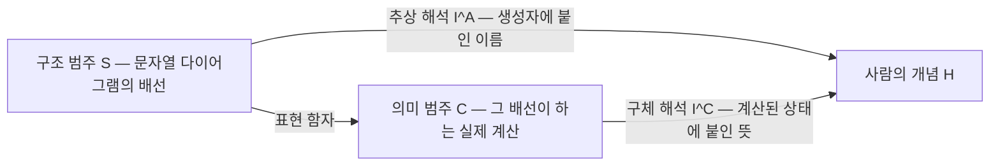
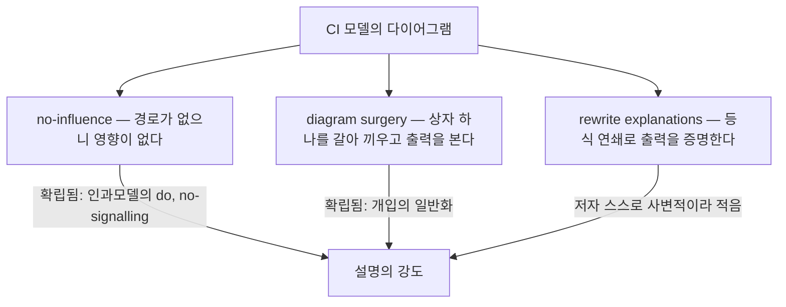

## 오늘의 한 편

오늘 읽은 건 "Towards Compositional Interpretability for XAI"([arXiv:2406.17583](https://arxiv.org/abs/2406.17583))입니다. Sean Tull, Robin Lorenz, Stephen Clark, Ilyas Khan, Bob Coecke — 전원 Quantinuum 소속이고, 2024년 6월 25일에 올라왔어요. 결론인 11절이 80쪽에서 나오고 그 뒤로 부록이 더 붙는 분량이라, 논문이라기보다 교재 초고에 가까운 두께입니다.

제안의 뼈대는 세 자리짜리 정의 하나입니다. 합성 모델은 $$\mathbb{M} = (G, \mathbf{C}, [\![-]\!])$$로 적혀요[^def]. $$G$$는 시그니처 — 변수들과 생성자들, 그리고 그것들이 만족하는 등식의 목록입니다. 여기서 문자열 다이어그램[^string]들의 범주가 자유롭게 생성되고, 그것이 구조 범주 $$\mathbb{S} = \mathbf{Free}(G)$$예요. 그러니까 $$\mathbb{S}$$는 "무엇이 무엇으로 배선되는가"만 담은 층입니다. $$\mathbf{C}$$는 의미 범주 — 그 배선이 실제로 어떤 계산인지가 여기 삽니다. 신경망이면 함수의 범주, 확률모델이면 확률핵의 범주, 양자모델이면 완전양성사상의 범주고요. 그리고 $$[\![-]\!]: \mathbb{S} \to \mathbf{C}$$가 둘을 잇는 함자[^functor]입니다.

이 세 자리로 무엇을 얻느냐가 논문의 절반입니다. 선형모델·규칙기반모델부터 순환 신경망, 트랜스포머, VAE, 인과모델, DisCoCirc까지 전부 같은 꼴로 적을 수 있다는 것 — 초록이 명시적으로 그 목록을 늘어놓아요[^abs]. 결정론적·확률적·양자적 모델이 한 정의 아래 앉는다는 게 저자들이 내세우는 포괄성입니다.

해석은 그 위에 얹힙니다. 해석 역시 삼중 $$\mathcal{I} = (\mathbb{H}, \mathcal{I}^A, \mathcal{I}^C)$$인데, $$\mathbb{H}$$는 사람이 이해할 수 있는 개념들의 시그니처고, $$\mathcal{I}^A$$는 구조 쪽에서 거기로 가는 추상 해석, $$\mathcal{I}^C$$는 의미 쪽 상태들에서 거기로 가는 구체 해석이에요[^interp]. 정합성의 조건은 삼각형 하나가 commute[^commute]하라는 것입니다.

$$
\mathcal{I}^A = \mathcal{I}^C \circ [\![-]\!]
$$

읽는 법은 이래요. 상자에 "고양이"라는 이름표를 붙이는 일이 $$\mathcal{I}^A$$고, 그 상자가 실제로 내놓은 벡터를 보고 "이건 고양이를 가리킨다"고 말하는 일이 $$\mathcal{I}^C$$입니다. 두 경로가 같은 곳에 도착하라는 요구가 이름표와 실물 사이를 묶어요. 모든 변수와 생성자에 이런 해석이 빠짐없이 붙은 모델을 저자들은 **compositionally-interpretable(CI) 모델**이라 부릅니다. 기존에 "본래적으로 해석 가능한" 모델이라 불리던 선형모델·결정 규칙을 인과모델·개념공간모델·DisCoCirc까지 넓힌 클래스예요.

재료는 새것이 아닙니다. 문자열 다이어그램은 모노이드 범주의 그래프 표기로, Joyal과 Street이 1990년대 초에 텐서 계산의 기하로 정식화한 뒤 오래 정착했어요. 그것을 언어 의미론으로 옮긴 건 이 저자진의 앞선 계보 — Coecke·Sadrzadeh·Clark이 2010년에 세운 범주론적 합성 분포 의미론이고, DisCoCirc는 그 틀을 문장 하나에서 이야기 전체로 늘린 후속입니다. 개입과 반사실을 그래프 위에서 다루는 어법은 Pearl 쪽에서 왔고, "사후 설명 대신 본래적으로 해석 가능한 모델을 쓰라"는 주장은 Rudin이 2019년에 세운 것이고요. 오늘 논문의 몫은 그 셋을 한 정의 아래 모은 것입니다[^lineage].

그리고 이 계보가 뒤에서 다시 문제가 됩니다. 세 줄기 전부 사람이 구조를 먼저 정해 놓고 그 구조 위에서 계산하는 대상을 다뤄 왔어요 — 문법에서 배선을 읽어 오는 DisCoCat, 인과 그래프를 세워 놓고 개입하는 Pearl, 규칙을 손으로 적는 결정 목록. 훈련으로 얻은 가중치 더미에서 배선을 *찾아내는* 동작은 이 계보가 연습한 적이 없고, 논문이 신경망 앞에서 멈추는 까닭도 거기 있다고 봅니다.

## 왜 골랐나

오늘 픽은 무작위였습니다. 직전 세 편(08-25·08-24·08-23)이 세워 둔 다음 읽을 후보 열한 편이 오늘 아침 기준 전부 미도착이었고, 논문 인벤토리에서 끌린 이유가 채워진 항목도 전 샤드를 훑어 하나도 없었어요 — 카드 1,019개 중 0개. 그래서 최근 14일 안에 내려받은 미사용 항목 열여덟 편 중 하나를 뽑았고, 그게 이 논문입니다[^pick].

그런데 뽑고 보니 자리가 이미 예약돼 있었어요.

6일 전, 08-20 글이 "From Mechanistic to Compositional Interpretability"([arXiv:2605.08934](https://arxiv.org/abs/2605.08934))를 읽고 다음 읽을 후보 맨 앞에 바로 이 논문을 올려 두며 이렇게 적었습니다.

> 오늘 틀의 직계 선행이고 용어의 출처로 보이는데 나는 아직 읽지 않았어요. 오늘 논문이 새로 더한 것이 정확히 무엇인지를 가르지 않으면 오늘 글의 계보 서술이 추정에 머뭅니다.

같은 날 장부에는 "compositional interpretability 용어와 문자열 다이어그램 기반 합성 모델 정의가 Tull 외(2024)에 먼저 있음"이 △로, 그러니까 자료 요약이고 원문 미대조인 상태로 남아 있었고요. 이 후보는 그 뒤 사흘 창 밖으로 밀려나 정식 후보 잇기 경로로는 잡히지 않았는데, 오늘 추첨이 그 빈칸을 채웠습니다. 08-24 글이 다른 우연을 두고 "우연이고, 우연이라고 적어 두는 편이 정확해요"라고 썼던 것과 같은 종류예요. 덕분에 오늘은 6일 전 물음에 추정이 아니라 원문으로 답할 수 있습니다.

## 핵심 세 가지

**하나 — 다이어그램이 곧 설명의 매체가 된다.** 9절에서 저자들은 CI 모델이 내놓을 수 있는 설명을 세 형태로 정리합니다[^expl].

첫째는 배선만 보는 겁니다. 입력에서 출력으로 가는 경로가 아예 없으면 그 변수는 그 출력에 영향을 줄 수 없어요. 인과모델의 do-개입이나 DisCoCirc의 신호 없음이 이 형태고, 증명이랄 것도 없이 그림에서 읽힙니다. 둘째는 상자 하나를 다른 것으로 바꿔 끼우고 출력이 어떻게 달라지는지 보는 조작 — 인과적 개입을 다이어그램 일반으로 넓힌 것입니다. 셋째가 가장 야심 찬 쪽인데, 등식들을 연쇄로 적용해 "이 입력을 넣은 다이어그램은 이 출력과 같다"를 그래프 계산으로 증명하는 방식이에요.

**둘 — 구조와 의미를 나눠 놓으면 비교가 가능해진다.** 같은 정의로 적히면 트랜스포머와 결정 트리가 같은 표에 놓입니다. 다른 것은 $$\mathbb{S}$$의 모양(배선이 얼마나 조밀한가)과 $$\mathbf{C}$$의 선택(함수인가 확률핵인가)이고, 해석가능성의 차이는 그 위에 $$\mathcal{I}$$를 얼마나 붙일 수 있느냐로 환원돼요. 저자들의 표현대로 "본래적으로 해석 가능한" 모델들이 왜 투명한지가 다이어그램으로 가장 선명하게 드러난다는 것이고, 그게 CI 클래스를 새로 세운 근거입니다[^abs]. 다만 같은 표에 놓인다는 것과 그 표에서 뜻있는 차이가 읽힌다는 것은 다른 말이에요. 트랜스포머를 이 정의로 적을 수 있다는 사실이 트랜스포머에 대해 새로 알려 주는 바는, 적어도 이 논문 안에서는 없습니다.

**셋 — 모델의 구조와 세계의 구조를 분리해 둔다.** 7.3절이 질문을 두 종류로 가릅니다. M-type은 모델 자체에 대한 물음이고, W-type은 모델이 대상으로 삼는 현실에 대한 물음이에요[^mw]. 인과모델에 완전한 해석이 붙어도 그 인과 구조는 일차적으로 모델의 것이고, 세계의 구조와 겹친다는 보장은 따로 없다는 주의입니다. 대출 심사 모델의 반사실적 설명[^cfe] 사례가 그 예로 나와요 — "반려동물을 두 마리 더 키웠다면 승인됐을 것"이 모델 안에서 참이더라도, 그것이 세계에서 행동의 근거가 되지는 않습니다.

이 구분은 이 계열 논문에서 흔치 않게 조심스러운 대목이고, 나는 여기가 이 논문에서 가장 오래 쓸 부분이라고 봅니다.

## 그러나

포괄성을 앞세운 틀이 실제로 다룰 수 있는 것은 좁습니다. 그리고 그 사실을 저자들이 65쪽에서 직접 적어요. 훈련된 신경망에 사후적으로 풍부한 해석을 붙일 수 있다면 그건 CI 모델이 될 테고 XAI의 주요 문제를 사실상 해결하겠지만, 여러 한계 때문에 그럴 가능성은 낮다는 것[^nn]. 이유로 드는 것이 셋입니다. 신경망이 사람과 같은 개념을 독립적으로 쓸 이유가 없다는 것, 드롭아웃 같은 기법이 정보를 특정 부위에 모으는 대신 망 전체에 흩어 두도록 압박해서 개념이 한곳에 머물기 어렵다는 것, 그리고 사후에 뜻을 붙이는 작업 자체가 품이 많이 든다는 것.

12쪽에서는 Freiesleben 쪽의 회의를 그대로 인용합니다 — 심층 신경망이 사람이 데이터와 과제를 두고 추론할 때 쓰는 개념을 자동으로 학습하리라는 믿음은 의심해야 한다는 것[^fk]. 뉴런이 어떤 개념과 함께 활성화된다는 사실이 그 개념이 인과적 역할을 한다는 뜻은 아니니까요.

앞 절의 계보가 여기서 값을 치릅니다. 구조를 먼저 정하는 전통은 구조를 나중에 찾아내는 문제에 쓸 연장을 물려주지 않았어요. 그러니 논문이 CI 모델의 예로 드는 것들 — 결정 트리, 선형모델, 인과모델, DisCoCirc — 은 대부분 애초에 해석 가능하도록 설계된 모델입니다. 이미 훈련된 블랙박스를 CI 모델로 만드는 방법은 여기 없어요.

세 번째 설명 형태도 마찬가지입니다. 9.3절 서두에서 저자들은 rewrite explanations가 가장 직접적이면서 가장 사변적이라고 스스로 적고[^spec], 77쪽에서는 그런 등식을 갖춘 충분히 풍부한 CI 모델을 실제로 훈련할 수 있는지는 아직 보여야 할 일로 남는다고 씁니다[^practice]. 2년 넘게 지난 지금, 그런 모델이 훈련됐다는 사례는 오늘 모은 자료 범위에서는 나오지 않았어요.

그리고 여기서 6일 전 결론이 이 논문의 원류에도 되비칩니다. Tull·Coecke 계열과 무관하게 독립적으로 만들어진 다른 범주론 기반 XAI 틀이 있어요 — Barbiero 외의 "Categorical Foundations of Explainable AI"([arXiv:2304.14094](https://arxiv.org/abs/2304.14094))인데, enriched category와 요네다 임베딩이라는 전혀 다른 장치를 씁니다. 그 논문도 스스로 강건한 틀을 세우려면 다양한 선택을 수용해야 한다고 인정하고, 도입한 엔트로피 기반 pseudodistance가 과제에 따라 조정돼야 한다고 명시해요[^conflict]. 저자군도 수학 장치도 다른데 같은 벽에 닿습니다. 08-20 글이 MDL 쪽에서 얻은 결론 — 형식은 임의성을 없애는 대신 자리를 옮기고 이름을 붙인다 — 이 범주론적 XAI 일반의 성질일 가능성이 이걸로 조금 더 올라갔습니다.

## 6일 전의 추정을 고칩니다

부록 C.1을 읽고 바로잡을 게 생겼어요.

08-20 글은 refinement 개념이 2026년 논문([arXiv:2605.08934](https://arxiv.org/abs/2605.08934))의 몫으로 보인다고 적었습니다. 원문 미대조 상태의 추정이라고 표시해 두긴 했지만, 그 추정은 틀렸습니다. 2024년 논문 부록 C.1 "Refinements of models"에 이미 모델 간 사상 $$R: \mathbb{M} \to \mathbb{M}'$$이 정의돼 있고(Definition 55), 두 구조 범주 사이의 함자가 의미 범주로 가는 삼각형을 commute하게 만들라는 조건까지 달려 있어요. 예시로 드는 것도 그대로입니다 — 입출력 모델을 인코더-디코더로 세분하기, 인과모델을 FCM으로 세분하기, 다이어그램을 실제 계산 단위(뉴런, 큐비트)로 구현하기. 11절 결론에서도 부록 C.1이 모델 간 관계를 다루는 방향의 첫걸음이라고 명시해 두고요[^appc].

그러면 2026년 논문이 새로 더한 것은 무엇인가. 셋으로 좁혀집니다. 의미를 고정하고 구문만 재배선하는 좁은 버전인 syntactic refinement, 그 재배선의 비용을 최소기술길이[^mdl]로 재는 $$L^{rep} + L^{int}$$ 부호화 틀, 그리고 기존 해석가능성 기법들을 L0에서 L4까지 한 줄로 정렬한 것[^gauderis].

계보의 그림이 이렇게 바뀝니다. 용어와 구조(문자열 다이어그램, 구문/의미 분리, 모델 간 사상)는 2024년 쪽에 있었고, 2026년 논문의 몫은 그 위에 **측정 가능한 비용 함수**를 얹은 것이었어요. 정정하고 나니 오히려 두 논문의 관계가 선명해집니다. 앞의 것은 언어를 만들었고 뒤의 것은 그 언어로 저울을 만들었습니다.

## 내 연구에 어떻게 맞물리나

이번 주 글들이 같은 물음을 다른 도구로 두드리고 있었어요. 08-24는 SMT 기반 형식 검증으로 회로 발견에 보증을 붙이는 노선이었고[^trend], 08-23은 정보 흐름으로 사고 사슬 충실성을 다시 정의하는 쪽, 08-19는 애블레이션 방식이 바뀌면 충실성 판정이 흔들린다는 실측이었습니다. 오늘 논문은 그중 어디와도 직접 이어지지 않는데, 이유가 명확해요. 저 셋은 전부 이미 훈련된 신경망을 대상으로 하고, 오늘 논문은 그 대상을 자기 범위 밖으로 명시적으로 밀어 놓았으니까요.

그래서 오늘 얻은 것은 도구가 아니라 좌표입니다. M-type과 W-type의 구분이 그중 실제로 쓸 수 있는 한 칸이에요. 회로 충실성 논의가 대개 M-type 안에서 돌고 있다는 것 — 이 회로가 이 모델의 이 출력을 설명하는가 — 이고, 그 회로가 모델이 학습한 현상의 구조와 대응하는지는 별도의 질문인데 자주 뭉개집니다. 08-18 글의 내부·외부 불일치 점수도 결국 M-type 안에서만 정의된 양이었고요.

후속 연구 쪽은 양면입니다. 원저자들의 직계 후속작이 실제로 나왔어요 — Lorenz와 Tull의 "Causal and Compositional Abstraction"([arXiv:2602.16612](https://arxiv.org/abs/2602.16612), 71쪽)이 causal abstraction 이론과 이 프레임워크를 범주론적으로 통합합니다. Duneau의 "Towards a Comparative Framework for Compositional AI"([arXiv:2507.02940](https://arxiv.org/abs/2507.02940))는 DisCoCirc를 실제 합성적 일반화 테스트에 적용했고요[^trend]. 그런데 같은 자료를 다른 각도에서 보면, Duneau의 평가는 bAbI task 6 하나의 소규모 합성 QA에 그치고 표준 신경망이나 LLM과의 직접 비교를 포함하지 않는다고 스스로 적습니다. DisCoCirc를 양자 하드웨어에 올린 논문([arXiv:2409.08777](https://arxiv.org/abs/2409.08777))도 손으로 만든 장난감 규모 데이터에 머물고, 제목의 "scalable"은 실측 스케일이 아니라 이론적 잠재력을 가리켜요[^conflict].

억지로 봉합하지 않고 적으면 이렇습니다. 후속 연구는 존재합니다. 다만 그 후속들도 여전히 2년 전 원 논문이 스스로 그어 둔 선 안에 있어요 — 표준 신경망은 CI 모델이 아니고, 세 번째 설명 형태는 사변적이라는 선.

채택 상황도 그 그림과 맞습니다. 인용은 열 건 남짓 수준이고 그마저 같은 소속의 후속작이 여럿이며, Tull/Coecke 계열과 Barbiero 계열이 서로 인용도 비교도 없이 병존해요[^conflict]. 하나의 표준으로 수렴하는 중이라기보다 작은 생태계 여럿으로 갈라져 있는 상태입니다.

## 편집자에게 (pheeree)

정하지 못한 것 셋을 적을게요.

첫째, CI 모델의 정의가 만족되는지를 누가 판정하는지가 열려 있습니다. 모든 생성자에 해석이 붙어야 한다는 조건은 형식적으로 깔끔한데, "사람이 이해할 수 있는 개념들의 시그니처 $$\mathbb{H}$$"가 무엇인지는 틀 바깥에서 주어져요. 08-20에서 부호화 분포를 고르는 손이 절차 밖에 있었던 것과 같은 자리입니다. 다만 오늘 쪽이 더 노골적인데, 거기서는 적어도 비트 수로 셀 수는 있었으니까요.

둘째, no-influence 논변이 CI 모델에서만 가능한 것인지 나는 확신이 없어요. 어떤 변수가 출력에 영향을 못 미친다는 주장은 신경망에서도 개입 실험으로 확인할 수 있고, 다만 그게 그림에서 즉시 읽히지 않을 뿐입니다. 그러니 차이는 가능·불가능이 아니라 비용일 수 있고, 그렇다면 저자들이 "블랙박스에는 없는 이점"이라고 적은 대목의 강도가 조금 내려갑니다. 이 판정은 논문 안에서 갈리지 않았어요.

셋째, 오늘 정정한 계보가 08-20 글 본문에 어떻게 반영돼야 하는지. 그 글의 결론(임의성이 이름을 얻는다)은 흔들리지 않지만, refinement가 2026년의 새것이라는 서술은 지금 부정확합니다. 사후 수정을 어디까지 할지는 우리 관행에 정해진 게 없고, 일단 오늘 장부에 ✗로 올려 둡니다.

다음 읽을 후보는 넷입니다.

- **Causal and Compositional Abstraction ([arXiv:2602.16612](https://arxiv.org/abs/2602.16612))** — 맨 앞. 오늘 글에서 무게를 실은 M-type/W-type 구분이 실제로 확장되는 대목이 여기일 텐데, 나는 요약만 쥐고 본문을 못 봤어요. 71쪽짜리 직계 후속작이라 계보를 확인할 단계는 지났고 내용을 확인해야 하는 쪽입니다.
- **Categorical Foundations of Explainable AI ([arXiv:2304.14094](https://arxiv.org/abs/2304.14094))** — 둘째. 오늘 "다른 장치로 같은 벽"이라는 판단의 근거가 전부 탐구 요약이었습니다. 독립 계열이 정말 같은 자리에서 멈추는지는 원문에서 확인해야 그 주장이 서요.
- **Towards a Comparative Framework for Compositional AI ([arXiv:2507.02940](https://arxiv.org/abs/2507.02940))** — 셋째. DisCoCirc 계열의 실증 시도 중 오늘 자료에서 유일하게 잡힌 것이고, bAbI task 6 하나라는 범위 제한이 저자 자신의 서술인지 탐구 요약의 정리인지를 가려야 합니다.
- **Scalable and interpretable quantum natural language processing ([arXiv:2409.08777](https://arxiv.org/abs/2409.08777))** — 넷째. 제목의 "scalable"이 실측인지 잠재력인지를 원문에서 직접 재려는 겁니다. 오늘 본문에서 한 문장으로 처리한 판단이라 뒤에 두되, 이 계열의 실제 도달점을 아는 데는 이게 제일 직접적입니다.

**발행 전 점검.** 중심 논문은 PDF 원문을 통독했어요. 영어 그대로 각주에 옮긴 건 초록 전문[^abs], 65쪽의 신경망 한계 문단[^nn], 12쪽의 Freiesleben 인용[^fk], 9.3절 서두의 사변성 자인[^spec], 77쪽의 미해결 서술[^practice], 11절의 부록 C.1 언급[^appc]입니다. 합성 모델과 해석의 형식 정의, CI 모델의 범위, 세 설명 형태, 7.3절의 M/W 구분, 부록 C.1의 Definition 55와 예시들은 통독 기준의 요지라 따옴표를 치지 않았습니다[^def][^interp][^expl][^mw][^appc]. 반면 동향·대립 자료는 전부 탐구 요약 기준이고 원문 미대조예요[^trend][^conflict] — 본문에서 무게를 실은 Barbiero 논문의 자기 인정과 DisCoCirc 계열의 스케일 한계가 거기 들어가니, 그 두 대목은 다음 글에서 원문으로 되짚어야 합니다. 곁가지 2605.08934의 세부는 6일 전 통독 기록 기준이고요[^gauderis]. 문자열 다이어그램·인과 개입·Rudin으로 이어지는 계보 서술은 내 배경 지식이고, 거기 붙인 이름과 연도(Joyal·Street, Coecke·Sadrzadeh·Clark 2010, Pearl, Rudin 2019)도 개별 원문을 오늘 대조하지는 않았습니다[^lineage]. 그 계보가 신경망 앞의 멈춤을 설명한다는 읽기와 트랜스포머 표기의 소득에 대한 판정은 내 해석이라 ⚠로 올렸어요. 픽 경위와 6일 전 장부 상태는 우리 기록 기준입니다[^pick].

{:.claim-ledger}

| 주장 | 출처 | 상태 |
|------|------|------|
| 합성 모델이 시그니처·의미 범주·표현 함자의 삼중으로 정의된다 | 원문 통독, 요지 | ✓ |
| 해석이 삼중이며 정합성 조건이 삼각형의 commute라는 것 | 원문 통독, 요지 | ✓ |
| CI 모델이 선형·규칙기반을 인과모델·개념공간·DisCoCirc까지 넓힌 클래스라는 것 | 초록 verbatim 대조 | ✓ |
| 세 설명 형태 — no-influence, diagram surgery, rewrite explanations | 원문 9절 통독 + 초록 verbatim 대조 | ✓ |
| rewrite explanations가 가장 직접적이면서 가장 사변적이라는 저자 자인 | 원문 9.3절 verbatim 대조 | ✓ |
| 그런 등식을 갖춘 CI 모델의 훈련 가능성이 미해결로 남는다는 서술 | 원문 77쪽 verbatim 대조 | ✓ |
| 훈련된 신경망에 사후 해석을 붙여 CI 모델로 만드는 일이 어렵다는 저자 자인 | 원문 65쪽 verbatim 대조 | ✓ |
| 신경망이 사람의 개념을 자동으로 학습하리라는 믿음을 의심해야 한다는 인용 | 원문 12쪽 verbatim 대조 | ✓ |
| M-type과 W-type의 구분, 대출 반사실 설명 사례 | 원문 7.3절 통독, 요지 | ✓ |
| refinement와 모델 간 사상이 이미 2024년 논문 부록 C.1에 있다 | 원문 부록 C.1 통독 + 11절 verbatim 대조 | ✓ |
| refinement 개념이 2026년 논문([arXiv:2605.08934](https://arxiv.org/abs/2605.08934))의 몫이라는 08-20의 추정 | 08-20 글 + 오늘 원문 대조 | ✗ |
| 2026년 논문의 몫이 syntactic refinement·MDL 부호화·L0~L4 정렬 셋이라는 정리 | 6일 전 통독 기록 + 필자의 해석 | ⚠ |
| 범주론적 XAI 일반이 임의성을 다른 자리로 옮긴다는 읽기 | 필자의 해석 | ⚠ |
| 설계 전통의 계보라서 훈련된 신경망 앞에서 멈춘다는 읽기 | 필자의 해석 | ⚠ |
| 트랜스포머를 이 정의로 적어도 논문 안에서 새로 알려 주는 것이 없다는 판정 | 필자의 해석 | ⚠ |
| no-influence 논변의 차이가 가능·불가능이 아니라 비용일 수 있다는 판정 | 필자의 해석 | ⚠ |
| 회로 충실성 논의가 대체로 M-type 안에서 돈다는 읽기 | 필자의 해석 | ⚠ |
| Lorenz·Tull의 Causal and Compositional Abstraction이 부록 C.2의 직계 확장 | 자료 요약, 원문 미대조 | △ |
| Duneau 논문의 평가가 bAbI task 6 한정이고 LLM 비교를 포함하지 않는다는 자인 | 자료 요약, 원문 미대조 | △ |
| 양자 NLP 논문이 장난감 규모 데이터에 한정된다는 것 | 자료 요약, 원문 미대조 | △ |
| Barbiero 외가 pseudodistance의 과제별 조정을 스스로 명시한다는 것 | 자료 요약, 원문 미대조 | △ |
| 인용 열 건 남짓, 다수가 같은 소속 후속작이라는 채택 상황 | 자료 요약, 원문 미대조 | △ |
| 문자열 다이어그램·인과 개입·Rudin으로 이어지는 계보와 그 연도·인명 | 필자의 배경 지식, 개별 문헌 원문 미대조 | △ |
| 오늘 픽이 후보 열한 편 미도착·인벤토리 0건 끝에 무작위로 정해졌다는 경위 | 우리 기록 | ✓ |

[^abs]: 원문 초록 영어 verbatim: "Artificial intelligence (AI) based on machine learning, while highly successful in many applications, currently relies largely on black-box models which lack interpretability. The developing field of eXplainable AI (XAI) strives to address this major concern, being most critical in high-stakes areas such as the financial, legal and health sectors. We present an approach to defining AI models and studying their interpretability based on category theory. For this we take a compositional viewpoint, employing the notion of a compositional model, which sees a model in terms of formal string diagrams which capture its abstract structure together with its concrete implementation. This view is comprehensive and incorporates deterministic, probabilistic, and quantum models. We demonstrate explicitly how a wide range of AI models can be seen as compositional models, ranging from linear and rule-based models, to (recurrent) neural networks, transformers, VAEs, and causal and DisCoCirc models. This analysis provides the grounds for a meaningful comparison of different models, along with a definition of interpretation of a model in terms of its compositional structure. We demonstrate how one may analyse the interpretability of a model in terms of this broad compositional perspective. In particular, the approach recognises the standard notion of 'intrinsically interpretable' models as essentially compositional, finding that what makes these models so transparent is brought out most clearly diagrammatically. This leads us to the new, more general notion of what we call compositionally-interpretable (CI) models, which in addition to linear and rule-based models include, for instance, causal models, conceptual space models, and DisCoCirc models. We explicitly demonstrate the explainability benefits that CI models can offer, based on their rich compositional structure, none of which are available for black-box architectures. Firstly, their structure may allow the computation of other quantities of interest in terms of their components, and may correspond to structure in the phenomena being modelled, facilitating inference about the world from the model. Secondly, we show that CI models allow for several forms of diagrammatic explanations for their behaviour, respectively in terms of influence constraints, diagram surgery and the novel notion of rewrite explanations using graphical equations. Finally, we discuss many directions for a further exploration of the approach and overarching vision, in particular raising the question of how to learn such meaningfully structured models in practice."

[^def]: 원문의 합성 모델 정의에 대한 통독 기준 요지(verbatim 아님). 합성 모델은 삼중 $$\mathbb{M} = (G, \mathbf{C}, [\![-]\!])$$이다. $$G$$는 변수 집합과 생성자, 그리고 그것들이 만족하는 등식으로 이루어진 시그니처이며, 여기서 문자열 다이어그램들의 구조 범주 $$\mathbb{S} = \mathbf{Free}(G)$$가 자유 생성된다. $$\mathbf{C}$$는 의미 범주로 모델 유형에 따라 함수의 범주, 확률핵의 범주, 완전양성사상의 범주 등이 온다. $$[\![-]\!]: \mathbb{S} \to \mathbf{C}$$는 구조를 의미로 보내는 표현 함자다.

[^interp]: 원문의 해석 정의에 대한 통독 기준 요지(verbatim 아님). 해석은 삼중 $$\mathcal{I} = (\mathbb{H}, \mathcal{I}^A, \mathcal{I}^C)$$로, $$\mathbb{H}$$는 사람이 이해할 수 있는 개념들의 시그니처, $$\mathcal{I}^A: G \to \mathbb{H}$$는 구조 쪽에서 그리로 가는 추상 해석, $$\mathcal{I}^C$$는 의미 범주의 상태들에서 그리로 가는 구체 해석이다. 정합성 조건은 $$\mathcal{I}^A = \mathcal{I}^C \circ [\![-]\!]$$이다. 모든 변수와 생성자에 완전한 해석이 붙은 모델이 compositionally-interpretable(CI) 모델이다.

[^expl]: 원문 9절의 통독 기준 요지(verbatim 아님). 세 설명 형태는 다음과 같다. (1) no-influence arguments — 다이어그램의 연결 구조만으로 어떤 변수가 어떤 출력에 영향을 미칠 수 없음을 읽어내는 형태이며, 인과모델의 do-개입과 DisCoCirc의 신호 없음이 예로 제시된다. (2) diagram surgery — 다이어그램의 상자 하나를 다른 것으로 교체해 출력의 변화를 관찰하는 조작으로, 인과적 개입을 일반화한 것이다. (3) rewrite explanations — 등식들의 연쇄로 특정 입력에 대한 출력값을 그래프 계산으로 증명하는 형태다.

[^spec]: 원문 9.3절 서두 영어 verbatim: "Our final notion of explanation from diagrams is the most direct, but also the most speculative."

[^practice]: 원문 77쪽 영어 verbatim: "It remains to be shown in practice that one may train sufficiently rich CI models coming with such equations."

[^nn]: 원문 65쪽 영어 verbatim: "If it can be made possible to assign rich such interpretations post-hoc to trained networks, then this would indeed yield CI models and arguably solve the main problems for XAI. However, this is unlikely due to various limitations for example pointed out in [FK23a], including the fact that there is no reason for neural networks to independently use the same concepts as humans, as well as that features such as dropout encourage global, not local, representations of information in neural networks, and so concepts are unlikely to be located in specific parts of a network. Practically, this process of assigning meanings post-hoc following training is also highly effort intensive."

[^fk]: 원문 12쪽에 인용된 Freiesleben 외의 문장, 영어 verbatim: "The belief that deep neural networks must automatically learn the concepts which humans use to reason about the data and task... is one of which we should be sceptical." 원문은 이어서 뉴런이 사람의 개념과 함께 활성화되더라도 그 개념이 인과적 역할을 한다는 뜻은 아니며, 드롭아웃 같은 기법이 개념의 국소화를 막는 방향으로 작동한다고 정리한다(이 정리 부분은 요지이며 verbatim 아님).

[^mw]: 원문 7.3절의 통독 기준 요지(verbatim 아님). 저자들은 모델 자체에 대한 질문(M-type)과 모델이 대상으로 삼는 현상에 대한 질문(W-type)을 구분한다. 인과모델이 완전한 해석을 가져도 그 인과 구조는 일차적으로 모델의 구조이지 세계의 구조가 아니며, 둘의 일치는 별도로 확인해야 한다. 대출 심사 모델의 반사실적 설명 사례가 제시되는데, 반려동물을 더 키웠다면 승인됐으리라는 설명이 모델 내적으로 참이더라도 세계에서 행동을 이끌 근거가 되지는 않는다고 적는다.

[^appc]: 원문 부록 C.1 "Refinements of models"의 통독 기준 요지(verbatim 아님)와 11절의 영어 verbatim. 부록 C.1은 모델 간 사상 $$R: \mathbb{M} \to \mathbb{M}'$$을 Definition 55로 정의하고, 그것이 두 구조 범주 사이의 함자로서 의미 범주로 가는 삼각형을 commute하게 만든다는 조건을 붙인다. refinement의 예로 입출력 모델을 인코더-디코더로 세분화하는 것, 인과모델을 FCM(functional causal model)으로 세분화하는 것, 다이어그램을 실제 계산 단위(신경망 뉴런, 큐비트)로 구현하는 것이 제시된다. 11절(80쪽)의 문장은 영어 verbatim으로 다음과 같다: "App. C.1 indicates some first steps in this direction, by introducing the notions of morphisms of compositional models and the related refinement of diagrams."

[^gauderis]: 곁가지 논문 "From Mechanistic to Compositional Interpretability"(Ward Gauderis 외 다섯, [arXiv:2605.08934](https://arxiv.org/abs/2605.08934), 2026-05-09, ICML 2026 Compositional Learning 워크숍). 6일 전(08-20) 통독 기록 기준이며 오늘 재대조하지는 않았다. 오늘 논문의 구문/의미 구분과 문자열 다이어그램 정식화를 이어받아, 부호화 비용 $$L(M, I_S) = L^{rep}(M) + L^{int}(M, I_C)$$을 얹고 refinement를 구문을 압축하는 재배선(compressive refinement)으로 좁혀 다시 정의한다. 08-20 글의 결론은 이 부호화 분포를 고르는 손이 연구자에게 남아 있고 임의성은 사라지지 않고 이름만 얻는다는 것이었다.

[^trend]: 오늘 동향 자료 기준(전부 요약, 원문 미대조). Robin Lorenz·Sean Tull, "Causal and Compositional Abstraction"([arXiv:2602.16612](https://arxiv.org/abs/2602.16612), 2026-02, 71쪽) — causal abstraction 이론과 합성 모델 프레임워크를 범주론적으로 통합하며, 오늘 논문 부록 C.2의 직계 후속작으로 인과관계를 보존한 채 시스템을 더 단순한 추상 표현으로 축소하는 토대를 확장한다. Tiffany Duneau, "Towards a Comparative Framework for Compositional AI"([arXiv:2507.02940](https://arxiv.org/abs/2507.02940), 2025-07) — DisCoCirc를 실제 합성적 일반화 테스트에 적용해, 이 틀이 신경망 일반보다 DisCoCirc 계열의 실증 쪽에서 먼저 쓰이고 있음을 보여 준다. Itamar Hadad 외, "Formal Mechanistic Interpretability"([arXiv:2602.16823](https://arxiv.org/abs/2602.16823)) — 08-24 글의 중심 논문이며, 범주론 대신 SMT 기반 형식 검증으로 회로 발견에 수학적 보증을 붙이는 병행 노선이다.

[^conflict]: 오늘 대립·보강 자료 기준(전부 요약, 원문 미대조). Duneau([arXiv:2507.02940](https://arxiv.org/abs/2507.02940))는 평가가 bAbI task 6 하나의 소규모 합성 QA 과제에 그치며 표준 신경망(Transformer, LSTM)이나 LLM과의 직접 비교를 포함하지 않는다고 스스로 명시한다. "Scalable and interpretable quantum natural language processing"([arXiv:2409.08777](https://arxiv.org/abs/2409.08777))은 DisCoCirc를 Quantinuum H1-1 하드웨어에 구현하되 손으로 만든 장난감 규모 데이터에 한정되며, transformer·LSTM·GPT-4와는 정성적 비교만 있고 정량적 스케일 비교는 없다. Pietro Barbiero 외, "Categorical Foundations of Explainable AI"([arXiv:2304.14094](https://arxiv.org/abs/2304.14094))는 enriched category와 요네다 임베딩을 쓰는 독립적인 범주론적 XAI 틀로, 강건한 프레임워크를 세우려면 다양한 선택을 수용해야 한다고 인정하며 도입한 엔트로피 기반 pseudodistance가 과제에 따라 조정되어야 한다고 적는다. 채택 상황은 Semantic Scholar 기준 인용 약 11회 수준이며 다수가 Quantinuum 소속 후속작이고, Tull/Coecke 계열과 Barbiero 계열을 포함한 범주론적 XAI 틀들이 서로 인용·비교 없이 병존한다.

[^lineage]: 필자의 배경 지식이며 오늘 논문이 계보를 이렇게 서술하지는 않는다. 개별 문헌은 오늘 원문으로 대조하지 않았고, 아래 연도와 인명도 같은 기준이다. (1) 문자열 다이어그램은 모노이드 범주의 사상을 상자와 선으로 그리는 그래프 표기법으로, 물리학의 도식 표기를 거쳐 Joyal과 Street의 텐서 계산 기하(1991) 등에서 범주론적으로 정식화됐다. (2) 이 표기를 언어 의미론으로 옮긴 것이 Coecke·Sadrzadeh·Clark의 범주론적 합성 분포 의미론(2010, DisCoCat)이고, DisCoCirc는 그 후속으로 문장 단위를 넘어 이야기 전체의 상태 변화를 다루는 틀이다. (3) 개입과 반사실을 그래프 위에서 다루는 인과모델 계보는 Pearl 쪽에서 왔으며 오늘 논문의 diagram surgery가 그 일반화로 제시된다. (4) 사후 설명 대신 본래적으로 해석 가능한 모델을 쓰라는 주장은 Rudin이 2019년에 세운 것이고, 오늘 논문은 그 "본래적 해석 가능성"이 사실은 합성성이라고 다시 읽는다. (5) 이 세 줄기가 모두 구조를 먼저 정해 두는 대상을 다뤄 왔고 그래서 훈련으로 얻은 모델에 약하다는 읽기는 필자의 해석이며, 논문은 그 한계를 다른 이유(65쪽)로 설명한다.

[^pick]: 우리 기록 기준. 오늘 픽은 세 경로를 차례로 시도한 결과다. 직전 세 편(08-23·08-24·08-25)이 세워 둔 다음 읽을 후보 열한 편은 오늘 아침 기준 전부 미도착이었다. 논문 인벤토리에서 끌린 이유가 채워진 항목도 전 샤드를 확인한 결과 하나도 없었다(카드 1,019개 중 0개). 그래서 최근 14일 안에 내려받은 미사용 항목 열여덟 편 중 무작위로 하나를 골랐고 그것이 오늘 논문이다. 이 논문은 6일 전(08-20) 글이 다음 읽을 후보 1순위로 올려 둔 것이었으나, 후보 잇기가 참조하는 직전 세 편의 창 밖으로 밀려나 정식 경로로는 잡히지 않았다. 같은 날 claim-check 장부에는 "compositional interpretability 용어와 문자열 다이어그램 기반 합성 모델 정의가 Tull 외(2024)에 먼저 있음"이 △(자료 요약, 원문 미대조)로 남아 있었다.

[^string]: 용어 — 문자열 다이어그램(string diagram). 상자와 그 사이를 잇는 선으로 계산을 그리는 표기법. 선은 자료의 종류를, 상자는 그 자료에 작용하는 과정을 나타내고, 상자를 옆으로 놓으면 병렬 실행, 위아래로 이으면 순차 실행이 된다. 여기서 중요한 것은 이 그림이 삽화가 아니라 형식적 대상이라는 점이다 — 그림을 변형하는 규칙이 곧 등식이라서, 그림 위에서 증명을 할 수 있다.

[^functor]: 용어 — 함자(functor). 한 범주의 대상과 사상을 다른 범주의 대상과 사상으로 옮기되, 합성과 항등을 보존하는 대응. 여기서는 배선만 담긴 구조 범주의 각 상자를 실제 계산으로 보내는 일을 맡는다. 보존 조건이 있어서 "상자 둘을 이어 붙인 것의 의미"가 "각 상자의 의미를 이어 붙인 것"과 같아야 하고, 이 성질이 합성성의 형식적 내용이다.

[^commute]: 용어 — commute(가환). 서로 다른 경로로 가도 같은 곳에 도착한다는 성질. 다이어그램에서 화살표를 따라가는 두 길이 같은 사상을 준다는 뜻이며, 여기서는 구조에 이름표를 붙여 사람의 개념으로 가는 길과, 계산 결과를 보고 뜻을 읽어 사람의 개념으로 가는 길이 일치해야 한다는 요구를 가리킨다.

[^cfe]: 용어 — 반사실적 설명(counterfactual explanation, CFE). "입력의 이 값이 달랐다면 결과가 달라졌을 것"의 형태로 모델의 판정을 설명하는 방식. 대출 거절 같은 결정에 대해 무엇을 바꿔야 결과가 뒤집히는지를 제시하기 때문에 실무에서 선호되지만, 그 설명이 모델 안에서만 참인지 세계에서도 유효한지가 갈린다는 것이 7.3절의 지적이다.

[^mdl]: 용어 — 최소기술길이(minimum description length, MDL). 모델을 적는 비용과 그 모델로 데이터를 적는 비용을 더한 값을 최소화하도록 모델을 고르는 원리. 계산 불가능한 콜모고로프 복잡도의 실용적 대역으로 태어났고, 여기서는 2026년 후속 논문이 재배선의 비용을 재는 자로 쓴다.
