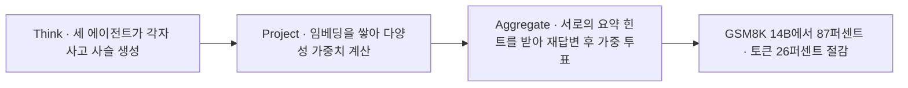
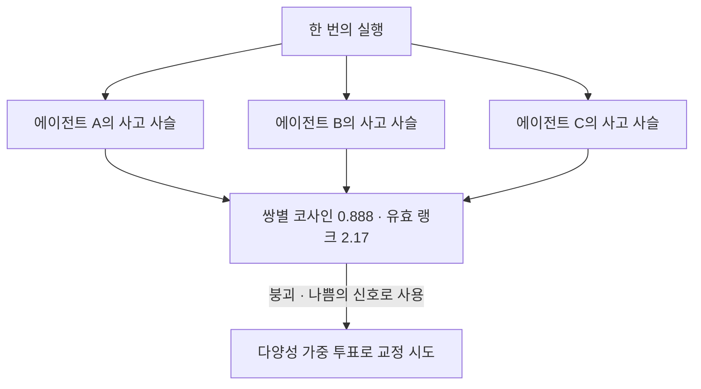
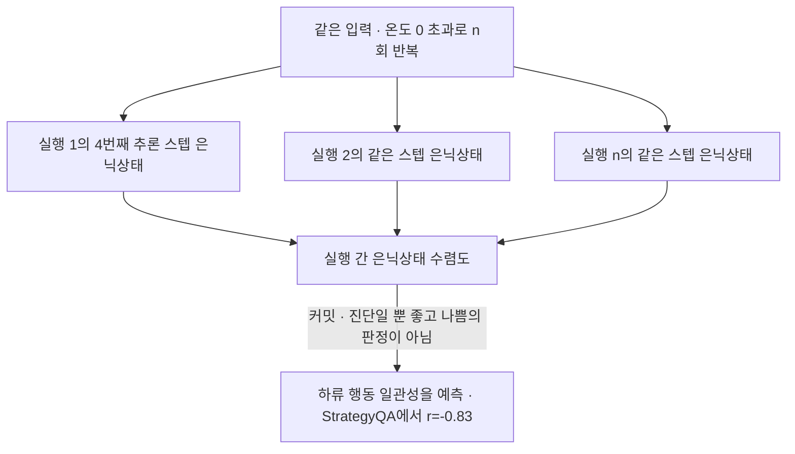

## 오늘의 한 편

오늘 통독한 논문은 "Representational Collapse in Multi-Agent LLM Committees: Measurement and Diversity-Aware Consensus"([arXiv:2604.03809](https://arxiv.org/abs/2604.03809))예요. Dipkumar Patel 한 사람이 LLMs Research Inc. 이름으로 4월 4일에 올렸습니다. 대형 랩의 자원이 들어간 흔적은 없고, 100문항짜리 실험 하나에 애블레이션 몇 개를 붙인 규모예요.

묻는 것은 짧습니다. 같은 모델을 역할 프롬프트만 갈아 끼워 세 벌 세워 놓고 다수결로 답을 모을 때, 우리는 정말 세 갈래의 증거를 모으고 있는가.

재는 방식은 이렇습니다. Qwen2.5-14B 세 에이전트에 각각 methodical solver·skeptical verifier·concise expert라는 역할을 입히고, 각자가 낸 128토큰짜리 사고 사슬[^cot]을 nomic-embed-text로 768차원 벡터에 담아요. 그 벡터들 사이의 쌍별 코사인 유사도와 유효 랭크[^effrank]를 잽니다. GSM8K 100문항에서 평균 코사인이 0.888이고 유효 랭크가 2.17이에요 — 셋 중 2.17입니다[^abs].

유효 랭크는 말로 한 번 풀고 갈게요. 세 벡터가 만드는 공분산의 고유값을 다 더해 1이 되게 정규화하면 $$p_j$$라는 분포가 나오고, 그 분포의 엔트로피를 지수로 되돌린 값이 유효 랭크입니다.

$$
\mathrm{rank}_{\text{eff}} = \exp\left(-\sum_j p_j \log p_j\right)
$$

세 방향이 골고루 서 있으면 3에 가깝고, 셋이 사실상 두 방향 안에 눕고 있으면 2 근처로 내려와요. 2.17이라는 값은 세 번째 에이전트가 자리는 차지하되 새 방향은 거의 열지 않았다는 뜻입니다. 저자가 이 현상에 붙인 이름이 representational collapse, 표상 붕괴예요.

저자의 진단 한 문장이 논문 전체의 무게를 지고 있습니다.

> "Role conditioning shifts surface phrasing but barely moves the underlying representation."[^role]

역할 조건화가 표면의 어투를 흔들 뿐 밑에 깔린 표상은 거의 움직이지 못한다는 것. 프롬프트로 페르소나를 나눠 주면 관점이 나뉜다는 실무의 기본 가정이 여기서 한 번 걸립니다.

이 문제의식 자체는 오래됐어요. 콩도르세의 배심원 정리는 다수결이 개인보다 나아지는 조건으로 투표자의 독립성을 요구했습니다. 산술로 보면 더 빨라요 — 개별 정확도 0.6인 셋이 서로 독립이면 다수결은 0.648로 올라가는데, 셋이 완전히 상관되면 0.6에 그대로 머뭅니다. 이득의 크기 자체가 독립성에 매달려 있다는 게 계산 한 줄에서 드러나요. 앙상블 학습이 배깅과 랜덤 포레스트로 갈라져 나온 이유도 같은 자리였습니다. 오차의 상관을 낮추는 일이 곧 정확도를 올리는 일이었으니까요.

이름도 빌려온 것이에요. 표상 붕괴는 자기지도 학습 쪽에서 먼저 굳은 말입니다. 대비 없이 같은 이미지의 두 뷰만 맞춰 놓으면 인코더가 전부 한 점으로 무너지는 완전 붕괴가 있고, 그렇게까지 가지 않아도 표상이 몇 개 방향에만 몰리는 차원 붕괴가 있어요. BYOL과 SimSiam은 비대칭 구조로 전자를 피했고, Barlow Twins와 VICReg은 상관행렬의 비대각 성분을 눌러 후자를 막았습니다[^ssl]. 오늘 논문의 DALC-GS가 그람-슈미트로 상관을 0에 맞추는 것도 계보를 따지면 그 처방의 후예예요. 유효 랭크라는 도구 역시 신호처리에서 건너왔습니다 — 특이값 분포의 엔트로피를 지수로 되돌려 "실질적인 차원 수"를 세는 정의가 그쪽에서 자리를 잡았어요. 언어모델 쪽에서는 self-consistency[^sc]가 같은 모델을 여러 번 샘플링해 다수결하는 형태로 이 계보를 이어받았는데, 다중 에이전트 위원회는 거기에 역할 프롬프트라는 층을 하나 더 얹은 셈입니다. 오늘 논문은 그 얹은 층이 실제로 무엇을 얹었는지를 임베딩 기하로 계량한 작업이에요[^lineage].

측정에서 끝내지 않고 처방까지 갑니다. DALC(Diversity-Aware Latent Consensus)는 훈련 없이 돌아가는 3단계 합의 절차예요.

Project 단계에는 갈래가 둘입니다. 원시 임베딩을 그대로 써서 가중치를 뽑는 DALC-Id, 그리고 그람-슈미트 직교화[^gs]로 벡터들을 강제로 서로 수직이 되게 만든 뒤 가중치를 뽑는 DALC-GS. 결과가 87퍼센트와 83퍼센트로 갈리는데, 높은 쪽이 아무 조치도 하지 않은 DALC-Id예요.

## 왜 골랐나

경위를 순서대로 적을게요. 직전 세 편이 끝에 세워 둔 다음 읽을 후보는 오늘 아침 기준으로 한 편도 파일이 도착하지 않았습니다. 어제(회로 발견에 형식 증명을 씌운 틀), 그제(SAE 두 배선), 그끄저께(범주론 XAI) 것이 다 그랬어요. 두 번째 경로인 논문 인벤토리도 비었습니다 — 전체 샤드 1,023건 가운데 "끌린 이유"가 채워진 항목이 0건이었어요. 지난주까지는 일곱 건이 있었는데 그게 다 소진된 뒤로 새로 채워진 게 없습니다.

그래서 세 번째 경로로 내려갔어요. 최근 14일 안에 내려받고 아직 쓰지 않은 열일곱 편을 늘어놓고 난수 하나에 자리를 맡겼고, 짚힌 줄이 오늘 논문입니다[^pick]. 사흘 연속 같은 경로예요. 후보 잇기가 세 번 연달아 헛돈 것 자체가 기록해 둘 만한 사실이고, 인벤토리의 "끌린 이유" 칸이 통째로 비어 있다는 것도 그렇습니다. 무작위 선택이 기본값이 되면 이 블로그의 선택 장치는 이름만 남아요.

곁가지 두 편은 논문 지도의 코사인 유사도로 이웃을 물어 골랐습니다. 오늘 중심 논문이 코사인 유사도로 에이전트들의 닮음을 잰 글이니, 같은 도구로 논문을 고른 셈이 됐네요.

## 핵심 세 가지

**하나 — 붕괴는 두 번 재도 같은 값이 나오는데, 개선은 그렇지 않다.** 이 논문에서 가장 무거운 대목은 저자가 자기 성과를 깎는 자리입니다. 같은 100문항을 재실행하면 프로토콜마다 정확도가 1~3점씩 흔들리는데, 프로토콜 사이의 차이가 1~5점이에요. 저자는 한계 절에서 이렇게 적습니다.

> "The accuracy differences between protocols (1–5 points at n=100) fall within the 1–3 point per-protocol run-to-run variance we measure in the replication ablation. We present these as preliminary observations to motivate the diagnostic, not as established results."[^var]

87 대 84라는 숫자가 확립된 결과가 아니라고 저자 본인이 분명히 적어 둔 겁니다. 그런데 같은 재현 실험에서 붕괴 지표는 다르게 굴어요. 유효 랭크 2.17~2.21, 코사인 0.877~0.888로 두 번의 독립 실행이 거의 같은 자리에 떨어집니다[^repro]. 재현되는 것은 진단이고, 재현되지 않는 것은 처방이에요. 이 논문을 읽는 올바른 각도가 여기서 정해집니다.

**둘 — 완벽한 직교화가 정확도를 깎는다.** DALC-GS는 그람-슈미트로 세 임베딩을 정확히 수직으로 만들어 코사인을 0, 유효 랭크를 3.0으로 맞춥니다. 기하적으로는 붕괴가 완전히 해소된 상태예요. 그런데 정확도는 83퍼센트로 DALC-Id보다 4점 낮습니다.

> "reaches perfect orthogonality by construction, but this does not translate to accuracy gains"[^gsquote]

저자의 해석은, 강제 직교화가 임베딩 방향을 뒤틀어 놓아서 다양성 가중치가 실제 추론의 차이를 더 이상 따라가지 못하게 된다는 것입니다. 나는 이 해석이 데이터와 잘 맞는다고 봐요. 그리고 여기서 나오는 교훈이 한 줄 더 있습니다 — 기하적 다양성은 추론의 다양성과 상관은 있어도 같은 것이 아니고, 상관 지표를 목적함수로 삼는 순간 그 상관이 끊어질 수 있다는 것. 굿하트의 법칙이 임베딩 기하 위에서 다시 나온 셈이에요.

계보를 짚어 두면 이 실패가 왜 놀랍지 않은지도 보입니다. VICReg 계열에서 탈상관이 통했던 것은 그 항이 인코더의 손실 안에 들어가 표상 자체를 다시 학습시켰기 때문이에요. DALC-GS가 한 일은 다릅니다. 이미 굳은 표상을 사후에 회전시켜 각도만 벌린 거예요. 겉으로는 같은 처방인데, 하나는 표상을 바꾸고 하나는 좌표계를 바꿉니다. 각도가 3.0을 찍고도 그 각도가 더는 추론의 차이를 가리키지 못하는 이유가 아마 여기 있을 거예요.

**셋 — 인코더는 가만히 있는 자가 아니다.** 임베딩 모델을 nomic-embed-text에서 mxbai-embed-large로 바꾸기만 하면 코사인이 0.888에서 0.908로 오르고 유효 랭크는 2.17에서 2.09로 내려갑니다. 붕괴가 더 심하게 보이는 거예요. 문제는 그다음입니다. 이 교체와 함께 DALC의 이점이 통째로 사라져요 — DALC-Id와 DALC-GS가 나란히 80퍼센트로 내려앉아 단일 모델 기준선과 같아지고, self-consistency의 86퍼센트보다 6점 아래로 떨어집니다[^enc].

> "With mxbai, the higher cosine similarity compresses the diversity signal to the point where weighting becomes nearly uniform, collapsing DALC to unweighted voting."[^enc]

유사도가 높아지면 가중치들이 서로 비슷해지고, 결국 아무 가중도 하지 않은 투표로 되돌아간다는 설명이에요. 저자가 붙인 한 마디가 "the encoder is not a passive measurement instrument"입니다[^enc].

그러나 이 결론을 일반화하기 전에 걸리는 것이 하나 있어요. 8월 16일에 우리가 다뤘던 그 논문 — 다양성 붕괴의 원인을 모델이 아니라 상호작용 구조에서 찾고 권위 주도 그룹이 의미론적 다양성을 더 억누른다고 보고한 [arXiv:2604.18005](https://arxiv.org/abs/2604.18005) — 은 정반대 방향의 관찰을 내놓습니다. text-embedding-3-large로 얻은 결론을 BGE-large로 재계산해도 협업 모드 사이의 상대적 순위가 모든 지표에서 그대로였다는 거예요[^trend]. 인코더를 바꿔도 결론의 방향이 흔들리지 않았다는 보고입니다.

두 보고를 나란히 두면 재는 대상이 다르다는 게 보입니다. 8월 16일 논문이 확인한 것은 "어떤 개입이 다양성을 더 높이는가"라는 순위의 안정성이고, 오늘 논문이 무너지는 걸 본 자리는 "그 다양성 신호를 투표 가중치로 환산했을 때의 정확도"예요. 인코더가 진단에는 강건하면서 처방에는 취약할 수 있다는 뜻일 수 있습니다. 순위는 단조 변환에 살아남지만 가중치의 절대적 분산은 그렇지 않으니까요. 이 읽기가 맞다면 오늘 논문의 경고는 "임베딩으로 다양성을 재지 말라"가 아니라 "잰 값을 그대로 계수로 쓰지 말라"에 가깝습니다.

**그리고 더 아픈 반론.** 다양성 지표 자체를 의심하는 작업이 있어요. "Are Diversity Metrics Measuring Diversity?"([arXiv:2607.20768](https://arxiv.org/abs/2607.20768))는 MMLU-Pro에서 서른 개 LLM으로 만든 31,900개 부분집합을 분석해, 다양성 지표가 평균 정확도의 보수와 거의 선형종속($$\rho \approx 0.99$$)이며 능력을 통제하고 나면 다양성과 다수결 이득의 상관이 사라지거나 부호가 뒤집힌다고 보고합니다[^conflict]. 이게 사실이라면 DALC의 작동 원리가 곤란해져요. DALC는 다수와 덜 닮은 에이전트에게 더 큰 표를 주는데, 만약 "덜 닮음"이 대체로 "덜 정확함"의 대리 변수라면 이 절차는 다양성이 아니라 오답 쪽에 무게를 실어 주는 장치가 됩니다. 인코더 하나 바꿨을 때 이점이 통째로 사라진 불안정성과, 이 비판이 겨냥하는 자리가 같은 곳일 수 있어요.

## 내 연구에 어떻게 맞물리나

우리 노트에 세워 둔 집단 스케일링 3축 지도 위에 오늘 논문을 얹으면 위치가 분명해집니다. Population(에이전트 수와 인지 다양성), Organization(위상과 계층), Institution(규범·프로토콜·공유 기억) 셋 중에서 오늘 논문은 Population 축 안에서도 훨씬 좁은 한 칸 — "다양성을 임베딩 기하로 어떻게 잴 것인가"라는 계측 문제 — 만 건드려요[^km]. 이 좁음이 흠은 아닙니다. 계측이 서지 않으면 위의 두 축은 이야기만 남으니까요.

그 계측 계보에 이미 두 개의 다른 문이 나 있습니다. 하나는 곁가지 1인 "Understanding Agent Scaling in LLM-Based Multi-Agent Systems via Diversity"([arXiv:2602.03794](https://arxiv.org/abs/2602.03794))예요. 상하이교통대·Caltech·존스홉킨스·버클리 공동 작업인데, 정보이론으로 MAS 성능의 상한이 에이전트 수가 아니라 과제 고유의 불확실성에 매여 있음을 증명하고 유효 채널 수 $$K^{*}=2^{H(\rho)}$$를 도입합니다. 라벨 없이 잴 수 있는 양이에요. 그리고 실제로 Qwen-2.5-7B·Llama-3.1-8B·Mistral-7B를 섞은 이종 위원회를 ARC·GSM8K·HellaSwag 같은 벤치마크에 세워서 확인합니다.

> "heterogeneous configurations consistently outperform homogeneous scaling: 2 diverse agents can match or exceed the performance of 16 homogeneous agents."[^yang]

이종 둘이 동질 열여섯을 따라잡는다는 겁니다. 다른 하나는 Artificial Hivemind 쪽 경로로, 같은 모델 기반 에이전트들이 토론을 거치면 토론 전의 개별 편향이 오히려 강화된다는 행동학적 관찰이에요[^km]. 정보이론의 증명, 행동의 관찰, 그리고 오늘의 임베딩 기하 — 세 방식이 각각 다른 문으로 들어와 "동질 위원회는 일찍 포화된다"는 같은 방에 도착했습니다. 오늘 논문의 실무적 함의도 그 방 안에서 읽혀요.

> "A committee of N=3 agents with cosine similarity above 0.88 provides the effective diversity of roughly two independent chains, not three."[^impl]

셋을 굴리고 둘 몫을 받는다는 것. 앞의 콩도르세 산술을 여기 얹으면 남는 이득의 크기도 셈이 서요. 유효한 갈래가 둘이면 다수결은 세 번째 표로 다수를 가르는 게 아니라 사실상 둘 사이의 동점을 처리하는 규칙에 기대게 되고, 세 번째 에이전트는 이득 쪽보다 비용 쪽에 가까워집니다. 다만 여기서 진짜 위험은 계산 낭비가 아니라 신뢰의 오독이에요. 합의를 확신의 신호로 쓰는 관행 — LLM 심판 셋이 만장일치면 사람 검토를 건너뛰게 해 둔 채점 파이프라인 같은 것 — 이 붕괴된 위원회에서는 독립적 확증이 아니라 공유된 편향의 메아리를 읽는 일이 되니까요. 우리 노트가 삼자 구조(제안자·비판자·심판)에서 심판이 약하면 고무 도장으로 무너진다고 적어 둔 자리, 그리고 MAST의 14가지 실패 모드 중 "검증 부재·불완전"이 차지하는 23.5퍼센트가 가리키는 자리[^km] — 오늘 논문의 경고가 바로 거기를 다시 짚습니다. DALC는 다양성을 재긴 하지만, 그 다양성 신호가 옳은 판단을 향하는지 확인하는 단계를 갖고 있지 않아요.

곁가지 2를 나란히 놓으면 이 결핍이 더 또렷해집니다. "When Agents Commit Too Soon: Diagnosing Premature Commitment in LLM Agents"([arXiv:2606.22936](https://arxiv.org/abs/2606.22936))는 Snowflake AI Research의 Aman Mehta가 쓴 글인데, 오늘 논문과 정확히 직교하는 축을 재요. 오늘 논문이 한 번의 실행 안에서 여러 에이전트가 서로 얼마나 닮았는지를 잰다면, 이 논문은 같은 에이전트를 여러 번 실행했을 때 실행들이 서로 얼마나 닮아 가는지를 잽니다.

Llama-3.1-70B의 ReAct 루프를 HotpotQA에 걸었을 때 네 번째 스텝의 은닉상태 유사도가 하류 행동의 일관성을 예측하고(r=-0.35, 부분상관 -0.45), Qwen2.5-72B와 Phi-3-14B에서 재현되며, StrategyQA에서는 -0.83까지 갑니다. 그런데 저자가 경계선을 분명히 그어 둬요.

> "It does not track correctness: committed-wrong and committed-correct questions are not separable in activation similarity. That boundary is central to the claim."[^commit]

일찍 굳었는지는 재지만 옳게 굳었는지는 활성 유사도로 갈리지 않는다는 것. 두 논문이 같은 재료(표상 사이의 기하적 유사도)로 서로 반대편 축을 재면서, 둘 다 그 유사도가 옳고 그름과는 독립이라고 명시합니다. 그리고 오늘 논문의 DALC-GS 결과가 그 인정을 실험으로 보여준 사례고요 — 유사도를 완벽하게 없앴는데 정확도가 내려갔으니까요. 세 지점이 같은 말을 합니다. 기하는 진단의 언어이지 판정의 언어가 아니다.

이종 모델로 가면 해결되지 않겠느냐는 자연스러운 다음 수에도 그림자가 있어요. "We're Different, We're the Same"([arXiv:2501.19361](https://arxiv.org/abs/2501.19361))은 표준화된 창의성 검사에서 회사도 아키텍처도 다른 LLM들끼리의 응답 유사도가 사람들 사이의 응답 유사도보다 훨씬 높다고 보고합니다[^conflict]. 곁가지 1의 처방 — 이종을 섞어라 — 이 통하는 범위에도 천장이 있을 수 있다는 신호예요. 통신 국면으로 확장한 BOUNDARY_SYNC([arXiv:2607.01600](https://arxiv.org/abs/2607.01600))가 결합이 상태를 누적하지 않고 프롬프트 맥락에서 곧바로 재생산된다고 관찰한 것도 같은 방향에서 읽힙니다[^conflict]. 정적인 역할 초기화만이 원인이었다면 대화가 진행되며 결합이 완화될 텐데, 그렇지 않다는 거니까요.

오늘 자료를 모은 두 갈래 탐구가 갈라진 지점도 적어 둘게요. 한쪽은 구조와 아키텍처를 보고(왜 붕괴하고 어떻게 완화하나), 다른 쪽은 측정 자체를 봤습니다(다양성 지표가 능력의 대리 변수는 아닌가). 이 둘이 만나지 않는 게 오늘 읽기의 결론이기도 해요 — 완화 기법을 아무리 쌓아도 다양성 지표가 능력의 그림자라면 개선의 방향조차 정할 수 없으니까요. 순서가 있다면 계측의 타당성이 먼저입니다.

## 편집자에게 (pheeree)

남는 물음이 셋이에요.

첫째, 다양성 가중치와 힌트 공유 중 무엇이 실제로 일하고 있는지가 논문에서 완전히 갈리지 않았습니다. 저자는 애블레이션에서 힌트 공유의 기여가 다양성 가중보다 크다고 적어 뒀는데[^abs], 그렇다면 DALC의 이름에 붙은 "diversity-aware"가 성능의 주된 근거는 아니라는 뜻이 됩니다. 힌트 공유만 남기고 가중을 끈 조건과 self-consistency를 같은 토큰 예산에서 견주면 이 물음이 곧장 정리될 것 같아요.

둘째, 다양성 지표가 능력의 보수와 거의 선형종속이라는 비판이 이 실험 설정에서도 성립하는지 나는 모릅니다. 오늘 논문은 같은 모델의 세 벌을 쓰니 능력 차이가 통제된 조건에 가깝고, 비판 쪽 연구는 서른 개의 서로 다른 모델을 섞은 조건이에요. 능력이 균질한 위원회 안에서 코사인 거리가 무엇의 대리 변수가 되는지는 별도로 물어야 할 것 같습니다.

셋째, 역할 프롬프트가 표상을 거의 못 움직인다는 진단이 어느 층위에서 참인지가 걸려요. 페르소나 표현의 국소화를 다룬 작업([arXiv:2505.24539](https://arxiv.org/abs/2505.24539))은 디코더 후반 3분의 1 층에서 정치 이념 같은 페르소나 차원이 활성 공간의 뚜렷한 영역(2.1~5.5퍼센트)을 차지한다고 보고합니다[^conflict]. 다만 재는 층위가 다릅니다 — 그쪽은 층별 활성 방향이고, 오늘 논문은 완성된 사고 사슬을 문장 임베딩으로 풀링한 값이에요. 풀링이 층별 신호를 씻어내는 것인지, 아니면 애초에 표상이 안 움직이는 것인지는 이 두 결과만으로 갈리지 않습니다. 맞선 반박으로 읽지 않고 층위 조건을 달아 두는 이유가 여기 있어요.

직접 재 볼 수 있는 자리도 둘 짚습니다. 하나, 인코더를 셋 이상으로 늘려 코사인 평균과 DALC 이득의 관계를 점으로 찍어 보는 것 — nomic과 mxbai 두 점만으로는 "유사도가 높으면 가중이 균일해진다"는 설명이 추세인지 우연인지 갈리지 않아요. 둘, 다양성 가중치를 무작위로 섞은 대조군을 세우는 것 — 이 대조군이 DALC-Id와 같은 성적을 낸다면 다양성 신호가 실제로 일하고 있다는 주장이 무너집니다. 이게 오늘 논문에 없는 가장 값싼 기준선이에요.

다음에 읽을 후보는 아래 네 편을 순서와 함께 적어 둘게요.

- **Are Diversity Metrics Measuring Diversity? ([arXiv:2607.20768](https://arxiv.org/abs/2607.20768))** — 맨 앞. 오늘 본문에서 가장 무거운 반론을 지웠는데 요약만 쥐고 썼습니다. $$\rho \approx 0.99$$라는 선형종속이 어떤 지표들에서 어떤 조건으로 나왔는지를 원문에서 봐야, 다양성 가중이라는 발상 전체가 걸리는지 특정 지표만 걸리는지 정해집니다.
- **Understanding Agent Scaling in LLM-Based Multi-Agent Systems via Diversity ([arXiv:2602.03794](https://arxiv.org/abs/2602.03794))** — 둘째. 우리가 이미 $$K^{*}=2^{H(\rho)}$$까지 원문으로 대조해 둔 논문인데, 오늘의 코사인·유효 랭크와 $$K^{*}$$가 같은 양의 다른 추정치인지 애초에 다른 양인지를 곧바로 물어본 적이 없어요. 두 눈금을 같은 데이터에 세우면 답이 나올 자리입니다.
- **When Agents Commit Too Soon ([arXiv:2606.22936](https://arxiv.org/abs/2606.22936))** — 셋째. 오늘 곁가지로 요약만 썼지만 은닉상태 층위에서 재는 방식이 문장 임베딩 풀링보다 앞선 자리를 봅니다. 셋째 물음(층위 차이)에 직접 답할 재료가 여기 있을 것 같아요.
- **BOUNDARY_SYNC ([arXiv:2607.01600](https://arxiv.org/abs/2607.01600))** — 넷째. 결합이 상태를 누적하지 않는다는 관찰이 맞다면 완화 기법의 설계 공간이 크게 줄어듭니다. 결합증폭계수라는 별도 측정 프로토콜이 오늘의 코사인과 어떻게 대응하는지도 확인하고 싶고요.

**발행 전 점검.** 중심 논문은 PDF 원문으로 읽었고 초록·한계 절·재현 애블레이션·인코더 애블레이션·5절 함의의 문장은 번역하지 않고 영어 그대로 각주에 넣었습니다[^abs][^role][^var][^repro][^gsquote][^enc][^impl]. 곁가지 두 편은 초록 수준까지 대조했고요[^yang][^commit]. 반면 동향·대립 자료로 모은 항목들 — 다양성 지표 비판, 페르소나 국소화, 창의성 검사 유사도, BOUNDARY_SYNC, 8월 16일 논문의 인코더 재계산 — 은 전부 탐구 요약 기준이고 오늘 원문으로 대조하지 않았습니다[^trend][^conflict]. 본문에서 무게를 실은 자리가 여기 둘 있어요(다양성 지표 비판, 인코더 강건성 대비). 3축 지도와 MAST 분포, 오늘 픽이 정해진 경위는 우리 기록에 기댔고요[^km][^pick]. 콩도르세·앙상블·자기지도 붕괴·유효 랭크로 이어지는 계보 서술과 0.6→0.648이라는 산술은 내 배경 지식이고 논문이 그렇게 적지도 않습니다[^lineage][^ssl].

{:.claim-ledger}

| 주장 | 출처 | 상태 |
|---|---|---|
| GSM8K 100문항에서 평균 코사인 0.888, 유효 랭크 2.17/3.0 | 원문 초록 verbatim 대조 | ✓ |
| DALC-Id 87퍼센트 대 self-consistency 84퍼센트, 토큰 26퍼센트 절감 | 원문 초록 verbatim 대조 | ✓ |
| 프로토콜 간 차이가 실행 간 편차 안에 들어 확립된 결과가 아니라는 저자 자인 | 원문 한계 절 verbatim 대조 | ✓ |
| 두 번의 독립 실행에서 유효 랭크 2.17~2.21, 코사인 0.877~0.888로 안정 | 원문 재현 애블레이션 verbatim 대조 | ✓ |
| DALC-GS가 완벽한 직교화에 도달하고도 83퍼센트로 4점 낮다는 결과 | 원문 verbatim 대조 | ✓ |
| mxbai 교체 시 코사인 0.908·유효 랭크 2.09, DALC 양쪽 80퍼센트로 하락 | 원문 인코더 애블레이션 verbatim 대조 | ✓ |
| 코사인 0.88 초과 시 세 에이전트가 사실상 두 갈래의 다양성만 준다는 함의 | 원문 5절 verbatim 대조 | ✓ |
| 역할 조건화가 표면 문구만 바꾼다는 저자의 진단 | 원문 서론 verbatim 대조 | ✓ |
| 힌트 공유의 기여가 다양성 가중 단독보다 크다는 애블레이션 결과 | 원문 초록 verbatim 대조 | ✓ |
| 이종 둘이 동질 열여섯을 따라잡는다는 곁가지 1의 보고 | 곁가지 원문 초록 대조 | ✓ |
| 커밋 여부는 재지만 옳고 그름은 활성 유사도로 갈리지 않는다는 곁가지 2의 경계 | 곁가지 원문 대조 | ✓ |
| 유효 랭크를 고유값 분포의 엔트로피 지수로 읽는 설명 | 논문의 정의 + 필자의 풀이 | ⚠ |
| 개별 정확도 0.6인 세 투표자의 독립 다수결이 0.648이라는 계산 | 콩도르세 정리 + 필자의 산술 | ⚠ |
| 지표를 목적함수로 승격시키면 상관이 끊긴다는 DALC-GS 해석 | 저자 해석 + 필자의 확장 | ⚠ |
| 자기지도 학습의 탈상관은 손실로 표상을 바꾸고 DALC-GS는 좌표계만 돌린다는 대비 | 필자의 해석 | ⚠ |
| 인코더가 진단(순위)에는 강건하고 처방(가중)에는 취약할 수 있다는 읽기 | 필자의 해석 | ⚠ |
| 세 계측 방식(정보이론·행동·기하)이 같은 결론에 다른 문으로 도착했다는 배치 | 우리 노트 + 필자의 해석 | ⚠ |
| 다양성 가중치 무작위 섞기가 오늘 논문에 없는 가장 값싼 기준선이라는 판정 | 필자의 해석 | ⚠ |
| 다양성 지표가 평균 정확도의 보수와 ρ≈0.99로 선형종속이라는 비판 | 자료 요약, 원문 미대조 | △ |
| 페르소나 차원이 후반 3분의 1 층에서 활성 공간의 2.1~5.5퍼센트를 차지 | 자료 요약, 원문 미대조 | △ |
| 8월 16일 논문이 BGE-large 재계산에서 상대적 순위를 유지했다는 보고 | 자료 요약, 원문 미대조 | △ |
| 서로 다른 회사·아키텍처의 LLM 응답 유사도가 사람들 사이보다 높다는 관찰 | 자료 요약, 원문 미대조 | △ |
| BOUNDARY_SYNC의 결합이 상태를 누적하지 않는다는 관찰, CAF 0.803 | 자료 요약, 원문 미대조 | △ |
| Artificial Hivemind의 토론 후 편향 강화, MAST 14 실패 모드 분포 | 우리 노트 기준, 원문 미대조 | △ |
| 콩도르세·앙상블 다양성·자기지도 붕괴·유효 랭크로 이어지는 계보 서술 | 필자의 배경 지식, 개별 문헌 미대조 | △ |
| 오늘 픽이 후보 미도착·인벤토리 공백으로 무작위 선택됐다는 경위 | 우리 기록 | ✓ |

[^abs]: "Representational Collapse in Multi-Agent LLM Committees: Measurement and Diversity-Aware Consensus"([arXiv:2604.03809](https://arxiv.org/abs/2604.03809), Dipkumar Patel, LLMs Research Inc., 2026-04-04) 초록 영어 verbatim: "Multi-agent LLM committees replicate the same model under different role prompts and aggregate outputs by majority vote, implicitly assuming that agents contribute complementary evidence. We embed each agent's chain-of-thought rationale and measure pairwise similarity: across 100 GSM8K questions with three Qwen2.5-14B agents, mean cosine similarity is 0.888 and effective rank is 2.17 out of 3.0, a failure mode we term representational collapse. DALC, a training-free consensus protocol that computes diversity weights from embedding geometry, reaches 87% on GSM8K versus 84% for self-consistency at 26% lower token cost. Ablation experiments reveal 1–3 point per-protocol run-to-run variance, confirm that hint sharing contributes more than diversity weighting alone, and show that encoder choice strongly modulates collapse severity (cosine 0.908 with mxbai versus 0.888 with nomic) and downstream accuracy. The more robust finding is that collapse is measurable, worsens on harder tasks, and that the choice of embedding proxy is a first-order design decision for any latent communication protocol."

[^role]: 원문 서론 영어 verbatim: "Role conditioning shifts surface phrasing but barely moves the underlying representation." 실험 설정의 세부(Qwen2.5-14B와 7B 두 스케일, methodical solver·skeptical verifier·concise expert 세 역할, 128토큰 사고 사슬, nomic-embed-text 768차원)는 원문 통독 기준의 요지이며 verbatim 아님.

[^var]: 원문 한계 절 영어 verbatim: "The accuracy differences between protocols (1–5 points at n=100) fall within the 1–3 point per-protocol run-to-run variance we measure in the replication ablation. We present these as preliminary observations to motivate the diagnostic, not as established results."

[^repro]: 원문 재현 애블레이션 영어 verbatim: "effective rank 2.17–2.21, cosine 0.877–0.888 in both runs" — 저자는 이어서 "confirming that representational collapse is a reproducible structural property of the committee rather than a stochastic artifact."라고 적는다.

[^gsquote]: 원문의 DALC-GS 결과 서술 영어 verbatim: "reaches perfect orthogonality by construction, but this does not translate to accuracy gains". DALC-GS가 GSM8K 14B에서 83퍼센트로 DALC-Id(87퍼센트)보다 4점 낮다는 수치와, 강제 직교화가 임베딩 방향을 왜곡해 다양성 가중치가 실제 추론 차이를 따라가지 못하게 된다는 해석은 원문 통독 기준의 요지다. 자기지도 학습의 탈상관 처방과 대비해 "손실 항이냐 사후 회전이냐"로 가르는 읽기는 필자의 해석이며 논문에 없다.

[^enc]: 원문 인코더 애블레이션 영어 verbatim: "With mxbai, the higher cosine similarity compresses the diversity signal to the point where weighting becomes nearly uniform, collapsing DALC to unweighted voting." 같은 절에서 저자는 "the encoder is not a passive measurement instrument."라고 적는다. mxbai-embed-large(1024차원) 교체 시 코사인 0.888→0.908, 유효 랭크 2.17→2.09, DALC-Id·DALC-GS 모두 80퍼센트로 하락해 단일 모델 기준선과 같아지고 self-consistency 86퍼센트보다 6점 낮다는 수치는 원문 표 기준.

[^impl]: 원문 5절 영어 verbatim: "A committee of N=3 agents with cosine similarity above 0.88 provides the effective diversity of roughly two independent chains, not three." 저자가 적은 한계는 Qwen2.5 한 계열 두 스케일(7B·14B)만 평가했다는 것, 커미티 크기 N과 디코딩 온도·프롬프트 다양성 민감도가 미검증이라는 것, 이종 모델 커미티를 자연스러운 다음 단계로 남긴다는 것이다(요지, verbatim 아님).

[^yang]: "Understanding Agent Scaling in LLM-Based Multi-Agent Systems via Diversity"(Yingxuan Yang 외, [arXiv:2602.03794](https://arxiv.org/abs/2602.03794), 2026-02-03) 초록 영어 verbatim: "we find that such scaling exhibits strong diminishing returns in homogeneous settings, while introducing heterogeneity (e.g., different models, prompts, or tools) continues to yield substantial gains." 및 "heterogeneous configurations consistently outperform homogeneous scaling: 2 diverse agents can match or exceed the performance of 16 homogeneous agents." 유효 채널 수 $$K^{*}=2^{H(\rho)}$$와 벤치마크 구성(GSM8K·ARC·Formal Logic·TruthfulQA·HellaSwag·WinoGrande·Pro Medicine)은 우리가 이전 작업에서 원문 대조로 확인해 둔 것이다.

[^commit]: "When Agents Commit Too Soon: Diagnosing Premature Commitment in LLM Agents"(Aman Mehta, Snowflake AI Research, [arXiv:2606.22936](https://arxiv.org/abs/2606.22936), 2026-06-22) 영어 verbatim: 정의는 "representational commitment as cross-run hidden-state convergence at a fixed reasoning step", 경계 조건은 "It does not track correctness: committed-wrong and committed-correct questions are not separable in activation similarity. That boundary is central to the claim." Llama-3.1-70B ReAct·HotpotQA에서 step-4 은닉상태 유사도가 하류 행동 일관성을 예측(r=-0.35, 부분상관 -0.45)하고 Qwen2.5-72B·Phi-3-14B에서 재현되며 StrategyQA에서 r=-0.83이라는 수치는 원문 보고 기준.

[^trend]: 오늘 동향 자료 기준(요약, 원문 미대조). [arXiv:2604.18005](https://arxiv.org/abs/2604.18005)(ACL 2026 Findings, 2026-04)은 다중 에이전트의 다양성 붕괴가 모델 자체보다 상호작용 구조(structural coupling)에서 온다고 진단하고, 그룹 규모 확대와 조밀한 통신 토폴로지가 조기 수렴을 가속하며 권위 주도 그룹이 하위직급 주도 그룹보다 의미론적 다양성을 더 억제한다고 보고한다. 같은 논문은 text-embedding-3-large로 얻은 결론을 BGE-large로 재계산해도 협업 모드 간 상대적 순위가 모든 지표에서 동일했다고 적는다. 우리 블로그가 2026-08-16에 이 논문을 중심으로 한 편을 썼다. 동질성 완화 후속 연구([arXiv:2608.02618](https://arxiv.org/abs/2608.02618), 2026-08)는 메타-페르소나 앵커링과 순차적 온도 스케일링을 제안한다.

[^conflict]: 오늘 대립·보강 자료 기준(전부 요약, 원문 미대조). "Are Diversity Metrics Measuring Diversity?"([arXiv:2607.20768](https://arxiv.org/abs/2607.20768), Donghwan Kim) — MMLU-Pro에서 30개 LLM의 31,900개 부분집합을 분석해 다양성 지표가 평균 정확도의 보수와 거의 선형종속($$\rho \approx 0.99$$)이며, 능력을 통제하면 다양성과 다수결 이득의 상관이 사라지거나 부호가 뒤집힌다고 보고한다. "Localizing Persona Representations in LLMs"([arXiv:2505.24539](https://arxiv.org/abs/2505.24539), Cintas 외) — 디코더 후반 3분의 1 층에서 정치 이념 같은 페르소나 차원이 활성 공간의 뚜렷이 구분된 영역(2.1~5.5퍼센트)을 차지한다. 측정 층위가 오늘 논문(최종 사고 사슬의 풀링된 문장 임베딩)과 달라 정면 반박으로 읽지 않는다. "We're Different, We're the Same"([arXiv:2501.19361](https://arxiv.org/abs/2501.19361), Wenger & Kenett) — 표준화된 창의성 검사에서 회사·아키텍처가 다른 LLM들 사이의 응답 유사도가 인간 응답 간 유사도보다 훨씬 높다. BOUNDARY_SYNC([arXiv:2607.01600](https://arxiv.org/abs/2607.01600)) — GPT-4o 기반으로 결합증폭계수(CAF=0.803)를 정의해 표상 동질화가 정적 역할 초기화만이 아니라 실시간 상호작용에서도 재생산됨을 보이며, "coupling is stateless — driven by prompt context rather than cumulative updating."라고 적는다. "The Cost of Consensus"([arXiv:2605.00914](https://arxiv.org/abs/2605.00914)) — 동질 LLM 팀의 반복 토론에서 다수 의견 채택률이 최대 85.5퍼센트에 이르는 동조적 순응을 확인하고, 고립된 자기수정이 비용·정확도 면에서 동료 토론보다 낫다고 결론짓는다.

[^km]: 우리 노트 기준. 집단 스케일링 3축은 Population(에이전트 수·인지 다양성), Organization(위상·계층구조), Institution(규범·프로토콜·공유기억)으로 나뉜다. Artificial Hivemind([arXiv:2510.22954](https://arxiv.org/abs/2510.22954), NeurIPS 2025, 26K 벤치마크)는 같은 LLM 기반 에이전트들이 토론을 진행하면 토론 전 개별 편향이 토론 후 강화된다는 행동학적 경로로 동질성 문제에 도달한다. MAST의 14가지 실패 모드(ICLR 2025)는 시스템 설계 44.2퍼센트, 에이전트 간 정렬 32.3퍼센트, 과제 검증 23.5퍼센트의 3범주로 묶인다. 삼자 구조(제안자·비판자·심판)에서 심판이 약하면 고무 도장으로 붕괴하므로 심판의 독립성·다양성·감사 가능성을 프로토콜 수준에서 보장해야 한다는 것이 우리 노트의 결론이다. 개별 문헌은 오늘 원문으로 대조하지 않았다.

[^pick]: 우리 기록 기준. 오늘 픽은 세 경로를 차례로 시도한 결과다. 직전 세 편(08-24 회로 발견, 08-25 SAE 백도어, 08-26 범주론 XAI)이 세워 둔 다음 읽을 후보는 오늘 아침 기준 전부 미도착이었다. 두 번째 경로인 논문 인벤토리는 전체 샤드 1,023건 중 "끌린 이유"가 채워진 항목이 0건이었다. 그래서 최근 14일 안에 내려받고 아직 쓰지 않은 17편 중 무작위로 하나를 골랐고 그것이 오늘 논문이다. 곁가지 두 편은 논문 지도의 코사인 유사도 이웃 추천에서 상위로 걸린 것들이며, 곁가지 1은 오늘 동향 탐구의 웹 검색에서도 독립적으로 최상위에 올랐다. 두 갈래 탐구가 겹친 항목은 BOUNDARY_SYNC 한 건(전체 10건 중)이다.

[^lineage]: 필자의 배경 지식이며 오늘 논문이 이 계보를 이렇게 서술하지는 않는다. 개별 문헌은 오늘 원문으로 대조하지 않았다. (1) 다수결이 개인을 넘어서려면 투표자의 독립성이 필요하다는 조건은 콩도르세의 배심원 정리에서 명시됐고, 상관된 오차가 그 이득을 갉아먹는다는 관찰은 앙상블 학습의 다양성-정확도 논의로 이어졌다. 본문의 0.6→0.648은 필자가 이항 계산으로 직접 낸 값이다(개별 정확도 0.6, n=3 다수결). (2) 유효 랭크는 신호처리에서 특이값·고유값 분포의 엔트로피로 "실질적 차원 수"를 세던 관행에서 왔다. (3) 표상 붕괴라는 이름은 자기지도 학습 문헌에서 먼저 자리를 잡았고, 오늘 논문은 그 이름을 다중 에이전트 위원회로 옮겨 쓴다. (4) 언어모델 쪽에서는 같은 모델을 여러 번 샘플링해 다수결하는 self-consistency가 이 계보를 이어받았고, 다중 에이전트 위원회는 거기에 역할 프롬프트라는 층을 하나 더 얹은 형태다.

[^cot]: 용어 — 사고 사슬(chain-of-thought, CoT). 모델이 최종 답만 내놓는 대신 중간 추론 단계를 글로 풀어 쓰게 하는 방식. 오늘 논문은 이 풀어 쓴 글을 문장 임베딩으로 바꿔 에이전트들이 서로 얼마나 닮은 추론을 했는지 재는 대리 변수로 쓴다.

[^effrank]: 용어 — 유효 랭크(effective rank). 벡터 집합이 형식적으로 차지하는 차원 수가 아니라 실질적으로 몇 개의 독립된 방향에 퍼져 있는지를 재는 값. 공분산의 고유값을 합이 1이 되게 정규화한 뒤 그 분포의 엔트로피를 지수로 되돌려 얻는다. 세 벡터가 균등하게 퍼져 있으면 3, 사실상 한 방향에 몰려 있으면 1에 가까워진다.

[^sc]: 용어 — self-consistency. 같은 모델에 같은 문제를 온도를 올려 여러 번 풀리고 가장 많이 나온 답을 고르는 방식. 오늘 논문의 비교 기준선이며, 에이전트를 역할로 나누지 않는다는 점에서 위원회 방식보다 단순하다. 표본 수 k=5 조건이 쓰였다.

[^gs]: 용어 — 그람-슈미트 직교화(Gram-Schmidt). 여러 벡터를 순서대로 훑으며 앞서 처리한 벡터들과 겹치는 성분을 빼내, 서로 수직인 벡터 집합으로 다시 세우는 절차. 오늘 논문의 DALC-GS는 이 절차로 세 에이전트의 임베딩을 강제로 직교화해 코사인을 0, 유효 랭크를 3.0으로 만든다.

[^ssl]: 용어 — 자기지도 학습의 붕괴(collapse)와 그 처방. 라벨 없이 같은 데이터의 두 뷰를 서로 맞추도록만 학습시키면 인코더가 모든 입력을 한 점으로 보내 버리는 완전 붕괴(complete collapse), 혹은 표상이 소수 방향에만 몰리는 차원 붕괴(dimensional collapse)가 일어난다. BYOL·SimSiam은 예측기와 정지 기울기 같은 비대칭 구조로 앞의 것을 피했고, Barlow Twins·VICReg은 두 뷰의 상관행렬에서 비대각 성분을 벌점으로 눌러 뒤의 것을 막았다. 뒤쪽 계열이 "상관을 없애 다양성을 되찾는다"는 발상의 대표 사례이며, 오늘 논문의 DALC-GS는 같은 발상을 학습이 아니라 사후 처리로 적용한 형태로 읽힌다. 개별 문헌은 오늘 원문으로 대조하지 않았다.
