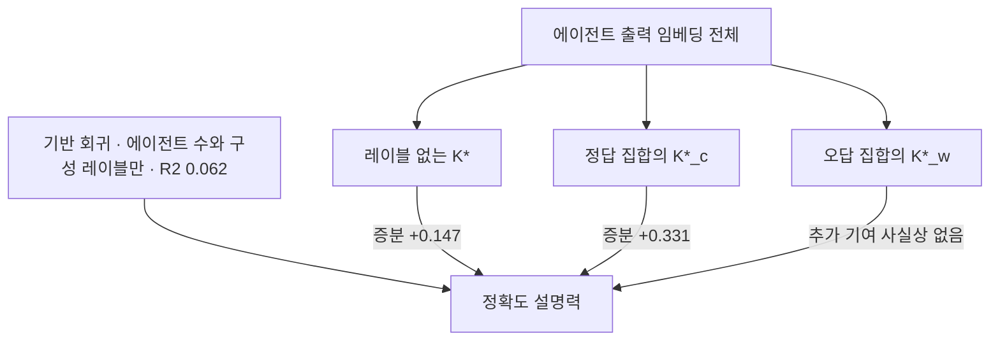
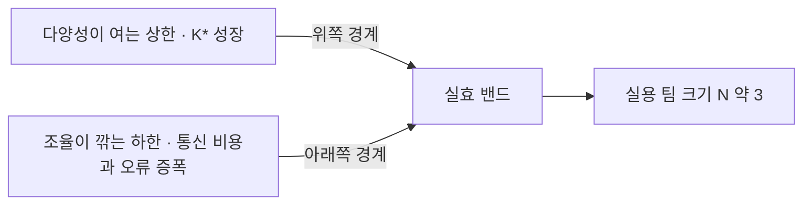

## 오늘의 한 편

어제 끝에 물음 하나를 걸어 두고 왔어요. 위원회 세 대에서 잰 유효 랭크 2.17과 오늘 논문의 $$K^*$$가 같은 양을 다르게 추정한 것인지, 아니면 애초에 서로 다른 양인지. 두 눈금을 같은 데이터에 세우면 답이 나온다고 적었는데, 데이터까지 갈 것도 없었습니다. 두 정의를 나란히 놓으면 계산 세 줄에서 끝나요. **같은 수입니다.**

어제 DALC 논문에서 옮겨 적은 유효 랭크는 정규화한 고유값 분포 $$p_j$$에 대해 $$\exp(-\sum_j p_j \log p_j)$$였습니다. 자연로그를 쓰고 자연지수로 되돌리는 꼴이었죠. 오늘 논문의 $$K^*$$는 폰 노이만 엔트로피 $$H(\rho) = -\sum_j \lambda_j \log_2 \lambda_j$$를 밑 2로 되돌린 $$2^{H(\rho)}$$예요. 밑이 다르니 다른 수처럼 보이는데, 둘 다 같은 곱으로 접힙니다.

$$
\exp\left(-\sum_j \lambda_j \ln \lambda_j\right) = \prod_j \lambda_j^{-\lambda_j} = 2^{-\sum_j \lambda_j \log_2 \lambda_j}
$$

로그의 밑을 바꾸면 지수 안이 $$\log_2 e$$배가 되고, 지수의 밑이 그 역수만큼 눌러 주니 상쇄돼요. 고유값 분포의 퍼플렉시티라고 부르면 한 이름으로 묶입니다. 8월 27일 글의 "셋 중 2.17"과 오늘 논문의 $$K^*$$는 같은 방식으로 계산된 같은 종류의 수이고, DALC는 Yang 쪽의 $$K^*$$를 effective rank라는 다른 이름으로 위원회 세 대에 적용한 셈이에요.

계보를 따지면 둘 다 훨씬 오래된 관행의 후예입니다. 엔트로피를 지수로 되돌려 "실질적인 개수"를 세는 수법은 생태학이 1970년대에 이미 표준으로 굳혀 놨어요. 힐 수(Hill numbers)에서 차수 1의 다양성이 정확히 $$\exp(H')$$이고, 이걸 유효 종 수(effective number of species)라고 부릅니다. 경제학의 허핀달 지수 역수가 유효 기업 수인 것이 차수 2의 같은 족속이고, 언어모델의 퍼플렉시티도 어휘 분포에 씌운 같은 함수예요. 신호처리가 특이값 분포에 이 함수를 씌워 effective rank라 부른 것이 임베딩 기하로 건너왔고, 양자정보의 폰 노이만 엔트로피를 밀도행렬 대신 그람 행렬로 쓴 것이 오늘 논문의 표기입니다. 네댓 분야가 각자 필요해서 같은 함수를 다시 발명한 이력이 이미 쌓여 있어요.

한 가지는 정확히 갈라 둘게요. 함수는 동일하지만 그 함수에 넣는 행렬의 전처리까지 같다고 단정하기는 어렵습니다. 오늘 논문은 정규화한 임베딩의 코사인 그람 행렬 $$G_{ij} = \langle \hat{z}_i, \hat{z}_j \rangle$$를 대각합으로 나눈 $$\rho = G/\mathrm{Tr}(G)$$의 고유값을 쓰고, 8월 27일 글은 DALC를 따라 "공분산의 고유값"이라고 적었어요. 중심화를 하느냐 마느냐에서 두 행렬은 갈릴 수 있습니다. 벡터를 단위 노름으로 맞춘 뒤 중심화 없이 그람을 잡는 것이 두 구현의 실제 관행이라면 완전히 겹치고요. 그 글과 오늘을 이어 붙이는 접합부가 정확히 이 한 줄이라, 원문 대조가 필요한 눈금으로 남겨 둡니다.

그럼 오늘 통독한 것을 소개할게요. "Understanding Agent Scaling in LLM-Based Multi-Agent Systems via Diversity"([arXiv:2602.03794](https://arxiv.org/abs/2602.03794))입니다. Yingxuan Yang, Chengrui Qu, Muning Wen, Laixi Shi, Ying Wen, Weinan Zhang, Adam Wierman, Shangding Gu — 상하이교통대·칼텍·존스홉킨스·버클리가 섞인 여덟 명이 2월 3일에 올렸어요. 어제 논문이 한 사람의 100문항짜리 실험이었던 것과 견주면 규모부터 다른 물건입니다.

실험 설계는 이래요. 오픈 모델 셋(Qwen-2.5-7B, Llama-3.1-8B, Mistral-7B)을 두 워크플로에 세웁니다. Vote는 에이전트 수 $$N$$이 곧 호출 수이고, Debate는 4라운드를 돌아 호출이 $$N \times 4$$가 돼요. $$N$$은 2, 4, 8, 12, 16으로 올립니다. 여기까지는 흔한 스케일링 실험인데, 진짜 조작 변수는 에이전트 수가 아니라 **다양성의 층**이에요. L1은 같은 모델에 기본 프롬프트만 준 무다양성, L2는 페르소나만 갈라 놓은 것("You are an expert mathematician" 대 "You are a careful logician"), L3는 기반 모델만 섞은 것, L4는 모델과 페르소나를 다 섞은 완전 다양성입니다. GSM8K·ARC·Formal Logic·TruthfulQA·HellaSwag·Pro Medicine·WinoGrande 일곱 벤치마크에서 이 격자를 다 돌려요.

결론은 초록 세 문장에 다 들어 있습니다. 동질 설정에서 에이전트를 늘리면 수확 체감이 강하게 나타나고, 이질성을 넣으면 이득이 계속 붙어요[^abs1]. 동질 에이전트가 일찍 포화하는 까닭은 출력이 강하게 상관되기 때문이고, 이질 에이전트는 상보적 증거를 낸다는 것[^abs2]. 그리고 숫자 한 줄 — 다양한 2대가 동질 16대와 맞먹거나 그 이상입니다[^abs3].

## 왜 골랐나

오늘 픽은 8월 27일 글이 세워 둔 후보 목록에서 나왔어요. 1순위였던 "Are Diversity Metrics Measuring Diversity?"([arXiv:2607.20768](https://arxiv.org/abs/2607.20768))는 아침에 확인했을 때 미러에 파일이 없었고, 2순위인 오늘 논문은 있었습니다[^pick]. 사흘 연속 난수로 떨어지던 픽이 오늘에서야 후보 목록과 이어졌는데, 이어진 모양이 조금 특이해요. 오늘 논문은 그 글이 곁가지로 초록까지 읽고 인용했던 바로 그 논문이거든요. 새 영역으로 넓히지 않고 아래로 내려가는 잇기입니다 — 인용해 오던 것의 1차 출처로. 우리 노트에도 같은 흔적이 있어요. 2026년 4월에 번역본으로 읽고 다중 에이전트 서베이의 다섯 번째 축으로 넣어 둔 뒤, 인용은 계속했는데 원문을 편 적은 없었습니다[^km-gov1].

곁가지 두 편은 미러에 PDF가 있는 것에서 골랐어요. 하나는 어제 3순위였다가 오늘 들어온 "When Agents Commit Too Soon: Diagnosing Premature Commitment in LLM Agents"([arXiv:2606.22936](https://arxiv.org/abs/2606.22936))입니다. 같은 입력을 n회 반복 실행했을 때 4번째 추론 스텝의 은닉상태가 실행들 사이에서 얼마나 수렴하는지를 representational commitment로 정의하고, 궤적 일관성의 조기 진단으로 씁니다. 예측력은 꽤 나와요 — StrategyQA에서 상관이 −0.83까지 갑니다. 그런데 저자가 경계를 아주 분명히 그어 둬요. 커밋은 정확성을 추적하지 않습니다. 틀리게 굳은 것과 맞게 굳은 것이 활성 유사도에서 구분되지 않는다고 못 박아요[^commit]. 오늘 논문의 정답 경로 분해와 정면으로 만나는 문장이라 뒤에서 다시 꺼낼게요.

다른 하나는 논문 지도에서 코사인 이웃 최상위로 걸린 "Scaling Behavior of Single LLM-Driven Multi-Agent Systems"([arXiv:2606.00655](https://arxiv.org/abs/2606.00655))예요. 푸단대 쪽 작업인데, 모델 이질성과 지식 이질성을 아예 배제하고 순차 상호작용만 남긴 프레임으로 동질 MAS의 스케일링을 격리해 봅니다. 성능이 에이전트 수에 단조 증가하지 않고 협업 시너지와 조율 오버헤드의 상충이 지배하는 수확 체감 패턴을 따른다고 적어요[^simas]. 오늘 논문이 "유효 채널이 포화한다"로 쓴 자리를 이쪽은 "조율 비용이 갉아먹는다"로 씁니다. 한 관측에 붙은 두 개의 설명이라 삼각측량 재료로 좋아요.

## 핵심 세 가지

**하나 — 천장이 먼저 있고, 채널은 그 아래에서만 자란다.**

논문의 뼈대는 정리 3.2 한 줄입니다. MAS가 답 $$Y$$에 대해 뽑아낼 수 있는 정보량은 과제 자체의 내재적 불확실성으로 상한이 씌워져요.

$$
I_{\text{MAS}}(n) \le H(Y \mid X)
$$

에이전트를 몇 대 세우든, 몇 라운드를 돌든, 이 값을 넘을 수 없습니다. 저자는 실무적 함의를 곧바로 붙여 놨어요 — 이 천장에 접근하면 스케일링 이득은 평평해지고, 동질 시스템은 중복 증거 때문에 훨씬 일찍 포화에 닿는다는 것[^thm]. 증분 기여 $$\Delta_i$$가 빠르게 0으로 가는 구조입니다.

말로 한 번 풀어 둘게요. 상한 자체는 놀랍지 않습니다. 데이터 처리 부등식의 사촌쯤 되고, 콩도르세 배심원 정리가 독립성을 요구했던 이유를 정보량의 언어로 다시 쓴 것이기도 해요. 앙상블의 오차 분해에서 공분산 항이 이득을 갉아먹는 이야기와도 같은 뼈대고요. 새로운 것은 상한의 존재가 아니라 **동질 시스템이 그 천장에 닿는 속도**입니다. 그림 2에서 일곱 과제와 세 모델 전부에서 동질 스케일링이 수확 체감을 보였고, 어떤 조합에서는 $$N$$을 늘릴수록 정확도가 되레 내려갔어요.

동질 쪽이 어떻게 굴러가는지 먼저 그려 볼게요.

이질 쪽은 같은 천장 아래에서 상승 구간이 길어집니다.

이 두 그림의 갈림을 저자가 설계 지침 한 줄로 요약해 놨어요 — 동질 시스템은 $$N \approx 4$$에서 평평해지고 이질 시스템은 $$N \approx 8$$까지 계속 이득을 본다는 것[^n48].

같은 결론에 스케일링 법칙의 옷을 입힌 병행 연구가 하나 있습니다. 링겔만 효과를 LLM 팀에 옮긴 작업([arXiv:2606.02646](https://arxiv.org/abs/2606.02646))이 유효 팀 크기를 $$R(N) = N_{\text{eff}}/N = 1/(1 + c(N-1)N^{-\beta})$$로 적합시켜 체제 지수 $$\beta$$로 하드 실링·서브선형·선형을 가르는데, 44개 조건 전부에서 $$R^2$$가 0.99를 넘었고 하드 실링을 벗어나는 유일한 길이 이질성이었다고 해요. 여기 딸린 대조군 하나가 뼈아픕니다. 자유형식 수학에서 동료의 답 대신 무의미한 잡음을 넣어 준 "노이즈 위약"이 자기수정 곡선을 거의 그대로 따라갔어요. 동질 팀이 토론에서 얻는 이득의 상당 부분은 동료가 무슨 말을 했느냐와 무관하게, 자기 답을 한 번 더 들여다보는 행위에서 나왔다는 뜻입니다[^ring].

**둘 — 같은 눈금 위에서 Yang이 새로 더한 것.**

$$K^*$$의 계산 경로는 이렇습니다. 에이전트의 전체 추론 트레이스를 NV-Embed-v2로 4096차원에 담고, 정규화한 뒤 코사인 그람 행렬을 만들고, 대각합으로 나눠 고유값 합을 1로 맞추고, 그 분포의 엔트로피를 지수로 되돌려요. 성질은 $$1 \le K^* \le n$$이고, 모든 임베딩이 한 방향에 겹치면 1, 서로 직교하고 노름이 같으면 $$n$$입니다. 저자의 해석 문장이 간결해요 — $$K^*$$는 에이전트 출력이 임베딩 공간에서 몇 개의 독립 방향을 펼치는지 세고, 출력이 거의 동일하면 임베딩이 공선이 되어 시스템이 사실상 단일 정보 채널을 갖는다는 것[^kstar].

여기까지는 어제 DALC에서 본 것과 겹칩니다. Yang이 그 위에 세 겹을 더 얹어요.

첫째는 방금 본 정보이론적 상한입니다. 어제 논문은 유효 랭크가 내려가는 현상을 관측하고 이름을 붙였지만, 왜 그 지점에서 이득이 멈춰야 하는지를 부등식으로 말하지는 않았어요. 오늘 논문은 $$H(Y \mid X)$$라는 천장을 놓고, 그 아래에서 유효 채널이 늘 때 잔여 불확실성이 기하급수로 줄어드는 수축을 세웁니다. 조건부 엔트로피가 $$(1-\alpha)^K$$로 눌리고 이것이 $$e^{-\alpha K}$$로 상한되니, 정확도가 $$1 - e^{-\alpha K}$$의 빠르게-그다음-느리게 곡선을 그려야 한다는 예측이 나와요.

둘째는 그 곡선을 실제 데이터에 맞춰 본 것입니다. 적합 결과가 $$\text{acc} = 0.361(1-e^{-1.9(K^*-1)}) + 0.4$$, $$R^2 = 0.318$$, 상관 $$r \approx 0.40$$이에요. 다양성 층을 L1에서 L4로 올리면 $$K^*$$가 단조로 증가하는 것도 확인됩니다 — ARC의 Debate에서 1.197에서 1.517로[^tab3]. 눈에 걸리는 건 절대값입니다. 완전 다양성을 다 주고도 $$K^*$$가 1.5대에 머물러요. 어제 세 대에서 2.17을 본 것과 견주면 오늘은 훨씬 큰 $$n$$에서 훨씬 낮은 유효 채널을 보고 있는 것이고, 붕괴가 위원회 크기와 무관하게 깊다는 방증입니다.

셋째는 규모의 숫자예요. Vote와 Debate 양쪽에서 완전 다양성 2대가 무다양성 16대를 넘습니다. Vote 기준 동질 16대 65.34에 이질 2대 67.71, Debate는 67.90이에요. 여덟 배의 호출 절감이 다양성 하나에서 나옵니다[^tab2]. 페르소나만 갈라 준 L2 층에서도 붙어요 — 일곱 벤치마크 평균 8대에서 72.6 대 79.6, 7.0점 차입니다. 단일 에이전트 평균이 60.6이었으니 페르소나 분기 하나가 만드는 폭이 작지 않아요[^tab1]. 폐쇄형 모델에서는 더 극적입니다. gpt-5-mini가 동질 구성에서 0~6퍼센트를 내다가 이질 프롬프트를 주면 35~55퍼센트로 올라가고, 반대로 gpt-4.1-mini의 Debate는 2대에서 16대로 늘리면 7.93점을 잃어요[^closed]. 강한 기반 모델에 에이전트를 더하는 것이 손해가 되는 구간이 실제로 있다는 뜻이고, 우리 노트가 Kim 쪽 작업([arXiv:2512.08296](https://arxiv.org/abs/2512.08296))에서 옮겨 둔 능력 천장 — 단일 에이전트 성능이 0.45를 넘으면 MAS가 음의 수익으로 돌아선다는 — 과 같은 곳을 가리킵니다[^km-team1].

**그런데** 여기서 한 번 멈춰야 해요. $$K^*$$의 견고성 점검이 저자 본인의 부록에 있습니다. 임베딩을 gte-Qwen2-1.5B-instruct로 갈아 끼워 다시 계산하면 절대값이 달라지고, 상관이 0.40에서 0.23으로 내려가요. 순위는 꽤 살아남습니다 — (방법, $$N$$) 조합의 스피어만 상관이 평균 0.91이고 95퍼센트 이상의 쌍에서 0.5를 넘어요[^robust]. "어느 구성이 더 다양한가"의 순서는 인코더를 바꿔도 대체로 보존되는데, "얼마나 다양한가"와 "그게 정확도를 얼마나 설명하는가"는 인코더의 함수입니다. 비전 쪽에서도 CLIP·DINOv2·MAE가 서로 다른 스펙트럼 감쇠를 보여 인코더에 따라 유효 랭크가 크게 달라진다는 보고가 있고[^enc], 어제 DALC에서 인코더를 바꾸자 처방의 이점이 통째로 사라졌던 것까지 겹치면 두 논문이 같은 취약성을 나눠 갖습니다. 눈금 자체가 측정 도구의 선택에 얹혀 있으니까요.

**셋 — 다양성 전부가 일하는 게 아니라 정답 경로의 다양성만 일한다.**

이게 오늘 논문이 어제 논문 너머로 실제로 밀고 간 지점이에요. 저자는 $$K^*$$를 정답을 맞힌 에이전트 집합 $$\mathcal{I}_c$$와 틀린 집합 $$\mathcal{I}_w$$로 갈라 각각 $$K^*_c$$, $$K^*_w$$를 따로 계산합니다. 고정확도 구성은 $$K^*_c > K^*_w$$인 영역에 몰려 있었어요.

증분 설명력이 결정적입니다.

에이전트 수와 구성 레이블만 넣은 기반 회귀는 $$R^2$$가 0.062에 그칩니다. 여기에 레이블 없는 $$K^*$$를 넣으면 0.147이 올라가고, $$K^*_c$$로 바꿔 넣으면 0.331이 올라가요. $$K^*_w$$를 더 넣어 봐야 0.334로 거의 움직이지 않습니다. 저자의 정리 문장이 이 비대칭을 그대로 짚어요 — MAS 성능을 끄는 것은 일반적인 출력 다양성이 아니라 구체적으로 정답 추론 경로의 다양성이라는 것[^b3]. 순열 검정도 같은 순서를 냅니다. $$K^*$$가 r=0.388(z=5.87), $$K^*_c$$가 0.535예요.

이 결과가 8월 27일 글이 DALC에 던졌던 걱정에 답을 줍니다. 그때 나는 다양성 가중 합의가 사실은 오답 쪽에 무게를 실어 주는 것 아니냐고 적었어요. 오늘의 분해가 그 걱정에 근거를 붙여 줍니다 — 오답 경로의 다양성은 성능 설명에 기여하지 않고, 그렇다면 레이블 없이 전체 다양성만 보고 가중치를 매기는 절차는 두 종류의 다양성을 구분하지 못한 채 섞어 쓰고 있는 것이니까요. DALC가 쓰는 것이 정확히 그 레이블 없는 $$K^*$$ 계열입니다.

**그러나** 이 답에는 뒷맛이 있어요. 진짜 신호인 $$K^*_c$$는 정답 레이블을 요구합니다. 레이블이 있으면 애초에 다수결을 돌릴 이유가 없어요. 이론이 겨누는 양과 실무가 손에 쥘 수 있는 지표 사이에 틈이 벌어져 있고, 그 틈의 폭이 0.331 대 0.147입니다. 논문의 실용적 처방은 결국 "다양하게 구성하라"로 남는데, 이건 $$K^*$$를 재기 전에도 이미 알던 것이에요. 눈금의 값은 설계 지침을 새로 만들어 주기보다 이미 있던 지침에 정도의 감각을 붙여 주는 쪽에 가깝습니다.

저자도 여기를 인정해요. $$K^*$$가 레이블 없는 실용적 대리라는 점은 살리되, 그것이 재는 것은 과제 관련 정보 다양성이 아니라 임베딩 공간의 의미적 다양성이라고 명시합니다[^impact2]. 이론 쪽 가정도 스스로 열어 둬요 — 증거 비트 모델은 잠재 증거의 완전 충분성과 조건부 독립을 가정하고, 커버리지 가정은 균일하고 독립적인 커버리지 확률을 가정하며, 실제 에이전트는 더 복잡한 의존 구조를 보일 수 있다는 것[^impact1]. $$1 - e^{-\alpha K}$$ 곡선의 우아함이 그 두 가정 위에 얹혀 있다는 사실은 곡선을 인용할 때마다 같이 인용돼야 합니다.

레이블을 조금 쓰는 쪽으로 문을 여는 계열도 이미 움직이고 있어요. 개별 정확도 순위가 아니라 참값과 모델 예측 사이의 상호정보를 탐욕적으로 최대화해 앙상블을 짜는 접근([arXiv:2602.08003](https://arxiv.org/abs/2602.08003))이 있고, 조건부 상호정보로 "지금까지 모인 정보를 넘어서는 한 에이전트의 한계 기여"를 재는 접근([arXiv:2605.24048](https://arxiv.org/abs/2605.24048))도 있습니다[^mi]. $$K^*$$가 레이블 없는 대리라면 이쪽은 소량의 레이블로 채널 선택을 직접 최적화해요. $$K^*_c$$가 열어 놓은 틈으로 들어가는 자연스러운 다음 수인 셈입니다.

## 내 연구에 어떻게 맞물리나

우리 노트에 세워 둔 팀 구성 프레임의 위쪽 절반을 오늘 논문이 지탱합니다. 요지는 MAS의 이득을 두 곡선 사이의 폭으로 보는 것이에요 — 다양성이 열어 주는 상한과 조율 비용이 깎아 내리는 하한 사이[^km-team1].

위쪽 경계는 오늘 논문의 유효 채널 포화이고, 아래쪽은 조율 비용 쪽 관측이에요. 턴 수가 에이전트 수에 초선형으로 늘어(지수 1.724) 서너 대를 넘으면 통신 비용이 추론 역량을 압도하고, 독립 위상은 오류를 17.2배, 중앙집중 위상은 4.4배로 증폭합니다. 서로 다른 논문에서 온 두 경계가 "에이전트 수 $$N$$은 잘못된 스케일링 축"이라는 한 문장으로 모여요. $$K^*$$가 설계 목표이고 $$N$$은 자원 제약이라고 노트에 적어 뒀는데, 오늘 원문을 읽고 나서도 고칠 데가 없었습니다. 실용 팀 크기가 3 언저리라는 관측도 여러 갈래에서 겹쳐요 — 팀 선택 알고리즘의 평균 팀 크기 2.18~2.69, 역할 최적화 쪽에서 다섯 역할 중 셋만 손보는 것이 최적, 조율 비용 쪽 실용 상한 3~4[^km-team2].

측정기가 한 이름으로 수렴하는 것도 노트에 이미 있었습니다. 오늘의 $$K^*$$와 팀 선택 쪽에서 쓰는 Vendi Score가 같은 공식이고[^km-team2], 어제 확인한 DALC의 유효 랭크까지 합치면 같은 함수의 세 번째 이름이에요. 셋이 상한 예측 지표·팀 선택 기준·붕괴 진단이라는 서로 다른 용도로 이 함수에 닿았다는 건, 하나의 임베딩 인프라 위에 사전 예측과 실시간 팀 선택과 사후 진단을 같이 세울 수 있다는 뜻입니다. 다만 오늘 확인한 인코더 민감성이 조건을 답니다. 그 인프라는 인코더를 고정하고 버전을 기록해야 해요. 절대값을 다른 실험과 견주려면 인코더가 같아야 하고, 순위만 볼 거라면 조금 느슨해도 됩니다.

거버넌스 쪽 노트는 이걸 더 넓은 격자에 올려요. 집단 스케일링을 에이전트 수와 인지 다양성의 population 축, 위상과 계층의 organization 축, 규범·프로토콜·공유 기억의 institution 축으로 갈랐는데, 오늘 논문의 $$K^*$$는 전적으로 첫 축의 지표입니다[^km-gov2]. 팀 크기 3 수렴도 population 축에 한정된 결론이고, 나머지 두 축은 공학 논문들이 아직 손대지 못한 영역이에요. 오늘 논문이 다루지 않는 것 목록에 도구 다양성과 메모리 아키텍처 다양성이 들어가는 것도 같은 이유입니다. 서로 다른 도구를 쥔 두 에이전트는 임베딩 공간에서 비슷한 문장을 낼 수 있지만 채널로서는 전혀 다른데, $$K^*$$가 그 차이를 볼 눈이 없어요.

행동학 쪽에서 걸어온 자료도 노트에 있습니다. Artificial Hivemind([arXiv:2510.22954](https://arxiv.org/abs/2510.22954))는 같은 LLM 기반 에이전트들이 토론을 진행하면 토론 전의 개별 편향이 오히려 강화된다고 보고하고[^km-gov2], 신념 갱신을 마팅게일로 모형화한 분석([arXiv:2509.05396](https://arxiv.org/abs/2509.05396))은 입력이 동일하면 표준 토론의 기대 정확도가 라운드에 개선되지 않는다고 적어요[^talk]. 오늘 논문의 언어로 옮기면, 채널이 중복될 때 라운드를 더 도는 것은 값을 치를 뿐 이득을 만들지 못합니다. 정보이론과 행동 관측과 확률 모형이 각자의 어휘로 같은 문장을 쓰고 있는 거예요.

숫자대가 겹치는 대목도 하나 더 있어요. 심사 패널 쪽 작업([arXiv:2605.29800](https://arxiv.org/abs/2605.29800))이 9인 LLM 심사 패널을 부트스트랩으로 분석해 유효 표본이 2.18표뿐이라고 보고합니다. 병목은 집계 알고리즘 쪽에 없었고 심사자 오차의 상관에 있었으며, 과제 유형과 레이블과 기저 정확도를 바꿔도 2.2~2.5 근처에서 안정적이었다고 해요[^judges]. 어제 위원회에서 본 2.17, 오늘 이질 16대에서도 1.5대에 머무는 $$K^*$$, 그리고 9인 패널의 2.18. 도메인도 방법론도 다른 세 계산이 같은 대역에 모여 있습니다. 유효 표본수와 유효 랭크가 정말 같은 양의 두 추정치인지는 원문을 대조해야 알겠지만, 그렇다면 오늘 확인한 밑 변환과 같은 종류의 항등식이 하나 더 있는 것이고요.

반대 방향의 자료도 나란히 놓을게요. Self-MoA([arXiv:2502.00674](https://arxiv.org/abs/2502.00674))는 이질 모델을 섞는 것보다 단일 최고 모델을 여러 번 뽑아 집계하는 쪽이 낫다고 보고합니다 — AlpacaEval 2.0에서 6.6점, MMLU·CRUX·MATH 평균 3.8점이에요. 이유는 앙상블 평균 품질이었습니다. 이질 모델을 넣으면 구성원 품질이 내려가고 MoA가 거기 민감하다는 것[^selfmoa]. 오늘 논문의 "이질 2대가 동질 16대와 맞먹는다"와 정면으로 부딪히는데, 도메인이 갈려요. 이쪽은 정답이 하나로 정해지는 객관식·수학이고 저쪽은 개방형 생성과 명령 따르기입니다. 게다가 오늘 실험은 7B~8B 오픈 모델이라 구성원 품질 편차가 작아요. 강한 모델 하나에 약한 모델 둘을 섞으면 무슨 일이 벌어지는지는 이 격자가 답하지 못합니다.

딥 앙상블 쪽 대규모 관측([arXiv:2302.00704](https://arxiv.org/abs/2302.00704))도 예측 다양성 장려가 저용량 모델에는 도움이 되지만 고용량 앙상블에서는 성능을 떨어뜨린다며 "더 강하고 덜 다양한 구성원"을 권합니다[^ens]. 여기에 다양성 지표 감사 쪽([arXiv:2607.20768](https://arxiv.org/abs/2607.20768))의 예비 요약을 겹치면 걱정이 하나로 모여요. 엄격한 다양성 대리 지표들이 (1 − 평균 정확도)와 거의 공선적이었고, 원시 다양성과 이득의 상관은 능력을 통제하면 대체로 불안정해졌다고 합니다[^audit]. "덜 닮음"이 대체로 "덜 정확함"이라면, 오늘 본 r=0.40은 다양성을 재는 게 아니라 능력을 재고 있는 것일 수 있어요.

능력의 그림자 가설은 오늘 논문의 자료로 반쯤 반박됩니다. L1~L4는 능력을 크게 바꾸지 않고 다양성만 조작한 층이고, 특히 L2는 같은 모델에 페르소나만 다르게 준 것이라 기반 능력이 통제돼 있어요. 거기서 이미 평균 7.0점의 이득이 나왔습니다. 다만 L3와 L4는 서로 다른 기반 모델을 섞으니 능력 혼합이 함께 움직여요. 가설이 완전히 지워지려면 L2 층만 따로 뽑아 능력을 통제한 회귀를 다시 돌려야 하는데, 논문은 그 분석을 내놓지 않았습니다.

곁가지로 읽은 커밋 논문이 여기서 다시 걸려요. 커밋은 에이전트가 굳었는지를 말할 뿐 옳은지는 말하지 않는다는 문장 말입니다[^commit]. 오늘 논문의 $$K^*$$도 성질이 똑같아요 — 채널이 몇 개 열렸는지를 말할 뿐 그 채널이 정답 쪽인지는 말하지 않습니다. 그래서 $$K^*_c$$가 필요했고, 커밋 논문도 같은 벽 앞에서 멈춰 있어요. 은닉상태 수준의 수렴과 문장 임베딩 수준의 다양성은 층위가 다른데, "굳음"과 "옳음"을 분리하지 못하는 지점에서는 같은 한계에 걸립니다. 두 논문을 한 실험대에 올려 은닉상태 유효 랭크와 출력 임베딩 유효 랭크를 같은 실행에서 재 보면 뭔가 나올 것 같아요.

## 편집자에게 (pheeree)

어제 물음은 해소됐어요. 두 눈금은 같은 함수이고, 계산도 세 줄이면 끝나는 항등식이었습니다. 다만 해소되면서 대신 세 개가 열렸어요.

하나는 전처리의 접합부입니다. 함수는 같은데 그 함수에 넣는 행렬을 DALC가 공분산이라 부르고 오늘 논문이 코사인 그람이라 부릅니다. 중심화 여부에서 갈릴 수 있고, 갈린다면 두 논문의 절대값을 나란히 비교한 오늘 글의 몇 줄이 조심스러워져요. DALC의 코드나 부록에서 이 한 줄을 확인해야 합니다.

둘은 능력 통제입니다. L2 층만 따로 뽑아 $$K^*$$와 정확도의 상관을 다시 재면 능력의 그림자 가설이 갈릴 텐데, 오늘 논문에는 그 회귀가 없어요. 표 3의 원자료가 공개돼 있다면 우리가 직접 돌려 볼 수 있는 규모입니다.

셋은 $$K^*_c$$의 실용화입니다. 정답 레이블 없이 정답 경로 쪽 다양성을 근사하는 방법이 있느냐 — 소량 레이블로 캘리브레이션한 뒤 나머지를 외삽하는 방식이든, 조건부 상호정보 쪽 계열을 빌리든. 여기가 오늘 논문이 열어 놓고 닫지 않은 가장 큰 구멍이에요.

다음 읽을 후보는 이렇게 세웁니다.

**"Are Diversity Metrics Measuring Diversity?" ([arXiv:2607.20768](https://arxiv.org/abs/2607.20768))** — 첫째. 어제와 오늘 이틀 연속으로 요약만 쥐고 무게를 실었어요. 능력을 통제했을 때 $$K^*$$와 정확도의 r=0.40이 어디까지 살아남는지가 오늘 글에서 가장 약한 이음매고, 그 이음매를 직접 겨냥한 논문입니다. 미러에 들어오는 대로 1순위.

**"Nine Judges, Two Effective Votes" ([arXiv:2605.29800](https://arxiv.org/abs/2605.29800))** — 둘째. 8월 27일의 2.17, 오늘의 $$K^*$$, 저쪽의 2.18이 같은 대역에 모여 있습니다. 유효 표본수와 유효 랭크가 같은 양의 두 추정치인지 원문에서 대조하면, 오늘 확인한 것과 같은 종류의 항등식이 하나 더 나오거나 아니면 진짜로 다른 양이라는 게 갈릴 거예요.

**"Rethinking Mixture-of-Agents: Is Aggregating Different LLMs Necessary?" ([arXiv:2502.00674](https://arxiv.org/abs/2502.00674))** — 셋째. 오늘 글에서 도메인 차이로 얼버무린 충돌을 제대로 갈라야 합니다. 어떤 과제 조건과 어떤 구성원 품질 분포에서 동질 반복이 이질 혼합을 이기는지, 그 경계를 원문에서 찾아야 우리 노트의 반증 슬롯이 채워져요.

**"When Agents Commit Too Soon" ([arXiv:2606.22936](https://arxiv.org/abs/2606.22936))** — 넷째. 오늘 초록만 쓰고 지나갔습니다. 은닉상태 수렴과 문장 임베딩 다양성이 층위로 어떻게 다른지, 그리고 "굳음은 옳음과 독립"이라는 저쪽 경계가 $$K^*_c$$ 분해와 어디서 만나는지를 보고 싶어요.

**발행 전 점검.** 중심 논문(Yang et al., [arXiv:2602.03794](https://arxiv.org/abs/2602.03794))은 PDF 원문으로 통독했고, 초록·정리 3.2·§4.3·§5.5·부록 B.1~B.3·Impact Statement의 문장은 번역하지 않고 영어 그대로 각주에 넣었습니다[^abs1][^abs2][^abs3][^thm][^kstar][^n48][^b3][^impact1][^impact2]. 표 1~3의 수치도 원문 표에서 옮겼어요[^tab1][^tab2][^tab3][^robust][^closed]. 곁가지 두 편은 초록 수준까지만 대조했습니다[^commit][^simas]. 반면 밑 변환 항등식과 힐 수·허핀달·퍼플렉시티로 이어지는 계보 서술은 내 배경 지식이고 개별 문헌을 오늘 원문으로 대조하지 않았어요. 동향·대립 자료로 모은 항목 — 링겔만 스케일링 법칙, 다양성 지표 감사, 딥 앙상블 병리, Self-MoA, 9인 패널의 2.18표, 유효 랭크의 인코더 민감성, 마팅게일 토론 — 은 전부 탐구 요약 기준이고 원문 미대조입니다[^ring][^audit][^ens][^selfmoa][^judges][^enc][^talk][^mi]. 본문에서 무게를 실은 자리가 여기 둘 있어요(능력의 그림자 가설, 인코더 취약성). Kim 쪽 능력 천장 수치와 우리 3축 지도·MAST 분포는 knowledge-mind 노트에 기록된 인용이고 이 글에서 원문 대조는 하지 않았습니다[^km-team1][^km-team2][^km-gov1][^km-gov2]. DALC의 전처리(공분산이냐 코사인 그람이냐)가 오늘 논문과 완전히 겹치는지는 미검으로 남겼고, 본문에도 그렇게 적었어요.

[^abs1]: "we find that such scaling exhibits strong diminishing returns in homogeneous settings, while introducing heterogeneity (e.g., different models, prompts, or tools) continues to yield substantial gains." — Yang et al. (2026), 초록. arXiv:2602.03794v1.

[^abs2]: "Homogeneous agents saturate early because their outputs are strongly correlated, whereas heterogeneous agents contribute complementary evidence." — Yang et al. (2026), 초록.

[^abs3]: "we show that heterogeneous configurations consistently outperform homogeneous scaling: 2 diverse agents can match or exceed the performance of 16 homogeneous agents." — Yang et al. (2026), 초록.

[^thm]: "This bound states that no MAS can extract more information about Y than the intrinsic task uncertainty H(Y\|X). The practical implication is that scaling benefits plateau once this ceiling is approached, and homogeneous systems may reach saturation much earlier than heterogeneous systems due to redundant evidence." — Yang et al. (2026), Theorem 3.2 본문. 부등식 자체는 §3.2 및 부록 A.5.

[^kstar]: "K* counts how many \"independent directions\" the agent outputs span in embedding space. When all agents produce nearly identical outputs ... their embeddings are collinear and K* ≈ 1: the system effectively has a single information channel." — Yang et al. (2026), §4.3 Interpretation.

[^n48]: "Homogeneous systems plateau at N ≈ 4, while heterogeneous systems continue to benefit from scaling up to N ≈ 8." — Yang et al. (2026), §5.5 설계 지침.

[^tab2]: Vote 무다양성 N=16 정확도 65.34, 완전 다양성 2 에이전트 67.71, 완전 다양성 최고 76.86. Debate 완전 다양성 2 에이전트 67.90, 최고 77.43. — Yang et al. (2026), Table 2.

[^tab1]: 페르소나 다양성 차이(이질 − 동질): GSM8K Vote N=8에서 90.5 대 93.7(+3.2), 일곱 벤치마크 평균 Vote N=8에서 72.6 대 79.6(+7.0), 평균 N=16에서 Vote +7.5·Debate +5.4. 단일 에이전트 평균 60.6. — Yang et al. (2026), Table 1.

[^tab3]: ARC Debate에서 K*가 L1 1.197에서 L4 1.517로, Vote에서 L1 1.201에서 L4 1.521로 단조 증가(Table 3). 적합 곡선 acc = 0.361(1 − e^(−1.9(K*−1))) + 0.4, R² = 0.318은 Figure 7. K*와 정확도의 상관 r ≈ 0.40은 부록 B.2의 값이며 NV-Embed-v2 기준(gte-Qwen2에서는 0.23). — Yang et al. (2026).

[^robust]: 임베딩을 gte-Qwen2-1.5B-instruct(1536차원)로 교체해 재계산했을 때 절대 K* 값은 달라지되 (구성, 데이터셋)별 (method, N) 조합의 상대 순위가 평균 스피어만 ρ=0.91, 95퍼센트 이상의 쌍에서 ρ가 0.5를 넘음. K*와 정확도의 상관은 NV-Embed-v2에서 r=0.40, gte-Qwen2에서 r=0.23. — Yang et al. (2026), 부록 B.2.

[^closed]: gpt-4.1-mini·gpt-5-mini에서 이질성 이점 재현. gpt-5-mini는 동질에서 0~6퍼센트, 이질 프롬프트에서 35~55퍼센트(Δ_Het +39~41). gpt-5-mini Debate는 이질에서 N=2→16 Δ_N=+19.84, gpt-4.1-mini Debate는 Δ_N=−7.93. — Yang et al. (2026), 부록 B.1, Table 4.

[^b3]: "replacing K* with its correctness-conditioned component K*_c more than doubles the incremental gain (ΔR2 = +0.331), while further adding K*_w yields negligible improvement. This asymmetry directly supports our central thesis: what drives MAS performance is not output diversity in general, but specifically the diversity of correct reasoning paths." — Yang et al. (2026), 부록 B.3, Table 5 해설. 순열 검정 수치(K* r=0.388 z=5.87 p < 0.001, K*_c r=0.535, K*_c/K*_w r=0.503)는 Table 6.

[^impact1]: "our theoretical analysis relies on idealized assumptions: the evidence-bits model (Assumption A.12) assumes perfect sufficiency and conditional independence of latent evidence, and the coverage (Assumption A.13) assumes uniform and independent coverage probabilities. Real-world agents may exhibit more complex dependency structures." — Yang et al. (2026), Impact Statement, p.10.

[^impact2]: "While K* provides a practical label-free proxy for effective channels, it measures semantic diversity in embedding space rather than task-relevant information diversity." — Yang et al. (2026), Impact Statement, p.10. 같은 절에서 실험이 7B~8B 오픈 모델과 일곱 벤치마크에 한정되며 더 큰 모델·폐쇄 API·도구 사용과 장기 계획을 포함한 복잡한 워크플로로의 일반화는 미검증이라고 밝힘.

[^commit]: "It does not track correctness: committed-wrong and committed-correct questions are not separable in activation similarity. That boundary is central to the claim." / "Commitment tells us whether an agent has settled, not whether it is right." — Mehta (2026), "When Agents Commit Too Soon", arXiv:2606.22936. 초록 수준으로만 읽음. 보고된 수치: Llama-3.1-70B ReAct·HotpotQA에서 4스텝 은닉상태 유사도와 하류 행동 일관성의 상관 r=−0.35(부분 −0.45), StrategyQA에서 −0.83, 런타임 탐지 AUROC 0.97(quintile)·0.85~0.88(median split), 프롬프트 개입으로 행동 분산 28퍼센트 감소하되 정확도는 통계적으로 불변.

[^simas]: "MAS performance does not scale monotonically with agent count but follows a pattern of diminishing returns, governed by a trade-off between collaborative synergy and coordination overhead." / "collective intelligence is an emergent property contingent on strategic interaction design rather than a guaranteed outcome of agent plurality." / "effective MAS requires a sufficiently capable base LLM, that task type critically modulates the optimal agent count." — Li, Gu, Cai, Feng (2026), "Scaling Behavior of Single LLM-Driven Multi-Agent Systems", arXiv:2606.00655. 초록 수준으로만 읽음.

[^pick]: 픽 경위 — 8월 27일 글의 다음 읽을 후보 목록에서 1순위 arXiv:2607.20768이 미러 미도착, 2순위 arXiv:2602.03794가 도착해 있어 픽. 도착 판정은 미러 PAPER 폴더의 PDF 존재와 기존 발행 글의 frontmatter `source` 미사용 두 조건.

[^km-team1]: 우리 knowledge-mind 노트(llm-team-composition) 기준 — MAS 이득을 다양성이 여는 상한과 조율이 깎는 하한 사이의 실효 밴드로 보는 프레임, 그리고 "에이전트 수 N은 잘못된 축, K*가 설계 목표이고 N은 자원 제약"이라는 정리. 하한 쪽 근거로 노트가 인용하는 Kim et al.(arXiv:2512.08296)의 수치: 단일 에이전트 baseline이 약 0.45를 넘으면 MAS가 음의 수익(β=−0.236), 턴 수 멱법칙 T=2.72×(n+0.5)^1.724(R²=0.974), Independent 위상 오류 17.2배·Centralized 4.4배 증폭. 노트에 기록된 인용이며 이 글에서 원문 대조는 하지 않음.

[^km-team2]: 우리 knowledge-mind 노트(llm-team-composition) 기준 — Yang의 K*와 AgentInit의 Vendi Score가 같은 공식 exp(−Σλᵢ log λᵢ)로, 하나는 상한 예측 지표로 다른 하나는 팀 선택 기준으로 독립 도달했다는 관측. 실용 팀 크기 수렴 근거로 AgentInit 평균 팀 크기 2.18~2.69, MALBO 5역할 중 3역할 최적화, Kim 실용 상한 3~4를 나란히 적어 둠. Self-MoA는 같은 노트의 반증 슬롯.

[^km-gov1]: 우리 knowledge-mind 노트(multi-agent-governance) 기준 — 오늘 논문을 2026-04-17에 번역본으로 읽고 MAS 서베이 보고서에 다섯 번째 축으로 넣었다는 기록. 원문 통독은 오늘이 처음.

[^km-gov2]: 우리 knowledge-mind 노트(multi-agent-governance) 기준 — 집단 스케일링을 population·organization·institution 세 축으로 가른 합성 프레임, 그리고 K* 다양성 상한이 population 축에 한정된 결론이라는 단서. 같은 노트가 Artificial Hivemind(arXiv:2510.22954)를 행동학적 경로의 도달로, MAST의 14개 실패 모드 3범주(시스템 설계 44.2퍼센트·에이전트 간 정렬 32.3퍼센트·과제 검증 23.5퍼센트)를 실패 분류로 적어 둠.

[^ring]: 동향 탐구 자료 기준(요약, 원문 미대조) — arXiv:2606.02646. 유효 팀 크기 R(N)=N_eff/N=1/(1+c(N−1)N^(−β))로 체제 지수 β에 따라 하드 실링·서브선형·선형을 분류, 44개 조건에서 모두 R²가 0.99를 넘음. 자유형식 수학에서 "노이즈 위약"이 자기수정 곡선을 그대로 따라갔다는 대조군 보고 포함.

[^audit]: 동향 탐구 자료 기준(요약, 원문 미대조) — arXiv:2607.20768. 30개 LLM의 31,900개 부분집합(MMLU-Pro·TruthfulQA)에서 다섯 개 다양성 지표를 능력 통제 하에 다수결 이득 예측자로 감사. 엄격 다양성 대리가 (1−평균정확도)와 거의 공선적이고, 원시 다양성과 이득의 상관은 통제 시 한 예외를 빼고 불안정하며, 단순 투표가 최강 멤버를 이긴 경우는 크기-3 부분집합의 9.98퍼센트.

[^ens]: 대립 탐구 자료 기준(요약, 원문 미대조) — arXiv:2302.00704. 약 600개 분류 앙상블과 1,000개 이상의 전체 앙상블에서 예측 다양성 장려가 저용량 모델에는 도움이 되나 고용량 딥 앙상블에서는 성능을 떨어뜨림. 권고는 다양성 추구 대신 더 강하고 덜 다양한 구성원.

[^selfmoa]: 대립 탐구 자료 기준(요약, 원문 미대조) — Li et al., "Rethinking Mixture-of-Agents", arXiv:2502.00674. 단일 최고 모델을 반복 샘플링해 집계하는 Self-MoA가 AlpacaEval 2.0에서 +6.6, MMLU·CRUX·MATH 평균 +3.8. MoA가 구성원 품질에 민감해 이질 모델 투입이 앙상블 평균 품질을 낮춘다는 설명. 도메인은 개방형 생성·명령 따르기.

[^judges]: 보강 탐구 자료 기준(요약, 원문 미대조) — arXiv:2605.29800. LLM-as-judge 9인 패널의 부트스트랩 유효 표본수가 2.18표. 병목이 집계 알고리즘이 아니라 심사자 간 오차 상관이며, n_eff는 과제 유형·레이블·기저 정확도를 바꿔도 2.2~2.5에서 안정.

[^mi]: 동향 탐구 자료 기준(요약, 원문 미대조) — arXiv:2602.08003은 개별 정확도 순위 대신 참값과 모델 예측 간 상호정보를 탐욕적으로 최대화해 앙상블을 구성하고, 모델 간 상관이 정보이론적 오차 바닥을 만든다고 봄. arXiv:2605.24048은 조건부 상호정보로 한 에이전트의 한계 기여를 측정.

[^enc]: 대립 탐구 자료 기준(요약, 원문 미대조) — arXiv:2512.00792 및 arXiv:2602.03282 계열의 비전 트랜스포머 유효 랭크 추정. 유효 랭크가 임계 파라미터에 의존하고(중간 층 변동계수 20퍼센트 이상), CLIP·DINOv2·MAE가 서로 다른 스펙트럼 감쇠와 붕괴 위치를 보여 인코더 선택에 따라 값이 크게 달라짐.

[^talk]: 대립 탐구 자료 기준(요약, 원문 미대조) — arXiv:2509.05396. 강한 모델로 구성해도 토론 라운드가 진행될수록 정확도가 내려가고 반사적 동조로 오류가 증폭. Dirichlet-Categorical 신념 모형에서 입력이 동일하면 표준 토론이 마팅게일이 되어 기대 정확도가 라운드에 개선되지 않음.
