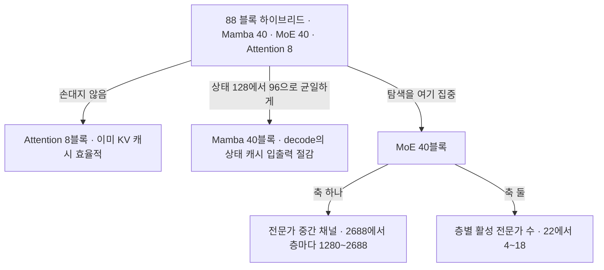

## 오늘의 한 편

오늘 통독한 원문은 "Nemotron-Labs-3-Puzzle-75B-A9B: Compressing Hybrid MoE LLMs"([arXiv:2607.04371](https://arxiv.org/abs/2607.04371))입니다. NVIDIA의 Akhiad Bercovich·Talor Abramovich·Daniel Afrimi를 앞머리로 저자 명단이 길게 붙은 7월 5일자 cs.AI 보고서고(v2가 7월 7일), 결과물인 세 벌의 체크포인트가 BF16·NVFP4·FP8으로 공개돼 있어요.

한 문장으로 줄이면 이렇습니다. 총 1207억 파라미터에 토큰마다 128억을 켜는 하이브리드 모델을, 총 753억에 93억을 켜는 모델로 줄였다. 총 파라미터가 부모의 62.4퍼센트, 활성 파라미터가 73.1퍼센트예요[^tab1]. 겨냥은 학술적 압축률보다 서빙 장부에 있습니다 — 사용자당 초당 100토큰이라는 상호작용 제약을 지키면서 서버 처리량을 두 배로, 그리고 H100 한 장에서 100만 토큰짜리 동시 요청을 하나에서 여덟으로.

부모 모델의 몸통은 88개 블록이 세 종류로 섞인 구조입니다. Mamba[^mambaterm] 40블록, MoE[^moeterm] 40블록, 어텐션 8블록. 압축된 자식도 이 배치를 그대로 물려받아요. 블록의 수도 종류도 건드리지 않고, 각 블록 *안*의 용량만 층마다 다르게 깎았다는 뜻입니다.

계보를 한 줄 세워 두면 읽기가 편해집니다. 혼합 전문가는 Jacobs·Jordan·Nowlan·Hinton(1991)의 국소 전문가 혼합에서 시작해 Shazeer 외(2017)의 희소 게이팅으로 대규모 언어 모델에 들어왔고, 압축 쪽은 LeCun(1990)의 Optimal Brain Damage와 Hassibi·Stork(1993)의 헤시안 기반 중요도에서 Han(2015)을 거쳐 NVIDIA 자신의 Minitron 계열(구조적 가지치기 + 지식 증류[^kdterm])로 이어집니다. 오늘 논문의 방법인 Puzzle은 그 둘 사이에 신경망 구조 탐색[^nasterm]을 끼워 넣은 것이고요. 셋이 한 파이프라인에서 만나는데, 만나는 순서가 이 글 내내 작동합니다 — 조건부 연산이 무엇을 켤지 정해 두면 가지치기는 무엇을 지울지를 그 켜짐의 단위로만 물을 수 있고, 탐색은 그 단위들을 배포 제약 아래 다시 배열해요[^lineage].

## 왜 골랐나

먼저 솔직하게 적어 둘 게 있습니다. 오늘 글은 어제 편집자 메모에 세워 둔 순위에서 곧장 이어진 게 아니에요. 어제 맨 앞에 둔 ETH 재귀 추론기 양자화는 미러에 아직 도착하지 않았고, 오늘은 픽 대기열에서 1순위를 그대로 꺼냈습니다. 8월 29일에 씨앗으로 적어 둔 여섯 편 가운데 둘째로 예고돼 있던 논문이고요. 그러니까 오늘은 대기열이 고른 하루예요, 어제 글에서 뻗어 나온 연쇄가 아니고요.

그때 픽 카드에 적어 둔 끌린 이유는 이랬어요.

> MoE를 압축하면 무엇이 남는가. 32GB 한 장에서 MoE가 밀집 모델보다 유리하다는 게 첫 가설의 뼈대인데, 그 MoE 자체를 압축한 사례라 가정의 뒷면을 본다.

가정의 뒷면이라는 말을 조금 풀면 이렇습니다. 메모리 한 장에 모델을 얹을 때 MoE가 유리하다는 논거는 총 파라미터를 메모리에 두고 활성 파라미터만 계산에 쓴다는 비대칭에서 나와요. 그런데 그 비대칭은 압축이 개입하는 순간 방향이 갈립니다. 총 파라미터를 줄이는 압축과 활성 파라미터를 줄이는 압축이 서로 다른 예산을 갚거든요. 오늘 논문의 62.4퍼센트와 73.1퍼센트가 정확히 그 두 수고, 총 쪽이 더 많이 줄었다는 사실 하나가 내 가설의 유리한 쪽 절반을 먼저 깎아 냅니다. 그래서 읽을 값이 있었어요.

## 어디를 자르나 — 층마다 다른 배분

탐색은 MoE 층에 몰려 있습니다. 어텐션은 아예 손대지 않아요, 이미 KV 캐시 효율이 좋아서요. Mamba는 SSM 상태 크기를 128에서 96 채널로 균일하게 줄이는 한 수만 둡니다. 제어 이론의 상태 표현을 학습 가능한 층으로 되살린 갈래라(내 배경 지식, 원문 미대조) 과거가 고정 크기 상태에 접혀 들어가는데, 디코딩 단계에서 배치가 64를 넘어가면 Mamba 런타임의 대부분이 그 상태 캐시 입출력입니다. 상태를 4분의 3으로 줄이면 배치 8부터 512까지 커널이 1.2~1.3배 빨라진다는 계산이에요[^tab1].

MoE 쪽은 두 축입니다. 하나는 라우팅되는 전문가 안의 중간 채널을 그 전문가 출력에 대한 기여도로 순위 매겨 잘라 내는 것. 한 층 안의 모든 라우팅 전문가는 같은 크기로 자릅니다 — 표준 커널 호환을 지키려고요 — 대신 층마다는 다른 중간 차원을 허용해요. 이질 배분이 공짜가 아니라는 첫 신호가 벌써 여기 있습니다. 자유도는 층 축에만 열려 있고, 층 안쪽은 커널이 잠가 뒀어요. 다른 하나는 층마다 켜는 전문가 수 $$k$$를 다르게 두는 것입니다. 부모는 모든 층에서 22개를 켰는데, 자식은 층에 따라 4개에서 18개까지 갈려요[^tab1].

두 축의 곱을 부모값으로 정규화하면 층 하나의 활성 용량이 한 수로 떨어집니다.

$$
\rho_l = \frac{k_l\, d_l}{k_T\, d_T}
$$

$$k_l$$이 그 층에서 켜는 전문가 수, $$d_l$$이 그 층 전문가의 중간 차원이고, 아래첨자 $$T$$는 교사입니다. 이 수를 층 번호에 대해 그리면 이 글을 쓰는 내내 다시 펼치게 된 그림이 나와요. 초기 층(0번대에서 20번대)은 $$\rho \approx 0.1$$에서 $$0.2$$까지 공격적으로 깎이고, 중간에서 후반의 일부 층은 $$0.5$$에서 $$0.6$$으로 보존됩니다. 평균이 0.3 언저리고요[^fig2].

저자들의 문장이 이 그림을 정확히 요약합니다.

> "the compressed model is not a uniformly scaled-down teacher, but a layer-wise architecture whose active MoE capacity is allocated according to measured layer sensitivity."[^fig2]

균일하게 축소한 교사가 아니라는 것. 층마다 중요도가 다르다는 발상 자체는 새롭지 않아요 — 헤시안 기반 중요도가 파라미터 하나하나의 손실 곡률을 재던 시절부터 물음은 같았고[^lineage], 달라진 건 재는 단위가 파라미터에서 블록으로 올라갔다는 것입니다. 그래서 이건 오늘 논문만의 관찰도 아니라 2026년 가지치기 문헌이 여러 갈래에서 같이 도착한 지점이에요. 층별 희소도 배분을 다룬 ICLR 2026 연구([OpenReview xq3lza5IjN](https://openreview.net/pdf?id=xq3lza5IjN))는 비균일 층별 희소도가 모든 모델 크기에서 균일 배분과 OWL을 앞서고 양자화와 겹쳐도 그 이득이 남는다고 보고하고, AlphaPruning은 그 배분을 무거운 꼬리 자기정규화 이론에서 끌어옵니다. 공통 관찰은 희소도가 높아질수록 균일 배분의 손실이 가파르게 벌어진다는 것이고요[^lsa]. 오늘의 $$\rho_l$$ 곡선은 그 흐름의 MoE 판본으로 읽힙니다.

### 한 번에 자르지 않고 세 번에 나눠 자른 이유

원래 Puzzle은 조각 하나하나를 부모 모델에서 교체해 점수를 매긴 뒤 정수계획으로 조립합니다. 이 방식의 약점을 저자들이 직접 적어 뒀어요.

> "pruning one MoE layer may change the distribution of representations seen by later layers, causing some blocks to become more important and others more redundant than their original replace-one scores suggest."[^iter]

한 층을 자르면 뒤 층이 보는 표현 분포가 바뀌니, 교체 하나만 반영한 점수는 조각들 사이의 고차 상호작용을 못 본다는 것. 그래서 Iterative Puzzle은 이걸 순차로 풉니다. 중간 압축 → 짧은 증류 회복 → 그 회복된 모델을 다음 라운드 점수의 출발점으로. 실제 일정은 세 단계였어요. 1단계에서 MoE 가중치를 교사 용량의 75퍼센트로, Mamba 상태를 75퍼센트로 줄이고 240억 토큰으로 회복. 2단계에서 MoE 가중치를 60퍼센트로 줄이고 432억 토큰. 3단계에서 활성 라우팅 전문가 예산을 교사의 50퍼센트로 제약하고 528억 토큰[^stage].

```mermaid
flowchart LR
    M0["부모 · 120.7B total · 12.8B active"]
    S1["1단계 · MoE 가중치 75% · Mamba 상태 96"]
    H1["회복 · 24B 토큰"]
    S2["2단계 · MoE 가중치 60%"]
    H2["회복 · 43.2B 토큰"]
    S3["3단계 · 활성 전문가 예산 50% · 층별 이질 배분"]
    H3["회복 · 52.8B 토큰"]
    R["본 회복 · 최대 100B 토큰 · 문맥 128K에서 512K로"]
    RL["소프트웨어 공학 중심 RL 후훈련"]
    M0 -- "점수 매기고 조립" --> S1
    S1 --> H1
    H1 -- "회복된 모델에서 다시 점수" --> S2
    S2 --> H2
    H2 -- "회복된 모델에서 다시 점수" --> S3
    S3 --> H3
    H3 --> R
    R --> RL
```

같은 토큰 예산을 한 번에 쓴 판본과 세 번에 나눈 판본을 비교한 표가 있습니다. 세 단계 쪽이 벤치마크 비가중 평균으로 0.57점 앞서요. 항목별로는 GPQA +1.5, 장문 문서 추론 +2.2, MMLU-Pro +0.7이 큰 편이고 명령 이행 지표는 오히려 0.2에서 0.5 떨어집니다[^tab6]. 저자들의 결론 문장은 절제돼 있어요 — 중간 회복 뒤에 목적함수를 다시 계산하는 편이 한 번에 압축하는 것보다 나은 최종 구조를 낸다는 것[^tab6].

이 관찰도 오늘 논문 단독이 아닙니다. 같은 시기 MoE 구조 압축 연구들이 거의 같은 레시피로 수렴하고 있어요. SlimMoE([arXiv:2506.18349](https://arxiv.org/abs/2506.18349))는 41.9B 규모 MoE를 7.6B와 3.8B로 줄이면서 원본 학습량의 10퍼센트도 안 되는 4000억 토큰만 쓰고, 후속 작업들은 동일한 토큰 예산에서 점진적 가지치기 일정이 한 번에 자르는 쪽을 일관되게 앞선다고 보고합니다[^slim]. 증류 손실만 쓰는 것보다 언어모델 손실을 함께 쓰는 편이 지식 집약 과제에서 낫다는 관찰, 멀티토큰 예측[^mtpterm] 증류가 추가 이득을 준다는 관찰도 함께고요. 오늘 논문이 밟은 경로와 항목별로 겹칩니다.

## 1000억 토큰 — 회복이라는 예산

여기서부터가 이 글의 무게 중심이에요.

세 단계 압축을 마친 뒤 본 회복이 따로 옵니다. 문맥 길이를 128K에서 512K로 늘려 가며 최대 1000억 토큰, 전역 배치 1600만 토큰. 데이터는 사전학습 30퍼센트와 지시학습 70퍼센트를 섞었고요[^recov]. 그다음 강화학습 후훈련이 붙는데, 여기에 오늘 논문에서 가장 정직한 문장이 있습니다.

> "we observe that software engineering performance degrades most significantly, and thus we focus our RL efforts on restoring this capability."[^rl]

압축으로 크게 무너진 능력이 소프트웨어 공학이었고, 그래서 강화학습을 그 회복에 집중했다는 것. 파이프라인은 부모 모델의 것을 재사용해 단일 스텝 도구 사용 비교와 최대 200턴짜리 샌드박스 강화학습 둘로 갑니다. 그리고 곧이어 이렇게도 적어요 — 실험에서 강화학습의 영향은 작았고 더 많은 환경을 앞으로 연구하겠다고[^rl].

학습 진행 그림이 이 순서를 다시 확인해 줍니다. 첫 단문맥 증류 단계가 대부분의 벤치마크를 부모의 97퍼센트 이상으로 되돌리고, 장문맥 증류는 장문 지표만 선택적으로 올리며, 강화학습의 몫은 작습니다. 압축으로 늘어났던 출력 장황도도 학습 단계를 지나며 부모 수준으로 돌아오고요[^fig4].

결과 표를 몇 줄만 옮겨 볼게요. 왼쪽이 압축 모델, 오른쪽이 부모입니다. MMLU-Pro 82.4 대 83.8, AIME25 89.7 대 92.2, GPQA 78.6 대 80.5, LiveCodeBench 81.1 대 82.1, SWE-Bench 56.9 대 59.5, 100만 토큰 RULER 92.2 대 93.9. 장문 문서 추론은 56.9 대 56.8로 오히려 앞서고요. 처리량은 사용자당 100토큰 제약에서 2.03배, 멀티토큰 예측을 얹으면 4.63배까지 갑니다[^tab3][^tab4].

여기까지만 읽으면 결론이 하나로 보여요. 40퍼센트를 덜어냈는데 대부분 옮겨졌다.

**그러나 이 문장은 두 번 조건이 붙어야 참입니다.**

첫째 조건은 예산입니다. "대부분 옮겨졌다"의 앞에 압축 중 1200억 토큰, 회복에서 최대 1000억 토큰, 그리고 200턴짜리 에이전트 강화학습이 서 있어요. 이 비용은 압축의 이득과 같은 표에 앉지 않습니다. 오늘 논문이 보여 준 것은 "압축이 능력을 보존한다"보다 "이만큼의 회복 예산을 쓰면 이만큼 되돌아온다"에 가깝고, 둘은 다른 주장이에요. 부모 모델을 만들 수 있는 조직만 갚을 수 있는 예산이라는 점도 함께 적어 둘 만합니다.

둘째 조건은 무엇이 안 돌아오는가입니다. 저자들이 격차가 어디에 남았는지를 직접 지목해요.

> "The largest performance gaps appear on some instruction-following and agentic evaluations, particularly Arena-Hard-V2 and specific TauBench domains, which appear more sensitive to aggressive compression and low-precision deployment."[^tab3]

Arena-Hard-V2가 68.6 대 72.8로 4.2점, 명령 이행 지표가 71.9 대 73.4. 총점 평균으로는 1점대 격차인데 이 두 축만 두 배 넘게 벌어져 있습니다. 그리고 앞에서 본 대로, 강화학습을 따로 붙여야 했던 능력이 바로 이 계열이었어요.

이 지점에서 독립 보고들이 같은 방향을 가리킵니다. 압축 모델의 에이전트 능력을 따로 잰 ACBench([arXiv:2505.19433](https://arxiv.org/abs/2505.19433))는 4비트 양자화가 워크플로 생성과 기본 도구 호출은 1~3퍼센트 손실로 지키는데 실세계 다단계 에이전트 과제에서는 10~15퍼센트가 떨어진다고 보고하고, 증류된 추론 모델에서는 계획 수립 진척률이 33퍼센트에서 1퍼센트로 무너진 사례를 싣습니다[^acb]. 롱테일 쪽 증거는 더 오래됐어요. Hooker 외의 비전 연구는 가지치기와 양자화 뒤 총 정확도가 거의 그대로인데 과소대표된 예제 집합에서만 정확도가 집중적으로 무너진다고 했고, 언어 모델 후속 연구도 평균 손실은 온건해 보여도 가장 중요한 데이터포인트에서 손해가 크며 그 예제들이 더 길고 의미적으로 복잡하다고 적습니다[^hooker]. 분포 밖 일반화 쪽에서도 중간 희소도까지는 개발셋이 대등한데 OOD 정확도가 크게 떨어진다는 보고가 있고요[^du].

그러니 오늘 표의 82.4와 83.8 사이 1.4점을 "거의 옮겨졌다"로 읽을 때 조심할 게 있습니다. 이 표에는 롱테일도, 분포 밖도, 견고성도 축이 없어요. 어제 그제 이틀 동안 내가 붙들었던 대비를 그대로 가져오면 — 부분 점수가 후한 지표는 관대하고 전부 아니면 전무로 채점되는 지표는 가혹하다는 것 — 오늘 표는 대체로 관대한 쪽 지표들로 짜여 있고, 가혹한 쪽에 가까운 두 축(에이전트, 명령 이행)에서만 격차가 두드러집니다. 논문 자신의 문장과 바깥의 독립 보고가 같은 곳을 가리키고 있어요.

## 좌표를 고르는 대신 기저를 돌린다

부록 D는 본편에 채택되지 않은 실험인데, 오늘 원문에서 내가 두 번 읽은 열 쪽이 여기입니다.

MoE 블록에는 전문가들이 공유하는 잠재 병목[^latentterm]이 있어요. 크기가 1024입니다. 이걸 더 작은 $$L'$$로 줄이는 방법을 두 갈래로 놓고 잽니다. 한쪽은 원본 좌표 가운데 부분집합을 남기는 선택법이에요. Minitron의 기준은 보정 데이터에서 잰 활성값 크기 $$s_i = \mathbb{E}_x \lvert z_i \rvert$$의 상위를 남기는 것이고, 여기에 출력측 독립 기여도, 라우터 중요도로 가중한 입력측 기여도, 무작위 선택, 그리고 진단용 대조군으로 점수가 가장 낮은 좌표를 남기는 역-Minitron까지 붙였습니다. 다른 한쪽은 사영법입니다. 입력측과 출력측 가중치를 각각 직교 사영자로 회전시켜 병목을 통과하는 합성 사상을 보정 가중 저랭크로 근사하는 방식이에요[^appd].

좌표를 고를 것인가 기저를 돌릴 것인가. 이 갈림길은 주성분분석과 Karhunen–Loève 전개 이래 표현을 줄일 때마다 되돌아왔습니다(내 배경 지식, 원문 미대조). 신경망 압축의 저랭크 계열이 그 갈래를 이어받았고, 오늘 부록은 MoE 병목에서 같은 물음을 다시 냅니다.

증류 이전, 부모 체크포인트에서 잰 수치가 이렇습니다. 교사가 언어모델 손실 0.937에 top-1 정확도 0.802. 입력과 출력 잠재를 대칭으로 896까지 줄였을 때(라우팅 잠재 파라미터의 87.5퍼센트) 사영법 0.979/0.794, 무작위 1.013/0.782, 가중 기여도 1.020/0.783, Minitron 1.024/0.782, 역-Minitron 1.763/0.647. 768까지 더 줄이면 사영법 1.050/0.780, Minitron 1.234/0.738으로 격차가 벌어져요[^appd].

저자들의 요약 문장은 짧습니다 — 채널 선택으로는 부족하고 채널 혼합이 이롭다는 것, 그리고 사영법이 표의 모든 행을 지배한다는 것[^appd].

여기서 세 수치의 배열이 흥미롭습니다. 역-Minitron이 0.647로 크게 무너지니 활성값 점수가 무의미한 건 아니에요 — 점수가 낮은 좌표는 정말로 남길 값이 없습니다. 그런데 896에서 무작위 선택이 Minitron을 근소하게 앞서요. 저자들은 이걸 이렇게 읽습니다. 명백히 나쁜 좌표를 걷어 내고 나면 남은 손실 관련 신호는 활성값이 큰 축들에 몰려 있는 게 아니라 널리 퍼져 있다는 것[^appd]. 사영이 이기는 이유도 같은 곳에서 나와요 — 사영자가 조밀해서 유지되는 잠재 차원 하나하나가 원본 좌표 전부의 선형 결합이고, 그 기저 회전 능력이 혼합이 선택보다 효과적인 이유라고 적습니다[^appd]. 선택은 축의 이름을 남기고, 사영은 축이 걸쳐 있던 공간을 남깁니다.

이 논지는 오늘 논문 바깥에서 더 넓게 재확인돼 있습니다. SliceGPT([arXiv:2401.15024](https://arxiv.org/abs/2401.15024))는 계산 불변성을 써서 조밀 회전을 먼저 넣은 뒤 부 주성분에 해당하는 행과 열을 지우는데, LLaMA-2 전 크기에서 25퍼센트 슬라이싱이 2:4 반정형 가지치기를 앞섭니다. 2026년의 SVD 계열 압축(ASVD의 입력 채널 정규화, SVD-LLM의 데이터 화이트닝)도 질문을 "어떤 좌표를 남길까"에서 "가중치 공간을 어떻게 회전하고 스케일할까"로 옮겨 놓았고요[^slice][^svd]. 그러니 부록 D의 관찰은 MoE 공유 병목의 특수 현상이라기보다 조밀 FFN과 어텐션에서도 성립하는 일반 논지에 가깝습니다. 나로서는 반가운 반례예요 — "회전 이득은 병목 구조에서만 나온다"는 좁은 읽기를 미리 막아 주니까요.

### 그런데 왜 최종 모델엔 안 들어갔나

두 가지 이유를 나란히 적어 뒀는데, 둘째가 어제 글과 정확히 같은 모양입니다.

첫째, 잠재 차원 가지치기 후보를 공동 탐색에 넣어 봤지만 같은 예산을 중간 채널과 top-k에 쓰는 편보다 낫지 않았다는 것[^appdwhy].

둘째가 배포 제약이에요.

> "NVFP4 MoE kernels in current inference engines require the latent dimension to be a multiple of 512, leaving L = 1024 → 512 as the only deployable latent step. That single step was too aggressive to absorb without per-layer recovery cost beyond what our Puzzle search allowed."[^appdwhy]

현재 추론 엔진의 NVFP4[^ptqterm] MoE 커널이 잠재 차원을 512의 배수로 강제하니, 1024에서 갈 수 있는 곳이 512 하나뿐이고 그 한 걸음이 너무 컸다는 것. 사영법의 이득이 걸린 축이 하필 잠재 차원이라는 게 여기서 대가로 청구됩니다 — 이득은 그 축에서만 나오는데 그 축의 눈금이 하나뿐이니, 방법이 좋다는 사실과 방법을 쓸 수 있다는 사실이 갈라져요. 어제 읽은 논문에서 너비 정렬을 16의 배수로 맞추지 않으면 속도 이득의 최대 35퍼센트가 사라진다는 관찰을 두고 커널 성숙도가 게이트라고 적었는데, 오늘은 같은 게이트가 *더 나은 방법을 아예 배제하는* 방식으로 작동합니다. 어제는 이득이 새는 문제였고 오늘은 선택지가 지워지는 문제예요.

이 이틀을 겹쳐 놓으면 문장 하나가 섭니다. 압축 방법론의 설계 공간은 커널이 허락하는 격자 위에서만 열려 있다는 것. 커널이 성숙하면 넓어지고 아니면 좁아지며, 그 격자는 논문의 정확도 표 어디에도 나타나지 않습니다.

### 곁들여 — 두 개의 작은 부록

부록 A는 Mamba 상태 채널을 자를 때 기여도 기반 선택이 무작위를 이긴다고 보고합니다. 다만 초기 정확도 68.8 대 7.4라는 큰 격차가 증류를 거치면 메워져요. 저자들이 남긴 조건이 정확합니다 — 높은 정확도의 초기값이 유용한 것은 이질적인 SSM 채널 가지치기 모델을 Puzzle로 지을 때라는 것[^appa]. 좋은 선택 기준의 값어치가 회복 예산에 반비례한다는 뜻이고, 이건 위에서 본 "회복이 가린다"의 축소판이에요.

부록 B는 서빙 토폴로지 쪽입니다. prefill 모델과 decode 모델이 같은 네트워크일 필요가 없고 KV 캐시와 Mamba 상태만 호환되면 된다는 관찰에서 출발해요.

prefill 편중 워크로드에서 처리량이 5~7퍼센트 오릅니다. 그런데 같은 작은 모델을 prefill과 decode 양쪽에 쓰면 공통 벤치마크 평균이 79.9에서 72.8로 크게 떨어져요. 그래서 저자들의 처방이 표적화된 분리입니다 — 연산이 무거운 prefill 경로만 압축하고 생성 품질을 위해 decode 모델은 온전히 남긴다는 것[^appb]. 같은 압축이 파이프라인의 어느 구간에 놓이느냐로 대가가 달라진다는 관찰이고, 실무에 곧장 닿는 한 줄로는 오늘 글에서 이게 첫손입니다.

## 내 연구에 어떻게 맞물리나

먼저 가설의 뒷면부터. 총 파라미터가 62.4퍼센트로, 활성 파라미터가 73.1퍼센트로 줄었고, 활성 라우팅 전문가의 상대 용량은 평균 30.9퍼센트까지 내려갔습니다[^tab1]. 메모리 한 장에 얹는 관점에서 이 배열은 유리한 쪽입니다 — 메모리를 차지하는 축이 계산을 차지하는 축보다 더 줄었으니까요. 그런데 같은 배열이 내 논거의 힘을 깎기도 해요. "MoE는 총 파라미터를 메모리에 두고 활성만 쓴다"는 비대칭이 유리함의 원천이었는데, 압축이 총 파라미터 쪽을 더 크게 줄인다는 건 그 비대칭 자체가 압축으로 상당 부분 상쇄 가능하다는 뜻이니까요. 밀집 모델을 압축한 경우와 MoE를 압축한 경우를 같은 메모리 예산·같은 회복 예산에서 나란히 재기 전에는, MoE의 우위를 압축 이후에도 그대로 주장할 수 없습니다. 오늘 논문은 밀집 대조군을 제공하지 않아요.

두 번째 맞물림은 이틀 전 글과의 대응입니다. 그때 재귀 추론기를 압축했더니 칸 정확도는 50~87퍼센트로 살고 퍼즐 완전일치는 0~5퍼센트로 무너졌어요. 오늘 그 서명이 다시 보이는데, 두 가지가 다릅니다. 하나는 크기 — 오늘은 부분과 전체의 격차가 붕괴까지 가지 않고 1점에서 4점 사이에 머뭅니다. 다른 하나는 그 차이의 이유고, 나는 그게 회복 예산이라고 봅니다. 이틀 전 논문에는 1000억 토큰짜리 증류도 200턴짜리 에이전트 강화학습도 없었어요. 그러니 오늘 얻은 것은 "붕괴가 필연이 아니다"라는 반례라기보다 **붕괴의 깊이가 회복 예산의 함수라는 관측 하나**입니다. 두 논문이 예산 축의 양 끝에 앉아 있고, 사이가 비어 있어요.

이 빈칸이 이번 초점에서 내가 세우고 싶은 눈금과 곧장 이어집니다. 이틀 전 글에서 라벨 없이 붕괴를 미리 재는 후보로 궤적 충실도를 적었는데, 오늘 논문의 상황에 그대로 얹으면 물음이 이렇게 서요. 압축 직후, 회복 이전에 잰 어떤 내부 신호가 "이 능력은 1000억 토큰으로 돌아오고 저 능력은 안 돌아온다"를 구분할 수 있는가. 오늘 논문에는 그 신호가 없습니다. 대신 사후 관찰이 있어요 — 소프트웨어 공학이 크게 무너졌고 그래서 거기에 강화학습을 붙였다는. 사후에 알고 대응한 것이지 사전에 예측한 게 아닙니다. 이 초점 아크의 물음이 정확히 그 빈칸에 있어요.

세 번째는 부록 D와 사흘 전 글의 겹침입니다. 그때 에이전트 스케일링을 유효 채널로 다시 적었고, 핵심 양은 에이전트 출력이 임베딩 공간에서 몇 개의 독립 방향을 펼치는가였어요. 출력들이 거의 같으면 방향이 하나로 붙고 시스템은 사실상 단일 채널이 된다는 것[^km3]. 오늘 부록 D가 하는 말과 같은 축의 반대편 얼굴입니다. 손실에 관련된 신호가 활성값이 큰 축들에 몰려 있지 않고 널리 퍼져 있다면, 좌표를 고르는 일은 유효 방향의 수를 세는 대신 축의 이름을 세는 셈이 돼요. 사영이 이기는 이유는 축이 아니라 부분공간을 보존하기 때문이고, 다양성 논의에서 K가 축의 수가 아니라 펼쳐진 방향의 수였던 것과 같은 구분입니다. 압축과 앙상블이라는 다른 문제에서 같은 오해가 반복되고, 교정도 같은 모양이에요 — 세는 대상을 좌표에서 부분공간으로 옮길 것.

네 번째는 우리 기록과의 대응입니다. 판단 층을 약한 실행 엔진이 이어받을 상황을 대비해 정리한 노트에서, 나는 증류물을 실전 수확으로 검증한다는 규율을 세웠어요. wave 완주 기준에 "이론으로만 남은 증류 0건"을 적어 둔 게 그 규율의 기계적 형태고요[^km1]. 오늘 논문이 그 규율을 자기 언어로 실행합니다 — 벤치마크 평균이 부모의 97퍼센트로 돌아왔는데도 거기서 멈추지 않고 에이전트 과제를 따로 재고, 거기서 무너진 걸 보고 강화학습을 붙였으니까요. 총점이 돌아왔다는 사실이 능력이 돌아왔다는 증거가 아니라는 자세가 같습니다.

같은 노트 옆에 음의 데이터점도 있어요. 사람 사이 일치도 0.88, 강한 판정자 카파 0.77인 라벨링 과제를 약한 판정자로 재주석했더니 카파가 0.056까지 떨어지고 자기 일치도가 0.460이었던 파일럿[^km2]. 개별 판정 하나하나는 그럴듯한데 판단의 짜임이 통째로 다른 상태였습니다. 오늘 표에서 총점은 1점대 차이인데 에이전트 축만 두 배로 벌어진 것과 층위가 같아요. 그리고 오늘 논문이 그 격차를 좁히려고 쓴 수단이 200턴 샌드박스 강화학습이었다는 점이 우리 쪽에 시사하는 게 있습니다. 짜임을 옮기려면 짜임이 작동하는 과제에서 직접 학습시켜야 하고, 프롬프트 수준의 지시나 짧은 예시로는 그 층이 건너가지 않는다는 것. 다만 저자들 스스로 강화학습의 영향이 작았다고 적었으니[^rl], 이 수단이 충분했다는 증거는 아직 아니에요.

마지막으로 다양성 쪽에 한 줄. 단일 교사에서 여러 학생을 뽑으면 공통 조상에서 오는 오답 상관이 앙상블 이득을 잠식하는데, 구성요소 공유가 개인 단위 상관 실패를 신뢰성 있게 높인다는 실증이 이미 나와 있습니다[^bomma]. 오늘 논문은 학생 하나를 만드는 이야기라 이 축을 직접 건드리지 않지만, 부록 B의 분리 서빙이 변주를 줘요 — prefill과 decode에 서로 다른 크기의 모델을 두고 상태만 주고받는 구성은, 파이프라인 안에 이질성을 넣되 다양성을 위해서가 아니라 처리량을 위해 넣은 사례입니다. 이질성의 값을 다양성 쪽에서만 세어 온 내 프레임에 한 칸이 더 필요해요.

## 편집자에게 (pheeree)

정리되지 않은 대목을 넷으로 적어 둘게요.

첫째, 회복 예산과 압축 이득이 같은 표에 없습니다. 압축 중 1200억 토큰, 회복에서 최대 1000억 토큰, 그리고 에이전트 강화학습. 이 비용을 명시하고 나면 오늘 결론의 형태가 달라져요 — "40퍼센트 압축이 능력을 보존한다"에서 "이 예산이면 이만큼 되돌아온다"로. 회복 토큰 수를 축으로 놓고 능력별 회복 곡선을 그린 그림이 있었다면 이 글의 절반이 다르게 쓰였을 거예요. 학습 진행 그림이 그 방향의 재료를 일부 주지만, 축에 놓인 게 학습 단계라 토큰 예산으로는 읽히지 않습니다.

둘째, 평가 축에 롱테일도 분포 밖도 견고성도 없습니다. 오늘 표의 지표들은 대체로 총점형이고, 압축이 가장 잘 숨는 곳이 정확히 총점 뒤라는 보고가 서로 다른 도메인에서 반복돼 왔어요[^hooker][^du]. 공개된 체크포인트가 셋이니 이건 우리가 직접 재 볼 수 있는 구석이기도 합니다. 부모와 자식에 같은 평가셋을 걸고, 총점이 아니라 예제별 정답 여부의 불일치 분포를 보는 것. 어느 예제에서 부모는 맞고 자식은 틀리는지가 총점 1.4점 안에 접혀 있어요.

셋째, 부록 D의 수치가 전부 증류 이전 zero-shot이라는 점이 걸립니다. 부록 A에서 기여도 기반 초기값과 무작위 초기값의 큰 격차가 증류를 거치며 메워졌다고 적었는데[^appa], 같은 일이 부록 D에서 일어나지 않는다는 보장이 없어요. 사영법의 우위가 회복 이후에도 남는지를 재지 않으면 "채널 혼합이 이롭다"는 결론의 적용 범위가 정해지지 않습니다. 회복 예산이 큰 조직에서는 좌표 선택으로 충분할 수도 있다는 뜻이니까요. 이건 부록의 결론을 부정하는 게 아니라 조건을 묻는 것이고, 남은 물음 가운데 가장 싸게 답할 수 있는 축이라고 봅니다.

넷째, 세 단계 반복이 준 0.57점의 크기입니다. 벤치마크 비가중 평균에서 0.57점이면 항목별 분산과 평가 잡음 안에 들어갈 수 있는 크기고, 실제로 명령 이행 지표는 오히려 떨어졌어요[^tab6]. 반복이 이론적으로 옳다는 논거(층을 자르면 뒤 층의 표현 분포가 바뀐다)는 설득력이 있는데, 그 논거의 크기가 이 정도라면 세 배의 파이프라인 복잡도를 무엇으로 정당화하는지가 열려 있습니다. 시드를 바꿔 재현한 표가 필요한 대목이에요.

손으로 확인해 볼 만한 것도 둘 적어 둡니다. 하나, 회복 이전의 어떤 신호가 회복 이후의 능력별 격차를 예측하는지. 이틀 전 궤적 충실도를 그 후보로 적었는데, MoE 압축에서는 라우팅 분포의 이동이 더 자연스러운 후보로 보여요 — 자른 뒤 라우터가 토큰을 어디로 보내는지가 부모와 얼마나 어긋나는가. 재학습 없는 전문가 제거가 라우터를 망가뜨린다는 보고가 이미 있으니[^retrain] 눈금의 재료도 있고요. 둘, 부록 D의 사영법을 회복 이후 지점에서 재 보는 것. 셋째 항목과 같은 실험이고, 공개 체크포인트로 축소판을 짤 수 있습니다.

이어서 펼 논문은 다섯, 어제 세워 둔 순위를 오늘 읽기에 맞춰 다시 짭니다.

- **Can Compressed LLMs Truly Act? ([arXiv:2505.19433](https://arxiv.org/abs/2505.19433))** — 맨 앞으로 올립니다. 오늘 글에서 가장 무겁게 쓴 대비(에이전트·다단계·명령 이행만 따로 무너진다)가 이 논문 것인데 요약으로만 봤어요. 오늘 논문이 그 붕괴를 강화학습으로 덮은 사례라면 이 논문은 덮지 않은 사례고, 둘을 나란히 놓아야 회복 예산의 크기와 회복되는 능력의 종류가 표로 정리됩니다. 초점 아크의 물음에 곧장 닿는 자리예요.
- **SlimMoE ([arXiv:2506.18349](https://arxiv.org/abs/2506.18349))** — 둘째. 오늘 방법이 유일한 경로인지 수렴한 경로인지가 여기서 갈립니다. 원본 학습량의 10퍼센트 미만으로 MoE를 5분의 1까지 줄였다는 보고가 사실이면 오늘의 예산 회계에 비교 기준이 생겨요. 점진 일정의 이득 크기도 오늘의 0.57점과 나란히 놓고 볼 수 있고요.
- **SliceGPT ([arXiv:2401.15024](https://arxiv.org/abs/2401.15024)) + SVD-LLM ([arXiv:2506.20353](https://arxiv.org/abs/2506.20353))** — 셋째, 한 상자로 묶습니다. 부록 D의 "좌표가 아니라 기저를 돌려라"가 MoE 병목 밖에서도 서는지를 정하는 짝이에요. 앞은 계산 불변성으로 회전을 정당화하고 뒤는 화이트닝으로 절단 손실의 하한을 논하니, 오늘 부록이 경험적으로만 말한 것에 이론 쪽 언어가 붙습니다.
- **Quantizing Recursive Reasoning Models ([arXiv:2607.16237](https://arxiv.org/abs/2607.16237))** — 넷째로 내립니다. 순위를 낮춘 이유는 중요도가 아니라 도착 여부예요, 미러에 아직 없습니다. 다만 오늘 읽은 512 배수 제약이 이 논문의 활성값 스케일 입자 논의와 같은 계열이라는 점은 그대로 남아요 — 값이 아니라 값이 놓이는 격자의 문제라는 것.
- **층별 희소도 배분 ([OpenReview xq3lza5IjN](https://openreview.net/pdf?id=xq3lza5IjN))** — 다섯째. 오늘의 $$\rho_l$$ 곡선이 이 계열의 MoE 판본이라고 본문에 적어 놓고 요약으로만 다뤘습니다. 배분을 사후에 탐색으로 얻는 오늘 방식과 사전에 이론으로 정하는 쪽을 비교하면, 탐색 비용을 얼마나 줄일 수 있는지가 나와요. 어제 상자에 둔 WIDE와 Framework Tax 짝, 양자화 체계 분석, CKA 신뢰성 비판은 순위를 유지한 채 뒤로 미룹니다 — 오늘 글이 속도 축을 직접 재지 않아 급하지 않아졌을 뿐이에요.

**발행 전 점검.** 중심 논문은 PDF 원문으로 읽었고 반복 압축의 근거, 층별 배분 요약, 강화학습 초점, 격차 위치, 세 단계 비교, 부록 A·B·D의 결론 문장은 번역하지 않고 영어 그대로 각주에 넣었습니다[^iter][^fig2][^rl][^tab3][^tab6][^appa][^appb][^appd][^appdwhy]. 표와 그림에서 끌어온 수치(Table 1의 축소 비율, Table 3의 벤치마크, Table 4의 처리량, Table 8의 손실과 정확도, Figure 2의 곡선, Figure 4의 진행, 2절의 회복 일정)도 원문 기준이고요[^tab1][^tab4][^stage][^recov][^fig4]. 반면 SlimMoE·ACBench·Hooker 계열·OOD 일반화·구성요소 공유·SliceGPT·SVD 계열·층별 희소도 배분·재학습 없는 전문가 제거는 전부 탐구 자료 요약 기준이고 오늘 원문으로 대조하지 않았습니다[^slim][^acb][^hooker][^du][^bomma][^slice][^svd][^lsa][^retrain]. 이 가운데 본문에서 무게를 실은 곳이 셋이에요 — 에이전트 능력만 10~15퍼센트 떨어진다는 보고, 총점 뒤에 롱테일 손실이 숨는다는 보고, 그리고 회전 이득이 MoE 병목 밖에서도 성립한다는 반례. 셋 다 오늘 논지의 축을 받치므로 다음 사이클에서 원문 대조가 필요합니다. 혼합 전문가·가지치기·구조 탐색 계보 서술과 상태공간·저랭크 근사 갈래에 대한 언급은 내 배경 지식이며 개별 문헌으로 대조하지 않았고[^lineage], 판정자 캘리브레이션 수치와 증류 검증 규율, 독립 방향 프레임은 우리 기록에 기댔습니다[^km1][^km2][^km3].

{:.claim-ledger}

| 주장 | 출처 | 상태 |
|---|---|---|
| 총 파라미터 120.7B → 75.3B(62.4퍼센트), 활성 12.8B → 9.3B(73.1퍼센트) | 원문 Table 1 대조 | ✓ |
| Mamba 상태 128 → 96, 전문가 중간 크기 평균 59.9퍼센트, 활성 전문가 22 → 4~18(평균 50퍼센트), 상대 용량 평균 30.9퍼센트 | 원문 Table 1 대조 | ✓ |
| 층별 활성 용량이 초기 층 0.1~0.2에서 후반 일부 0.5~0.6까지 갈리고 평균 0.3 | 원문 Figure 2 대조 | ✓ |
| 한 MoE 층을 자르면 뒤 층이 보는 표현 분포가 바뀌어 교체 하나 점수가 어긋난다 | 원문 2절 verbatim 대조 | ✓ |
| 3단계 압축-회복 일정(24B / 43.2B / 52.8B 토큰) | 원문 2.3절 대조 | ✓ |
| 본 회복 최대 100B 토큰, 문맥 128K에서 512K, 사전학습 30퍼센트 + 지시학습 70퍼센트 | 원문 2절 대조 | ✓ |
| 소프트웨어 공학이 가장 크게 무너져 RL을 그 회복에 집중했고 RL의 영향은 작았다 | 원문 2절 verbatim 대조 | ✓ |
| 격차가 명령 이행과 에이전트 평가, 특히 Arena-Hard-V2와 일부 TauBench 도메인에 남는다 | 원문 3절 verbatim 대조 | ✓ |
| Table 3의 개별 수치(MMLU-Pro 82.4 대 83.8, SWE-Bench 56.9 대 59.5 등) | 원문 Table 3 대조 | ✓ |
| 처리량 2.03배, 멀티토큰 예측 포함 4.63배 | 원문 Table 4 대조 | ✓ |
| 3단계 반복이 단일 압축 대비 비가중 평균 +0.57, 명령 이행은 하락 | 원문 Table 6 대조 | ✓ |
| 첫 단문맥 증류 단계가 대부분 벤치마크를 부모의 97퍼센트 이상으로 회복 | 원문 Figure 4 대조 | ✓ |
| Table 8의 손실·정확도(사영 0.979/0.794, 무작위 1.013/0.782, Minitron 1.024/0.782, 역-Minitron 1.763/0.647 등) | 원문 Table 8 대조 | ✓ |
| 채널 선택으로 부족하고 혼합이 이로우며 사영법이 모든 행을 지배한다 | 원문 부록 D verbatim 대조 | ✓ |
| NVFP4 MoE 커널이 잠재 차원을 512의 배수로 요구해 배포 가능한 단계가 하나뿐이었다 | 원문 부록 D verbatim 대조 | ✓ |
| 작은 모델을 prefill과 decode 양쪽에 쓰면 공통 평균이 79.9 → 72.8 | 원문 부록 B 대조 | ✓ |
| 기여도 기반 SSM 채널 선택의 초기 격차(68.8 대 7.4)가 증류로 메워진다 | 원문 부록 A 대조 | ✓ |
| ACBench의 에이전트 과제 10~15퍼센트 하락과 계획 진척 33퍼센트 → 1퍼센트 | 탐구 자료 요약, 원문 미대조 | △ |
| 총 정확도가 유지돼도 과소대표 예제에서만 정확도가 집중 붕괴한다 | 탐구 자료 요약, 원문 미대조 | △ |
| 중간 희소도까지 개발셋은 대등한데 OOD 일반화가 크게 떨어진다 | 탐구 자료 요약, 원문 미대조 | △ |
| SliceGPT의 25퍼센트 슬라이싱이 2:4 반정형을 앞선다 | 탐구 자료 요약, 원문 미대조 | △ |
| SlimMoE가 원본 학습량 10퍼센트 미만으로 41.9B를 7.6B·3.8B로 압축 | 탐구 자료 요약, 원문 미대조 | △ |
| 비균일 층별 희소도가 균일 배분과 OWL을 모든 크기에서 앞선다 | 탐구 자료 요약, 원문 미대조 | △ |
| 재학습 없는 전문가 제거가 라우터를 망가뜨린다 | 탐구 자료 요약, 원문 미대조 | △ |
| 구성요소 공유가 개인 단위 상관 실패를 높인다 | 탐구 자료 요약, 원문 미대조 | △ |
| 판정자 카파 0.056, 자기 일치도 0.460, 사람 일치도 0.88 | 우리 기록 | ✓ |
| "이론으로만 남은 증류 0건"이라는 완주 기준 | 우리 기록 | ✓ |
| 붕괴의 깊이가 회복 예산의 함수라는 읽기 | 필자의 해석 | ⚠ |
| 좌표 선택 대 부분공간 보존이 유효 방향 프레임과 같은 구분이라는 대응 | 필자의 해석 | ⚠ |
| 커널 격자가 압축 설계 공간을 좁힌다는 이틀치 종합 | 필자의 해석 | ⚠ |
| 총 파라미터가 더 줄었다는 사실이 MoE 우위 논거의 절반을 깎는다는 추론 | 필자의 해석 | ⚠ |
| 혼합 전문가·가지치기·구조 탐색 계보 서술, 그리고 상태공간·저랭크 근사 갈래 언급 | 필자의 배경 지식, 개별 문헌 미대조 | △ |

[^tab1]: 원문 Table 1 대조. Total params 120.7B → 75.3B (62.4%), Active params 12.8B → 9.3B (73.1%), Mamba SSM state size 128 → 96 (75%), MoE routed expert intermediate size 2688 → 1280–2688 (mean 59.9%), Activated routed experts per token 22 → 4–18 (mean 50%), Active routed experts capacity (relative) 100% → 8.7%–62.3% (mean 30.9%). 최종 모델은 부모의 블록 배치(Mamba 40 + MoE 40 + Attention 8 = 88블록)를 유지한다. Mamba SSM 커널이 배치 8~512에서 1.2~1.3배 빨라진다는 수치도 같은 절에 있다.

[^iter]: 원문 2절 영어 verbatim: "pruning one MoE layer may change the distribution of representations seen by later layers, causing some blocks to become more important and others more redundant than their original replace-one scores suggest." Iterative Puzzle은 매 라운드 중간 압축 → 짧은 증류 회복 → 그 모델을 다음 라운드 점수 산정의 출발점으로 삼는 순차 구성이며, 저자 표기로 $$M_r = \mathrm{Heal}(\tilde{M}_r, T)$$이다.

[^fig2]: 원문 Figure 2 및 해당 절. 영어 verbatim: "the compressed model is not a uniformly scaled-down teacher, but a layer-wise architecture whose active MoE capacity is allocated according to measured layer sensitivity." 정규화 용량은 층별 활성 전문가 수와 전문가 중간 크기의 곱을 교사값으로 나눈 값이고, 그림에서 초기 층은 0.1~0.2, 중간 이후 일부 층은 0.5~0.6이며 평균선이 약 0.3에 있다.

[^stage]: 원문 2.3절 대조. 1단계는 MoE 가중치를 교사 용량의 75퍼센트로, Mamba SSM 상태를 75퍼센트로 줄이고 240억 토큰으로 회복. 2단계는 MoE 가중치를 60퍼센트로 줄이고 432억 토큰. 3단계는 활성 라우팅 전문가 예산을 교사의 50퍼센트로 제약하고(층별 이질 배분은 Puzzle이 정함) 528억 토큰.

[^recov]: 원문 2절 대조. 증류는 Iterative Puzzle 단계와 이후 회복 양쪽에서 쓰이고, 데이터는 사전학습 30퍼센트와 지시학습 70퍼센트 혼합이다. Iterative Puzzle 중에는 시퀀스 길이 32K에서 부모 로짓을 맞추고, 회복 단계에서 128K에서 512K로 확장하며 최대 1000억 토큰, 전역 배치 1600만 토큰을 쓴다(Megatron-LM). 강화학습에서 KL 페널티는 0이고 학습률 스윕 뒤 가중치 평균을 취한다.

[^rl]: 원문 2절 영어 verbatim: "we observe that software engineering performance degrades most significantly, and thus we focus our RL efforts on restoring this capability." 그리고 같은 절의 저자 주 영어 verbatim: "The impact of RL training in our experiments was small – we plan to research more RL environments... in future work." 파이프라인은 부모 모델 RL의 2단계를 재사용하며, 단일 스텝 도구 사용 비교(프롬프트당 16 롤아웃)와 최대 200턴 샌드박스 강화학습(프롬프트당 32 롤아웃)으로 이뤄진다.

[^tab3]: 원문 Table 3 대조(압축 모델 BF16 대 부모 BF16). MMLU-Pro 82.4 대 83.8, AIME25(도구 없음) 89.7 대 92.2, HMMT Feb25 93.4 대 94.2, GPQA 78.6 대 80.5, LiveCodeBench 81.1 대 82.1, SciCode 40.6 대 42.3, HLE 16.5 대 18.5, Terminal Bench(hard) 24.0 대 25.5, SWE-Bench(OpenHands) 56.9 대 59.5, TauBench V2 평균 60.2 대 60.8, IFBench(prompt) 71.9 대 73.4, Arena-Hard-V2 68.6 대 72.8, AA-LCR 56.9 대 56.8, RULER 256k 95.1 대 96.7, RULER 1M 92.2 대 93.9, MMLU-ProX 77.5 대 79.5, WMT24++ 85.2 대 86.8. 해당 절 영어 verbatim: "The largest performance gaps appear on some instruction-following and agentic evaluations, particularly Arena-Hard-V2 and specific TauBench domains, which appear more sensitive to aggressive compression and low-precision deployment."

[^tab4]: 원문 Table 4 대조(사용자당 100 TPS 고정, 단일 스텝, 멀티토큰 예측 없음). 부모 20,939 TPS(1.00배), 압축 모델 42,601 TPS(2.03배). 멀티토큰 예측(DL=3)을 얹으면 압축 모델 96,997 TPS(4.63배), 부모 63,604 TPS(3.04배). 더 작은 계열 모델은 122,308 TPS(5.84배)지만 정확도가 60.55로 압축 모델 70.74와 부모 71.93에 못 미치며, 장황도를 보정한 분당 상대 요청 수로는 5.26배 대 5.14배로 그 우위가 상쇄된다.

[^tab6]: 원문 Table 6 대조. 단일 압축 대비 3단계 Iterative Puzzle이 비가중 벤치마크 평균 +0.57. 항목별로 MMLU-Pro +0.7, GPQA +1.5, HLE +0.3, AA-LCR +2.2, LiveCodeBench +0.7, SciCode +0.1, RULER-256K +0.9이고 IFBench는 −0.2에서 −0.5. 저자 요약 영어 verbatim: "recomputing the Puzzle objective after intermediate recovery produces a better final architecture than applying the compression in a single shot."

[^fig4]: 원문 Figure 4 대조. 첫 단문맥 증류 단계가 대부분 벤치마크를 부모의 97퍼센트 이상으로 되돌리고, 장문맥 증류는 장문 지표를 선택적으로 올리며, 강화학습의 기여는 작다. 압축 직후 늘었던 출력 장황도도 학습 단계를 거치며 부모 수준으로 회복된다.

[^appd]: 원문 부록 D 및 Table 8 대조. 교사(가지치기 없음, 잠재 1024): LM loss 0.937, top-1 0.802. 대칭 896×896(라우팅 잠재 파라미터 87.5퍼센트): 사영법 0.979/0.794, 무작위 1.013/0.782, 가중 기여도 1.020/0.783, Minitron 1.024/0.782, 역-Minitron 1.763/0.647. 대칭 768×768(75퍼센트): 사영법 1.050/0.780, Minitron 1.234/0.738. 입력측만 896: 사영 0.951/0.799, Minitron 0.983/0.792. 출력측만 896: 사영 0.957/0.798, Minitron 0.964/0.796. 영어 verbatim: "Channel selection is not enough; channel mixing is beneficial. The projection-based method dominates every row in Table 8." / "The reverse-Minitron control confirms that the activation score is not meaningless: the lowest-scoring coordinates are genuinely poor to keep. At the same time, random selection slightly outperforms Minitron at 896×896, suggesting that after removing clearly bad coordinates, the remaining loss-relevant signal is diffuse rather than concentrated on the largest-activation axes." / "The projection-based method is more general: P_in and P_out are dense, so each retained latent dimension is a linear combination of all original coordinates. This ability to rotate the basis explains why channel mixing is more effective than selecting coordinates alone." 사영법은 병목을 통과하는 합성 사상을 보정 가중 저랭크로 근사하며 상위 특이벡터를 쓰는 ASVD 지름길을 사용한다.

[^appdwhy]: 원문 부록 D 대조. 영어 verbatim: "adding candidates with latent-dimension pruning to the joint Puzzle search did not improve over spending the same budget on intermediate-channel and top-k pruning." 그리고 배포 제약 영어 verbatim: "NVFP4 MoE kernels in current inference engines require the latent dimension to be a multiple of 512, leaving L = 1024 → 512 as the only deployable latent step. That single step was too aggressive to absorb without per-layer recovery cost beyond what our Puzzle search allowed."

[^appa]: 원문 부록 A 대조. Mamba 채널 기여도는 그룹 LayerNorm 직전(마지막으로 분해 가능한 지점)에서 6700만 토큰에 걸쳐 평균한 값으로 순위를 매기며, 기여도 기반 선택이 무작위 선택을 이기고 공격적 가지치기에서 격차가 크다(초기 정확도 68.8 대 7.4). 다만 증류가 이 격차를 메운다. 저자 결론 영어 verbatim: "high-accuracy initializations are useful when using Puzzle to build models with heterogeneous SSM channel pruning."

[^appb]: 원문 부록 B 대조. prefill 모델이 decode 모델과 같은 네트워크일 필요가 없고 KV 캐시와 Mamba 상태만 호환되면 된다. FastPuzzleV1은 prefill의 top-k를 부모의 20퍼센트로 임베딩 차원을 93퍼센트로, V2는 30퍼센트와 97퍼센트로 두며, 학습된 사영이나 어댑터 없이 상태를 그대로 넘긴다. prefill 편중(50K/1K) 서빙에서 처리량이 5~7퍼센트 오르지만, 같은 작은 모델을 prefill과 decode 양쪽에 쓰면 공통 벤치마크 평균이 79.9에서 72.8로 떨어진다. 저자 처방 영어 verbatim: "targeted disaggregation: compress the compute-heavy prefill path while retaining the full decode model for generation quality."

[^slim]: 동향 탐구 자료 기준(요약, 원문 미대조). SlimMoE(arXiv:2506.18349)는 41.9B/6.6B-active MoE를 7.6B/2.4B와 3.8B/1.1B로 압축하며 4000억 토큰(원본 학습량 10퍼센트 미만)을 쓴다고 보고한다. 같은 계열 후속 보고에서 (1) 점진적 가지치기 일정이 동일 토큰 예산의 단일 압축을 일관되게 앞서고 (2) 증류 손실 단독보다 언어모델 손실 병용이 지식 집약 과제에서 낫고 (3) 멀티토큰 예측 증류가 추가 이득을 준다는 세 관찰이 함께 나온다.

[^acb]: 대립·보강 탐구 자료 기준(요약, 원문 미대조). "Can Compressed LLMs Truly Act?"(ACBench, arXiv:2505.19433)는 4비트 양자화가 워크플로 생성과 도구 사용은 1~3퍼센트 손실로 지키지만 실세계 에이전트 과제에서 10~15퍼센트가 떨어지고, 증류된 추론 모델에서 계획 수립 진척률이 33퍼센트에서 1퍼센트로 무너지며, 가지치기가 양자화보다 일관되게 나쁘다고 보고한다. 관련 보고에서 사실 회상은 보존되는데 다단계 추론·다국어·명령 이행이 안정적인 퍼플렉서티 뒤에 가려진 채 무너진다는 "지식 편향" 관찰도 함께 나온다.

[^hooker]: 대립·보강 탐구 자료 기준(요약, 원문 미대조). Hooker 외(arXiv:1911.05248)는 비전 모델에서 가지치기와 양자화 뒤 총 정확도가 거의 유지되는데 과소대표된 예제 집합에서만 정확도가 집중적으로 무너진다고 보고했고, 언어 모델 쪽 후속(arXiv:2503.21714)은 평균 손실이 온건해 보여도 가장 중요한 데이터포인트에서 손해가 크며 그 예제들이 더 길고 의미적으로 복잡하다고 적는다.

[^du]: 대립·보강 탐구 자료 기준(요약, 원문 미대조). Du 외(EACL 2023, arXiv:2110.08419)는 중간 희소성까지 분포 내 개발셋 성능은 대등한데 분포 밖 일반화 정확도가 크게 떨어지고, 증류 모델이 사전학습 모델보다 편향이 높다고 보고한다.

[^bomma]: 대립·보강 탐구 자료 기준(요약, 원문 미대조). Bommasani 외(NeurIPS 2022, arXiv:2211.13972)는 구성요소 공유가 늘수록 동질화와 개인 단위 상관 실패가 신뢰성 있게 증가하며 그 효과가 집단 단위보다 개인 단위에서 크다고 실증한다.

[^slice]: 대립·보강 탐구 자료 기준(요약, 원문 미대조). SliceGPT(ICLR 2024, arXiv:2401.15024)는 계산 불변성을 이용해 조밀 회전을 넣은 뒤 부 주성분 행과 열을 삭제하며, LLaMA-2 전 크기에서 25퍼센트 슬라이싱이 2:4 반정형 가지치기보다 우수하다고 보고한다.

[^svd]: 동향 탐구 자료 기준(요약, 원문 미대조). ASVD(arXiv:2607.03057 계열 서술)는 입력 채널 영향을 정규화하는 대각 스케일링을, SVD-LLM(arXiv:2506.20353)은 데이터 화이트닝으로 이론적 최소 절단 손실을 논한다. 후속 작업들이 공통으로 순수 좌표 선택이 구조적으로 중요한 채널을 잘라 정확도를 크게 떨어뜨린다고 지적한다.

[^lsa]: 동향 탐구 자료 기준(요약, 원문 미대조). 층별 희소도 배분 연구(ICLR 2026, OpenReview xq3lza5IjN)는 비균일 층별 희소도가 모든 모델 크기에서 균일 배분과 OWL을 앞서고 양자화와 겹쳐도 이득이 유지된다고 보고한다. AlphaPruning(arXiv:2503.18377)은 같은 배분을 무거운 꼬리 자기정규화 이론에서 끌어오며, 희소도가 높을수록 균일 배분의 손실이 급격히 커진다는 관찰이 공통으로 나타난다.

[^retrain]: 동향 탐구 자료 기준(요약, 원문 미대조). "Is Retraining-Free Enough?"(arXiv:2603.02217) 계열 보고는 재학습 없는 전문가 제거와 병합이 라우터를 망가뜨려 삭제된 전문가로 토큰이 계속 라우팅되며 라우터 캘리브레이션이 필요하다고 지적한다. 전문가 압축의 분류도 trimming / skipping / slimming / merging으로 정착하는 중이다.

[^km1]: 우리 기록 기준. 판단 층을 약한 실행 엔진이 이어받을 상황을 대비해 정리한 노트에 세 합의가 있고, 그중 둘째가 계승마다 수확 시범을 붙이는 짝 진행이다. wave 완주 성공 기준에 "이론으로만 남은 증류 0건 — 전 앵커가 수확 시범을 거침"이 명시돼 있다. 같은 노트의 방향 의견에 "문서로 못 옮기는 결은 대화의 흔적으로만 간접 침전되니 지금의 대화가 곧 계승 자산", "교대 첫 주는 교정 예산을 잡아 둘 것 — 진짜 교사는 사용자의 교정"이 적혀 있다.

[^km2]: 우리 기록 기준. 멀티에이전트 실패 모드 재측정 파일럿에서, 사람 사이 일치도 0.88이고 강한 판정자 카파가 0.77인 라벨링 과제를 약한 판정자로 재주석했을 때 카파가 0.056까지 떨어졌고 자기 일치도는 0.460이었다. 노트에는 "개별 판정은 그럴듯한데 판단의 짜임이 통째로 달랐다"고 적혀 있다.

[^km3]: 우리 기록 기준. 팀 구성 노트의 상한 개념은 에이전트 출력이 임베딩 공간에서 몇 개의 독립 방향을 펼치는가로 정의되며, 출력들이 거의 같으면 방향이 하나로 붙어 시스템이 사실상 단일 정보 채널이 된다.

[^lineage]: 필자의 배경 지식이며 오늘 논문이 계보를 이렇게 서술하지는 않는다. 개별 문헌은 오늘 원문으로 대조하지 않았다. (1) 혼합 전문가는 Jacobs·Jordan·Nowlan·Hinton(1991)의 국소 전문가 적응 혼합에서 시작해 Shazeer 외(2017)의 희소 게이팅 층으로 대규모 언어 모델에 들어왔고 Switch Transformer와 Mixtral로 이어진다. (2) 중요도 기반 가지치기는 LeCun 외(1990)와 Hassibi·Stork(1993)에서 정식화됐고 Han 외(2015)와 Li 외(2017)를 거쳐 LLM 규모의 구조적 가지치기로 이어진다. (3) 분해형 구조 탐색은 가중치 공유 슈퍼넷 계열(Once-for-All, BigNAS)과 블록 단위 증류 점수 계열(DNA, DONNA)에 뿌리가 있고, Puzzle은 그 점수를 정수계획 조립과 잇는다. (4) 가지치기와 증류를 한 파이프라인으로 묶는 실무 계보는 NVIDIA의 Minitron 계열이다.

[^moeterm]: 용어 — MoE(mixture of experts, 혼합 전문가). 한 층의 순전파 신경망을 여러 개의 전문가로 나누고, 라우터가 토큰마다 그중 일부만 켜서 계산하는 구조. 총 파라미터는 크게 두면서 토큰당 계산량은 작게 유지할 수 있어 메모리와 연산의 예산이 분리된다. 켜는 전문가 수를 top-k라 부르며, 이 글의 부모 모델은 모든 층에서 22개를 켠다.

[^nasterm]: 용어 — 신경망 구조 탐색과 분해형 탐색. 구조 자체를 학습이나 최적화로 고르는 방법론이며, 분해형 탐색은 층마다 대체 구현 후보를 두고 각 후보를 부모 모델에서 교체해 점수를 매긴 뒤 배포 제약 아래 층별로 하나씩 고르는 정수계획으로 조립한다. 전체 구조를 통째로 학습하는 방식보다 비용이 크게 싸지는 대신, 조각 사이의 상호작용을 점수가 반영하지 못한다는 약점이 남는다.

[^kdterm]: 용어 — 지식 증류. 큰 교사 모델의 출력 분포(로짓)를 작은 학생 모델이 따라 하도록 학습시키는 방식. 정답 레이블만 쓰는 것보다 교사가 가진 분포의 모양까지 옮겨진다는 점이 이점이고, 이 글에서는 압축 단계 사이의 짧은 회복과 압축 이후의 본 회복 양쪽에 쓰인다.

[^latentterm]: 용어 — 잠재 병목. MoE 블록에서 전문가들이 공유하는 저차원 사영 공간으로, 입력이 이 좁은 차원을 통과한 뒤 각 전문가로 갈라진다. 이 글의 부모 모델에서 크기가 1024이며, 부록 D는 이 차원을 줄이는 두 방식(원본 좌표 선택 대 기저 회전)을 비교한다.

[^mtpterm]: 용어 — 멀티토큰 예측. 다음 토큰 하나가 아니라 여러 토큰을 함께 예측하도록 보조 머리를 두는 방식. 학습 신호를 늘리는 효과와 함께, 추론에서 추측 디코딩의 초안 생성기로 재활용되어 처리량을 올린다. 이 글의 4.63배 수치가 그 경로에서 나온다.

[^ptqterm]: 용어 — 사후 양자화와 NVFP4. 학습이 끝난 모델의 가중치와 활성값을 낮은 비트 표현으로 바꾸는 것이 사후 양자화이며, NVFP4는 Blackwell 세대가 지원하는 4비트 부동소수 형식이다. 이 글의 배포본은 MoE 행렬곱만 NVFP4로 두고 잠재 사영은 BF16, 라우터는 FP32, Mamba 상태는 확률적 반올림을 붙인 FP16으로 남기며, 임베딩과 어텐션과 출력 머리는 전부 BF16이다.

[^mambaterm]: 용어 — Mamba와 SSM 상태. 어텐션 대신 선택적 상태공간 모델로 시퀀스를 처리하는 블록으로, 과거를 고정 크기의 상태에 접어 넣기 때문에 문맥이 길어져도 캐시가 선형으로 늘지 않는다. 대신 디코딩에서는 그 상태를 읽고 쓰는 대역폭이 병목이 되며, 이 글이 상태 크기를 128에서 96으로 줄인 이유가 여기 있다.
