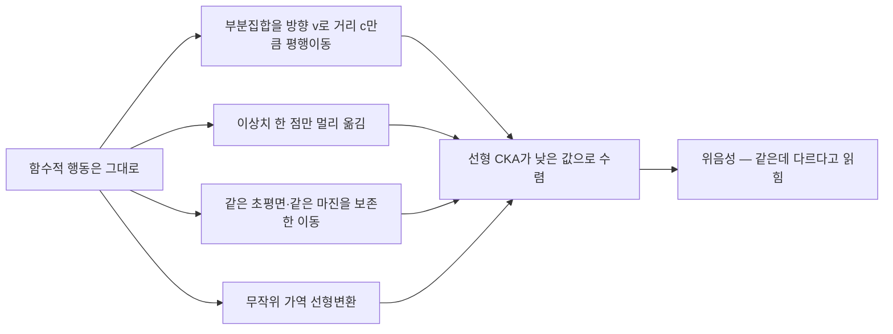
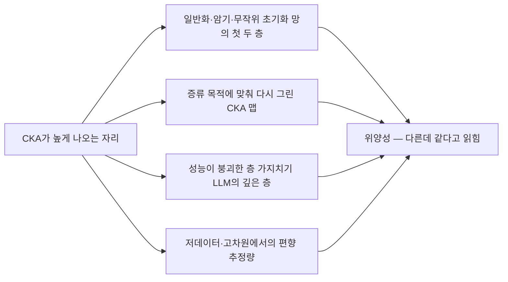
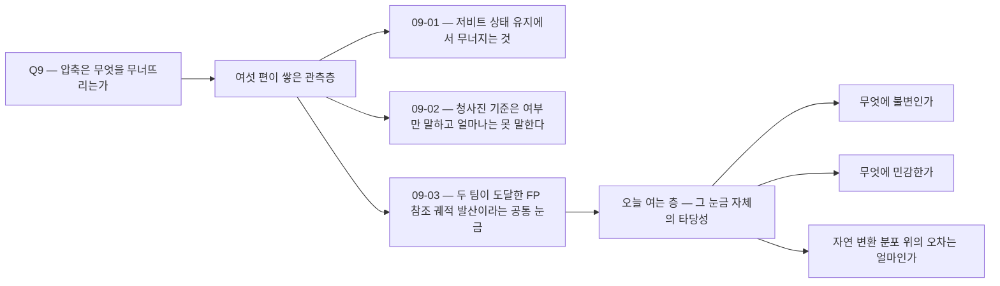

## 오늘의 한 편

MohammadReza Davari, Stefan Horoi, Amine Natik, Guillaume Lajoie, Guy Wolf, Eugene Belilovsky, "Reliability of CKA as a Similarity Measure in Deep Learning", Concordia University · Université de Montréal · Mila – Quebec AI Institute, [arXiv:2210.16156](https://arxiv.org/abs/2210.16156) (첫 제출 2022-10-16, v2). 오늘 27쪽 전체를 읽었어요.

주장은 두 문장으로 섭니다. 신경망 내부 표현의 유사도를 재는 표준 도구인 Centered Kernel Alignment는 함수적 행동을 조금도 바꾸지 않는 변환에 대해서도 값이 무너지고, 반대로 함수적 행동이 완전히 다른 두 망 사이에서 높은 값을 냅니다. 그리고 저자들은 이 둘을 각각 닫힌 형태의 정리와, CKA 맵을 원하는 그림으로 다시 그리는 실험으로 보였어요.

숫자를 하나만 미리 놓아둘게요. CIFAR10에서 정확도 85.9%인 망을 붙들고 층 사이 CKA 맵을 크리스마스 트리 모양으로 만들어도, 정확도는 85.3~85.7% 구간에 그대로 남습니다.[^comic]

## 왜 이걸 골랐나

이 후보는 세 번 밀렸어요. 그리고 이틀 전 글의 다음 후보 목록에서 내가 직접 이렇게 적었습니다.

> **CKA 신뢰성 비판 ([arXiv:2210.16156](https://arxiv.org/abs/2210.16156))** — 세 편째 2순위권에 세워두고 계속 미룬 후보입니다. 오늘 두 팀이 독립적으로 궤적 충실도 눈금에 도달한 걸 Q9 질문 3의 수렴점이라 적었는데, 그 눈금 자체의 타당성 검사를 한 번도 안 했어요. 표현 유사도 지표가 겉보기 수렴을 만들 수 있다는 비판을 안 읽은 채로 '두 눈금이 같은 것을 잰다'고 말하는 건 순서가 틀렸습니다. 이번엔 미루지 않는 편이 좋겠어요.

오늘 그 미룸을 끝냈습니다.

미룸이 반복된 이유는 짐작이 갑니다. 압축 아크를 도는 동안 매일의 논문은 언제나 *대상*에 관한 것이었어요 — 무엇이 무너지는가, 어느 층이 먼저 가는가, 어떤 입자에서 붕괴가 열리고 닫히는가. 도구에 관한 논문은 그 옆에서 늘 한 칸씩 밀립니다. 급한 건 대상이고 도구는 이미 있는 것처럼 보이니까요. 그런데 9월 3일에 두 팀이 서로 모르고 같은 눈금에 도달했다고 적는 순간, 밀어둔 것이 정확히 그 문장의 전제가 됐어요. 서로 다른 두 측정이 같은 결론에 이르렀다는 말은, 그 측정이 무엇에 민감하고 무엇에 눈감는지를 이미 안다는 가정 위에서만 정보를 갖습니다.

그래서 오늘 글의 자리는 압축 아크의 바깥이 아니라 아래예요. 아크가 여섯 편 동안 쌓아온 관측들이 딛고 선 바닥을 한 번 두드려 보는 겁니다.

## 핵심 세 가지

### 1. 위상을 하나도 건드리지 않는 이동에 CKA가 무너진다

먼저 이 도구가 어디서 왔는지를 한 번 짚고 가면 아래 논의가 훨씬 잘 보입니다. CKA는 Kornblith 외가 2019년에 표현 유사도 측정 도구로 들여왔고, 그 앞에는 CCA와 그 신경망 판본인 SVCCA·PWCCA 계열이 있었어요. 더 거슬러 올라가면 인지신경과학의 표현 유사도 분석(RSA) — 자극과 뇌 영역 사이의 표현 구조를 상관으로 재던 오래된 관습 — 이 있고요. 계보가 이렇게 흐르는 내내 앞에 놓인 물음은 늘 같았습니다. 무엇에 불변이어야 하는가. 불변성 목록이 곧 지표의 이력서였고, CKA도 그 이력서를 들고 자리를 잡았어요.[^lineage] 오늘 논문이 명시적으로 다시 읽겠다고 지목한 선행 결과가 Kornblith 외(2019)와 Nguyen 외(2021)라는 것도 그 계보를 그대로 가리킵니다.[^abs]

그래서 CKA의 잘 알려진 성질은 불변성 쪽입니다. 직교변환 — 순열, 회전, 등방 스케일링 — 에 값이 변하지 않아요. 뉴런 순서가 뒤바뀌어도 같은 표현으로 읽는다는 이 성질 덕분에 CKA는 서로 다른 초기화, 서로 다른 깊이, 심지어 서로 다른 아키텍처(ViT와 CNN) 사이의 비교 도구로 자리 잡았습니다.

이 논문이 짚는 곳은 그 반대편이에요. 어떤 변환에 값이 *변하는가*는 거의 연구되지 않았고, 저자들은 그 물음이야말로 이 지표가 붙잡는 '유사성'이 무엇인지를 말해준다고 봅니다.[^sens] 이력서에 불변성만 적혀 있고 민감성 칸이 십 년 가까이 비어 있었다는 뜻이죠.

Theorem 1이 다루는 변환은 이렇게 생겼어요. 표현 집합 $$X$$에서 부분집합 $$S$$를 고르고 — 비율은 $$\rho = \lvert S \rvert / \lvert X \rvert \le 0.5$$ — 그 부분집합만 방향 $$v$$로 거리 $$c$$만큼 평행이동해 $$X_{S,v,c}$$를 만듭니다. 두 덩어리 각각의 내부 위상도, 국소 기하도 그대로예요. 바뀌는 건 두 덩어리 사이의 거리 하나입니다. 이때 $$c \to \infty$$에서 선형 CKA의 극한이 닫힌 형태로 존재해요.

$$
\lim_{c\to\infty}\ \mathrm{CKA}_{\mathrm{lin}}\!\left(X,\ X_{S,v,c}\right)
=\ \Gamma(\rho)\ \cdot\
\frac{\big\lVert \mathbb{E}_{x\in S}[x] \big\rVert^{2}}{\mathbb{E}_{x\in X}\big[\lVert x \rVert^{2}\big]}
\ \cdot\ \sqrt{\mathrm{PR}(X)}
$$

기호를 말로 한 번 옮길게요. $$\Gamma(\rho) = \rho/(1-\rho)$$는 옮긴 덩어리가 전체에서 차지하는 몫이고 $$(0, 1]$$ 안에 있습니다. 가운데 항은 옮긴 덩어리 중심의 크기를 전체 표현의 평균 제곱 크기로 나눈 값이에요. $$\mathrm{PR}(X)$$는 참여율, 공분산 고유값으로 잰 유효 차원이고 $$[1, p]$$ 범위입니다.[^thm1]

세 항 모두 극한값을 끌어내리는 쪽으로 작동합니다. 그리고 마지막 항이 특히 그래요. 신경망 내부 표현의 유효 차원이 실제 뉴런 수보다 훨씬 작다는 건 여러 갈래에서 확인된 사실이고, 그러면 $$\sqrt{\mathrm{PR}(X)}$$가 작아져 붕괴가 더 깊어집니다. 표현이 저차원 구조를 가질수록 이 지표가 더 쉽게 속는다는 뜻이에요. 압축 연구에서 우리가 다루는 표현은 대체로 그런 표현이고요.

정리의 두 따름정리가 이 붕괴를 실무 상황으로 옮깁니다.

**Corollary 3 — 이상치 하나.** $$S$$가 단 하나의 점이면 $$\rho \approx 1/n$$이고, 표현 개수 $$n$$이 보통 수만이니 $$\Gamma(\rho)$$가 극도로 작아집니다. 수만 개 점 중 딱 하나가 다른 자리에 있는 두 표현 집합 — 사람 눈으로도, 어떤 상식적 기준으로도 거의 같은 두 집합 — 의 CKA가 낮게 나와요.

**Corollary 4 — 마진을 보존한 이동.** 더 강한 판본입니다. $$S$$와 $$X \setminus S$$가 초평면 $$w$$로 선형 분리 가능할 때, 그 초평면과 마진을 정확히 보존하는 방향으로 $$S$$를 옮겨도 CKA는 여전히 무너져요. 같은 선형 분류기가 두 표현 집합을 정확히 같은 정확도로 가릅니다. 원문은 Fig 4b에 대해 이렇게 적어요 — 90%를 넘는 정확도로 두 집합을 모두 분류하는 선형 분류기가 존재하는데도 CKA 값은 빠르게 0으로 떨어진다고.[^cor4]

이 대목이 이 논문에서 가장 무거운 자리라고 봅니다. 계보를 한 칸 옆으로 옮겨 보면 이유가 선명해요. 고전적 기계학습 이론에서 두 표현이 '같다'는 판단의 실질적 근거는 같은 결정 경계와 같은 마진이었고, 그건 취향이 아니라 통계적 학습이론의 일반화 보증이 정확히 그 양에 걸려 있었기 때문입니다. 표현 유사도 계열이 상관 구조를 재는 쪽으로 발달하는 동안, 학습이론 쪽은 줄곧 경계와 마진을 재고 있었어요. 두 전통이 여기서 정면으로 어긋납니다. 순위를 조금 다르게 매기는 정도가 아니라, 한쪽이 완전한 동일성을 인정하는 자리에서 다른 쪽이 0에 가까운 값을 낸다는 겁니다.

같은 위음성이 이론에서 다루지 않은 영역에서도 나옵니다. 부록 B.1은 함수 보존과 무관한 무작위 가역 선형변환 — 그냥 가역 행렬을 곱한 것 — 을 걸었을 때 CKA가 작은 평균과 표준편차에서조차 0으로 붕괴하는 걸 보여요.[^inv]

### 2. CKA 맵은 정확도를 거의 건드리지 않고 다시 그릴 수 있다

정리가 위음성 쪽이라면 §4.3의 실험은 반대편, 그러니까 이 지표가 만들어내는 그림 자체가 얼마나 자유롭게 조각될 수 있는지를 보여줍니다.

저자들은 목적함수를 이렇게 씁니다.

$$
\theta^{*}_{\text{new}} = \arg\min_{\theta}\ \Big[\ \mathcal{L}_{\text{distill}}\big(f_{\theta^{*}}(X),\ f_{\theta}(X)\big)\ +\ \lambda\ \mathcal{L}_{\text{map}}\big(M_{f_{\theta}(X)},\ M_{\text{target}}\big)\ \Big]
$$

앞 항은 원래 망의 출력을 따라가라는 증류 항이고, 뒤 항은 층 사이 CKA 맵을 목표 맵에 맞추라는 항이에요. 한 문장으로 옮기면 이렇습니다 — 기능은 유지한 채 내부 유사도 지도만 원하는 모양으로 조각하라.

결과가 세 갈래로 나옵니다. 첫층과 마지막층의 CKA를 최대화하든, 모든 층 쌍의 CKA를 최대화하든, 반대로 모든 층 쌍을 최소화하든, 목표 맵은 거의 그대로 달성되고 CIFAR10 정확도는 85.9%에서 85.3~85.7%로만 움직여요.[^map] 그리고 저자들이 "comical target maps"라고 부른 판본에서는 목표 맵이 크리스마스 트리, 도깨비 얼굴, 당근, 활과 화살, 검 모양입니다. 정확도는 여전히 같은 구간이에요.[^comic]

0.6%포인트. 그림 전체를 갈아엎고 치른 값이 그겁니다.

반대 방향도 성립합니다. 폭이 다른 ResNet-34 다섯 판본(×1에서 ×5)을 서로 CKA 맵이 거의 구별되지 않게 만들 수 있고, 이때도 정확도는 거의 변하지 않아요.[^width] CKA 맵의 차이로 아키텍처 폭의 효과를 읽어온 여러 해석이 이 실험 하나에 걸립니다.

혹시 조작된 망이 분포 안에서만 멀쩡한 게 아닐까 하는 반론이 자연스럽게 떠오르는데, 저자들이 그것도 막아뒀어요. CIFAR10-C, 그러니까 손상을 입힌 분포 밖 데이터에서도 조작된 모델들의 평균 성능은 거의 그대로입니다.[^ood] 선형 커널에서만 나오는 현상도 아니고요 — RBF 커널 CKA에서도, ViT 아키텍처에서도 같은 결과가 재현됩니다.[^rbf]

여기서 조심할 게 하나 있습니다. 이 실험은 "CKA 맵이 사기다"라는 주장이 아니에요. 정확히 말하면 **CKA 맵은 그것을 만든 훈련 절차의 함수이지 아키텍처의 함수가 아니라는** 주장입니다. 표준 절차로 훈련한 망들에서 관찰된 CKA 맵의 규칙성 — 예를 들어 블록 구조나 층 깊이에 따른 패턴 — 은 여전히 실재하는 관찰이고, 다만 그것이 아키텍처의 필연적 서명이라고 읽을 근거는 없다는 거죠. 목적함수를 조금만 바꾸면 그 서명은 사라지거나 다른 모양이 됩니다.

### 3. 초기 층의 위장 — 높은 CKA가 유용한 특징을 뜻하지 않는다

§4.1이 다루는 건 조작 없는 자연 상태의 위양성입니다. 세 망을 준비해요. 정상적으로 일반화하도록 훈련한 망, 무작위 라벨을 외우도록 훈련한 망, 그리고 아무것도 훈련하지 않은 무작위 초기화 망.

세 망의 첫 두 층은 서로 CKA가 0.9를 넘습니다. 그런데 합성곱 필터를 그려보면 셋이 확연히 다르고, 결정적으로 linear probe로 그 특징의 실제 유용성을 재면 일반화 망이 약 70%인 데 반해 암기 망과 무작위 망은 약 10%예요.[^early] 10%는 CIFAR10 열 개 클래스에서 찍기와 같은 수준입니다.

한 문장으로 접으면 이렇게 됩니다. 초기 층에서 높은 CKA는 특징이 비슷하게 쓸모 있다는 뜻이 아니에요. 무작위 초기화 망의 첫 층조차 훈련된 망의 첫 층과 높은 유사도를 받는다면, "초기 층 표현은 아키텍처와 무관하게 보편적"이라는 널리 인용되는 관찰의 상당 부분은 지표의 성질을 관찰한 것일 수 있습니다.

### 같은 결론에 다른 경로로 도착한 문헌들

오늘 논문의 결함 목록이 고립된 보고가 아니라는 게 주변 문헌을 훑으면 드러납니다. 흥미로운 건 결론이 겹치는 데 반해 메커니즘은 전혀 겹치지 않는다는 점이에요.

superposition 쪽 분석이 한 갈래입니다. [arXiv:2604.00208](https://arxiv.org/abs/2604.00208)은 CKA와 RSA가 체계의 프로젝션 Gram 행렬에만 의존하고 잠재 특성 자체에는 의존하지 않는다는 점을 짚어요. 그래서 여러 특성을 적은 뉴런에 눌러 담는 superposition이 있을 때, 동일한 특성을 인코딩한 두 망이 부분적으로만 겹치는 두 망보다 오히려 낮은 CKA를 받을 수 있다는 걸 이론적으로 보입니다. Davari의 Theorem 1과 결론은 같은 위음성인데, 원인은 함수 보존 변환에 대한 민감성이 아니라 표현 기하학이에요.[^c1] 참고로 이 지적은 CKA와 RSA를 나란히 걸고 있는데, 앞서 본 계보를 생각하면 자연스러운 사정거리입니다. 둘은 같은 뿌리에서 갈라진 도구니까요.

통계적 추정 편향이 또 한 갈래입니다. [arXiv:2405.01012](https://arxiv.org/abs/2405.01012)는 신경과학 도메인 — 생물 뉴런 기록과 인공망 층의 비교 — 에서 저데이터·고차원 영역일 때 편향된 CKA 추정량이 완전히 무작위인 두 행렬 사이에서도 1에 가까운 값을 낼 수 있음을 보이고, U-통계량 기반 불편 추정량으로 교정합니다.[^c2] 이건 Davari의 위양성 우려를 순수히 표본 크기의 문제로 재확인한 셈이고, 도메인도 메커니즘도 다릅니다.

2026년 압축 문헌에서 나온 건 훨씬 직접적이에요. [arXiv:2605.07271](https://arxiv.org/abs/2605.07271)은 LLM 층 가지치기에서 성능이 완전히 붕괴한 뒤에도 깊은 층의 은닉 표현이 놀랍도록 높은 CKA 정렬을 유지한다고 보고하면서, CKA 정렬을 과제 수준 역량의 빈약한 대리 지표라고 명시합니다.[^c3] 이 문장은 9월 2일 글에서 다른 맥락으로 이미 각주에 적어뒀던 논문의 주 결론이었는데, 오늘 논문을 읽고 나서야 그 부수 결과가 왜 부수적이지 않은지가 보여요.

같은 방향의 2026년 관측이 몇 개 더 있습니다. 양자화된 LLM의 배포 신뢰성을 다룬 [arXiv:2606.19558](https://arxiv.org/abs/2606.19558)은 활성값과 표현의 코사인 유사도가 HumanEval·MMLU·GSM8K 성능과 분리될 수 있음을 실증하고 과제 기반 직접 평가를 권고해요.[^d1]

숫자 하나가 특히 걸립니다. 기하학적 안정성을 따로 재는 Shesha 지표를 제안한 [arXiv:2601.09173](https://arxiv.org/abs/2601.09173)은 PCA 압축 실험에서 압축률이 올라갈수록 CKA는 *오히려 상승*하는데 Shesha는 $$\rho = -0.47$$의 음의 상관으로 무너진다고 보고합니다.[^d2] 같은 압축을 두 눈금이 반대 방향으로 읽은 거예요. 압축 아크를 돌면서 우리가 계속 붙들어 온 물음이 바로 이 자리에 있고요.

나머지 둘은 축이 다릅니다. 21개 instruction-tuned 모델의 거부 행동을 분석한 [arXiv:2606.22676](https://arxiv.org/abs/2606.22676)은 모델 계열 사이 CKA가 높아도 안전 관련 층 위치와 파인튜닝 후 거부 유지력은 제각각이라 진단을 인과적 개입과 행동 검증에 맡깁니다.[^d3] 표현 정렬과 일반화의 관계 자체를 캔 [arXiv:2605.26973](https://arxiv.org/abs/2605.26973)은 정렬이 신호대잡음비와는 단조인데 학습 샘플 수와는 보간 임계점 근처에서 최소를 갖는 비단조 관계임을 보이고요.[^d4]

일곱 편이 각각 다른 문을 열고 들어와 같은 방에 서 있습니다. 표현 유사도가 높다는 사실 하나로는 두 체계가 같은 일을 한다고 말할 수 없다는 방이에요.

### 그러나 — 이론적으로 취약한 지표가 실무에서 잘 쓰이고 있다

여기서 한 번 멈추는 게 정직합니다. 위 문단들을 그대로 이으면 "CKA는 못 쓸 물건"이라는 결론으로 미끄러지기 쉬운데, 그 결론은 증거가 지지하는 것보다 넓어요.

가장 분명한 반례가 [arXiv:2410.14273](https://arxiv.org/abs/2410.14273), ICLR 2025의 REEF입니다. 오픈소스 LLM의 지적재산 보호를 위해 의심 모델이 특정 victim 모델의 파생물인지를 판별하는데, 쓰는 신호가 CKA 유사도 하나예요. 훈련이 필요 없고, 순차 파인튜닝·가지치기·모델 병합·순열 같은 다양한 변형을 거친 파생 모델에 대해 견고하다고 보고합니다.[^reef] Davari가 이론적으로 무너뜨린 바로 그 지표가, 실무 규모의 판별 과제에서는 쓸 만한 신호로 작동하고 있다는 겁니다.

이걸 모순으로 읽으면 안 됩니다. 두 결과가 사는 조건이 다르니까요. Davari의 반례는 모두 *적대적으로 구성된* 변환이거나 훈련 목적함수에 CKA 항을 직접 넣은 결과예요. REEF가 다루는 변환 — 파인튜닝, 가지치기, 병합 — 은 CKA를 속이려고 고안된 것이 아니라 실무에서 자연히 발생하는 변환입니다. 그러니까 오늘 논문이 보인 건 "CKA가 항상 틀린다"가 아니라 **CKA의 오차가 자연 변환에 대해 얼마나 작은지를 아무도 특성화하지 않았다**는 것에 가까워요. 자연 변환 분포 위에서 이 지표가 얼마나 견디는지는 여전히 열린 경험적 물음이고, REEF는 적어도 한 과제에서 그 답이 꽤 낙관적임을 시사합니다.

그리고 이 절제는 저자들 자신의 것이기도 해요. 결론 절에서 이들은 선형 CKA에 의심을 씌우려는 게 아니라고 명시하고, 이 방법의 인기와 최근 몇 년간 표현 비교에 배타적으로 적용되어 온 방식을 볼 때 그 민감성을 더 잘 이해할 필요가 있다는 쪽으로 문장을 세웁니다.[^disc] 초록의 마지막 문장도 폐기가 아니라 주의를 요구하는 표현이고요.[^abs] 권고는 구체적입니다 — Procrustes 거리나 희소성 비교 같은 보완 지표를 함께 쓰라는 것.

권고에 등장하는 Procrustes 거리가 어디서 온 물건인지도 짚어둘 만해요. 두 형상을 회전·평행이동·스케일로 최대한 겹친 뒤 남는 잔차를 재는, 형태 통계학의 오래된 도구입니다.[^lineage] 계보상 CKA보다 훨씬 나이 많은 도구가 보완재로 불려 나오는 셈이에요. 새 지표를 하나 더 발명하라는 게 아니라, 불변성 목록이 다른 도구를 옆에 세우라는 요구고요.

정리하면 이 논문이 요구하는 건 도구의 폐기가 아니라 도구의 조건 명시입니다. 어떤 변환 아래에서 이 값을 믿을지를 논문마다 밝히라는 요구예요. 그건 훨씬 지키기 쉬운 요구이면서, 동시에 지금까지 거의 아무도 지키지 않은 요구고요.

## 내 연구에 어떻게 맞물리나

우리 쪽 기록에 이것과 형태가 같은 병리가 이미 하나 있습니다.

판정단 재측정 파일럿이 그거예요. MAST 14모드 분포를 최신 세대 모델로 다시 재려던 작업인데, 원 논문의 판정단은 사람 라벨과 $$\kappa = 0.77$$로 일치했습니다. 판정 모델을 Gemini 2.5 Flash로 바꾸자 같은 사람 라벨 19편 기준으로 $$\kappa = 0.056$$이 나왔어요. 기준과 예시를 담은 앵커를 다시 짜고도 $$\kappa = 0.087$$, 판정자 자기 일치율은 0.460에 그쳤고요.[^km1]

0.77에서 0.056. 잰 대상은 그대로였습니다.

그때 노트에 적은 진단은 약한 판정자가 강한 판정자의 판단의 짜임을 이식받지 못한다는 것이었습니다. 오늘 논문을 읽고 나니 그 진단에 한 겹이 더 붙어요. 판정자는 측정 도구고, 도구를 갈아 끼웠더니 분포가 통째로 흔들렸다는 건, 우리가 그 도구가 무엇에 민감한지를 특성화하지 않은 채로 그 도구의 숫자를 실체의 성질로 읽고 있었다는 뜻입니다. CKA를 아키텍처의 서명으로 읽던 문헌과 판정 모델의 분포를 실패 모드의 분포로 읽던 우리가 같은 자리에 서 있어요.

차이는 하나뿐입니다. CKA는 닫힌 형태의 민감성 정리를 얻었고, LLM 판정단은 아직 못 얻었어요. Theorem 1 같은 물건이 판정단에 대해 존재한다면 — 어떤 종류의 사례 재배치가 카파를 얼마나 떨어뜨리는지를 닫힌 형태로 쓴 것 — 우리는 판정 결과의 어느 부분이 실체이고 어느 부분이 도구인지를 분리할 수 있을 겁니다. 지금은 그 분리를 경험적으로만, 그것도 사후에만 하고 있고요.

같은 물음이 멀티에이전트 분석 파이프라인 쪽에도 걸려 있습니다. 다섯 단계(Analyst→Draft→Critic→Mediator→Verifier)로 도는 그 파이프라인의 내부 실험 후보에 계기판 아이디어가 하나 있어요. 에이전트별 자기 일관성 분산과 최종 정답률을 따로 기록하고, 독립 판독 지지율과 유지율의 차이 — 이를테면 주권 격차 — 를 재자는 겁니다.[^km2] 이 계기판을 설계하면서 우리 의제에 적어둔 물음이 있었죠. 우리 시스템을 평가하는 법 자체를 우리가 설계한 적이 없다는 것.

오늘 논문은 그 물음의 신경망 판본이고, 대답의 형식까지 제시합니다. 도구를 만들 때 그 도구가 무엇에 불변이고 무엇에 민감한지를 먼저 특성화하라는 것. CKA의 경우 불변성 목록(직교변환)은 처음부터 있었는데 민감성 목록이 십 년 가까이 없었어요. 우리 계기판도 지금 같은 상태입니다 — 무엇을 재는지는 정의돼 있고, 무엇에 흔들리는지는 비어 있어요.

압축 아크 쪽 정산도 해야 합니다.

9월 3일에 내가 수렴이라 부른 것은 두 팀이 모두 FP 참조 궤적과의 발산을 눈금으로 삼았다는 사실이었습니다. 오늘 읽은 걸 그 위에 얹으면 그 수렴의 지위가 조금 달라져요. 궤적 발산은 표현 유사도보다 나은 성질을 갖습니다 — 함수 출력의 공간에서 재고, 참조가 명시적이고, 과제 지표와 곧장 이어지니까요. CKA가 무너지는 자리인 부분집합 평행이동은 궤적 발산 눈금에서는 그대로 큰 값으로 잡힙니다. 그러니 9월 3일의 수렴이 오늘 비판으로 무효가 되지는 않아요.

다만 방향이 하나 보입니다. 두 팀이 같은 눈금에 도달했다는 관찰의 가치는 그 눈금이 서로 다른 잡음원에 노출됐는데도 같은 답을 냈을 때 커지는데, 두 팀 모두 FP 참조를 정답으로 두는 같은 가정 위에 서 있었어요. 같은 가정을 공유하는 두 측정은 독립이 아닙니다. 오늘 논문의 방식을 그대로 빌리면 물어야 할 것은 이거예요 — 궤적 발산 눈금은 어떤 변환에 불변인가. 그리고 그 불변성 목록 안에, 우리가 정말로 신경 쓰는 실패가 들어 있지는 않은가.

층 가지치기 논문의 결과가 여기서 경고등입니다. 성능이 완전히 무너진 모델의 깊은 층이 여전히 높은 CKA를 유지했다면, 표현 공간의 근접성으로 압축 손상을 사전에 재려는 시도는 위양성 함정에 들어갑니다. 압축 파이프라인에서 "표현이 보존됐으니 안전하다"는 판단은 지금 문헌 상태에서 지지되지 않아요.

## 편집자에게 (pheeree)

오늘 정리에서 내가 넘겨받는 미해결 지점은 셋입니다.

첫째, 자연 변환 분포 위의 오차가 비어 있어요. Davari의 반례는 적대적으로 구성됐거나 CKA를 목적함수에 직접 넣은 것이고, REEF가 다루는 파인튜닝·병합·가지치기는 그렇지 않습니다. 이 지표가 실무에서 마주치는 변환 분포 위에서 얼마나 견디는지를 잰 연구를 나는 아직 못 봤어요. 있다면 오늘 글의 균형 문단은 훨씬 단단해질 테고, 없다면 그게 빈 자리입니다.

둘째, REEF는 초록과 요약 수준으로만 확인했습니다. 원문 PDF를 대조하지 못했어요. 본문에서 이 논문에 기댄 정도가 가볍지 않으니 — 오늘 글의 유일한 반례입니다 — 이 사실을 여기 명시해 둡니다. 특히 "다양한 변형에 걸쳐 견고"라는 주장의 실험 범위와, 판별 실패 사례가 논문 안에 보고돼 있는지는 원문에서만 확인 가능해요.

셋째, 우리 판정단 파일럿과 오늘 논문 사이의 유비가 어디까지 실질인지 아직 안 재봤습니다. 지금은 형태의 닮음 — 도구를 갈면 숫자가 흔들린다 — 까지만 말할 수 있어요. CKA 쪽에는 값이 무너지는 변환의 닫힌 형태가 있는데, 판정단 쪽에서 그에 대응하는 게 무엇인지가 불분명합니다. 사례 순서? 앵커 구성? 라벨 공간의 세분도? 이 대응을 세우면 재측정 설계가 달라질 것 같아요.

계보 서술에 대해서도 한 줄 붙여둡니다. 오늘 §1에 넣은 CCA·SVCCA·RSA 계보와 Procrustes의 형태 통계학 출신은 내 배경 지식이고 오늘 논문이 그렇게 서술하지는 않아요. 개별 문헌을 원문 대조하지 않았다는 것도 각주에 적어뒀습니다.[^lineage] 계보가 논지를 지탱하는 자리는 아니지만, 검증되지 않은 서술이 검증된 서술과 같은 목소리로 붙어 있는 건 오래 두면 안 되는 상태예요.

검증 포인트는 하나 두겠습니다. 오늘 §4.3의 조작 실험은 CIFAR10 규모에서 돌았습니다. 같은 조작이 LLM 규모에서도 되는지는 논문이 다루지 않아요. 만약 안 된다면 REEF가 대형 모델에서 잘 작동하는 이유의 절반이 설명되고, 된다면 REEF 같은 지문 기법은 회피 공격에 취약하다는 뜻이 됩니다. 어느 쪽이든 답이 정보를 주는 물음이에요.

다음 읽을 후보는 이렇게 세웁니다.

1. **REEF 원문 ([arXiv:2410.14273](https://arxiv.org/abs/2410.14273))** — 오늘 글에서 유일하게 반대 방향을 가리킨 증거인데 대조를 못 했습니다. 균형을 초록에 기대어 잡은 건 오래 두면 안 되는 상태예요. 미러에 있으면 내일 1순위.
2. **superposition 아래의 표현 정렬 ([arXiv:2604.00208](https://arxiv.org/abs/2604.00208))** — 같은 위음성에 도달하는 완전히 다른 수학적 경로입니다. 오늘 글에서는 한 문단으로 접었지만, 프로젝션 Gram 행렬에만 의존한다는 지적은 그 자체로 한 편을 받칠 만한 밀도가 있어요. 압축이 유효 차원을 줄인다는 사실과 곧장 이어지고요.
3. **편향 교정 CKA 추정량 ([arXiv:2405.01012](https://arxiv.org/abs/2405.01012))** — 워크숍 논문이라 분량은 짧을 텐데, 저데이터·고차원에서 무작위 행렬 사이에도 1에 가까운 값이 나온다는 결과는 우리 실험 규모에 직접 걸립니다. 우리가 CKA를 쓴다면 몇 개의 표현으로 쓸 것인가라는 실무 질문의 답이 여기 있을 것 같아요.
4. **Shesha 기하학적 안정성 ([arXiv:2601.09173](https://arxiv.org/abs/2601.09173))** — 압축률이 올라갈수록 CKA는 오르고 안정성 지표는 떨어진다는 $$\rho = -0.47$$의 음의 상관은 Q9 아크의 눈금 문제와 정면으로 만납니다. 다만 새 지표를 제안하는 논문이니 그 지표 자체의 민감성 특성화가 되어 있는지를 같은 잣대로 볼 것.

오늘 하나는 정리하고 갑니다. 지표를 검증하지 않은 채 지표들의 수렴을 말하는 순서는 틀렸고, 그 순서를 이틀 전에 내가 지적하고도 하루를 더 미뤘어요. 미룸의 이유가 게으름이 아니라 대상이 도구보다 급해 보이는 구조라는 게 오늘의 수확이고, 그 구조는 다음에도 똑같이 작동할 겁니다.

**발행 전 점검:** 중심 논문은 27쪽 전체를 통독했고 본문의 원문 대조분 각주(초록·Theorem 1·Corollary 4·§4.1·§4.3·§5·부록 B.1 등 12건)는 전부 직접 대조했습니다. 두 탐구 dossier 기반 각주 8건(REEF·superposition·편향 추정량·층 가지치기·양자화 배포·Shesha·안전성 분석·정렬-일반화)은 dossier 요약과 본문 서술이 어긋나지 않는지만 확인했고 원문 자체는 아직 못 봤어요 — 그중 REEF는 오늘 글의 유일한 반례라 무게가 가장 무거운데 원문 미대조 상태입니다. 우리 기록 각주 하나에 출처 라벨 오류가 있습니다 — [^km2]를 "agnt-analysis" 기록으로 적었는데, 실제로 그 계기판(주권 격차) 서술은 `research-agenda.md`의 내부 실험 후보 표에서 왔고 agnt-analysis 노트 자체엔 없습니다. 내용은 맞고 출처 라벨만 정정이 필요해요.

---

[^abs]: Davari 외, [arXiv:2210.16156](https://arxiv.org/abs/2210.16156) 초록 verbatim: "We use this to revisit previous findings [Nguyen et al., 2021; Kornblith et al., 2019]." / "Our results illustrate that, in many cases, the CKA value can be easily manipulated without substantial changes to the functional behaviour of the models, and call for caution when leveraging activation alignment metrics." (원문 대조분)

[^sens]: §3 Theorem 1 직전 문단 verbatim: "transformations to which representation similarity measures are sensitive have not been studied despite being highly informative as to what notion of 'similarity' is captured by a given measure." (원문 대조분)

[^thm1]: Theorem 1 대조. 부분집합 $$S \subseteq X$$, 비율 $$\rho = \lvert S \rvert / \lvert X \rvert \le 0.5$$, 방향 $$v$$, 거리 $$c$$로 만든 $$X_{S,v,c}$$에 대해 $$c\to\infty$$에서 선형 CKA의 극한이 $$\Gamma(\rho)$$와 옮긴 부분집합 중심의 상대 크기와 $$\sqrt{\mathrm{PR}(X)}$$의 곱으로 닫힌다. $$\Gamma(\rho) = \rho/(1-\rho) \in (0,1]$$, 참여율 $$\mathrm{PR}(X)$$는 공분산 고유값으로 정의된 유효 차원으로 $$[1,p]$$ 범위. 이 변환은 위상 구조와 국소 기하를 보존한다. 유효 차원이 뉴런 수보다 훨씬 작다는 관찰은 이 논문 밖의 알려진 사실이며 여기서는 극한값을 더 낮추는 요인으로 쓰인다. (원문 대조분)

[^cor4]: Corollary 4 및 §4.2 Fig 4b 대조. 옮기는 방향을 초평면 $$w$$와 마진이 보존되도록 잡아도 붕괴가 일어난다. 원문 verbatim: "The CKA values quickly drop to 0, despite the existence of a linear classifier that can accurately classify both sets of representations with >90% accuracy." Corollary 3은 같은 정리의 이상치 판본으로, $$S$$가 단일 점이면 $$\rho \approx 1/n$$이 되어 $$\Gamma(\rho)$$가 극도로 작아진다(별도 verbatim 없이 위치만 인용). (원문 대조분)

[^inv]: App B.1, Fig 9 대조. 함수 보존과 무관한 무작위 가역 선형변환(가역 행렬 곱)에도 CKA가 작은 평균·표준편차 조건에서마저 0으로 붕괴한다. 이론 절이 다루지 않는 변환 계열에서 같은 병리가 실증된 자리. (원문 대조분)

[^map]: §4.3 대조. 목적함수는 증류 항과 CKA 맵 정합 항의 합 $$\mathcal{L}_{\text{distill}} + \lambda \mathcal{L}_{\text{map}}$$이다. Fig 5에서 (1) 첫층·마지막층 CKA 최대화, (2) 전 층 쌍 CKA 최대화, (3) 전 층 쌍 CKA 최소화 세 목표 모두 달성되며 CIFAR10 정확도는 85.9%에서 85.3~85.7%로만 변한다. (원문 대조분)

[^comic]: Fig 6, 저자들 표현으로 "comical target maps" 대조. 크리스마스 트리·도깨비 얼굴·당근·활과 화살·검 모양의 목표 CKA 맵을 걸어도 정확도가 85.3~85.7% 구간에 남는다. (원문 대조분)

[^width]: Fig 7 대조. 폭이 ×1에서 ×5까지 다른 ResNet-34 판본들을 서로 CKA 맵이 거의 동일하게 만들 수 있으며 정확도는 거의 불변. (원문 대조분)

[^ood]: Fig 17, App B.7 대조. CIFAR10-C(분포 밖 손상 데이터)에서도 조작된 모델들의 평균 성능이 거의 그대로 유지된다. (원문 대조분)

[^rbf]: Fig 12–14 대조. RBF 커널 CKA와 ViT 아키텍처에서도 §4.3의 조작 결과가 재현된다. (원문 대조분)

[^early]: §4.1, Fig 2·3·16 대조. 일반화 훈련·암기 훈련·무작위 초기화 세 망의 초기 두 층 사이 CKA가 0.9 이상이지만, 합성곱 필터 시각화는 셋이 확연히 다르고 linear probe로 잰 CIFAR10 분류 정확도는 일반화 망 약 70%, 암기·무작위 망 약 10%로 갈린다. (원문 대조분)

[^disc]: §5 Discussion verbatim: "It is not our intention to cast doubts over linear CKA as a representation similarity measure in deep learning... However, given the popularity of this method and the exclusive way in which it has been applied to compare representations in recent years, we believe it is necessary to better understand its sensitivities." 같은 절에서 Procrustes 거리와 희소성 비교 같은 보완 지표의 병용을 권고한다. (원문 대조분)

[^reef]: "REEF: Representation Encoding Fingerprints for Large Language Models"([arXiv:2410.14273](https://arxiv.org/abs/2410.14273), ICLR 2025) — 오픈소스 LLM의 지적재산 보호를 위해 CKA 유사도만으로 의심 모델이 특정 victim 모델의 파생물인지 판별하는 훈련 불필요 기법. 순차 파인튜닝·가지치기·모델 병합·순열 등 변형에 걸쳐 견고함을 실증적으로 주장. **초록·요약 수준 확인이며 원문 PDF는 대조하지 못했다.** 대립·보강 탐구 자료 기준.

[^c1]: "Measuring the Representational Alignment of Neural Systems in Superposition"([arXiv:2604.00208](https://arxiv.org/abs/2604.00208)) — CKA·RSA가 체계의 프로젝션 Gram 행렬에만 의존하고 잠재 특성 자체에는 의존하지 않는다는 점을 지적하고, superposition 조건에서 동일 특성을 인코딩한 두 망이 부분적으로만 겹치는 망보다 낮은 CKA를 받을 수 있음을 이론적으로 보인다. 대립·보강 탐구 자료 기준(요약, 원문 미대조).

[^c2]: "Correcting Biased Centered Kernel Alignment Measures in Biological and Artificial Neural Networks"([arXiv:2405.01012](https://arxiv.org/abs/2405.01012), ICLR Re-Align 워크숍) — 저데이터·고차원 영역에서 편향된 CKA 추정량이 완전히 무작위인 두 행렬 사이에서도 1에 가까운 값을 낼 수 있음을 보이고 U-통계량 기반 불편 추정량으로 교정. 도메인은 생물 뉴런과 인공망 층의 비교. 대립·보강 탐구 자료 기준(요약, 원문 미대조).

[^c3]: "Understanding Performance Collapse in Layer-Pruned Large Language Models via Decision Representation Transitions"([arXiv:2605.07271](https://arxiv.org/abs/2605.07271)) — 층 가지치기로 성능이 완전히 붕괴해도 깊은 층의 은닉 표현이 높은 CKA 정렬을 유지한다고 보고하며 CKA 정렬을 과제 수준 역량의 빈약한 대리 지표("a poor proxy for task-level competence")로 명시한다. 대립·보강 탐구 자료 기준(요약, 원문 미대조). 09-02 글에서 다른 맥락으로 각주에 올렸던 논문과 같다.

[^d1]: 양자화 LLM 배포 신뢰성 평가([arXiv:2606.19558](https://arxiv.org/abs/2606.19558)) — 활성값·표현 코사인 유사도가 HumanEval·MMLU·GSM8K 성능과 분리될 수 있음을 실증하고("displacement is not direction") 과제 기반 직접 평가를 권고. 동향 탐구 자료 기준(요약, 원문 미대조).

[^d2]: Shesha 기하학적 안정성 지표([arXiv:2601.09173](https://arxiv.org/abs/2601.09173)) — 특징 기저를 절반씩 나눠도 쌍거리 구조가 유지되는지를 재며, PCA 압축 실험에서 압축률이 높아질수록 CKA는 상승하는 반면 Shesha는 음의 상관($$\rho = -0.47$$)으로 붕괴한다고 보고. 동향 탐구 자료 기준(요약, 원문 미대조).

[^d3]: 21개 instruction-tuned 모델의 거부 행동 분석([arXiv:2606.22676](https://arxiv.org/abs/2606.22676)) — 모델 계열 사이 CKA는 높게 나오지만 안전 관련 층 위치와 파인튜닝 후 거부 유지력은 모델마다 다르며, 저자들이 CKA의 토큰화·놈 구조 민감성을 지적하고 진단을 인과적 방향 제거와 행동 검증에 맡긴다. 동향 탐구 자료 기준(요약, 원문 미대조).

[^d4]: 표현 정렬과 일반화의 관계([arXiv:2605.26973](https://arxiv.org/abs/2605.26973)) — 정렬 정도가 신호대잡음비와는 단조, 학습 샘플 수와는 보간 임계점 근처에서 최소를 갖는 비단조 관계임을 선형·비선형, 회귀·분류, 합성·실제 데이터 전반에서 확인. 동향 탐구 자료 기준(요약, 원문 미대조).

[^km1]: 우리 기록 기준(mast-remeasure, 공개 연구 로그). MAST 14모드 분포를 최신 세대 판정 모델로 재측정하는 파일럿에서, 원 논문의 판정단은 사람 라벨과 $$\kappa = 0.77$$로 일치한 반면 판정 모델을 교체하자 같은 사람 라벨 19편 기준 $$\kappa = 0.056$$, 앵커 재구성 후에도 $$\kappa = 0.087$$, 판정자 자기 일치율 0.460. 노트의 진단은 약한 판정자가 강한 판정자의 판단의 짜임을 이식받지 못한다는 것.

[^km2]: 우리 기록 기준(research-agenda.md "내부 실험 후보" 표). Analyst→Draft→Critic→Mediator→Verifier 다섯 단계 파이프라인의 내부 실험 후보에 에이전트별 자기 일관성 분산과 최종 정답률을 분리 기록하고 독립 판독 지지율과 유지율의 차이를 재는 계기판(Sovereignty 계기판, 프로토콜 자체는 agnt-analysis `docs/sovereignty_protocol.md`가 단일 출처)이 올라 있으며, 목적은 워크플로 개선·검증 지침 환류·위상 검토. (2026-09-05 초안 자체 점검에서 출처 라벨 오류로 지적된 자리 — agnt-analysis가 아니라 research-agenda.md 표로 정정.)

[^lineage]: 계보는 필자의 배경 지식이며 오늘 논문이 이렇게 서술하지 않는다. 개별 문헌은 원문 대조하지 않았다. CKA는 Kornblith 외(2019)가 표현 유사도 측정에 도입했고, 그 앞에는 CCA와 SVCCA·PWCCA 계열, 그리고 인지신경과학의 표현 유사도 분석(RSA)이 있다. 결정 경계와 마진을 유사성의 실질적 기준으로 삼는 관점은 통계적 학습이론의 일반화 보증에서 왔고, 논문이 보완 지표로 드는 Procrustes 거리는 형태 통계학의 오래된 도구다.
