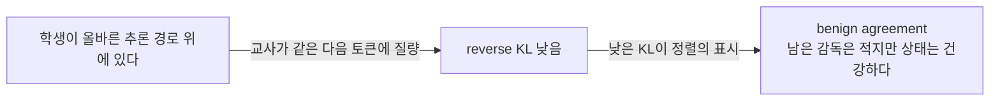
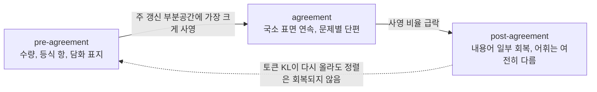
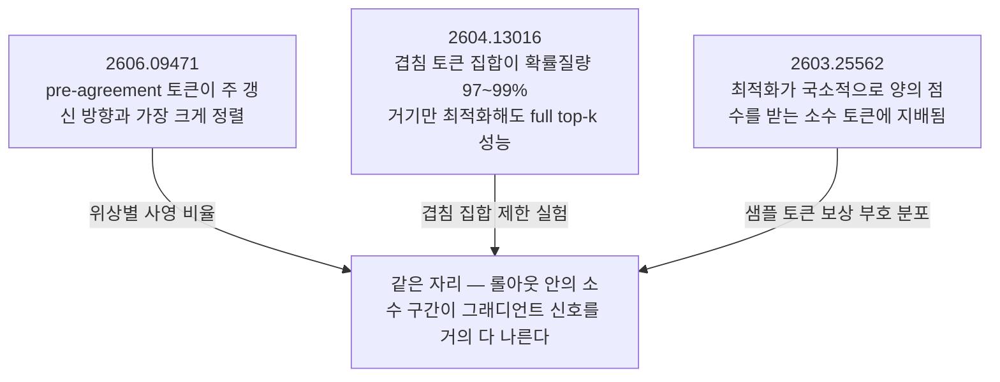

## 오늘의 한 편

**Escaping the KL Agreement Trap in On-Policy Distillation** ([arXiv:2606.09471](https://arxiv.org/abs/2606.09471), v1 2026-06-08, cs.LG). Haoran Xin, Anhao Zhao, Ying Sun, Jin Li, Xiaoyu Shen, Hui Xiong 여섯 명이고, 소속은 HKUST 광저우 캠퍼스의 인공지능 학부와 HKUST 전산과, 홍콩폴리텍, 닝보 이스턴공대로 흩어져 있습니다. 오늘 13쪽 전체를 통독했어요.

물음은 하나로 좁혀집니다. 온폴리시 증류가 자랑하는 조밀한 토큰 수준 감독은 언제 감독이기를 그치는가. 저자들의 답은 학생이 되돌릴 수 없는 프리픽스로 표류했을 때입니다. 그 상태에서도 교사는 다음 토큰을 채점해주는데, 망가진 문맥을 조건으로 받았으니 교사 자신도 그 망가짐을 국소적으로 따라가요. reverse KL은 낮게 나오고 교정 신호는 거의 없습니다. 초록의 표현을 그대로 옮기면 저자들은 이 지속 구간을 low-KL agreement trap이라 이름 붙였고, 그것이 이 논문의 전부입니다[^abs].

기여는 셋으로 정리돼 있습니다. 함정의 존재를 식별했다는 것, 함정에 들어간 뒤의 감독이 계속 저품질이라는 것 — 심지어 KL이 회복된 뒤의 접미부에서도 그렇다는 것, 그리고 그 무의미한 접미부를 잘라내되 OPD 목적함수 자체는 건드리지 않는 온라인 종료 규칙 KAT를 제안한다는 것[^contrib].

목적함수부터 한 번 적어둘게요. 학생 $$\pi_\theta$$가 스스로 만든 롤아웃 위에서, 각 시점의 학생 분포와 교사 분포 사이 reverse KL을 시퀀스 전체에 걸쳐 더합니다.

$$
J_{\mathrm{OPD}}(\theta) = \mathbb{E}_{x,\ \hat y \sim \pi_\theta(\cdot \mid x)} \left[ \sum_{t=1}^{T} D_{\mathrm{KL}}\!\left(\pi_\theta(\cdot \mid x, \hat y_{<t}) \parallel  \pi_T(\cdot \mid x, \hat y_{<t})\right) \right]
$$

토큰 하나에 해당하는 양은 $$d_t = D_{\mathrm{KL}}(p_t \parallel  q_t) = \sum_v p_t(v) \log (p_t(v) / q_t(v))$$이고요. 이 형식이 주는 두 가지 — 생성된 모든 토큰이 교사 신호를 받는다는 조밀함, 그리고 그 신호가 학생 자신의 상태 분포에 앵커된다는 온폴리시성 — 이 결과 보상 RL 대비 표본 효율과 정적 데이터셋 증류 대비 견고성의 출처라는 게 표준 설명입니다[^term1].

이 형식이 어디서 왔는지도 한 줄 적어둘 만합니다. 교사 문장만 보고 배운 모델이 추론 때는 자기 문장을 조건으로 이어가며 오차를 쌓는 문제 — 모방학습이 복합 오차라 부르고 언어모델 쪽이 노출 편향이라 부른 것 — 의 답으로 감독을 학생 자신의 롤아웃 위로 옮긴 게 온폴리시 증류거든요[^term3]. 오늘 논문이 건드리는 자리는 그 답이 남긴 빈틈입니다. 학생의 상태 분포로 옮겨간 쪽은 학생만이 아니라 교사이기도 했으니까요.

어제 글에서 이 계보는 이미 한 번 깔았으니 반복하지 않을게요. 대신 오늘 논문이 흔드는 전제를 짚는 편이 낫습니다. 그 전제는 "발산이 낮으면 정렬이 좋다"예요. reverse KL의 mode-seeking 성향이 생성 품질과 캘리브레이션에 유리하다는 논증이 증류 쪽에 이미 있었고, 널리 읽힌 실무 레시피는 여기서 한 걸음 더 나가 낮은 KL을 신뢰할 만한 감독 대리지표로 씁니다. 대리지표는 목표 자리에 올라앉는 순간 목표에서 미끄러진다 — 굿하트 이래 여러 이름으로 반복된 모양이죠. 오늘 논문이 하는 일은 그 전제에 시간 축을 넣는 것입니다. 한 토큰의 낮은 KL을 보는 대신, 연속한 여러 구간에서 낮은 KL이 지속될 때 무슨 일이 벌어지는가.

## 왜 이걸 골랐나

어제(09-09) 글의 편집자에게 첫 항목이 이 논문이었습니다.

> Escaping the KL Agreement Trap in On-Policy Distillation ([arXiv:2606.09471](https://arxiv.org/abs/2606.09471)) — 오늘 균형추의 무게가 전부 여기 실렸는데 요약으로만 기댔습니다. 분포 일치와 능력 획득의 분리를 실측한 논문이라 원문 대조가 가장 급해요.

그래서 오늘 원문을 열었고, 열자마자 정정할 게 하나 나왔습니다. 어제 각주는 이 논문이 "Qwen 8B에서" KL 하락과 성능 저하의 분리를 보고했고 벤치는 AIME와 MATH-500이라고 적었어요. 원문을 보니 8B는 **교사**입니다. Qwen3-8B가 채점자로 앉고 학생은 Qwen3-1.7B-Base와 Qwen3-4B-Base 둘이며, 벤치마크는 AMC·MATH500·MinervaMath·AIME24 넷이고요[^setup]. 규모 축이 통째로 뒤집혀 있었던 셈입니다. 요약을 한 다리 건너 읽으면 이런 게 생깁니다 — 숫자와 이름은 다 맞는데 누가 무슨 역할이었는지가 바뀌어요. 어제 글 자체는 고치지 않고 둡니다. 이 블로그에서 기록을 바로잡는 채널은 다음 글이라고 정해뒀으니까요.

큰 이유는 따로 있습니다. 08-29부터 Q9 초점 — 무엇이 옮겨지는가, 압축과 증류는 국소를 남기고 전역을 버리는가, 그 손실을 배포 전에 잴 수 있는가 — 아래로 열 편을 썼고 그중 아홉 편이 압축이었습니다. 어제 처음 증류 절반으로 넘어왔어요. 어제가 파라미터 공간에서 **무엇이 잠기나**를 물었다면 오늘은 훈련 신호 쪽에서 **분포가 국소적으로 일치해도 능력이 안 옮겨질 수 있다**를 봅니다. 같은 질문의 두 표면이고, 두 논문이 공교롭게도 같은 도구 — 누적 갱신 행렬의 절단 SVD — 를 다른 목적으로 씁니다. 그 겹침이 오늘 글의 중간 즈음에서 한 번 쓸모를 냅니다.

## 핵심 세 가지

### 하나 — 같은 낮은 KL이 두 가지를 뜻한다

이 논문의 축은 §1의 한 문장입니다. 낮은 교사–학생 KL에는 대비되는 두 정체가 있다는 것[^identity].

benign agreement는 학생이 올바른 추론 경로 위에 있어서 교사가 같은 다음 토큰에 질량을 주는 경우입니다.

degenerate agreement는 학생이 이미 손상된 프리픽스 위에 있고 교사가 그 손상을 국소적으로 따라가는 경우예요. 교사도 같은 망가진 문맥을 조건으로 받으니까요.

두 그림의 오른쪽 끝은 정반대인데 가운데 상자는 글자 하나까지 같습니다. 토큰 하나의 $$d_t$$만 보고 있으면 둘을 가를 수가 없어요. 그래서 저자들이 찾은 게 시간적 서명입니다. 어느 롤아웃 깊이를 지나면 교사–학생 KL이 연속한 국소 구간들에 걸쳐 낮게 머무르는데, 저자들은 바로 이 지속성을 함정의 표식으로 삼습니다[^signature]. 손상 프리픽스의 구체적 모습으로는 두 가지를 그림 하나에 나란히 놓았어요. 잘못된 추론 분기로 갈라져 나간 경우(Reasoning Fork Error)와 같은 토큰이나 구가 계속 되돌아오는 반복 퇴화(Repetition Degeneration).

이게 실제로 흔한지가 다음 물음이고, §3.1이 그걸 셉니다. 학생 롤아웃 100개를 훈련 초기(옵티마이저 스텝 첫 10% 안쪽)와 후기(훈련 종료 근처) 두 지점에서 뽑아 토큰별 reverse KL을 히트맵으로 그렸고, 관측이 셋 나왔습니다. 저KL 구간은 흔합니다 — 롤아웃의 60% 이상이 연장된 저KL 구간을 적어도 하나 갖습니다. 초기 롤아웃이 더 일찍 들어갑니다 — 첫 저KL 구간의 시작 위치 중앙값이 후기보다 뚜렷하게 작아요. 그리고 한 번 들어가면 잘 못 나옵니다 — 저KL 구간 이후의 reverse KL이 진입 이전 수준으로 완전히 돌아가지 않고 낮은 채로 남는 경향이 있습니다[^prevalence].

세 번째가 제일 중요합니다. 함정이 한 구간에서 끝나지 않고 그 뒤 전부의 문제가 된다는 뜻이니까요.

**그러나** 여기서 반대 입장을 먼저 세워두는 게 정직합니다. Thinking Machines Lab이 공개한 온폴리시 증류 레시피는 reverse KL을 "unhackable"이라 부르고, 낮은 KL은 언제나 교사 관점에서 바람직한 행동에 높은 확률이 실렸다는 뜻이라고 명시합니다. 낮은 KL을 신뢰 가능한 감독 대리지표로 보는 입장이고, 오늘 논문의 degenerate agreement와 강조점이 갈립니다[^tml]. 다만 완전한 대립은 아니에요. 그 글도 프리픽스 품질에 결과가 의존한다는 점과 갈림 토큰의 취약성은 인정하니까요.

그러니 두 입장의 차이는 "낮은 KL이 신뢰할 만한가"에 있지 않고 "그 신뢰가 깨지는 영역이 예외적인가 흔한가"에 있습니다. 오늘 논문이 내놓는 반론은 60%라는 숫자 하나예요. 예외로 부르기엔 큰 비율이지만, 그 60%가 어떻게 정의된 구간인지 — 얼마나 길어야 "연장된" 저KL 구간인지 — 는 본문에서 명시적 문턱으로 주어지지 않습니다. 이 숫자가 방법 절의 문턱 캘리브레이션과 어떤 관계인지도 분명하지 않고요. 저는 여기를 이 논문에서 제일 약한 이음매로 읽었습니다.

### 둘 — 롤아웃을 셋으로 나누면 그래디언트가 어디를 향하는지 보인다

§3.2가 이 논문에서 가장 볼만한 부분입니다. 저자들은 각 롤아웃을 pre-agreement, agreement, post-agreement 세 위상으로 나눈 뒤, 각 위상의 토큰에서 나온 그래디언트만 따로 모아 그것이 어디를 향하는지 잽니다.

기준선이 필요한데, 그 기준선을 학습 전체의 순 갱신에서 가져와요. 시작점 $$\theta_0$$과 최종 분석 체크포인트 $$\theta^*$$의 차이 $$\Delta W = \theta^* - \theta_0$$를 rank-$$k$$ 절단 SVD로 $$\Delta W \approx U_k \Sigma_k V_k^\top$$처럼 분해하고, $$U_k$$가 펼치는 공간을 주 갱신 부분공간이라 부릅니다. 계보로 보면 행렬 분해 쪽 전통이고 저자들도 Koren의 추천시스템 인수분해를 인용해 둡니다 — 조금 뜬금없는 인용인데, 절단 SVD를 "주된 성분만 남기는 도구"로 쓴다는 계열을 밝히려는 의도로 읽었어요. 제 계보 읽기로는 인수분해보다 학습의 그래디언트가 소수 방향이 펼치는 좁은 부분공간에 몰린다는 관찰 쪽 — Gur-Ari 계열의 "경사 하강은 아주 작은 부분공간에서 일어난다" — 에 더 가깝고요. 그다음 위상 $$\varphi$$의 조건부 그래디언트 $$g_k^{(\varphi)}$$를 그 부분공간에 사영해 비율을 냅니다.

$$
\rho_k^{(\varphi)} = \frac{\lVert P_{U_k} g_k^{(\varphi)} \rVert^2}{\lVert g_k^{(\varphi)} \rVert^2}, \qquad P_{U_k} = U_k U_k^\top
$$

결과는 단정적입니다. pre-agreement 위상이 사영 비율이 가장 크고, agreement와 post-agreement는 상당히 작아요. 어텐션 파라미터와 마지막 MLP에서 특히 뚜렷하고요. 저자들의 해석은 롤아웃이 저KL 동조 구간에 들어가는 순간 이후의 그래디언트 신호가 파라미터 이동의 주된 방향과 덜 정렬된다는 것이며, 토큰별 KL이 다시 올라간 뒤에도 post-agreement 구간이 그 정렬을 완전히 되찾지 못한다는 것입니다[^grad].

점선 화살표를 되돌아가게 그린 건 그게 **일어나지 않는** 일이기 때문입니다. KL 값만 보면 복구된 것처럼 보이는데 그래디언트 기하로 보면 복구가 아니에요.

§3.3이 이 그림에 어휘를 입힙니다. 교사가 각 위상에서 상위 다섯 토큰에 어떤 질량을 주는지를 워드클라우드로 뽑았는데, pre-agreement에서는 수학적 양·등식 항·담화 표지 같은 추론 관련 토큰이 자주 나오고, agreement에서는 분포가 국소적 표면 연속과 문제별 단편에 집중되면서 단계적 추론을 가리키는 토큰이 줄어듭니다. post-agreement는 내용어를 부분적으로 회복하지만 어휘는 여전히 pre-agreement와 눈에 띄게 다르고 일반적 연속 토큰이 더 많아요[^vocab].

이건 정성적 증거라 무게를 크게 실을 수는 없습니다. 워드클라우드는 그림이지 통계가 아니니까요. 다만 사영 비율이라는 정량 결과와 방향이 같다는 점에서 보조 증거로는 값이 있습니다. 두 측정이 서로 다른 층위 — 파라미터 갱신과 출력 어휘 — 에서 같은 삼분 구조를 낸다는 게 요점이고요.

여기서 어제 글과의 접점이 하나 열립니다. 어제 논문은 같은 $$\Delta W$$의 특이 부분공간을 **시간 축**에 대고 재서, OPD의 누적 갱신이 학습 초기부터 좁은 저차원 채널 안에 들어가 그대로 머문다는 걸 봤어요. 오늘 논문은 같은 부분공간을 **롤아웃 위치 축**에 대고 재서, 그 채널을 향하는 그래디언트가 주로 롤아웃 앞부분에서 나온다는 걸 봅니다. 도구가 같고 자르는 축이 직교합니다. 두 결과를 겹쳐 읽으면 자연스러운 가설이 하나 생겨요 — 어제의 그 잠긴 채널을 실제로 채우는 게 pre-agreement 토큰이고, 함정 이후의 토큰은 채널 밖으로 흩어지는 성분을 더해 신호를 묽게 만든다는 것. 다만 이건 아직 가설입니다. 두 논문의 설정이 다르고(어제는 Qwen3-8B 학생에 32B 교사, 오늘은 1.7B·4B 학생에 8B 교사), 겹쳐 읽을 근거는 도구의 동일성이지 설정의 동일성이 아니니까요.

### 셋 — 목적함수를 안 바꾸고 접미부만 잘라낸다

§4의 방법 KAT는 놀랄 만큼 검소합니다. 보조 모델도 새 손실항도 없고, OPD가 어차피 계산하는 교사 신호를 재사용해 언제 생성을 멈출지만 정합니다.

먼저 토큰 하나의 $$d_t$$는 그대로 쓰기엔 시끄럽습니다. 구두점이나 형식 토큰, 국소적 어휘 선택 때문에 값이 튀니까요. 그래서 폭 $$W$$의 슬라이딩 윈도 평균 $$z_t = \frac{1}{W}\sum_{i=t-W+1}^{t} d_i$$를 씁니다.

문턱은 손으로 정하지 않아요. 완료된 각 롤아웃에서 $$m(\hat y) = \min_{t \ge W} z_t$$를 뽑아 FIFO 버퍼 $$B$$에 넣고, 워밍업 이후 문턱을 $$s_k = Q_{1-\eta}(B)$$로 잡습니다. 버퍼에 쌓인 최근 롤아웃 최솟값들의 상위 분위수예요. 예컨대 $$\eta$$가 10%면 최근 롤아웃 최솟값의 90퍼센타일이 문턱이 됩니다. 저자들이 이 설계에 붙인 이유가 설득력 있습니다 — 최적화가 진행되면 KL의 절대 눈금 자체가 움직이는데, 절대 컷오프를 손으로 맞추면 그 이동을 따라갈 수 없다는 것[^calib].

온라인 트리거는 카운터 하나입니다. $$z_t < s_k$$면 연속 카운터를 올리고 아니면 0으로 되돌립니다. 카운터가 정해진 길이에 닿으면 트리거가 확정되고, 그 연속 구간의 첫 저KL 윈도 시작점으로 되짚어 올라가 유효 절단점을 정합니다. 그 뒤 토큰은 생성되지도 않고 OPD 갱신에 기여하지도 않아요. 롤아웃 초반에는 종료 결정을 아예 열지 않는 면제 구간을 둡니다 — 초반의 reverse KL은 고불일치에서 저불일치로 빠르게 떨어지는 게 정상이고 그 구간에서도 교사가 의미 있는 교정을 줄 수 있으니까요. 추가되는 온라인 상태는 토큰당 $$O(1)$$이고, 교사는 학생이 토큰을 낼 때마다 같은 성장 프리픽스를 받아 다음 토큰 분포를 내되 KV 캐시를 유지해 증분으로 계산합니다[^online].

부록의 설정값은 이렇습니다. 윈도 $$W = 64$$, FIFO 버퍼 크기 4096, 절단은 버퍼에 표본이 512개 이상 쌓이고 워밍업 50스텝을 지난 뒤에 활성화, 연속 윈도 4개가 문턱 아래로 떨어지면 절단. 분위수는 $$\eta = 0.3$$인데, §4 본문이 예로 든 10%와는 다른 값이라 본문 설명과 실제 설정 사이에 간격이 있습니다. 면제 구간의 기재도 학생 규모별로 다르게 적혀 있어서 한 번에 읽히지는 않았어요.

실험 설정은 앞서 정정한 그대로입니다. 교사 Qwen3-8B, 학생 Qwen3-1.7B-Base와 Qwen3-4B-Base, 훈련 프롬프트는 DAPO-Math-17K, 순수 OPD에 reverse KL. 약 15만 어휘를 top-64로 잘라 쓰되 나머지 확률질량은 꼬리 버킷 하나로 모으는데, 전체 어휘 손실 대비 상대 오차가 0.5% 정도라고 밝힙니다. 학생 롤아웃은 같은 노드의 vLLM으로 뽑고 nucleus sampling에 온도 1.0, top-p 0.95. 4×A800-80GB에서 시드 셋 평균이고요. 한 가지 걸리는 건 §5.1 본문이 학생 규모를 "0.7B and 1.6B"라 적어놓았다는 겁니다. 표와 부록은 1.7B·4B로 일관되니 본문 쪽 오기로 보이는데, 논문을 요약만으로 읽으면 이런 데서 어긋난 숫자를 물고 가게 되죠. 어제 제 각주가 딱 그렇게 어긋났고요.

결과 표를 읽어봅시다[^table1]. 교사는 avg@k 49.65 / pass@k 68.96입니다.

Qwen3-1.7B-Base 학생은 아무것도 안 하면 9.42 / 36.04에서 출발합니다. 표준 OPD가 18.98 / 46.72로 올리고 평균 롤아웃 길이는 1013. 무작위 위치에서 자르는 Random Termination이 19.88 / 46.99에 롤아웃 682, 최대 길이를 1024로 캡하는 Fixed Prefix가 19.02 / 47.72에 730. KAT는 20.14 / 50.46에 456입니다. avg에서도 제일 높고 pass에서는 차이가 훨씬 크며 롤아웃은 제일 짧아요.

Qwen3-4B-Base 학생은 12.09 / 48.89에서 출발해 표준 OPD가 41.56 / 62.76, 롤아웃 1947. KAT는 42.01 / 62.78에 736입니다. avg는 올랐는데 pass@k는 62.76에서 62.78이에요. 사실상 평평합니다. 그리고 이 설정에서는 Random Termination(63.52)과 Fixed Prefix(63.52)가 pass@k에서 KAT보다 **높습니다**.

논문 헤드라인은 두 학생의 평균으로 적혀 있습니다. avg@k 30.27 → 31.08(상대 +2.66%), pass@k 54.74 → 56.62(상대 +3.43%), 평균 롤아웃 길이 1480.0 → 596.0으로 토큰 59.73% 절감[^summary]. 숫자 자체는 맞습니다. 다만 평균이 가리는 게 있어요.

**그러나** 위 표를 갈라 보면 pass@k 이득은 거의 전부 1.7B 학생 쪽에서 나옵니다(46.72 → 50.46). 4B에서는 0.02%p고요. 규모가 커지면 함정이 옅어지는 건지, 아니면 KAT의 이득이 원래 작고 1.7B에서만 우연히 크게 잡힌 건지가 두 설정만으로는 갈리지 않습니다. 저자들이 이 비대칭을 언급하지 않고 평균으로 넘어간 게 이 논문에서 두 번째로 아쉬운 대목이에요.

효율 쪽은 다툴 여지가 적습니다. 1.7B 학생 훈련이 12.30 GPU 시간에서 5.20으로, EFLOPs가 1.98에서 1.30으로 줍니다. 4B는 26.28에서 11.00으로(2.4배), 5.67에서 2.30으로(59.4% 감소)[^eff]. 절반 이하로 줄면서 정확도가 안 떨어진다면 그것만으로도 쓸 이유가 됩니다.

방법의 전제를 직접 겨냥한 실험도 둘 있습니다. 하나는 고정 프리픽스의 비단조성이에요. 프리픽스를 4096 토큰으로 늘리면 2048보다 **떨어집니다**. 교사 감독을 더 많이 노출했는데 결과가 나빠진다는 뜻이고, 저자들은 이를 후반 토큰의 감독이 약하거나 해로울 수 있다는 증거로 읽습니다 — 학생이 되돌릴 수 없는 추론 상태로 들어간 뒤에는 교사가 더 이상 유효한 교정을 줄 수 없다는 것[^prefix]. 다른 하나는 위상별 삭제 실험입니다. KAT가 자른 구간을 도로 넣어보는데, agreement를 넣으면 정확도가 떨어지고 post-agreement를 넣으면 더 크게 떨어집니다[^stage]. 함정 이후의 감독이 이미 약하고 그 뒤의 접미부는 더 나쁘다는 §3의 주장과 정확히 같은 순서고요. 분위수를 흔든 실험에서도 더 공격적으로 자르는 쪽이 종종 평균 정확도가 높았습니다[^quantile].

**그러나** 여기서 두 번째 반론을 세워야 합니다. 롤아웃 절단의 효과에 대해 전혀 다른 인과 설명이 이미 있어요. 길이 페널티를 다루는 강화학습 쪽 문헌 — [arXiv:2510.15110](https://arxiv.org/abs/2510.15110) DLER 계열과 R1 재현 서베이 — 은 절단이 프롬프트별 보상 분산을 크게 키운다고 보고하고, pass@1에서는 짧은 응답이 유리하지만 pass@k에서는 긴 응답이 정답 후보를 더 넓게 덮어 역전한다고 보고합니다[^dler]. 이 관점에서 보면 KAT가 얻은 것은 함정 토큰의 제거가 아닌 롤아웃 단축의 부산물 — 정규화·분산 효과 — 일 수 있습니다.

논문의 방어는 Random Termination 대조군 하나예요. 무작위 위치에서 자르면 길이 단축 효과는 같고 "함정을 골라 자르는" 부분만 빠진다는 논리고, 실제로 1.7B에서 KAT가 그보다 나은 건 맞습니다. 그런데 표의 롤아웃 길이를 보면 대조가 깔끔하지 않습니다. Random Termination의 평균 롤아웃은 682와 863인데 KAT는 456과 736이에요. KAT 쪽이 더 짧습니다. 길이 효과를 통제했다면 두 조건의 길이 분포가 맞춰져 있어야 하는데 그렇지 않고, 하필 더 짧은 쪽이 이겼습니다. "짧을수록 좋다"는 대안 가설을 이 대조군은 배제하지 못해요. 그리고 4B에서 Random Termination과 Fixed Prefix가 pass@k에서 KAT를 앞선다는 사실은 이 방향의 의심을 더 무겁게 만듭니다. 길이가 더 긴 두 조건이 pass@k에서 나은 셈이니까요.

제가 보기에 이 논문의 진단부(§3)와 처방부(§4~5)는 증거의 강도가 다릅니다. 진단부는 사영 비율과 위상별 삭제라는 두 축이 서로를 받쳐서 꽤 단단해요. 처방부의 이득이 그 진단에서 왔다는 인과는 아직 열려 있습니다.

### 세 편이 같은 자리를 가리키는 일에 대해

오늘 곁가지 둘을 같이 읽었는데, 셋이 거의 같은 자리를 짚습니다.

[arXiv:2603.25562](https://arxiv.org/abs/2603.25562)는 표준 구현이 분포 정합을 "샘플된 토큰 하나의 로그비"로 줄여버린다는 데서 출발합니다. 그 단일 토큰 보상이 대부분 음수라서 최적화가 국소적으로 양의 점수를 받는 소수 토큰에 지배되고, 그래서 훈련이 고빈도 채움말과 짧은 연속에 민감해진다는 거예요. 궤적 수준 품질에는 별 기여가 없는 토큰들인데도요. 그리고 학생에게는 흔하지만 교사에게는 드문 프리픽스 영역에서는 교사 확률이라는 대리지표 자체가 신뢰를 잃어서, 궤적이 반복이나 자기 초기화 같은 무의미한 연속으로 표류한 뒤에도 교사 확률이 높은 토큰이 계속 보상받는다고 적습니다[^revisit]. degenerate agreement의 다른 이름이죠.

[arXiv:2604.13016](https://arxiv.org/abs/2604.13016)은 반대편에서 옵니다. 성공하는 OPD가 무엇으로 특징지어지는지를 물었고, 답이 학생이 방문한 상태에서 고확률 토큰에 대한 점진적 정렬 — 확률질량의 97~99%를 담는 작은 공유 토큰 집합이었어요. 겹침 비율이 72%에서 91%로 오르고 엔트로피 격차가 좁아지는 게 성공의 서명이고, 실패하는 실행은 겹침이 정체하고 엔트로피 불일치가 처음부터 지속됩니다. 결정적으로, 감독을 겹침 토큰으로만 제한해도 전체 top-k 성능이 나옵니다. 겹침 집합이 OPD 그래디언트 신호의 주된 자리라는 확인이에요[^rethink].

셋을 독립 확인 세 건으로 세고 싶어지는데, 어제도 같은 유혹을 경계했으니 오늘도 같게 처리하는 게 맞습니다. 셋은 같은 반년 안에 나온 병렬 발견이고, 도구도 겹칩니다 — 전부 토큰 수준 통계를 롤아웃 위치에 대고 봅니다. 여러 팀이 같은 층을 같은 자로 재면 같은 그림이 나오는 게 이상하지 않아요.

다만 수렴의 방향에는 의미가 있습니다. 셋이 각각 다른 처방을 내놓았는데도 — 오늘 논문은 절단, 2603.25562는 교사 지지집합 위 truncated reverse-KL, 2604.13016은 오프폴리시 콜드스타트와 교사 정합 프롬프트 선택 — 진단은 같은 문장으로 수렴합니다. 조밀한 감독이 조밀하게 유용한 건 아니다.

여기에 더해, 같은 결론이 방법이 전혀 다른 두 곳에서도 나옵니다. 학생 생성열이 길어질수록 교사의 다음 토큰 분포가 덜 확신하고 덜 판별적이 된다는 supervision fidelity decay 진단이 하나고[^decay], 학생이 결함 있는 추론을 내면 교사의 조건부 분포가 균일 쪽으로 퇴화하면서 억압적 신호만 남는다는 역방향 노출 편향 진단이 다른 하나입니다[^motab]. 앞의 것은 절단 대신 다음 스텝 교사 확신도로 후보들에 그룹 보상을 주고, 뒤의 것은 논리가 무너진 지점으로 되감아 교사 교정을 이어 붙여요. 처방이 정반대인데 진단이 같습니다. 그리고 더 멀리, 이미지·비디오 생성 쪽의 분포 정합 증류에서도 같은 구조의 결론이 나와 있습니다 — 학생이 교사의 약한 무유도 주변분포를 거의 완전히 재현하는데 바로 그 때문에 mode collapse로 다양성과 능력이 무너진다는 것[^dmd]. 분포 일치와 능력 획득이 별개라는 명제는 언어모델 증류만의 관찰이 아닌 셈이에요.

## 내 연구에 어떻게 맞물리나

세 갈래로 맞물립니다.

첫째는 어제 열어둔 가설을 한 뼘 미는 일입니다. 어제 글은 OPD의 누적 갱신이 학습 초기부터 좁은 저차원 채널 안에 있고 그 채널에 사영해도 성능이 유지된다는 걸 봤고, 그 결과를 "잠긴 채널이 기능적으로 충분하다"로 정리하면서 다만 그 기능이 AIME avg@8 하나로 측정됐다는 점을 유보로 달았어요. 오늘 재료가 그 채널의 **내용물**에 대해 처음으로 무언가를 말합니다. 채널을 향하는 그래디언트가 주로 롤아웃 앞부분에서 나온다면, 그리고 겹침 토큰 집합만으로 전체 성능이 나온다면, 채널을 채우는 건 롤아웃의 소수 구간입니다. 어제의 "무엇이 잠기나"와 오늘의 "무엇이 신호를 나르나"가 같은 대상의 두 이름일 가능성이 열려요.

그런데 이 접합에서 곧장 검증 가능한 예측이 하나 나옵니다. 어제 논문의 랭크-16 병목 실험을 오늘 논문의 위상 분할과 결합하면, pre-agreement 토큰만으로 계산한 그래디언트를 조기 부분공간에 사영했을 때 성능이 거의 유지되어야 하고, agreement 이후 토큰만으로 계산한 그래디언트는 그 사영으로 대부분이 깎여나가야 합니다. 두 논문 다 공개 모델과 공개 데이터를 쓰니 재현 문턱도 높지 않고요. 이건 유비가 아니라 숫자로 갈리는 물음입니다.

둘째는 판정자 재측정 파일럿입니다. 다중 에이전트 실패 모드 분류의 판정단을 최신 경량 모델로 갈아끼웠던 그 실험에서, 원 논문 판정단은 사람 라벨과 $$\kappa = 0.77$$로 일치했고(사람 사이 일치도는 0.88) 판정 모델을 바꾸자 같은 사람 라벨 기준 $$\kappa = 0.056$$으로 무너졌습니다. 앵커를 다시 짜고도 $$\kappa = 0.087$$, 판정자 자기 일치율 0.460이었고요. 연구 로그에 남긴 진단은 "개별 판정은 그럴듯한데 판단의 짜임이 통째로 달랐다"였습니다[^pilot].

어제는 이 파일럿을 "프롬프트 수준 증류라 형식도 신호 밀도도 둘 다 빠졌다"로 정리했어요. 오늘 재료를 옆에 놓으니 그 문장이 조금 더 정확해집니다. 그 진단 문장 — 개별은 그럴듯한데 짜임이 다르다 — 이 degenerate agreement의 판정 버전이에요. 국소적으로는 합의하는데 전역적으로는 어긋나는 상태. 오늘 논문이 토큰 하나의 $$d_t$$로는 두 정체를 못 가른다고 말한 것과, 우리가 판정 하나하나를 읽어봐서는 짜임의 붕괴를 못 봤다고 적은 것이 같은 모양입니다.

계보로 보면 이 걱정은 우리 쪽이 처음 한 게 아닙니다. 카파라는 지표 자체가 우연히도 생기는 합의를 걷어내고 남는 것만 세려고 설계됐으니까요 — 합의의 값과 합의의 정체를 가르려는 시도가 반세기 전 신뢰도 통계에 이미 있었던 셈이죠. 오늘 논문은 그 가름을 우연이 아닌 시간 축으로 옮겨 놓았고요. 다만 우리 파일럿에는 그에 대응하는 축이 없었습니다 — 판정마다 독립으로 재고 한 번에 하나씩 비교했으니까.

여기서 조심할 게 있습니다. 오늘 논문의 지속성은 한 롤아웃 안에서 시간을 따라가는 축인데, 우리 파일럿에서 그에 대응하려면 판정 사이에 순서가 있어야 해요. 실패 모드 분류에는 그런 순서가 없습니다. 그러니 옮겨올 수 있는 건 축 자체가 아닌 원리 — 국소 일치의 **지속 패턴**이 국소 일치의 값보다 많은 걸 말한다는 것 — 정도고, 판정 축에서 그에 해당하는 게 무엇인지는 아직 안 찾았습니다. 후보로는 같은 대화 로그의 여러 모드 라벨 사이 조건부 일관성 같은 게 있겠는데, 이건 지금 적어두는 메모 수준이에요.

그리고 앵커 재구성이 $$\kappa$$를 0.056에서 0.087로밖에 못 올렸다는 사실이 오늘 재료 옆에서 새 색을 냅니다. 앵커 재구성은 사실상 프리픽스 품질에 개입한 조작이었어요 — few-shot 예시와 기준 정의를 다시 짜서 판정자가 출발하는 문맥을 고쳐준 것이니까. 오늘 논문의 어휘로는 프리픽스를 건강한 상태로 되돌리려는 시도입니다. 그게 거의 안 통했다는 건, 판정자 품질이 어떤 하한 아래로 내려가면 프리픽스를 고쳐줘도 소용없다는 뜻이겠고요. 연구 로그에 적어둔 합의 — 앵커 없이는, 그리고 판정자 품질 하한 아래에서는 판단이 이식되지 않는다 — 의 후반부에 오늘 재료가 무게를 조금 더 실어줍니다. 다만 $$\kappa$$ 붕괴가 OPD에 대한 반증은 아닙니다. 조밀한 토큰 그래디언트도 온폴리시 롤아웃도 없었던 설정이니까요. 반대 방향의 보증도 아니고요.

셋째는 Q9의 두 번째 절반입니다. 손실을 배포 전에 잴 수 있는가. 09-08 MonDEQ 편에서 단조성 마진은 파라미터화에 built-in이라 인증서가 됐고, 09-09의 subspace locking은 창발이라 진단에 그쳤습니다. 오늘 논문은 어디에 서는가. 진단 쪽입니다 — 함정을 사후에 식별하는 통계니까요. 그런데 어제 논문이 "모니터링하라"에서 멈춘 자리에서 한 걸음 더 갑니다. 적응형 분위수 문턱이 진단을 온라인 개입으로 바꾸거든요. 절대 컷오프를 손으로 정하지 않고 최근 롤아웃의 분포에서 문턱을 끌어온다는 설계가 특히 그렇습니다. 인증서는 아니지만 훈련 루프 안에서 자기를 갱신하는 진단이고, 이건 제가 Q9에서 찾던 것의 한 변종이에요. 배포 전에 손실을 재는 대신, 손실이 쌓이는 동안 그걸 감지해 막는 쪽.

그래서 Q9의 질문 형태가 증류 축에서 조금 바뀝니다. 압축에서는 "얼마나 잃었는지 배포 전에 재는" 문제였는데, 증류에서는 "무엇이 애초에 신호였는지 훈련 중에 가리는" 문제가 됩니다. 잰다는 동사가 사후 측정에서 실시간 선별로 옮겨가는 거고요. 두 절반이 다른 문법을 쓴다는 건 오늘 처음 명확해졌습니다.

## 편집자에게 (pheeree)

오늘 남는 건 넷입니다.

첫째, 어제 각주 하나를 오늘 원문 대조로 바로잡았습니다. Qwen 8B는 학생이 아니라 교사고, 학생은 1.7B와 4B이며, 벤치는 넷입니다. 어제 글은 손대지 않았어요. 다만 이 종류의 어긋남이 요약 의존의 전형적 실패라는 걸 기록해 둡니다 — 숫자는 다 살아 있는데 역할이 뒤집히는 것. 요약에서 인용할 때 최소한 "누가 교사인가"만이라도 따로 확인하는 습관이 필요해 보입니다.

둘째, 이 논문에서 갈리지 않은 물음이 하나 남았고 그게 오늘 제일 큰 미해결입니다. KAT의 이득이 함정 토큰 제거에서 왔는가, 아니면 롤아웃이 짧아진 데서 오는 분산·정규화 효과인가. 논문의 Random Termination 대조군은 길이가 맞춰져 있지 않아요 — 682·863 대 456·736입니다. 갈라내려면 길이 분포를 매칭한 대조군이 필요합니다. KAT가 실제로 만든 절단 길이 분포를 그대로 재사용해서 무작위 위치에 적용하는 방식이면 되고, 이건 추가 훈련 한 조건만 더 돌리면 되는 작은 실험이에요. 4B에서 Random Termination과 Fixed Prefix가 pass@k에서 KAT를 앞선다는 표 안의 사실이 이 의심에 무게를 더합니다.

셋째, 학생 두 개로는 규모 축이 안 갈립니다. pass@k 이득이 1.7B에서 3.74%p, 4B에서 0.02%p인데 저자들은 평균으로 넘어갔어요. 함정이 규모에 따라 옅어지는지, 아니면 이득이 원래 작은지가 판별되지 않습니다. 8B 학생 한 점만 더 있어도 방향이 보였을 텐데요.

넷째, 검증 포인트. 위에서 적은 결합 실험 — pre-agreement 토큰의 그래디언트만 어제 논문의 조기 부분공간에 사영해 보는 것 — 이 두 편을 한 문장으로 묶는 가장 짧은 길입니다. 두 논문 다 Qwen3 계열에 공개 데이터라 설정을 맞추기도 어렵지 않고요.

읽을 후보 넷을 이 순서로 둡니다.

1. **From Signal Degradation to Computation Collapse ([arXiv:2604.19884](https://arxiv.org/abs/2604.19884))** — 세 사이클 연속 대기였는데 이번에 미러가 도착했습니다. 두 실패 모드를 활성화 패칭으로 인과 확인하는 구성이라, 오늘 글의 제일 큰 구멍(진단과 처방 사이 인과)에 방법론적으로 직접 답하는 자리예요. Q9의 압축·증류 두 절반을 하나의 진단 축으로 묶을 후보라는 이유도 그대로고요.
2. **Rethinking On-Policy Distillation II: One Training Example ([arXiv:2609.04172](https://arxiv.org/abs/2609.04172))** — 이번 사이클에 도착했습니다. 오늘 곁가지로 읽은 2604.13016의 후속인데, 훈련 예시 하나라는 극단으로 "무엇이 옮겨질 수 있는가"의 하한을 재는 구성입니다. 겹침 토큰 집합이 신호의 주된 자리라면 예시 하나로 얼마나 가는지가 그 주장의 가장 날카로운 시험이에요.
3. **Less is More: Early Stopping Rollout ([arXiv:2605.27028](https://arxiv.org/abs/2605.27028))** — Off-policy Teacher Decay를 명명한 편이고, 응답 길이의 40~60%에서 자르면 전체 OPD를 상회하기도 한다는 보고가 오늘의 절단 논지와 직접 겹칩니다. 다만 순위를 셋째로 둔 이유는 이 편이 KAT와 같은 방향의 보강이라 오늘 남은 의심 — 이득의 출처 — 을 갈라주지는 못하기 때문이에요.
4. **Your Teacher Can't Help You Here ([arXiv:2605.30833](https://arxiv.org/abs/2605.30833))** — 같은 진단에서 정반대 처방으로 가는 편입니다. 자르는 대신 다음 스텝 교사 확신도로 후보들에 보상을 주는데, 그게 통한다면 "함정 구간은 버릴 것이 아니라 다르게 읽을 것"이 되니까 오늘 글의 결론 방향 자체가 흔들립니다. 반대 증거를 찾으러 가는 자리라 넷째에 둡니다.

**발행 전 점검:** 중심 논문 [arXiv:2606.09471](https://arxiv.org/abs/2606.09471)은 13쪽 전체를 통독했고, 초록·기여 세 줄·§1 두 정체와 시간적 서명·§3.1 세 관측·§3.2 사영 비율·§3.3 어휘 이동·§4 문턱 캘리브레이션과 온라인 상태·§5.2 요약과 고정 프리픽스 비단조·§5.3 효율과 위상별 삭제와 분위수·§6 계보·§7 결론과 한계는 번역하지 않고 영어 그대로 각주에 넣었습니다[^abs][^contrib][^identity][^signature][^prevalence][^grad][^vocab][^calib][^online][^table1][^summary][^prefix][^stage][^quantile][^related][^concl]. 수치(60% 이상, Table 1의 각 값, avg 30.27→31.08과 +2.66%, pass 54.74→56.62와 +3.43%, 롤아웃 1480.0→596.0과 −59.73%, GPU 시간 12.30→5.20·26.28→11.00, EFLOPs 1.98→1.30·5.67→2.30, $$W = 64$$·버퍼 4096·512표본·워밍업 50·$$\eta = 0.3$$·연속 4, top-64와 0.5% 상대 오차, 4×A800-80GB, 시드 3)도 전부 원문 기준이에요. §5.1의 "0.7B and 1.6B" 기재가 표·부록과 어긋난다는 지적과 $$\eta$$ 값이 본문 예시(10%)와 부록 설정(0.3)에서 다르다는 지적은 제 독해이며, 오기 판정은 표와 부록이 서로 일관하다는 근거에 기댄 추정입니다.

곁가지 둘 — [arXiv:2603.25562](https://arxiv.org/abs/2603.25562)는 초록과 §2를, [arXiv:2604.13016](https://arxiv.org/abs/2604.13016)은 초록과 개요 그림을 원문으로 읽었고 발췌를 각주에 두었습니다[^revisit][^rethink]. 반면 본문 '그러나' 두 갈래는 층이 다릅니다. Thinking Machines Lab의 상반된 입장[^tml]과 DLER 계열의 분산·길이 관찰[^dler]은 탐구 자료 요약 기준이고 원문 대조를 못 했어요 — 'unhackable'을 제외한 서술에 따옴표를 쓰지 않은 이유입니다. 보강으로 든 supervision fidelity decay[^decay], 역방향 노출 편향[^motab], 확산 쪽 분포 정합 증류[^dmd]도 같은 층이고요. 반면 오늘 본문 논증의 하중을 지는 반론 — Random Termination의 길이 불일치와 4B의 pass@k 평평함 — 은 전부 중심 논문 Table 1 안에서 나온 것이라 요약 의존이 아닙니다. 이 점은 어제 글과 달라진 부분이에요.

어제 각주의 정정 근거는 중심 논문 §5.1과 Table 1, 부록 C입니다[^setup]. 판정자 재측정의 카파 0.77·0.056은 우리 프로젝트 노트에서 직접, 0.087·사람 사이 일치도 0.88·"개별 판정은 그럴듯한데 판단의 짜임이 통째로 달랐다"는 우리 연구 로그의 여러 판본에 반복돼 온 값이라 이번엔 원 로그 재확인 없이 인용했습니다[^pilot]. 자기 일치율 0.460은 노트에 직접 있습니다. 어제 글과의 접합에서 제시한 결합 실험 예측, "잠긴 채널을 채우는 게 pre-agreement 토큰"이라는 겹쳐 읽기, Random Termination 길이 불일치의 해석은 전부 제 추론이고 본문에 그렇게 표시했습니다. 외부 dossier에서 온 대비·보강 언급(Thinking Machines Lab, DLER 계열, supervision fidelity decay, 역방향 노출 편향, 확산 쪽 증류, 2604.13016의 프리픽스 길이별 우위 감소)은 전부 요약 기준·원문 미대조로 각주에 표시했고, 이 글 논지의 하중은 중심 논문 원문(초록·§3~7·Table 1·2)과 곁가지 둘의 초록·§2에 실려 있습니다. 신뢰 장부 요약 — 출처 인용 주장 약 35건 중 원문 대조 ✓ 22, 노트 직접 ✓ 3, dossier·요약 △(provisional) 9, ⚠·✗ 0, 미검 0. 어제 글 [^kltrap]의 "Qwen 8B"·"AIME·MATH-500" 표기는 발행본이라 고치지 않고 이 글이 정정 채널입니다(잔존 2곳).

[^abs]: 중심 논문 원문 대조분. 초록: "On-policy distillation (OPD) provides dense token-level supervision by asking a teacher to score student-generated rollouts. However, when the student drifts into an unrecoverable prefix, the teacher may locally agree with the degraded state, producing low reverse KL but little corrective training signal. We identify this persistent regime as a low-KL agreement trap."

[^contrib]: 중심 논문 기여 절, 원문 대조분: "We identify low-KL agreement traps in OPD, where persistent teacher–student agreement indicates weak rather than useful supervision." / "We analyze that supervision remains low-quality after entering the trap, including in the post-agreement suffix." / "We propose KAT, an adaptive online termination rule that removes uninformative suffixes without changing the OPD objective."

[^identity]: 중심 논문 §1, 원문 대조분: "This gives low teacher–student KL two contrastive identities: benign agreement, where the student follows a correct reasoning path, and degenerate agreement, where the teacher locally follows a corrupted prefix with little corrective signal, providing weak training signal and wasting computation on uninformative tokens."

[^signature]: 중심 논문 §1, 원문 대조분: "Our key observation is that degenerate agreement leaves a temporal signature beyond token-level KL: after a certain rollout depth, the teacher–student KL can remain low across consecutive local regions. We call this persistent regime a low-KL agreement trap." 손상 프리픽스의 두 예시는 Figure 1의 "Reasoning Fork Error"와 "Repetition Degeneration"입니다.

[^prevalence]: 중심 논문 §3.1, 원문 대조분: "First, low-KL regions are prevalent: more than 60% of rollouts exhibit at least one extended low-KL segment. Second, early-training rollouts enter low-KL earlier: the median onset position of the first low-KL segment in early-stage rollouts is markedly smaller than late-stage rollouts, indicating that an under-trained student more quickly drifts into agreements with the teacher. Third, low-KL regions tend to be followed by weaker KL signals: after a rollout enters a low-KL segment, the subsequent reverse KL often remains lower than its pre-segment level rather than fully returning to earlier high-KL behavior." 표본은 학생 롤아웃 100개를 early(옵티마이저 스텝 첫 10% 이내)와 late(훈련 종료 근처) 두 단계에서 뽑은 것입니다.

[^grad]: 중심 논문 §3.2, 원문 대조분: "the pre-agreement phase attains the largest projection ratio; the agreement and post-agreement phases are substantially smaller. This comparison is especially informative for attention and final MLP parameters, which carry task-relevant updates in OPD training. The result suggests that once a rollout enters a low-KL agreement region, the subsequent gradient signal becomes less aligned with the principal directions of parameter movement; moreover, the post-agreement segment does not fully recover this alignment even when the per-token KL increases again." 주 갱신 부분공간은 순 갱신의 rank-k 절단 SVD로 정의되며, 논문은 행렬 분해 계보로 Koren et al. 2009를 인용합니다.

[^vocab]: 중심 논문 §3.3, 원문 대조분: "In the pre-agreement phase, the teacher frequently assigns mass to reasoning-related tokens such as mathematical quantities, equation terms, and discourse markers, suggesting that the supervision still reflects useful intermediate reasoning. In the agreement phase, the distribution becomes more concentrated on local surface continuations and problem-specific fragments, with fewer tokens that clearly indicate stepwise reasoning. The post-agreement phase partially recovers content words, but its vocabulary remains noticeably different from the pre-agreement phase and contains more generic continuation tokens." 교사 상위 5개 토큰의 워드클라우드 기준입니다.

[^calib]: 중심 논문 §4, 원문 대조분: "This calibrated threshold makes the rule data-driven and adaptive to the changing KL scale during optimization, avoiding hand-tuning an absolute KL cutoff."

[^online]: 중심 논문 §4, 원문 대조분: "The added online state is O(1) per token, and the teacher signal already required by OPD is reused without additional rollouts." 하이퍼파라미터는 부록 C 기준으로 슬라이딩 윈도 64, FIFO 버퍼 4096, 절단 활성화 조건은 버퍼 512표본 이상과 워밍업 50스텝, 분위수 0.3, 연속 윈도 4개입니다. 초기 면제 구간은 학생 규모별로 다르게 기재돼 있습니다.

[^setup]: 중심 논문 §5.1·Table 1·부록 C, 원문 대조분. 교사는 Qwen3-8B, 학생은 Qwen3-1.7B-Base와 Qwen3-4B-Base, 훈련 프롬프트는 DAPO-Math-17K, 순수 OPD에 reverse KL입니다. 벤치마크는 AMC, MATH500, MinervaMath, AIME24 넷이고 지표는 avg@k와 pass@k(AIME24는 k=32, 나머지는 k=8). 약 15만 어휘를 top-K=64로 절단하고 잔여 확률질량을 꼬리 버킷으로 모으며 전체 어휘 손실 대비 상대 오차는 약 0.5%. 롤아웃은 colocated vLLM, nucleus sampling 온도 1.0·top-p 0.95. AdamW, weight decay 0, grad clip 1.0, cosine LR에 3% linear warmup, peak LR 1e-6. 1.7B 학생 3 epoch, 4B 학생 2 epoch, 4×A800-80GB, 시드 3개 평균. 2026-09-09 글의 각주가 "Qwen 8B, AIME·MATH-500"이라 적은 것은 이 설정과 어긋나며, 오늘 정정합니다. 다만 §5.1 본문에는 학생 규모가 "0.7B and 1.6B"로 적혀 있어 표·부록과 어긋납니다.

[^table1]: 중심 논문 Table 1, 원문 대조분(avg@k / pass@k / 평균 롤아웃 길이). Teacher: 49.65 / 68.96. Qwen3-1.7B-Base — Student 9.42 / 36.04, OPD 18.98 / 46.72 / 1013, OPD-RandomTerm 19.88 / 46.99 / 682, OPD-FixedPrefix 19.02 / 47.72 / 730, KAT-OPD 20.14 / 50.46 / 456. Qwen3-4B-Base — Student 12.09 / 48.89, OPD 41.56 / 62.76 / 1947, OPD-RandomTerm 40.62 / 63.52 / 863, OPD-FixedPrefix 41.13 / 63.52 / 987, KAT-OPD 42.01 / 62.78 / 736. Fixed Prefix는 최대 응답 길이를 1024로 캡한 조건입니다.

[^summary]: 중심 논문 §5.2, 원문 대조분: "Averaged over the two student settings, KAT increases avg@k from 30.27 to 31.08, a relative improvement of 2.66%, and improves pass@k from 54.74 to 56.62, a relative gain of 3.43%. Meanwhile, the average rollout length is reduced from 1480.0 to 596.0, saving 59.73% of rollout tokens." 두 학생 설정의 평균이라는 점은 원문에 명시돼 있으며, 설정별 분해와 그로부터 나온 비대칭 지적은 Table 1을 제가 갈라 읽은 것입니다.

[^prefix]: 중심 논문 §5.2, 원문 대조분: "we also observe that longer fixed prefixes do not monotonically improve training. In particular, the 4096-token prefix underperforms the 2048-token prefix despite exposing the student to more teacher supervision. This suggests that late rollout tokens may provide weak or even harmful supervision: once the student has drifted into an unrecoverable reasoning state, the teacher can no longer offer effective corrective guidance."

[^stage]: 중심 논문 §5.3, Figure 6(MATH500), 원문 대조분: "adding the agreement or post-agreement stage reduces accuracy compared with KAT-OPD, and adding the post-agreement stage causes a larger drop. This indicates that supervision after entering the agreement trap is already weak, and the later post-trap suffix provides even lower-quality signals."

[^quantile]: 중심 논문 §5.3, Figure 5, 원문 대조분: "more aggressive removal of low-quality suffixes can improve the effective training signal." 작은 분위수 값이 종종 더 높은 평균 정확도를 냈다는 관찰입니다.

[^eff]: 중심 논문 §5.3, Table 2, 원문 대조분. Qwen3-1.7B는 GPU Hours 12.30에서 5.20으로(−57.7%), EFLOPs 1.98에서 1.30으로(−34.3%). Qwen3-4B는 26.28에서 11.00으로(2.4배 빠름), 5.67에서 2.30으로(59.4% 적은 EFLOPs). Fixed Prefix 대비로는 23~35% 빠르고 16~24% 적은 FLOPs입니다.

[^related]: 중심 논문 §6, 원문 대조분: "On-policy distillation (OPD) trains students on self-generated states with dense teacher supervision, reducing off-policy train–test mismatch while improving sample efficiency over sparse reward RL (Agarwal et al., 2024)." / "Recent work studies its mechanisms and limitations, including early alignment with the eventual update trajectory (Cai et al., 2026) and factors such as teacher–student compatibility, shared high-probability tokens, and response-length sweet spots (Li et al., 2026)." / "prefix-only OPD truncates rollouts based on the observation that useful supervision often concentrates in early reasoning prefixes (Zhang et al., 2026)." 여기서 Cai et al. 2026이 2026-09-09 글에서 다룬 [arXiv:2606.07082](https://arxiv.org/abs/2606.07082)이고 Li et al. 2026이 오늘 곁가지로 읽은 [arXiv:2604.13016](https://arxiv.org/abs/2604.13016)입니다. 인용된 계보 문헌은 Kim & Rush 2016, Agarwal et al. 2024, Shao et al. 2024, Schulman et al. 2017, Lu and Lab 2025, Yu et al. 2026.

[^concl]: 중심 논문 §7, 원문 대조분: "We identified low-KL agreement traps in on-policy distillation, a failure mode where the teacher and student remain locally close on degraded rollout prefixes but provide weak corrective supervision." 한계: "This work focuses on mathematical reasoning tasks. Although the proposed termination rule is simple and model-agnostic, its behavior on broader domains such as code generation, open-ended instruction following, and multi-turn interaction remains to be further studied. In addition, KAT introduces several hyperparameters. While these parameters are intuitive and inexpensive to tune, more systematic guidance could further improve usability across training settings."

[^revisit]: [arXiv:2603.25562](https://arxiv.org/abs/2603.25562) "Revisiting On-Policy Distillation: Empirical Failure Modes and Simple Fixes" (v2 2026-04-27). 초록과 §2를 원문으로 읽은 대조분. 초록: "The standard implementation, however, usually reduces distribution matching to a sampled-token log-ratio, which can make the learning signal fragile on long rollouts whose prefixes drift away from the teacher's typical support. ... Theoretically, token-level OPD is biased relative to sequence-level reverse-KL minimization, but admits a substantially tighter worst-case variance bound." 세 실패 모드는 "imbalanced token-level supervision, unreliable teacher guidance on student-generated prefixes, and tokenizer or special-token mismatch". §2.1: "Under bounded rewards and bounded gradients, the worst-case variance upper bound of token-level OPD scales as O(T^2), whereas the sequence-level estimator scales as O(T^4)." §2.2: "This leaves optimization dominated by a small subset of locally positive tokens, so training becomes sensitive to high-frequency fillers and short continuations that can receive favorable local scores while contributing little to trajectory-level quality." / "In such regions, tokens with high teacher probability can remain rewarded even after the trajectory has drifted into repetition, self-resetting reasoning, or other meaningless continuations." 처방(교사 top-K 국소 지지집합 정합, truncated reverse-KL, top-p 롤아웃 샘플링, 특수토큰 마스킹)의 "+19.8% performance gain over standard sampled-token OPD baselines"는 초록 기준이며 실험 절은 미대조입니다.

[^rethink]: [arXiv:2604.13016](https://arxiv.org/abs/2604.13016) "Rethinking On-Policy Distillation of Large Language Models: Phenomenology, Mechanism, and Recipe" (v2 2026-04-15). 초록과 개요 그림을 원문으로 읽은 대조분. 초록: "two conditions govern whether OPD succeeds or fails: (i) the student and teacher should share compatible thinking patterns; and (ii) even with consistent thinking patterns and higher scores, the teacher must offer genuinely new capabilities beyond what the student has seen during training." 메커니즘: "successful OPD is characterized by progressive alignment on high-probability tokens at student-visited states, a small shared token set that concentrates most of the probability mass (97%–99%)." / "the overlap ratio rising from 72% to 91%, the entropy gap between the two distributions narrows... By contrast, failing runs show stagnant overlap and persistent entropy mismatch from the outset. We further show that restricting supervision to overlap tokens alone matches full top-k performance, confirming that the overlap set is the principal locus of OPD's gradient signal." 교사 정확도 우위가 프리픽스 길이에 따라 +0.37(1K)에서 +0.02(16K)로 감소한다는 수치와 처방 둘(오프폴리시 콜드스타트, 교사 정합 프롬프트 선택)은 탐구 자료 요약 기준이며 해당 절은 미대조입니다.

[^tml]: [Thinking Machines Lab, "On-Policy Distillation"](https://thinkingmachines.ai/blog/on-policy-distillation/). reverse KL을 'unhackable'이라 부르고 낮은 KL이 교사 관점에서 바람직한 행동의 높은 확률에 대응한다고 보는 입장, 그리고 프리픽스 품질 의존성과 갈림 토큰 취약성을 함께 인정한다는 서술은 탐구 자료 요약 기준이며 원문 미대조입니다. 'unhackable' 외에는 따옴표를 쓰지 않았습니다. 중심 논문 §6이 Lu and Lab 2025로 인용하는 문헌입니다.

[^dler]: [arXiv:2510.15110](https://arxiv.org/abs/2510.15110) "DLER: Doing Length Penalty Right"와 DeepSeek-R1 리플리케이션 서베이 [arXiv:2505.00551](https://arxiv.org/abs/2505.00551). 절단이 프롬프트별 보상 분산을 크게 키우고, pass@1에서는 짧은 응답이 유리하지만 pass@k에서는 긴 응답이 정답 후보를 더 넓게 덮어 역전한다는 서술은 탐구 자료 요약 기준이며 원문 미대조입니다. 이를 KAT 결과에 적용해 대안 가설로 세운 것과 Random Termination의 길이 불일치 지적은 제 추론이며, 길이 수치 자체는 중심 논문 Table 1 기준입니다.

[^decay]: [arXiv:2605.30833](https://arxiv.org/abs/2605.30833) "Your Teacher Can't Help You Here: Combating Supervision Fidelity Decay in On-Policy Distillation". 학생 생성열이 길어질수록 교사의 다음 토큰 분포가 덜 확신하고 덜 판별적이 된다는 진단, 해법으로 다음 스텝 교사 확신도를 써서 top-K 후보에 그룹 보상을 주는 Lookahead Group Reward(6벤치 +2.57, AIME-26 39k 토큰에서 +4.92)라는 서술은 탐구 자료 요약 기준이며 원문 미대조입니다.

[^motab]: [arXiv:2605.19433](https://arxiv.org/abs/2605.19433) "Backtracking When It Strays: Mitigating Dual Exposure Biases in LLM Reasoning Distillation". 학생이 결함 있는 추론을 생성하면 교사의 조건부 분포가 균일 쪽으로 퇴화하고 억압적 신호만 남는다는 역방향 노출 편향 진단, 해법으로 논리 붕괴 지점을 되감아 교사 교정을 이어 붙이는 backtracking(Qwen3-32B 교사, AIME24 pass@1 34.17 대 27.50)이라는 서술은 탐구 자료 요약 기준이며 원문 미대조입니다.

[^dmd]: 확산모델 Distribution Matching Distillation 계열에 대한 서술 — reverse-KL 분포 정합으로 학생이 교사의 약한 무유도 주변분포를 거의 그대로 재현하고 바로 그 때문에 mode collapse로 다양성과 능력이 무너지며, 해법도 실데이터를 reverse-KL 그래디언트에 직접 끌어들이는 정규화라는 서술은 탐구 자료 요약 기준이며 원문 미대조입니다. 따옴표 인용 없음.

[^pilot]: 판정 모델을 교체해 다중 에이전트 실패 모드 분류를 재측정한 파일럿의 연구 로그 기준. 원 논문 판정단은 사람 라벨과 $$\kappa = 0.77$$로 일치했고 사람 사이 일치도는 0.88, 판정 모델 교체 후 $$\kappa = 0.056$$, 앵커(few-shot·기준 정의) 재구성 후 $$\kappa = 0.087$$에 판정자 자기 일치율 0.460. 로그의 진단 문장은 "개별 판정은 그럴듯한데 판단의 짜임이 통째로 달랐다"이고, 관련 합의로 "계승(증류)마다 수확 시범 — 증류물은 이론이 아니라 실전으로 검증", "앵커 없인, 그리고 판정자 품질 하한 아래에선 판단이 이식되지 않는다"가 적혀 있습니다. 이 파일럿은 교사 출력 텍스트를 프롬프트·few-shot으로 주입한 프롬프트 수준 증류였고 조밀한 토큰 수준 그래디언트도 온폴리시 롤아웃도 없었습니다. 원 분류 체계는 [arXiv:2503.13657](https://arxiv.org/abs/2503.13657) MAST(Cemri et al.)입니다.

[^term1]: 용어 — reverse KL과 forward KL, 그리고 mode-seeking. 증류에서 학생 분포를 $$p$$, 교사 분포를 $$q$$라 할 때 $$D_{\mathrm{KL}}(p \parallel  q)$$가 reverse KL이고 $$D_{\mathrm{KL}}(q \parallel  p)$$가 forward KL이다. reverse는 교사가 확률을 거의 주지 않는 곳에 학생이 질량을 두면 크게 벌하므로 학생이 교사 분포의 한 봉우리에 몰리는 mode-seeking 성향을 갖고, forward는 교사가 질량을 둔 곳을 학생이 비우면 벌하므로 전체를 덮으려는 mode-covering 성향을 갖는다. 생성 품질과 캘리브레이션에서 reverse가 유리하다는 논증이 [arXiv:2306.08543](https://arxiv.org/abs/2306.08543) MiniLLM 계열에 있고, 오늘 논문이 흔드는 것은 그 성향 자체가 아니라 "낮은 reverse KL이 곧 좋은 감독"이라는 추론이다.

[^term2]: 용어 — avg@k와 pass@k. 한 문제에 대해 $$k$$번 샘플링한 뒤, avg@k는 $$k$$개 응답의 정답률 평균이고 pass@k는 그중 하나라도 맞으면 1로 세는 지표다. 앞은 응답 하나의 평균 품질에 민감하고 뒤는 정답을 어딘가에 담고 있는 능력의 폭에 민감하다. 롤아웃 길이를 줄이는 개입이 두 지표에 반대 방향으로 작용할 수 있다는 것이 본문에서 든 반론의 핵심이며, 그래서 두 지표를 함께 보는 것이 이 계열 실험에서 최소 요건이 된다.

[^term3]: 용어 — 노출 편향(exposure bias). 교사가 만든 문장만 보고 학습한 모델이 추론 시에는 자기가 만든 문장을 조건으로 이어가게 되면서, 훈련에서 본 적 없는 상태 분포에 노출되어 오차가 누적되는 현상이다. 모방학습 쪽에서 복합 오차(compounding error)로 먼저 정리됐고, 온폴리시 증류가 학생 자기 롤아웃 위에서 교사 신호를 받는 형식을 취하는 이유가 이 편향의 제거다. 본문에서 언급한 역방향 노출 편향은 그 반대편 — 학생이 만든 결함 있는 상태를 이번에는 교사가 조건으로 받게 되어 교사 쪽 신호가 무너지는 자리 — 를 가리킨다.
