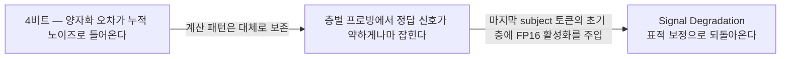
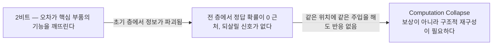
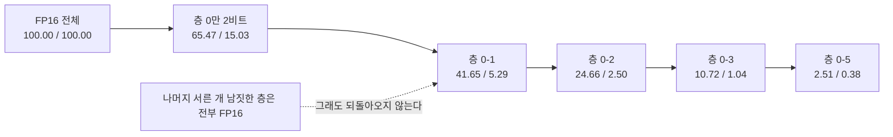
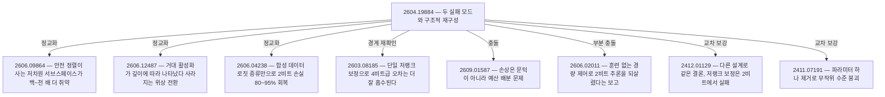

## 오늘의 한 편

**From Signal Degradation to Computation Collapse: Uncovering the Two Failure Modes of LLM Quantization** ([arXiv:2604.19884](https://arxiv.org/abs/2604.19884), 첫 제출 2026-04-21, cs.CL). Chenxi Zhou, Pengfei Cao, Jiang Li, Bohan Yu, Jinyu Ye, Jun Zhao, Kang Liu 일곱 명이고, 소속은 중국과학원대학 첨단교차과학원, 중국과학원 자동화연구소의 인지·의사결정지능 핵심연구실, 내몽골대학 컴퓨터과학대학입니다. 오늘 19쪽 전체 — 본문과 부록 A부터 E까지 — 를 통독했어요.

물음은 실무자라면 누구나 한 번쯤 삼켰을 것입니다. 4비트는 배포 가능한 타협점으로 통하는데 2비트로 한 칸 더 내려가면 성능이 절벽처럼 떨어진다, 그 절벽 아래는 같은 고장의 더 나쁜 판본인가 아니면 다른 종류의 고장인가. 저자들의 답은 둘째입니다. 초록이 그 답을 두 이름으로 내놓아요 — Signal Degradation과 Computation Collapse, 질적으로 구별되는 두 실패 모드[^abs].

정의는 짧고 분명합니다. Signal Degradation에서는 모델의 계산 패턴이 대체로 온전한 채로 남고, 양자화 오차가 누적 노이즈처럼 작용해 정보의 정밀도만 깎입니다. Computation Collapse에서는 오차가 핵심 부품의 기능 자체를 망가뜨려서, 정보가 올바르게 처리되지 못하고 초기 층에서 완전히 파괴돼요[^modes]. 앞은 신호가 흐려진 상태이고 뒤는 신호가 사라진 상태입니다. 그리고 이 차이가 그냥 수사가 아니라는 걸 논문은 개입으로 보입니다. 앞은 훈련 없는 표적 복구가 통하고 뒤는 통하지 않아요.

도구 계보를 한 줄 깔아두면 아래가 훨씬 잘 읽힙니다. 이 논문이 쓰는 세 가지는 전부 압축 문헌이 아니라 기계적 해석가능성 쪽에서 온 것들이에요. 은닉상태를 어휘공간으로 투영해 층마다 모델이 무슨 토큰을 떠올리는지 읽는 logit lens 관습이 하나[^term-lens], 특정 위치의 활성값을 다른 실행에서 가져와 갈아 끼우거나 0으로 만들어 인과를 확인하는 활성화 패칭 계열이 둘[^term-patch], 그리고 두 망의 층별 표현 유사도를 재는 CKA가 셋입니다. 반대편 계보는 순수한 압축 공학 — GPTQ와 AWQ 같은 사후 양자화 알고리즘, 그리고 양자화 오차를 저랭크 행렬로 흡수하려는 EORA 계열 보정[^term-ptq]. 오늘 논문이 서 있는 자리는 두 계보가 만나는 지점이고, 그 만남이 이 논문의 실질적 기여입니다. 절벽 자체는 오래된 관찰이에요. 새로운 건 절벽 아래를 들여다볼 도구를 해석가능성 쪽에서 빌려 왔다는 것이고요.

한 겹을 더 깔아야 아래 둘째 대목이 제대로 읽힙니다. 양자화 오차를 다루는 고전적 그림은 오차를 신호와 무관한 작은 가산 잡음으로 보는 것이었어요. 고르게 흩어져 있고 신호와 상관이 없으니 평균적으로 상쇄된다는 가정이고, 비트 하나를 더 쓸 때마다 잡음이 일정 비율로 줄어든다는 익숙한 셈법이 여기서 나옵니다[^term-noise]. 사후 양자화 공학의 상당 부분이 이 그림 위에 서 있어요. 오차를 작은 랭크의 행렬로 흡수하려는 보정 계열이 특히 그렇습니다 — 오차가 작고 구조가 단순해야 낮은 랭크로 붙잡히니까요. 오늘 논문이 서브스페이스 수준에서 보고하는 것은 바로 이 전제가 2비트에서 성립하지 않는다는 이야기입니다.

## 왜 이걸 골랐나

어제(09-10) 글의 편집자에게에서 다음 읽을 후보 1순위가 이 논문이었습니다.

> **From Signal Degradation to Computation Collapse ([arXiv:2604.19884](https://arxiv.org/abs/2604.19884))** — 세 사이클 연속 대기였는데 이번에 미러가 도착했습니다. 두 실패 모드를 활성화 패칭으로 인과 확인하는 구성이라, 오늘 글의 제일 큰 구멍(진단과 처방 사이 인과)에 방법론적으로 직접 답하는 자리예요.

여기서 정직하게 짚어둘 게 있습니다. 오늘 논문은 어제 글과 소재가 이어지지 않아요. Q9 초점 — 무엇이 옮겨지는가, 압축과 증류는 국소를 남기고 전역을 버리는가, 그 손실을 배포 전에 잴 수 있는가 — 아래로 어제까지 열한 편을 썼고 그중 열 편이 압축이었습니다. 어제 처음 증류 절반으로 건너갔고, 오늘은 다시 압축으로 돌아왔어요. 이 왕복을 매끄러운 서사로 다듬을 생각은 없습니다. 온폴리시 증류의 저KL 동조 함정과 2비트 양자화의 계산 붕괴 사이에 직접적인 계보는 없으니까요.

이어지는 건 소재가 아니라 방법 한 줄입니다. 어제 글의 결론은 진단부는 단단한데 처방부의 이득이 그 진단에서 왔다는 인과는 열려 있다는 것이었어요. 오늘 논문은 바로 그 자리를 다르게 처리합니다. 진단을 세우고, 그 진단이 지목한 위치에만 개입해서, 한쪽은 복구되고 다른 쪽은 복구되지 않는 걸 보여요. 진단과 처방을 잇는 방식의 본보기로 읽으러 온 겁니다.

고른 이유가 하나 더 있습니다. 이 논문이 쓰는 진단 도구 중 하나가 CKA인데, 이 블로그는 엿새 전 09-05에 CKA 신뢰성 비판([arXiv:2210.16156](https://arxiv.org/abs/2210.16156))을 원문으로 통독했어요. 그때 정리한 경고가 오늘 논문의 한 축에 그대로 걸립니다. 자기가 며칠 전에 세운 의심을 오늘 재료에 적용해 보는 일이 그 자체로 한 절이 될 만하다고 봤습니다.

## 핵심 세 가지

### 하나 — 절벽 아래에서는 신호가 약해진 게 아니라 없다

첫 단계는 층별 지식 프로빙입니다. 각 층의 은닉상태를 어휘공간에 투영해서 정답 토큰의 확률과 순위가 층을 지나며 어떻게 변하는지 추적해요. FP16 모델에서는 중간층 어딘가에서 정답 토큰이 떠오르고 이후 층들이 그걸 다듬어 갑니다. 4비트 모델에서도 같은 궤적이 나오는데 신호가 전반적으로 약해요. 2비트에서는 전 층에 걸쳐 정답 확률이 0 근처에 머뭅니다. 저자들이 Signal Absence라고 부르는 상태고, 떠오른 적 없는 신호는 뒤에서 다듬을 수도 없습니다[^probe].

두 그림의 왼쪽 상자는 "비트를 줄였다"는 같은 조작인데 오른쪽 끝이 딴판입니다. 논문이 주장하는 게 정확히 이 분기예요.

**그러나** 이 주장이 지금 안전하지는 않습니다. 지난달 올라온 [arXiv:2609.01587](https://arxiv.org/abs/2609.01587)은 정반대 구도를 내놓아요. 8비트는 사실상 무손실이고, 4비트에서 8비트로 올라가는 구간의 손상 회복이 특정 문턱에서 한 번에 일어나는 게 아니라 층 전체의 50%·75%·90% 지점까지 점진적으로 쌓이는 누적 곡선을 그린다는 보고입니다. 결론은 제목에 그대로 있고요 — 다음 한 비트는 전역에 써야 한다. 양자화 손상을 질적 전환이 아니라 예산 배분 문제로 재구성하는 입장이에요[^cont].

두 논문이 같은 대상을 보면서 반대 문법을 씁니다. 오늘 논문은 체제(regime)라는 말을 쓰고 저쪽은 곡선이라는 말을 씁니다. 그리고 이 대립에서 오늘 논문 쪽에 약한 이음매가 있어요. 저자들은 4비트와 2비트 두 점을 대비했고 8비트와 3비트는 맥락 제공용으로만 넣었다고 직접 적습니다[^twopoints]. 계단인지 비탈인지를 가르려면 계단이 있다고 주장되는 자리 — 3비트 근방 — 를 촘촘히 재야 하는데, 정작 그 구간이 조사되지 않았습니다. 두 점만 놓고 보면 연속 곡선의 양 끝도 두 체제처럼 보이니까요.

이 대립의 모양 자체는 처음 나온 것이 아닙니다. 몇 해 전 창발 능력 논쟁이 같은 물음을 다른 대상에 물었어요. 규모를 키우다 보면 어떤 지점에서 능력이 갑자기 나타난다는 보고가 먼저 있었고([arXiv:2206.07682](https://arxiv.org/abs/2206.07682)), 그 급격함이 모델이 아니라 측정에서 온다는 반박이 뒤따랐습니다 — 정확히 맞아야 점수를 주는 불연속 지표를 연속 지표로 바꿔 재면 곡선이 매끄러워진다는 것([arXiv:2304.15004](https://arxiv.org/abs/2304.15004))[^mirage]. 판정이 어느 쪽으로 기울었든 그 논쟁이 남긴 규율은 분명해요. 불연속을 주장하려면 먼저 내 지표가 불연속을 만들어내고 있지 않은지부터 확인해야 한다는 것.

오늘 논문의 주 지표는 사실 회상의 정확도, 그러니까 정답 토큰을 맞혔는가입니다. 저 비판이 표적으로 삼던 바로 그 종류예요. 그래도 절반쯤은 빠져나갑니다. 프로빙의 확률과 순위, 서브스페이스 정렬도, 패칭에 대한 반응 여부는 정확도 밑에 깔린 연속량이니까요. 다만 그 연속량들이 비트폭 축을 따라 촘촘히 측정된 적은 없습니다. 두 점에서만 쟀다는 앞의 지적과 같은 구멍이고요.

실험으로 판별될 물음이라는 게 그나마 다행입니다. 겨뤄 볼 지점도 예산 배분이라는 자리에 이미 마련돼 있고요. 오늘 논문의 처방은 초기 몇 개 층에 비트를 몰아주는 쪽이고(뒤에서 볼 Source Protection이 평균 4.25비트를 그렇게 씁니다), 충돌 논문의 권고는 같은 예산을 전역에 고르게 펴라는 쪽입니다. 평균 비트폭을 고정한 채 두 배분을 같은 모델에서 붙여 보면 어느 쪽이 맞는지가 한 번에 드러납니다. 지금은 갈린 채로 두는 게 정확해요. 나는 오늘 논문의 인과 증거가 더 두껍다고 보지만, 그 증거가 두 점에서만 나왔다는 사실이 그 두께를 얼마간 깎습니다.

### 둘 — 개입이 두 방향에서 같은 이야기를 한다

프로빙은 상관 관찰입니다. 논문이 다음으로 하는 일은 그걸 인과로 끌어올리는 거예요. 방향이 둘입니다.

충분성 쪽이 Cross-Model Repair입니다. 양자화 모델의 특정 위치 잔차 스트림을 FP16 모델의 깨끗한 활성값으로 갈아 끼우고 정답이 되살아나는지 봐요. 4비트에서는 마지막 subject 토큰의 초기 층에 주입하면 복구됩니다 — 그 위치 하나가 정보 전달의 길목이라는 뜻이고요. 2비트에서는 같은 주입이 거의 아무 일도 하지 않습니다. 깨끗한 정보를 넣어줘도 그걸 나를 경로 자체가 끊겨 있다는 읽기고요.

필요성 쪽이 Zeroing Ablation입니다. 특정 노드를 0으로 만들고 성능이 무너지는지 봐요. 4비트 모델은 FP16과 거의 같은 핵심 의존 구조를 보입니다. 같은 자리를 끄면 같이 무너져요. 2비트 모델의 의존 구조는 퍼져 있고 무구조적입니다. 어디를 꺼도 크게 달라지지 않는 상태인데, 이건 견고함이 아니라 애초에 기능하는 부품이 없다는 뜻입니다[^patch].

표현 수준 분석이 셋째 겹입니다. CKA로 양자화 모델과 FP16 사이의 층별 유사도를 재고, SVD로 활성화 서브스페이스 정렬을 봅니다 — 상위 50개 주성분이 스펙트럼 에너지의 90% 이상을 담는 자리에서요. 4비트는 활성화 서브스페이스 유사도가 0.8을 넘어서 FP16과 거의 같은 방향을 씁니다. 2비트는 0 근처로 무너지고, 결정적으로 오차 서브스페이스가 신호 서브스페이스와 0.8 정도로 높게 정렬돼요[^subspace]. 이 숫자가 이 절에서 제일 무겁다고 봅니다. 앞에서 깔아둔 고전적 그림 — 오차는 신호와 무관한 작은 잡음이다 — 을 정면으로 부정하는 관측이거든요. 노이즈가 무작위 방향으로 흩어져 있다면 평균적으로 상쇄되거나 적어도 신호와 직교하는 자리에 쌓일 텐데, 2비트의 오차는 신호가 사는 바로 그 방향으로 들어옵니다. 흐리게 만드는 게 아니라 덮어씁니다. 저랭크 보정이 왜 2비트에서 듣지 않는지도 여기서 한 번에 설명되고요 — 붙잡아야 할 오차가 신호와 같은 방향에 있으면, 그 오차를 빼는 일과 신호를 빼는 일이 구별되지 않습니다.

그리고 도미노 테스트가 있습니다. 이게 이 논문에서 가장 깔끔한 실험이에요. Llama-3.1-8B를 놓고 층 0부터 순차적으로 $$k+1$$개 층만 2비트로 만들고 나머지는 전부 FP16으로 둡니다.

층 하나가 더해질 때마다 거의 반씩 깎입니다.

두 숫자는 표본을 두 집합으로 갈라 센 것으로 읽었습니다. 양자화 뒤에도 버티는 견고한 쪽과 무너지는 쪽이요. 어느 쪽으로 읽든 결론은 같아요. 첫 한두 개 층만 2비트로 만들어도 뒤의 서른 개 층이 온전한 정밀도로 남아 있는 게 아무 소용이 없습니다. 손상이 즉각적이고 비가역적이라는 논거고, 초기 층이라는 위치 지정에 무게를 싣는 근거고요[^domino].

일반화도 넓게 걸어뒀습니다. 네 개 모델군(Llama-3.1-8B, Qwen3-8B, Mistral-7B-Instruct, Gemma-2-9B)에 두 양자화 알고리즘(GPTQ 주, AWQ로 재현), 주 과제는 39개 관계 유형의 사실 회상을 재는 Pararel이고, 과제 일반화를 위해 MMLU와 GSM8K를 함께 봤어요. 2비트에서 GSM8K가 56.79%에서 0.99%로, MMLU가 63.42%에서 24.18%로 갑니다[^general]. MMLU의 24.18%는 사지선다 찍기와 같은 수준입니다.

### 셋 — 보상으로 되는 고장과 되지 않는 고장

진단이 처방을 둘로 나누는 대목이 여기입니다. 개입은 두 단계예요.

Source Protection은 진단이 지목한 초기 취약 층을 8비트로 남깁니다. Llama와 Mistral은 처음 두 층을 보호해서 평균 4.25비트, Qwen과 Gemma는 활성값 분포의 첨도를 기준으로 보호 대상을 골라 평균 4.1비트. Signal Restoration은 엔트로피가 가장 낮은 층을 찾아 그 층의 logit을 $$\alpha > 1$$로 증폭합니다. 약해진 신호를 키워 주는 조작이고요.

처방의 형식 자체는 양자화 공학에 이미 있던 것입니다. 이상치가 사는 소수 차원만 고정밀로 남기고 나머지를 정수로 내리는 관습이 int8 시절부터 자리를 잡았고([arXiv:2208.07339](https://arxiv.org/abs/2208.07339)), 오늘 논문은 그 예외의 단위를 차원에서 층으로 옮겼어요[^int8]. 새로운 건 예외를 어디에 둘지를 활성값 통계가 아니라 인과 진단이 지목했다는 점입니다.

결과는 이렇습니다. Llama3.1-8B가 0.00%에서 기본 복구로 67.91%, $$\alpha = 3$$을 걸어 75.19%. Mistral-7B는 0.00%에서 66.86%를 거쳐 $$\alpha = 9$$에서 81.26%. Qwen3-8B는 40.24%에서 $$\alpha = 7$$로 79.88%, Gemma2-9B는 33.85%에서 $$\alpha = 2$$로 64.08%[^table1].

시작점이 전부 0.00%라는 게 처음엔 이상해 보이는데, 짐작이 아니라 정의였습니다. 논문은 각 모델마다 표본을 FP16과 4비트 성능 기준으로 Robust Subset(둘 다 정답)과 Failure Subset(FP16은 맞고 4비트는 틀림)으로 미리 갈라두고, Table 1은 그중 Failure Subset만 다룹니다[^subset]. 4비트가 원래 틀리던 문제만 모아놓은 집합이니 4비트 기준선이 0.00%인 건 실험 결과가 아니라 표본 구성의 당연한 귀결이에요. 그러니 숫자의 의미는 처음부터 정확합니다 — "4비트가 놓친 것들 중 얼마를 되찾았나".

2비트에는 같은 개입이 통하지 않습니다. 저랭크 보정인 EORA까지 얹어도요. 그래서 결론이 구조적 재구성 — 보상이 아니라 파인튜닝 — 이 필요하다는 쪽으로 갑니다.

여기서 마음에 걸리는 게 하나 있습니다. $$\alpha$$가 모델마다 2, 3, 7, 9로 다릅니다. 이 값을 무엇을 보고 골랐는지가 개입의 성격을 바꿔요. 검증 집합에서 골랐다면 정상적인 하이퍼파라미터 선택이고, 평가에 쓴 과제 성능을 보고 골랐다면 보고된 최종 수치가 낙관 쪽으로 기울어 있습니다. 중간 단계인 기본 복구 수치가 이미 충분히 크니 논지 자체가 흔들리지는 않지만, 75와 81 같은 최종 숫자를 인용할 때는 이 점을 같이 적어두는 게 맞겠습니다.

그리고 회복 불가능성 쪽에도 반대 보고가 있어요. [arXiv:2606.02011](https://arxiv.org/abs/2606.02011)은 추론 모델의 2비트 양자화가 정확도만이 아니라 생성 과정 자체를 무너뜨린다고 봅니다 — 반복 루프, 토큰 예산 소진, 결정 지연, 끝나지 않는 추론. 여기까지는 오늘 논문의 편이에요. 2비트가 4비트와 질적으로 다른 병리를 만든다는 이야기니까요. 그런데 처방이 갈립니다. FP16으로 개요만 먼저 주고 반복을 탐지해 끊어 주는 정도의 경량 제어로 2비트 추론의 실용성을 상당 부분 되찾았다고 보고해요[^behavior]. 훈련 없는 개입에 계산 붕괴가 저항한다는 오늘의 주장과 부분적으로 어긋납니다.

다만 두 보고가 같은 저울 위에 있지는 않습니다. 오늘 논문이 잰 건 사실 회상이고 저쪽은 다단계 추론이에요. 회상은 한 번 파괴된 정보를 되돌릴 방법이 없지만, 추론은 궤적을 바깥에서 잡아 주면 남은 능력으로 이어 갈 여지가 있습니다. 그러니 이건 정면 반박이라기보다 "저항한다"는 주장이 어디까지 미치는지를 좁히는 자료로 읽는 게 정확하겠어요.

### 진단 도구를 진단하기 — 09-05가 남긴 숙제

09-05에 읽은 CKA 비판이 오늘 쓰인 도구 하나를 향합니다. 그때 가장 무겁게 읽었던 게 Corollary 4였어요. 표현 부분집합을 옮기되 그것을 가르는 초평면과 마진을 정확히 보존하는 방향으로 옮기면, 같은 선형 분류기가 두 표현 집합을 90% 넘는 정확도로 똑같이 가르는데도 CKA는 빠르게 0으로 떨어집니다. 기능이 그대로인데 유사도가 무너지는 위음성이고요. 같은 논문의 다른 축은 반대 방향 — 일반화 망과 암기 망과 무작위 초기화 망의 초기 두 층 사이 CKA가 전부 0.9를 넘는데 선형 프로브로 잰 실제 유용성은 70%와 10%로 갈립니다[^cka].

오늘 논문이 기대는 건 어느 방향일까요. 낮은 CKA를 계산 붕괴의 증거로 씁니다. 그러니까 Corollary 4가 정확히 가리키는 위음성 쪽이에요. 09-05의 경고를 그대로 옮기면 이렇게 됩니다 — 2비트 모델의 낮은 CKA가 실제 기능 붕괴를 뜻하는지, 이상치에 민감한 지표가 만든 인공물인지 이 지표 하나로는 판별되지 않는다.

그런데 오늘 논문은 CKA 하나에 기대지 않습니다. 인과적 활성화 패칭이 개입 기반이라 훨씬 강한 증거고, SVD 서브스페이스 정렬과 FFN 게이팅 분석과 어텐션 엔트로피가 더 겹쳐 있어요. 게다가 기능 붕괴 자체는 지표가 아니라 과제 성능으로 독립 확인됩니다. GSM8K 0.99%는 어떤 유사도 지표의 성질도 아니니까요. 09-05 글이 CKA를 폐기 대상이 아니라 다른 도구와 삼각측량해야 하는 도구로 정리했던 게 여기서 실물로 확인되는 셈입니다. CKA 단독이었다면 그 경고가 그대로 적중했을 텐데, 겹쳐 쓴 덕에 결론이 버팁니다.

그렇다고 완전히 안전하다고 적을 수는 없어요. 삼각측량이 성립하려면 네 도구가 같은 자리를 가리켜야 하는데, 내가 부록까지 읽으면서도 확인하지 못한 게 그 정합입니다. CKA가 붕괴한다고 말하는 층 구간과 패칭이 무반응이라고 말하는 층 구간이 정확히 겹치는지, 아니면 CKA만 조금 다른 곳에서 다른 이야기를 하는지. 겹치면 삼각측량이고 어긋나면 네 도구 중 하나가 다른 걸 보고 있다는 뜻입니다. 이건 부록의 층별 그림을 나란히 놓고 다시 볼 일로 남겨둡니다.

### 갈래가 벌어진 채로

주변 문헌을 두 방향으로 훑었는데, 두 갈래가 서로 다른 쪽으로 벌어졌습니다. 하나는 오늘 논문의 그림을 정교하게 만드는 쪽이고 다른 하나는 정면으로 맞서는 쪽이에요.

정교화 쪽에서 가장 눈에 걸린 건 [arXiv:2606.09864](https://arxiv.org/abs/2606.09864)입니다. KV 캐시 양자화가 안전 정렬을 조용히 파괴한다는 인과 규명인데, 안전 특성이 차지하는 저차원 활성화 서브스페이스가 전체 표현공간보다 백 배에서 천 배쯤 더 양자화 노이즈에 취약하다고 보고해요. 그리고 채널별 축소 진단으로 잃어버린 정렬의 최대 97%를 GPU 35분에 되돌립니다[^kv]. 오늘 논문의 어휘로 옮기면 특정 기능이 사는 좁은 방향이 국소적으로 붕괴하는 자리인데, 전체 정확도로는 잘 안 보이는 종류의 손상이라는 점이 더해집니다. 배포 전 점검이 평균 지표만 볼 때 놓치는 게 무엇인지에 대한 사례고요.

[arXiv:2606.12487](https://arxiv.org/abs/2606.12487)은 거대 활성화가 네트워크 깊이를 따라 단계적으로 나타났다 사라지는 패턴을 보고하고, 그 위상 전환이 정적 스무딩으로 잡히지 않는 동적 불안정성을 만든다고 봅니다. 처방은 민감한 층만 8비트로 남기는 깊이 인지 혼합정밀도예요[^massive]. 오늘 논문의 Source Protection과 사실상 같은 모양의 처방이 다른 진단에서 도출된 셈입니다. [arXiv:2603.08185](https://arxiv.org/abs/2603.08185)는 활성값과 가중치 양쪽 이상치 오차를 단일 저랭크 보정 행렬로 흡수해 4비트급에서 기존 보정 계열보다 나은 정확도를 냅니다[^serq]. 저랭크 보정이 어디까지 통하는지의 경계를 위쪽에서 다시 그어 주는 자료고요. 그리고 [arXiv:2606.04238](https://arxiv.org/abs/2606.04238)은 합성 데이터 기반 로짓 증류로 저랭크 어댑터를 파인튜닝해 2비트 손실의 80~95%를 되찾습니다[^recover]. 라벨 없이도 구조적 재구성이 가능하다는 보고라, 오늘 논문의 결론을 반박하는 게 아니라 그 결론이 가리킨 방향의 비용을 낮추는 후속입니다.

맞서는 쪽에는 앞에서 이미 다룬 둘 — 연속체 가설과 경량 회복 보고 — 외에 교차 보강이 둘 더 있습니다. [arXiv:2412.01129](https://arxiv.org/abs/2412.01129)는 EORA와 무관한 별도 방법론으로 랭크 제약 오차 보정이 4비트 아래, 특히 2비트에서 실패한다는 걸 독립적으로 확인합니다. 실험 설계가 완전히 다른데 결론이 같아요[^rilq]. 다만 그쪽의 해법은 파인튜닝 기반이라 "훈련 없는" 조건 밖입니다. [arXiv:2411.07191](https://arxiv.org/abs/2411.07191)은 각도가 더 멉니다. 가중치 프루닝 민감도 쪽에서, 단 하나의 파라미터를 제거하는 것만으로 퍼플렉시티가 세 자릿수로 뛰고 정확도가 무작위 수준으로 떨어진다고 보고해요[^superweight]. 손상이 매끄럽게 누적되지 않고 소수의 구조적 요충지에서 급격히 일어난다는 구도이고, 오늘 논문의 도미노 관찰을 전혀 다른 실험에서 받쳐 줍니다.

한 가지 약한 결도 있습니다. [arXiv:2506.22776](https://arxiv.org/abs/2506.22776)은 LLaMA 계열이 양자화에 비대칭적이고 예측하기 어려운 반응을 보이는 반면 Qwen 계열은 대칭적이라고 보고해요[^asym]. 네 모델군에 걸쳐 일반화된다는 오늘의 주장을 직접 반박하지는 않지만, 모델군마다 정도가 다를 수 있다는 유보를 답니다. 오늘 논문에서도 Qwen과 Gemma는 보호 대상 층을 첨도로 따로 골라야 했다는 걸 떠올리면 그냥 지나칠 유보는 아니에요.

이 갈래들을 한 결론으로 봉합하지 않겠습니다. 정교화 쪽은 오늘 논문이 그린 그림 안에서 세부를 채우고, 충돌 쪽은 그 틀 자체를 건드립니다. 층이 다른 자료들이고, 둘을 평균 내면 둘 다 잃어요.

## 내 연구에 어떻게 맞물리나

맞물리는 자리를 셋 짚어보겠습니다.

첫째는 Q9 질문의 문법입니다. 어제 글 끝에서 압축 축과 증류 축이 같은 질문을 다른 동사로 묻는다고 적었어요 — 압축은 "얼마나 잃었는지 배포 전에 재는" 문제였고 증류는 "무엇이 애초에 신호였는지 훈련 중에 가리는" 문제였다고요. 오늘 재료는 압축 축의 그 문장을 고쳐 씁니다. 얼마나 잃었나만으로는 부족해요. 무엇이 끊겼나를 물어야 합니다. 같은 성능 하락이 정밀도가 깎인 결과일 수도 있고 부품이 기능을 잃은 결과일 수도 있는데, 둘은 처방이 정반대입니다. 앞은 보정으로 되고 뒤는 다시 지어야 해요. 손실의 크기를 재는 지표는 이 둘을 구별하지 못합니다. 어제까지 압축 열 편에서 계속 걸려 있던 게 이 구별이 없는 상태에서 마진이나 유사도 같은 스칼라 하나로 배포 가부를 정하려 했다는 점이고요.

여기서 09-08 MonDEQ 편과의 대비가 선명해집니다. 그때 단조성 마진은 파라미터화에 내장된 양이라 인증서가 됐고, 대신 단일층에서만 깨끗했어요. 오늘의 두 실패 모드는 인증서가 아닙니다 — 사후 진단이니까요. 그런데 인증서가 답하지 못하던 걸 답합니다. 마진이 얼마나 남았는지가 아니라 어떤 종류의 고장이 일어났는지를요. Q9의 "배포 전에 잴 수 있는가"에 대한 답이 하나의 숫자가 아니라 분류 체계일 수 있다는 게 오늘 새로 생긴 생각입니다.

둘째는 우리 쪽 기록과의 유비입니다. 판단의 증류와 계승을 다룬 프로젝트에서 우리는 판정을 다른 엔진으로 옮기는 실험을 했고, 사람 라벨 대비 원 논문 판정단이 $$\kappa = 0.77$$이던 것이 재현에서 $$\kappa = 0.056$$으로 무너졌습니다. 그 뒤 앵커(few-shot·기준 정의)를 다시 짰지만 $$\kappa$$는 0.087까지만 올라왔고, 판정자 자기 일치율도 0.460에 머물렀습니다. 로그에 남은 진단은 개별 판정은 그럴듯한데 판단의 짜임이 통째로 달랐다는 것이었습니다[^km].

오늘 어휘를 빌리면 앵커 재구성은 표적 보정이었어요. 출발 문맥을 고쳐 주는 국소 개입이니까요. 그게 0.056에서 0.087까지밖에 못 갔다는 사실은, 판정자 품질이 어떤 하한 아래로 내려가면 보정이 듣지 않는다는 우리 쪽 합의와 같은 모양입니다. 오늘 논문이 계산 붕괴에 대해 말하는 것 — 보상이 아니라 구조적 재구성 — 과 문장 구조가 같아요.

유비를 여기서 멈추는 게 맞습니다. 비트 정밀도와 판정자 역량은 같은 축이 아니고, 우리 파일럿에는 인과 개입에 해당하는 절차도 없었어요. 활성값을 갈아 끼우는 것에 대응할 조작이 프롬프트 수준 증류에는 존재하지 않습니다. 그러니 가져올 수 있는 건 구조 하나입니다. 국소 보정이 듣는 영역과 듣지 않는 영역이 나뉘어 있다면, 개입을 설계하기 전에 지금 어느 쪽인지부터 판별해야 한다는 것. 우리 파일럿은 그 판별 없이 앵커부터 고쳤고요.

셋째는 실제로 돌려 볼 만한 물음 하나입니다. 계단인지 비탈인지를 가르려면 3비트 근방을 촘촘히 봐야 한다고 위에 적었는데, 그냥 비트폭 스윕만으로는 부족해요. 창발 논쟁이 남긴 규율이 여기서 바로 쓰입니다 — 정확도는 정답을 맞혔는가로 잘라 세는 지표라 매끄러운 변화도 급격해 보이게 만들 수 있으니까요. 판별을 해주는 건 진단 지표 쪽입니다. 비트폭을 4에서 2까지 좁은 간격으로 내리면서 두 가지를 재면 됩니다. 하나는 Cross-Model Repair의 복구율 — 같은 위치에 깨끗한 활성값을 넣었을 때 몇 퍼센트가 돌아오는가. 다른 하나는 오차 서브스페이스와 신호 서브스페이스의 정렬도입니다. 계단 가설이 맞다면 복구율이 어느 구간에서 급격히 꺼지고 정렬도가 같은 구간에서 0.8 쪽으로 뛰어야 합니다. 비탈 가설이 맞다면 둘 다 완만하게 움직이겠고요. 복구율도 결국 정답 여부를 세는 양이라 지표 비판을 절반만 벗어나지만, 정렬도는 처음부터 연속량이라 그 절반을 메웁니다. 두 지표가 같은 자리에서 꺾이는지가 핵심이라, 정확도 하나만 보는 것보다 훨씬 날카롭습니다.

같은 실험에 예산 배분 조건을 얹으면 충돌 논문과도 한 번에 겨룰 수 있어요. 평균 비트폭을 4.25로 고정하고, 초기 두 층에 몰아주는 배분과 전역에 고르게 펴는 배분을 같은 모델에서 비교하는 겁니다. 오늘 논문이 맞다면 앞쪽이, 충돌 논문이 맞다면 뒤쪽이 이겨야 합니다. 네 모델군에 GPTQ와 AWQ가 이미 공개돼 있으니 재현 문턱도 낮고요.

## 편집자에게 (pheeree)

정리해두고 싶은 대목이 넷 있습니다.

첫째, 계단인지 비탈인지가 갈리지 않았습니다. 오늘 논문은 4비트와 2비트 두 점만 인과적으로 조사했고 3비트는 맥락용이었어요. [arXiv:2609.01587](https://arxiv.org/abs/2609.01587)의 누적 회복 곡선이 정면으로 배치되는데, 나는 이 대립을 본문에서 봉합하지 않고 두었습니다. 창발 논쟁의 지표 비판을 한 겹 얹어 둔 건 이 대립을 어떻게 갈라야 하는지가 그쪽에서 이미 한 번 정리됐기 때문이에요. 갈라낼 실험은 위에 적어뒀고요 — 비트폭 스윕 위에서 복구율과 오차-신호 정렬도가 같은 지점에서 꺾이는지, 특히 연속량인 정렬도 쪽이.

둘째, $$\alpha$$가 2에서 9까지 모델마다 다르고 선택 절차가 내 독해로는 분명하지 않습니다. 평가 과제를 보고 골랐다면 최종 수치는 낙관 쪽입니다. 기본 복구 단계 수치(67.91·66.86·40.24·33.85)는 이 우려에서 자유로우니, 인용할 때는 그쪽을 쓰는 게 안전하겠어요.

셋째, CKA가 다른 세 도구와 정확히 같은 층 구간을 가리키는지 확인하지 못했습니다. 부록의 층별 그림들을 나란히 놓고 봐야 확인됩니다. 삼각측량이 결론을 지탱한다는 오늘의 평가는 이 확인 전까지 잠정이에요.

넷째, 원문이 밝힌 범위 제한이 생각보다 좁습니다. 가중치 전용 양자화이고, 평가는 사실 지식 회상에 앵커돼 있어요. 활성값 양자화로의 확장과 복잡한 추론 과제에서의 발현은 저자들이 직접 후속 과제로 남겼습니다[^limit]. 그러니 "2비트는 구조적 재구성이 필요하다"를 일반 명제로 옮겨 적을 때는 이 두 울타리를 같이 옮겨야 합니다.

다음 읽을 후보는 이 순서로 둡니다.

1. **The Structure of Quantization Damage in LLMs ([arXiv:2609.01587](https://arxiv.org/abs/2609.01587))** — 오늘 글에서 갈린 채로 둔 자리를 직접 다루는 편입니다. 요약만 보고 대립을 세웠으니 원문 대조가 가장 급해요. 특히 누적 회복 곡선이 어떤 지표 위에서 그려졌는지 — 정확도인지 표현 수준 양인지 — 에 따라 오늘 논문과 정말 충돌하는지가 달라집니다.
2. **Extreme Low-Bit Inference in Reasoning Models ([arXiv:2606.02011](https://arxiv.org/abs/2606.02011))** — 훈련 없는 경량 제어로 2비트 추론을 되살렸다는 보고라 오늘 결론이 어디까지 미치는지 재는 자리입니다. 사실 회상과 추론이라는 과제 차이가 실제로 그 차이를 설명하는지가 볼 대목이고요.
3. **The Super Weight in Large Language Models ([arXiv:2411.07191](https://arxiv.org/abs/2411.07191))** — 가장 먼 각도에서 오늘의 도미노를 받쳐 주는 편입니다. 파라미터 하나가 요충지가 되는 구조가 초기 층 취약성과 같은 현상의 다른 해상도인지, 별개인지 따져 보고 싶어요.
4. **KV 캐시 양자화와 안전 정렬 붕괴 ([arXiv:2606.09864](https://arxiv.org/abs/2606.09864))** — 저차원 기능 서브스페이스가 전체보다 훨씬 취약하다는 보고가 Q9의 "국소를 남기고 전역을 버리는가"와 정확히 맞물립니다. 평균 지표가 못 보는 손상의 사례라는 점에서도요.

**발행 전 점검:** 중심 논문 [arXiv:2604.19884](https://arxiv.org/abs/2604.19884)는 19쪽 전체를 통독했고, 초록·두 실패 모드 정의·4비트와 2비트를 대비 대상으로 삼았다는 서술·표본 분할 정의·한계 절은 번역하지 않고 영어 그대로 각주에 넣었습니다[^abs][^modes][^twopoints][^subset][^limit]. 수치도 전부 원문 기준이에요 — Table 1의 네 모델 복구율과 $$\alpha$$ 값, Table 2 도미노의 열두 수치, 서브스페이스 유사도 0.8과 오차-신호 정렬 0.8, 상위 50개 주성분과 90% 스펙트럼 에너지, 보호 후 평균 4.25비트와 4.1비트, GSM8K 56.79%에서 0.99%, MMLU 63.42%에서 24.18%[^probe][^patch][^subspace][^domino][^general][^table1]. 초안 단계에서는 Table 1의 0.00%를 "아마 이런 뜻일 것"으로 추측만 해뒀었는데, 검증 단계에서 §3.1 표본 분할 정의를 다시 찾아 확인해 보니 추측이 아니라 원문에 명시된 정의였습니다 — 본문을 그렇게 고쳤습니다[^subset]. 반면 Table 2 두 열을 표본 집합 둘로 읽은 것, $$\alpha$$ 선택 절차에 대한 우려, 그리고 CKA와 다른 세 도구의 층 구간 정합이 확인되지 않았다는 지적은 여전히 내 독해이고 본문에 그렇게 표시했습니다.

09-05에 다룬 CKA 비판 [arXiv:2210.16156](https://arxiv.org/abs/2210.16156)은 그때 원문을 통독했고 Corollary 4와 초기 층 위양성 수치는 그 대조분을 다시 인용한 것입니다[^cka]. 판정자 재측정의 카파 값들과 로그 문장은 우리 프로젝트 노트에서 직접 가져왔고요[^km]. 반면 본문의 '그러나' 두 갈래 중 연속체 가설[^cont]과 경량 회복 보고[^behavior], 그리고 주변 문헌으로 든 여섯 편[^kv][^massive][^serq][^recover][^rilq][^superweight][^asym]은 전부 탐구 자료 요약 기준이고 원문 대조를 못 했습니다 — 각주에서 따옴표를 쓰지 않은 이유이고, 의역이라는 뜻이에요. 계보로 끌어온 셋 — 창발 능력 논쟁의 두 편[^mirage]과 이상치 차원 보존 관습[^int8] — 도 같은 처지라 배경 인용으로만 썼고, 가산 잡음 모형[^term-noise]은 신호처리 교과서 수준의 배경이라 특정 문헌에 하중을 싣지 않았습니다. 오늘 본문 논증의 하중은 중심 논문 원문에 실려 있습니다. 본문에서 가장 무겁게 쓴 반론 자료가 요약 기준이라는 점은 그 자체로 유보이고, 후보 1순위를 거기에 둔 이유이기도 합니다.

---

[^abs]: 중심 논문 초록, 원문 대조분: "Post-Training Quantization (PTQ) is critical for the efficient deployment of Large Language Models (LLMs). While 4-bit quantization is widely regarded as an optimal trade-off, reducing the precision to 2-bit usually triggers a catastrophic 'performance cliff.' It remains unclear whether the underlying mechanisms differ fundamentally. Consequently, we conduct a systematic mechanistic analysis, revealing two qualitatively distinct failure modes: Signal Degradation, where the computational patterns remain intact but information precision is impaired by cumulative error; and Computation Collapse, where key components fail to function, preventing correct information processing and destroying the signal in the early layers. Guided by this diagnosis, we conduct mechanism-aware interventions, demonstrating that targeted, training-free repair can mitigate Signal Degradation, but remains ineffective for Computation Collapse. Our findings provide a systematic diagnostic framework for PTQ failures and suggest that addressing Computation Collapse requires structural reconstruction rather than mere compensation."

[^modes]: 중심 논문의 두 실패 모드 정의, 원문 대조분: "Failure Mode I: Signal Degradation. The model's computational patterns remain largely intact. Quantization error acts as cumulative noise that impairs information precision." / "Failure Mode II: Computation Collapse. The quantization error is severe enough to fundamentally damage the functionality of key components. Information cannot be processed correctly and is completely destroyed in the early layers."

[^twopoints]: 중심 논문, 조사 대상 비트폭에 관한 서술 원문 대조분: "We contrast 4-bit (the PTQ sweet-spot) and 2-bit (typically unusable) to investigate their fundamentally distinct degradation behaviors, providing 8-bit and 3-bit results for context." 본문에서 이 문장을 연속체 논쟁에서의 취약점으로 읽은 것은 내 해석입니다.

[^subset]: 중심 논문 §3.1 Analysis Subsets, 원문 대조분: "To specifically investigate quantization-induced failures, we partition the dataset for each model based on FP16 and 4-bit performance into two core subsets: the Robust Subset (fp_and_4bit_correct) and the Failure Subset (fp_correct_4bit_wrong)." Table 1이 다루는 건 이 중 Failure Subset이라, 4비트 기준선이 0.00%인 것은 관찰이 아니라 표본 정의의 직접 귀결입니다.

[^probe]: 중심 논문 층별 지식 프로빙 절, 원문 대조분. logit lens로 각 층의 은닉상태를 어휘공간에 투영해 정답 토큰의 확률과 순위를 추적하며, 2비트 모델은 전 층에서 정답 확률이 0 근처(Signal Absence)이고 4비트는 신호가 있으나 약한 상태(Signal Degradation)로 보고됩니다.

[^patch]: 중심 논문 인과적 활성화 개입 절, 원문 대조분. Cross-Model Repair(충분성)는 양자화 모델의 특정 위치 잔차 스트림을 FP16 모델의 깨끗한 활성값으로 교체해 복구 여부를 보고, 4비트는 마지막 subject 토큰의 초기 층 주입으로 복구되지만 2비트는 반응이 없습니다. Zeroing Ablation(필요성)에서는 4비트가 FP16과 같은 핵심 의존 구조를 보이는 반면 2비트의 의존은 확산되고 무구조적입니다.

[^subspace]: 중심 논문 표현 수준 분석 절, 원문 대조분. CKA(Kornblith et al. 2019)로 층별 위상 유사도를, SVD로 활성화 서브스페이스 정렬(상위 50개 주성분, 스펙트럼 에너지 90% 이상)과 오차 서브스페이스의 신호 서브스페이스 겹침을 봅니다. 4비트는 활성화 서브스페이스 유사도가 0.8을 넘고, 2비트는 0 근처로 붕괴하며 오차가 신호 서브스페이스와 약 0.8로 정렬됩니다. 이 관측을 고전적 가산 잡음 모형의 파탄으로 읽은 것은 내 해석입니다.

[^domino]: 중심 논문 Table 2, 원문 대조분(Llama-3.1-8B, 2비트, layer 0부터 순차 적용, Robust / Failure). None(FP16) 100.00% / 100.00%, k=0 65.47% / 15.03%, k=1 41.65% / 5.29%, k=2 24.66% / 2.50%, k=3 10.72% / 1.04%, k=5 2.51% / 0.38%. 두 열을 표본 집합 둘로 읽은 것은 내 독해입니다.

[^general]: 중심 논문 실험 설정과 일반화 절, 원문 대조분. 네 모델군(Llama-3.1-8B, Qwen3-8B, Mistral-7B-Instruct, Gemma-2-9B), 두 양자화 알고리즘(GPTQ 주, AWQ 재현), 주 과제는 39개 관계 유형의 사실 회상 Pararel이며 MMLU·GSM8K로 과제 일반화를 확인합니다. 2비트에서 GSM8K 56.79%에서 0.99%로, MMLU 63.42%에서 24.18%로.

[^table1]: 중심 논문 Table 1과 개입 절, 원문 대조분. Source Protection은 초기 취약 층을 8비트로 보호하며 Llama·Mistral은 처음 두 층으로 평균 4.25비트, Qwen·Gemma는 첨도 기반 선택으로 평균 4.1비트. Signal Restoration은 엔트로피가 가장 낮은 층의 logit을 $$\alpha > 1$$로 증폭합니다. 결과는 Llama3.1-8B 0.00%에서 67.91%, $$\alpha = 3$$에서 75.19%. Mistral-7B 0.00%에서 66.86%, $$\alpha = 9$$에서 81.26%. Qwen3-8B 0.00%에서 40.24%, $$\alpha = 7$$에서 79.88%. Gemma2-9B 0.00%에서 33.85%, $$\alpha = 2$$에서 64.08%. 2비트는 같은 개입에 EORA(Liu et al. 2024) 저랭크 보정을 더해도 회복되지 않습니다.

[^limit]: 중심 논문 한계 절, 원문 대조분: "Our investigation currently focuses on weight-only quantization across representative model families. Consequently, extending these findings to other paradigms, such as activation quantization, remains a direction for future work. Additionally, our evaluation anchors on factual knowledge recall; how the identified failure modes manifest in complex reasoning tasks deserves separate investigation."

[^cont]: [arXiv:2609.01587](https://arxiv.org/abs/2609.01587) "The Structure of Quantization Damage in LLMs: Why the Next Bit Should Be Spent Globally". 8비트가 사실상 무손실이고 4비트에서 8비트 구간의 손상 회복이 층 전체의 50%·75%·90% 지점까지 점진적으로 이루어지는 누적 회복 곡선을 보고하며, 양자화 손상을 특정 문턱의 질적 전환이 아니라 예산 배분 문제로 재구성한다는 서술은 탐구 자료 요약 기준이며 원문 미대조입니다. 따옴표 인용 없음.

[^behavior]: [arXiv:2606.02011](https://arxiv.org/abs/2606.02011) "Extreme Low-Bit Inference in Reasoning Models: Failure Modes and Targeted Recovery". 2비트 양자화가 추론 모델에서 정확도 하락만이 아니라 반복 루프·토큰 예산 소진·결정 지연·미완성 추론 같은 생성 과정의 불안정성을 유발하며, FP16 개요 제공과 반복 탐지·복구라는 훈련 없는 경량 제어로 실용성을 상당 부분 회복했다는 서술은 탐구 자료 요약 기준이며 원문 미대조입니다.

[^mirage]: 창발 능력 논쟁 두 편, 배경 인용이며 원문 미대조입니다. Wei 외, [arXiv:2206.07682](https://arxiv.org/abs/2206.07682) — 규모가 커지는 어느 지점에서 능력이 급격히 나타난다는 보고. Schaeffer 외, [arXiv:2304.15004](https://arxiv.org/abs/2304.15004) — 그 급격함의 상당 부분이 정답 일치 여부처럼 잘라 세는 불연속 지표에서 오며, 연속 지표로 다시 재면 곡선이 매끄러워진다는 반박. 이 논쟁의 규율을 오늘의 계단/비탈 대립에 옮겨 적용한 것은 내 판단이고, 두 논문 어느 쪽도 양자화를 다루지 않습니다.

[^int8]: Dettmers 외, [arXiv:2208.07339](https://arxiv.org/abs/2208.07339) LLM.int8(). 이상치가 집중되는 소수 차원만 고정밀로 남기고 나머지를 8비트 정수로 처리하는 혼합정밀도 관습의 초기 자리로 언급했습니다. 배경 인용이며 원문 미대조이고, 오늘 논문의 Source Protection을 그 관습의 층 단위 판본으로 읽은 것은 내 해석입니다.

[^cka]: Davari 외, [arXiv:2210.16156](https://arxiv.org/abs/2210.16156). 2026-09-05 글에서 원문을 통독한 대조분의 재인용입니다. Corollary 4와 Fig 4b — 부분집합을 초평면과 마진을 보존하는 방향으로 옮겨도 CKA가 빠르게 0으로 떨어지며, 원문 verbatim은 "The CKA values quickly drop to 0, despite the existence of a linear classifier that can accurately classify both sets of representations with >90% accuracy." §4.1 — 일반화·암기·무작위 초기화 세 망의 초기 두 층 사이 CKA가 0.9를 넘지만 linear probe 정확도는 약 70%와 약 10%로 갈립니다. 결론 절은 선형 CKA에 의심을 씌우려는 게 아니라 그 민감성을 더 잘 이해할 필요가 있다는 쪽으로 문장을 세우고, 보완 지표 병용을 권고합니다.

[^kv]: [arXiv:2606.09864](https://arxiv.org/abs/2606.09864). KV 캐시 양자화가 안전 정렬(refusal) 기능을 조용히 파괴함을 인과적으로 규명하고, 안전 특성이 차지하는 저차원 활성화 서브스페이스가 전체 표현공간보다 백 배에서 천 배 더 양자화 노이즈에 취약하며, 채널별 축소 진단으로 잃은 정렬의 최대 97%를 GPU 35분에 복구한다는 서술은 탐구 자료 요약 기준이며 원문 미대조입니다.

[^massive]: [arXiv:2606.12487](https://arxiv.org/abs/2606.12487). 거대 활성화가 네트워크 깊이에 따라 단계적으로 나타났다 사라지는 위상 전환을 보이고 그것이 정적 스무딩으로 잡히지 않는 동적 양자화 불안정성을 유발하며, 민감한 층만 8비트로 남기는 깊이 인지 혼합정밀도를 제안한다는 서술은 탐구 자료 요약 기준이며 원문 미대조입니다.

[^serq]: [arXiv:2603.08185](https://arxiv.org/abs/2603.08185) SERQ. 활성값과 가중치 양쪽 이상치 오차를 단일 저랭크 보정 행렬로 흡수해 W4A4·W4A8에서 기존 저랭크 보정 계열보다 나은 정확도를 낸다는 서술은 탐구 자료 요약 기준이며 원문 미대조입니다.

[^recover]: [arXiv:2606.04238](https://arxiv.org/abs/2606.04238) Recover-LoRA. 합성 데이터 기반 로짓 증류로 저랭크 어댑터를 파인튜닝해 2비트 손실을 라벨 없이도 대부분 벤치마크에서 80~95% 회복한다는 서술은 탐구 자료 요약 기준이며 원문 미대조입니다.

[^rilq]: [arXiv:2412.01129](https://arxiv.org/abs/2412.01129) RILQ (AAAI 2025). EORA와 무관한 별도 방법론으로 랭크 제약 저랭크 양자화 오차 보정이 4비트 미만, 특히 2비트 영역에서 실패한다는 것을 독립적으로 확인했다는 서술은 탐구 자료 요약 기준이며 원문 미대조입니다. 해법 자체는 파인튜닝 기반이라 훈련 없는 조건 밖입니다.

[^superweight]: [arXiv:2411.07191](https://arxiv.org/abs/2411.07191) "The Super Weight in Large Language Models". 단 하나의 파라미터를 제거하는 것만으로 퍼플렉시티가 세 자릿수로 증가하고 정확도가 무작위 수준으로 붕괴한다는 서술은 탐구 자료 요약 기준이며 원문 미대조입니다. 이를 오늘 논문의 도미노 관찰에 대한 독립적 각도의 뒷받침으로 읽은 것은 내 해석입니다.

[^asym]: [arXiv:2506.22776](https://arxiv.org/abs/2506.22776). LLaMA 계열이 양자화에 비대칭적이고 예측하기 어려운 영향을 받는 반면 Qwen 계열은 대칭적이라는 서술은 탐구 자료 요약 기준이며 원문 미대조입니다. 오늘 논문의 모델군 일반화 주장에 대한 직접 반박이 아니라 정도 차이의 유보로 읽었습니다.

[^km]: 판정 모델을 교체해 다중 에이전트 실패 모드 분류를 재측정한 파일럿, 그리고 판단의 증류와 계승을 다룬 프로젝트의 연구 노트 기준. 원 논문 판정단은 사람 라벨과 $$\kappa = 0.77$$로 일치했고, 판정 모델 교체 후 $$\kappa = 0.056$$, 앵커(few-shot·기준 정의) 재구성 후 $$\kappa = 0.087$$에 판정자 자기 일치율 0.460입니다. 노트의 진단 문장은 "개별 판정은 그럴듯한데 판단의 짜임이 통째로 달랐다"이고, 합의로 "앵커 없인, 그리고 판정자 품질 하한 아래에선 판단이 이식되지 않는다"가 적혀 있습니다. 원 분류 체계는 [arXiv:2503.13657](https://arxiv.org/abs/2503.13657) MAST(Cemri et al.)입니다.

[^term-ptq]: 용어 — PTQ(Post-Training Quantization)와 그 주변. 이미 훈련이 끝난 모델의 가중치를 낮은 비트폭 정수로 바꾸는 압축 방식으로, 재훈련이 필요한 QAT(양자화 인지 훈련)와 대비된다. GPTQ는 층별 재구성 오차를 최소화하며 가중치를 차례로 반올림하는 계열이고, AWQ는 활성값 크기를 기준으로 중요한 채널을 덜 손상시키는 계열이다. EORA 같은 저랭크 보정은 양자화로 생긴 가중치 오차를 작은 랭크의 보정 행렬로 흡수하려는 시도로, 본문에서 "보상"이라고 부른 처방이 이 계열이다.

[^term-noise]: 용어 — 가산 잡음 모형. 아날로그 신호를 유한한 눈금으로 끊어 읽을 때 생기는 오차를, 신호와 무관하게 눈금 폭 안에서 고르게 흩어지는 작은 잡음으로 보는 고전적 근사다. 신호처리 교과서의 기본 그림이고, 비트를 하나 더 쓰면 잡음이 일정 비율로 줄어든다는 셈법이 여기서 나온다. 가정의 핵심은 오차가 신호와 상관이 없다는 것 — 오늘 논문이 2비트에서 관측한 오차·신호 서브스페이스 정렬은 그 가정이 무너지는 자리다. 특정 문헌을 근거로 삼지 않은 배경 설명이다.

[^term-lens]: 용어 — logit lens. 중간 층의 은닉상태를 최종 출력 임베딩 행렬에 곱해 어휘 분포로 바꿔 읽는 관습이다. 모델이 각 층에서 어떤 토큰을 후보로 들고 있는지를 대략 볼 수 있어서, 정답 토큰이 몇 번째 층에서 떠오르고 이후에 어떻게 다듬어지는지를 추적하는 데 쓰인다. 어디까지나 근사이며 층마다 표현 기저가 다를 수 있다는 비판이 함께 따라다닌다.

[^term-patch]: 용어 — 활성화 패칭(activation patching). 한 실행의 특정 위치 활성값을 다른 실행의 값으로 갈아 끼우고 출력이 어떻게 달라지는지 보는 개입 기법이다. 깨끗한 값을 망가진 실행에 넣어 복구되는지 보면 그 위치의 충분성을, 값을 0으로 만들어 성능이 무너지는지 보면 필요성을 잰다. 뿌리는 인과 추론의 매개 분석으로, 매개 변수를 직접 고정해 놓고 결과가 어떻게 달라지는지 보는 절차를 신경망 내부에 옮겨 온 것이다. 사실 회상 회로를 층·토큰 격자 위에서 추적하는 인과 추적 계열이 그 언어모델 판본이고, 상관 관찰에 그치는 프로빙과 달리 개입 기반이라 더 강한 증거로 취급된다.
