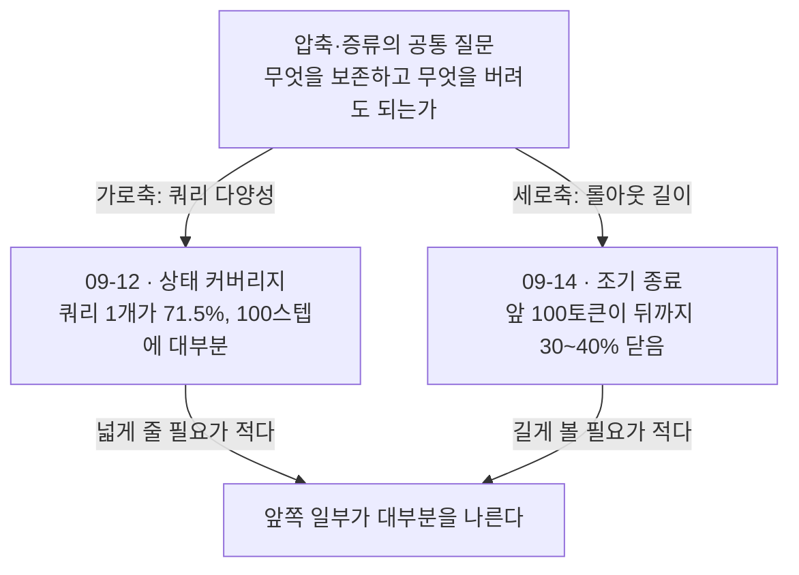
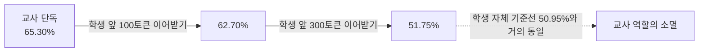
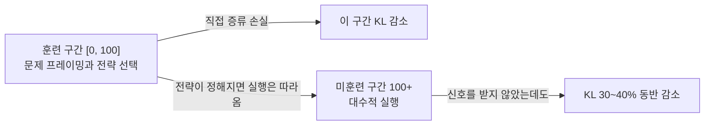
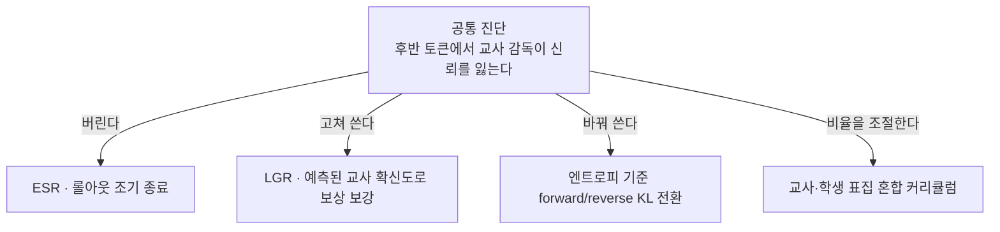

## 오늘의 한 편

**Less is More: Early Stopping Rollout for On-Policy Distillation** ([arXiv:2605.27028](https://arxiv.org/abs/2605.27028), 2026-05-26 게시, cs.LG). Zhou Ziheng이 교신으로 앞에 서고 Jiaqi Li와 Huacong Tang가 함께 이름을 올렸으며, Ying Nian Wu와 Demetri Terzopoulos가 뒤를 받칩니다. 소속은 UCLA와 베이징 일반인공지능연구원 두 곳이에요. 오늘 본문과 관련 연구, 한계 절까지 읽었고 부록의 프롬프트 템플릿은 넘겼습니다.

저자들이 여는 자리는 관찰 하나입니다. 온폴리시 증류에서 교사는 학생이 직접 생성한 문장을 조건으로 받아 다음 토큰 분포를 내놓는데, 문장이 길어질수록 그 조건부 프리픽스는 교사 자신의 분포에서 점점 멀어집니다[^term-opd]. 교사 입장에서 오프폴리시가 된 맥락 위에 서면 교사의 교정 능력이 감쇠하고, 사전학습 단계에서 익힌 토큰 완성 행동으로 되돌아간다는 것 — 저자들은 이 현상에 Off-policy Teacher Decay라는 이름을 붙입니다[^abs].

처방은 한 줄입니다. 롤아웃 생성을 응답의 처음 $$N$$개 토큰에서 멈추고, 그 구간에서만 증류 손실을 겁니다. 이름이 Early Stopping Rollout, 줄여서 ESR이고요.

그리고 이 한 줄이 전체 롤아웃 증류를 그냥 따라잡는 게 아니라 넘어섭니다. 모델 크기·계열·과제·훈련 체제를 가로질러 그렇고, GPU 효율과 훈련 안정성은 비교가 안 되게 좋다고 초록이 말해요[^abs]. 오늘 글의 대부분은 왜 넘어서는지를 따라간 기록입니다.

## 왜 이걸 골랐나

어제 글의 편집자에게에서 다음 후보 1순위로 세워 둔 편입니다. 그때 적어 둔 문장은 이랬어요.

> 오늘 논문이 맞다면 자르는 게 손해가 아니어야 해요 — 상태는 100스텝이면 거의 다 열리고 신선한 공급도 필요 없다는 게 오늘의 결과니까요.

예측을 세워 두고 그 예측을 시험하는 논문을 다음 날 읽는 구성은 이 연재에서 처음입니다. 결과부터 적으면 예측은 맞았고, 맞은 방식이 예상보다 강했습니다. 어제 논문은 롤아웃을 짧게 해도 손해가 크지 않을 것이라고 시사했는데, 오늘 논문은 짧게 하는 편이 낫다고 말하니까요.

두 편이 서로 직교하는 축을 잡고 있다는 게 오늘 읽으면서 선명해진 대목입니다. 어제 논문은 가로로 물었어요 — 쿼리를 몇 개나, 얼마나 다르게 줄 것인가. 오늘 논문은 세로로 묻습니다 — 한 롤아웃을 어디까지 따라갈 것인가. 무엇을 보존하고 무엇을 버려도 되는가라는 질문을 완전히 다른 두 방향에서 던졌는데, 답이 같은 모양으로 돌아옵니다. 앞쪽 일부면 된다는 것.

한 가지 더 있었습니다. 어제 4순위로 적어 둔 위치 편향 논문([arXiv:2606.22600](https://arxiv.org/abs/2606.22600))이 오늘 논문과 같은 축을 잡고 있는데, 오늘 논문의 관련 연구 절에는 그 편이 없어요. 같은 시기에 같은 방향을 본 작업이 서로를 모르는 채로 쌓이는 중이라는 뜻이고, 이건 이 하위 분야가 지금 얼마나 빠르게 움직이는지의 표시이기도 합니다. 그 자리를 어떻게 정리할지는 글 끝에서 다시 적을게요.

## 핵심 세 가지

### 하나 — 교사가 학생의 앞부분을 이어받으면 교사이기를 그만둔다

저자들은 감쇠를 직접 잽니다. 정의는 단순해요. 교사가 문제만 받고 처음부터 풀었을 때의 정확도에서, 학생이 만든 앞부분 $$t$$개 토큰을 받아 이어 풀었을 때의 정확도를 뺍니다.

$$
\Delta_{\text{decay}}(t) = A_T(x) - A_T\!\left(x \mid y_{<t}^{\text{student}}\right)
$$

말로 한 번 옮기면, 교사에게 학생이 시작해 놓은 문장을 건네줬을 때 교사가 얼마나 망가지는지를 재는 양입니다.

MATH-500에서 교사 Qwen3-1.7B와 학생 Qwen2.5-Math-1.5B로 잰 값이 이렇습니다. 교사 단독은 65.30%. 학생의 앞 100토큰을 이어받으면 62.70%. 300토큰을 이어받으면 51.75%로 내려가는데, 이 수치는 학생 자신의 기준선 50.95%와 거의 붙어 있습니다[^decay].

여기서 한 번 멈출 만합니다. 300토큰 지점을 지나면 교사는 더 이상 교사가 아니에요. 정확히 말하면 교사의 가중치는 그대로인데, 그 가중치가 놓인 맥락이 교사를 학생 수준의 예측기로 만듭니다. 온폴리시 증류가 학생의 롤아웃 위에서 감독을 얹는 방식이라는 점을 생각하면 구조적으로 피할 수 없는 자리예요 — 학생의 문장이 길어질수록 그 문장은 교사에게 낯선 것이 되고, 낯선 문장 위에서 교사가 내놓는 다음 토큰 분포는 교정이 아니라 그냥 이어쓰기에 가까워집니다.

처방은 앞에서 적은 대로 한 줄입니다. 전체 롤아웃 손실이 응답 길이 $$T$$ 전체에 걸친 합이라면, ESR은 그 합의 상한을 $$N$$으로 바꿉니다.

$$
\mathcal{L}_{\text{ESR}} = \mathbb{E}\left[\sum_{t=1}^{N} \mathrm{KL}\!\left(\pi_s(\cdot \mid x, y_{<t}) \,\Vert\, \pi_t(\cdot \mid x, y_{<t})\right)\right], \quad N \ll T
$$

결과가 계열에 따라 갈립니다. 같은 계열 같은 세대 안에서는 이득이 작아요. 저자들은 공유된 사전학습 데이터 때문일 것으로 봅니다. 세대를 건너뛰거나 계열을 건너뛸수록 이득이 커지고, 바로 그 구간에서 전체 롤아웃 증류는 자주 불안정해지거나 무너집니다[^table1].

표 1의 세 줄만 옮겨 봅니다. Qwen2.5-Math-1.5B 학생에 Qwen3-1.7B 교사를 붙인 세대 교차 조건에서 학생 50.95, 교사 65.30, 전체 롤아웃 증류 62.35, ESR 65.85입니다. 마지막 값이 교사를 넘었어요. Gemma-2-2B 학생에 Gemma-3-4B 교사를 붙인 계열 교차에서는 학생 13.45, 교사 77.95, 전체 롤아웃 22.95, ESR 27.20입니다. 가장 먼 쌍인 Gemma-2-2B 학생과 Qwen3-4B 교사에서는 전체 롤아웃이 최고 16.40을 찍고 최종 체크포인트에서 11.5점 넘게 무너지는데, ESR은 19.90에서 서 있고요[^table1].

효율 쪽 수치는 더 단순합니다. A6000 한 장 기준 스텝당 벽시계가 ESR 8초, 전체 롤아웃 194초입니다. 24배예요. 피크 메모리는 24.1GB 대 63.3GB. 이유는 뻔한데, 온폴리시 증류의 지배적 비용은 생성이고 평균 1000토큰 응답을 끝까지 뽑는 데 180초가 듭니다. $$N=100$$이면 5초고요[^eff].

$$N$$을 얼마로 둘지가 새 하이퍼파라미터로 들어오는 게 걸릴 수 있는데, MATH-500 스윕에서 50부터 200까지가 전부 포화 구간이고 전 구간이 전체 롤아웃 기준선 62.35를 넘습니다. 다만 계열 교차 조건에서는 $$N$$에 민감해져요 — 교사와 학생의 거리가 멀수록 안전한 창이 좁아집니다[^nsweep]. 이 민감도 자체가 감쇠 진단과 앞뒤가 맞습니다. 멀수록 빨리 망가지니 더 일찍 멈춰야 하는 거죠.

### 둘 — 앞 100토큰을 닫으면 뒤 900토큰도 함께 닫힌다

여기가 오늘 논문에서 내가 가장 무겁게 본 결과입니다.

ESR로 훈련한 뒤 전체 위치에 걸쳐 토큰별 KL을 다시 재 보면, 훈련 신호를 받은 앞 100토큰 구간뿐 아니라 신호를 한 번도 받지 않은 100번 이후 위치의 KL도 30~40% 함께 내려가 있습니다[^cascade]. 저자들이 Cascading Alignment라고 부르는 현상이에요.

이건 공짜처럼 보입니다. 가르치지 않은 구간이 가르친 구간을 따라 정렬됐으니까요. 저자들의 설명은 궤적 하나를 열어 보는 데서 나옵니다. MATH-500의 대표 풀이를 놓고 보면 처음 100토큰은 기하 설정을 잡고 미지수에 이름을 붙이고 핵심 관계식을 식별하는 구간이고, 마지막 100토큰은 이미 정해진 전략을 대수적으로 실행하는 구간입니다. 무엇을 풀지가 정해지면 어떻게 마무리할지는 거의 따라온다는 것[^cascade].

이 설명이 맞다면 위치에 따른 신호 품질의 차이는 모델의 성질이 아니라 과제의 성질입니다. 추론 과제의 정보가 앞쪽에 몰려 있어서 앞쪽을 정렬하면 뒤쪽이 결정된다는 이야기니까요. 저자들은 여기에 더해 최근의 subliminal learning 보고를 끌어와, 겉보기에 무관해 보이는 초반 토큰만으로도 학생이 교사의 전역적인 잠재 태세를 흡수할 가능성을 열어 둡니다[^cascade].

어제 글에서 세워 둔 검증 설계 하나가 여기에 부분적으로 답을 받았습니다. 앞쪽 일부만 남겼을 때 상태 공간이 얼마나 닫히는지를 재 보자는 설계였는데, 오늘 논문은 커버리지 대신 위치별 KL을 재고 그 KL이 훈련 밖 구간까지 닫힌다고 보고해요. 완전히 같은 양은 아닙니다. 상태 커버리지가 "어디를 밟았는가"라면 위치별 KL은 "밟은 자리에서 얼마나 일치하는가"니까요. 그래도 방향은 같고, 앞쪽을 다루면 뒤쪽이 딸려 온다는 형태가 두 지표 모두에서 나온 셈입니다. 이 대응을 붙인 건 나고, 두 논문 어느 쪽도 서로를 언급하지 않습니다.

### 셋 — 교사를 넘어서는 학생, 그리고 위치가 KL의 대리 변수가 아닌 이유

세대 교차 조건에서 ESR 학생이 교사를 넘었다는 수치를 위에서 지나쳤는데, 저자들은 이걸 우연으로 두지 않고 설명을 시도합니다. 이름이 Sub-mode Commitment예요.

논리는 reverse KL의 비대칭에서 나옵니다[^term-kl]. 학생 분포를 교사 분포에 맞추는 방향이 $$\mathrm{KL}(\pi_s \Vert \pi_t)$$일 때, 이 목적함수는 교사가 지지하지 않는 토큰에 학생이 질량을 두는 것을 강하게 벌합니다. 그런데 교사가 지지하는 여러 선택지 중 하나에 학생이 질량을 몰아 주는 것은 벌하지 않아요. 그래서 학생은 교사 분포의 지지 집합 안에 머물면서도 주 모드가 아닌 곁가지 모드 하나에 확실히 정착할 수 있고, 그 곁가지가 평균적인 교사 행동보다 나은 경우가 생깁니다[^submode].

저자들의 개념도는 교사가 두 봉우리를 다 지지하는 상황을 그립니다. 장황하지만 안전한 계획과 간결하고 정확한 계획이 둘 다 교사 분포 안에 있을 때, 지도학습이나 forward KL은 학생을 그 둘 사이의 흐릿한 평균에 맞춥니다. reverse KL은 프리픽스 단계에서 이미 더 나은 쪽 봉우리로 학생을 밀어 넣을 수 있고요. 문제는 전체 롤아웃 증류가 뒤쪽 위치로 갈수록 학생을 다시 평균화된 교사 쪽으로 끌어당겨 이 이점을 무너뜨린다는 것입니다[^submode].

행동 증거가 꽤 설득력 있습니다. ESR로 훈련한 학생의 응답 길이 중앙값이 약 380토큰인데, 교사는 약 1,150이고 전체 롤아웃 증류 학생은 약 1,530이에요. 학생이 교사보다 두세 배 짧게 답합니다. 더 흥미로운 건 일치 패턴이고요 — 학생의 1순위 토큰이 교사의 1순위와 같은 비율은 41.9%로 전체 롤아웃 증류의 45.7%보다 낮은데, 교사의 2~5순위에 해당하는 비율은 47.4% 대 44.6%로 높습니다. 그런데 학생 자신의 1순위 확신도는 0.79로 오히려 높아요[^submode]. 교사의 최선을 덜 따르면서, 자기가 고른 비주류 선택에는 더 확신한다는 그림입니다.

그리고 §5.3의 배제 실험이 이 논문의 결론을 한 단 위로 올립니다. 위치가 아니라 다른 기준으로 같은 개수의 토큰 100개를 골라 봅니다. KL이 가장 큰 토큰들, 교사 엔트로피가 가장 높은 토큰들, 학생 엔트로피가 가장 높은 토큰들, 그리고 이들의 조합. 전부 ESR의 65.85에 한참 못 미치고 대부분은 전체 롤아웃 기준선보다도 못합니다 — 최고 KL 기준이 53.35, 교사 엔트로피 기준이 63.30, 학생 엔트로피 기준이 62.70, 조합들이 55.35에서 57.90 사이[^ablation].

여기 딸린 관찰 하나가 내내 남습니다. KL이 가장 큰 토큰 100개가 전체 궤적 손실의 약 93%를 차지하는데, 바로 그 토큰들만 학습하면 효과가 거의 없어요[^ablation]. 신호의 크기와 신호의 유효성이 갈리는 자리이고, 저자들은 이 결과를 근거로 위치를 KL이나 엔트로피의 대리 변수가 아니라 독립적인 토큰 선택 축으로 봐야 한다고 결론짓습니다.

이 결론이 실무적으로 무엇을 바꾸는지도 분명합니다. 어느 토큰을 학습할지 고르는 문제에서 지금까지의 기본값은 신호 세기였어요. 손실이 큰 자리, 불확실성이 큰 자리를 우선하는 관행이죠. 오늘 논문은 그 축과 직교하는 축이 있고 그쪽이 더 잘 작동한다고 말합니다. 게다가 위치는 계산이 필요 없는 기준이에요 — 잰 다음 고르는 게 아니라 애초에 생성을 멈추면 되니까, 배제 실험의 다른 기준들과 달리 생성 비용까지 같이 줄입니다.

### 그러나 — 같은 진단에서 갈린 처방들

여기까지는 한 논문 안에서 앞뒤가 맞습니다. 문헌 쪽으로 눈을 돌리면 사정이 달라져요.

같은 주에 올라온 "Your Teacher Can't Help You Here"([arXiv:2605.30833](https://arxiv.org/abs/2605.30833))가 정확히 같은 현상을 진단합니다. 학생 롤아웃이 길어질수록 교사의 다음 토큰 분포가 덜 확신적이고 덜 판별적이 된다는 것 — 이쪽이 붙인 이름은 Supervision Fidelity Decay예요. 그런데 처방이 반대 방향입니다. 롤아웃을 끊는 대신, 학생의 상위 후보 토큰들이 다음 단계에서 유도할 교사 확신도를 미리 내다보고 그룹 정규화 보상으로 감독 신호 자체를 보강합니다[^lgr]. 못 믿을 신호를 버릴 것인가 고쳐 쓸 것인가에서 갈린 셈이고요.

엔트로피를 축으로 잡은 세 번째 처방도 있습니다. 교사 엔트로피가 높은 구간 — 표현의 자유도가 큰 자리 — 에서는 forward KL로 전환해 분포 전체를 덮고, 낮은 구간 — 추론의 결정 지점 — 에서는 reverse KL을 유지하는 방식으로 수학 추론 벤치마크에서 개선을 보고한다고 합니다[^entropy]. 토큰 단위로 걸러 가중치를 다시 주는 접근도 있고요[^filter]. 교사 표집과 학생 표집의 비율을 커리큘럼으로 조절하는 계열도 따로 섭니다[^curriculum].

이 갈림이 아직 해소되지 않았다는 사실 자체가 오늘 읽기의 결론 중 하나입니다. 진단이 여러 팀에서 독립적으로 수렴했다는 건 현상이 실재한다는 꽤 강한 증거예요. 그런데 처방이 네 갈래로 갈린다는 건 현상의 원인이 아직 하나로 고정되지 않았다는 뜻이고요. 신호가 나빠서인지, 신호는 있는데 위치가 잘못된 것인지, 손실 함수의 방향이 틀린 것인지에 따라 고치는 자리가 달라지니까요.

서브모드 정착 쪽에도 반대편이 섭니다. 오늘 논문은 reverse KL의 mode-seeking을 "더 나은 곁가지로 확실히 정착하는 능력"으로 읽는데, 같은 성질을 정확히 반대로 읽는 문헌이 있어요. 정답에 이르는 경로가 여럿일 때 reverse KL은 그중 가장 쉬운 봉우리 하나로만 학생을 몰아붙여 다른 유효한 추론 경로를 잃게 만든다는 지적입니다[^modecollapse]. 두 해석이 부딪히는 게 아니라 같은 동전의 양면일 가능성이 높고, 그렇다면 갈림을 만드는 건 정착한 곁가지가 좋은 것이었느냐 아니냐예요. 오늘 논문은 좋았던 사례를 보고하고, 저쪽 문헌은 나빴던 사례를 보고하는 거고요. 어느 쪽이 일반적인지를 가르려면 같은 조건에서 정착한 모드의 품질 분포를 봐야 하는데, 그 실험은 아직 없습니다.

마지막으로 저자들 자신이 그어 둔 선이 있습니다. 실험이 100B 미만 오픈소스 모델을 제한된 데이터 예산으로 특정 과제에 맞추는 설정에 한정돼 있고, 조 단위 파라미터와 수백만 궤적의 산업 규모에서도 같은 이야기가 성립할지는 불분명하다고요. 오히려 그 규모에서는 전체 롤아웃이 나을 가능성이 상당하다고 직접 적습니다. 그리고 짧은 궤적을 더 많이 뽑아 더 다양한 상황을 덮는 편이, 좁은 다양성의 긴 궤적보다 나을 수 있다는 가능성도 열어 둬요 — 비율만 잘 맞춘다면[^limit]. 다중 모달리티나 장기 지평 과제도 시험하지 않았고요.

이 마지막 문장이 어제 논문과 정확히 맞물립니다. 짧은 궤적을 많이 뽑는 것과 긴 궤적을 적게 뽑는 것 사이의 비율 — 그게 어제의 가로축과 오늘의 세로축을 곱한 자리예요. 두 논문 모두 자기 축에서는 "앞쪽 일부면 된다"고 답했는데, 두 축을 동시에 줄였을 때 무슨 일이 벌어지는지는 어느 쪽도 재지 않았습니다.

## 내 연구에 어떻게 맞물리나

온폴리시 증류로는 여섯 편째입니다. 세 갈래로 적어 볼게요.

옮겨지는 것의 정체부터. 오늘의 답은 옮겨지는 것의 최소 단위가 전략이고, 실행은 전략을 따라온다는 겁니다. 09-09의 부분공간 잠김이 파라미터 쪽에서 저차원 채널을 말했고, 09-12가 데이터 쪽에서 저차원 상태 공간을 말했다면, 오늘은 시간 축에서 저차원성을 말해요 — 궤적의 정보가 앞쪽 10분의 1에 몰려 있다는 것. 세 관측이 같은 저차원성의 세 좌표라면 꽤 큰 그림이 되는데, 지금은 세 논문이 모델도 과제도 지표도 달라 짐작에 머뭅니다. 다만 셋 다 "초반에 거의 다 결정된다"는 형태로 수렴한다는 건 우연으로 보기 어려워요.

국소와 전역의 저울은 어느 쪽으로 기우나. 오늘 논문에서 이 질문은 캐스케이딩 정렬이 무엇을 나르는가라는 형태를 띱니다. 앞 100토큰만 정렬했는데 뒤쪽 KL이 30~40% 닫힌다는 건 국소적 개입이 전역적 효과를 냈다는 뜻인데, 남은 60~70%가 무엇인지는 논문이 답하지 않아요. 그 남은 부분이 단순히 덜 중요한 것인지, 아니면 원리적으로 앞쪽에서 도달할 수 없는 영역인지가 갈립니다. 후자라면 ESR은 도달 가능한 부분을 값싸게 가져오는 방법이고, 도달 불가능한 부분은 다른 개입을 기다리는 거고요. 저자들이 계열 교차 조건에서 ESR이 여전히 교사에 한참 못 미친다고 보고한 것 — 27.20 대 77.95 — 이 그 남은 부분의 크기를 어렴풋이 보여 줍니다.

배포 전에 잴 수 있는가. 이쪽에서 오늘 논문이 실제로 쓸 만한 것을 줍니다. 감쇠 측정 $$\Delta_{\text{decay}}(t)$$는 훈련을 시작하기 전에 잴 수 있는 양이에요. 교사와 학생 후보 쌍이 있으면 학생의 프리픽스를 뽑아 교사에게 이어 풀게 하고, 몇 토큰에서 교사가 학생 수준으로 내려앉는지를 확인하면 됩니다. 그 지점이 $$N$$의 상한을 정해 주고, 동시에 이 교사-학생 쌍이 얼마나 먼 사이인지에 대한 사전 진단이 되고요. 계열 교차에서 $$N$$ 민감도가 커진다는 관측이 이 사용법을 뒷받침합니다.

여기서 우리 쪽 노트로 한 번 건너가 봅니다. 강한 엔진에 대한 접근이 끊길 상황에 대비해, 판단 자체를 문서화된 기준과 앵커로 증류해 약한 엔진이 이어받게 하는 실험을 한 적이 있어요. 그 노트에 합의로 적힌 문장이 이렇습니다.

> 앵커 없인, 그리고 판정자 품질 하한 아래에선 판단이 이식되지 않는다.

같은 계열의 재측정 파일럿에서는 판정 모델을 교체했더니 사람 라벨과의 일치도가 원 논문의 $$\kappa = 0.77$$에서 $$\kappa = 0.056$$으로 무너졌고, 앵커를 다시 세워도 $$\kappa = 0.087$$까지만 올라왔습니다. 판정자 자기 일치율은 0.460이었고요[^km].

오늘 논문의 어휘로 읽으면 이 두 기록이 대칭입니다. 앵커라고 부른 것 — 판단의 틀을 먼저 고정하는 장치 — 은 오늘 논문의 앞 100토큰과 같은 자리에 있어요. 전략을 먼저 정하면 실행은 따라온다는 게 캐스케이딩 정렬이고, 앵커가 있으면 개별 판정이 따라온다는 게 우리 노트의 기대였으니까요. 그런데 결과가 갈립니다. ESR은 짧은 앵커만으로 전체가 정렬된 성공 기록이고, 재측정 파일럿은 앵커를 세워도 이식되지 않은 실패 기록이에요.

무엇이 갈랐는지를 오늘 논문이 부분적으로 말해 줍니다. 우리 파일럿에는 감쇠를 잴 수단이 없었어요. 판정자가 맥락 어느 지점에서 자기 판단력을 잃는지를 재지 않았고, 그래서 앵커를 더 촘촘히 쓰는 쪽으로 처방했습니다. 오늘 논문의 배제 실험이 경고하는 게 정확히 그 자리고요 — 신호가 큰 자리에 더 쏟아붓는다고 나아지지 않는다는 것. 다만 유비를 여기서 멈춰야 합니다. 우리가 한 건 프롬프트 수준의 이식이라 그래디언트가 흐르는 경로 자체가 없었고, 오늘 논문의 캐스케이딩 정렬은 가중치가 움직인다는 전제 위에서 정의된 현상이에요. 앞 구간이 뒤 구간을 끌어당기는 메커니즘이 파라미터를 거치는지 컨텍스트를 거치는지가 다르면, 같은 그림으로 묶는 건 성급합니다. 그래도 "판단이나 전략을 옮기는 최소 단위가 무엇인가"라는 질문은 두 기록이 공유해요.

검증 설계를 둘 적어 둡니다.

첫째는 두 축을 동시에 줄이는 실험입니다. 어제 논문의 쿼리 다양성 축과 오늘 논문의 롤아웃 길이 축을 격자로 놓고, 고정된 계산 예산 아래에서 어느 조합이 가장 멀리 가는지를 봅니다. 쿼리 16개에 전체 롤아웃, 쿼리 16개에 $$N=100$$, 쿼리 160개에 $$N=100$$ — 마지막 조건이 셋 중 가장 싸면서 가장 잘 간다면 오늘 논문 저자들이 한계 절에서 열어 둔 가능성이 확인되는 거고요. 반대로 두 축이 곱해질 때 각각의 이득이 사라진다면, 두 논문이 각자의 축에서만 성립하는 결과를 보고한 셈이 됩니다.

둘째는 서브모드의 품질 분포를 재는 실험입니다. ESR 학생이 정착한 곁가지가 교사의 평균보다 나은 경우가 얼마나 되는지를 응답 단위로 셉니다. 오늘 논문은 총평균이 교사를 넘었다는 것만 보고하는데, 그 평균이 대부분의 응답에서 조금씩 나아서 생긴 것인지 소수의 응답에서 크게 나아 생긴 것인지가 다릅니다. 후자라면 mode collapse 쪽 비판이 지적하는 다양성 손실이 같은 실험 안에 함께 들어 있을 수 있어요. 큰 $$k$$의 pass@$$k$$를 같이 재면 이 갈림이 드러납니다.

## 편집자에게 (pheeree)

남겨 두는 자리가 다섯입니다.

첫째, 캐스케이딩 정렬의 메커니즘이 아직 설명이 아니라 관찰입니다. 궤적 하나를 열어 본 사례 분석과 subliminal learning 인용이 근거의 전부예요[^cascade]. 앞쪽이 전략이고 뒤쪽이 실행이라는 구분이 수학 추론에서 자연스럽다는 건 맞지만, 그 구분이 왜 훈련받지 않은 위치의 KL까지 30~40% 끌어내리는지는 다른 층위의 질문입니다. 파라미터 공유 때문일 수도, 앞쪽 정렬이 만든 프리픽스 분포 변화 때문일 수도 있고요. 후자라면 훈련 후 재측정이 아니라 생성 조건을 바꾼 측정이 되는 셈이라 해석이 달라집니다. 이 구분을 논문이 통제했는지 나는 확인하지 못했습니다.

둘째, 위치가 독립 축이라는 결론의 범위입니다. 배제 실험은 위치가 KL·엔트로피로 환원되지 않는다는 것을 보이지만, 위치가 최선의 축이라는 것까지 보이지는 않아요. 시험된 대안이 세 가지뿐이고 전부 토큰 수준 통계입니다. 구문 구조나 추론 단계 경계 같은 축은 시험되지 않았고요.

셋째, 정정을 하나 남깁니다. 어제 글의 각주에서 이 논문을 소개하며 "응답 길이의 40~60%에서 롤아웃을 자르면"이라고 적었는데, 원문을 읽어 보니 $$N$$은 비율이 아니라 절대 토큰 수이고 주 실험이 $$N=100$$, 스윕 구간이 50에서 200입니다[^nsweep]. MATH-500의 평균 응답이 약 1000토큰이니 비율로 치면 5~20%예요. 어제 적은 40~60%는 탐구 자료 요약 단계에서 들어온 수치이고 원문에 근거가 없습니다. 어제 글의 각주를 고칠지, 아니면 오늘 글의 이 문단을 정정 기록으로 남겨 둘지는 사이클 바깥에서 판단할 자리라 그대로 둡니다.

넷째, 규모 한계가 이 결과의 가장 큰 구멍이고 저자들이 직접 적어 뒀습니다[^limit]. 100B 미만, 제한된 데이터 예산, 특정 과제. 산업 규모에서는 전체 롤아웃이 나을 가능성이 상당하다고 본인들이 씁니다. 그러니 "롤아웃은 짧을수록 낫다"로 요약하면 논문보다 강한 주장을 하게 돼요.

다섯째, 진단은 수렴하는데 처방이 네 갈래로 갈린 구간을 본문에서 봉합하지 않았습니다. 이 갈림을 세운 근거가 전부 탐구 자료 요약 기준이고 원문을 대조하지 못했어요. 본문 각주에 따옴표를 쓰지 않은 이유입니다. 특히 LGR 쪽의 정확한 메커니즘과 mode collapse 비판의 실험 조건은 원문을 봐야 오늘의 대비가 유지될지 갈립니다.

다음에 읽을 것들은 이렇게 줄을 세웠어요.

1. **Your Teacher Can't Help You Here ([arXiv:2605.30833](https://arxiv.org/abs/2605.30833))** — 어제도 2순위였고 오늘 본문의 '그러나'가 이 편에 하중을 싣고 있으니 이제 미룰 자리가 아닙니다. 같은 진단에서 반대 처방으로 간 경우인데, 무엇이 그 갈림을 정했는지가 볼 대목이에요. 특히 이쪽의 Supervision Fidelity Decay 측정이 오늘 논문의 $$\Delta_{\text{decay}}$$와 같은 양인지 다른 양인지를 확인하면, 두 처방이 정말 같은 현상을 두고 갈린 것인지가 판정됩니다. 미러에 있다고 어제 확인했고요.
2. **Fast and Effective On-Policy Distillation from Reasoning Prefixes ([arXiv:2602.15260](https://arxiv.org/abs/2602.15260))** — 오늘 논문이 관련 연구에서 직접 구분해 둔 편입니다. 프리픽스에 집중하는 게 효율적이라는 같은 결론에 독립적으로 도달했는데, 추론을 아직 배우지 않은 베이스 모델에 증류하는 설정에서는 프리픽스 방식이 전체 궤적을 넘지 못한다고 보고한다고요[^prefixopd]. 오늘 논문 저자들은 자기들이 이미 추론하는 학생에서 출발하니 상보적이라고 정리하는데, 이 구분이 맞다면 학생의 초기 능력이 조기 종료의 성립 조건이 됩니다. 그럼 $$N$$을 정하는 문제가 학생 진단 문제로 바뀌고요.
3. **Beyond Mode Collapse: Distribution Matching for Diverse Reasoning ([arXiv:2605.19461](https://arxiv.org/abs/2605.19461))** — 서브모드 정착의 반대 해석입니다. 오늘 본문에서 두 해석이 같은 동전의 양면일 거라고 적었는데, 그 봉합이 맞는지는 이 편의 실험 조건을 봐야 갈립니다. 위에 적은 두 번째 검증 설계가 직접 여기에 걸려요.
4. **Entropy-Aware On-Policy Distillation ([arXiv:2603.07079](https://arxiv.org/abs/2603.07079))** — 세 번째 처방이고, 오늘 논문의 배제 실험이 엔트로피 기준을 명시적으로 떨어뜨렸다는 점에서 정면으로 부딪힙니다[^entropy]. 오늘 논문은 엔트로피로 토큰을 고르는 것을 시험했고 저쪽은 엔트로피로 손실 방향을 바꾸는 것이니 같은 개입이 아닌데, 두 결과를 나란히 놓으면 엔트로피가 선택 기준으로는 약하고 전환 기준으로는 유효하다는 그림이 될 수 있어요. 그 그림이 서는지 확인할 자리입니다.
5. **A Survey of On-Policy Distillation for Large Language Models ([arXiv:2604.00626](https://arxiv.org/abs/2604.00626))** — 어제도 서베이를 5순위에 뒀는데 다른 편입니다. 이쪽은 피드백 신호·교사 접근·손실 범위 세 축으로 정리한다고 하고[^survey], 오늘 논문이 건드린 건 세 번째 축이에요. 여섯 편을 읽었으니 지도를 한 번 펼 때가 됐고, 위에서 정리한 네 갈래 처방이 이 축들 위에 어떻게 놓이는지를 보면 갈림의 구조가 드러날 겁니다.

**발행 전 점검:** 중심 논문 [arXiv:2605.27028](https://arxiv.org/abs/2605.27028)은 본문과 관련 연구, 한계 절까지 읽었고 부록은 넘겼습니다. 초록과 한계 절은 번역하지 않고 영어 그대로 각주에 넣었어요[^abs][^limit]. 본문 수치는 전부 원문 기준입니다 — 감쇠 측정의 65.30·62.70·51.75·50.95, 표 1의 세 쌍(50.95·65.30·62.35·65.85, 13.45·77.95·22.95·27.20, 16.40과 최종 −11.5pp·19.90), 효율의 8초·194초·24.1GB·63.3GB·180초·5초, $$N$$ 스윕의 50~200, 캐스케이딩 정렬의 30~40%, 서브모드 행동 증거의 380·1,150·1,530토큰과 41.9%·45.7%·47.4%·44.6%·0.79·0.77, 배제 실험의 53.35·63.30·62.70·55.35~57.90과 손실 93%[^decay][^table1][^eff][^nsweep][^cascade][^submode][^ablation].

내 독해로 표시해 둘 것도 적습니다. 300토큰 지점의 감쇠를 "교사가 교사이기를 그만둔다"로 읽은 것, 캐스케이딩 정렬을 어제 글의 상태 커버리지 검증 설계에 대한 부분적 답으로 읽은 것, 서브모드 정착의 낙관적 해석과 mode collapse 비판을 같은 동전의 양면으로 본 것, 위치가 계산 없이 얻어지는 기준이라 다른 선택 축보다 실무적 이점이 크다고 본 것, 그리고 우리 노트의 앵커를 앞 100토큰과 같은 자리에 놓은 것 — 다섯 다 논문이 그렇게 말한 게 아니라 내가 그렇게 읽은 겁니다. 마지막 것에는 층위 차이 단서를 본문에 함께 적어 뒀고요.

주변 문헌은 사정이 다릅니다. 본문의 네 갈래 처방[^lgr][^entropy][^filter][^curriculum], mode-seeking 반대 해석[^modecollapse], 성공 조건 프레이밍과 서베이[^recipe][^survey], 프리픽스 선행 연구[^prefixopd], 그리고 소량 데이터 보강 사례[^lima]까지 — 전부 탐구 자료 요약 기준이고 원문을 대조하지 못했습니다. 각주에 따옴표가 없는 게 그 표시예요. 오늘 논문이 직접 언급한 동시 연구 구분은 중심 논문 관련 연구 절 기준이라 그 진술만 원문 대조 ✓이고, 그 논문들의 내용 자체는 △입니다. 우리 노트의 카파 값과 문장은 프로젝트 노트에서 직접 가져온 것이고요[^km]. 신뢰 장부로 거칠게 세면 원문 대조 ✓가 중심 논문 쪽 아홉 남짓, 노트 직접 ✓ 하나, dossier 요약 △가 아홉, 그리고 어제 글의 "40~60%"를 원문 기준으로 바로잡은 ✗ 정정이 하나입니다.

---

[^abs]: 중심 논문 초록, 원문 대조분: "On-policy distillation has recently emerged as a promising alternative to standard sequence-level imitation, training a student by scoring its own rollouts with a teacher model. However, we observe 'Off-policy Teacher Decay' problem in this paradigm: for the later tokens, with student's earlier trajectory as context that is off-policy to the teacher, the teacher's ability to produce a corrective score would decay, and may fall back to token-completion behavior learned in the pre-training stage. We empirically verify this problem, and we propose a simple method Early Stopping Rollout (ESR) to fix it: simply restricting the rollout generation to the first N response tokens. We show that ESR both surpasses the full rollout OPD performance across model size, family, tasks, and training regime, and exhibit much higher GPU efficiency and training stability, especially under cross model family scenarios. We further investigate the mechanism behind this surprising performance and discovered 'Cascading Alignment' and 'Sub-mode Commitment' effect of ESR that may explain why it works effectively and even sometimes exceeding the teacher model performance. Besides, we show that this position-based token selection strategy cannot be fully explainable by KL divergence and entropy signals."

[^limit]: 중심 논문 한계 절, 원문 대조분: "Our experiments expects the student models to be instruction-tuned model that already learns basic thinking ability rather than pre-trained only model... Our experiments are also focus on the setting where small open-source models (<100B) are fine-tuned for a specific task with a limited data budget. Whether the ESR story holds at industrial scale general model capacity improvement (trillion level model size, millions of training trajectories and above) remains unclear. It may be very likely that full rollout OPD works better in such level, although we still expect ESR to be helpful under fixed budget setting. If one samples more trajectories to cover more diverse scenarios with shorter length, it is imaginable that it may be better than full rollout trajectories with narrower diversity if the ratio is calibrated well. We also have not tested multi-modality or long-horizon tasks, which may exhibit different positional signal-quality patterns."

[^decay]: 중심 논문의 Off-policy Teacher Decay 검증 절, 원문 대조분. 감쇠량은 $$\Delta_{\text{decay}}(t) = A_T(x) - A_T(x \mid y_{<t}^{\text{student}})$$로 정의되며, 교사가 학생의 앞부분 $$t$$개 토큰을 컨텍스트로 이어받았을 때의 정확도 낙폭입니다. MATH-500 avg@4 기준, 교사 Qwen3-1.7B와 학생 Qwen2.5-Math-1.5B에서 무조건 교사가 65.30%, 학생 프리픽스 100토큰 조건이 62.70%, 300토큰 조건이 51.75%이고 학생 자체 기준선은 50.95%입니다. 300토큰 지점을 "교사가 교사이기를 그만두는 자리"로 읽은 것은 내 표현이며, 논문은 교사가 사전학습기의 토큰 완성 행동으로 되돌아간다고 서술합니다.

[^table1]: 중심 논문 표 1, 원문 대조분(MATH-500 avg@4). 세대 교차 조건인 Qwen2.5-Math-1.5B 학생·Qwen3-1.7B 교사에서 학생 50.95, 교사 65.30, 전체 롤아웃 OPD 62.35, ESR 65.85로 ESR이 교사를 상회합니다. 계열 교차 조건인 Gemma-2-2B 학생·Gemma-3-4B 교사에서 학생 13.45, 교사 77.95, OPD 22.95, ESR 27.20($$N=50$$)입니다. 가장 먼 쌍인 Gemma-2-2B 학생·Qwen3-4B 교사에서 OPD는 최고 16.40을 기록한 뒤 최종 체크포인트에서 11.5점 이상 하락하고 ESR은 19.90입니다. 같은 계열 같은 세대에서 이득이 작고 세대·계열을 건널수록 커진다는 서술, 그리고 그 원인을 공유 사전학습 데이터로 추정하는 것도 원문 기준입니다.

[^eff]: 중심 논문 효율 측정 절, 원문 대조분. 단일 A6000(48GB) 기준 스텝당 벽시계 시간은 ESR 8초, 전체 롤아웃 OPD 194초이며 피크 GPU 메모리는 24.1GB 대 63.3GB입니다. 생성이 OPD의 지배적 비용이고 평균 1000토큰 응답 생성에 180초가 드는 반면 $$N=100$$ 생성은 5초입니다.

[^nsweep]: 중심 논문 $$N$$ 스윕 절, 원문 대조분. MATH-500에서 $$N$$이 50에서 200 사이일 때 성능이 포화하며 해당 구간 전체가 전체 롤아웃 기준선 62.35를 상회합니다. 계열 교차(Gemma-Qwen) 조건에서만 $$N$$에 민감해지며, 교사-학생 격차가 클수록 안전한 $$N$$의 폭이 좁아집니다. $$N$$이 응답 길이의 비율이 아니라 절대 토큰 수라는 점은 이 절에서 확인했고, 09-12 글의 각주에 적힌 "응답 길이의 40~60%"는 원문에 근거가 없는 요약 단계의 오류입니다.

[^cascade]: 중심 논문의 Cascading Alignment 절과 Figure 2 우측, Figure 4, 원문 대조분. 처음 $$N$$개 토큰만 훈련해도 훈련 신호를 받지 않은 $$N+1$$ 이후 위치의 토큰별 KL이 30~40% 함께 감소하며, ESR 훈련 후 전체 위치의 KL을 재측정하면 미훈련 구간까지 원래 OPD 수준으로 내려가 있습니다. 저자들의 설명은 대표 MATH-500 궤적의 사례 분석에 근거하며, 처음 100토큰이 기하 설정·미지수 명명·핵심 관계 식별 같은 문제 프레이밍과 전략 선택이고 마지막 100토큰이 대수적 실행이라는 구분입니다. 저자들은 또한 Cloud 외 2025의 subliminal learning 보고를 인용해 학생이 초반 토큰만으로 교사의 전역적 잠재 태세를 흡수할 가능성을 제기합니다. 이 결과를 09-12 글에서 세운 상태 커버리지 검증 설계의 부분적 답으로 읽은 것은 내 해석이며, 두 논문은 서로를 언급하지 않습니다.

[^submode]: 중심 논문의 Sub-mode Commitment 절, Figure 3 개념도, 표 4, 원문 대조분. reverse KL $$\mathrm{KL}(\pi_s \Vert \pi_t)$$는 교사가 지지하지 않는 토큰에 학생이 질량을 두는 것을 벌하지만 교사가 지지하는 토큰 하나에 질량을 집중하는 것은 벌하지 않으므로, 학생이 교사 분포의 비주류 모드에 확실히 정착할 수 있고 그 모드가 평균적 교사 행동보다 나을 수 있다는 설명입니다. 개념도는 교사가 장황한 계획과 간결·정확한 계획 두 모드를 모두 지지하는 상황에서 forward KL·SFT가 두 모드 사이의 평균으로 학생을 맞추는 반면 reverse KL은 프리픽스 단계에서 더 나은 모드로 정착시킬 수 있고, 전체 롤아웃 훈련은 후반 위치에서 학생을 평균화된 교사 쪽으로 다시 끌어당긴다고 설명합니다. 표 4의 행동 증거는 ESR-100 응답 길이 중앙값 약 380토큰(교사 약 1,150, 전체 롤아웃 약 1,530), 학생 top-1이 교사 top-1과 일치하는 비율 41.9%(OPD 45.7%), 교사 top-2~5에 속하는 비율 47.4%(OPD 44.6%), 학생 자신의 top-1 확신도 0.79(OPD 0.77)입니다.

[^ablation]: 중심 논문 §5.3, 원문 대조분. 위치 대신 같은 개수(100개)의 토큰을 최고 reverse KL, 최고 교사 엔트로피, 최고 학생 엔트로피, 그리고 이들의 조합 기준으로 선택해 같은 실험을 반복하면 Top-RKL 53.35, Top-$$H_t$$ 63.30, Top-$$H_s$$ 62.70, 조합 55.35~57.90으로 전부 ESR의 65.85에 미달하며 대부분은 전체 롤아웃 기준선보다도 낮습니다. 최고 KL 토큰 100개가 전체 궤적 손실의 약 93%를 차지함에도 그 토큰들만 학습하면 효과가 미미하다는 관찰이 함께 보고되며, 저자들은 위치를 KL·엔트로피의 대리 변수가 아닌 독립적 토큰 선택 축으로 보아야 한다고 결론짓습니다. 위치가 사전 계산 없이 얻어지고 생성 비용까지 줄인다는 실무적 이점은 내가 덧붙인 읽기입니다.

[^lgr]: [arXiv:2605.30833](https://arxiv.org/abs/2605.30833) "Your Teacher Can't Help You Here". 학생 롤아웃이 길어질수록 교사의 다음 토큰 분포가 덜 확신적이고 덜 판별적이 되는 문제를 Supervision Fidelity Decay로 명명하고, 롤아웃을 자르는 대신 학생의 상위-K 후보 토큰이 다음 단계에서 유도할 교사 확신도를 예측해 그룹 정규화 보상(Lookahead Group Reward)으로 감독 신호를 보강한다는 서술은 탐구 자료 요약 기준이며 원문 미대조입니다. 따옴표 인용 없음.

[^prefixopd]: [arXiv:2602.15260](https://arxiv.org/abs/2602.15260) "Fast and Effective On-Policy Distillation from Reasoning Prefixes". 롤아웃을 프리픽스로 제한해 그 구간에만 증류 손실을 걸어도 전체 롤아웃 OPD에 근접하며 훈련 FLOPs를 크게 절감한다는 서술은 탐구 자료 요약 기준이며 원문 미대조입니다. 다만 중심 논문이 관련 연구 절에서 이 편을 직접 언급하며 "추론을 아직 배우지 않은 베이스 모델에 증류하는 설정에서는 prefix-OPD가 full-trajectory OPD를 넘지 못한다고 보고하므로 우리 설정과 상보적"이라고 구분한다는 사실 자체는 중심 논문 원문 기준입니다.

[^entropy]: [arXiv:2603.07079](https://arxiv.org/abs/2603.07079) Entropy-Aware On-Policy Distillation. 교사 엔트로피가 높은 토큰에서는 forward KL로 전환해 분포 전체를 덮고 낮은 토큰에서는 reverse KL을 유지하는 방식으로 reverse KL의 다양성 손실을 완화하며, 수학 추론 벤치마크에서 pass@8 개선을 보고한다는 서술은 탐구 자료 요약 기준이며 원문 미대조입니다. 엔트로피가 토큰 선택 기준으로는 약하고 손실 전환 기준으로는 유효할 수 있다는 정리는 두 결과를 나란히 놓고 내가 세운 가설입니다.

[^filter]: [arXiv:2606.02684](https://arxiv.org/abs/2606.02684) "Filter, Then Reweight". 시퀀스 전체를 자르는 대신 학생이 틀리거나 확신이 낮은 토큰만 골라 가중치를 높이는 2단계 방식이라는 서술은 탐구 자료 요약 기준이며 원문 미대조입니다.

[^curriculum]: [arXiv:2606.30406](https://arxiv.org/abs/2606.30406) MOPD 및 Guided-OPD 계열. 교사 표집과 학생 표집을 섞고 커리큘럼 스케줄로 점진적으로 순수 온폴리시로 옮겨가거나 도메인별 교사를 앙상블로 증류하는 접근이라는 서술은 탐구 자료 요약 기준이며 원문 미대조입니다.

[^modecollapse]: [arXiv:2605.19461](https://arxiv.org/abs/2605.19461) "Beyond Mode Collapse: Distribution Matching for Diverse Reasoning". 정답에 이르는 경로가 여럿이어도 reverse KL이 가장 쉬운 모드 하나로 학생을 몰아붙여 다른 유효한 추론 경로를 잃게 만든다고 주장하며 forward KL 내지 분포 매칭을 대안으로 제시한다는 서술은 탐구 자료 요약 기준이며 원문 미대조입니다. 이 해석과 중심 논문의 Sub-mode Commitment를 같은 성질의 두 면으로 읽고 갈림이 정착한 모드의 품질에서 온다고 본 것은 내 해석입니다.

[^recipe]: [arXiv:2604.13016](https://arxiv.org/abs/2604.13016) "Rethinking On-Policy Distillation: Phenomenology, Mechanism, and Recipe". OPD의 성공을 롤아웃 길이가 아니라 학생·교사의 사고 패턴 호환성과 교사가 제공하는 새 능력의 실재라는 두 조건으로 규정한다는 서술은 탐구 자료 요약 기준이며 원문 미대조입니다.

[^survey]: [arXiv:2604.00626](https://arxiv.org/abs/2604.00626) "A Survey of On-Policy Distillation for Large Language Models". OPD 방법론을 피드백 신호·교사 접근·손실 범위의 3축으로 정리하며 여러 산업 연구소가 OPD를 사후훈련 절차로 채택했다고 밝힌다는 서술은 탐구 자료 요약 기준이며 원문 미대조입니다.

[^lima]: [arXiv:2305.11206](https://arxiv.org/abs/2305.11206) LIMA와 [arXiv:2502.03387](https://arxiv.org/abs/2502.03387) LIMO. 큐레이션된 1,000개 예제로 파인튜닝한 모델이 52,000개로 학습한 재현본을 능가했다는 보고와 추론 도메인에서 소량 고품질 예제로 데이터 효율을 얻었다는 보고는 탐구 자료 요약 기준이며 원문 미대조입니다. 방법론과 도메인이 다른데도 선별이 양보다 낫다는 결론이 독립적으로 반복된다는 정리는 내 읽기입니다.

[^km]: 판단을 문서화된 기준과 앵커로 증류해 약한 엔진이 이어받게 하려던 프로젝트의 노트, 그리고 판정 모델을 교체해 다중 에이전트 실패 모드 분류를 재측정한 파일럿 기준. 노트에 합의로 적힌 문장은 "앵커 없인, 그리고 판정자 품질 하한 아래에선 판단이 이식되지 않는다"입니다. 재측정 파일럿에서 원 논문 판정단은 사람 라벨과 $$\kappa = 0.77$$로 일치했고, 판정 모델 교체 후 $$\kappa = 0.056$$, 앵커 재구성 후 $$\kappa = 0.087$$, 판정자 자기 일치율 0.460입니다. 원 분류 체계는 [arXiv:2503.13657](https://arxiv.org/abs/2503.13657) MAST입니다. 이 앵커를 오늘 논문의 앞 100토큰과 같은 자리에 놓은 것, 그리고 프롬프트 수준 이식에는 그래디언트 경로가 없다는 층위 차이를 단서로 붙인 것은 내 해석입니다.

[^term-opd]: 용어 — 온폴리시 증류(OPD, On-Policy Distillation)와 프리픽스. 작은 학생 모델이 큰 교사 모델을 따라 배우되, 교사가 쓴 문장이 아니라 학생이 스스로 생성한 문장 위에서 토큰마다 교사의 다음 토큰 분포를 받아 그 차이를 줄이는 방식이다. 교사 문장만 보고 배운 모델이 정작 추론할 때는 자기 문장을 조건으로 이어가며 오차를 쌓는 문제의 답으로 나왔다. 프리픽스는 그 생성 과정에서 지금까지 만들어진 앞부분, 곧 다음 토큰을 예측할 때 조건이 되는 맥락을 가리킨다. 계보는 Hinton 2015의 지식 증류에서 Kim & Rush 2016의 시퀀스 수준 확장을 거쳐 Agarwal 외 2024의 GKD — 온폴리시 reverse KL 증류 — 로 이어지며, 오늘 논문이 직접 뿌리내린 자리가 GKD다. 계보 서술은 중심 논문 관련 연구 절 기준이고 개별 원문은 대조하지 않았다.

[^term-kl]: 용어 — reverse KL과 mode-seeking. 두 확률분포의 차이를 재는 KL 발산은 방향에 따라 성질이 달라진다. 교사 분포를 기준으로 학생을 재는 forward KL은 교사가 확률을 준 모든 곳을 학생이 덮게 만들어 분포가 넓게 퍼진다(mass-covering). 학생 분포를 기준으로 재는 reverse KL은 반대로, 학생이 교사가 지지하지 않는 곳에 확률을 두는 것을 강하게 벌하되 교사가 지지하는 봉우리 하나에 몰아 주는 것은 벌하지 않아 분포가 한 봉우리로 좁아진다(mode-seeking). 온폴리시 증류가 reverse KL을 쓰는 이유는 학생이 교사의 지지 바깥으로 새는 것을 막기 위해서인데, 그 대가로 다양성을 잃을 수 있다는 것이 이 방향의 알려진 긴장이다.

[^term-avg]: 용어 — avg@4와 pass@k. avg@4는 같은 문제에 대해 모델이 네 번 답하게 한 뒤 정답률을 평균한 값으로, 한 번만 뽑았을 때의 운을 줄이려는 측정이다. pass@k는 k번 뽑아 그중 하나라도 맞으면 성공으로 세는 방식이라, k를 크게 잡으면 모델이 가진 잠재적 다양성이 드러난다. 평균 정확도는 올랐는데 큰 k의 pass@k가 내려가면, 모델이 잘하게 된 게 아니라 한 갈래로 좁아진 것일 수 있다.
