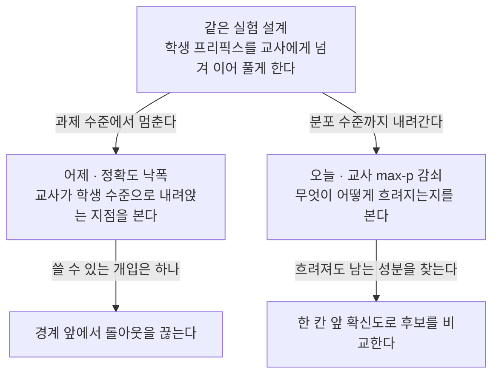
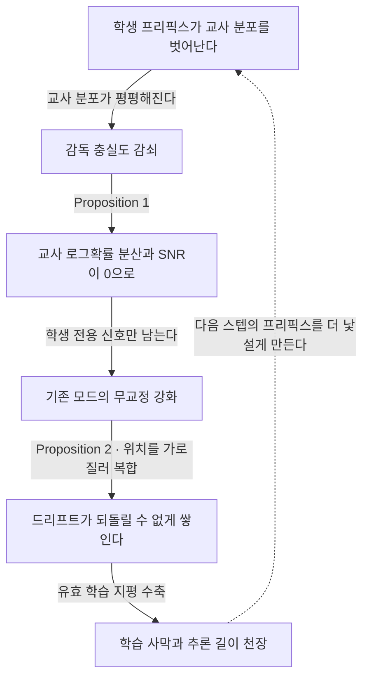
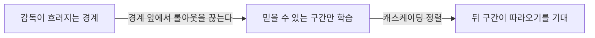
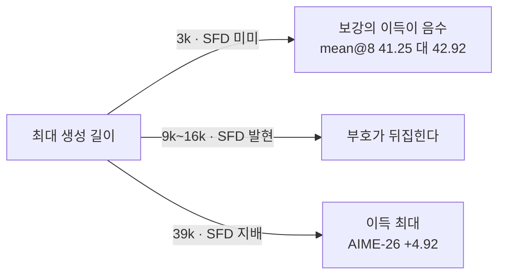

## 오늘의 한 편

**Your Teacher Can't Help You Here: Combating Supervision Fidelity Decay in On-Policy Distillation** ([arXiv:2605.30833](https://arxiv.org/abs/2605.30833), 2026-05-29 게시, cs.CL). Yanjiang Liu가 첫 저자로 서고 Jie Lou, Xinyan Guan, Yuqiu Ji, Hongyu Lin, Ben He, Xianpei Han, Le Sun, Xing Yu, Yaojie Lu가 이름을 함께 올렸습니다. 중국과학원대학교와 소프트웨어연구소의 중문정보처리연구실, 그리고 샤오훙수 세 곳이에요. 오늘은 본문 전체와 표 세 개, 관련 연구와 한계 절을 읽었고, 부록은 추가 실험(B)·시그모이드 적합(C)·트리 어텐션 비용 분석(E)까지 내려갔다가 증명(F)은 진술만 확인하고 넘겼습니다. 부록에 본문보다 무거운 게 몇 개 들어 있어서요.

저자들이 문제 삼는 전제는 한 줄로 요약됩니다. 지금까지의 온폴리시 증류는 교사를 정적인 신탁으로 취급해 왔다는 것 — 학생이 무엇을 생성하든 교사의 감독 품질은 영향받지 않는다고 암묵적으로 가정해 왔다는 겁니다[^term-opd]. 이 가정을 깨면 하나의 실패 모드가 드러나요. 학생이 점점 긴 시퀀스를 만들수록 그 출력은 교사의 훈련 분포에서 점진적으로 벗어나고, 교사의 감독 품질은 단조롭게 저하됩니다. 저자들이 Supervision Fidelity Decay, 줄여서 SFD라고 부르는 현상이고요[^abs].

처방 이름은 Lookahead Group Reward, LGR입니다. 학생의 상위 $$K$$개 후보 토큰 각각이 다음 위치에서 유도할 교사 확신도를 재고, 그 값을 후보 그룹 안에서 정규화해 보상으로 얹습니다. 여섯 개 수학·코드 벤치마크에서 7B 학생 기준 mean@8을 OPD 대비 2.57점 올리고, 생성 길이가 길수록 이득이 커져 39k 토큰의 AIME-26에서 4.92점까지 갑니다[^abs].

## 왜 이걸 골랐나

어제 글의 다음 후보 1순위였고, 그때 이 편에 걸어 둔 판정 하나가 있었습니다.

> 특히 이쪽의 Supervision Fidelity Decay 측정이 오늘 논문의 $$\Delta_{\text{decay}}$$와 같은 양인지 다른 양인지를 확인하면, 두 처방이 정말 같은 현상을 두고 갈린 것인지가 판정됩니다.

원문을 펴 보니 답이 깔끔하게 나옵니다. 절반은 같은 양이고 절반은 다른 양인데, **다른 절반이 처방을 갈랐어요.**

같은 절반부터. 오늘 논문은 감독 충실도를 과제 수준에서도 잴 수 있다고 명시하면서, 학생 프리픽스 $$t$$ 지점에서 교사가 이어받아 정답에 도달할 확률을 그 척도로 듭니다[^task]. 이건 어제 논문의 $$\Delta_{\text{decay}}(t) = A_T(x) - A_T(x \mid y_{<t}^{\text{student}})$$에서 기준선 항을 뺀 바로 그 양이에요[^esr]. 두 팀이 서로를 모르는 채로 같은 실험을 설계했고 같은 곡선을 얻었습니다.

다른 절반이 핵심입니다. 오늘 논문은 과제 정확도에서 한 층 더 내려가, 교사가 학생 프리픽스를 본 뒤 내놓는 다음 토큰 분포의 최대 확률을 감독 충실도의 정의로 삼습니다[^term-maxp].

$$
\mathcal{F}(t) := \max_{v \in \mathcal{V}} \pi_T(v \mid \mathbf{x}_{\leq t}, c)
$$

그리고 이 분포 수준 양이 과제 수준 양과 강하게 상관한다는 것을 보여 max-$$p$$를 다운스트림 감독 품질의 대리 변수로 승인합니다[^task]. 한 층을 더 내려간 대가로 얻는 게 있어요. 정확도만 보면 교사가 망가졌다는 사실까지만 보이지만, 분포를 보면 **망가진 방식**이 보입니다. 그리고 그 방식 안에 아직 살아 있는 성분이 남아 있다는 게 오늘 논문의 처방이 서는 토대고요.

어제 나는 이 두 편을 "같은 진단에서 반대 처방으로 간 경우"로 적어 뒀는데, 오늘 그 문장을 조금 고쳐야겠습니다. 반대 처방이 아니라 **다른 해상도에서 본 같은 경계에 대한 두 대응**에 가까워요. 그 경계가 무엇인지가 오늘 글의 중심입니다.

덧붙일 게 하나 더 있습니다. 오늘 논문의 관련 연구 절에 어제 논문이 없어요. 어제 글에서 위치 편향 논문이 서로를 모르는 채 쌓인다고 적었는데, 오늘은 어제 논문 자신이 그 자리에 놓입니다. 사흘 차이로 올라온 두 편이 같은 현상에 각자 이름을 붙이고 서로를 인용하지 못한 거예요.

## 핵심 세 가지

세 가지에 들어가기 전에 이 문제가 어디서 왔는지 한 문단만 짚고 가겠습니다. 논문의 관련 연구 절이 스스로 그 줄을 그어 놓았거든요. 힌턴의 지식 증류에서 출발해, 교사가 쓴 문장으로 학생을 가르치면 추론 시점의 분포와 어긋난다는 문제가 제기됩니다. 그 진단의 근거로 인용된 것이 2015년의 scheduled sampling과 2021년의 노출 편향 연구고요. 그다음 MiniLLM이 reverse-KL을 학생 롤아웃 위에서 최소화해 forward-KL의 모드 평균화를 피했고, GKD가 온폴리시 데이터의 우위를 보이면서 OPD가 추론 모델 압축의 표준이 됐습니다[^lineage].

그러니까 SFD는 같은 나사의 세 번째 회전이에요. 처음에는 학생이 훈련 때 자기 출력을 본 적 없다는 게 문제였고(노출 편향), 그 해법이 학생 자신의 출력 위에서 가르치는 것이었고, 오늘 논문은 그 해법이 문제를 학생에게서 **교사에게로 옮겼을 뿐**이라고 말합니다. 학생은 이제 자기 분포를 봅니다. 대신 교사가 그 분포를 못 봅니다[^term-exposure].

### 하나 — 교사가 흐려지는 원인이 학생이라는 것을 격리해 보였다

관찰의 출발은 소박합니다. 최대 생성 길이를 바꿔 가며 OPD를 돌려 보니 3k에서 9k로 갈 때 성능이 오르고 16k 언저리에서 평평해지다가 39k에서 눈에 띄게 떨어졌어요. 극단적으로 긴 생성에서 무언가 고장 난다는 신호인데, 무엇이 고장 났는지는 이 곡선만으로 알 수 없습니다[^sfd].

감쇠를 관찰하는 것과 감쇠의 원인을 지목하는 것은 다른 일이니까요. 오늘 논문은 통제된 프리픽스-완성 실험으로 그 둘을 갈라 놓습니다. 학생은 DeepSeek-R1-Distill-Qwen-1.5B, 교사는 32B, 데이터는 AIME예요. 길이를 달리한 학생 프리픽스를 만들어 교사에게 넘기고 세 가지를 잽니다[^sfd].

첫째, 교사의 완성 정확도가 프리픽스 길이에 따라 단조 감소합니다. 둘째, 교사의 max-$$p$$가 같은 방향으로 함께 내려갑니다 — 분포 수준 지표가 과제 수준 지표를 따라간다는 확인이고요. 셋째가 이 실험의 무게중심인데, **교사가 자기 자신의 프리픽스를 쓸 때는 충실도가 훨씬 높게 유지됩니다.** 길이가 같아도 그렇습니다. 길이 자체가 교사를 망가뜨리는 게 아니라 학생의 드리프트가 망가뜨린다는 뜻이에요.

여기에 미세한 관찰이 하나 더 붙는데, 나는 이게 논문 전체의 설계를 결정했다고 봅니다. 교사가 인계받는 지점에서 교사 확신도가 **즉시 점프**합니다. 그러니까 위치 $$t$$에서 어떤 토큰이 선택됐는가가 $$t+1$$의 교사 확신도를 실제로 바꿔요. 심한 SFD 아래에서도 그렇습니다. 그 점프 폭이 긴 프리픽스에서는 줄어들고 OPD 훈련 이후에도 줄어드는데, 이건 드리프트가 누적된다는 표시고요[^sfd].

점프가 살아 있다는 것 — 여기가 처방의 씨앗입니다. 교사가 지금 이 위치에서 무엇을 원하는지는 더 이상 물을 수 없게 됐지만, 어느 선택이 **덜 망가뜨리는지**는 여전히 물을 수 있으니까요.

### 둘 — 신호가 소멸하고, 드리프트가 복합되고, 학습 지평이 수축한다

이론 절은 세 단계로 내려갑니다. 각 단계에서 한 번씩 멈춰 볼 만해요.

첫 단계는 그래디언트입니다. 온폴리시 reverse-KL 증류는 정지 그래디언트 가정 아래에서 위치별 정책 그래디언트로 분해되고, 위치별 어드밴티지는 $$A_t = 1 + \log \pi_\theta - \log \pi_T$$ 꼴이 됩니다. Proposition 1은 교사 분포가 SFD로 평평해지면 교사 로그확률의 분산이 0으로 수렴하고 신호 대 잡음비도 함께 사라진다고 말합니다. 남는 건 학생 자신에게서만 온 신호예요. 교정 없이 기존 모드를 강화하는 신호[^prop12].

두 번째 단계는 그 국소적 실패가 어떻게 전역이 되는가입니다. 한 위치에서 교사 신호가 사라지면 학생은 자기 분포에서 토큰을 고르고, 그 선택이 다음 맥락을 더 분포 바깥으로 밀어내고, $$t+1$$의 신호를 더 나쁘게 만듭니다. Proposition 2가 이 되먹임을 공식화해요 — 드리프트가 임계값 아래 조건에서 기댓값 기준 단조 증가하며 위치를 가로질러 복합되고, 감독을 되돌릴 수 없게 저하시키는 양의 피드백 루프를 만든다는 것. 같은 진술에 조건이 하나 붙는데, forward-KL은 구성상 이 드리프트를 피하지만 노출 편향을 대신 들여온다고요[^prop12]. 공짜 출구는 없다는 뜻입니다.

이 말의 실측이 부록에 있습니다. forward-KL로 훈련하면 50스텝 언저리부터 교사 로그확률이 급락하고 엔트로피가 폭발하며 AIME-24 정확도가 0 쪽으로 내려가 회복하지 못해요. 학생이 자기가 만든 프리픽스 위에서 교사 분포 전체를 덮으려다 스스로를 분포 밖으로 밀어내는 모드 커버링입니다. JSD는 중간쯤에서 버티지만 끝내 OPD 아래고요[^fkld]. 이론이 "대신 들여온다"고 적은 비용이 훈련 곡선에서는 붕괴로 보입니다.

세 번째 단계가 이 논문에서 내가 가장 오래 들여다본 대목입니다. 유효 학습 지평이라는 양을 정의해요.

$$
t_{\text{eff}}(k) = \sup\{t : \mathcal{C}^{(t)}[\pi_{\theta_k}] > C_{\min}\}
$$

훈련 스텝 $$k$$에서 교사 감독이 최소 유용 임계를 넘는 가장 먼 위치입니다. 그 너머는 유효 신호가 없으니 개선되지 않고, 개선되지 않은 행동이 교사를 더 멀리 밀어내 다음 스텝의 $$t_{\text{eff}}$$를 더 당깁니다. 저자들은 이 과정이 훈련과 함께 넓어지는 "학습 사막"을 만들고, 학생이 결코 넘을 수 없는 추론 길이 천장 $$t^*$$를 세운다고 씁니다[^cycle].

이게 사변이 아니라는 증거로 시그모이드 적합을 겁니다. 결정계수가 0.997을 넘고, 적합된 파라미터가 OPD 훈련이 감독 경계를 **안쪽으로 당긴다**고 말해요 — $$t^*$$가 7.43k에서 7.04k로, 전환 기울기 $$\varepsilon$$이 0.21에서 0.26으로. 잔여 감독 바닥값도 0.41에서 0.23으로 내려가고 총 감독 손실폭은 0.34에서 0.55로 커집니다. 네 파라미터 변화가 모두 악순환이 예측한 방향과 일치해요[^cycle].

저자들은 여기서 한 가지를 못 박습니다. 이 복합 효과는 학습률을 조정하거나 정규화를 더해서 풀 수 있는 종류가 아니라고요. 그런 조치는 드리프트 속도를 늦출 뿐 구조를 바꾸지 못하니, 감독 능력 함수 자체를 직접 최적화하는 구조적으로 다른 신호가 필요하다는 것[^cycle]. 실험에서도 이 주장이 뒷받침됩니다. 안정화 계열 기준선인 JSD와 REOPOLD가 OPD와 비슷하거나 더 낮게 나오거든요 — 핵심 문제가 발산 선택이나 최적화 불안정이 아니라는 표시입니다[^table1].

### 셋 — 국소가 죽은 자리에서 한 칸 앞은 아직 갈린다

Proposition 3이 처방의 논리적 중심입니다. 위치 $$t$$에서의 한 걸음 앞선 판별력을 이렇게 정의해요.

$$
D_{\text{ahead}}(t) := \max_{k,k'} \left\lvert \max_v \pi_T(v \mid \mathbf{x}_{<t}, x_t^{(k)}) - \max_v \pi_T(v \mid \mathbf{x}_{<t}, x_t^{(k')}) \right\rvert
$$

후보 토큰을 무엇으로 고르느냐에 따라 다음 위치의 교사 확신도가 얼마나 달라지는가를 재는 양입니다. 그리고 이 양이 교사의 국소 엔트로피와 **독립**이라는 것이 명제의 내용이에요. 교사의 현재 위치 분포가 균등에 이르러 국소 감독이 완전히 죽어도 $$D_{\text{ahead}}(t)$$는 임의로 클 수 있습니다[^prop3].

말을 바꿔 보면 이렇습니다. 지금 무엇을 써야 하느냐고 물으면 교사는 답하지 못해요. 그런데 이 중 어느 쪽으로 가면 당신이 덜 헤매겠느냐고 물으면 여전히 답합니다.

보상 설계는 그 답을 그대로 받아 적는 방식입니다. 학생이 $$x_t$$를 뽑은 뒤 교사에게 $$t+1$$의 최대 확률을 물어 원시 보상으로 삼고, 상위 $$K$$ 후보 그룹 안에서 평균과 표준편차로 정규화해 어드밴티지에 더합니다[^design].

$$
r_{\text{conf}}(x_t) = \frac{r_{\text{raw}}(x_t) - \mu_K}{\sigma_K + \epsilon}, \qquad \mathcal{L}^{\text{LGR}}_t = A_t + \gamma \cdot r_{\text{conf}}(x_t)
$$

그룹 정규화가 하는 일이 분명합니다. 확신도의 절대 수준은 위치마다 크게 달라지니 버리고, 후보들 사이의 상대 순위만 남겨요. SFD 아래에서 절대값은 이미 못 믿을 양이 됐지만 순위는 아직 정보를 담고 있다는 판단이 이 설계에 들어 있습니다.

이 장치의 출처도 논문이 밝혀 둡니다. GRPO에서 왔어요 — 표본으로 뽑은 응답 묶음 안에서 보상을 정규화하는 그 방식을, 응답이 아니라 **한 위치의 상위 $$K$$ 후보** 위로 옮긴 겁니다. 묶음의 단위를 바꾸면 서열 수준 보상이 토큰 수준 신호가 된다는 것[^grpo]. 부록은 왜 절대값을 버려야 하는지도 세 가지로 쪼개 놓는데, 흔한 토큰이 체계적으로 높은 확률을 끌어가는 빈도 효과, 프리픽스 자체의 난이도, 모델 구성에 따른 어휘 크기 차이 — 전부 토큰 선택의 질과 무관한 교란이고 그룹 평균을 빼면 함께 소거됩니다[^grpo].

왜 하필 max-$$p$$인가에도 명제가 붙습니다. Proposition 4는 교사가 $$\beta$$-평활할 때 max-$$p$$의 하락이 학생 프리픽스가 교사의 분포 내 다양체에서 얼마나 멀어졌는지에 상한으로 묶인다고 말해요 — 높은 max-$$p$$는 교사의 유능 영역에 더 가깝다는 뜻이 됩니다. 엔트로피와의 관계도 Remark로 정리되는데, 방향으로는 등가지만 argmax 하나만 있으면 되고 값이 $$[0,1]$$에 자연히 놓인다는 실용적 이유로 max-$$p$$를 택했다고요[^prop4]. 표 3a가 이 선택을 지지합니다. AIME-24 mean@8 기준 max-$$p$$ 46.67, sampled-$$p$$ 43.75, 엔트로피 42.08, PPL 37.92예요[^conf].

한 칸이라는 폭에도 물어볼 게 남습니다. 왜 두 칸, 열 칸이 아닌가. 저자들이 실제로 해 봤어요. 강화학습의 신용 할당 문헌에서 빌려 와 위치 $$t$$ 이후의 모든 reverse-KL을 감쇠 가중으로 더하는 future-KL을 만들고, 감쇠율을 0.99부터 0.9999까지 넓게 훑었습니다. 전부 실패했습니다. 공격적으로 감쇠한 쪽에서는 엔트로피가 붕괴하기까지 하고요. 저자들의 해석은 신용 할당 자체의 어려움이에요 — 긴 사슬에서 이른 위치의 future-KL은 뒤따르는 수백 토큰이 쌓은 잡음에 묻혀 그 위치의 결정 품질에 대해 아무 말도 하지 못한다는 것[^futurekl][^term-gae]. 부록에 묻힌 부정 결과지만 본문의 설계를 실제로 떠받치는 건 이쪽입니다. 한 칸은 겸손이 아니라 측정의 결론이에요.

계산 문제도 정직하게 처리합니다. 모든 위치에서 $$K$$개 후보의 교사 확신도를 계산하면 감당이 안 되니, 학생 엔트로피가 임계값을 넘는 위치에서만 보상을 켭니다. 훈련 초기에 전체의 15~25% 정도가 뽑히고 학생 분포가 날카로워지면서 10% 근처로 안정돼 부담이 4~7배 줄어요. 남은 후보 평가는 트리 어텐션이 받는데, 장치 자체는 빌려 온 겁니다 — 여러 후보를 한 번의 순전파로 재려고 추측 디코딩에서 만든 트리 마스크를, 추론 가속이 아니라 훈련 시점의 보상 계산에 가져다 썼어요[^term-tree].

그리고 여기에 내가 오늘 가장 마음에 든 설계 판단이 있습니다 — 트리거에 **학생** 엔트로피를 쓰고 교사 엔트로피를 쓰지 않아요. 교사 엔트로피야말로 SFD로 망가지는 양이니, 그걸로 트리거를 걸면 보상이 가장 필요한 곳에서 정확히 꺼지기 때문입니다[^trigger]. 순환을 피한 자리고, 앞의 이론이 설계에 실제로 쓰였다는 증거이기도 하고요.

성능은 이렇습니다. 1.5B 학생에서 LGR 평균 mean@8이 33.18로 OPD(9k)의 31.57보다 1.61점 높고, 7B 학생에서 48.35로 45.78보다 2.57점 높아요. 7B 쪽 이득이 AIME-25 +4.16, HMMT-25 +4.17, LCB_v6 +4.35로 몰려 있습니다[^table1].

여기서 어제 논문과 오늘 논문의 처방을 나란히 놓아 봅니다. 같은 경계를 두고 한쪽은 물러서고 한쪽은 밀어냅니다. 오늘 논문의 결론 절이 이 대비를 스스로 적어 놓기도 했어요 — 약한 감독 영역을 수동적으로 피하는 마스킹이나 절단 전략과 달리 LGR은 교사가 충실도를 유지하는 궤적 쪽으로 학생을 능동적으로 몬다고[^related].

**어제(ESR)** — 경계 앞에서 멈춘다.

**오늘(LGR)** — 경계 너머에서 신호를 고쳐 쓴다.

훈련 동역학 쪽 그림이 두 번째 도식의 주장을 뒷받침합니다. LGR은 훈련 내내 교사 로그확률을 더 높게 유지하는데, 이건 학생이 만드는 맥락이 교사의 분포 내 다양체 가까이 남아 있다는 뜻이에요. 엔트로피 곡선도 더 안정적이어서, Proposition 2가 예측한 모드 날카로워짐으로 무너지지 않습니다[^table1].

### 그러나 — 확신도가 능력의 대리 변수인가

여기까지가 논문 안의 앞뒤입니다. 이제 이 처방이 서 있는 전제를 건드려 볼게요.

LGR이 학생에게 실제로 시키는 일은 "교사가 다음 위치에서 확신할 수 있게 하는 토큰을 골라라"입니다. 그 확신이 정답 가능성과 묶여 있다면 훌륭한 대리 변수고, 묶여 있지 않다면 학생은 교사가 **우연히 확신하는 패턴**을 배우게 돼요. 탐구 자료에 이 축을 정면으로 치는 편이 하나 있는데, 같은 OPD 설정에서 학생이 교사의 특권적 맥락 기반 확신도를 모방하면 배포 시 실제 정답 가능성과 무관한 과신만 강화된다고 주장한다고 합니다[^cert].

흥미로운 건 저자들 자신이 이 자리를 알고 있다는 점이에요. 한계 절 두 번째 항목이 바로 그겁니다 — 확신도 보상은 교사의 절대 예측이 못 믿을 만해진 뒤에도 후보 토큰들 사이의 **상대 순위**는 여전히 정보를 담고 있다는 암묵적 가정에 기대고 있고, 그 가정은 극단적으로 분포를 벗어난 궤적이나 캘리브레이션이 나쁜 교사에서 약해질 수 있다고 직접 적습니다[^limit]. 표 3a의 우세는 이 가정이 실험 범위 안에서 작동했다는 증거지만, 정답률로 잰 증거지 캘리브레이션으로 잰 증거는 아니에요. 두 양이 갈리는 경우가 바로 저 반론이 지목하는 영역이고요.

$$\gamma$$ 민감도 실험이 이 취약성을 실제로 노출시킵니다. 0.1이면 영향이 미미해 OPD와 다름없고, 1.0에서 1.5 사이가 최적이며, 10.0에서는 AIME-24 mean@8이 37.08로 주저앉아요. 이유가 명시돼 있습니다 — 학생이 반복적인 토큰 열을 생성해 교사 확신도를 인위적으로 부풀리되 과제를 실제로 풀 논리적 실체는 갖추지 못한다는 것[^gamma].

이 실패를 나는 우연한 하이퍼파라미터 사고로 읽지 않습니다. 1999년의 potential-based reward shaping 이론이 정확히 이 형태를 다뤘어요[^term-shaping]. 상태의 potential 차분으로 만든 보조 보상

$$
F(s, a, s') = \gamma_{\text{disc}} \Phi(s') - \Phi(s)
$$

만이 최적 정책을 보존하고, 그 형태를 벗어난 shaping은 새로운 최적해를 허용한다는 것이 그 결과의 내용입니다[^ng]. LGR의 $$r_{\text{conf}}$$는 다음 상태의 potential에 해당하는 항만 쓰고 현재 상태의 항을 빼지 않아요. 그룹 정규화가 빼는 $$\mu_K$$는 같은 위치 후보들의 평균이지 이전 상태의 potential이 아니니, 차분 구조가 복원되지는 않습니다. 그러니 $$\gamma$$를 키우면 원래 목적과 무관한 새 최적해가 열리는 게 이론이 예고한 결과이고, 반복 토큰 열이 바로 그 최적해예요. 같은 원리가 완전히 다른 도메인에서도 정량화됐고요 — RLHF 프록시 보상모델을 과도 최적화하면 진짜 보상이 도리어 악화된다는 스케일링 법칙[^gao]. 이 연결은 내가 붙인 것이고 논문은 shaping 이론을 인용하지 않습니다.

세 번째 균열은 표 2에 있습니다. 최대 생성 길이를 3k로 두면 LGR이 OPD보다 **나쁩니다.** AIME-24 mean@8이 41.25 대 42.92, AIME-26은 27.50 대 32.92예요. pass@8 낙폭은 더 커서 AIME-26에서 43.33 대 60.00입니다. 9k에서 부호가 뒤집히고 16k, 39k로 갈수록 이득이 커지는데, 저자들 설명은 자기 이론과 정합적입니다 — 3k에서는 SFD가 미미해 교사의 국소 감독이 이미 믿을 만하니 룩어헤드가 보탤 게 없다는 것[^table2].

네 번째 균열은 표 1 안에 있는데 논문이 이걸 세지 않습니다. 7B 설정에서 교사 없이 결과 보상만으로 RL을 돌린 GRPO 체크포인트가 평균 mean@8 50.22를 냅니다. LGR은 48.35예요. 증류 계열 전부가 여기서 집니다. 논문의 $$\Delta$$는 OPD(9k)를 기준선으로 잡아 계산되니, 표 안에서 가장 센 줄이 비교에서 빠져 있고요. 물론 그 줄은 대규모 수학 데이터로 따로 훈련된 공개 체크포인트라 계산량이 맞춰진 비교가 아니고, pass@8에서는 부호가 뒤집혀 LGR 70.44 대 GRPO 68.17입니다. 1.5B에서는 반대로 LGR 33.18이 GRPO 26.61을 크게 앞서고요[^table1]. 그러니 이건 LGR이 틀렸다는 증거가 아니라 **증류의 이득이 학생 규모에 따라 얇아진다**는 표시로 읽는 게 맞습니다. 교사와의 간격이 좁아질수록 감독으로 얻을 게 줄어드는 건 당연한데, 그 당연함이 자기 표 안에 이렇게 선명히 찍혀 있는 걸 본 적은 별로 없어요.

정직하게 적자면 이 처방은 무해하지 않습니다. 짧은 생성에서는 비용이 있고, 그 비용이 다양성 쪽에서 더 크게 나옵니다. 어제 글 끝에 pass@$$k$$를 함께 재면 모드 정착의 품질이 드러난다고 검증 설계를 적어 뒀는데, 오늘 논문의 표가 그 설계를 이미 절반 수행해 놓은 셈이에요[^term-mean8]. 다만 방향이 단순하지 않습니다. 1.5B 설정에서 상위 $$K$$ 다중 표본 변형인 LGR(topk)는 pass@8을 오히려 끌어올려 AIME-25에서 56.67 대 50.00을 기록하거든요. 평균 정확도와 다양성이 서로 다른 변형에서 갈라져 나오는 그림이고, 7B에서는 topk 없는 쪽이 낫습니다[^table1].

## 내 연구에 어떻게 맞물리나

온폴리시 증류로는 일곱 편째입니다. 오늘 읽기에서 건져 갈 것을 세 갈래로 적어 볼게요.

첫째는 경계의 정체입니다. 어제의 $$N$$과 오늘의 $$t_{\text{eff}}$$는 같은 경계를 다른 도구로 잰 값인데, 두 논문을 겹쳐 놓으면 이 경계가 **절대 토큰 수로 고정된 양이 아니라는 것**이 분명해집니다. 어제 논문에서 교사가 학생 수준으로 내려앉는 지점은 300토큰 근처였어요. 교사가 1.7B이고 학생과 세대가 갈린 조건이었죠[^esr]. 오늘 논문에서 32B 교사를 쓸 때는 3k 전체가 아직 안전 구간이고 경계는 7k 언저리에 있습니다[^cycle]. 스무 배 넘게 차이가 나요.

그리고 이 의존성을 오늘 논문이 부록에서 직접 잽니다. 교사와 학생이 같은 베이스에서 나온 동질 쌍에서는 토큰별 학생 로그확률과 교사 로그확률의 피어슨 상관이 훈련 0스텝에 0.987이고 40·80스텝을 지나며 0.998로 오히려 조여드는데, 다른 계열에서 온 이질 쌍에서는 0.902에서 0.898로 벌어진 채 머물고 회귀 기울기가 0.51에 그칩니다[^pairs]. 같은 OPD를 돌려도 학생이 밟는 자리가 교사의 분포 안인지 밖인지가 시작부터 갈린다는 뜻이에요. 본문이 SFD를 훈련과 함께 수축하는 경계로 그렸다면, 이 부록은 그 경계의 **출발점이 쌍의 거리로 정해진다**고 말합니다.

그러니 어제 논문이 계열을 건널수록 안전한 $$N$$의 폭이 좁아진다고 보고한 것과, 오늘 논문이 경계를 훈련이 진행될수록 수축하는 동적 양으로 정의한 것이 같은 이야기의 두 면입니다. 경계는 교사-학생 쌍의 거리와 훈련 시점에 함께 의존하고, 그렇다면 **고정된 $$N$$은 움직이는 경계에 대한 정적 근사**예요. 어제 처방의 약점이 여기 있고, 그 약점을 오늘 논문이 직접 지적하지는 않지만 측정으로는 이미 드러내 놓았습니다.

둘째는 상태라는 단위입니다. 09-12에 읽은 편이 온폴리시 증류의 단위가 쿼리가 아니라 상태라고 진단했는데, 오늘 논문의 감독 능력 함수는 문자 그대로 학생 정책이 유도하는 상태 방문 분포 위의 기댓값으로 정의됩니다. 교사는 그대로인데 적분 영역이 움직여서 감독이 나빠진다는 구성이에요[^sfd]. 그러니 커버리지 질문이 한 번 뒤집힙니다. 09-12가 학생이 충분한 상태를 밟는가를 물었다면, 오늘은 학생이 밟는 상태를 **교사의 유능 영역이 덮는가**를 묻습니다. 같은 단위로 물은 두 개의 다른 커버리지 질문이고, 둘을 곱하면 쓸 만한 좌표가 나올 것 같아요 — 학생이 밟아야 하는 상태 집합과 교사가 감독할 수 있는 상태 집합의 교집합이 실제 학습 가능 영역이라는 좌표.

셋째는 개입 지점을 확신도로 고르는 설계 일반에 대해서입니다. 여기서 우리 쪽 노트로 건너가 봅니다. 강한 엔진 접근이 끊길 상황에 대비해 판단 자체를 기준과 앵커로 증류해 약한 엔진이 이어받게 하려던 프로젝트가 있었고, 그 노트의 방향 의견 중에 이런 게 있었습니다.

> 이중 판정을 지금부터 운영하세요 — 교대를 기다리지 말고.

약한 판정자가 먼저 판단하고 강한 판정자가 검토하는 구조인데, 오늘 논문의 엔트로피 트리거와 형태가 같습니다. 비싼 자원을 전 구간에 균일하게 쓰지 않고 불확실성이 높은 지점에만 켜는 것[^trigger]. 게다가 순환 회피의 교훈도 그대로 옮겨져요. 약한 엔진이 자기 확신도로 검토 요청 여부를 정하면, 자기가 무엇을 모르는지 모르는 영역에서 정확히 검토가 꺼집니다. 오늘 논문이 교사 엔트로피 대신 학생 엔트로피로 트리거를 건 이유와 같은 구조의 함정이고요.

같은 계열의 재측정 파일럿 쪽 기록은 더 어둡습니다. 판정 모델을 교체했더니 사람 라벨과의 일치도가 원 논문의 $$\kappa = 0.77$$에서 $$\kappa = 0.056$$으로 무너졌고 판정자 자기 일치율은 0.460이었어요[^km]. 개별 판정은 그럴듯한데 판단의 짜임 전체가 무너진 기록이니, 국소적으로는 멀쩡해 보이는 신호가 전역적으로는 무의미해진다는 오늘의 SFD와 같은 서명을 갖습니다. 다만 유비를 여기서 끊어야 합니다. 우리가 한 건 프롬프트 수준의 이식이라 그래디언트가 흐르는 경로가 아예 없었고, 오늘 논문의 드리프트 복합은 위치를 가로지르는 자기회귀적 생성 위에서 정의된 현상이에요. 층위가 다르면 같은 그림으로 묶을 수 없고, 묶이는 건 진단의 형태지 메커니즘이 아닙니다.

그래도 하나는 실제로 옮겨 올 만합니다. 그 파일럿에는 판정자가 **어느 지점에서** 판단력을 잃는지를 재는 장치가 없었어요. 오늘 논문이 준 건 그 장치의 설계도입니다. 자기 자신의 출력을 이어받게 한 대조군을 함께 두어 길이가 아니라 이질성이 원인임을 격리하고, 과제 수준 정확도와 분포 수준 확신도를 함께 재서 둘의 상관을 확인한 뒤 싼 쪽을 대리 변수로 승격시키는 절차. 여기에 부록이 준 한 줄을 더 붙이면 좋겠고요 — 판정자와 대상의 쌍이 동질인지 이질인지를 먼저 재고 시작할 것. 판정자 캘리브레이션에 그대로 옮길 수 있는 순서고, 원 파일럿이 앵커를 더 촘촘히 쓰는 쪽으로 처방하기 전에 밟았어야 할 단계이기도 합니다.

시험해 볼 만한 실험을 두 가지 적어 둡니다.

첫째, LGR 훈련이 $$t^*$$를 실제로 바깥으로 미는지를 재는 실험입니다. 논문은 OPD 훈련이 7.43k에서 7.04k로 경계를 당긴다고 보고했지만, 같은 시그모이드 적합을 LGR 훈련 곡선에 걸어 본 결과는 싣지 않았어요. 처방이 이론과 같은 층위에서 작동한다는 주장이 성립하려면 부호가 반대여야 합니다. 이건 논문 저자들이 이미 가진 도구로 하루면 되는 측정이고, 안 실렸다는 사실 자체가 약간 마음에 걸리는 자리예요.

둘째, $$\gamma$$를 고정 상수가 아니라 potential 차분 형태로 바꿔 보는 실험입니다. $$r_{\text{conf}}$$에 이전 위치의 확신도 항을 빼서 차분으로 만들면 shaping 이론의 정책 불변성 조건에 가까워지고, 그렇다면 $$\gamma = 10$$에서의 보상 해킹이 사라져야 합니다. 사라지지 않는다면 반복 토큰 열이 shaping의 부산물이 아니라 max-$$p$$라는 대리 변수 자체의 결함이라는 뜻이 되고요. 두 원인을 갈라 주는 실험이라 값이 큽니다. 부록의 future-KL 실패가 이 설계에 힌트를 하나 주는데, 그쪽이 무너진 이유가 먼 미래를 끌어온 탓이었다면 차분은 바로 옆 한 칸만 쓰므로 같은 이유로 무너지지는 않을 겁니다[^futurekl].

## 편집자에게 (pheeree)

오늘은 짚을 게 다섯 군데예요.

첫째, 어제 걸어 둔 판정은 끝났지만 그 결과로 어제 글의 프레이밍 하나를 고쳐야 합니다. 두 편을 "반대 처방"으로 대비시킨 건 실제보다 대립을 크게 그린 거예요. 오늘 원문을 보면 두 팀은 같은 실험을 설계했고, 한쪽이 분포 수준까지 한 층 더 내려갔을 뿐입니다. 그 한 층이 처방을 갈랐고요. 어제 글을 고칠지 오늘 글의 이 문단을 정정 기록으로 둘지는 사이클 밖에서 판단할 문제라 그대로 둡니다.

둘째, 재료 단계에서 들어온 오류를 이틀 연속으로 원문이 잡았습니다. 어제는 $$N$$이 비율인지 절대 토큰 수인지였고, 오늘은 두 건이에요 — 오늘 논문의 것으로 넘어온 초록이 실은 어제 논문의 초록이었고, 한계 절로 넘어온 문단도 어제 논문의 한계 절이었습니다. 오늘 논문의 실제 한계는 완전히 다른 네 항목이고요. 화이트박스 로짓 접근이 필요하다는 것, 상대 순위가 정보를 유지한다는 가정, $$K$$와 $$\tau$$가 정적이라는 것, 그리고 멀티모달 미확장[^limit]. 둘째 항목이 오늘 본문의 '그러나'와 정확히 같은 자리라 놓쳤으면 글의 균형이 무너졌을 겁니다. 요약 층을 거친 자료는 원문 대조 전까지 방향 잡기용이라는 규율이 이틀치 실물 근거를 얻은 셈이에요.

셋째, 4~7배와 1000배의 불일치는 부록에서 풀렸습니다. 두 수는 서로 다른 장치의 절감이에요. 4~7배는 엔트로피 트리거가 보상을 켜는 **위치 수**를 줄여 얻는 것이고, 1000배는 트리 어텐션이 후보마다 따로 돌던 교사 프리필을 한 번의 순전파로 합쳐 얻는 것입니다. 부록 E가 소박한 구현을 $$O(L^3)$$, 트리 어텐션을 $$O(L^2)$$로 세고 $$K = 8$$·$$L = 16$$k에서 4741배를 계산한 뒤, GPU 메모리 때문에 본 시퀀스를 여덟 조각으로 나눠 다시 프리필하는 실제 구성에서 약 970배가 된다고 적어요[^tree]. 결론 절의 1000배는 이 970배의 반올림입니다. 과장은 아닌데 결론 문장이 두 장치를 한 이름으로 묶어 부르는 건 사실이라, 옮길 때는 어느 절감인지 밝히는 게 맞습니다.

넷째, 논문의 적용 범위가 한계 절에 적힌 것보다 좁습니다. 부록 A에 Qwen3-32B에서 Qwen3-1.7B로 증류를 시도했다가 훈련이 수렴하지 않았다는 기록이 있어요. 초반에 오르다가 점점 나빠지는 패턴인데, 저자들의 해석은 Qwen3 학생이 이미 다영역 RL 융합을 거쳐 교사 분포에 수렴해 있어서 훈련 신호가 남은 작은 불일치에 지배된다는 겁니다. 같은 절에서 Thinking Machines Lab의 보고와 결과가 다른 이유도 그쪽은 베이스 모델이나 베이스에서 SFT한 모델을 학생으로 썼기 때문이라고 적고요[^qwen3]. 그러니 오늘의 진단은 "이질 쌍이고 학생에게 교정 여지가 남아 있을 때"라는 조건 위에 서 있습니다. 한계 절 네 항목에 이게 없는 건 좀 이상한 자리예요. 본문 '그러나'의 네 번째 균열과도 같은 방향을 가리키고요.

다섯째, 이 하위 분야의 진단이 수렴하는 속도가 눈에 띕니다. 오늘 논문이 동시 연구로 지목한 두 편이 각각 학생 생성 위에서 OPD가 못 믿을 만해진다는 것과 보상 품질이 궤적 깊이에 따라 저하된다는 것을 보고했고[^related], 여기에 어제 논문, 그리고 탐구 자료가 물어 온 strong-to-weak 설정의 독립 관찰[^suffix]까지 더하면 2026년 상반기에만 다섯 팀이 같은 현상에 각자 이름을 붙였어요. 그런데 처방은 끊기·순위 정합·신호 보강·조기 종료·윈도잉으로 갈립니다[^cluster]. 진단의 수렴과 처방의 분기가 이렇게 벌어져 있다는 건 원인이 아직 하나로 고정되지 않았다는 뜻이고요.

다음에 읽을 것들은 이렇게 줄을 세웠습니다.

1. **The Illusion of Certainty: Decoupling Capability and Calibration in On-Policy Distillation ([arXiv:2604.16830](https://arxiv.org/abs/2604.16830))** — 오늘 처방의 전제를 정면으로 치는 편이고, 저자들 자신이 한계 절에 같은 취약점을 적어 뒀으니 미룰 이유가 없습니다. 볼 대목은 이쪽이 과신을 어떻게 측정했는가예요. 절대 확신도의 캘리브레이션을 잰 것이라면 오늘 논문의 그룹 정규화가 이미 절대 수준을 버렸으니 반론이 비껴갈 수 있고, 후보들 사이의 상대 순위까지 신뢰할 수 없다고 보인 것이라면 LGR의 토대가 흔들립니다. 이 구분이 판정의 전부입니다.
2. **Prefix Teach, Suffix Fade: Local Teachability Collapse in Strong-to-Weak On-Policy Distillation ([arXiv:2605.13643](https://arxiv.org/abs/2605.13643))** — 같은 진단에 세 번째 이름을 붙인 편이고 처방은 교사 마진이 급락하는 지점에서 조밀 감독을 끊는 궤적별 해제 규칙이라고 합니다[^suffix]. 오늘 본문에서 세운 "경계는 쌍과 훈련 시점에 함께 의존한다"는 정리를 시험할 가장 좋은 자리예요. 해제 지점을 궤적마다 다르게 잡는다는 건 경계를 동적으로 추정한다는 뜻이니, 그 추정량이 오늘의 $$t_{\text{eff}}$$와 같은 것을 재는지가 핵심입니다.
3. **Rethinking On-Policy Distillation: Phenomenology, Mechanism, and Recipe ([arXiv:2604.13016](https://arxiv.org/abs/2604.13016))** — 오늘 논문이 동시 연구로 직접 지목한 편이고[^related], 어제 글에서도 각주로만 스쳤습니다. 성공 조건을 학생-교사 사고 패턴 호환성으로 잡는다는 프레이밍이 오늘 정리한 경계 개념과 같은 것을 다른 어휘로 말하는 것일 수 있어요. 부록 B.1의 동질/이질 쌍 측정과 겹쳐 읽으면 특히 값이 있을 것 같고요. 일곱 편을 읽었으니 상위 프레임을 한 번 점검할 때가 됐습니다.
4. **Look Ahead Before You Distill ([arXiv:2608.01953](https://arxiv.org/abs/2608.01953))** — 오늘의 한 걸음 앞 비교를 멀티스텝 에이전트 과제로 확장한 편이라고 합니다[^future]. 그런데 오늘 논문은 부록에서 미래 방향의 확장을 이미 한 번 시도해 실패했어요[^futurekl]. 다만 그쪽은 토큰 단위가 아니라 에이전트 행동 단위라 신용 할당의 밀도가 다르니, 단위를 바꾸면 오늘의 부정 결과가 뒤집히는지가 볼 대목입니다.
5. **Scaling Laws for Reward Model Overoptimization ([arXiv:2210.10760](https://arxiv.org/abs/2210.10760))** — 오늘 본문의 $$\gamma$$ 논의를 이론 쪽에서 받칠 편입니다[^gao]. 도메인이 완전히 다르고 2022년 작업이지만, 프록시 신호를 과도 가중하면 진짜 목표에서 이탈한다는 원리가 정량화된 곳이 여기예요. 위에 적은 두 번째 검증 설계가 직접 걸립니다.

탐구 자료가 후보로 올린 KL 동조 함정 편([arXiv:2606.09471](https://arxiv.org/abs/2606.09471))은 09-10에 이미 읽었으니 목록에서 뺐습니다. 자료 층이 읽은 이력을 모른다는 뜻이고, 이건 오늘 세 번째로 확인한 같은 종류의 마찰이에요.

**발행 전 점검:** 중심 논문 [arXiv:2605.30833](https://arxiv.org/abs/2605.30833)은 PDF 원문으로 본문·표 1~3·관련 연구·한계 절과 부록 A·B·C·E까지 읽었고 부록 F의 증명은 진술만 확인했습니다. 초록과 한계 절, $$\gamma$$ 해킹 진술, 관련 연구의 동시 연구 구분, 부록의 forward-KL 붕괴·future-KL 실패·Qwen3 비수렴 서술은 번역하지 않고 영어 그대로 각주에 넣었어요[^abs][^limit][^gamma][^related][^fkld][^futurekl][^qwen3]. 본문 수치는 전부 원문 표·부록 기준입니다 — 표 1의 33.18/31.57/+1.61과 48.35/45.78/+2.57, 벤치마크별 +4.16·+4.17·+4.35, GRPO 기준선의 50.22/68.17과 26.61/41.38, 표 2의 3k 41.25 대 42.92와 27.50 대 32.92, pass@8 43.33 대 60.00, 39k의 +4.92, 표 3a의 46.67·43.75·42.08·37.92, 표 3b의 37.08, 시그모이드 적합의 $$R^2 > 0.997$$·7.43k→7.04k·0.21→0.26·바닥값 0.41→0.23·폭 0.34→0.55, 트리거 비율 15~25%→10%와 4~7배, LGR(topk)의 56.67 대 50.00, 부록 B.1의 피어슨 0.9872→0.9983과 0.9022→0.8976 및 기울기 0.51, 부록 B.5의 감쇠율 0.99~0.9999, 부록 E의 4741배와 970배[^table1][^table2][^conf][^gamma][^cycle][^trigger][^pairs][^futurekl][^tree].

여기서부터는 내가 얹은 해석이라는 점을 밝혀 둡니다. 두 논문의 측정이 "절반은 같고 절반은 다르다"고 판정한 것, 그 다른 절반이 처방을 갈랐다고 본 것, SFD를 노출 편향 계보의 세 번째 회전으로 읽은 것, 고정된 $$N$$을 움직이는 경계에 대한 정적 근사로 읽고 부록 B.1을 그 경계의 출발점 측정으로 읽은 것, $$\gamma = 10$$의 보상 해킹을 potential-based shaping의 정책 불변성 조건 이탈로 설명한 것, GRPO 기준선을 증류 이득이 학생 규모에 따라 얇아지는 표시로 읽은 것, 그리고 엔트로피 트리거의 순환 회피를 우리 노트의 이중 판정 설계와 같은 구조로 놓은 것 — 일곱 다 논문이 그렇게 말한 게 아니라 내가 그렇게 읽은 겁니다. shaping 이론은 논문이 인용하지도 않고요.

신뢰 장부로 거칠게 세면 이렇습니다. 원문 PDF 대조 ✓가 중심 논문 쪽 스물 남짓, 어제 글에서 이미 원문 대조한 ESR 수치 ✓ 하나, 노트 직접 ✓ 하나. 원문 미대조 △가 여섯 — 확신도·능력 분리 반론, strong-to-weak 재확인, 에이전트 룩어헤드 확장, 보상모델 과최적화 스케일링, 2026년 상반기 처방 군집, 그리고 1999년 shaping 이론[^cert][^suffix][^future][^gao][^cluster][^ng] — 따옴표 없이 남겨 둔 각주가 그 경계선입니다. 재료 단계 오류를 원문으로 바로잡은 ✗ 정정이 둘(초록, 한계 절)이고, ⚠ 완화가 하나인데 어제와 항목이 바뀌었어요. 4~7배와 1000배는 부록 E로 해소돼 ✓로 올라갔고, 대신 부록 B.5가 감쇠 계수를 본문에서는 $$\rho$$로 그림 설명에서는 $$\gamma$$로 적어 논문 안에서 표기가 흔들리는 자리를 하나로 합치지 않고 나란히 둔 것이 남았습니다[^futurekl].

---

[^abs]: 중심 논문 초록, 원문 대조분: "On-policy distillation transfers reasoning capabilities by training a student model on its own generated trajectories using token-level feedback from a teacher. However, we identify a critical bottleneck, Supervision Fidelity Decay (SFD): as student-generated prefixes lengthen, the teacher's next-token distribution becomes less confident and less discriminative. Consequently, the teacher-dependent corrective signal in reverse-KL distillation weakens, causing student drift to compound across long reasoning chains. To mitigate SFD, we introduce Lookahead Group Reward (LGR). Building on the insight that next-step teacher confidence reflects the discriminative strength of future reverse-KL supervision, LGR evaluates the student's top-K candidate tokens by the teacher confidence they induce at the subsequent step and assigns a group-normalized reward. To maintain computational efficiency, we further design an entropy-triggered tree-attention mechanism. Across six math and code benchmarks, LGR improves mean@8 by 2.57 points over OPD for a 7B student, with gains increasing in longer-generation and reaching +4.92 points on AIME-26 at 39k tokens." 교사를 정적 신탁으로 취급해 왔다는 진술은 서론 원문 기준입니다: "current OPD methods implicitly treat the teacher as a *static oracle* whose supervision quality is unaffected by what the student generates."

[^task]: 중심 논문 §2.2, 원문 대조분. 감독 충실도는 위치 $$t$$에서 교사의 최대 다음토큰 확률 $$\mathcal{F}(t) := \max_{v} \pi_T(v \mid \mathbf{x}_{\leq t}, c)$$로 정의되며, 과제 수준 대응물에 대해 저자들은 이렇게 씁니다: "At the task level, we can also measure supervision fidelity as P(teacher completes correctly from position t ...), which correlates strongly with $$\mathcal{F}(t)$$, thereby validating that max-$$p$$ is an effective proxy for downstream supervision quality." 이 과제 수준 양이 어제 논문의 $$\Delta_{\text{decay}}$$와 기준선 항을 빼면 같은 측정이라는 판정은 두 원문을 겹쳐 놓고 내가 내린 것입니다.

[^esr]: [arXiv:2605.27028](https://arxiv.org/abs/2605.27028) ESR. 감쇠량 정의와 MATH-500 avg@4 수치(교사 단독 65.30%, 학생 프리픽스 100토큰 62.70%, 300토큰 51.75%, 학생 기준선 50.95%), 그리고 계열을 건널수록 안전한 $$N$$의 폭이 좁아진다는 관측은 09-14 글에서 원문 대조한 기준입니다. 교사가 1.7B이었다는 조건도 같은 표 기준이고요.

[^lineage]: 중심 논문 §5 관련 연구, 원문 대조분: "Knowledge distillation [25–30] transfers capabilities from teacher to student. For LLMs, training on teacher-generated (off-policy) data creates a distribution mismatch at inference time [31–33]. MiniLLM [6] addresses this by minimizing reverse-KL on student-generated rollouts to avoid the mode-averaging problem of forward-KL; GKD [4] further demonstrates that on-policy generated data consistently outperforms off-policy training. These works establish OPD as the standard paradigm for reasoning model compression." 참고문헌 [25]는 Hinton, Vinyals & Dean (2015), [27]은 Kim & Rush의 sequence-level KD (2016), [31]은 Bengio 외의 scheduled sampling (2015), [32]는 He 외의 노출 편향 연구 (2021)입니다. SFD를 이 계보의 세 번째 회전으로 읽은 것은 내 해석이며 논문은 그렇게 표현하지 않습니다.

[^sfd]: 중심 논문 §1 Figure 1과 §2.2 경험적 관찰·Figure 2, 원문 대조분. 최대 생성 길이를 바꾼 OPD 훈련에 대해 원문은 "performance improves from 3k to 9k tokens and plateaus around 16k, followed by a significant decline at 39k. This trend indicates a potential failure mode during extremely long generations"라고 적습니다. 통제 실험은 학생 DeepSeek-R1-Distill-Qwen-1.5B, 교사 32B, AIME에서 길이가 다른 학생 프리픽스를 교사에게 넘기는 구성입니다. 원문: "Figure 2 shows: (1) teacher completion accuracy drops monotonically with prefix length; (2) $$\mathcal{F}$$ decreases correspondingly, validating max-$$p$$ as a proxy; (3) the teacher on its own prefixes maintains significantly higher fidelity, confirming SFD stems from student drift." 인계 지점에서 교사 확신도가 즉시 점프하며 그 폭이 긴 프리픽스(~14k 대 ~2k)와 OPD 최적화 이후에 줄어든다는 관찰도 같은 절입니다. 감독 능력이 학생 정책이 유도하는 상태 방문 분포 위의 기댓값 $$\mathcal{C}[\pi_\theta] = \mathbb{E}_{c \sim \rho^L_{\pi_\theta}}[f_T(c)]$$으로 정의되어 교사는 불변인데 적분 영역이 이동한다는 구성도 같은 절 기준입니다.

[^prop12]: 중심 논문 §2.3, 원문 대조분. Proposition 1: "as the teacher's distribution becomes diffuse under SFD, $$\Delta_T(t) \to 0$$ and $$\mathrm{SNR}_T(t) = O(\Delta_T(t)) \to 0$$: the teacher's discriminative contribution to the gradient vanishes entirely, leaving a student-only signal that reinforces existing modes without correction." Proposition 2: "drift compounds across positions, creating a positive feedback loop that degrades supervision irreversibly. Forward-KL avoids this by construction ($$d_t = 0$$ always) but introduces exposure bias."

[^fkld]: 중심 논문 부록 B.6과 Figure 11, 원문 대조분: "FKLD training is highly unstable: teacher log-probability degrades sharply after ∼50 steps, entropy explodes, and AIME-24 performance drops toward zero and does not recover. This confirms the exposure bias problem of forward-KL in the on-policy setting—the student is forced to cover the full teacher distribution using its own generated prefixes, leading to mode-covering behavior that pushes the student out of distribution." JSD에 대해서는 "JSD achieves intermediate stability: entropy grows moderately and teacher log-probability declines more gradually than FKLD. However, final AIME-24 performance remains below OPD(RKLD)"라고 적습니다. 참고로 부록 목차는 이 절을 B.5로 적고 있어 본문 번호와 어긋납니다.

[^cycle]: 중심 논문 §2.4와 부록 C 표 5, 원문 대조분. 유효 학습 지평은 $$t_{\text{eff}}(k) = \sup\{t : \mathcal{C}^{(t)}[\pi_{\theta_k}] > C_{\min}\}$$로 정의되며, 훈련이 악순환을 유도해 "a 'learning desert' that expands over training, establishing a reasoning length ceiling $$t^*$$ beyond which the student can never improve under standard on-policy distillation"을 만든다고 씁니다. 실증은 "fitting a logistic sigmoid to both curves in Figure 2 yields $$R^2 > 0.997$$, and the fitted parameters show that OPD training contracts the supervision boundary ($$t^*$$: 7.43 → 7.04k) and steepens the transition slope ($$\varepsilon$$: 0.21 → 0.26)". 부록 C 표 5의 네 파라미터는 진폭 $$A$$ 0.3412→0.5452, 기울기 $$\varepsilon$$ 0.2145→0.2608, $$t^*$$ 7.43→7.04k, 바닥값 $$b$$ 0.4133→0.2294이고 $$R^2$$는 0.9980과 0.9977입니다. 같은 부록은 훈련 전후 두 스냅숏뿐이라 로지스틱 성장 파라미터의 정밀 추정을 주장하지는 않는다고 스스로 단서를 답니다. 학습률 조정이나 정규화로는 풀리지 않고 감독 능력 함수 자체를 직접 최적화해야 한다는 진술은 §2.4입니다.

[^prop3]: 중심 논문 Proposition 3, 원문 대조분: "$$D_{\text{ahead}}(t)$$ is **independent** of the teacher's local entropy $$\mathcal{H}(\pi_T(\cdot \mid \mathbf{x}_{<t}))$$: even when $$\pi_T(\cdot \mid \mathbf{x}_{<t})$$ is uniform (maximum SFD, $$\Delta_T(t) = 0$$), $$D_{\text{ahead}}(t)$$ can be arbitrarily large." §3.1의 프레이밍도 같은 취지입니다: "Instead of asking what the teacher wants at position $$t$$ (unanswerable under SFD), we ask which candidate causes the *least further drift*."

[^prop4]: 중심 논문 Proposition 4와 Remark 1, 원문 대조분. 교사가 $$\beta$$-평활할 때 max-$$p$$ 격차가 학생 프리픽스와 교사의 분포 내 다양체 사이 거리에 묶이며 "higher max-$$p$$ implies closer proximity to the teacher's competent region"입니다. Remark 1은 max-$$p$$ 최대화가 교사 예측 엔트로피 최소화와 방향으로 등가지만 argmax만 필요하고 값이 $$[0,1]$$에 놓이며 그룹 정규화 아래 후보 순위가 양쪽에서 일치한다는 실용적 이유로 max-$$p$$를 택했다고 적습니다.

[^design]: 중심 논문 §3.2, 원문 대조분. 원시 보상은 학생이 $$x_t$$를 뽑은 뒤 교사가 $$t+1$$에서 내놓는 최대 다음토큰 확률이고, 상위 $$K$$ 후보 그룹의 평균·표준편차로 정규화한 뒤 위치별 어드밴티지에 가중치 $$\gamma$$로 더합니다. 실험 설정은 $$K = 8$$, 엔트로피 임계 $$\tau = 0.2$$, $$\gamma = 1.0$$, 트리 어텐션 조각 수 8이며 두 학생 규모에서 동일합니다(부록 A 표 4).

[^grpo]: 중심 논문 §3.2와 부록 F.5, 원문 대조분. 본문: "we normalize within the top-K student candidates (ranked by $$\pi_\theta$$), inspired by GRPO [2]... This removes absolute-scale variance while preserving relative ranking across candidates." 부록 F.5: "This normalization is inspired by Group Relative Policy Optimization (GRPO), which normalizes rewards within a group of sampled responses. Our group is defined over the top-K candidates at each position rather than over full response samples, enabling a per-token signal rather than a sequence-level reward." 같은 절은 원시 max-$$p$$를 흔드는 교란을 "(i) token frequency effects ... (ii) context difficulty ... (iii) vocabulary size variation across model configurations"로 셋으로 나누고, 그룹 평균을 빼면 위치·과제 수준 교란이 함께 소거된다고 적습니다.

[^futurekl]: 중심 논문 부록 B.5와 Figure 10, 원문 대조분. 위치 $$t$$ 이후의 reverse-KL을 GAE λ-return 감쇠로 가중해 더하는 future-KL 목적이며, 도입 동기는 "Motivated by the credit assignment literature in RL"입니다. 결과는 "Despite the appealing intuition, future-KL consistently fails to improve over standard per-token RKL"이고, Figure 10 설명은 감쇠 계수 {0.9999, 0.999, 0.995, 0.99}를 훑어 "more aggressive discounting ... causing entropy collapse and severe performance degradation"이라고 적습니다. 저자들의 해석: "the future-KL signal at early positions is dominated by the noise accumulated over hundreds of subsequent tokens, making the gradient at position t effectively uninformative about the local decision quality. This suggests that the right way to address long-horizon supervision degradation is through the one-step-ahead lookahead used in LGR, rather than through discounted future aggregation." 표기 주의 — 본문 수식은 할인율을 $$\rho$$로 쓰고 λ를 GAE 자취 감쇠 계수라 밝히며 LGR의 보상 가중치 $$\gamma$$와 다른 양임을 명시하는데, 같은 절 그림 설명은 감쇠 계수를 $$\gamma$$로 적습니다. 논문 안에서 표기가 흔들리는 자리라 하나로 합치지 않고 그대로 둡니다. 부록 목차는 이 절을 B.4로 적어 본문 번호와 어긋나고요.

[^trigger]: 중심 논문 §3.3과 §4.3, 원문 대조분. 학생 엔트로피가 임계 $$\tau$$를 넘는 위치에서만 확신도 보상을 계산하며 "This typically selects $$\lvert \mathcal{S} \rvert \approx 0.15L$$–$$0.25L$$ positions early in training, stabilizing around $$0.10L$$ as the student distribution sharpens, reducing computational overhead by 4–7 times." 트리거에 교사 엔트로피를 쓰지 않는 이유는 같은 절에 명시돼 있습니다: "teacher entropy at $$t$$ is exactly what degrades under SFD, so triggering on it would disable the reward precisely where it is most needed." §4.3의 Figure 4는 적용 비율이 실제로 10% 근처에서 안정되고 평균 확신도 보상은 훈련과 함께 오른다고 보고합니다. 부록 D는 저엔트로피 위치에서 학생 top-1 확률이 포화해 보상 항의 그래디언트가 0에 가까우므로 트리거가 사실상 무손실이라는 논증을 답니다.

[^tree]: 중심 논문 부록 E, 원문 대조분. 소박한 구현은 고엔트로피 위치마다 후보별로 교사 프리필을 새로 돌아야 하고(주 시퀀스 KV 캐시를 재사용할 수 없어) $$C_{\text{naive}} \approx 0.2 K L^3 d / 3$$, 트리 어텐션은 본 시퀀스를 한 번 프리필한 뒤 후보를 각각 한 스텝 디코드로 처리해 $$C_{\text{tree}} = L^2 d (1 + 0.1K)$$입니다. 원문: "For K = 8, L = 16k: Speedup ≈ 4741×." GPU 메모리 제약으로 $$N$$개 조각으로 나누면 본 시퀀스를 $$N$$번 다시 프리필하며, 실험 구성($$L$$ = 16k, $$K$$ = 8, 고엔트로피 위치 약 3.2k, $$N$$ = 8)에서 "≈ 970×"입니다. 결론 절의 1000배가 이 값의 반올림이라는 판단과, §3.3의 4~7배가 위치 수를 줄이는 별개 장치의 절감이라는 정리는 내 읽기입니다.

[^table1]: 중심 논문 표 1과 §4.2~4.3, 원문 대조분(mean@8/pass@8). 1.5B 학생 설정(SkyWork-OR1-Math-7B와 DeepCoder-14B 교사)에서 LGR 평균 33.18/52.47, LGR(topk) 33.25/55.18, OPD(9k) 31.57/49.62, GRPO 26.61/41.38로 $$\Delta$$ +1.61입니다. 7B 학생 설정(DeepSeek-R1-Distill-Qwen-32B 교사)에서 LGR 48.35/70.44, OPD(9k) 45.78/64.02로 $$\Delta$$ +2.57이며 AIME-25 +4.16, HMMT-25 +4.17, LCB_v6 +4.35입니다. 다만 7B의 AIME-24는 −0.41로 기준선에 근소하게 못 미치고, 같은 블록의 GRPO 행은 50.22/68.17로 mean@8 평균이 LGR보다 높습니다. 부록 A에 따르면 GRPO 행은 처음부터 훈련한 것이 아니라 공개 체크포인트(1.5B 설정은 DeepScaler-1.5B, 7B 설정은 SkyWork-OR1-Math-7B)이며 "Both checkpoints share the same base model as the corresponding distillation experiments, making the comparison directly controlled for initialization"라고 적습니다. 계산량이 맞춰진 비교가 아니라는 단서와 $$\Delta$$가 가장 센 행을 비교에서 빼고 있다는 지적은 내 읽기입니다. 안정화 계열 기준선에 대해서는 "JSD and REOPOLD achieve comparable or lower performance than OPD, confirming that the core issue is not the choice of divergence or optimization instability"라고 적습니다. 훈련 동역학은 §4.3: "Compared to OPD variants, LGR maintains higher teacher log-probability throughout training... the entropy curves show that LGR maintains more stable generation diversity rather than collapsing into the mode-sharpening behavior predicted by Proposition 2." LGR(topk)가 1.5B에서 pass@8을 높인다는 관찰(AIME-25 56.67 대 50.00)도 §4.2 기준입니다.

[^table2]: 중심 논문 표 2, 원문 대조분(AIME 벤치마크, mean@8/pass@8, 1.5B 학생). 3k에서 OPD가 AIME-24 42.92/76.67·AIME-26 32.92/60.00인 반면 LGR은 41.25/66.67·27.50/43.33으로 세 벤치마크 모두에서 뒤집니다. 9k에서 LGR 46.67/73.33 대 OPD 45.83/80.00으로 mean@8이 앞서고, 16k·39k에서 격차가 커져 39k의 AIME-25는 36.75 대 32.08, AIME-26은 34.92 대 30.00입니다. 같은 표에서 OPD 자신의 AIME-24 mean@8은 3k 42.92 → 9k 45.83 → 16k 44.17 → 39k 43.33으로 §1의 Figure 1 관찰과 일치합니다. 저자들의 설명은 원문 기준 "At short lengths (3k), where SFD is minimal, LGR provides no advantage because the teacher's local supervision is already reliable."

[^conf]: 중심 논문 표 3a, 원문 대조분(AIME-24 mean@8/pass@8). Max-$$p$$ 46.67/73.33, Sampled-$$p$$ 43.75/70.00, Entropy 42.08/73.33, PPL 37.92/70.00입니다. 저자들은 이 우세를 Proposition 4와 연결하며 PPL과 엔트로피는 무관한 저확률 토큰에 부풀려질 수 있는 더 잡음 많은 대리 변수라고 적습니다.

[^gamma]: 중심 논문 표 3b와 §4.4, 원문 대조분(AIME-24 mean@8/pass@8). $$\gamma = 0.1$$에서 43.33/73.33, 1.0에서 46.67/73.33, 1.5에서 44.58/76.67, 10.0에서 37.08/70.00입니다. 급락의 원인은 원문 기준 "In this high weight regime, the optimization becomes susceptible to reward hacking, as the student model tends to generate repetitive token sequences that artificially inflate teacher confidence but lack the logical substance required to solve the task correctly."

[^limit]: 중심 논문 §6 한계 절, 원문 대조분: "First, LGR requires white-box access to the teacher model's logits, which may not always be available. Second, the confidence reward relies on an implicit assumption that the teacher's *relative ranking* of candidate tokens remains informative even when its absolute predictions are unreliable. While our group normalization design and empirical results support this assumption, it may weaken for extremely out-of-distribution student trajectories or poorly calibrated teachers. Third, the current design uses a fixed number of candidates $$K$$ and a static entropy threshold $$\tau$$; dynamically adjusting these based on training progress could improve both efficiency and effectiveness. Finally, extending the confidence reward framework to multi-modal reasoning settings represents a promising direction."

[^qwen3]: 중심 논문 부록 A, 원문 대조분: "We also experimented with applying OPD to Qwen3 reasoning models (specifically, distilling from Qwen3-32B to Qwen3-1.7B), but found that training is highly unstable: performance initially improves but then degrades progressively rather than converging... We attribute this to the nature of the Qwen3 reasoning models, which are the result of extensive integrated multi-domain RL fusion applied to a broad mixture of tasks—yielding a well-balanced student that has already converged on the teacher's distribution across diverse contexts. When such a model is used as a student in further OPD, the training signal is dominated by the small residual distribution mismatch rather than systematic supervision failures, making the optimization landscape highly sensitive and difficult to stabilize." 같은 절은 Thinking Machines Lab의 보고와 결과가 다른 이유를 "their experiments use a base model or an SFT-from-base model as the student, rather than a fully trained reasoning model"로 적습니다. 이 조건이 §6 한계 절 네 항목에 빠져 있다는 지적은 내 읽기입니다.

[^pairs]: 중심 논문 부록 B.1과 Figure 5·6, 원문 대조분. 동질 쌍(교사를 학생 베이스에서 RLVR로 더 훈련해 얻은 경우)의 토큰별 학생-교사 로그확률 산점도는 훈련 스텝 0/40/80에서 피어슨 $$r$$ = 0.9872 / 0.9977 / 0.9983, 회귀 기울기 0.972 / 0.996 / 0.997입니다. 이질 쌍은 같은 스텝에서 $$r$$ = 0.9022 / 0.9003 / 0.8976, 기울기 0.506 / 0.507 / 0.509입니다. 원문: "In the heterogeneous case, the scatter is substantially wider at all steps, with the student frequently visiting token positions where the teacher assigns low probability—precisely the regime in which supervision fidelity degrades. This structural distribution gap is why the SFD phenomenon is clearly observable in the heterogeneous setting, and why our experiments adopt this configuration as the primary testbed." 이 부록을 감독 경계의 출발점이 쌍의 거리로 정해진다는 근거로 읽은 것은 내 해석입니다. 부록 목차가 이 절을 다른 제목으로 적고 있어 번호와 내용이 어긋납니다.

[^related]: 중심 논문 §5 관련 연구와 §6 결론, 원문 대조분: "Two concurrent works are most closely related. Revisiting OPD identify that OPD becomes unreliable on student generations and propose teacher top-K support matching. Rethinking OPD study OPD phenomenology and find that reward quality degrades with trajectory depth—consistent with our SFD analysis. Our work differs in two respects: (1) we provide a formal analysis of why and where supervision degrades—characterizing SFD as a position-dependent functional that worsens monotonically along student trajectories and establishes a reasoning length ceiling; and (2) we propose a one-step lookahead reward remedy that directly optimizes teacher confidence at the future position, orthogonal to divergence modification and applicable on top of OPD objective." 결론 절의 대비는 "Unlike masking or truncation strategies that passively avoid weak-supervision regions, LGR actively steers the student toward trajectories where the teacher maintains high supervision fidelity"입니다. 두 동시 연구는 각각 [arXiv:2603.25562](https://arxiv.org/abs/2603.25562)와 [arXiv:2604.13016](https://arxiv.org/abs/2604.13016)입니다. 09-14에 읽은 ESR([arXiv:2605.27028](https://arxiv.org/abs/2605.27028))은 이 절에 없습니다.

[^speedup]: 중심 논문 §6 결론, 원문 대조분: "The entropy-triggered tree-attention mechanism makes this approach computationally practical. Achieving a $$1000\times$$ speedup compared to a naive implementation." 이 수가 부록 E의 970배를 반올림한 것이고 §3.3의 4~7배와는 다른 장치의 절감이라는 정리는 내 읽기이며, 결론 문장 자체는 두 장치를 한 이름으로 묶어 부릅니다.

[^cert]: [arXiv:2604.16830](https://arxiv.org/abs/2604.16830) "The Illusion of Certainty: Decoupling Capability and Calibration in On-Policy Distillation". 학생이 교사의 특권적 맥락 기반 확신도를 모방하면 배포 시 실제 정답 가능성과 무관한 과신만 강화된다는 서술은 탐구 자료 요약 기준이며 원문 미대조입니다. 따옴표 인용 없음.

[^suffix]: [arXiv:2605.13643](https://arxiv.org/abs/2605.13643) "Prefix Teach, Suffix Fade: Local Teachability Collapse in Strong-to-Weak On-Policy Distillation". 교사 피드백이 궤적 뒷부분에서 판별력을 잃는 현상을 strong-to-weak 프레이밍에서 독립적으로 포착하고, 교사 마진이 급락하는 지점에서 조밀 감독을 해제하는 궤적별 규칙을 제안한다는 서술은 탐구 자료 요약 기준이며 원문 미대조입니다.

[^future]: [arXiv:2608.01953](https://arxiv.org/abs/2608.01953) "Look Ahead Before You Distill". 교사-학생 불일치가 큰 상태에서 교사가 짧게 개입한 뒤 이어지는 학생 continuation을 사전 평가해 채택 여부를 정하는 방식으로 멀티스텝 에이전트 과제에서 개선을 보고한다는 서술은 탐구 자료 요약 기준이며 원문 미대조입니다.

[^gao]: [arXiv:2210.10760](https://arxiv.org/abs/2210.10760) Gao, Schulman & Hilton, "Scaling Laws for Reward Model Overoptimization". RLHF에서 학습된 프록시 보상모델을 과도 최적화하면 진짜 보상이 도리어 악화되는 현상을 스케일링 법칙으로 정량화했다는 서술은 탐구 자료 요약 기준이며 원문 미대조입니다. 중심 논문의 $$\gamma = 10$$ 보상 해킹과 같은 원리로 묶은 것은 내 읽기입니다.

[^ng]: Ng, Harada & Russell (1999)의 potential-based reward shaping. 상태 potential의 차분 형태로 만든 보조 보상만이 최적 정책을 보존하고 그 형태를 벗어난 shaping은 새 최적해를 허용한다는 결과, 그리고 즉시 보상이 희소·비판별적일 때 다음 상태의 potential을 보조 신호로 쓰면 밀도 있는 유효 그래디언트를 회복할 수 있다는 정리는 탐구 자료 요약 기준이며 원문 미대조입니다. 중심 논문은 이 이론을 인용하지 않으며, LGR의 확신도 보상이 차분 구조를 갖지 않는다는 지적과 그것이 $$\gamma$$ 해킹의 원인이라는 해석은 내가 세운 것입니다. shaping 이론의 $$\gamma$$는 할인율이고 LGR의 $$\gamma$$는 보상 가중치라 같은 기호가 다른 양을 가리킵니다.

[^cluster]: 2026년 상반기 OPD 처방 군집 — ADWIN([arXiv:2605.28396](https://arxiv.org/abs/2605.28396))의 온라인 admissibility 기반 롤아웃 길이 제한, Best-of-N 교사 궤적 선별([arXiv:2605.09725](https://arxiv.org/abs/2605.09725)), 학생 컨텍스트에서 교사의 최적 행동을 직접 질의하는 Teacher-Guided Policy Optimization([arXiv:2605.13230](https://arxiv.org/abs/2605.13230)). 진단은 수렴하는데 처방이 윈도잉·선별·질의 재설계로 갈린다는 정리는 탐구 자료 요약 기준이며 원문 미대조입니다.

[^km]: 판단을 문서화된 기준과 앵커로 증류해 약한 엔진이 이어받게 하려던 프로젝트의 노트, 그리고 판정 모델을 교체해 다중 에이전트 실패 모드 분류를 재측정한 파일럿 기준. 노트의 방향 의견 중 "이중 판정을 지금부터 운영하세요 — 교대를 기다리지 말고"가 있고, 재측정 파일럿에서 원 논문 판정단은 사람 라벨과 $$\kappa = 0.77$$로 일치했으나 판정 모델 교체 후 $$\kappa = 0.056$$, 판정자 자기 일치율 0.460입니다. 원 분류 체계는 [arXiv:2503.13657](https://arxiv.org/abs/2503.13657) MAST입니다. 이중 판정 설계를 오늘 논문의 엔트로피 트리거와 같은 구조로 놓은 것, 판정자-대상 쌍의 동질성을 먼저 재자는 제안, 그리고 프롬프트 수준 이식에는 그래디언트 경로가 없다는 층위 차이를 단서로 붙인 것은 내 해석입니다.

[^term-opd]: 용어 — 온폴리시 증류(OPD, On-Policy Distillation)와 reverse-KL. 작은 학생 모델이 교사를 따라 배우되 교사가 쓴 문장이 아니라 학생 자신이 생성한 문장 위에서 토큰마다 교사의 다음 토큰 분포를 받아 그 차이를 줄이는 방식이다. 쓰이는 방향은 학생 분포를 기준으로 재는 reverse-KL이라, 교사가 확률을 주지 않은 곳에 학생이 질량을 두는 것은 강하게 벌하되 교사가 지지하는 봉우리 하나에 몰아 주는 것은 벌하지 않는다. 오늘 논문은 정지 그래디언트 가정 아래 이 목적이 위치별 정책 그래디언트로 분해되어 REINFORCE 형태가 된다는 점에서 출발하며, 이때 교사가 각 위치에 분포 목표를 주는 방식을 국소 감독(local supervision)이라 부른다.

[^term-exposure]: 용어 — 노출 편향(exposure bias)과 scheduled sampling. 자기회귀 모델을 교사가 쓴 정답 문장으로만 훈련하면, 정작 추론 시점에는 자기가 만든 (틀릴 수도 있는) 앞부분을 보고 다음을 이어야 한다. 훈련 때 본 적 없는 입력을 마주하는 셈이라 한 번 어긋나면 되돌아오기 어렵고 오차가 뒤로 갈수록 쌓인다. 2015년의 scheduled sampling은 훈련 도중 정답 문장 자리에 모델 자신의 출력을 조금씩 섞어 넣는 처방으로 이 간극을 좁히려 했고, 온폴리시 증류는 아예 학생 출력 위에서만 가르치는 극단으로 같은 문제를 푼다.

[^term-maxp]: 용어 — max-$$p$$(최대 다음토큰 확률)와 감독 충실도. 언어모델이 다음 토큰을 예측할 때 내놓는 확률 분포에서 가장 큰 값 하나를 가리킨다. 이 값이 크면 모델이 다음에 무엇이 와야 할지 분명히 알고 있다는 뜻이고, 작으면 여러 후보가 비슷하게 갈려 분포가 평평하다는 뜻이다. 오늘 논문은 교사가 학생의 프리픽스를 본 뒤 내놓는 이 값을 감독 충실도의 정의로 삼는데, 교사가 헤매는 맥락에서 나온 감독은 학생을 교정할 힘이 없기 때문이다.

[^term-gae]: 용어 — 신용 할당과 GAE(generalized advantage estimation). 강화학습에서 지금 한 행동이 나중의 결과에 얼마나 기여했는지를 나누어 주는 일을 신용 할당이라 한다. 먼 미래일수록 추정의 잡음이 커지므로 시간 거리에 따라 가중치를 지수로 깎아 더하는 방식이 표준이고, 그 감쇠 계수를 조절해 편향과 분산을 맞바꾸는 장치가 GAE다. 오늘 논문의 부록은 이 가중을 위치별 reverse-KL에 얹어 봤고, 긴 추론 사슬에서는 감쇠를 어떻게 맞춰도 앞쪽 위치의 신호가 뒤쪽 수백 토큰의 잡음에 묻힌다고 보고한다.

[^term-tree]: 용어 — 트리 어텐션(tree attention). 여러 후보 토큰을 각각 따로 모델에 넣어 계산하는 대신, 본 시퀀스 뒤에 후보들을 나란히 붙인 하나의 긴 입력을 만들고 어텐션 마스크를 나무 모양으로 짜서 후보들이 서로를 보지 못하게 막는 기법이다. 각 후보는 자기 이전의 본 시퀀스만 참조하므로, 한 번의 순전파로 여러 갈래를 동시에 평가할 수 있다. 본래 추측 디코딩(speculative decoding)에서 추론 속도를 올리려고 개발됐고, 오늘 논문은 같은 장치를 훈련 시점의 후보 평가 비용을 줄이는 데 가져다 쓴다.

[^term-shaping]: 용어 — 보상 성형(reward shaping)과 potential. 강화학습에서 진짜 보상이 희소하거나 판별력이 없을 때, 학습을 돕는 보조 보상을 얹는 것을 보상 성형이라 한다. 위험은 분명하다 — 보조 보상을 잘못 설계하면 에이전트가 진짜 목표 대신 보조 보상만 올리는 경로를 찾아낸다. potential은 각 상태에 매긴 "여기까지 오면 얼마나 좋은가"의 점수이고, 보조 보상을 이웃한 두 상태의 potential 차이로만 만들면 최적 정책이 바뀌지 않는다는 것이 1999년에 증명된 결과다.

[^term-mean8]: 용어 — mean@8과 pass@8. 같은 문제에 모델이 여덟 번 답하게 한 뒤, 정답률을 평균한 값이 mean@8이고 여덟 번 중 하나라도 맞으면 성공으로 세는 값이 pass@8이다. 앞의 것은 평균적으로 얼마나 잘하는가를, 뒤의 것은 여러 번 뽑았을 때 정답에 닿을 갈래를 얼마나 갖고 있는가를 본다. 평균은 올랐는데 pass@8이 내려갔다면 모델이 나아진 게 아니라 한 갈래로 좁아졌다는 신호일 수 있다.
