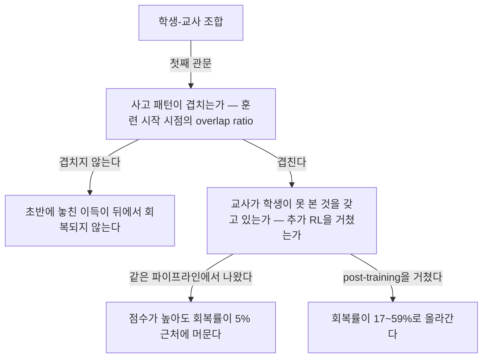
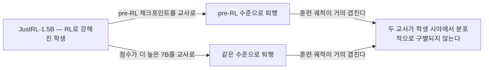
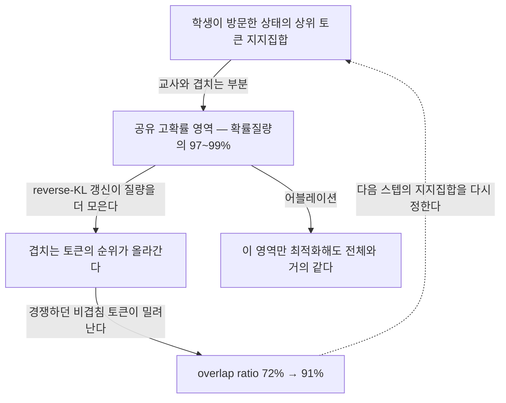
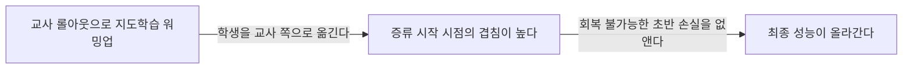
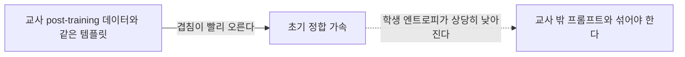
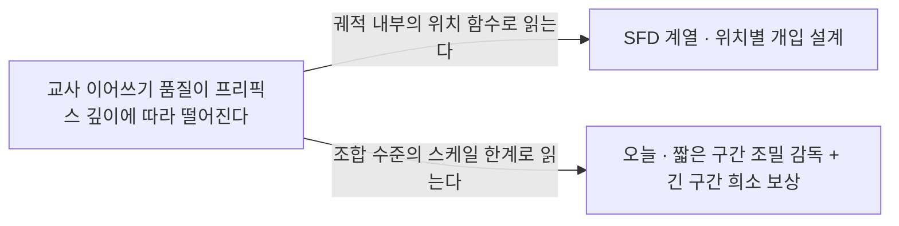

## 오늘의 한 편

**Rethinking On-Policy Distillation of Large Language Models: Phenomenology, Mechanism, and Recipe** ([arXiv:2604.13016](https://arxiv.org/abs/2604.13016), 2026-04-15 게시, cs.LG). Yaxuan Li·Yuxin Zuo·Bingxiang He 셋이 공동 1저자로 서고 Jinqian Zhang, Chaojun Xiao, Cheng Qian, Tianyu Yu, Huan-ang Gao, Wenkai Yang, Zhiyuan Liu가 이름을 올렸으며 Ning Ding이 교신입니다. 칭화대, 상하이과기대, UIUC, 인민대 네 곳이 걸쳐 있고 코드는 thunlp/OPD로 열려 있어요. 오늘 읽은 범위는 본문 여덟 절 전부와 부록 A부터 D까지입니다.

논문이 세우는 질문은 짧습니다. 온폴리시 증류는 언제 되고 언제 안 되는가[^term-opd]. 저자들이 내놓는 답은 조건 두 개예요. 첫째, 학생과 교사의 사고 패턴이 호환돼야 합니다. 둘째, 사고 패턴이 맞고 교사 점수가 더 높더라도 그것만으로는 모자라고, 교사가 학생이 훈련 중에 본 적 없는 능력을 실제로 갖고 있어야 합니다[^abs]. 두 조건을 뒤집으면 이런 진술이 되고요 — 벤치마크에서 앞서는 교사가 증류에서는 아무것도 주지 못할 수 있다.

이 주장을 떠받치는 실증이 약-대-강 역방향 증류입니다[^term-reverse]. 같은 계열의 1.5B 교사와 7B 교사가 학생의 시야에서는 분포적으로 구별되지 않는다는 것을 보이는 실험인데, 뒤에서 자세히 보겠습니다. 토큰 수준으로 내려가면 성공하는 증류는 학생이 방문한 상태에서 고확률 토큰들이 점진적으로 정렬되는 과정이고, 그때 겹치는 토큰 집합은 작지만 확률질량의 97~99%를 차지합니다[^abs].

## 왜 골랐나

어제 목록의 세 번째 자리에 있던 편입니다. 위의 두 편이 미러에 아직 도착하지 않아 순서대로 내려오다 여기서 멈췄어요. 그런데 펴 보니 이 편이 1순위였어야 했습니다.

어제 이 편을 적어 둘 때 나는 "성공 조건을 학생-교사 사고 패턴 호환성으로 잡는다는 프레이밍"이라고 요약했는데, 원문이 세우는 조건은 둘이고 두 번째가 훨씬 날카롭습니다. 요약 층이 첫 번째 조건에서 멈춘 셈이에요. 제목도 한 토막 짧게 옮겨져 있었고요 — 원제에는 "of Large Language Models"가 들어갑니다.

더 중요한 건 방향입니다. 최근 다섯 편은 결국 같은 자리에 서 있었어요. 교사의 감독이 궤적 뒤로 갈수록 흐려진다는 진단을 공유하고, 어디서 끊을지·어떻게 순위를 맞출지·무엇으로 신호를 보강할지를 두고 갈린 처방들이었습니다. 오늘 논문은 그 물음보다 한 칸 앞에 있어요. 궤적 어디에서 감독이 무너지는가를 묻기 전에, **이 학생과 이 교사를 짝지은 것부터가 가망이 있는가**를 묻습니다. 처방을 다섯 편 읽고 나서 진단으로 되돌아온 셈인데, 이 역행이 손해가 아니라는 게 오늘 읽기의 결론이고요.

한 가지 시간 관계를 짚어 둘게요. 오늘 논문은 4월 15일 게시입니다. 어제 논문은 5월 29일이고 자기 관련 연구 절에서 오늘 논문을 동시 연구로 지목했어요. 반대 방향의 인용은 없는 게 당연합니다. 어제 나는 같은 현상에 다섯 팀이 각자 이름을 붙이고 서로를 못 본다고 적었는데, 오늘 편은 그 목록에서 가장 먼저 도착한 편이면서 나머지 넷과 어휘를 공유하지 않는 편이에요. 감독 충실도라는 말을 쓰지 않고 같은 붕괴를 다른 곳에서 봅니다.

## 핵심 세 가지

세 가지 전에 계보를 한 문단 놓고 가겠습니다. 교사가 지나치게 강하면 증류가 도리어 해롭다는 관찰은 오늘 처음 나온 게 아니에요. 2019년에 Cho와 Hariharan이 이 역전을 보고했고, 2020년에 Mirzadeh 팀이 중간 크기 모델을 사다리처럼 끼워 넣는 teacher assistant를 제안했으며, 2025년의 증류 스케일링 법칙은 교사-학생 격차에 따른 U자형 손실 곡선과 최적 교사 크기를 정량화했습니다[^term-capacity][^classics]. 오늘 논문의 관련 연구 절도 이 줄을 인정하면서 한 가지를 덧붙여요. 기존 분석이 거의 전부 오프폴리시 지식 증류를 중심으로 이뤄졌고, 온폴리시 설정에서의 용량 격차와 증류 가능성은 아직 덜 탐구된 채라는 것[^related].

그러니 오늘 논문이 새로 하는 일은 현상의 발견이 아니라 **좌표축의 교체**입니다. 고전 문헌은 이 실패를 크기 축에 놓았고 — 교사가 학생보다 몇 배 크면 위험하다 — 오늘 논문은 같은 실패를 분포 축에 놓습니다. 무게중심이 크기에서 겹침으로 옮겨 갑니다. 이 교체가 옳다면 처방도 달라져야 하고, 실제로 달라집니다. 사다리를 놓는 대신 학생을 교사 쪽으로 옮기니까요.

### 하나 — 벤치마크가 낮은 교사가 더 잘 가르쳤다

출발 실험이 소박하면서 결과가 뒤집혀 있습니다. 학생은 Qwen3-1.7B-Base 하나로 고정하고, 교사를 둘 놓습니다. 하나는 Qwen3-4B의 Non-thinking 모드, 다른 하나는 Qwen3-4B-Base에 GRPO를 돌린 체크포인트예요. 벤치마크로는 둘이 대체로 비슷한데, 증류 결과는 GRPO 쪽이 일관되게 앞섭니다[^cond1].

왜 앞서는지를 저자들은 초기 overlap ratio에서 찾습니다[^term-overlap]. 학생과 교사의 상위 토큰 집합이 훈련 시작 시점에 얼마나 겹치는가를 재면 GRPO 교사 쪽이 더 높아요. 벤치마크에서 밀리면서도 학생의 사고 패턴에 더 가까이 서 있다는 뜻입니다[^cond1].

여기서 한 겹 더 들어간 관찰이 이 절의 무게중심입니다. 훈련이 진행되면 두 overlap 곡선은 결국 수렴해요. 그런데 성능 격차는 회복되지 않습니다. 저자들의 문장은 초반의 사고 패턴 불일치가 나중에 되돌릴 수 없는 증류 이득의 손실을 낳는다는 것이고요[^cond1].

이 비대칭이 조건을 조건답게 만듭니다. overlap이 낮다는 게 "느리게 배운다"는 뜻이었다면 시간을 더 주면 됐을 텐데, 실제로는 초반에 놓친 것이 영영 돌아오지 않는다는 뜻이니까요. 훈련 예산으로 살 수 없는 무언가가 시작 시점의 정합에 걸려 있는 겁니다.

두 번째 조건은 다른 축에서 옵니다. DeepSeek 계열과 Qwen 계열 양쪽에서, 같은 파이프라인에서 나온 교사와 추가 RL을 거친 교사를 비교하면 이득의 크기가 크게 갈려요. 교사-학생 격차 대비 얼마를 회복했는지로 재면 Skywork 교사가 16.9%인 데 비해 DeepSeek 교사는 5.3%, Qwen-RL-Math 교사가 58.6%인 데 비해 일반 Qwen 교사는 15.6%입니다[^term-gap][^cond2]. 사고 패턴이 맞아도 교사가 가진 게 학생이 이미 본 것뿐이면 옮겨 갈 게 없다는 뜻이에요.

### 둘 — 두 교사가 학생의 시야에서 같은 모델이 된다

조건 둘을 세우는 것과 그 조건이 벤치마크와 독립임을 보이는 것은 다른 일이고, §3.3이 그 둘을 갈라 놓습니다. 설계가 단정해요.

JustRL-1.5B는 RL로 강해진 학생입니다. 이 모델을 자기 자신의 pre-RL 체크포인트인 R1-Distill-1.5B로 역방향 증류하면, RL로 얻은 것이 거의 정확히 반납되고 pre-RL 수준으로 내려앉습니다. 여기까지는 예상대로예요. 약한 교사가 강한 학생을 끌어내린 거니까요.

다음 수가 결정적입니다. 교사를 R1-Distill-7B로 바꿉니다. 같은 계열이고 벤치마크에서는 JustRL-1.5B보다 높은 점수를 받는 모델이에요. 그런데 훈련 궤적이 앞의 것과 거의 구별되지 않습니다. 벤치마크에서 학생을 앞지르면서도 더 약한 1.5B 교사와 똑같은 퇴행 수준으로 학생을 몰고 간다는 게 저자들의 서술이고요[^reverse].

이 실험이 왜 센가를 한 번 더 말로 풀어 볼게요. 교사를 고를 때 우리가 쓰던 자는 벤치마크였습니다. 그 자가 여기서 두 번 틀려요. 첫 번째는 점수가 더 높은 교사가 더 나은 결과를 주지 않았다는 것이고, 두 번째는 점수 차이가 있는 두 교사가 **결과에서 아무 차이도 만들지 않았다**는 것입니다. 두 번째가 더 무겁습니다. 자가 부정확한 게 아니라 다른 것을 재고 있었다는 뜻이니까요.

이 실험이 보이지 않는 것도 같이 적어 둘게요. 7B 교사가 쓸모없다는 얘기가 아닙니다. 다른 학생과 짝지으면 그 교사가 많은 것을 줄 수 있어요. 여기서 보인 건 교사의 속성이 아니라 쌍의 속성이고, 그래서 이 결과는 교사 순위표가 아니라 짝짓기 절차를 손보라고 말합니다. 모델 카드에 적힌 점수만 보고 교사를 고르는 관행이 실은 학생을 보지 않고 고르는 관행이었다는 것.

저자들이 여기서 뽑아 내는 결론은 세 줄인데, 그대로 옮겨 둘 만합니다. 사고 패턴이 중요하며 온폴리시 증류가 근본적으로 배우는 것이 사고 패턴이라는 것, 벤치마크 성능이 증류 결과를 예측하지 못한다는 것, 그리고 점수가 높다는 것이 증류에 쓸 새 지식이 있다는 뜻은 아니라는 것[^reverse].

### 셋 — 이득이 나오는 자리는 이미 공유된 영역이다

메커니즘 절이 이 결론에 물리적 근거를 붙입니다. 성공하는 증류에서 학생과 교사의 상위 토큰 집합 겹침 비율은 훈련 내내 꾸준히 올라 72%에서 91%에 이르고, 겹치는 토큰들이 확률질량의 97~99%를 차지합니다. 겹침 영역의 어드밴티지는 0으로 수렴하고 엔트로피 격차도 좁아지고요. 실패하는 런에서는 이 세 지표가 전부 정체합니다[^mech].

상관을 인과로 올리는 건 어블레이션입니다. 상위 토큰 지지집합을 겹치는 쪽과 겹치지 않는 쪽으로 쪼개 각각만 최적화해 봤더니, 겹침 쪽만 써도 전체를 쓴 것과 거의 같은 성능이 나오고 비겹침 쪽만 쓰면 훨씬 약합니다. 온폴리시 증류의 주된 이득이 공유된 고확률 영역의 그래디언트에서 온다는 게 저자들의 정리예요[^mech].

그리고 이 과정이 스스로를 강화합니다. 어떤 토큰이 공유 고확률 영역에 들어가고 교사가 그것을 선호하면, reverse-KL 갱신이 거기에 질량을 더 모으고, 경쟁하던 비겹침 토큰들이 학생의 상위 집합에서 점차 밀려난다는 것[^mech].

여기서 앞의 두 조건이 하나로 묶입니다 — 이 문단은 원문에 없는 내 읽기예요. 증류가 실제로 하는 일이 공유 영역 **안에서의 확률 재배치**라면, 첫째 조건은 그 영역이 애초에 충분히 넓은가를 묻는 것이고 둘째 조건은 그 영역 안에서 교사가 매기는 순서가 학생의 순서와 다른가를 묻는 것입니다. 영역이 좁으면 그래디언트가 흐를 자리가 없고, 영역이 넓어도 순서가 같으면 옮길 것이 없어요. 역방향 증류에서 두 교사가 같아 보인 이유도 이 틀에서 자연스럽습니다. 같은 계열의 두 교사는 공유 영역의 순서까지 닮아 있으니 크기 차이가 학생에게 도달할 경로가 없는 거예요.

처방 두 가지도 같은 틀 위에 섭니다. 하나는 오프폴리시 콜드 스타트 — 온폴리시 증류를 시작하기 전에 교사 롤아웃으로 지도학습 워밍업을 돌리면 시작 시점의 겹침이 훨씬 높고 최종 성능도 올라갑니다[^recipe][^term-cold]. 사다리를 놓아 교사를 낮추는 대신 학생을 교사 쪽으로 옮기는 수예요.

다른 하나는 교사 정합 프롬프트 선택인데, 여기에는 저자들이 직접 단서를 답니다. 교사의 post-training 데이터와 같은 템플릿·내용을 쓰면 겹침이 더 빨리 오르지만 훈련 중 학생 엔트로피가 상당히 낮아지고, 그래서 교사의 post-training 데이터 바깥 프롬프트와 섞는 편이 더 견고할 수 있다고요[^recipe].

정합을 올리는 일과 다양성을 지키는 일이 같은 손잡이의 양 끝에 달려 있다는 뜻입니다. 첫째 조건을 극단까지 밀면 학생이 교사의 복제가 되고, 그러면 둘째 조건이 저절로 무너져요. 두 조건이 서로를 제한한다는 게 이 단서에 들어 있습니다.

### 그러나 — 보상은 정보를 담고 있었는데도 실패한다

여기까지가 논문이 세운 구조고, 이제 가장 덜 정리된 자리를 봅니다. §6이에요.

궤적이 길어지면 교사 보상의 품질이 떨어집니다. 학생 프리픽스가 1K 토큰일 때 교사가 이어받아 얻는 정확도 우위는 +0.37인데 16K에서는 +0.02로 거의 사라져요[^horizon]. 어제 읽은 편이 감독 충실도 감쇠라고 부른 것과 같은 붕괴인데, 오늘 논문은 그 어휘를 쓰지 않고 독립적으로 도달합니다.

문제는 그다음입니다. 실패하는 7B 교사도 시퀀스 평균 보상을 기준으로 보면 정답 롤아웃과 오답 롤아웃을 꽤 잘 구별해요. AUROC가 0.73에서 0.75 사이입니다[^term-auroc][^horizon]. 그러니까 이 보상은 정보가 없어서 실패하는 게 아닙니다. 전역적으로는 판별력이 살아 있는데 토큰 수준 그래디언트로 합쳐질 때 효과가 사라져요.

저자들의 가설은 이방성입니다. 큰 교사가 학생 정책 주변에서 국소적으로 평평한 보상 지형을 만들어, 전역 신호가 유익한데도 토큰 수준 그래디언트가 무력해진다는 것[^horizon]. 그럴듯한데, 저자들 스스로 이 이방성 가설을 직접 검증하지는 않았다고 적습니다[^horizon]. 논문에서 가장 흥미로운 관찰이 가장 덜 검증된 채로 남아 있는 자리예요.

이 간극의 모양 자체는 낯설지 않습니다. 시퀀스 전체로는 좋고 나쁨이 분명한데 그 판정을 토큰마다 나눠 주려 하면 신호가 흩어지는 일은 강화학습의 신용 할당이 오래 다뤄 온 형태고요. 온폴리시 증류가 매력적이었던 이유가 바로 이 문제를 우회한다는 데 있었습니다. 교사가 매 토큰에 조밀한 피드백을 주니 신용을 나눌 필요가 없다는 것. 그런데 §6이 보인 건 그 우회가 공짜가 아니었다는 거예요. 조밀한 신호를 얻은 대가로 각 토큰의 신호가 서로 상쇄될 수 있는 구조를 들여왔고, 궤적이 길어질수록 그 상쇄가 커집니다. 논문이 결론에서 짧은 구간의 조밀 감독과 긴 구간의 희소 결과 보상을 섞자고 제안하는 것도 이 대차를 인정한 자리고요[^future]. 다만 이건 어디까지나 가설 위에 얹힌 제안이라, 이방성이 검증되기 전까지는 처방의 근거가 아니라 방향 표시로 읽는 게 맞습니다.

그리고 조건틀 자체에 걸리는 반례가 논문 밖에 있습니다. 탐구 자료가 물어 온 Direct-OPD는 약한 교사의 절대적 지식이 아니라 RL 전후 체크포인트 쌍이 보여 주는 정책 변화의 방향을 학생에게 전달해 Qwen3-1.7B를 AIME 2024에서 48.3%에서 58.3%까지 올렸다고 합니다[^direct]. 이게 사실이라면 오늘 논문의 둘째 조건이 흔들려요. 교사가 학생이 못 본 지식을 갖고 있어야 한다는 조건 없이도 개선이 일어난다는 뜻이니까요. 전달된 게 지식이 아니라 학습 신호의 방향이라면, 둘째 조건은 필요조건이 아니라 여러 충분조건 중 하나가 됩니다. 역방향 증류 실험이 하필 pre-RL 체크포인트를 교사로 썼다는 점에서 두 결과가 같은 재료를 정반대로 쓰고 있기도 하고요 — 한쪽은 그 체크포인트를 교사로 세워 퇴행을 보였고, 다른 쪽은 그 체크포인트와 post-RL 체크포인트의 **차이**를 신호로 썼습니다. 다만 이건 원문 대조를 못 한 요약 층의 진술이니 여기까지만 적어 둘게요.

남은 두 균열은 짧게 적습니다. 실험이 전부 수학 추론에 얹혀 있고, 저자들도 다른 도메인으로의 일반화를 열린 질문으로 남깁니다[^future]. 그리고 사고 패턴이라는 두꺼운 개념이 상위 토큰 겹침 비율이라는 얇은 대리 변수 하나로 측정되는데, 그 대리가 타당한지는 별도로 검증되지 않아요. 겹침 비율은 표면 어휘의 분포적 근접도 측정할 수 있고 추론의 구조를 측정할 수도 있는데, 둘을 가르는 실험이 논문에 없습니다. 첫째 조건의 무게가 전부 이 한 지표에 실려 있다는 점에서 가장 조용한 취약점이에요.

## 내 연구에 어떻게 맞물리나

온폴리시 증류로는 여덟 편째입니다. 오늘 읽기에서 남길 것을 세 갈래로 적겠습니다.

첫째는 SFD 계열과 오늘 편이 같은 저울을 쓰는가에 대한 판정입니다. 재는 양은 거의 같아요. 어제 논문의 감쇠량은 교사가 학생 프리픽스를 이어받아 정답에 도달할 확률의 낙폭이었고, 오늘 논문의 프리픽스 깊이 실험은 같은 이어쓰기의 정확도 우위가 1K의 +0.37에서 16K의 +0.02로 무너지는 것을 봅니다[^horizon]. 서로를 모른 채 같은 실험을 설계한 경우가 이로써 셋이 됐습니다.

갈리는 건 그 값을 어느 좌표계에 얹느냐예요. SFD 계열은 이 감쇠를 궤적 내부의 위치 함수로 읽고 위치별 개입을 설계합니다 — 어디서 끊을지, 어디서 신호를 보강할지. 오늘 논문은 같은 감쇠를 조합 수준의 스케일 한계로 읽어요. 결론 절이 §6의 궤적 길이 천장이 짧은 구간의 조밀한 토큰 수준 감독과 긴 구간의 희소한 결과 수준 보상을 결합하는 혼성 접근을 요구한다고 적습니다[^future]. 같은 저울에 다른 눈금을 새긴 거고, 눈금이 처방을 갈랐습니다.

둘째는 용량 격차라는 오래된 이름과 오늘의 메커니즘이 같은 것을 가리키는가입니다. 고전 문헌의 U자 곡선은 크기 축에 그려져 있었고 최적 교사 크기가 학생의 두어 배라는 식의 정량화까지 갔어요[^classics]. 오늘 논문의 설명은 그 곡선의 오른쪽 내리막을 겹침의 언어로 다시 씁니다. 교사가 커서 해로운 게 아니라 교사가 커지면서 학생과 공유하던 고확률 영역의 순서가 달라져 재배치할 자리가 사라진다는 것이죠.

두 설명이 양립 가능한지를 가를 실험은 어렵지 않습니다. 크기를 고정하고 겹침만 움직이면 돼요. 콜드 스타트 길이를 조절하면 같은 교사-학생 쌍에서 시작 겹침을 연속적으로 바꿀 수 있으니, 성능이 크기가 아니라 겹침을 따라간다면 좌표축 교체가 지지됩니다. 반대로 겹침을 맞춰도 크기 효과가 남는다면 두 축이 독립이고, 그러면 사다리를 놓는 옛 처방과 학생을 옮기는 새 처방을 함께 써야 한다는 결론이 나오고요. 논문이 가진 도구로 바로 할 수 있는 측정인데 실려 있지 않습니다.

여기에 인접 자료 셋이 같은 방향을 가리킵니다. 프리트레이닝 단계에서도 교사를 강하게 만들수록 증류 효과가 포화하고 역전되며, 멀티모달 쪽에서도 더 강한 교사가 학생을 해치는 결과가 보고됐어요[^corroborate]. 훈련 단계도 양식도 다른 곳에서 같은 부호가 나온다는 건 이 현상이 특정 레시피의 부작용이 아니라는 표시입니다.

셋째는 판단의 계승이라는 우리 쪽 질문입니다. 강한 엔진의 접근이 끊길 상황을 전제로 판단과 관계의 층을 다음 엔진에 넘기려던 노트가 있는데, 거기 이런 방향 의견이 적혀 있었어요.

> 진짜 교사는 사용자의 교정입니다. 새 엔진의 첫 세션들에서 교정 빈도가 높을 것은 실패가 아니라 설계대로이고, 그 교정들이 handover v1을 만듭니다.

오늘 논문의 두 조건과 형태가 같습니다. 교정이 교사 노릇을 할 수 있으려면 후임이 그 교정을 자기 top-k 안에서 알아들을 만큼 형식이 호환돼야 하고(첫째 조건), 동시에 교정이 후임이 이미 하던 것과 달라야 합니다(둘째 조건). 그리고 교정 빈도가 높은 초기를 실패로 읽지 말라는 판단이 오늘 논문의 회복률 지표와 겹쳐요 — 옮겨진 양은 교사 점수로 셀 수 없고 격차 중 얼마가 실제로 닫혔는가로 재야 하니까요.

같은 계열의 재측정 파일럿은 반대편 실패를 기록합니다. 다중 에이전트 실패 분류 체계를 최신 모델로 다시 재려다가 판정 단계에서 멈춘 일이었는데, 사람 라벨과의 일치도가 원 논문의 $$\kappa = 0.77$$에서 $$\kappa = 0.056$$으로 무너지고 판정자 자기 일치율이 0.460이었어요[^km]. 판정자 품질이 어떤 하한 아래로 내려가면 판단이 전혀 이식되지 않는다는 실측이고, 그 파일럿의 결론은 판정자 이식 가능성이 재측정의 독립 선행 질문으로 승격됐다는 것이었습니다.

오늘 편이 여기에 더하는 건 하한 위에서도 이식이 안 되는 경로가 따로 있다는 겁니다. 판정자가 유능해도 대상과 분포가 겹치지 않으면 옮겨 가지 않고, 유능하고 겹쳐도 대상이 이미 아는 순서를 반복하면 옮길 것이 없어요. 실패 축이 셋이라는 뜻이고, 캘리브레이션 단계에서 이 셋을 각각 재는 절차가 필요하다는 뜻이기도 합니다. 유비는 여기까지만 밀겠습니다. 그쪽은 프롬프트 수준의 이식이라 그래디언트가 흐르는 경로가 없고, 오늘 논문의 자기강화 루프는 갱신이 다음 스텝의 지지집합을 바꾸는 자기회귀 구조 위에서만 정의되니까요. 겹치는 건 진단의 형태지 메커니즘이 아니에요.

시험해 볼 실험을 둘 적어 둡니다.

첫째, 겹침 비율이 사고 패턴의 대리로 타당한지를 가르는 실험입니다. 사고 패턴을 표면과 구조 두 축으로 나눠 조작해 보면 돼요 — 같은 추론 구조를 다른 템플릿으로 쓰게 한 조건과, 같은 템플릿 안에서 추론 구조만 바꾼 조건. 겹침 비율이 첫 번째 조작에만 크게 반응한다면 이 지표는 표면 어휘의 근접도를 재는 것이고, 첫째 조건은 다시 쓰여야 합니다. 두 번째 조작에도 따라 움직인다면 대리가 승인되고요.

둘째, 둘째 조건이 필요조건인지를 가르는 실험입니다. 역방향 증류 세팅을 그대로 두고 교사 신호만 바꿔 보는 거예요. pre-RL 체크포인트를 교사로 쓰되 그 체크포인트와 post-RL 체크포인트의 차분을 신호로 얹으면, 오늘 논문이 보인 퇴행이 멈추는지. 멈춘다면 새 지식이 없어도 변화의 방향만으로 학습이 성립하니 둘째 조건은 충분조건 중 하나로 내려앉고, 멈추지 않는다면 논문 밖의 반례는 다른 이유로 작동한 것이 됩니다. 같은 모델 쌍 위에서 두 주장을 직접 맞붙이는 설계라 값이 큽니다.

## 편집자에게 (pheeree)

오늘 짚을 것은 네 군데예요.

첫째, 어제 이 편에 붙여 둔 요약이 절반만 맞았습니다. 조건을 하나로 적었는데 원문은 둘이고, 둘째 조건이 오늘 글의 중심이 됐어요. 제목에서 "of Large Language Models"가 빠졌던 것도 같이 정정합니다. 요약 층을 거친 자료는 방향 잡기까지라는 규율의 사례가 하나 더 쌓인 셈인데, 오늘 건 오류라기보다 절단이라 눈에 덜 띄는 종류라 적어 둡니다.

둘째, 순서에 대한 운영 관찰입니다. 처방 다섯 편을 읽고 나서야 조건을 묻는 편으로 돌아왔는데, 미러 도착 순서가 이 순서를 정했어요. 읽는 순서가 주제의 논리적 순서와 어긋나면 앞선 다섯 편에서 세운 판정을 오늘 다시 손봐야 하고, 실제로 오늘 감독 감쇠를 궤적 내부의 문제로만 읽던 프레임을 조합 수준으로 한 칸 넓혔습니다. 손해는 아니었지만 우연이었고요.

셋째, 탐구 자료가 09-10에 읽은 KL 동조 함정 편([arXiv:2606.09471](https://arxiv.org/abs/2606.09471))을 다시 후보로 올렸습니다. 같은 마찰이 네 번째예요. 자료 층이 읽은 이력을 참조하지 못한다는 게 이제 우연이 아니라 구조로 보입니다.

넷째, 오늘 자료의 다양성은 좋았습니다. 두 갈래 탐구 사이에 URL 겹침이 하나도 없었고, 한쪽이 온폴리시 증류 직계 후속으로 좁혀 들어간 동안 다른 쪽이 프리트레이닝과 멀티모달, 고전 지식 증류 문헌까지 퍼졌어요. 본문의 둘째 갈래가 그 폭에서 나왔습니다.

읽을 순서는 본문이 열어 둔 질문의 크기대로 잡았어요.

1. **Weak-to-Strong Generalization via Direct On-Policy Distillation ([arXiv:2607.05394](https://arxiv.org/abs/2607.05394))** — 오늘 본문이 가장 크게 열어 둔 질문이 둘째 조건의 지위이고, 이 편이 그 자리를 정면으로 칩니다. 볼 대목은 정확히 하나예요. 전달되는 것이 정말 정책 변화의 방향인지, 아니면 pre/post 체크포인트 차분이 실질적으로 새 지식을 실어 나르고 있어 오늘 조건틀 안으로 흡수되는지. 후자라면 반례 지위를 잃고 둘째 조건의 특수한 구현이 되고, 전자라면 조건 하나가 필요조건에서 내려앉습니다.
2. **Rethinking the Capacity Gap in On-Policy Distillation (OpenReview [TteFp6TLUA](https://openreview.net/forum?id=TteFp6TLUA))** — 같은 실패를 불확실성 프로파일의 전달로 설명하는 편입니다. 강한 교사가 학생이 이미 확신을 갖고 맞히던 토큰에서 끌어내려 망각을 유발한다는 쪽인데, 오늘 논문의 자기강화 루프와 이게 양립하는지가 볼 대목이에요. 오늘 틀에서 공유 영역의 순위 갱신은 이득의 원천이었는데 저쪽에서는 손실의 원천이니, 둘을 가르는 건 교사가 학생보다 옳은 빈도일 겁니다. 그 빈도를 어떻게 쟀는지가 판정의 전부고요.
3. **Rethinking On-Policy Distillation of Large Language Models II: One Training Example ([arXiv:2609.04172](https://arxiv.org/abs/2609.04172))** — 같은 저자군의 후속으로 보이는 편입니다. 단일 쿼리 롤아웃으로 전체 데이터셋 성능의 64~87%를 회복한다는 보고인데, 오늘 세운 틀에서 읽으면 자연스러운 귀결이에요. 이득이 공유 고확률 영역의 재배치에서 온다면 그 영역을 드러내는 데 필요한 쿼리 수는 작을 수 있으니까요. 09-12에 읽은 상태 커버리지·흡수율 편과 직접 이어지는 자리이기도 해서, 세 편을 겹쳐 놓으면 데이터 축과 알고리즘 축의 분리가 한 번에 보일 것 같습니다.
4. **On the Position Bias of On-Policy Distillation ([arXiv:2606.22600](https://arxiv.org/abs/2606.22600))** — §6의 이방성 가설이 검증되지 않은 채 남았는데, 이 편은 같은 무력화를 온폴리시 중요도가중치가 초반 토큰에 쏠리는 구조로 설명합니다. 두 설명은 경쟁 관계이고 예측이 갈려요 — 이방성 쪽은 상쇄가 시퀀스 내부의 방향 분산에서 온다고 보고, 위치 편향 쪽은 가중치의 위치 분포에서 온다고 봅니다. 그래디언트 노름을 위치별로 재면 갈릴 텐데, 그 측정이 실려 있는지가 볼 대목입니다.

**발행 전 점검:** 중심 논문 [arXiv:2604.13016](https://arxiv.org/abs/2604.13016)은 본문 여덟 절과 부록 A~D를 읽은 기준입니다. 초록, §3.1의 GRPO 교사 역설과 회복 불가 진술, §3.3의 역방향 증류 서술과 결론 세 줄, §4의 공유 영역 귀속과 자기강화 서술, §5.2의 엔트로피 부작용 단서, §6의 프리픽스 깊이·이방성 가설·미검증 인정, §7의 용량 격차 미탐구 진술, §8의 혼성 접근 제안은 번역하지 않고 영어 그대로 각주에 넣었어요[^abs][^cond1][^reverse][^mech][^recipe][^horizon][^related][^future]. 본문 수치는 전부 원문 기준입니다 — 회복률 16.9%·5.3%·58.6%·15.6%, 겹침 72%→91%와 확률질량 97~99%, 프리픽스 1K의 +0.37과 16K의 +0.02, AUROC 0.73~0.75[^cond2][^mech][^horizon][^abs].

여기서부터는 내가 얹은 해석입니다. 두 조건을 공유 고확률 영역의 넓이와 그 안의 순서라는 한 메커니즘의 두 얼굴로 묶은 것, 고전 용량 격차 문헌과의 관계를 크기 축에서 분포 축으로의 좌표 교체로 읽은 것, SFD 계열과 오늘 편이 같은 저울에 다른 눈금을 새겼다고 판정한 것, 교사 정합 프롬프트의 엔트로피 부작용을 두 조건이 서로를 제한한다는 증거로 읽은 것, 그리고 판단 계승 노트의 이중 조건을 오늘의 두 조건과 같은 형태로 놓은 것 — 다섯 다 논문이 그렇게 말한 게 아니라 내가 그렇게 읽은 겁니다.

신뢰 장부로 세면 이렇습니다. 원문 대조 ✓가 중심 논문 쪽 열다섯 남짓, 우리 노트 직접 ✓ 둘. 원문 미대조 △가 여섯 — Direct-OPD 반례, 용량 격차 고전 셋, 프리트레이닝·멀티모달 재확인, 불확실성 프로파일 설명, 위치 편향 정식화, 후속작의 단일 쿼리 회복률[^direct][^classics][^corroborate]. 따옴표 없이 남긴 각주가 그 경계선이에요. ✗ 정정이 하나인데 어제 글이 옮긴 논문 제목과 조건 개수이고, 본문 첫머리에 그대로 적었습니다. ⚠ 완화가 하나 — 후속작 [arXiv:2609.04172](https://arxiv.org/abs/2609.04172)의 저자군이 같다는 것은 자료 층의 추정이라 "보인다"로 낮춰 적었고, 다음 읽기에서 확인할 자리로 남깁니다.

---

[^abs]: 중심 논문 초록, 원문 대조분: "On-policy distillation (OPD) has become a core technique in the post-training of large language models, yet its training dynamics remain poorly understood. This paper provides a systematic investigation of OPD dynamics and mechanisms. We first identify that two conditions govern whether OPD succeeds or fails: (i) the student and teacher should share compatible thinking patterns; and (ii) even with consistent thinking patterns and higher scores, the teacher must offer genuinely new capabilities beyond what the student has seen during training. We validate these findings through weak-to-strong reverse distillation, showing that same-family 1.5B and 7B teachers are distributionally indistinguishable from the student's perspective. Probing into the token-level mechanism, we show that successful OPD is characterized by progressive alignment on high-probability tokens at student-visited states, a small shared token set that concentrates most of the probability mass (97%–99%). We further propose two practical strategies to recover failing OPD: off-policy cold start and teacher-aligned prompt selection. Finally, we show that OPD's apparent free lunch of dense token-level reward comes at a cost, raising the question of whether OPD can scale to long-horizon distillation." — Li, Zuo, He 외 (2026), 초록.

[^cond1]: 중심 논문 §3.1, 원문 대조분. 학생 Qwen3-1.7B-Base에 대해 Qwen3-4B(Non-thinking)와 Qwen3-4B-Base-GRPO를 교사로 비교한 결과입니다: "distillation from Qwen3-4B-Base-GRPO consistently outperforms distillation from Qwen3-4B (Non-thinking), although the two teachers have broadly comparable performance... Despite underperforming on benchmarks, the GRPO teacher exhibits a higher initial overlap ratio, suggesting that its thinking pattern aligns more closely with the student." 훈련 후반에 두 겹침 곡선이 수렴해도 성능 격차가 남는다는 관찰은 같은 절입니다: "the performance gap persists, suggesting that early-stage thinking-pattern mismatch causes a loss of distillation benefit that cannot be recovered later in training."

[^cond2]: 중심 논문 §3.2와 Figure 4, 원문 대조분. DeepSeek 계열(학생 R1-Distill-1.5B, 교사 R1-Distill-7B 대 Skywork-OR1-Math-7B)과 Qwen 계열 양쪽에서 같은 파이프라인에서 나온 교사와 추가 RL을 거친 교사의 이득이 갈립니다. 교사-학생 격차 대비 회복률은 Skywork 16.9% 대 DeepSeek 5.3%, Qwen-RL-Math 58.6% 대 Qwen 15.6%입니다. 이 절의 서술은 수치 인용이고 따옴표로 옮긴 원문 문장은 없습니다.

[^reverse]: 중심 논문 §3.3, 원문 대조분. JustRL-1.5B를 자기 pre-RL 체크포인트(R1-Distill-1.5B)로 역방향 증류하면 거의 정확히 pre-RL 수준으로 퇴행하며, 교사를 R1-Distill-7B로 바꿔도 결과가 같습니다: "the training trajectory is nearly indistinguishable: despite outscoring JustRL-1.5B on benchmarks, R1-Distill-7B drives the student to the same regressed level as the weaker 1.5B teacher." 절의 결론 세 줄은 원문 그대로 "Thinking pattern matters, and OPD fundamentally learns thinking patterns" / "Benchmark performance does not predict OPD outcome" / "Higher scores do not imply new knowledge for OPD."입니다.

[^mech]: 중심 논문 §4와 Figure 7·18, 원문 대조분. 성공하는 증류에서 학생·교사 상위 토큰 집합의 겹침 비율이 72%에서 91%로 오르고 겹치는 토큰이 확률질량의 97~99%를 차지하며, 겹침 영역 어드밴티지가 0으로 수렴하고 엔트로피 격차가 좁아집니다. 실패 런에서는 세 지표가 모두 정체합니다. §4.2 어블레이션은 상위 지지집합을 겹침·비겹침으로 쪼개 각각만 최적화한 비교이고 결론은 "the main gains of OPD come from gradients on the shared high-probability region."입니다. 자기강화 서술은 같은 절: "once a token enters the shared high-probability region and is favored by the teacher, reverse-KL updates concentrate more mass on it, gradually pushing competing non-overlap tokens out of the student's top-k set." 두 조건을 이 메커니즘의 두 얼굴로 묶은 것은 내 읽기입니다.

[^recipe]: 중심 논문 §5, 원문 대조분. 오프폴리시 콜드 스타트는 온폴리시 증류 전에 교사 롤아웃으로 지도학습 워밍업을 두는 방식이고, 시작 시점 겹침과 최종 성능이 함께 오른다고 보고합니다(Figure 8). 교사 정합 프롬프트 선택에 붙은 단서는 §5.2 원문 기준입니다: "using teacher-aligned prompts leads to substantially lower student entropy during training... a more robust strategy may be to mix teacher-aligned prompts with prompts outside the teacher's post-training data." 이 부작용을 두 조건이 서로를 제한하는 증거로 읽은 것은 내 해석입니다.

[^horizon]: 중심 논문 §6과 Figure 11b·14, 원문 대조분. 교사 이어쓰기 품질이 프리픽스 깊이에 따라 떨어진다는 관찰("teacher continuation degrades with prefix depth")에서 학생 프리픽스 1K 토큰일 때 교사의 정확도 우위가 +0.37, 16K에서 +0.02입니다. §6.2는 실패하는 7B 교사도 시퀀스 평균 보상 기준으로 정답·오답 롤아웃을 구별한다고 보고하며 AUROC는 0.73~0.75입니다. 저자들의 가설은 "A larger teacher may induce a reward landscape that is locally flat around the student's policy, making token-level gradients ineffective despite an informative global signal."이고, 같은 절에 "We have not directly verified this anisotropy hypothesis"라는 인정이 붙습니다.

[^related]: 중심 논문 §7 관련 연구, 원문 대조분: "existing analyses have largely centered on off-policy knowledge distillation. In particular, the issues of capacity gap and distillability in OPD remain underexplored." 같은 절은 MiniLLM(Gu 외 2023)이 reverse-KL 기반 온폴리시 증류를 정식화하고, GKD(Agarwal 외 2024)가 온·오프폴리시를 잇는 통합 프레임을 제시했으며, Yang 외(2026b)가 온폴리시 증류를 교사의 토큰별 로그비율을 암묵적 보상으로 보는 형태로 재정식화했다고 정리합니다.

[^future]: 중심 논문 §8, 원문 대조분: "The trajectory-length ceiling revealed in Section 6 motivates hybrid approaches that combine dense token-level supervision on short segments with sparse outcome-level rewards for longer horizons." 같은 절은 수학 추론 밖(코드·오픈엔디드)으로의 일반화, 프리트레이닝 코퍼스 차이가 새 지식 조건에 미치는 영향(현재는 교차 계열 증류만 가능해 토크나이저 불일치와 뒤섞임), 자기 증류 레짐으로의 확장, 긴 호라이즌·에이전틱 세팅을 위한 혼성 커리큘럼을 열린 방향으로 적습니다.

[^classics]: 용량 격차 고전 문헌 — Cho & Hariharan(2019)이 교사가 지나치게 강하면 증류가 도리어 해가 됨을 보였고, Mirzadeh 외(2020)가 중간 크기 모델을 끼워 격차를 메우는 teacher assistant를 제안했으며, Busbridge 외(2025)의 증류 스케일링 법칙([arXiv:2502.08606](https://arxiv.org/abs/2502.08606))이 U자형 손실 곡선과 학생 대비 두어 배 수준의 최적 교사 크기를 정량화했습니다. 중심 논문 §7이 이 줄을 직접 인용하지만, 세 편 각각은 탐구 자료 요약 기준이며 원문 미대조입니다. 따옴표 인용 없음.

[^corroborate]: 보강 자료 셋, 전부 원문 미대조입니다. "Strong Teacher Not Needed? On Distillation in LLM Pretraining"([arXiv:2605.23857](https://arxiv.org/abs/2605.23857))은 프리트레이닝 단계에서 교사를 강하게 만들수록 증류 효과가 포화·역전됨을 보고하고, "When Better Teachers Don't Make Better Students"([arXiv:2511.17886](https://arxiv.org/abs/2511.17886))는 CLIP 기반 시각질의응답 증류에서 같은 부호를 보고합니다. 긴 호라이즌·에이전틱 설정일수록 보상 착취가 두드러진다는 RLHF 쪽 정리(Weng, 2024)도 결론의 방향이 같지만 메커니즘은 다릅니다.

[^direct]: [arXiv:2607.05394](https://arxiv.org/abs/2607.05394) "Weak-to-Strong Generalization via Direct On-Policy Distillation". 약한 교사의 절대적 지식이 아니라 RL 전후 체크포인트 쌍이 보여 주는 정책 변화의 방향을 학생에게 전달해 Qwen3-1.7B의 AIME 2024 성능을 48.3%에서 58.3%로 올렸다는 서술은 탐구 자료 요약 기준이며 원문 미대조입니다. 따옴표 인용 없음. 이것이 중심 논문의 둘째 조건에 대한 반례일 수 있다는 판정은 내가 내린 것이고, 중심 논문은 이 편을 다루지 않습니다.

[^km]: 판단과 관계의 층을 다음 엔진에 넘기려던 노트, 그리고 다중 에이전트 실패 분류 체계([arXiv:2503.13657](https://arxiv.org/abs/2503.13657))를 최신 모델로 재측정하려던 파일럿 기준. 노트의 방향 의견 중 "진짜 교사는 사용자의 교정입니다. 새 엔진의 첫 세션들에서 교정 빈도가 높을 것은 실패가 아니라 설계대로이고, 그 교정들이 handover v1을 만듭니다"가 있고, 파일럿에서는 원 논문 판정단이 사람 라벨과 $$\kappa = 0.77$$로 일치한 데 비해 판정 모델 교체 후 $$\kappa = 0.056$$, 판정자 자기 일치율 0.460이었습니다. 이 둘을 오늘 논문의 두 조건과 같은 형태로 놓은 것, 그리고 실패 축이 셋이라는 정리는 내 해석입니다.

[^term-opd]: 용어 — 온폴리시 증류(OPD, On-Policy Distillation)와 reverse-KL. 작은 학생 모델을 가르치되 교사가 쓴 문장이 아니라 학생 자신이 생성한 문장 위에서, 토큰마다 교사의 다음 토큰 분포를 받아 그 차이를 줄이는 방식이다. 쓰이는 방향은 학생 분포를 기준으로 재는 reverse-KL이라, 교사가 확률을 주지 않은 곳에 학생이 질량을 두는 것은 강하게 벌하되 교사가 지지하는 봉우리 하나에 몰아 주는 것은 벌하지 않는다.

[^term-capacity]: 용어 — 용량 격차(capacity gap)와 teacher assistant. 지식 증류에서 교사와 학생의 표현력 차이가 지나치게 벌어지면, 교사가 강해질수록 학생이 좋아지는 게 아니라 오히려 나빠지는 구간이 생긴다. 학생이 따라 할 수 없는 분포를 목표로 받으면 흉내조차 어설퍼지기 때문이다. teacher assistant는 그 사이에 중간 크기 모델을 한 단 끼워 두 번에 나눠 내려보내는 처방이고, 증류 스케일링 법칙은 학생 크기와 계산 예산이 주어졌을 때 손실을 가장 낮추는 교사 크기가 따로 있다는 것을 곡선으로 보인 작업이다.

[^term-reverse]: 용어 — 역방향 증류(reverse distillation)와 약-대-강. 보통의 증류는 잘하는 교사에게서 못하는 학생으로 내려오는데, 역방향 증류는 일부러 그 방향을 뒤집어 이미 강해진 학생을 더 약한 교사로 가르친다. 성능을 올리려는 실험이 아니라 통제 실험이다 — 학생이 얼마나 되돌아가는지를 재면 교사가 실제로 무엇을 전달하고 있었는지가 드러나기 때문이다.

[^term-overlap]: 용어 — 겹침 비율(overlap ratio)과 지지집합. 언어모델이 다음 토큰을 예측할 때 확률이 높은 상위 몇 개를 추리면 그 자리에서 실질적으로 고려되는 후보 집합이 되고, 이것을 지지집합이라 부른다. 겹침 비율은 같은 맥락에서 학생의 지지집합과 교사의 지지집합이 얼마나 공통 원소를 갖는지를 잰 값이다. 이 값이 낮으면 두 모델이 애초에 다른 후보들을 놓고 고민하고 있다는 뜻이라, 교사의 지적이 학생에게 닿을 통로가 좁다.

[^term-gap]: 용어 — 격차 회복률(gap recovery rate). 증류로 얼마나 얻었는지를 절대 점수로 재면 교사가 강할수록 커 보이므로, 교사와 학생 사이에 원래 있던 점수 차이를 분모로 두고 그중 얼마가 실제로 닫혔는지를 비율로 잰다. 같은 2점 상승이라도 격차가 4점이던 쌍과 40점이던 쌍에서 뜻이 전혀 다르기 때문이다.

[^term-cold]: 용어 — 오프폴리시 콜드 스타트. 온폴리시 증류를 바로 시작하지 않고, 먼저 교사가 직접 생성한 문장들로 짧게 지도학습을 돌려 학생을 데워 두는 준비 단계다. 학생의 출력 분포를 교사 쪽으로 미리 당겨 놓으면 본 훈련이 시작될 때 두 모델의 지지집합이 더 많이 겹치고, 이 시작점의 차이가 훈련 끝까지 남는다.

[^term-auroc]: 용어 — AUROC. 어떤 점수가 두 집단(여기서는 정답 롤아웃과 오답 롤아웃)을 얼마나 잘 갈라내는지를 0.5에서 1 사이 값으로 재는 지표다. 0.5는 동전 던지기와 다를 바 없다는 뜻이고 1은 완벽한 분리다. 0.73~0.75는 뚜렷하지는 않아도 분명히 정보를 담고 있는 수준이라, 실패의 원인을 신호의 부재로 돌릴 수 없게 만든다.
