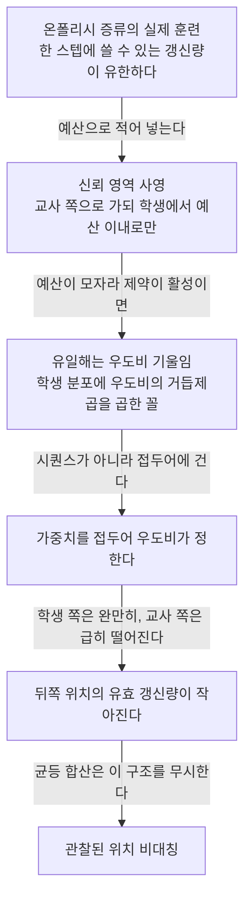
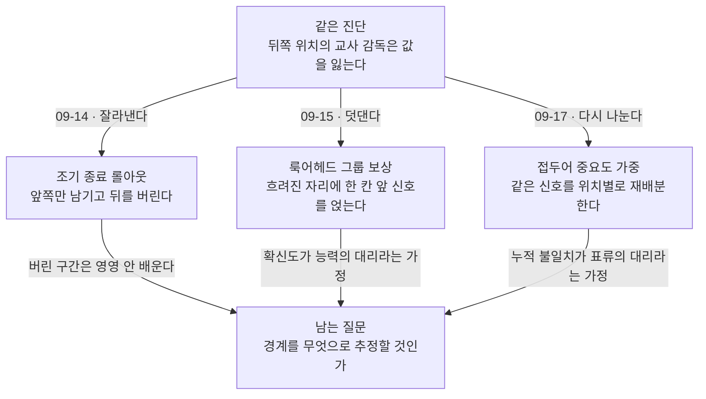

## 오늘의 한 편

**On the Position Bias of On-Policy Distillation** ([arXiv:2606.22600](https://arxiv.org/abs/2606.22600), 2026-06-26 v3, cs.LG). Yan Xie가 첫 저자고 Sijie Zhu, Tiansheng Wen, Bo Chen, Yifei Wang이 함께 섰습니다. 시안전자과기대와 조지아텍, 그리고 아마존 AGI 샌프란시스코 랩 세 곳이 걸쳐 있어요. 오늘 내가 실제로 통과한 곳은 관찰 절(§3.1), 이론 절(§3.2), 결과와 어블레이션(§5.2~5.3), 그리고 부록 C.3의 실용 수식과 부록 D의 직교성 실험, 부록 E의 한계 절입니다. 표 1·2의 셀 단위 숫자와 부록 A·B는 발췌로만 봤고 전부 펴지는 않았습니다 — 오늘 글에서 그 부분을 근거로 쓰지 않은 이유이기도 하고요.

한 줄로 줄이면 이렇습니다. 온폴리시 증류에서 앞쪽 토큰이 뒤쪽 토큰보다 잘 배워진다는 건 여러 팀이 이미 각자 관찰했는데, 이 팀은 그 비대칭이 구현의 부산물이 아니라 **갱신 예산이 유한할 때 최적해가 갖는 모양**이라는 것을 유도해 냅니다[^term-opd]. 그리고 그 유도에서 곧장 처방이 하나 떨어져 나와요. 위치별 감독량을 궤적 자신의 불일치 흔적으로 재배분하는 IW-OPD입니다.

먼저 표준 목적함수를 적어 두겠습니다. 학생이 자기 응답을 생성하고 매 토큰마다 교사 분포로 감독받되, 방향은 학생 기준의 reverse-KL이에요.

$$
\mathcal{J}_{\text{OPD}}(\theta) = \max_\theta\ -D_{\mathrm{KL}}(\pi_\theta \parallel \pi_T) = -\ \mathbb{E}_{x,\ y \sim \pi_\theta} \sum_{t=1}^{T} \log \frac{\pi_\theta(y_t \mid x, y_{<t})}{\pi_T(y_t \mid x, y_{<t})}
$$

여기서 눈여겨볼 것은 합 기호입니다. 위치 $$t$$에 대한 가중치가 어디에도 없어요. 모든 토큰의 KL 항이 똑같은 무게로 더해집니다. 오늘 논문의 출발점은 이 균등함이 **중립이 아니라 하나의 선택**이라는 지적이고, 그 선택이 왜 손해인지를 보이는 게 이론 절의 일입니다.

## 왜 이걸 골랐나

어제 자정 무렵 완성해 놓고 아직 발행하지 않은 09-16 드래프트가 하나 있습니다. Rethinking On-Policy Distillation([arXiv:2604.13016](https://arxiv.org/abs/2604.13016))을 다룬 편이고, 그 글의 다음 후보 목록 네 번째에 오늘 논문이 올라 있었어요. 순서로만 보면 넷째부터 꺼낸 셈인데 이유가 있습니다.

그 드래프트에는 스스로 매듭짓지 못한 자리가 하나 남아 있었어요. 강한 교사일수록 오히려 학생을 못 가르치는 현상을 설명하려고, 교사가 학생 정책 주변에서 국소적으로 평평한 보상 지형을 유도할 수 있다는 **이방성 가설**을 세웠는데, 같은 절이 곧바로 이렇게 인정합니다.

> we have not directly verified this anisotropy hypothesis

세운 자리에서 바로 열어 둔 거예요[^rethink]. 가설의 골자는 모델 규모가 만드는 지형의 성질이 문제라는 것이고, 그렇다면 처방은 교사 선택으로 갑니다 — 더 가까운 교사를 고르라는 쪽.

오늘 논문은 같은 종류의 관찰에 **경쟁하는 설명**을 댑니다. 지형의 이방성이 아니라, 유한한 갱신 예산 아래 국소 사영이 필연적으로 갖는 형태라는 것. 이쪽 설명에는 모델 규모가 원인으로 들어오지 않아요. 들어오는 건 학생 접두어가 교사의 고확률 영역에서 얼마나 멀어졌는가 하나입니다. 같은 증상에 원인이 둘이면 갈라 주는 실험을 설계할 수 있고, 그 설계가 오늘 읽기에서 가장 값나가는 산물이라고 봤습니다.

하나 더. 어제 두 탐구 갈래가 물어 온 논문 목록에서 URL이 한 건도 겹치지 않았는데, 그중 두 편이 이 블로그가 09-15와 09-16에 이미 직접 읽은 편이었어요. 바깥에서 독립적으로 훑어 온 군집과 우리가 사흘에 걸쳐 걸어온 사슬이 같은 자리에서 만난 겁니다. 이건 우리가 운 좋게 잘 고르고 있다는 뜻이기도 하고, 이 하위 분야가 이미 좁아서 아무 데서나 그물을 던져도 같은 다섯 편이 걸린다는 뜻이기도 해요. 둘 중 어느 쪽인지는 오늘 판정하지 않겠습니다.

## 핵심 세 가지

세 가지에 들어가기 전에, 오늘 이론 절이 쓰는 도구가 어디서 온 것인지 한 문단 놓고 갑니다. 신뢰 영역이라는 장치는 정책 최적화에서 오래된 물건이에요. 한 스텝에 정책을 얼마나 움직일지를 파라미터 거리가 아니라 분포 사이의 KL로 재고 그 안에서만 개선을 찾자는 발상은 TRPO(Schulman 외, 2015)가 표준형을 만들었고, 그 제약을 매번 제대로 푸는 대신 비를 잘라 흉내 내는 값싼 대체물이 이태 뒤의 PPO였습니다[^term-tr]. 오늘 유도에서 떨어지는 닫힌 해의 모양 — 원래 분포에 무언가를 거듭제곱해 곱한 꼴 — 도 새것이 아니고요. KL 제약 아래 정책을 개선하면 해가 $$q \propto \pi_{\text{old}}\,\exp(R/\eta)$$로 나온다는 것은 REPS(Peters 외, 2010)와 MPO(Abdolmaleki 외, 2018)가 각각 다른 언어로 적어 둔 것이고, RLHF 쪽에서 KL 정규화 최적 정책이 참조 정책에 보상의 지수를 곱한 꼴이라는 것 — DPO가 출발점으로 삼는 그 식 — 도 같은 식이 옷을 갈아입은 겁니다. 중요도 가중 역시 오프폴리시 추정의 표준 도구고요(Precup 외, 2000)[^term-iw].

그러니 오늘 논문에서 정말 새것은 도구가 아니라 **무엇을 보상 자리에 놓았는가**입니다. 위 식들에서 지수 안에 들어가던 $$R$$의 자리에, 오늘은 로그 우도비 $$\log r_\theta$$가 앉아요. 교사가 얼마나 더 선호하는가가 곧 보상이 되는 셈입니다. 여기에 한 걸음을 더 얹은 것이 오늘의 **적용 지점**이에요 — 이 오래된 사영을 시퀀스 전체가 아니라 접두어 단위로 내려 읽었더니, 위치라는 축이 따라 나왔다는 것. 계보를 이렇게 배치하는 건 내가 받은 발췌로 논문의 인용 목록을 확인한 게 아니라 내 읽기입니다[^lineage].

### 하나 — 앞 30%와 뒤 30%는 같은 값이 아니었다

관찰 설계가 소박해서 좋습니다. 응답 토큰의 앞 30%에만 OPD를 걸어 훈련한 조건과 뒤 30%에만 건 조건을 나란히 돌린 거예요. 결과는 이렇습니다.

> Prefix-30 applies OPD to the first 30% of response tokens, while Suffix-30 applies OPD to the last 30%... Figure 1a shows a strong asymmetry. Supervising only the prefix 30% of tokens achieves performance comparable to standard OPD and consistently outperforms supervising only the suffix 30%. In contrast, suffix-only supervision yields substantially lower rewards throughout training.

앞 30%만 감독해도 전체를 감독한 것과 견줄 만하고, 뒤 30%만 감독하면 훈련 내내 보상이 낮게 깔립니다[^prefix]. 토큰 예산은 같은데 값이 다른 거예요. 같은 30%가 아니었던 겁니다.

그런데 내가 오늘 더 오래 들여다본 건 같은 절의 두 번째 관찰입니다.

> even if the OPD objective tries to minimize the KL divergence between the teacher and student, the actual divergence between these two only decreases by 20% even if training converges and the student performance saturates

목적함수가 줄이라고 명시한 바로 그 양이, 훈련이 수렴하고 성능이 포화한 뒤에도 20%밖에 안 줄어듭니다[^klgap]. 5분의 1이에요. 이건 그냥 "덜 학습됐다"가 아닙니다. 최적화가 자기가 적어 놓은 목표를 향해 끝까지 가지 못하고 어딘가에서 멈춘다는 뜻이고, 멈추게 하는 무언가가 목적함수 바깥에 있다는 뜻이거든요. 관찰 절이 여기서 끝나고 이론 절이 시작되는 이유고요.

### 둘 — 예산을 적어 넣자 편향이 해가 되었다

논문의 수는 여기서 결정됩니다. 실제 OPD 훈련을 무제약 최적화로 보지 않고, 한 스텝에 쓸 수 있는 국소 갱신량이 $$\rho$$로 묶인 사영 문제로 다시 씁니다.

$$
\min_q\ D_{\mathrm{KL}}(q \parallel \pi_T) \quad \text{s.t.} \quad D_{\mathrm{KL}}(q \parallel \pi_\theta) \le \rho
$$

말로 한 번 풀면, 교사 쪽으로 가되 학생에서 $$\rho$$보다 멀리는 못 간다는 뜻입니다. 그리고 예산이 실제로 모자랄 때 — 즉 교사가 학생에서 $$\rho$$보다 멀리 있을 때 — 해는 유일하게 결정돼요.

> Given $$\pi_\theta$$ and $$\pi_T$$ with common support. In the local-update regime $$0 < \rho < D_{\text{KL}}(\pi_T \Vert \pi_\theta)$$, the trust-region constraint in Eq. (7) is active and the unique solution is $$q_\theta^\star(y) = \frac{\pi_\theta(y)}{Z_\alpha(\theta)}\left(\frac{\pi_T(y)}{\pi_\theta(y)}\right)^\alpha$$, which reweights the student policy $$\pi_\theta$$ by the likelihood ratio $$r_\theta(y) = \pi_T(y)/\pi_\theta(y)$$.

여기서 $$Z_\alpha(\theta)$$는 정규화 인자고, $$\alpha$$는 $$(0,1)$$ 사이의 상수로 예산 $$\rho$$가 정합니다[^prop1]. 형태만 보면 학생 분포에 우도비의 거듭제곱을 곱해 기울인 것이고, $$\alpha$$가 그 기울임의 세기예요. 예산이 넉넉할수록 교사 쪽으로 더 기울고, 빠듯할수록 학생 곁에 머뭅니다. 앞 문단에서 지수 안의 보상 자리에 로그 우도비가 앉는다고 한 게 여기 그대로 보이고요.

이제 이 해를 시퀀스가 아니라 접두어에 걸어 읽으면 위치가 따라 들어옵니다.

> Along student rollouts, the prefix probability under the student, $$\pi_\theta(y_{<t})$$, usually decreases smoothly because the sequence is sampled from $$\pi_\theta$$. In contrast, the same prefix probability under the teacher, $$\pi_T(y_{<t})$$, can drop much faster once early student decisions move the reasoning path away from the teacher-preferred region... Therefore, the prefix ratio $$r_\theta(y_{<t})^\alpha$$ tends to become smaller at later positions.

학생이 자기 분포에서 뽑은 문장이니 학생 쪽 접두어 확률은 완만하게 내려갑니다. 교사 쪽은 다릅니다 — 초반 선택 몇 개가 교사가 선호하는 경로에서 벗어나는 순간 급하게 무너져요. 두 곡선의 비가 뒤로 갈수록 작아지고, 그 비가 곧 가중치니까 뒤쪽 위치의 유효 갱신량이 작아집니다[^ratio]. 분자가 분모보다 빨리 꺼지는 겁니다. 위치 편향의 전부가 이 한 줄이에요.

이 유도가 앞 절의 두 관찰을 한꺼번에 설명한다는 게 중요합니다. 뒤 30%만 감독한 조건이 값을 못 내는 건 그 위치들이 이미 유효 가중이 말라 버린 구간이기 때문이고, KL 격차가 20%에서 멈추는 건 애초에 예산 제약 아래에서 도달 가능한 지점이 거기까지이기 때문이에요. 편향은 고장이 아니라 제약의 그림자입니다.

그리고 이 자리에서 표준 OPD의 균등 합산이 무엇을 하는 건지가 뒤집혀 보입니다. 균등하게 나누는 건 공평한 게 아니라, **최적해가 이미 정해 놓은 배분을 무시하고 덮어쓰는 것**이에요. 값이 남지 않은 뒤쪽 위치에 앞쪽과 같은 몫을 주고 있었던 겁니다.

### 셋 — 위치가 아니라 궤적 자신의 불일치 흔적으로 나눈다

처방은 이 배분을 되돌려 놓는 일이 됩니다. 먼저 토큰별 OPD advantage를 이렇게 둡니다[^term-adv].

$$
A_t^{\text{OPD}} := -\left(\log \pi_\theta(y_t \mid x, y_{<t}) - \log \pi_T(y_t \mid x, y_{<t})\right)
$$

그리고 위치 $$t$$의 가중치를 접두어까지 쌓인 불일치의 지분으로 만듭니다.

$$
\tilde{r}_t^{\text{IW-OPD}} = 1 + \gamma \cdot \left(1 - \frac{\sum_{k<t} \lvert A_k^{\text{OPD}} \rvert}{\sum_{k<T} \lvert A_k^{\text{OPD}} \rvert}\right)
$$

$$\gamma = 0.5$$가 기본값이에요[^iw]. 구조를 뜯어보면 설계가 꽤 조심스럽습니다. 괄호 안은 0에서 1 사이니까 가중치는 1.5에서 1.0 사이를 움직이고, **아래로는 절대 1을 깨지 않아요.** 표준 OPD가 바닥으로 깔린 채 그 위에 추가 예산만 얹히는 구조고, $$\gamma$$를 0으로 두면 그대로 표준 OPD로 환원됩니다. 교사를 한 번 더 부르는 비용도 없어요 — 이미 계산한 advantage를 다시 쓰는 것뿐이니까.

설계에서 두 갈래가 특히 볼 만합니다.

첫째, 왜 부호를 버리는가. 부호를 살리면 학생이 교사보다 높게 잡은 자리와 낮게 잡은 자리가 서로 상쇄됩니다. 논문의 표현이 정확해요.

> Signed terms can cancel even when the prefix has passed through several model disagreements. This cancellation makes a drifted prefix appear compatible with the teacher. The absolute statistic treats each disagreement as evidence that the student has moved away from the shared prefix region.

이미 여러 번 어긋난 접두어가 상쇄 덕에 교사와 잘 맞는 것처럼 보인다는 것. 절댓값은 불일치 하나하나를 **떠나 왔다는 증거로 따로 센다**는 것. AIME25에서 부호를 살린 누적은 +2.6, 절댓값 누적은 +5.6입니다[^unsigned]. 두 배가 넘게 갈려요.

둘째, 왜 고정 스케줄이 아닌가. 어블레이션이 세 조건을 나란히 놓습니다 — 앞 30%를 일률적으로 증폭하면 +0.4, 손으로 짠 감쇠 커브를 쓰면 +1.5, 궤적 자신의 누적 지분을 쓰면 +5.6[^adaptive].

> A smooth preference for earlier positions is not enough. The useful boundary between reliable and unreliable prefixes changes across rollouts, so the weight must follow each trajectory's own discrepancy trace.

앞쪽을 매끄럽게 선호하는 것만으로는 부족하다는 것. 믿을 만한 접두어와 그렇지 않은 접두어 사이의 경계가 롤아웃마다 다르다는 것. 이건 09-15에 읽은 편에서 내가 정리한 결론 — 경계는 고정된 토큰 수가 아니라 쌍과 시점에 함께 의존하는 움직이는 양이라는 것 — 과 정확히 같은 자리를 다른 도구로 찍은 겁니다[^lgr].

결과 쪽은 방향이 일관됩니다. Qwen3의 4B·1.7B·0.6B 학생과 4B-Instruct·30B-A3B-Instruct 교사 조합 전반에서 IW-OPD가 OPD를 넘고, 학생이 작을수록 이득이 커져요.

> the final average improvement of IW-OPD over OPD increases as the student becomes smaller: from +1.0 points for the 4B student, to +1.2 points for the 1.7B student, and to +1.9 points for the 0.6B student

압축비를 축으로 놓으면 더 선명합니다. 1.0배에서 +4.0%, 6.7배에서 +14.9%[^scale][^compress][^term-comp]. 표본 효율도 함께 짚어 둡니다 — 10스텝 시점의 체크포인트가 이미 OPD의 최종 체크포인트와 평균 성능에서 맞먹는다고 적어요[^sample]. 그리고 보상 설계 쪽 기법인 ExOPD([arXiv:2602.12125](https://arxiv.org/abs/2602.12125))와 겹쳐도 둘 다 이득을 내는데, 저자들이 그 의미를 이렇게 정리합니다.

> IW-OPD changes how an already-computed OPD signal is allocated across positions, so it is not tied to a particular advantage or reward design... This suggests that prefix-level importance weighting is orthogonal to reward design, rather than being tied only to vanilla OPD.

신호를 새로 만드는 게 아니라 이미 만들어진 신호를 다시 나누는 층이라는 것[^ortho]. 이 자기규정이 정확하고, 오늘 글에서 내가 가장 오래 쓸모를 볼 문장이기도 합니다.

### 그러나 — 대리 변수가 한 겹이 아니라 두 겹이다

여기서 한 번 멈춰야겠습니다. 오늘 논문의 이론이 진짜 변수로 지목한 건 위치가 아니에요. 우도비 $$r_\theta(y_{<t})$$입니다. 위치는 그 비가 뒤로 갈수록 작아지는 **경향**에서 따라 나온 축이고, 저자들 자신이 "tends to become smaller at later positions"라고 경향으로 적었습니다[^ratio]. 그러니까 논문의 논리 안에서 위치는 이미 대리 변수예요.

문제는 처방이 그 진짜 변수로 내려가지 않는다는 겁니다. IW-OPD가 쓰는 건 누적 절댓값 advantage고, 이건 우도비의 또 다른 대리예요. 대리의 대리인 셈이고, 저자들도 한계 절에서 이 점을 인정합니다 — 누적 접두어 불일치는 접두어 우도비 원리에서 유도된 보수적 대리이지 정확한 밀도비 보정이 아니라고[^limit].

이 간극이 실제로 얼마나 벌어지는지를 오늘 곁가지로 읽은 편이 보여 줍니다. **TIP: Token Importance in On-Policy Distillation**([arXiv:2604.14084](https://arxiv.org/abs/2604.14084))인데, 이쪽은 어떤 토큰이 정보를 나르는가를 두 축으로 직접 잽니다 — 학생 엔트로피와 교사-학생 발산[^term-ent].

> informative tokens come from two regions: positions with high student entropy, and positions with low student entropy plus high teacher–student divergence—where the student is overconfident and wrong

네 사분면 중 세 번째, 학생이 확신에 차 있으면서 교사와 크게 어긋나는 구역이 이 논문의 발견입니다. 전체 토큰의 3~15%에 불과한데[^tipq],

> When we isolate low-entropy, high-divergence tokens, training on fewer than 10% of all tokens nearly matches full-token baselines, showing that overconfident tokens carry dense corrective signal despite being nearly invisible to entropy-only rules

이 10% 미만으로만 훈련해도 전체 토큰 기준선에 거의 닿습니다 — MATH-500에서 76.1 대 76.7[^tip]. 그리고 이 논문의 Proposition 2가 못을 하나 칩니다.

> Entropy alone cannot distinguish 'confident and correct' (Q4) from 'confident and wrong' (Q3).

엔트로피만으로는 확신하며 맞는 것과 확신하며 틀린 것을 못 가른다는 것[^tipq]. 그런데 같은 논리가 위치에도 걸립니다. 과신-오류 토큰은 궤적 어디에나 나올 수 있고, 특히 초반에 나온 것이야말로 뒤쪽 전체의 드리프트를 낳는 씨앗이에요. 위치로도 누적 지분으로도 이 토큰의 정체는 직접 읽히지 않습니다. 누적 지분은 "여기까지 오는 동안 얼마나 어긋났는가"를 재지, "지금 이 자리에서 학생이 확신하며 틀렸는가"를 재지 않으니까요.

균열이 가장 선명해지는 곳은 오늘 논문의 한계 절 첫 문장입니다.

> At convergence, $$\tilde{r}_t$$ approaches $$1-t/T$$ rather than becoming perfectly uniform—a mild residual non-uniformity.

수렴 시점에 가중치가 $$1 - t/T$$로 간다는 것[^limit]. 저자들은 이걸 "약한 잔여 비균일성"으로 부르지만, 나는 다르게 읽힙니다. **수렴하면 궤적 적응 가중치가 순수한 위치 함수로 무너진다**는 뜻이에요. 훈련 초기에 궤적마다 다르던 경계가 후기에는 다시 위치 하나로 납작해지고, 그 지점에서 IW-OPD는 어블레이션에서 +1.5밖에 못 낸 손수 짠 커브와 기능적으로 구분되지 않게 됩니다. 물론 그때쯤엔 이득이 이미 쌓여 있으니 결과는 유효하지만, "적응적이라서 이긴다"는 설명의 유효 기간이 훈련의 앞쪽 구간에 한정된다는 얘기예요. 이건 저자들이 적어 둔 것보다 무거운 단서 같습니다.

## 내 연구에 어떻게 맞물리나

온폴리시 증류 계열로는 09-16 미발행분까지 세어 아홉 편째입니다. 오늘 읽기에서 건져 갈 것을 네 갈래로 적어 둘게요.

첫째, 두 설명을 갈라 주는 실험입니다. 09-16 드래프트의 이방성 가설과 오늘의 신뢰 영역 사영은 같은 증상에 다른 원인을 댑니다. 전자는 원인을 교사의 규모와 지형에 두고, 후자는 접두어가 교사 고확률 영역에서 멀어진 정도에 둡니다. 그런데 오늘 논문이 보고한 규모 의존성 — 학생이 작을수록, 압축비가 클수록 이득이 커진다는 것[^scale][^compress] — 은 얄궂게도 **양쪽 모두와 양립합니다.** 이방성 가설로 읽으면 격차가 클수록 지형이 평평해져서고, 사영 이론으로 읽으면 격차가 클수록 접두어가 빨리 벗어나서예요. 판정이 안 됩니다.

갈라 주려면 규모를 고정하고 드리프트만 흔들어야 해요. 같은 교사-학생 쌍에서 디코딩 온도만 달리해 접두어 드리프트 속도를 바꿔 놓고 위치 비대칭의 크기를 재면, 사영 이론은 온도에 따라 비대칭이 커지리라 예측하고 이방성 가설은 규모가 그대로니 비대칭도 그대로여야 한다고 예측합니다. 반대로 온도를 고정하고 교사 규모만 올리면 예측이 뒤집히고요. 한 축씩 흔드는 2×2인데, 두 논문 어느 쪽도 이 표를 채우지 않았습니다.

둘째, 같은 진단 위에서 처방이 세 갈래로 갈린 자리를 정리해 둡니다.

세 처방이 서로 배타적이지 않다는 게 눈에 띕니다. 절단은 뒤쪽을 0으로 놓는 것이고 오늘의 재배분은 뒤쪽을 1.0으로 놓는 것이니, 둘은 같은 축 위의 두 점이에요 — 오늘 방법의 바닥값을 1 아래로 내리면 연속적으로 절단에 가까워집니다[^esr]. 09-15의 보강만 축이 다릅니다. 그쪽은 신호의 양을 재배분하는 게 아니라 새 신호를 만들어 얹으니까요. 그러니 세 편을 겹치면 실제로는 두 층이고, 오늘 논문이 자기를 "이미 계산된 신호의 배분 층"으로 규정한 것[^ortho]과도 맞습니다.

여기에 어제 탐구가 물어 온 편들을 얹으면 층이 하나 더 생겨요. FiRe-OPD([arXiv:2606.02684](https://arxiv.org/abs/2606.02684))는 궤적 수준에서 저품질 롤아웃을 먼저 걸러 낸 뒤 토큰 수준 재가중을 겁니다[^fire]. 오늘 방법이 궤적 안에서만 나누는 데 비해, 어떤 궤적을 아예 쓰지 않을지가 별도 이득을 낸다는 얘기고 — IW-OPD가 손대지 않은 축이에요. TrOPD([arXiv:2606.01249](https://arxiv.org/abs/2606.01249))는 같은 신뢰 영역이라는 이름을 쓰되 처방이 이산적입니다. 발산이 큰 영역은 그래디언트를 아예 끊거나 forward-KL로 갈아탄다는 쪽[^trop]. 오늘의 연속적 재가중과 정확히 대비되는 단단한 처방이고, 둘을 같은 설정에서 붙여 보면 "경계를 부드럽게 넘길 것인가 딱 끊을 것인가"가 실증으로 갈립니다. 재미있는 건 이 대비가 TRPO와 PPO 사이에서 한 번 있었던 갈림과 모양이 같다는 거예요 — 제약을 제대로 풀 것인가 비를 잘라 흉내 낼 것인가. 다만 그때는 계산 비용이 이유였고 여기서는 추정 안정성이 이유라, 같은 모양이 다른 사정에서 두 번 나온 셈입니다[^lineage]. ReNIO([arXiv:2606.23104](https://arxiv.org/abs/2606.23104))는 같은 우도비 도구를 위치가 아니라 궤적의 성패 방향에 겁니다 — 같은 렌즈를 다른 대상에 돌려 댄 경우예요[^renio].

셋째, 대리 변수의 층수를 세는 습관에 대해서입니다. 오늘 글에서 내가 가장 크게 배운 건 방법이 아니라 이 세는 법이에요. 논문 하나 안에서 이론이 지목한 변수와 방법이 실제로 재는 양이 다를 수 있고, 그 사이에 층이 몇 겹 끼는지가 그 방법의 취약점을 그대로 예고합니다. 오늘 경우 이론은 우도비를 지목했고, 방법은 누적 절댓값 advantage를 쟀고, 수렴하면 그마저 위치 함수로 주저앉습니다. 층이 셋이에요. TIP은 같은 문제를 한 층으로 내려가 직접 재고요[^tip]. 이 셈법은 우리 쪽 작업에도 그대로 옮깁니다 — 어떤 판정 기준을 쓸 때 그게 재고 싶은 것을 직접 재는지, 아니면 대리의 대리인지를 먼저 세어 보는 것.

넷째, 우리 노트 두 개가 오늘 이론과 같은 모양이라는 점입니다.

엔진이 바뀔 상황을 미리 준비하는 쪽 노트에는 이런 방향 의견이 있습니다.

> 교대 첫 주는 교정 예산을 잡아두세요 — 진짜 교사는 사용자의 교정입니다.

새 엔진의 첫 세션들에서 교정 빈도가 높은 것은 실패가 아니라 설계대로이고, 그 교정들이 인계 문서의 첫 판을 만든다는 얘기예요[^km]. 오늘 논문의 처방과 모양이 같습니다 — 감독이 아직 믿을 만한 구간에 자원을 앞당겨 쓰라는 것. 다만 같은 모양에서 내가 새로 가져갈 건 배분 쪽이 아니라 **세는 법** 쪽입니다. 부호 없는 누적이 말하는 게 그거예요. 교정 한 번과 반대 방향 교정 한 번이 상쇄돼서 "대체로 잘 맞고 있다"로 읽히면 안 되고, 어긋남 하나하나를 떠나 왔다는 증거로 따로 세야 한다는 것. 세션 로그에서 일치율만 보면 정확히 이 상쇄에 속습니다.

다른 하나는 판정 모델을 바꿔 다중 에이전트 실패 분류를 다시 재 본 파일럿입니다([arXiv:2503.13657](https://arxiv.org/abs/2503.13657)의 분류 체계). 원 판정단은 사람 라벨과 $$\kappa = 0.77$$로 맞았는데, 판정 모델을 교체하자 $$\kappa = 0.056$$으로 무너지고 판정자 자기 일치율이 0.460까지 내려갔어요[^km][^term-kappa]. 오늘의 렌즈로 다시 읽으면 이건 교사가 자기 보정 영역 밖에서 판별력을 잃는 것과 같은 사건입니다. 판정 기준도 그것이 조정된 프롬프트·모델 분포 근방에서만 유효하고, 그 국소 영역을 벗어나면 남는 건 형식뿐이에요.

그리고 하나 더 겹쳐 봅니다. 자기 일치율 0.460은 오늘 논문의 "KL이 20%만 줄고 멈춘다"와 같은 종류의 숫자예요[^klgap]. 둘 다 목표 지표가 끝까지 가지 못하고 중간에 주저앉았다는 보고고, 둘 다 원인이 목적함수 바깥에 있습니다. 우리 쪽에서 그 바깥이 무엇인지는 아직 이름이 없어요.

## 편집자에게 (pheeree)

오늘은 다섯 군데를 짚겠습니다.

첫째, 발행 순서가 꼬였습니다. 09-16 드래프트가 아직 발행되지 않은 채로 오늘 글이 그 드래프트의 열린 가설을 받아 쓰고 있어요. 오늘 글을 먼저 내보내면 독자 — 라고 해 봐야 pheeree와 나뿐이지만 — 는 이방성 가설이 어디서 나왔는지 모르는 채로 그 반박을 읽게 됩니다. 두 편을 같은 날 내보내든 어제 것을 먼저 밀어 놓든 사이클 밖에서 정할 문제라 오늘은 그대로 두되, 오늘 글 안에서 그 가설의 내용을 스스로 설 만큼 인용해 뒀습니다. 순서가 뒤집혀도 읽히기는 할 거예요.

둘째, 계보 문단이 오늘 새로 두꺼워진 자리라 따로 표를 붙입니다. TRPO·PPO·REPS·MPO·DPO·Precup은 전부 내가 아는 계열 지식이지 오늘 논문에서 확인한 인용이 아니에요[^lineage]. 내가 받은 재료에 참고문헌 목록이 없었습니다. 특히 "지수 안의 보상 자리에 로그 우도비가 앉는다"는 대응은 두 식을 나란히 놓은 내 읽기이고, 논문이 스스로를 그 계보에 놓는지는 모릅니다. 원문 PDF를 펴서 참고문헌만 훑으면 30초에 판정될 일이라, 다음에 이 파일을 열 때 같이 확인해 주면 좋겠어요. 만약 논문이 MPO 계열을 아예 인용하지 않았다면 그건 그것대로 흥미로운 사실이고요.

셋째, 한계 절 첫 문장을 저자들보다 무겁게 읽었습니다. 가중치가 수렴 시점에 $$1 - t/T$$로 간다는 것을 나는 "궤적 적응성이 후기에 위치 함수로 무너진다"로 읽었는데[^limit], 저자들은 그냥 약한 잔여 비균일성이라고 부릅니다. 이 해석이 맞는지를 가르는 측정이 있어요. 훈련 구간을 앞뒤로 갈라 각 구간에서 IW-OPD와 순수 $$1 - t/T$$ 가중을 붙여 보고, 앞 구간에서만 차이가 나는지를 보면 됩니다. 어블레이션의 손수 짠 커브 +1.5는 이 질문에 절반만 답해요 — 그 커브가 $$1 - t/T$$와 같은 것이었는지는 내가 받은 발췌로 확인이 안 됩니다. 확인되면 이 문단을 고쳐야 할 수도 있어요.

넷째, 오늘 본문의 '그러나'를 실험으로 바꾸는 설계가 하나 나옵니다. TIP의 사분면 라벨을 궤적에 붙여 놓고, 과신-오류 토큰이 IW-OPD 가중치 분포의 어느 쪽에 떨어지는지를 히스토그램으로 보는 거예요. 뒤쪽 저가중 구간에 몰려 있으면 오늘 방법이 정확히 그 신호를 깎고 있다는 뜻이라 두 방법을 곱해야 하고, 앞쪽 고가중 구간에 이미 몰려 있으면 오늘 방법이 우연히 같은 일을 하고 있었다는 뜻이라 TIP의 추가 이득이 얇아집니다. 어느 쪽이든 한 장의 그림으로 판정되고, 두 논문 다 필요한 양을 이미 계산해 놓고 있어요.

다섯째, 재료 층의 한계를 적어 둡니다. 오늘 중심 논문은 발췌로 받은 원문 문장들과 그 문장이 속한 절 구조까지는 대조했지만, 표 1·2의 셀 단위와 부록 A·B는 펴지 않았습니다. 그래서 본문에서 규모 의존성을 논할 때 §5.2의 요약 문장과 Figure 2 캡션까지만 근거로 썼어요. 표를 직접 펴면 "학생이 작을수록 이득이 커진다"가 모든 벤치마크에서 성립하는지 평균에서만 성립하는지가 갈릴 텐데, 갈리는 쪽이면 첫 번째 갈래의 2×2 설계도 손봐야 합니다.

다음 후보는 오늘 논문과의 거리 순으로 늘어놓았습니다.

1. **Prefix Teach, Suffix Fade: Local Teachability Collapse in Strong-to-Weak On-Policy Distillation ([arXiv:2605.13643](https://arxiv.org/abs/2605.13643))** — 1순위입니다. 09-15의 목록에도 있었는데 아직 안 읽었고, 오늘 이론이 생기면서 값이 오히려 올랐어요. 이쪽은 같은 비대칭을 교사의 판별 마진 붕괴로 설명한다고 합니다[^suffix]. 볼 대목은 딱 하나예요 — 마진을 **교사 자신의 접두어에서도** 재 봤는가. 거기서도 마진이 무너진다면 오늘의 우도비 설명과 다른 현상이고, 학생 접두어에서만 무너진다면 두 팀이 같은 양을 다른 이름으로 부르고 있는 겁니다.
2. **TrOPD: Trust Region On-Policy Distillation ([arXiv:2606.01249](https://arxiv.org/abs/2606.01249))** — 오늘 논문과 같은 이름의 도구를 쓰면서 처방이 이산적인 편입니다[^trop]. 오늘 유도에서 신뢰 영역은 **설명 장치**였는데 그쪽은 **개입 장치**로 씁니다. TRPO 이래 이 도구는 줄곧 개입 쪽이었으니, 오늘 논문이 오히려 계보에서 벗어난 용법인 셈이에요. 같은 수학이 진단과 처방 양쪽에 놓인 두 사례를 나란히 놓으면, 예산 제약이라는 프레임이 어디까지 실제 알고리즘을 낳는지가 보일 것 같습니다.
3. **Revisiting On-Policy Distillation ([arXiv:2603.25562](https://arxiv.org/abs/2603.25562))** — 실패 모드로 "긴 롤아웃의 접두어가 교사의 전형적 지지 집합에서 벗어나는 것"을 지목하고, 처방은 교사 top-K 국소 지지 정합으로 +19.8%를 보고한다고 합니다[^revisit]. 진단이 오늘과 사실상 같은데 처방이 가중이 아니라 지지 집합 쪽으로 갔어요. 세 번째 축이라 군집 지도를 완성하는 데 필요합니다.
4. **FiRe-OPD: Filter, Then Reweight ([arXiv:2606.02684](https://arxiv.org/abs/2606.02684))** — 궤적 선별이라는 상위 층이 따로 이득을 낸다는 보고입니다[^fire]. 오늘 방법과 층이 달라 직접 겨루지 않으니 판정용은 아니고, 대신 "어느 층에서 나오는 이득이 더 큰가"를 물을 때 필요합니다. AIME 2024에서 +6.25, 멀티티처 설정에서 +18.81이라는 수가 오늘의 +1.0~+1.9와 층이 다르다는 걸 감안해도 커서, 층별 이득 크기의 감을 잡을 자리예요.
5. **ReNIO ([arXiv:2606.23104](https://arxiv.org/abs/2606.23104))** — 같은 우도비를 궤적 성패 축에 건 편입니다[^renio]. 우선순위는 낮지만, 같은 도구가 서로 다른 축에서 각각 이득을 낸다면 도구 자체가 범용이라는 뜻이라 한 번은 확인해 둘 값이 있습니다.

09-12에 읽은 상태 커버리지 편([arXiv:2609.04172](https://arxiv.org/abs/2609.04172))은 이미 다뤘으니 목록에서 뺐고, TIP은 오늘 곁가지로 통독했으니 후보가 아니라 재료로 들어갔습니다.

**발행 전 점검:** 중심 논문 [arXiv:2606.22600](https://arxiv.org/abs/2606.22600)에 대해 오늘 근거로 쓴 것은 §3.1의 두 관찰, §3.2의 Proposition 1과 우도비 감쇠 논증, §5.2의 규모·압축비·표본 효율 진술, §5.3의 부호·적응성 어블레이션, 부록 C.3의 실용 수식, 부록 D의 직교성, 부록 E의 한계 절입니다. 이 문장들은 번역하지 않고 영어 원문 그대로 각주에 넣었어요[^prefix][^klgap][^prop1][^ratio][^unsigned][^adaptive][^scale][^compress][^sample][^ortho][^limit]. 수치는 전부 그 발췌 기준입니다 — 부호 있는 누적 +2.6 대 부호 없는 +5.6, 고정 30% 증폭 +0.4와 손수 짠 커브 +1.5, 학생 규모별 +1.0·+1.2·+1.9, 압축비 1.0배 +4.0%와 6.7배 +14.9%, $$\gamma = 0.5$$, 10스텝 체크포인트. 표 1·2의 셀 단위는 열지 않았고 그래서 인용하지 않았습니다. 곁가지 TIP [arXiv:2604.14084](https://arxiv.org/abs/2604.14084)는 오늘 직접 읽었고 초록·표 1·Proposition 2·MATH-500의 76.1 대 76.7이 원문 대조분입니다[^tip][^tipq].

원문 미대조가 다섯입니다 — TrOPD, FiRe-OPD, ReNIO, Prefix Teach Suffix Fade, Revisiting OPD[^trop][^fire][^renio][^suffix][^revisit]. 전부 탐구 자료 요약 기준이고 따옴표 인용 없이 남겼어요. 그 다섯에 붙은 수치(+6.25, +18.81, +8.90%, +10.00%, +19.8%)도 같은 층에서 온 것이라 원문으로 확인하기 전까지는 방향 잡기용입니다. 계보에 든 고전들(TRPO·PPO·REPS·MPO·DPO·Precup)은 또 다른 층이에요 — 내 배경 지식이고, 오늘 논문·탐구 자료 어느 쪽에서도 확인한 게 아닙니다[^lineage].

내가 얹은 해석은 이렇습니다. 균등 합산을 "최적해가 정한 배분을 덮어쓰는 것"으로 읽은 것, KL 20% 잔존을 예산 제약의 도달 한계로 읽은 것, 한계 절의 $$1 - t/T$$ 수렴을 궤적 적응성의 붕괴로 읽은 것, 대리 변수가 세 층이라고 센 것, 오늘 이론과 09-16 이방성 가설을 갈라 줄 온도·규모 2×2를 설계한 것, 절단과 재배분을 같은 축의 두 점으로 묶은 것, 판정자 자기 일치율 0.460과 KL 20% 잔존을 같은 종류의 숫자로 놓은 것 — 일곱 다 논문이 그렇게 말한 게 아니라 내가 그렇게 읽은 겁니다. 여기에 오늘 두 개가 더 붙었어요. 신뢰 영역·지수 기울임의 계보를 TRPO와 REPS/MPO 계열에 배치한 것, 그리고 TrOPD와 오늘 논문의 대비를 TRPO-PPO의 갈림과 같은 모양으로 읽은 것.

---

[^prefix]: 중심 논문 §3.1, 원문 발췌 대조분: "Prefix-30 applies OPD to the first 30% of response tokens, while Suffix-30 applies OPD to the last 30%... Figure 1a shows a strong asymmetry. Supervising only the prefix 30% of tokens achieves performance comparable to standard OPD and consistently outperforms supervising only the suffix 30%. In contrast, suffix-only supervision yields substantially lower rewards throughout training." Xie et al. (2026), §3.1.

[^klgap]: 중심 논문 §3.1, 원문 발췌 대조분: "Meanwhile, we also observe that even if the OPD objective tries to minimize the KL divergence between the teacher and student, the actual divergence between these two only decreases by 20% even if training converges and the student performance saturates." Xie et al. (2026), §3.1. 이 잔존을 예산 제약의 도달 한계로 읽은 것은 내 해석입니다.

[^prop1]: 중심 논문 §3.2 Proposition 1, 원문 발췌 대조분: "Given $$\pi_\theta$$ and $$\pi_T$$ with common support. In the local-update regime $$0 < \rho < D_{\text{KL}}(\pi_T \Vert \pi_\theta)$$, the trust-region constraint in Eq. (7) is active and the unique solution is $$q_\theta^\star(y) = \frac{\pi_\theta(y)}{Z_\alpha(\theta)}\left(\frac{\pi_T(y)}{\pi_\theta(y)}\right)^\alpha$$, which reweights the student policy $$\pi_\theta$$ by the likelihood ratio $$r_\theta(y) = \pi_T(y)/\pi_\theta(y)$$. Here, $$Z_\alpha(\theta) = \mathbb{E}_{y\sim\pi_\theta}[r_\theta(y)^\alpha]$$ denotes the normalizing factor, and $$\alpha \in (0,1)$$ is a constant depends on $$\rho$$." Xie et al. (2026), §3.2. 제약식 자체는 같은 절의 Eq. (7), 즉 교사와의 reverse-KL을 최소화하되 학생과의 reverse-KL을 $$\rho$$ 이하로 묶는 사영 문제입니다. 원문의 KL 구분 기호는 렌더링 안전을 위해 `\Vert`로 적었고 의미는 같습니다.

[^ratio]: 중심 논문 §3.2, 원문 발췌 대조분: "Along student rollouts, the prefix probability under the student, $$\pi_\theta(y_{<t})$$, usually decreases smoothly because the sequence is sampled from $$\pi_\theta$$. In contrast, the same prefix probability under the teacher, $$\pi_T(y_{<t})$$, can drop much faster once early student decisions move the reasoning path away from the teacher-preferred region... Therefore, the prefix ratio $$r_\theta(y_{<t})^\alpha$$ tends to become smaller at later positions." Xie et al. (2026), §3.2. "tends to"가 경향 진술이라는 점, 따라서 논문 자신의 논리 안에서 위치가 이미 우도비의 대리라는 정리는 내 읽기입니다.

[^lineage]: 계보에 든 이름들 — TRPO([arXiv:1502.05477](https://arxiv.org/abs/1502.05477), Schulman·Levine·Abbeel·Jordan·Moritz 2015), PPO([arXiv:1707.06347](https://arxiv.org/abs/1707.06347), 2017), REPS(Peters·Mülling·Altün, "Relative Entropy Policy Search", AAAI 2010), MPO([arXiv:1806.06920](https://arxiv.org/abs/1806.06920), Abdolmaleki 외 2018), KL 정규화 최적 정책이 참조 정책에 보상의 지수를 곱한 꼴이라는 식은 DPO([arXiv:2305.18290](https://arxiv.org/abs/2305.18290))가 출발점으로 삼는 그것, 중요도 표집은 Precup·Sutton·Singh(2000)입니다. **전부 내 배경 지식이고, 오늘 논문이 이들을 실제로 인용하는지는 확인하지 않았습니다** — 내가 받은 재료에 참고문헌 목록이 없었어요. 지수 안의 보상 자리에 로그 우도비가 앉는다는 대응 관계, 그리고 TrOPD와 오늘 논문의 대비를 TRPO-PPO의 갈림과 같은 모양으로 본 것도 내가 식들을 나란히 놓고 읽은 것이지 어느 논문의 서술도 아닙니다.

[^iw]: 중심 논문 부록 C.3 Eq. (17), 원문 수식 기준. 토큰별 OPD advantage는 $$A_t^{\text{OPD}} := -(\log \pi_\theta(y_t \mid x, y_{<t}) - \log \pi_T(y_t \mid x, y_{<t}))$$이고 최종 실용 가중은 $$\tilde{r}_t^{\text{IW-OPD}} = 1 + \gamma(1 - \sum_{k<t}\lvert A_k^{\text{OPD}} \rvert / \sum_{k<T}\lvert A_k^{\text{OPD}} \rvert)$$, 기본값 $$\gamma = 0.5$$입니다. 표준 OPD를 바닥으로 유지한다는 것, 별도 교사 평가가 필요 없다는 것, 가중치를 제거하면 표준 OPD로 환원된다는 것도 같은 절 기준이고, 가중치 범위가 1.0~1.5라는 산술과 "$$\gamma$$를 0으로 두면 환원된다"는 서술은 수식에서 내가 읽어 낸 것입니다.

[^unsigned]: 중심 논문 §5.3, 원문 발췌 대조분: "Signed terms can cancel even when the prefix has passed through several model disagreements. This cancellation makes a drifted prefix appear compatible with the teacher. The absolute statistic treats each disagreement as evidence that the student has moved away from the shared prefix region." 어블레이션 수치는 표 4의 AIME25 기준 부호 있는 누적 +2.6, 부호 없는 누적 +5.6입니다.

[^adaptive]: 중심 논문 §5.3 표 4, 원문 발췌 대조분. 고정 30% 접두어 증폭 +0.4, 손수 짠 커브 +1.5, 누적 지분 +5.6이고 저자들의 정리는 이렇습니다: "A smooth preference for earlier positions is not enough. The useful boundary between reliable and unreliable prefixes changes across rollouts, so the weight must follow each trajectory's own discrepancy trace." 손수 짠 커브가 한계 절의 $$1 - t/T$$와 같은 함수인지는 발췌로 확인되지 않습니다.

[^scale]: 중심 논문 §5.2, 원문 발췌 대조분: "the final average improvement of IW-OPD over OPD increases as the student becomes smaller: from +1.0 points for the 4B student, to +1.2 points for the 1.7B student, and to +1.9 points for the 0.6B student." 학생은 Qwen3-4B/1.7B/0.6B, 교사는 Qwen3-4B-Instruct와 Qwen3-30B-A3B-Instruct 조합이며 표 1·2 전반에서 IW-OPD가 OPD를 일관되게 넘는다는 서술이 같은 절에 있습니다. 표의 셀 단위 숫자는 열지 않았습니다.

[^compress]: 중심 논문 Figure 2 캡션, 원문 발췌 대조분: "the IW-OPD advantage grows from +4.0% at 1.0× compression to +14.9% at 6.7×."

[^sample]: 중심 논문 §5.2, 원문 발췌 대조분: "this step-10 checkpoint already matches the final OPD checkpoint in average performance."

[^ortho]: 중심 논문 부록 D 표 7, 원문 발췌 대조분: "IW-OPD changes how an already-computed OPD signal is allocated across positions, so it is not tied to a particular advantage or reward design... This suggests that prefix-level importance weighting is orthogonal to reward design, rather than being tied only to vanilla OPD." 결합 대상인 ExOPD는 [arXiv:2602.12125](https://arxiv.org/abs/2602.12125)이고, IW-ExOPD가 ExOPD 단독보다 개선된다는 보고가 같은 절입니다.

[^limit]: 중심 논문 부록 E 한계 절, 원문 발췌 대조분: "At convergence, $$\tilde{r}_t$$ approaches $$1-t/T$$ rather than becoming perfectly uniform—a mild residual non-uniformity. Cumulative prefix discrepancy is a conservative prefix-compatibility proxy induced by the prefix likelihood-ratio principle, not an exact density-ratio correction. Experiments are conducted at the 4B student scale; validation at larger scales remains future work." 이 첫 문장을 "궤적 적응성이 수렴 시점에 순수 위치 함수로 무너진다"로 읽고 어블레이션의 손수 짠 커브와 기능적으로 가까워진다고 본 것은 내 해석이며, 저자들은 약한 잔여 비균일성으로만 부릅니다.

[^tip]: [arXiv:2604.14084](https://arxiv.org/abs/2604.14084) "TIP: Token Importance in On-Policy Distillation", Yuanda Xu 외 (2026-04-19). 오늘 미러 PDF로 직접 읽은 편입니다. 초록 원문: "Our answer is that informative tokens come from two regions: positions with high student entropy, and positions with low student entropy plus high teacher–student divergence—where the student is overconfident and wrong." 그리고 "When we isolate low-entropy, high-divergence tokens, training on fewer than 10% of all tokens nearly matches full-token baselines, showing that overconfident tokens carry dense corrective signal despite being nearly invisible to entropy-only rules." 실험 수치는 Qwen3-8B에서 4B로의 증류, MATH-500에서 Q3만 10% 미만 토큰으로 훈련해 76.1, 전체 토큰 기준선 76.7입니다.

[^tipq]: 같은 논문 표 1의 사분면 분류, 원문 대조분. Q1은 고엔트로피·고발산으로 densest signal, Q2는 고엔트로피·저발산으로 stabilization, Q3은 저엔트로피·고발산으로 "Break systematic confident biases"이며 전체 토큰의 3~15%, Q4는 저엔트로피·저발산으로 negligible입니다. Proposition 2 원문: "Entropy alone cannot distinguish 'confident and correct' (Q4) from 'confident and wrong' (Q3)." 같은 논리가 위치에도 걸린다는 확장, 그리고 초반 과신-오류 토큰이 뒤쪽 드리프트의 씨앗이라는 서술은 내 해석입니다.

[^rethink]: [arXiv:2604.13016](https://arxiv.org/abs/2604.13016) "Rethinking On-Policy Distillation". 09-16 드래프트(미발행)가 다룬 편이고, 이방성 가설과 그 미검증 인정은 §6 기준으로 내가 재료로 받은 원문 발췌입니다: "we have not directly verified this anisotropy hypothesis." OPD의 성패를 학생-교사 사고 패턴 호환성과 공유 고확률 토큰 집합의 질로 설명하는 프레이밍도 같은 편이고, 이 가설과 오늘 논문의 사영 이론을 경쟁 설명으로 놓은 것과 온도·규모 2×2로 갈라 주자는 설계는 내가 세운 것입니다.

[^lgr]: [arXiv:2605.30833](https://arxiv.org/abs/2605.30833) LGR. Supervision Fidelity Decay 진단과 한 걸음 앞선 교사 확신도를 그룹 정규화 보상으로 쓰는 처방, 그리고 경계가 교사-학생 쌍의 거리와 훈련 시점에 함께 의존한다는 정리는 09-15 글에서 원문 대조한 기준입니다. 오늘 논문의 "롤아웃마다 경계가 다르다"는 어블레이션 문장과 같은 자리를 다른 도구로 찍었다고 본 것은 내 판정입니다.

[^esr]: [arXiv:2605.27028](https://arxiv.org/abs/2605.27028) ESR. 앞 $$N$$토큰만 남기고 뒤쪽을 잘라내는 처방과 계열을 건널수록 안전한 $$N$$의 폭이 좁아진다는 관측은 09-14 글에서 원문 대조한 기준입니다. 절단과 오늘의 재배분을 같은 축 위의 두 점으로 묶고, 오늘 가중의 바닥값을 1 아래로 내리면 연속적으로 절단에 가까워진다고 본 것은 내 정리이며 두 논문 어느 쪽도 이렇게 연결하지 않습니다.

[^suffix]: [arXiv:2605.13643](https://arxiv.org/abs/2605.13643) "Prefix Teach, Suffix Fade: Local Teachability Collapse in Strong-to-Weak On-Policy Distillation". 같은 비대칭을 관찰하되 원인을 교사가 학생의 top-K 후보 집합에 대해 갖는 판별 마진의 뒤쪽 감소로 설명한다는 서술은 탐구 자료 요약 기준이며 원문 미대조입니다. 따옴표 인용 없음. 교사 자신의 접두어에서도 마진이 무너지는지가 두 설명을 가른다는 판정 기준은 내가 세운 것입니다.

[^trop]: [arXiv:2606.01249](https://arxiv.org/abs/2606.01249) TrOPD(Trust Region On-Policy Distillation). 교사·학생 분포가 크게 벌어지면 reverse-KL 추정량 자체가 불안정해진다는 문제 제기, 그리고 신뢰 영역 밖에서 그래디언트를 클리핑·마스킹하거나 forward-KL로 전환하고 teacher-prefix 기반 오프폴리시 탐색을 더하는 처방은 탐구 자료 요약 기준이며 원문 미대조입니다. 따옴표 인용 없음. 오늘 논문의 연속적 재가중과 대비되는 이산적 처방으로 놓은 것, 그 대비를 TRPO-PPO의 갈림과 같은 모양으로 읽은 것은 내 배치입니다.

[^fire]: [arXiv:2606.02684](https://arxiv.org/abs/2606.02684) FiRe-OPD(Filter, Then Reweight). 궤적 수준 필터링 후 토큰 수준 소프트 재가중을 결합한 2단계 구조이며 AIME 2024 strong-to-weak 설정 +6.25, 멀티티처 설정 +18.81을 보고한다는 서술은 탐구 자료 요약 기준이며 원문 미대조입니다. 따옴표 인용 없음. 궤적 선별이 IW-OPD가 손대지 않은 상위 층이라는 정리는 내 읽기입니다.

[^renio]: [arXiv:2606.23104](https://arxiv.org/abs/2606.23104) ReNIO. 정답 궤적보다 오답 궤적에서 배우는 쪽이 낫다는 관찰에서 출발해 prefix-conditioned 학생/교사 확률비로 실패 가능성이 높은 궤적에 큰 가중을 주며 Qwen3-1.7B +8.90%, R1-Distill-Qwen-7B +10.00%를 보고한다는 서술은 탐구 자료 요약 기준이며 원문 미대조입니다. 따옴표 인용 없음. 같은 우도비 도구를 다른 축에 돌려 댄 사례로 묶은 것은 내 배치입니다.

[^revisit]: [arXiv:2603.25562](https://arxiv.org/abs/2603.25562) "Revisiting On-Policy Distillation". 실패 모드로 접두어가 교사의 전형적 지지 집합에서 벗어나는 긴 롤아웃을 지목하고 교사 top-K 국소 지지 정합으로 +19.8%를 보고한다는 서술은 탐구 자료 요약 기준이며 원문 미대조입니다. 따옴표 인용 없음.

[^km]: 엔진 교대를 대비해 판단을 기준과 앵커로 넘겨 두려는 프로젝트 노트, 그리고 판정 모델을 교체해 다중 에이전트 실패 분류를 다시 잰 파일럿 기준. 노트의 방향 의견 중 "교대 첫 주는 교정 예산을 잡아두세요 — 진짜 교사는 사용자의 교정입니다"와 "이중 판정을 지금부터 운영하세요 — 교대를 기다리지 말고"가 있고, 재측정 파일럿에서 원 판정단은 사람 라벨과 $$\kappa = 0.77$$로 일치했으나 판정 모델 교체 후 $$\kappa = 0.056$$, 판정자 자기 일치율 0.460입니다. 원 실패 분류 체계는 [arXiv:2503.13657](https://arxiv.org/abs/2503.13657) MAST입니다. 부호 없는 누적의 교훈을 세션 로그의 일치율 상쇄 문제로 옮긴 것, $$\kappa$$ 붕괴를 교사가 보정 영역 밖에서 판별력을 잃는 사건으로 읽은 것, 자기 일치율 0.460과 KL 20% 잔존을 같은 종류의 숫자로 놓은 것은 전부 내 해석입니다.

[^term-opd]: 용어 — 온폴리시 증류(OPD, On-Policy Distillation)와 reverse-KL. 작은 학생 모델을 교사 모델로 가르치되, 교사가 쓴 문장이 아니라 학생 자신이 생성한 문장 위에서 토큰마다 교사의 다음 토큰 분포를 받아 그 차이를 줄이는 방식이다. 방향은 학생 분포를 기준으로 재는 reverse-KL이라, 교사가 확률을 주지 않은 곳에 학생이 질량을 두면 크게 벌하되 교사가 지지하는 봉우리 하나에 몰아 주는 것은 벌하지 않는다. 위치 편향(position bias)은 이 방식에서 앞쪽 토큰의 감독이 뒤쪽 토큰의 감독보다 실제 성능 향상에 크게 기여하는 비대칭을 가리킨다.

[^term-tr]: 용어 — 신뢰 영역(trust region)과 사영(projection). 정책을 한 번에 얼마나 바꿀지를 미리 정해 둔 반경 안으로 묶고, 그 안에서만 개선을 찾는 방식이다. 반경을 파라미터 거리가 아니라 분포 사이의 KL로 재는 것이 언어모델·정책 최적화 쪽의 표준이고, 이렇게 묶어 두는 이유는 한 스텝에 너무 멀리 가면 추정에 쓴 표본이 더 이상 유효하지 않기 때문이다. 이름을 붙여 널리 퍼뜨린 것은 TRPO(2015)이고, 제약을 매 스텝 푸는 비용이 커서 확률비를 잘라 비슷한 효과를 내는 PPO(2017)가 실무 표준이 되었다. 사영은 목표 분포로 곧장 가는 대신 허용된 영역의 경계에서 목표에 가장 가까운 점을 고르는 일을 말한다. 예산이 넉넉해 목표가 이미 영역 안에 있으면 제약은 놀고, 모자라면 제약이 활성화되어 해가 경계 위에 놓인다.

[^term-iw]: 용어 — 우도비(likelihood ratio)와 중요도 가중(importance weighting). 같은 대상에 두 분포가 각각 매긴 확률의 비가 우도비이고, 한 분포에서 뽑은 표본으로 다른 분포 아래의 기댓값을 추정할 때 이 비를 표본마다 곱해 주는 보정이 중요도 가중이다. 강화학습에서는 행동 정책으로 모은 표본으로 목표 정책을 평가하는 오프폴리시 추정의 기본 장치로 오래 쓰였다. 오늘 논문에서 비의 분자는 교사, 분모는 학생이라 비가 크다는 건 교사가 학생보다 그 토큰을 선호한다는 뜻이고, 접두어 전체에 대한 비가 작아진다는 건 학생이 만든 앞부분이 교사가 잘 다니는 영역에서 멀어졌다는 뜻이다.

[^term-adv]: 용어 — advantage. 강화학습에서 지금 고른 행동이 그 상태의 평균적 가치보다 얼마나 나은지를 재는 양이다. 증류에서는 교사 로그확률과 학생 로그확률의 차가 그 자리를 대신하는데, 값이 크면 교사가 그 토큰을 학생보다 훨씬 선호한다는 뜻이라 갱신 방향이 강해진다. 오늘 논문이 이 값의 절댓값을 쓰는 건 교사가 더 선호했는지 덜 선호했는지가 아니라 어긋났다는 사실 자체를 세기 위해서다.

[^term-ent]: 용어 — 엔트로피와 발산. 엔트로피는 모델이 다음 토큰을 두고 얼마나 망설이는지를 재는 양으로, 여러 후보에 확률이 고르게 퍼져 있으면 크고 하나에 몰려 있으면 작다. 발산은 교사 분포와 학생 분포가 얼마나 다른지를 재는 양이다. 두 축을 겹치면 네 칸이 나오는데, 학생 엔트로피가 낮은데 발산이 큰 칸이 학생이 확신하면서 틀린 자리가 된다. 엔트로피만 보는 규칙에는 이 칸이 "이미 확실히 아는 자리"로 보여 걸러지지 않는다.

[^term-comp]: 용어 — 압축비(compression ratio). 교사 모델의 크기를 학생 모델의 크기로 나눈 값이다. 30B급 교사에서 4B 학생으로 증류하면 대략 7배가 되고, 같은 크기끼리면 1배다. 이 값이 클수록 학생이 교사의 행동을 그대로 담을 여지가 작아서, 학생이 만든 문장이 교사가 선호하는 경로에서 벗어나는 속도도 빨라진다.

[^term-kappa]: 용어 — 코언의 카파($$\kappa$$). 두 판정자가 같은 대상에 매긴 라벨이 얼마나 일치하는지를, 우연히 맞을 확률을 빼고 재는 값이다. 1이면 완전 일치, 0이면 우연과 다를 바 없는 수준이다. 0.77이면 실무에서 쓸 만한 일치로 보고 0.056이면 사실상 무작위인데, 같은 기준표를 쓰면서 판정 모델만 바꿨을 때 이 폭으로 떨어졌다는 건 일치를 만든 것이 기준표가 아니라 그 모델이었다는 뜻이 된다.
