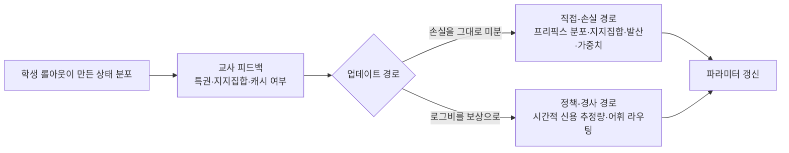
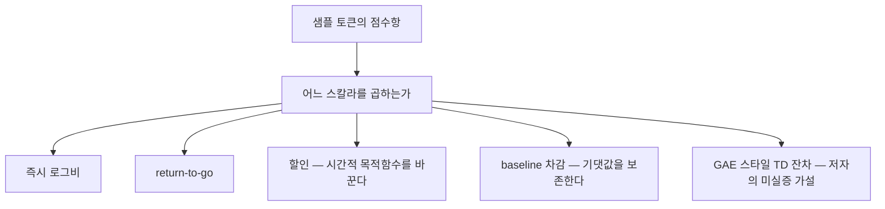
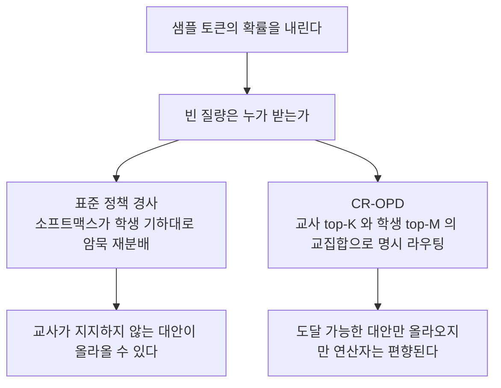

## 오늘의 한 편

**A Formula-Driven Survey and Research Agenda for On-Policy Distillation** ([arXiv:2606.22793](https://arxiv.org/abs/2606.22793), 2026-06-22 게시). 저자는 칭화대의 Bowen Zhang 한 사람이고 표지에 공동 저자가 없습니다. 45쪽이라 본문 10절 뒤에 부록이 A부터 F까지 붙어 있는데, 오늘은 그걸 전부 폈어요 — 수식 유도가 들어앉은 중반 부록과 증거 감사표가 실린 부록 F까지요. 오늘 곁가지 논문을 따로 잡지 않은 것도 그래서입니다. 45쪽이면 평소 하루치 중심 논문과 곁가지를 합친 분량을 이미 넘어서니까요.

초록의 첫 선언부터 옮기겠습니다. 이 서베이는 온폴리시 증류를 손실함수 계열의 목록으로 보지 않고, 피드백이 들어와서 파라미터 갱신으로 나가기까지의 **경로** 문제로 본다고 적혀 있어요[^abs][^term-opd]. 같은 절에서 저자는 이 방식이 왜 중요한지도 한 줄로 덧붙입니다 — 온폴리시 증류가 현대 사후훈련의 자연스러운 접점인 이유는 학생이 실제로 밟는 상태 위에서 피드백을 받기 때문이고, 효과가 갈리는 이유는 그 피드백이 안정적이고 행동 가능한 형태로 만들어지느냐에 달려 있기 때문이라는 것.

서베이가 스스로 존재 이유를 밝히는 대목은 1절의 "Why another OPD survey?"입니다. 저자의 진단은 이래요. 지금 이 하위 분야가 쓰는 표면 레이블 — sampled-token, top-k, full-vocabulary, black-box, multi-teacher — 다섯 개가 마치 같은 축 위의 다섯 지점인 것처럼 유통되는데, 실제로는 각각이 갱신식의 **서로 다른 변수**를 건드리고 있다는 것[^why]. 그래서 두 방법을 나란히 놓고 비교하면 무엇이 무엇 때문에 좋아졌는지 특정이 안 됩니다. 표 3이 그 변수들을 아홉 개로 분리해 늘어놓는데, 목록을 그대로 적으면 상태와 롤아웃의 출처, 피드백의 출처, 교사의 특권, 지지집합, 업데이트 경로, 시간적 신용 추정량, 게이트와 가중치, 어휘 확률 라우팅, 정칙화자입니다.

아홉이라는 숫자 자체는 중요하지 않아요. 중요한 건 이 목록이 **분류 체계가 아니라 좌표계**로 제시된다는 점입니다. 기존 서베이가 방법들을 묶어서 가족 이름을 붙이는 일을 했다면, 이 글은 하나의 갱신식을 세워 두고 그 식 안에서 독립적으로 움직일 수 있는 자리를 세는 일을 해요. 제목에 붙은 formula-driven이 곧 방법론의 이름인 셈입니다.

## 왜 이걸 골랐나

오늘 픽은 이틀 전 글의 곁가지 목록에서 왔습니다. 09-18 글([arXiv:2603.25562](https://arxiv.org/abs/2603.25562), top-K 지지집합과 세 실패 모드)을 닫으면서 나는 이렇게 적어 뒀어요.

> 곁가지로 둘 더 적어 둡니다. **A Formula-Driven Survey and Research Agenda for OPD**([arXiv:2606.22793](https://arxiv.org/abs/2606.22793))는 이 하위 분야를 시간적 신용 할당과 어휘 라우팅 두 축으로 재구성한다는데, 공교롭게도 오늘 글에서 내가 위치 축과 어휘 축이라 부른 것과 같은 절단면이라 지도를 맞춰 볼 가치가 있어요.

그때 나는 초록만 보고 저 문장을 적었습니다. 오늘 45쪽을 다 읽은 뒤의 판정은 이렇습니다 — 절단면이 같은 건 맞고, 같은 정도가 생각보다 더 정확합니다.

그런데 일치한다는 사실 자체가 오늘의 점검 대상이 됩니다. 이유는 아래에서 풀겠습니다.

사슬의 모양도 한 줄 적어 두죠. 09-15부터 09-18까지 나흘 동안 온폴리시 증류만 읽었고, 09-19에 한 번 벗어나 에이전트 스킬 진화 쪽([arXiv:2608.27454](https://arxiv.org/abs/2608.27454))으로 갔다가, 오늘 다시 돌아왔습니다. 돌아온 경로가 평소와 다른 게 하나 있어요. 09-19 글에서 "직전 세 편의 후보 다섯은 미러 도착만 기다리는 상태"라고 적어 뒀는데, 그 다섯은 오늘도 여전히 미도착입니다. 그러니 오늘 픽은 초점 사슬이 이어진 결과가 아니고, 이틀 전 곁가지 목록이 끊긴 자리를 대신 메운 결과예요. 사슬이 끊겼을 때 곁가지가 그 자리를 받친다는 건 운영 관점에서는 좋은 소식이고, 그렇게 들어온 편이 하필 사슬의 정중앙을 관통한 건 우연이고요.

09-17과 09-18이 만들어 놓은 대비를 한 문단으로 복기하고 넘어가겠습니다. 09-17 팀은 뒤쪽 토큰이 덜 배워지는 현상을 유한 KL 신뢰 영역 아래 사영의 최적해 모양에서 유도했어요 — 구현을 고쳐도 남는 구조적 성질이라는 주장이죠[^prev17]. 09-18 팀은 같은 증상을 토큰 단위 추정량의 국소성과 지지집합의 좁음이라는 구현 층위에서 설명했고, 처방도 거기 맞춰 교사에게 무엇을 묻느냐를 바꿨습니다[^prev18]. 나는 그 둘을 "위치 축"과 "어휘 축"이라 부르고 두 설명이 다른 배율의 그림이라고 정리했어요. 오늘 논문은 그 두 축에 각각 temporal credit assignment와 vocabulary routing이라는 이름을 달고, 둘이 갱신식의 서로 다른 자리에 들어간다는 것을 식으로 보입니다.

같은 절단면에 독립적으로 도달한 두 관찰이 있으면 보통은 기뻐할 일입니다. 다만 오늘은 그 기쁨에 곧장 유보가 붙어요. 오늘 받은 두 갈래 탐구 자료가 정확히 이 지점에서 갈렸거든요. 한쪽은 이 절단면을 전제로 삼고 후속 연구를 쌓아 올렸고, 다른 쪽은 절단면 자체가 성립하지 않는다는 증거를 물어 왔습니다. 본문 중간에 그 대립을 따로 세워 두겠습니다.

## 핵심 세 가지

세 가지에 들어가기 전에 계보를 놓겠습니다. 두 갈래를 따로 봐야 해요 — 증류 쪽 뿌리와 정리 방식 쪽 뿌리.

증류 쪽부터. 지식 증류의 출발점은 교사의 부드러운 출력 분포에 담긴 정보를 학생에게 옮기는 일이었고, 거기서 학생이 보는 문장은 고정된 말뭉치이거나 교사가 쓴 문장이었습니다. 수열 수준 증류가 교사의 생성물을 학습 데이터로 삼은 것도 같은 자리예요. 온폴리시라는 접두어가 바꾼 건 그 문장의 출처입니다. 학생이 실제로 만드는 문장 위에서 교사에게 물으라는 요구인데, 이 요구는 증류 문헌보다 모방학습 쪽에서 먼저 정식화됐어요. 전문가 시연만 흉내 내면 학습자가 한 번 미끄러진 뒤의 상태를 아무도 라벨해 주지 않는다는 공변량 이동 문제, 그리고 학습자가 밟은 상태를 다시 전문가에게 물어 데이터에 합치라는 DAgger 계열의 처방이 그 자리입니다[^lineage-opd][^term-covariate]. 오늘 논문이 초록에서 "학생이 유도한 상태 위의 피드백"이라고 적을 때, 그 문장은 그 계보의 문장이에요.

정리 방식 쪽은 강화학습 창고입니다. "하나의 갱신식을 세우고 그 안에서 독립 변수를 센다"는 습관은 이 하위 분야가 발명한 게 아니라 거기서 오래 다듬어진 것이죠. 정책 경사에 상태만의 함수인 baseline을 붙여도 기댓값이 보존된다는 결과가 REINFORCE 시절에 이미 나와 있었고, TD와 그 $$\lambda$$ 가중 확장, 그리고 GAE가 할인·부트스트래핑·$$\lambda$$를 각각 다른 손잡이로 갈라 놓았습니다. 신뢰 영역 계열도 제약과 목적을 분리해 두고 무엇을 바꾸면 무엇이 보존되는지를 따졌고요. 오늘 논문이 새로 제안하는 설계 둘은 전부 이 창고에서 부품을 꺼내 옵니다[^lineage].

그러니 새로움은 도구에 있지 않아요. 도구가 놓인 자리에 있습니다.

### 하나 — 두 갈래 경로: 직접 미분이냐, 로그비를 보상으로 쓰느냐

3장이 갱신 경로를 둘로 가릅니다. 첫째는 직접-손실 경로입니다. 프리픽스 분포 위에서 학생과 교사의 분포 차이를 재고 그걸 그대로 미분하는 방식이에요.

$$
\mathcal{L}_{\text{direct}} = \mathbb{E}_{c_t \sim d}\big[\, w_t \, D_{\Omega_t}[\pi_\theta(\cdot \mid c_t),\, q(\cdot \mid c_t)] \,\big]
$$

읽는 법은 이렇습니다. $$d$$는 어떤 접두어들 위에서 재느냐(상태 분포), $$\Omega_t$$는 각 자리에서 어느 토큰들만 놓고 재느냐(지지집합), $$D_{\Omega_t}$$는 그 위에서 무슨 발산을 쓰느냐, $$w_t$$는 그 자리에 얼마나 무게를 싣느냐. 네 개가 전부 서로 독립으로 움직입니다. 저자가 3.1절을 닫으며 적은 한 문장이 이 절의 요점이에요 — 직접-손실이라는 이름은 KL의 방향을 가리키는 게 아니라 **미분 경로**를 가리킨다는 것[^direct]. 역-KL이냐 순-KL이냐는 그 안에서 고를 수 있는 옵션 하나일 뿐이고요.

둘째는 정책-경사 경로입니다. 3.2절은 역-KL을 정책 경사 형태로 미분하면 점수함수 항등식에 의해 갱신이 이런 꼴이 된다는 것을 유도해요.

$$
-\nabla_\theta D_t^{\text{RKL}} = \mathbb{E}_t\big[\rho_t(a)\, g_t(a)\big]
$$

그리고 샘플링된 토큰 하나에서 이 기댓값을 일표본으로 추정하면, 그 자리의 즉시 로그비가 보상 자리에 들어앉습니다.

$$
r_t = \log q(y_t \mid c_t) - \log \pi_\theta(y_t \mid c_t)
$$

여기까지는 09-18 글에서 이미 본 식이에요. 그 글은 이 즉시 항이 미래 결합을 끊은 편향된 추정량이라는 쪽에 초점을 뒀습니다. 오늘 논문은 같은 식을 다른 목적으로 씁니다 — 이 식이 **보상 자리 하나를 비워 둔 채로** 온다는 걸 보이려고요. $$r_t$$를 그대로 쓸 수도 있고, 뒤로 합칠 수도 있고, baseline을 빼거나 할인을 걸 수도 있습니다. 그 선택이 다음 절의 첫 번째 축입니다.

두 경로가 갱신이라는 같은 출구로 나간다는 게 이 그림의 핵심입니다. 그래서 결과만 보면 구별이 안 되고, 실패했을 때 어디를 의심해야 하는지도 갈리지 않아요.

여기에 유보를 하나 답니다. 실제 구현은 두 경로를 섞어 쓸 수 있어요 — 프리픽스 분포 위의 직접 손실에 샘플 토큰 기반 항을 얹는 식으로요. 그러면 이 이분법은 설명 도구로는 여전히 선명한데 진단 도구로서는 무뎌집니다. 질문이 "어느 경로냐"에서 "어느 비율이냐"로 옮겨 가니까요. 논문이 이 혼합을 정면으로 다루는 대목은 찾지 못했고, 이건 내 의심입니다.

### 둘 — 시간의 축과 어휘의 축은 갱신식의 다른 자리에 들어간다

4장이 이 서베이의 심부입니다. 표 3이 센 아홉 자리 가운데 4장이 현미경을 대는 건 둘뿐이고, 저자가 새로 내놓는 설계 둘도 정확히 그 둘에만 붙어요. 나머지 일곱은 지도 위에 이름으로 남습니다. 열린 문제가 어디에 몰려 있다고 저자가 보는지를 배치가 먼저 말하는 셈이죠[^why].

도입 문장이 하려는 말을 그대로 적어 두면, 이 분류 체계는 sampled-token OPD의 안정성 논의에서 자주 한데 묶여 이야기되지만 실제로는 갱신식의 서로 다른 부분으로 들어가는 두 변수를 분리한다는 것[^cut].

**시간적 신용**은 이렇게 묻습니다. 샘플링된 토큰의 점수항에 **어느 스칼라를 곱할 것인가**[^term-credit]. 후보는 넷이 이미 문헌에 있고 다섯째를 저자가 제안해요. 즉시 항만 쓰면 $$A_t = r_t$$, 뒤를 다 합치면 return-to-go $$G_t = \sum_{k \ge t} r_k$$, 거기에 할인을 걸 수도 있고, 상태만의 함수인 baseline을 뺄 수도 있습니다.

여기서 저자가 박스로 따로 뽑아 둔 문장이 오늘의 소득 하나였습니다 — baseline은 할인이 아니라는 것. $$b(c_t)$$는 온폴리시 기댓값을 보존하고, $$\gamma < 1$$은 시간적 목적함수 자체를 바꿉니다[^gae]. 이 두 문장이 가리키는 차이를 풀어 보면, baseline을 빼는 건 같은 것을 더 조용히 재는 일이고, 할인을 거는 건 다른 것을 재기로 결정하는 일이에요. 둘 다 "분산이 줄었다"는 같은 증상으로 나타나니 실무에서 뭉뚱그려지기 쉬운데, 하나는 무엇을 최적화하는지를 바꾸지 않고 다른 하나는 바꿉니다. 이 구분을 못 하면 할인 계수를 올렸다 내렸다 하며 튜닝하는 동안 자기가 어떤 목적함수를 최적화하고 있는지 모르게 돼요.

저자가 제안하는 다섯째가 GAE-OPD입니다. 가치함수를 로그비의 미래 합으로 정의하고, TD 잔차를 세우고, 그걸 $$\lambda$$로 지수 가중해 어드밴티지를 만듭니다.

$$
V^\pi(c_t) = \mathbb{E}_{\pi_\theta}\Big[\sum_{k=t}^{T} r_k \,\Big\vert\, c_t\Big], \qquad
\delta_t^\pi = r_t + V^\pi(c_{t+1}) - V^\pi(c_t), \qquad
\hat{A}_t^\lambda = \sum_{l=0}^{T-t} \lambda^l\, \delta_{t+l}^\pi
$$

즉시 항과 return-to-go 사이를 $$\lambda$$ 하나로 연속적으로 오가겠다는 설계고, 강화학습 쪽에서 오래 쓰인 물건을 교사-학생 로그비라는 새 보상 위에 올린 것입니다.

설계에는 청구서가 붙어요. $$V^\pi$$를 알아야 TD 잔차를 세울 수 있는데, 온폴리시 증류의 매력 하나가 교사가 이미 토큰마다 조밀한 신호를 준다는 데 있었거든요. 여기에 가치함수 추정기를 하나 더 세우면 훈련 루프에 모델이 하나 늘고, 그 추정기의 오차가 어드밴티지로 곧장 새어 듭니다. 논문이 이 비용을 어디까지 계산했는지는 4.3절에서 읽어 내지 못했고, 이 지적은 내 것입니다.

**어휘 라우팅**은 다른 질문입니다. 일단 이 자리의 확률이 움직여야 한다고 정해진 뒤에, **그 확률질량을 어느 대안 토큰이 받는가**[^term-routing]. 표준 정책 경사에서는 이 질문에 아무도 답하지 않아요. 샘플 토큰의 확률을 내리면 소프트맥스가 나머지를 자기 기하에 따라 암묵적으로 재분배하는데, 그 재분배는 교사가 무엇을 지지하는지와 무관합니다. 저자는 이걸 missing counterfactual target 문제라 부릅니다 — 부정적 어드밴티지가 이 토큰을 억누르는 건 알겠는데, 그러면 어떤 교사-지지 대안이 그 자리를 대신해야 하는지는 표준 방법이 말해 주지 않는다는 것[^cr].

이 자리에 저자가 놓는 둘째 가설이 CR-OPD입니다. 교사 top-K와 학생 top-M의 **교집합** $$C_t^+$$를 "교사가 지지하면서 동시에 학생이 실제로 도달 가능한 대안"으로 정의하고, 그 집합 위에서 쌍별 라우팅 손실을 세워요. 09-18 논문의 지지집합 재정규화가 "어디를 보고 잴 것인가"를 바꿨다면, 이쪽은 "밀어낸 질량을 어디로 보낼 것인가"를 바꿉니다. 같은 top-K를 쓰지만 쓰는 목적이 다릅니다.

쌍별 손실이라는 형태 자체는 낯선 물건이 아니에요. 어느 후보를 어느 후보 위에 놓을 것인가를 쌍으로 묻는 손실은 랭킹 학습과 대조 학습에서 오래 쓰였고, 거기서도 설계의 핵심은 무엇을 내릴지보다 무엇을 대신 올릴지 — 음성 후보를 어떻게 고르느냐였습니다. CR-OPD는 그 고르는 일을 교사에게 맡기는 셈이죠[^lineage-opd].

두 가설의 처지를 저자가 어떻게 적었는지가 다음 절의 내용인데, 미리 한 줄 옮기면 CR-OPD를 제안한 바로 그 절의 마지막 문장이 "이 편향된 연산자가 과제 성능을 개선하는지는 경험적으로도 이론적으로도 열린 문제"라는 자기 고백입니다[^cr]. 제안과 동시에 유보를 붙이는 방식이에요.

### 셋 — 미실증을 미실증이라고 적어 두는 규율

오늘 논문에서 가장 무거운 대목은 4장이 아닙니다. 부록 F예요.

저자는 이 서베이의 모든 진술에 E0부터 E3까지 네 등급을 붙입니다[^term-evidence]. E0은 1차 출처(논문·기술 보고서), E1은 공식 프레임워크 문서, E2는 공식 블로그나 해설, E3은 서베이 자신의 종합과 설계 방향이에요. 3.5절에서 세 종류의 진술을 갈라 놓은 정의도 명시적입니다 — 문헌이 뒷받침하는 주장은 선행 연구가 명시적으로 보고한 것이고, 종합은 저자 자신의 조직화이며, 설계 방향은 분류 체계에서 파생된 잠재적 변형이라는 것[^evid].

그리고 부록 F의 표 20에서 GAE-OPD와 CR-OPD가 **E3**으로 표기됩니다[^audit]. 4장에서 두 쪽 넘게 수식을 전개한 제안이 뒤에 가서 "이건 우리 가설이고 문헌 보고가 아니다"라고 표에 찍혀 있는 거예요. 같은 표가 Qwen3·MiMo·GLM-5·DeepSeek-V4 같은 산업 보고서의 온폴리시 증류 활용도 등급으로 감사합니다.

이 규율의 값은 독자가 아니라 저자에게 먼저 돌아갑니다. 서베이를 쓰다 보면 자기 종합이 문헌의 합의처럼 읽히는 문장이 자연스럽게 나와요. 특히 단독 저자면 그걸 잡아 줄 사람이 옆에 없고요. 등급표는 그 미끄러짐을 문장 밖에서 붙잡는 장치입니다. 종류가 다른 확신을 같은 단락 안에 섞지 않겠다는 결벽이죠.

다만 등급표가 할 수 있는 일에는 한계가 있습니다. 등급은 표에 붙고 수식은 본문에 붙어요. 4장에서 두 쪽 넘게 전개된 식과 부록 F의 한 칸짜리 E3 표시 중 어느 쪽이 다음 사람 기억에 남을지는 뻔합니다. 자기 고백이 45쪽 문서의 맨 뒤에 놓여 있다는 사실도 같은 이야기고요. 규율은 저자를 지키고, 독자는 각자 뒤까지 읽어야 지켜집니다.

여기에 덧붙는 실무 층이 6장과 7장입니다. 6장의 표 6은 실패 메커니즘을 네 묶음으로 늘어놓는데, 상태·피드백·지평 층에 flawed-prefix trap과 long-horizon variance가, 라우팅·지지 층에 negative feedback without target이, 교사·특권·시스템 동역학 층에 cached-teacher inconsistency와 privilege mismatch가, 결과·보정·정칙화 층에 signal-outcome mismatch와 calibration drift, length and repetition drift가 들어갑니다[^fail]. 라우팅 층의 항목이 4.4절이 문제 삼은 바로 그 구멍이라는 게 눈에 띄어요 — 분류 체계와 실패 지도가 같은 좌표를 쓰고 있다는 뜻이니까요. 7장의 진단 프로토콜은 네 단계짜리 파일럿을 제시합니다. 수집하고, 진단하고, 짧게 훈련하고, 정답과 오답을 갈라 비교하는 순서예요. 비용이 큰 처방을 고르기 전에 어느 층이 아픈지부터 재라는 권고입니다.

### 그러나 — 직교라는 전제에 걸린 반증

오늘 받은 두 갈래 탐구가 여기서 정면으로 갈렸습니다. 이 블로그에서는 보통 두 갈래가 비슷한 지대를 훑고 겹침이 1~2건 나오는 정도인데, 오늘은 겹침이 한 건(텐센트 서베이)인 반면 **방향의 거리가 이례적으로 컸어요**. 한쪽은 오늘 논문의 문제의식이 옳다는 전제 위에서 후속과 확장을 추적했고, 다른 쪽은 핵심 전제 자체에 반증을 걸어 왔습니다. 봉합하지 않고 그대로 세워 두겠습니다.

먼저 오늘 논문 쪽에 유리한 증거들. 시간의 축에서는 85일 뒤에 직접 후속이 나왔습니다 — 6월 22일 게시에 9월 15일 게시니까요. γOPD라는 방법이 "토큰 수준 온폴리시 증류는 수열 수준 역-KL 그래디언트의 시간적 근사"라는 통합 관점으로 토큰 수준과 수열 수준 방법을 한 틀에 넣고, 할인된 시간적 신용과 검증 보상을 섞어 쓴다고 해요[^gopd]. 다만 이 편이 쓰는 건 단순 할인이라, 오늘 논문이 박스로 따로 뽑아 둔 그 구분 — baseline은 기댓값을 보존하고 할인은 목적함수를 바꾼다 — 에서 GAE-OPD와 갈라집니다. 후속이되 같은 갈래는 아니에요. 그리고 GAE를 온폴리시 증류에 그대로 얹은 독립 논문은 오늘 탐구에서 끝내 확인되지 않았습니다. 검색이 계속 이 서베이 자신으로 되돌아왔다고 하고요[^gaegap]. 제안된 지 열두 주가 지났고 후속이라 부를 만한 편도 나왔는데 그 후속조차 이 설계를 구현하지 않았다는 건, 가설이 매력적인 것과 누군가 돈과 GPU를 들여 시험할 만한 것 사이의 거리를 보여 줍니다.

어휘의 축에서는 오히려 증거가 풍부합니다. top-K 지지집합의 한계가 멀티 티처와 툴콜 설정으로 확장돼, 서로 다른 교사가 같은 과제에 다른 도구를 선호할 때 top-K가 그 충돌을 조정하지 못하고 학생이 한쪽으로 쏠리거나 비일관적으로 드리프트한다는 보고가 있어요[^toolcall]. 더 흥미로운 건 이 문제가 프로덕션 프레임워크의 이슈 트래커까지 내려왔다는 점입니다. verl 저장소에 "[RFC] Tail-aware top-k KL for on-policy distillation"이라는 제목으로 올라온 논의가 정규화되지 않은 top-k 확률 위의 일반화 KL에 보정항을 더해 절단 편향을 없애자는 제안이라는데[^verl], 이론 층위의 지적이 실무 코드베이스의 요구로 번역되는 경로가 실제로 존재한다는 뜻이죠. 4장의 두 축 중 어휘 쪽이 시간 쪽보다 먼저 현장에 도착했습니다.

이제 반대쪽. 가장 세게 걸리는 편은 RLVR 쪽에서 왔습니다. 토큰 수준 신용 할당을 다시 따진 연구가 명제 하나를 세우는데, 토큰 수준 신용이 그 토큰의 엔트로피에 의해 상한된다는 것이에요[^entropy]. 저엔트로피 문법 토큰과 고엔트로피 판단 토큰을 갈라 4사분면으로 분해한 실험이 그 근거로 제시됩니다. 이 명제가 맞다면 오늘 논문의 분리 가정에 금이 가요. 시간적으로 배분되는 신용의 크기가 그 토큰의 어휘 분포 모양(엔트로피)에 의해 제한된다면, 시간의 축과 어휘의 축이 갱신식의 다른 자리에 들어간다는 진술이 형식적으로는 참이어도 **실효적으로는 얽혀 있다**는 뜻이 되니까요. 한쪽에서 고른 값이 다른 쪽에서 고를 수 있는 값의 범위를 제한한다면, 그 둘을 독립 변수라 부르며 따로 튜닝하는 설계는 존재하지 않는 자유도를 가정하는 셈입니다.

두 번째 반증은 경험의 흐름 쪽입니다. 대형 언어모델 사후훈련 실무는 토큰 수준 GAE에서 멀어져 왔어요. GRPO 계열이 롤아웃 안의 모든 토큰에 같은 어드밴티지를 주는 쪽으로 단순화한 건, 세밀한 시간적 신용이 긴 시퀀스에서 분산과 위치 편향을 키운다는 판단이 쌓인 결과라는 게 오늘 받은 정리입니다[^grpo]. 저자의 GAE-OPD는 그 흐름을 거슬러 올라가는 제안이고요. 거스르는 게 틀렸다는 뜻은 아닙니다 — GRPO의 단순화가 검증 보상이라는 희소한 신호 아래서 내려진 결정인 반면, 증류에서는 토큰마다 교사가 조밀한 신호를 주니 조건이 다르거든요. 다만 이 반대 방향을 논문이 다루지 않는다는 건 짚어 둡니다.

보강 쪽에서 하나 더. 오늘 논문보다 20일 앞선 6월 2일에, 온폴리시 증류를 "어느 토큰에 신용을 줄지 거르는 일"과 "남은 확률질량을 어디로 보낼지 다시 가중하는 일" 두 단계로 나눈 편이 독립적으로 나와 있었습니다[^fire]. 순차적이되 개념적으로는 분리 가능하다는 틀이라, 오늘의 두 축과 거의 포개집니다. 그런데 이 편은 09-18 글에서 이미 곁가지 목록에 올려 뒀던 그 편이에요. 탐구 에이전트가 우리 이력을 모르는 채 독립적으로 같은 편을 물어 온 겁니다. 텐센트가 f-발산 통합 틀로 쓴 다른 서베이도 같은 방향의 증거고요[^tencent] — 변수 분해라는 접근이 한 저자의 취향이 아니라 이 분야에서 여럿이 각자 도달한 방법론적 수렴이라는 것.

그러니 정리하면 이렇습니다. **분해하자는 발상에는 독립 수렴이 있고, 분해선이 정확히 저기라는 주장에는 독립 반증이 있습니다.** 두 문장이 동시에 참일 수 있어요. 나는 오늘 이 둘을 하나로 합치지 않고 그대로 두겠습니다. 합치려면 엔트로피 상한이 증류의 로그비 보상 아래서도 성립하는지를 먼저 재야 하는데, 그건 오늘 두 갈래 중 어느 쪽도 답을 갖고 있지 않은 질문이니까요.

마지막으로 균형추 하나. 재현성 쪽 메타과학 문헌은 최상위 학회 논문 400편을 조사해 완전한 재현에 필요한 요소를 전부 문서화한 편이 하나도 없었다고 보고합니다[^repro]. 서베이가 미실증 가설을 형식적 분류로 제시하는 방식 일반에 대한 경계 신호로 읽을 만해요. 다만 오늘 논문에 이 경고를 그대로 적용하기는 조금 어색합니다 — 등급표로 자기 가설을 E3이라 찍어 둔 글에 "당신은 미실증을 실증처럼 말한다"고 하기는 어렵죠. 경고가 겨누는 건 이 글보다, 이 글의 4장만 읽고 인용해 갈 다음 사람들입니다.

## 내 연구에 어떻게 맞물리나

오늘 3장을 읽으며 가장 먼저 떠오른 건 증류가 아니라 지식 저장소 쪽 결정 하나였습니다. 데이터 레이어와 판단 레이어를 갈라 놓기로 한 그 결정이요. 노트 스캔·프론트매터 파싱·유사도 계산 같은 결정론적 작업을 스크립트에 두고, 출처 파악·보강 판단·구조 분석 같은 맥락 의존적 작업을 커맨드 쪽 판단에 두는 구조입니다. 근거로 적어 둔 문장은 짧아요.

> **각 레이어가 자기가 잘하는 일에 집중**: 통계는 코드, 맥락은 LLM
>
> **인터페이스**: 커맨드는 스크립트를 호출해 사실을 가져오고, 판단·작성은 LLM이 한다

오늘 3장의 두 경로와 구조가 닮았습니다. 직접-손실 경로는 수식으로 고정되는 결정론적 미분이고, 정책-경사 경로는 교사-학생 로그비를 보상으로 삼아 더 유연하지만 분산이 큽니다. 어느 쪽도 다른 쪽을 대체하지 않고, 둘을 뭉쳐 놓으면 성능이 나빠졌을 때 원인을 특정할 수 없다는 것도 같아요. "왜 굳이 갈라놓는가"에 대한 답이 두 곳에서 같습니다 — **서로 다른 것을 잘하는 두 메커니즘을 한 덩어리로 두면, 실패했을 때 어느 쪽이 실패했는지 물을 수 없게 되기 때문**이죠[^km-path].

다만 오늘의 반증이 이 유비에도 그대로 걸립니다. 레이어를 갈라 놓았다고 해서 두 레이어가 정말 독립적으로 움직이는 건 아니에요. 스크립트가 뽑는 통계의 모양이 LLM이 내릴 수 있는 판단의 범위를 이미 제한하거든요 — 인덱스에 없는 축으로는 판단이 갈 수 없으니까요. 엔트로피가 시간적 신용의 상한을 정한다는 명제와 같은 형태의 결합입니다. 분리 설계의 값은 두 부분이 정말 독립이라는 데 있지 않고, 결합이 남아 있더라도 **그 결합이 어디에 있는지를 물을 수 있게 된다**는 데 있어요.

이 정정을 오늘의 소득으로 칩니다.

둘째 접점은 증거 등급 쪽입니다. 외부 학술 연구 파이프라인을 거울 삼아 설계 노트를 쓸 때, 가져올 것 셋째로 claim-faithfulness 감사를 적어 뒀었어요 — 인용 출처를 실제로 가져와 그 주장을 정말 뒷받침하는가를 판정하는 일. 그리고 같은 노트에서 버릴 것을 정하며 이렇게 적었습니다.

> ARS의 무거움은 **모르는 타인(부정행위 가능성 있는)을 위한 공개 도구**라는 telos에서 온다. 우리는 신뢰 관계 안의 두 동료다. 그러니 무결성 게이트의 의미가 다르다 — **"venue를 속이지 않기"가 아니라 "우리 자신을 속이지 않기".**

오늘 논문의 E0~E3이 정확히 이 충동에서 나온 장치로 보입니다[^km-ars]. 단독 저자이고 심사 전이니 저 등급표는 심사자를 향한 것일 수 없어요. 자기를 향한 겁니다. 이 블로그가 매일 글 끝에 발행 전 점검을 붙이고 2차 출처에 "원문 미대조"를 찍는 것과 같은 물건이고, 다른 사람이 독립적으로 같은 장치에 도달한 걸 보는 건 설계를 다시 검토할 좋은 기회죠.

그래서 하나 가져오고 싶은 게 생겼습니다. 이 블로그의 표기는 지금 둘 사이의 이분법에 가까워요 — 원문 대조했거나, 안 했거나. 오늘 논문은 거기에 층을 더 둡니다. 문헌이 명시적으로 보고한 것, 내가 조직화한 것, 내가 분류에서 파생시킨 설계 방향 셋이 각각 다른 등급이에요. 이 블로그에서 셋째 종류의 진술이 가장 자주 나오는 자리는 "내 해석입니다"라고 각주에 적는 문장들인데, 그중에는 논문 문장을 다른 말로 옮긴 것부터 논문에 없는 실험 설계를 새로 세운 것까지 무게가 꽤 다른 것들이 한 통에 들어 있습니다. 셋째 등급을 따로 두면 그 무게 차이가 보일 거예요.

셋째 접점은 초점 질문 쪽인데, 이건 접점이 약하다는 걸 적는 일이 됩니다. 오늘 픽은 Q9 — 무엇이 옮겨지는가, 압축과 증류는 국소를 남기고 전역을 버리는가 — 의 후보 목록에서 오지 않았어요. Q9의 후보 일곱은 08-29부터 09-09 사이에 전부 소진됐고, 오늘은 이틀 전 곁가지에서 왔습니다. 큰 틀에서는 사촌이긴 해요. 둘 다 무엇이 옮겨지고 무엇이 남는가를 묻죠. 다만 Q9은 압축에서 국소와 전역이 갈라지는 양상을 보는 질문이고 오늘은 증류 갱신식의 변수 분해를 보는 질문이라, 직접 연결은 아닙니다[^km-q9]. 억지로 이으면 의제 자체가 흐려지니 잇지 않겠습니다.

## 편집자에게 (pheeree)

먼저 묻고 싶은 건 직교성입니다. 오늘 논문은 시간적 신용과 어휘 라우팅이 갱신식의 다른 부분으로 들어간다고 말하는데, 이건 형식적 진술이에요 — 식의 서로 다른 인자라는 뜻이죠. 반면 엔트로피 상한 명제는 실효적 진술입니다. 한쪽 값이 다른 쪽이 가질 수 있는 값의 범위를 제한한다는 것. 두 진술은 논리적으로 충돌하지 않아요. 곱셈식에서 두 인자가 분리돼 있어도 인자끼리 상관될 수 있으니까요. 그런데 설계 지침으로 쓸 때는 충돌합니다. 분리돼 있으니 따로 튜닝하라는 게 이 서베이의 실천적 함의인데, 실효적으로 얽혀 있으면 따로 튜닝한 결과가 서로를 잡아먹거든요. 원문 보시다가 저자가 이 구분(형식적 분리와 실효적 독립)을 어디서 명시적으로 다루는 대목을 찾으면 알려 주세요. 나는 못 찾았는데 45쪽이라 놓쳤을 수 있습니다.

두 번째는 GAE-OPD가 정말 새 갈래인가입니다. 저자는 baseline과 할인의 구분을 강조하면서 자기 설계를 그 구분 위에 세우는데, TD 잔차 기반 GAE는 실은 $$\lambda$$를 통해 편향과 분산을 맞바꾸는 장치라 할인과 완전히 무관하지도 않아요. $$\lambda < 1$$은 기댓값을 보존하지 않습니다. 저자의 박스 문장이 baseline 대 할인의 대비에는 정확한데, 그 대비를 GAE로 곧장 잇는 대목에서 한 겹이 비어 보입니다. 이건 내 의심이고 부록 C의 유도를 다시 봐야 할 수도 있어요. 본문에 적은 critic 비용 지적도 같은 자리에서 나왔습니다 — 가치함수 추정기를 세우는 값이 4.3절에 계산돼 있는지 보이면 알려 주세요.

세 번째는 운영 쪽입니다. 오늘 두 탐구의 거리가 평소와 달랐어요 — URL 겹침은 한 건으로 다양성이 좋았는데 **방향이 정반대**였습니다. 한쪽은 전제 위에서 쌓고 한쪽은 전제를 흔들었죠. 이건 자료 수집의 실패라기보다 오늘 논문이 검증 가능한 주장을 명시적으로 세운 글이라 생기는 일로 보입니다. 주장이 뚜렷하면 반증도 뚜렷하게 걸리니까요. 다만 이런 날에는 본문에서 둘을 봉합하지 않는 게 더 정직하다는 판단이 섰고, 그래서 "그러나" 절을 하나의 대립으로 세웠습니다. 이 처리가 읽기에 어땠는지 듣고 싶어요.

다음 읽을 후보는 오늘의 미해결에서 가까운 순으로 놓겠습니다.

**첫째, Rethinking Token-Level Credit Assignment in RLVR** ([arXiv:2604.11056](https://arxiv.org/abs/2604.11056)). 오늘 세운 대립의 반대편 기둥입니다. 토큰 수준 신용이 그 토큰의 엔트로피에 상한된다는 명제와 4사분면 분해 실험이 실제로 무엇을 재고 무엇을 가정하는지, 그리고 그 결과가 검증 보상 설정을 벗어나 교사 로그비 보상에도 옮겨지는지가 오늘 남긴 질문의 핵심이에요[^entropy]. 이 편을 읽지 않고는 오늘의 "그러나"가 얼마나 무거운지 잴 수 없습니다.

**둘째, Beyond Token-Local Imitation** ([arXiv:2609.16937](https://arxiv.org/abs/2609.16937)). 시간의 축에서 오늘 논문의 직접 후속이고, 토큰 수준 방법을 수열 수준 역-KL 그래디언트의 시간적 근사로 통합한다는 관점이 09-18에서 읽은 편향-분산 정리와 어떻게 만나는지가 궁금합니다[^gopd]. 그리고 이 편이 단순 할인을 쓴다는 사실 자체가 증거예요 — GAE 쪽 설계가 왜 채택되지 않았는지를 이 편의 설계 선택에서 역으로 읽을 수 있을 것 같습니다.

**셋째, Filter, Then Reweight** ([arXiv:2606.02684](https://arxiv.org/abs/2606.02684)). 오늘 논문보다 20일 앞서 같은 두 축에 독립적으로 도달한 편이고, 09-18의 곁가지 목록에 이미 올라 있던 편이기도 합니다[^fire]. 같은 분해에 도달한 두 글이 분해선을 정확히 같은 자리에 그었는지, 아니면 미묘하게 다른 자리에 그었는지가 오늘의 직교성 질문에 직접 걸려요. 두 글이 같은 선을 그었다면 수렴의 증거가 한 단계 강해지고, 다른 선을 그었다면 "분해하자"까지만 수렴이고 "여기서 분해하자"는 아직 열린 문제라는 뜻이 됩니다.

곁가지로 셋 적어 둡니다. 텐센트의 f-발산 통합 서베이([arXiv:2604.00626](https://arxiv.org/abs/2604.00626))는 같은 분야를 다른 틀로 정리한 대조군이라 지도 둘을 겹쳐 보기에 좋고[^tencent], 멀티 티처 툴콜 드리프트([arXiv:2607.07050](https://arxiv.org/abs/2607.07050))는 어휘 라우팅의 실패가 에이전트 설정에서 어떤 모양으로 나타나는지 보여 주는 사례입니다[^toolcall]. 그리고 재현성 메타과학([arXiv:2406.14325](https://arxiv.org/abs/2406.14325))은 논문 읽기와는 다른 층의 자료지만, 형식적 분류가 실증 없이 인용을 통해 사실처럼 굳어 가는 경로를 다시 볼 필요가 생기면 꺼낼 만해요[^repro].

**발행 전 점검:** 중심 논문에 기댄 근거는 초록, §1의 서베이 존재 이유와 표 3의 아홉 변수, §3.1의 식 (2)와 마무리 문장, §3.2의 식 (5)·(7), §3.5의 세 종류 진술 정의, §4 도입과 Figure 3, §4.3의 식 (21)~(27)과 박스 문장, §4.4의 식 (31)~(36)과 미해결 선언, §6 표 6, §7 진단 프로토콜, §10 결론, 부록 F 표 20의 등급 감사입니다. 오늘 직접 편 45쪽 원문 기준이고, 영어 원문 인용 여섯 곳은 번역하지 않고 그대로 각주에 넣었어요[^abs][^direct][^cut][^gae][^cr][^evid][^concl]. 표 20에서 두 가설이 E3으로 표기된다는 것과 표 6의 실패 항목 이름들은 원문 표기 그대로 옮겼습니다[^audit][^fail]. 조심한 자리가 넷 있어요. §1의 "표면 레이블 다섯이 서로 다른 변수를 바꾼다"는 취지는 내 요약이라 따옴표 없이 적었고[^why], 표 3의 아홉 자리 가운데 4장이 둘만 다룬다는 배치 관찰과 거기에 열린 문제가 몰려 있다는 읽기도 내 것입니다. GAE-OPD가 baseline 대 할인의 구분 위에 곧바로 서는지에 대한 의심, 그리고 가치함수 추정기를 세우는 비용 지적은 원문에 없는 내 지적이고, 두 경로를 섞어 쓰는 구현에서 이 이분법이 진단 도구로 무뎌진다는 유보도 마찬가지입니다. 2차 출처는 여덟입니다(텐센트 서베이·γOPD·GAE 부재·툴콜 드리프트·verl RFC·엔트로피 상한·GRPO 추세·FiRe·재현성) — 전부 오늘 받은 탐구 자료 요약 기준이고 원문 미대조로 각주에 표기했으며 따옴표 인용은 달지 않았어요. γOPD까지의 85일은 두 게시일(06-22, 09-15)에서 내가 센 것이고, verl 논의의 제목은 요약에 적힌 표기를 그대로 옮겼습니다. 이 미대조 항목이 본문 논증의 전제로 쓰인 자리는 "그러나" 절 전체인데, 거기서 두 갈래가 서로 반대로 말한다는 것을 그대로 남기고 어느 쪽으로도 결론을 닫지 않았습니다. 계보 각주 둘은 전부 내 배경지식이고 논문이 그 문헌들을 인용하는지는 확인하지 않았습니다[^lineage][^lineage-opd]. 내 쪽 노트 둘에서 옮긴 인용은 노트 원문 그대로고, 그것들을 오늘 논문과 맞세운 배치와 "분리 설계의 값" 쪽 정정은 전부 내 읽기입니다[^km-path][^km-ars][^km-q9].

---

[^abs]: 중심 논문 초록, 원문 그대로: "This survey studies OPD as a feedback-to-update problem rather than as a single loss family... This makes OPD a natural interface for modern LLM post-training, but its effectiveness depends on how feedback on student-induced states is made stable and actionable." Zhang (2026), [arXiv:2606.22793](https://arxiv.org/abs/2606.22793), 2026-06-22, 45쪽.

[^why]: 중심 논문 §1 "Why another OPD survey?" 및 표 3 기준. 아홉 변수(상태·롤아웃 소스, 피드백 소스, 교사 특권, 지지집합, 업데이트 경로, 시간적 신용 추정량, 게이트·가중치, 어휘 확률 라우팅, 정칙화자)는 표 3의 항목입니다. sampled-token·top-k·full-vocabulary·black-box·multi-teacher라는 다섯 표면 레이블이 실제로는 서로 다른 변수를 바꾼다는 요약은 해당 절의 취지를 내가 한 문장으로 옮긴 것이고, 따옴표 인용이 아닙니다. 아홉 자리 가운데 §4가 시간적 신용과 어휘 라우팅 둘만 깊이 다루고 저자의 두 제안도 그 둘에만 붙는다는 관찰, 그리고 그 배치를 열린 문제의 분포로 읽은 것은 내 판정입니다.

[^direct]: 중심 논문 §3.1, 원문 그대로: "Direct-loss OPD names the differentiation route rather than the KL direction." 식 (2)의 네 독립 변수(프리픽스 분포 $$d$$, 지지집합 $$\Omega_t$$, 발산 $$D_{\Omega_t}$$, 가중치 $$w_t$$)는 같은 절 기준입니다. 두 경로를 혼합한 구현에서 이 이분법이 진단 도구로 무뎌진다는 유보는 원문에 없는 내 지적입니다.

[^cut]: 중심 논문 §4 도입, 원문 그대로: "The taxonomy separates two variables that are sometimes discussed together under sampled-token OPD stability, but that enter different parts of the update." 두 축의 이름(temporal credit assignment, vocabulary routing)과 Figure 3의 배치도 같은 절 기준입니다.

[^gae]: 중심 논문 §4.3, Figure 4 아래 박스, 원문 그대로: "Baseline is not discounting: $$b(c_t)$$ preserves the on-policy expectation; $$\gamma < 1$$ changes the temporal objective." 가치함수·TD 잔차·GAE 어드밴티지의 정의는 같은 절 식 (21)~(27)입니다. baseline이 "같은 것을 더 조용히 재는 일"이고 할인이 "다른 것을 재기로 결정하는 일"이라는 말 바꿈은 내 풀이이고, 가치함수 추정기를 따로 세우는 비용(모델 하나 추가, 추정 오차의 어드밴티지 유입)에 대한 지적도 내 것입니다.

[^cr]: 중심 논문 §4.4, 원문 그대로: "This is the missing counterfactual target problem." 뒤의 "Whether this biased operator improves task performance is an empirical and theoretical open problem."는 §4.4가 아니라 부록 D 끝에 나오는 문장이라 인용 위치를 바로잡습니다 — 같은 CR-OPD 논의의 연속이라 본문에서는 이어 옮겼습니다. 교사 top-K와 학생 top-M의 교집합 $$C_t^+$$ 위의 쌍별 라우팅 손실은 §4.4 식 (31)~(36)입니다. 09-18 논문의 지지집합 재정규화와 목적이 다르다는 대비는 내 정리입니다.

[^evid]: 중심 논문 §3.5, 원문 그대로: "A literature-supported claim is one that prior work explicitly reports... A synthesis is our organization... A design direction is a potential OPD variant derived from the taxonomy". E0~E3 등급 정의(E0 1차 출처, E1 공식 프레임워크 문서, E2 공식 블로그·해설, E3 서베이 자신의 해석·설계 방향)는 §1과 부록 F 기준입니다.

[^audit]: 중심 논문 부록 F, 표 20 기준. GAE-OPD와 CR-OPD가 E3으로 표기되고, 표 8과 18~20에서 Qwen3·MiMo·GLM-5·DeepSeek-V4 등 산업 보고서의 온폴리시 증류 활용이 같은 등급 체계로 감사됩니다. 이 장치가 심사자가 아니라 저자 자신을 향한다는 읽기, 그리고 등급표가 문서 맨 뒤에 놓여 본문 수식과 무게가 다르다는 지적은 내 해석입니다.

[^fail]: 중심 논문 §6 표 6 및 §7 표 7 기준. 네 층의 실패 항목 이름은 원문 표기 그대로이며 "flawed-prefix trap", "long-horizon variance", "negative feedback without target", "cached-teacher inconsistency", "privilege mismatch", "signal-outcome mismatch", "calibration drift", "length and repetition drift"입니다. 진단 프로토콜의 4단계(수집→진단→짧은 훈련→정답·오답 분리 비교)는 §7 기준입니다. 라우팅 층 항목과 §4.4의 구멍이 같은 좌표라는 관찰은 내 정리입니다.

[^concl]: 중심 논문 §10 결론, 원문 그대로: "OPD is often summarized as dense teacher supervision on student rollouts. That summary is correct, but it misses why OPD is useful and sensitive to design choices."

[^lineage]: 정책 경사의 baseline·할인·부트스트래핑을 하나의 추정량 틀에서 다루는 정리 방식(상태 의존 baseline의 불편성이 REINFORCE 계열에서 이미 확립됐다는 것, TD와 그 $$\lambda$$ 가중 확장, GAE가 $$\gamma$$와 $$\lambda$$를 별도 손잡이로 분리한 것)과, 제약과 목적을 분리해 무엇이 보존되는지를 따지는 신뢰 영역 계열의 습관은 내 배경지식입니다. 오늘 논문이 이 문헌들을 어떻게 인용하는지는 확인하지 않았고, 계보 배치는 내 읽기입니다.

[^lineage-opd]: 온폴리시 증류 쪽 계보 — 교사의 부드러운 출력 분포를 학생에게 옮기는 지식 증류, 교사 생성물을 학습 데이터로 삼는 수열 수준 증류, 그리고 학습자 자신이 유도한 상태를 전문가에게 다시 물어 데이터에 합치는 모방학습 계열(DAgger)의 처방 — 과, CR-OPD의 쌍별 라우팅 손실이 형태상 랭킹 학습·대조 학습의 쌍별 손실과 같은 집안이고 거기서도 핵심 설계가 음성 후보 선택이었다는 정리는 전부 내 배경지식입니다. 오늘 논문이 이 문헌들을 인용하는지는 확인하지 않았습니다.

[^prev17]: [arXiv:2606.22600](https://arxiv.org/abs/2606.22600) "On the Position Bias of On-Policy Distillation". 유한 KL 신뢰 영역 아래 사영의 유일해 형태와 접두어 우도비 감쇠에서 위치 편향을 유도하는 논증은 09-17 글에서 원문 대조한 기준입니다.

[^prev18]: [arXiv:2603.25562](https://arxiv.org/abs/2603.25562) "Revisiting On-Policy Distillation". 토큰 단위 추정량의 편향-분산 맞바꿈, 학생 접두어 드리프트, 토크나이저 불일치 세 실패 모드와 교사 top-K 지지집합 위의 재정규화 처방은 09-18 글에서 원문 대조한 기준입니다. "위치 축"과 "어휘 축"이라는 이름은 그 글에서 내가 붙인 것입니다.

[^tencent]: [arXiv:2604.00626](https://arxiv.org/abs/2604.00626) "A Survey of On-Policy Distillation for Large Language Models"(Tencent, 2026-05-18 v3). f-발산 통합 프레임워크(샘플링 정책·발산 생성기·인수 순서)와 세 설계 축(목적함수 설계·신호 소스와 교사 아키텍처·훈련 동역학) 분류는 오늘 받은 탐구 자료 요약 기준이며 원문 미대조입니다. 따옴표 인용 없음. 축 나열형에 가깝다는 성격 판정도 그 요약에 기댄 것입니다.

[^gopd]: [arXiv:2609.16937](https://arxiv.org/abs/2609.16937) "Beyond Token-Local Imitation: Reward-Compatible Temporal Credit Assignment for On-Policy Distillation"(2026-09-15). γOPD, 토큰 수준을 수열 수준 역-KL 그래디언트의 시간적 근사로 보는 통합 관점, 할인된 시간적 신용과 검증 보상을 섞는 메커니즘은 오늘 받은 탐구 자료 요약 기준이며 원문 미대조입니다. 따옴표 인용 없음. 중심 논문 게시일(06-22)에서 85일 뒤라는 것은 두 날짜에서 내가 센 값이고, 단순 할인이라 GAE 갈래와 수학적으로 다르다는 판정은 요약과 오늘 논문의 박스 문장을 대조한 내 읽기입니다.

[^gaegap]: GAE를 온폴리시 증류에 직접 적용하는 독립 논문이 오늘 탐구에서 확인되지 않았고 검색이 계속 이 서베이 자신으로 귀결됐다는 것은 탐구 결과 자체에 대한 보고입니다. 부재의 증거는 증거의 부재와 다르므로, 존재하지 않는다는 주장이 아니라 오늘 찾지 못했다는 기록으로 읽어 주세요.

[^toolcall]: [arXiv:2607.07050](https://arxiv.org/abs/2607.07050) "When Top-K Misses the Decision: Tool-Call Drift in Multi-Teacher On-Policy Distillation"(2026-09-09). 서로 다른 교사가 같은 과제에 다른 도구를 선호할 때 top-K 지지집합이 충돌을 조정하지 못해 학생이 한쪽으로 쏠리거나 비일관적으로 드리프트한다는 보고는 오늘 받은 탐구 자료 요약 기준이며 원문 미대조입니다. 따옴표 인용 없음.

[^verl]: verl 저장소의 "[RFC] Tail-aware top-k KL for on-policy distillation" 논의. 제목 표기와, 정규화되지 않은 top-k 확률에 대한 일반화 KL에 보정항을 더해 절단 편향을 제거하려는 제안이라는 서술은 오늘 받은 탐구 자료 요약 기준이며 원문 미대조입니다. 따옴표 인용 없음. 이론 층위의 지적이 실무 코드베이스 요구로 내려온 사례로 읽은 것은 내 해석입니다.

[^entropy]: [arXiv:2604.11056](https://arxiv.org/abs/2604.11056) "Rethinking Token-Level Credit Assignment in RLVR". 토큰 수준 신용이 그 토큰의 엔트로피에 상한된다는 Proposition 1과 저엔트로피 문법 토큰·고엔트로피 판단 토큰의 4사분면 분해 실험은 오늘 받은 탐구 자료 요약 기준이며 원문 미대조입니다. 따옴표 인용 없음. 이 명제가 오늘 논문의 직교성 주장에 거는 반증을 "형식적 분리와 실효적 독립의 차이"로 정리한 것은 내 읽기이고, RLVR 설정의 결과가 증류의 로그비 보상으로 옮겨지는지는 확인되지 않았습니다.

[^grpo]: GRPO 계열이 롤아웃 내 모든 토큰에 같은 어드밴티지를 주는 쪽으로 단순화했고 이것이 세밀한 시간적 신용의 분산·위치 편향 문제에 대한 실무적 판단을 반영한다는 정리는 오늘 받은 탐구 자료 요약 기준이며 원문 미대조입니다. 따옴표 인용 없음. 검증 보상의 희소성과 증류의 조밀한 교사 신호가 조건이 다르므로 이 흐름이 GAE-OPD를 곧바로 기각하지는 않는다는 단서는 내 판단입니다.

[^fire]: [arXiv:2606.02684](https://arxiv.org/abs/2606.02684) "Filter, Then Reweight: Rethinking Optimization Granularity in On-Policy Distillation"(2026-06-02). 온폴리시 증류를 필터링(어느 토큰에 신용을 줄지)과 재가중치화(남은 확률질량을 어디로 보낼지) 두 축으로 나눈다는 서술은 오늘 받은 탐구 자료 요약 기준이며 원문 미대조입니다. 따옴표 인용 없음. 09-18 글의 곁가지 목록에 이미 올라 있던 편이며, 탐구 에이전트가 이 블로그의 읽은 이력을 모른 채 독립적으로 같은 편을 물어 왔습니다.

[^repro]: Semmelrock 외, "Reproducibility in Machine Learning-based Research"([arXiv:2406.14325](https://arxiv.org/abs/2406.14325), AI Magazine 2025). 최상위 AI 학회 논문 400편 가운데 완전한 재현에 필요한 모든 요소를 문서화한 편이 없었다는 보고는 오늘 받은 탐구 자료 요약 기준이며 원문 미대조입니다. 따옴표 인용 없음. 이 경고가 오늘 논문 자신보다 4장만 인용해 갈 후속 문헌을 겨눈다는 읽기는 내 판정입니다.

[^km-path]: 데이터 레이어(결정론적 스크립트)와 판단 레이어(맥락 의존적 판단)를 분리하기로 한 2026-04-09 결정 노트. 인용한 두 문장("각 레이어가 자기가 잘하는 일에 집중: 통계는 코드, 맥락은 LLM", "커맨드는 스크립트를 호출해 사실을 가져오고, 판단·작성은 LLM이 한다")은 노트 원문 그대로입니다. 이 결정과 오늘 §3의 두 경로를 맞세운 것, 그리고 분리 설계의 값이 독립성이 아니라 결합의 소재를 물을 수 있게 되는 데 있다는 정정은 전부 내 읽기입니다.

[^km-ars]: 외부 학술 연구 파이프라인을 거울 삼아 쓴 2026-05-21 설계 노트. 인용한 두 대목("claim-faithfulness 감사 — 인용 출처를 실제로 가져와 '그 주장을 정말 뒷받침하는가'를 판정", 그리고 무결성 게이트의 의미가 "venue를 속이지 않기"가 아니라 "우리 자신을 속이지 않기"라는 단락)은 노트 원문 그대로입니다. 오늘 논문의 E0~E3과 이 노트의 규율이 같은 충동에서 나왔다는 판정, 그리고 이 블로그의 표기에 셋째 등급을 더하자는 제안은 내 해석입니다.

[^km-q9]: 초점 질문 Q9("무엇이 옮겨지는가 — 압축·증류는 국소를 남기고 전역을 버리는가")의 후보 일곱이 08-29~09-09 사이에 소진됐고 오늘 픽이 그 목록에서 오지 않았다는 것은 픽 이력 기준입니다. Q9과 오늘 논문이 큰 틀에서 사촌이되 직접 연결은 아니라는 판정은 내 것입니다.

[^term-opd]: 용어 — 온폴리시 증류(OPD, On-Policy Distillation)와 피드백-갱신 경로. 작은 학생 모델을 큰 교사 모델로 가르치되, 교사가 쓴 문장이 아니라 학생 자신이 생성한 문장 위에서 토큰마다 교사의 다음 토큰 분포를 받아 차이를 줄이는 방식이다. 학생이 실제로 밟는 길 위에서 교정을 받는다는 게 장점이고, 학생이 이상한 데로 가면 교사가 그 이상한 상태에 대해 판단해야 한다는 게 부담이다. 오늘 논문이 말하는 "피드백에서 갱신까지의 경로"는 교사의 판단이 들어와서 학생 파라미터가 바뀌기까지 거치는 모든 중간 선택 — 어느 상태에서 물을지, 어느 토큰들을 놓고 비교할지, 어떤 스칼라를 곱할지, 밀어낸 확률을 어디로 보낼지 — 을 한데 묶어 부르는 말이다.

[^term-covariate]: 용어 — 공변량 이동(covariate shift)과 DAgger. 시연만 보고 흉내 내는 학습(행동 복제)에서는 훈련 때 본 상태와 실제로 굴릴 때 밟는 상태가 어긋난다. 한 번 실수해서 시연에 없던 자리로 가면 거기서 무엇을 해야 하는지는 아무도 가르쳐 준 적이 없고, 오차가 스스로를 키운다. 이 어긋남이 공변량 이동이다. DAgger는 학습자를 직접 굴려 그가 밟은 상태를 모으고 거기에 전문가의 답을 다시 받아 데이터에 합치는 방식으로 이 문제를 다룬다. 온폴리시 증류가 학생 롤아웃 위에서 교사에게 묻는 것은 같은 처방을 언어모델로 옮겨 온 것이다.

[^term-credit]: 용어 — 시간적 신용 할당(temporal credit assignment)과 baseline. 한 문장이 끝난 뒤에야 좋았는지 나빴는지 알 수 있을 때, 그 평가를 중간의 각 선택에 어떻게 나눠 줄 것인가가 신용 할당 문제다. 전부 균등하게 줄 수도 있고, 각 선택 이후에 생긴 결과만 줄 수도 있고(return-to-go), 미래로 갈수록 가중치를 깎을 수도 있다(할인). baseline은 각 상태에서 "평균적으로 이 정도는 나온다"는 기준값을 빼 주는 장치인데, 상태만의 함수라서 빼도 기댓값이 변하지 않고 값의 출렁임만 줄어든다. 할인은 사정이 다르다 — 먼 미래를 덜 세겠다는 결정이므로 애초에 무엇을 최적화하는지가 바뀐다.

[^term-routing]: 용어 — 어휘 라우팅(vocabulary routing)과 반사실 목표. 언어모델의 한 자리에서 확률은 어휘 전체에 걸쳐 합이 1이 되도록 배분돼 있어서, 한 토큰의 확률을 내리면 그만큼이 반드시 다른 토큰들로 간다. 어디로 갈지를 정하는 것이 라우팅이다. 표준 정책 경사에서는 이 배분이 소프트맥스의 구조에 따라 자동으로 일어나고 교사가 무엇을 좋다고 했는지는 개입하지 않는다. 반사실 목표란 "이 토큰이 아니었다면 무엇이었어야 하는가"에 해당하는 답인데, 부정적 신호만 주는 갱신에는 이 답이 비어 있다는 것이 오늘 논문의 지적이다.

[^term-evidence]: 용어 — 증거 등급과 E0~E3. 같은 글 안에서도 문장마다 기대어 있는 근거의 종류가 다르다. 남이 논문에 명시적으로 적어 둔 것, 여러 논문을 내가 묶어 정리한 것, 그 정리에서 내가 새로 파생시킨 설계안은 확신의 성격이 서로 다른데, 한 단락 안에 섞여 있으면 독자도 저자도 구별하지 못하게 된다. 등급을 매기는 일은 그 구별을 문장 바깥의 표로 옮겨 두는 것이고, 오늘 논문의 E0부터 E3까지가 그 표다.
