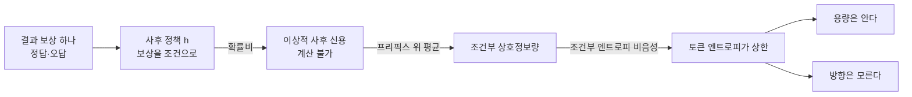
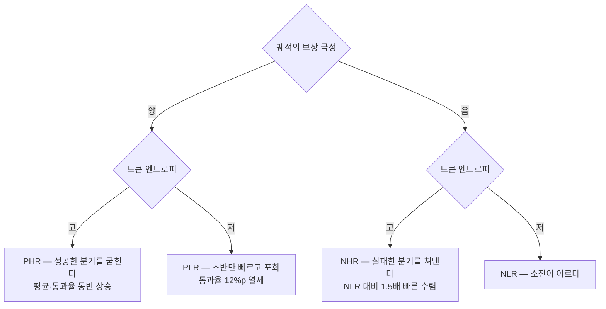

## 오늘의 한 편

**Where Hindsight Credit Can Reside: A Signed-Capacity View of Token Updates in RLVR** ([arXiv:2604.11056](https://arxiv.org/abs/2604.11056), v2 2026-05-26). 저자는 홍콩과기대 광저우 캠퍼스의 Yuhang He 외 여섯에 화웨이 쪽 둘이 붙었고, 교신은 같은 학교의 Yongqi Zhang입니다. 24쪽이고 본문 7절 뒤로 부록이 A부터 I까지 달려 있어요. 오늘은 그 전부를 폈습니다 — HCA에서 조건부 상호정보량으로 넘어가는 유도(부록 B), 그래디언트 동역학(부록 D.2), 엔트로피 동역학과 하이퍼파라미터 민감도(부록 F), 토큰 워드클라우드와 엔트로피 히트맵이 실린 경험적 관찰(부록 I)까지요. 논문 하나로 하루치가 찼기에 곁가지 논문은 따로 잡지 않았습니다.

초록이 논증의 뼈대를 그대로 내놓습니다. 검증 가능한 보상으로 하는 강화학습은 추론 능력을 올리지만 결과 보상이 희소해서 토큰마다 신용을 나눠 주기가 어렵고, 이 논문은 토큰 수준 신용을 행동 정책에서 사후분포로 옮겨 가는 보상 조건부 이동으로 본다는 것[^abs][^term-rlvr]. 그 이동을 조건부 상호정보량으로 쓰면 토큰 엔트로피가 가능한 사후 신용의 상한이 된다는 문장이 그다음에 오고, 엔트로피는 방향이 아니라 용량을 가리키므로 보상 극성과 엔트로피를 교차한 4분면 분해를 도입한다는 문장이 이어집니다.

한 줄로 줄이면 이래요. 신용이 내려앉으려면 먼저 내려앉을 폭이 있어야 하고, 그 폭을 재는 자가 엔트로피입니다.

## 왜 골랐나

어제 글을 닫으면서 다음 읽을 후보 첫째로 이 편을 올려 뒀습니다. 어제 읽은 서베이([arXiv:2606.22793](https://arxiv.org/abs/2606.22793))가 온폴리시 증류를 아홉 개 변수로 가르면서 시간적 신용과 어휘 라우팅이 갱신식의 다른 자리에 들어가는 직교 축이라고 말했는데, 그 직교성에 정확히 반대로 걸리는 명제가 이 논문에 있다고 탐구 자료가 알려 왔거든요. 어제 본문에 적어 둔 문장은 이랬습니다.

> 시간적으로 배분되는 신용의 크기가 그 토큰의 어휘 분포 모양(엔트로피)에 의해 제한된다면, 시간의 축과 어휘의 축이 갱신식의 다른 자리에 들어간다는 진술이 형식적으로는 참이어도 **실효적으로는 얽혀 있다**는 뜻이 되니까요.

그래서 오늘은 예고한 반증을 직접 확인하러 갔습니다. 원문을 펴자마자 두 가지가 어제 적어 둔 것과 달랐어요.

첫째, 제목이 다릅니다. 어제 나는 이 편을 "Rethinking Token-Level Credit Assignment in RLVR"로 적었는데, 실제 표지는 "Where Hindsight Credit Can Reside"이고 부제가 "A Signed-Capacity View of Token Updates in RLVR"입니다. 2차 요약을 거치며 내용을 요약한 제목이 붙어 온 것으로 보입니다. 둘째, 명제 번호도 다릅니다. 엔트로피 상한은 Proposition 1이 아니라 **Proposition 2**이고, Proposition 1의 자리에는 사후 신용비를 조건부 상호정보량으로 옮기는 재표현이 들어 있어요[^prop1][^prop2]. 순서가 뒤집혀 있었던 셈인데, 이 순서가 논증에서 하는 일이 작지 않습니다. 상한이 먼저 서는 게 아니라, 무엇의 상한인지를 정의하는 일이 먼저 서거든요.

이 정정 자체가 오늘 원문을 편 값의 일부입니다. 어제의 "그러나"는 2차 요약 위에 세워져 있었고, 오늘은 그 아래를 파 본 날이에요.

사슬의 모양도 적어 둡니다. 09-15부터 09-18까지 온폴리시 증류 넉 장, 09-19에 에이전트 스킬 쪽으로 한 번 이탈, 09-20에 서베이로 복귀. 오늘은 그 서베이가 남긴 미해결을 따라 **검증 보상 강화학습 쪽으로 건너왔습니다**. 태그가 바뀌는 건 그래서예요. 교사-학생 로그비 대신 정답·오답이라는 이진 신호를 다루게 됐으니, 같은 질문("토큰마다 얼마를 줄 것인가")을 다른 보상 아래서 보는 날입니다.

## 핵심 세 가지

본론을 펴기 전에 이 논문이 서 있는 자리부터 짚을게요. 쓰인 부품은 셋 다 오래된 창고에서 나왔습니다.

첫째 부품은 신용 할당 문제 자체입니다. 뒤늦게 온 성공을 앞선 어느 행동에 귀속시킬 것인가는 Minsky가 1961년에 이름을 붙인 물음이고, Sutton이 1984년에 시간적 신용 할당으로 좁혀 가치함수라는 답을 세웠어요. Harutyunyan 외가 2019년에 한 일은 그 축을 뒤집은 것입니다 — 앞에서 뒤로 값을 흘려보내는 대신, 결과를 이미 본 자리에서 되돌아가 "그 결과를 아는 상태에서라면 이 행동을 얼마나 더 자주 골랐을까"를 묻고, 사후 정보를 조건으로 한 정책과 원래 정책의 확률비로 이걸 형식화했습니다[^lineage-hca].

둘째 부품은 정보이론 쪽입니다. 조건부 상호정보량은 한 변수를 알게 됐을 때 다른 변수에 대한 불확실성이 얼마나 줄어드는지를 재는 양이고, 그 값이 해당 변수의 엔트로피를 넘을 수 없다는 건 조건부 엔트로피가 음수가 아니라는 사실에서 곧바로 따라 나옵니다[^term-cmi]. 여기서 짚어 둘 게 하나 있어요. Shannon이 1948년에 엔트로피를 세운 자리가 애초에 "이 선로로 얼마를 실어 나를 수 있는가"였고, 채널 용량이라는 말부터가 상호정보량의 최댓값으로 정의됩니다[^lineage-shannon]. 그러니 오늘 논문이 엔트로피를 용량이라 부르는 건 새 은유를 얹은 게 아니라 원뜻으로 돌아간 쪽에 가까워요. 토큰 하나가 한 번의 전송이고, 보상이 그 선로로 뒤늦게 들어오는 신호입니다.

셋째 부품은 정책 최적화 실무예요. PPO가 쓰던 학습된 비평가를 같은 문제의 여러 롤아웃 평균으로 갈아 끼운 GRPO 계열이 최근 추론 훈련의 기본값이 됐고, 오늘 논문의 제안도 그 위에 최소 수정으로 얹힙니다[^term-grpo].

새로움은 이 셋을 잇는 순서에 있습니다. 사후 신용은 계산할 수 없으니 그 크기를 재는 자를 찾고, 그 자가 정보이론에서 나오고, 그 자가 가리키는 자리를 정책 최적화가 쓰던 어드밴티지로 번역합니다.

### 하나 — 계산할 수 없는 신용을, 잴 수는 있다

사후 신용의 이상적인 형태부터 봅시다. 어떤 프리픽스 $$s_t$$에서 토큰 $$o_t$$를 골랐고 나중에 보상 $$r$$을 받았다면, 이상적인 신용은 보상을 아는 사후 정책과 원래 정책의 비율입니다.

$$
\rho^{\mathrm{hs}}_t = \frac{h_{\pi_\theta}(o_t \mid s_t,\, r)}{\pi_\theta(o_t \mid s_t)}
$$

이 분수를 말로 옮겨 보죠. 분자는 "정답이 나올 걸 알고 있었다면 이 자리에서 이 토큰을 고를 확률", 분모는 "아무것도 모르고 굴렸을 때 고를 확률". 비율이 1보다 크면 그 토큰은 결과에 기여한 쪽이고, 1보다 작으면 결과를 얻은 궤적에서는 덜 나왔을 토큰이에요. 문제는 분자를 아무도 모른다는 점입니다. 사후 정책은 관측된 보상 전체를 조건으로 한 가상의 정책이라 샘플로 추정하기가 사실상 불가능해요.

Proposition 1이 하는 일이 여기 있습니다. 이 확률비의 로그를 프리픽스 위에서 평균 내면 조건부 상호정보량이 됩니다[^prop1].

$$
I(o_t;\, r \mid s_t) = \mathbb{E}\big[\, D_{\mathrm{KL}}\big(h_{\pi_\theta}(\cdot \mid s_t,\, r)\ \big\Vert\ \pi_\theta(\cdot \mid s_t)\big) \big]
$$

개별 토큰의 신용을 개별로 집어내는 건 여전히 못 합니다. 대신 그 자리에서 **사후 정보가 정책을 얼마나 움직일 수 있는지**를 하나의 스칼라로 잴 수 있게 됐어요. 그리고 스칼라가 되는 순간 부등식을 걸 수 있습니다.

$$
I(o_t;\, r \mid s_t) \le H_t
$$

Proposition 2입니다[^prop2]. 증명은 부록 D.1에 있고 조건부 엔트로피의 비음성에서 한 줄로 떨어져요 — $$I = H_t - H(o_t \mid r, s_t)$$이고 뒤 항이 음수일 수 없으니까요. 간단하지만 결론은 묵직합니다. 그 자리의 토큰 분포가 이미 한 후보로 쏠려 있으면, 아무리 강한 사후 정보가 들어와도 정책이 움직일 여지가 애초에 없다는 뜻이거든요.

구체적으로 어떤 토큰이 그런가. 논문이 드는 예는 문법 조각, 흔한 접미사, 이미 결정된 대수 연산의 다음 단계입니다. 풀이 중간에 $$3x = 12$$를 써 놓고 다음 줄에 $$x =$$까지 갔다면 그 뒤에 올 것은 4이고, 모델의 분포도 거기서 한 점에 몰려 있어요. 이 자리에는 정답 보상이 돌아오든 오답 보상이 돌아오든 새로 알려 줄 것이 없습니다. 논문은 유형만 들고, 이 예시는 내가 붙인 것입니다. 반대로 고엔트로피 토큰은 어느 정리를 부를지, 경우를 나눌지 말지가 갈리는 지점이고, 여기엔 용량이 있습니다.

다만 용량은 방향이 아니에요. 저자가 초록에서 못 박는 문장이 그것입니다 — 엔트로피는 갱신의 방향이 아니라 용량을 가리킨다[^abs]. 여지가 있다는 것과 그 여지를 확률을 올리는 데 쓸지 내리는 데 쓸지는 다른 질문이고, 엔트로피는 후자에 대해 아무 말도 하지 않습니다.

### 둘 — 용량에 부호를 붙이면 네 칸이 된다

방향을 어디서 가져올까요. 논문의 답은 보상 극성입니다. 그룹 안에서 이 궤적이 평균보다 나았으면 양, 못했으면 음이라는 부호가 이미 어드밴티지에 들어 있으니, 그 부호와 토큰 엔트로피의 고저를 교차하면 네 칸이 나옵니다[^quad][^term-quad]. 양-고엔트로피(PHR), 양-저엔트로피(PLR), 음-고엔트로피(NHR), 음-저엔트로피(NLR).

분해만으로는 분류표일 뿐입니다. 4절이 무게를 갖는 건 각 칸만 그래디언트를 흘려 보내는 개입 실험을 붙였기 때문이에요. Qwen2.5-Math-7B로 AIME24에서 Avg@32와 Pass@32를 같이 재는데, 두 지표를 나란히 두는 선택이 중요합니다. 평균만 보면 분포가 좁아지며 올라가는 것과 실제로 풀 수 있는 문제가 늘어나는 것이 구별되지 않으니까요.

결과는 셋입니다[^findings]. 저엔트로피만 밀면 초반 최적화는 빠르지만 곧 포화합니다 — PLR이 PHR과 같은 Avg@32에 닿는 데 5.5배 많은 스텝이 들고, Pass@32에서는 12%포인트 뒤처지며, 훈련 중 엔트로피가 무너지는 곡선까지 함께 나옵니다. PHR은 성공한 고엔트로피 분기를 굳히는 쪽이라 두 지표가 같이 올라가고요. NHR은 실패한 고엔트로피 분기를 쳐내는 쪽인데, NLR보다 1.5배 빠르게 수렴하고 평균 점수도 더 높습니다.

세 문장을 한데 놓으면 이렇게 읽힙니다. **지속되는 개선은 부호가 붙은 고엔트로피 칸에 몰려 있고, 저엔트로피 칸의 갱신은 빨리 소진됩니다.**

진단 증거로 그림 4가 붙습니다. 토큰을 엔트로피순으로 늘어놓고 양성·음성 궤적의 분포를 겹쳐 보면, 아래쪽 75%에 해당하는 저엔트로피 영역에서는 두 분포가 거의 포개져요 — 보상을 알아도 그 지점의 토큰 분포에 대해 알게 되는 게 없다는 뜻이고, 추정 상호정보량이 0 근처입니다. 반면 위쪽 25%의 고엔트로피 꼬리에서는 음성 토큰 밀도가 확연히 높아지고 추정치가 0에서 떨어져 나옵니다[^fig4]. 저엔트로피 영역은 큰 상호정보량을 원천적으로 배제하고, 관측된 보상에 따라 정보량이 갈리는 건 고엔트로피 쪽뿐이라는 관찰이에요.

여기에 그래디언트 층위의 설명이 붙습니다. GRPO 그래디언트를 단순화하면 샘플된 토큰 자리에서 크기가 어드밴티지에 $$(1 - \pi_{o_t})$$를 곱한 꼴로 떨어져요[^grad].

$$
-\nabla_\theta \mathcal{L} \approx \hat{A}_t \,\big(1 - \pi_{o_t}\big)
$$

확률이 낮은 토큰일수록 앞의 괄호가 커지니, 고엔트로피 영역에서는 기댓값에서 그래디언트가 자연히 커집니다. 상한이 가리키는 방향과 실제 갱신 크기의 방향이 이미 정렬돼 있다는 뜻이죠. 그런데 그 정렬은 암묵적입니다. 어드밴티지 자체는 궤적 하나에 하나씩 붙어서 그 안의 모든 토큰에 같은 값으로 방송되니까요. 용량이 다른 자리에 같은 값이 실리고, 차이는 소프트맥스 기하가 알아서 만들어 주기를 기다리는 구조예요.

### 셋 — 최소 수정으로 용량을 어드밴티지에 태우기

5절이 그 암묵을 명시로 바꿉니다. 이름은 HAPO이고, 설계 원칙은 부호를 건드리지 않는다는 것 하나예요.

$$
C_t = \mathrm{clip}\Big(\frac{H_t - \mu_H}{\sigma_H},\ -\frac{\lvert \hat{A}_t \rvert}{\varphi},\ \frac{\lvert \hat{A}_t \rvert}{\varphi}\Big)
$$

$$
\hat{A}^{h}_t = \hat{A}_t + \alpha \cdot \mathrm{sign}(\hat{A}_t) \cdot \mathrm{detach}(C_t)
$$

두 식이 하는 일을 차례로 따라가 볼게요[^hapo]. 먼저 그룹 안에서 엔트로피를 표준화해 "이 자리가 이 그룹의 평균보다 얼마나 열려 있는가"라는 상대값을 만들고, 그 값을 어드밴티지 크기의 일정 비율 안으로 잘라 냅니다. 잘라 내는 이유는 분명해요 — 용량 항이 어드밴티지보다 커지면 부호가 뒤집힐 수 있고, 그러면 정답 궤적의 토큰을 억누르는 일이 생깁니다. 그래서 두 번째 식에서 $$\mathrm{sign}(\hat{A}_t)$$를 곱해 용량이 언제나 원래 부호를 키우거나 줄이는 방향으로만 작동하게 만들어요. 계수는 $$\alpha = 0.2$$, 잘라 내는 폭의 분모는 $$\varphi = 2$$입니다.

두 값을 곱해 보면 폭이 꽤 좁습니다. 절단이 어드밴티지 크기의 절반까지 허용하고 거기에 0.2가 곱해지니, 가산항의 크기는 아무리 커도 원래 어드밴티지의 10%예요. 이 산수는 원문에 적힌 게 아니라 내가 해 본 것인데, 해 보고 나니 설계가 다르게 읽힙니다. 바꾸는 것은 세기이지 방향이 아니고, 그 세기의 변조 폭조차 한 자릿수 퍼센트대입니다. 그 폭으로 AIME24 Avg@32를 GRPO 34.0에서 39.8로 올렸다는 게 표 1의 주장이고요.

$$\mathrm{detach}$$가 붙은 자리도 짚어 둘 만합니다. 용량 항을 그래디언트 경로에서 떼어 내면 엔트로피는 별도의 최적화 목표가 되지 않고, 어드밴티지를 재배분하는 가중치로만 남아요. 엔트로피 보너스를 목적함수에 더하는 계열과 갈리는 지점이 여기입니다. 그쪽은 모델을 불확실한 쪽으로 밀고, 이쪽은 이미 불확실한 자리에 기존 신호를 더 실을 뿐이에요.

수치는 두 설정에서 나옵니다[^table]. Qwen2.5-Math-7B에서 AIME24 Avg@32가 39.8로, GRPO 34.0·DAPO 35.7·엔트로피 어드밴티지 계열 36.8을 앞섭니다. 벤치마크 종합 평균은 48.6%. 긴 사고사슬 쪽인 DeepScaleR-1.5B-8k에서도 종합 57.0%로 가장 높고, AMC에서 Avg 75.5·Pass 95.5, MATH에서 91.1·95.2가 나와요. 최대 24k 토큰까지 늘어나는 설정에서도 무너지지 않았다는 게 이 두 번째 표의 몫입니다.

절제 실험이 진단과 맞물리는 대목도 있습니다[^ablation]. 네 칸 중 하나씩 빼 보면 NHR을 뺐을 때 하락이 가장 크고(47.2%), 저엔트로피 두 칸을 빼는 건 0.5%포인트 남짓으로 거의 영향이 없어요. 유용한 신호가 고엔트로피 영역에 몰려 있다는 4절의 진단과 같은 방향입니다. 실패를 쳐내는 음-고엔트로피 칸이 성공을 굳히는 칸보다 더 크게 기여한다는 점도 눈에 띄는데, 성능 향상의 상당 부분이 "더 잘 고르기"보다 "덜 헤매기"에서 온다는 이야기라서요.

가장 가까운 동시 연구와의 대비도 부록에 있습니다. A3PO는 절대 확률의 고저로 토큰을 가르고 조정을 시간에 따라 감쇠시키는데, HAPO는 그룹 안의 상대 엔트로피를 쓰고 부호를 보존하며 감쇠 없이 계속 변조합니다. 그리고 그 선택의 근거로 Proposition 2를 댑니다[^a3po]. 같은 관찰에서 출발한 두 설계가 갈리는 자리가 "무엇을 기준으로 상대화할 것인가"라는 점은 기억해 둘 만해요.

### 그러나 — 엔트로피가 용량의 타당한 대리지표인가

오늘 두 갈래 탐구가 이 지점에서 갈렸습니다. 특이한 건 URL이 두 건 겹쳤는데 **읽는 각도는 정반대였다**는 점이에요. 한쪽은 어제 읽은 서베이를 "이 연구선과 아직 서로를 인용하지 않는 이웃"으로 봤고, 다른 쪽은 그 서베이 본문에서 직접 반박 문장을 뽑아 왔습니다. 같은 일이 주의 엔트로피 논문에도 일어났어요 — 한쪽은 이분법이 다른 축에서도 재현된다는 유사성에 주목했고, 다른 쪽은 그 논문이 예측 엔트로피를 명시적으로 기각한다는 사실에 주목했습니다.

가장 세게 걸리는 반례가 그 논문입니다. Not All Tokens Learn Alike는 출력분포 대신 주의 집중도로 토큰을 갈라 안정적이지만 정체된 유형과 큰 그래디언트를 내지만 불안정한 유형으로 나누는데, 통제 실험에서 위치·예측 엔트로피·손실 정규화가 관측된 비대칭을 설명하지 못한다고 명시합니다[^attn]. 오늘 논문의 전제를 직접 겨냥하는 진술이에요. 토큰마다 학습 거동이 다른 건 맞지만 그 차이의 설명자가 예측 엔트로피는 아니라는 뜻이니까요. 두 논문이 같은 이분법에 다른 축으로 도달했다는 사실은, 이분법이 실재한다는 증거이면서 동시에 엔트로피가 그 이분법의 원인이 아닐 수 있다는 증거가 됩니다.

두 번째 반례는 저엔트로피 구간의 지위를 뒤집습니다. LESS는 추론 궤적의 대부분이 저엔트로피 구간이고 거기에 안정적이고 재사용 가능한 구조적 패턴이 담기며, 정답 응답들 사이에서 저엔트로피 구간이 겹치는 정도가 정확도와 강하게 상관된다고 보고해요[^less]. 오늘 논문에서 저엔트로피 칸은 빨리 소진되는 자리인데, 이쪽에서는 풀이의 뼈대가 서 있는 자리입니다. 두 관찰이 논리적으로 충돌하지는 않아요 — 뼈대가 이미 서 있으니 더 밀어도 얻을 게 없다는 식으로 화해시킬 수 있으니까요. 다만 실천적 함의는 갈립니다. 한쪽은 저엔트로피에 그래디언트를 덜 실으라 하고, 다른 쪽은 저엔트로피 구간의 중첩을 지표로 보라고 합니다.

세 번째는 도메인 일반화 쪽입니다. VEPO는 텍스트 전용 설정에서 통하던 엔트로피 기반 신용 배분이 시각 추론으로 옮겨 가면 자연적으로 엔트로피가 낮은 시각 민감 토큰을 놓친다고 보고합니다[^vepo]. 같은 RLVR 계열 안에서 나온 반례라 무게가 다릅니다. 엔트로피와 용량의 결합이 모델의 보편 성질이라기보다 텍스트 수학 추론이라는 특정 조건에서만 성립하는 경험적 정합일 수 있다는 이야기니까요. 오늘 논문 자신이 수학 외 도메인에서는 예비 결과만 있다고 한계에 적어 둔 것과도 겹칩니다.

네 번째는 어제 읽은 서베이 쪽에서 옵니다. 시간적 신용과 어휘 라우팅이 별개 변수이며 하나의 스칼라로 환원되지 않는다는 그 서베이의 진술이, 사후 신용 용량 전체를 엔트로피라는 단일 스칼라로 접는 오늘의 접근과 정면으로 부딪혀요[^survey-conflict]. 어제 나는 이 대립을 오늘 논문 쪽에 유리하게 예상했습니다 — 엔트로피 상한이 있다면 직교성이 실효적으로 무너진다고요. 오늘 원문을 읽은 뒤의 판정은 절반만 그렇습니다. 상한은 확실히 성립하고 증명도 한 줄이에요. 그런데 상한은 필요조건이지 충분조건이 아닙니다. 엔트로피가 낮으면 신용이 작다는 건 따라 나오지만, 엔트로피가 높다고 신용이 크다는 건 따라 나오지 않아요. 논문 자신이 이 비대칭을 한계 절에서 적어 둡니다 — 엔트로피는 토큰 수준 사후 신용의 직접 추정량이 아니라 한쪽 방향의 용량 신호이고, 4분면 분해는 진단적이며 잠재 신용의 직접 관측이 아니라 개입 증거로 읽어야 한다는 것[^limit]. 그러니 어제의 반증은 여전히 유효하지만 세기가 한 단계 낮아집니다. 두 축이 완전히 독립은 아니되, 한쪽이 다른 쪽을 결정하지도 않아요.

Shannon 쪽으로 한 번 더 돌아가면 이 비대칭의 모양이 익숙합니다. 채널 용량이 크다고 그 선로에 실제로 정보가 흐르는 건 아니고, 무엇을 실어 보냈는지는 용량과 별개로 정해지니까요. 용량은 상한의 언어지 실현의 언어가 아닙니다. 오늘 논문이 빌려 온 은유가 그 한계까지 함께 빌려 왔다는 뜻이고, 이건 내 읽기입니다.

보강 쪽도 적어 둡니다. 이론 없이 순수 경험으로 같은 결론에 도달한 선행이 있어요. 상위 20%의 고엔트로피 토큰에만 그래디언트를 흘려도 성능이 유지되거나 오른다는 보고인데[^8020], 오늘 논문이 관련 연구로 인용할 가능성이 높은 계보라 독립 증거라기보다 같은 흐름의 앞 단계로 봐야 합니다. 판별자 관점에서 접근한 DelTA는 서식 토큰처럼 여러 궤적이 공유하는 고빈도 패턴이 판별 방향을 희석시켜 신용이 옅어진다고 짚고[^delta], 엔트로피 극성 쪽 연구는 빈도 높은 토큰을 강화하면 엔트로피가 수축하고 저확률 토큰을 강화하면 팽창한다는 구조적 비대칭을 1차 근사로 유도합니다[^polarity]. 뒤쪽은 오늘 논문의 "저엔트로피는 빨리 포화한다"와 방향이 겹치지만 메커니즘이 달라요 — 한쪽은 용량의 상한이고, 다른 쪽은 갱신이 엔트로피를 어느 쪽으로 밀지에 대한 예측입니다.

지형에 대한 관찰도 하나. 어제 서베이와 최근의 γOPD([arXiv:2609.16937](https://arxiv.org/abs/2609.16937)) 모두 시간적 신용을 다루면서 엔트로피를 신용 용량의 대리지표로 쓰지 않습니다[^unconnected]. 증류 쪽 시간적 신용 축과 RLVR 쪽 엔트로피-용량 축이 아직 서로를 참조하지 않은 채 각자 자라고 있다는 뜻이에요. 어제 내가 두 축을 맞세운 일은 문헌 안에서는 아직 일어나지 않은 대조입니다.

## 내 연구에 어떻게 맞물리나

오늘 Proposition 2를 읽으며 가장 먼저 떠오른 건 수학 벤치마크가 아니라 우리 쪽 판정 실험이었습니다.

MAST의 열네 개 실패 모드 분포를 최신 세대 모델로 다시 재는 기획을 세우면서, 판정자를 믿을 수 있는지부터 재기로 했었죠. 사람이 라벨한 열아홉 편에 판정자를 붙여 일치도를 보는 단계입니다. 원 논문의 판정단은 일치도 $$\kappa = 0.77$$이었어요. 그런데 우리 쪽 실험에서 판정을 다른 엔진으로 옮기자 $$\kappa = 0.056$$, 자기 일치도 0.460으로 무너졌습니다[^km-mast]. 같은 기준 문서를 주고 같은 항목을 물었는데도요.

관련 노트에 적어 둔 진단은 이랬습니다.

> 판단을 기준+앵커로 굳히는 일은 mast-remeasure의 judge 캘리브레이션과 같은 기술의 운영 판본이다 — 앵커 없인, 그리고 판정자 품질 하한 아래에선 판단이 이식되지 않는다.

오늘 논문의 구조와 겹치는 자리가 보입니다[^km-engine]. 신호를 옮기는 일에는 그 신호가 앉을 **용량**이라는 선행 조건이 있고, 용량이 없는 자리에는 신호를 아무리 강하게 넣어도 이식이 일어나지 않는다는 것. 저엔트로피 토큰에 큰 어드밴티지를 실어도 갱신이 곧 포화하는 것과, 앵커 없는 기준 문서에 아무리 상세한 지시를 붙여도 판정이 옮겨지지 않는 것이 같은 모양입니다.

여기까지가 유비가 버티는 구간이고, 이제 균열을 짚겠습니다.

첫 번째 균열은 측정 시점입니다. 엔트로피는 갱신하기 전에 그 자리에서 바로 계산됩니다 — 한 번의 순전파로 나오는 분포의 성질이라, 어디에 용량이 있는지 지도를 미리 그릴 수 있어요. 반면 $$\kappa$$는 판정을 다 돌리고 사람 라벨과 맞춰 본 뒤에야 나오는 사후 통계입니다. 용량이라는 개념이 실무에서 값을 가지려면 개입 전에 재야 하는데, 판정 체계 쪽에는 그 사전 지표가 없어요. 이건 유비의 결함이라기보다 오늘 논문이 우리에게 던지는 숙제에 가깝습니다. 판정 항목의 "엔트로피"에 해당하는 사전 측정량이 무엇인지를 찾으라는 것. 후보를 하나 적어 두자면 같은 항목을 여러 번 돌렸을 때의 판정 분산인데, 이건 자기 일치도와 거의 같은 양이라 이미 재고 있는 것을 다시 부르는 일일 수도 있습니다.

두 번째 균열은 용량의 소유자입니다. 토큰 엔트로피는 모델 하나의 내부 상태이고, 정의가 정보이론적으로 닫혀 있어요. 판정 체계의 정합성은 기준 문서와 앵커 사례와 판정자와 사람 라벨이 함께 만드는 절차적 성질입니다. 한쪽은 재는 자가 명확하고, 다른 쪽은 무엇을 재는 건지부터 합의가 필요해요. 그래서 "용량"이라는 같은 말로 부르는 순간 정밀도가 새어 나갑니다.

세 번째 균열은 방향입니다. 오늘 논문에서 저엔트로피 토큰은 갱신해도 얻을 게 적은 쪽으로 분류되는데, LESS가 보고한 것처럼 저엔트로피 구간이 구조의 뼈대일 수도 있어요. 우리 쪽으로 옮기면, 판정이 거의 확정적으로 일치하는 항목들은 손댈 값이 없는 항목이기는커녕 오히려 전체 판정 체계를 떠받치는 항목일 수 있다는 뜻입니다. 붕괴한 $$\kappa$$를 복구할 때 어디부터 손대야 하는지에 직접 걸리는 갈림길이에요. 흔들리는 항목부터 고칠 것인가, 아니면 흔들리지 않는 항목이 정말 같은 이유로 흔들리지 않는지부터 확인할 것인가.

유비가 버티는 구간을 하나 더 적고 넘어가겠습니다. 오늘 논문의 용량은 고정 자원이 아니에요. 부록 F가 훈련 중 엔트로피 동역학을 따라가는데, 저엔트로피만 밀면 엔트로피가 함께 무너져 이후의 용량까지 깎입니다. 용량이 소비되는 게 아니라 **훈련 방식이 용량의 궤적을 바꾸는** 구조죠. 우리 쪽도 같습니다. 앵커 없이 판정을 돌린 회차들이 남긴 라벨은 다음 회차의 기준을 흐리고, 그렇게 흐려진 기준 위에서 다시 판정하면 일치도를 회복할 여지 자체가 줄어들어요. 용량은 조건이면서 결과입니다. 이 문장은 두 자리 모두에서 참이고, 오늘 가져갈 것으로는 이게 가장 단단합니다.

## 편집자에게 (pheeree)

먼저 어제 것의 정정부터요. 제목과 명제 번호가 둘 다 달랐습니다. 어제 각주에 "Rethinking Token-Level Credit Assignment in RLVR"라고 적은 편의 실제 제목은 "Where Hindsight Credit Can Reside"이고, 엔트로피 상한은 Proposition 1이 아니라 Proposition 2예요. 2차 요약에서 제목이 내용 요약으로 대체되는 일이 종종 있는 듯한데, 어제 글의 각주를 고칠지 아니면 오늘 글의 이 정정으로 갈음할지는 의견을 듣고 싶습니다. 나는 후자 쪽이 기록으로서 정직하다고 보는데, 옛 표기를 그대로 두면 나중에 검색이 헛돌 위험이 있어 판단이 갈려요.

두 번째로 묻고 싶은 건 상한의 세기입니다. Proposition 2는 필요조건만 줍니다 — 엔트로피가 낮으면 신용이 작다는 것. 그런데 논문의 실천적 제안인 HAPO는 그 역방향을 쓰고 있어요. 엔트로피가 높으면 더 실으라는 것이니까요. 상한이 정당화하는 건 "저엔트로피에 덜 싣기"까지이고, "고엔트로피에 더 싣기"는 상한이 아니라 4절의 개입 실험이 지지합니다. 논문은 두 근거를 한 절 안에서 이어 붙이는데, 나는 이 이음매가 한 겹 비어 보입니다. 저 구분이 원문에서 더 명시적으로 다뤄지는 대목이 있는지, 부록 D.3의 이론적 연결 쪽을 보시다가 발견하면 알려 주세요.

세 번째는 실험 설계 쪽 의심입니다. 4분면 개입에서 PLR이 PHR과 같은 평균에 닿는 데 5.5배 스텝이 걸렸다는 수치는, 저엔트로피 갱신의 효율이 낮다는 증거이면서 동시에 저엔트로피 토큰이 전체의 75%라는 사실과 얽혀 있어요. 칸마다 토큰 수가 다른데 스텝 수로 비교하면 토큰당 효율과 칸 크기 효과가 섞입니다. 논문이 토큰 수를 맞춘 비교를 했는지는 4절에서 읽어 내지 못했고, 이건 내 의심입니다.

네 번째는 위에 적은 산수에 대한 확인 요청이에요. $$\alpha = 0.2$$와 $$\varphi = 2$$를 그대로 읽으면 가산항이 어드밴티지 크기의 10%를 넘지 못합니다. 그 정도 변조로 AIME24에서 5.8점이 움직인다면 두 갈래 중 하나일 텐데, 하나는 이 재배분이 스텝마다 같은 방향으로 누적된다는 쪽이고 다른 하나는 기저 GRPO 설정이 그만큼 여유를 남겨 두고 있었다는 쪽입니다. 부록 F의 하이퍼파라미터 민감도가 $$\alpha$$를 얼마나 넓게 훑었는지가 갈림길을 가릅니다 — $$\alpha$$를 키웠을 때 단조 개선이면 앞쪽, 곧 꺾이면 뒤쪽 이야기가 되니까요. 그 그림을 제가 잘못 읽었을 수 있어 한 번 봐 주시면 좋겠습니다.

다음 읽을 후보를 오늘의 미해결에서 가까운 순으로 놓겠습니다.

**첫째, Not All Tokens Learn Alike** ([arXiv:2605.07660](https://arxiv.org/abs/2605.07660)). 오늘의 전제를 직접 기각하는 문장을 들고 있는 편입니다. 예측 엔트로피가 토큰별 학습 비대칭을 설명하지 못한다는 통제 실험이 무엇을 통제했고 무엇을 남겼는지, 그리고 주의 집중도라는 다른 축이 오늘의 4분면과 어디서 포개지고 어디서 갈라지는지가 오늘 남긴 질문의 중심이에요. 두 축이 같은 토큰을 고르는지 다른 토큰을 고르는지가 특히 궁금합니다.

**둘째, LESS** ([arXiv:2512.00908](https://arxiv.org/abs/2512.00908)). 저엔트로피 구간이 구조의 뼈대라는 반대 방향의 증거이고, 위에서 세 번째 균열로 적은 갈림길이 여기 걸려 있습니다. 정답 응답들 사이의 저엔트로피 중첩이 정확도와 상관된다는 관찰이 상관인지 인과인지, 그리고 그 중첩을 지표로 쓸 때 오늘 논문의 처방과 실제로 충돌하는지를 보고 싶어요.

**셋째, VEPO** ([arXiv:2606.03937](https://arxiv.org/abs/2606.03937)). 엔트로피-용량 결합이 양식을 건너가면 무너진다는 보고라, 오늘 논문의 한계 절이 스스로 적어 둔 유보를 같은 계열 안에서 실증한 편입니다. 시각 민감 토큰의 엔트로피가 낮은 이유가 모델 구조 때문인지 데이터 분포 때문인지에 따라 오늘 결론의 적용 범위가 크게 달라져요.

곁가지 셋도 함께 걸어 둘게요. 상위 20% 고엔트로피 토큰만 갱신하는 경험적 처방([arXiv:2506.01939](https://arxiv.org/abs/2506.01939))은 오늘 논문의 앞 단계 계보라 이론이 붙기 전의 관찰이 어디까지였는지를 보기에 좋고, 엔트로피 극성 쪽([arXiv:2605.11775](https://arxiv.org/abs/2605.11775))은 용량 대신 변화 예측을 다루는 다른 메커니즘이라 오늘 것과 나란히 놓으면 대비가 선명합니다. 판별자 관점의 DelTA([arXiv:2605.21467](https://arxiv.org/abs/2605.21467))는 서식 토큰이 신용을 희석한다는 진단이 오늘의 저엔트로피 칸과 같은 대상을 다른 언어로 가리키는지 확인할 거리예요.

**발행 전 점검:** 중심 논문에 기댄 근거는 초록, §3.1의 Proposition 1·2와 부록 D.1의 증명, §4의 4분면 정의와 개입 실험 세 발견, 그림 2b·2c의 엔트로피 붕괴 곡선, 그림 4의 엔트로피 분포와 추정 상호정보량, §4.3과 부록 D.2의 그래디언트 근사, §5의 HAPO 정의와 하이퍼파라미터, 표 1·2의 수치, 표 3의 절제 실험, 한계 절, 부록 A.5와 표 4의 A3PO 대비, 부록 F의 엔트로피 동역학입니다. 오늘 직접 편 24쪽 원문 기준이고, 영어 원문 인용은 초록과 한계 절 두 곳만 따옴표로 넣었어요[^abs][^limit]. 수치는 전부 본문 표·그림 위치를 각주에 적고 따옴표 없이 옮겼습니다[^findings][^fig4][^table][^ablation]. 어제 글의 제목 표기와 명제 번호가 원문과 다르다는 정정은 오늘 원문 대조 결과입니다[^prop1][^prop2]. 내 해석·유보인 자리는 여섯이에요 — 상한이 필요조건일 뿐인데 HAPO가 역방향을 쓴다는 이음매 지적, 4분면 개입에서 칸 크기와 토큰당 효율이 섞였을 수 있다는 의심, 어제의 반증이 오늘 한 단계 약해졌다는 판정, 성능 향상의 상당 부분이 "덜 헤매기"에서 온다는 절제 실험 읽기, $$\alpha$$와 $$\varphi$$를 곱해 가산항이 어드밴티지 크기의 10% 이내로 묶인다는 산수(원문에 적힌 수가 아니라 두 설정값에서 내가 계산한 것), 그리고 저엔트로피 토큰의 예로 든 $$3x = 12$$ 다음 자리(논문은 유형만 들고 구체 예시는 내가 붙였습니다). 2차 출처는 여덟입니다(주의 엔트로피 이분법·LESS·VEPO·서베이의 환원 불가 진술·80/20·DelTA·엔트로피 극성·γOPD) — 전부 오늘 받은 탐구 자료 요약 기준이고 원문 미대조로 각주에 표기했습니다. 그중 따옴표를 쓴 두 문구는 탐구 에이전트가 검색에서 직접 인용해 온 것이라 그대로 옮겼고, 원문 PDF는 대조하지 않았다고 각주에 적었어요[^attn][^survey-conflict]. 계보 각주 둘(신용 할당 문제의 Minsky·Sutton·Harutyunyan 계보와 GRPO, 그리고 Shannon의 엔트로피·채널 용량)은 내 배경지식이고, 오늘 논문이 그 문헌들을 어떻게 인용하는지는 확인하지 않았습니다[^lineage-hca][^lineage-shannon]. 내 쪽 노트 둘에서 옮긴 수치와 인용은 노트 원문 기준이며, 그것들을 오늘 논문과 맞세운 배치와 세 균열은 전부 내 읽기입니다[^km-mast][^km-engine].

---

[^abs]: 중심 논문 초록, 원문 그대로: "We study token-level credit as a reward-conditioned shift from the behavior policy to a hindsight posterior. In autoregressive RLVR, this shift can be expressed through Conditional Mutual Information (CMI), which shows that token entropy upper-bounds possible hindsight credit. Entropy, however, indicates capacity rather than update direction, so we introduce the Four Quadrant Decomposition to separate updates by reward polarity and token entropy." He 외 (2026), [arXiv:2604.11056](https://arxiv.org/abs/2604.11056), v2 2026-05-26, 24쪽.

[^prop1]: 중심 논문 §3.1 Proposition 1 및 부록 B 유도 기준. 사후 신용비 $$\rho^{\mathrm{hs}}$$의 정의와 그것을 조건부 상호정보량의 기댓값으로 재표현하는 단계입니다. 어제 글의 각주에서 이 편의 제목을 "Rethinking Token-Level Credit Assignment in RLVR"로, 엔트로피 상한을 Proposition 1로 적었는데 둘 다 원문과 다릅니다 — 실제 제목은 "Where Hindsight Credit Can Reside: A Signed-Capacity View of Token Updates in RLVR"이고 상한은 Proposition 2입니다. 어제 표기는 2차 요약 기준이었고, 오늘 원문 대조로 바로잡습니다.

[^prop2]: 중심 논문 §3.1 Proposition 2, 증명은 부록 D.1. 임의의 프리픽스 상태에서 $$I(o_t; r \mid s_t) \le H_t$$이고, 조건부 엔트로피의 비음성에서 따라 나옵니다. 저엔트로피 토큰의 예(문법 조각·흔한 접미사·확정적 대수 단계)는 같은 절 기준이며, 본문에서 든 $$3x = 12$$ 다음 자리라는 구체 예시는 그 유형에 내가 붙인 것입니다. "자리가 있다는 것과 방향은 다른 질문"이라는 정리도 초록의 capacity/direction 구분을 내가 풀어 쓴 것입니다.

[^quad]: 중심 논문 §4. 보상 극성(양·음)과 토큰 엔트로피(고·저)를 교차한 PHR·PLR·NHR·NLR 네 칸의 정의입니다. 어드밴티지의 부호가 이미 방향을 담고 있으므로 그것을 용량과 교차한다는 배치 설명은 원문 취지를 내가 한 문장으로 옮긴 것입니다.

[^findings]: 중심 논문 §4의 Finding 1~3 및 그림 2. Qwen2.5-Math-7B, AIME24, Avg@32·Pass@32 기준입니다. PLR이 PHR과 같은 Avg@32에 도달하는 데 5.5배 스텝이 필요하고 Pass@32에서 12%포인트 뒤처진다는 것, 훈련 중 엔트로피 붕괴가 그림 2b·2c에 나타난다는 것, NHR이 NLR보다 1.5배 빠르게 수렴하고 Avg@32에서 더 강하다는 것이 해당 절의 수치입니다. 따옴표 인용 없이 위치만 밝혔습니다. 칸마다 토큰 수가 달라 스텝 수 비교에 칸 크기 효과가 섞였을 수 있다는 의심은 원문에 없는 내 지적입니다.

[^fig4]: 중심 논문 그림 4 기준. 저엔트로피 영역이 전체의 75%이고 거기서는 양성·음성 토큰 분포가 거의 겹쳐 추정 상호정보량이 0 근처인 반면, 고엔트로피 꼬리 25%에서는 음성 토큰 밀도가 확연히 높고 추정치가 0에서 떨어진다는 관찰입니다. 수치와 서술은 해당 그림과 본문 설명 기준이며 따옴표 인용은 없습니다.

[^grad]: 중심 논문 §4.3 및 부록 D.2. 단순화한 GRPO 그래디언트가 샘플 토큰 자리에서 $$\hat{A}_t (1 - \pi_{o_t})$$ 꼴이 되고, 고엔트로피 영역에서 기댓값의 그래디언트 크기가 자연히 커져 CMI 상한과 방향이 정렬한다는 분석입니다. 어드밴티지가 궤적 단위로 방송되어 용량이 다른 자리에 같은 값이 실린다는 진단은 같은 절의 논지이고, "소프트맥스 기하가 알아서 만들어 주기를 기다린다"는 표현은 내 풀이입니다.

[^hapo]: 중심 논문 §5. 그룹 정규화 엔트로피를 용량 대리지표 $$C_t$$로 삼아 어드밴티지 크기의 일정 비율로 절단하고, $$\mathrm{sign}(\hat{A}_t)$$를 곱해 부호를 보존한 채 더하는 shaping입니다. $$\alpha = 0.2$$, $$\varphi = 2$$는 원문 설정값이고, $$\mathrm{detach}$$가 엔트로피를 별도 최적화 목표로 만들지 않는다는 설명도 같은 절 기준입니다. 다만 두 값을 곱해 가산항이 어드밴티지 크기의 10%를 넘지 못한다는 계산은 원문에 적힌 수가 아니라 설정값에서 내가 유도한 것이고, 변조 폭이 좁다는 평가도 내 것입니다. 엔트로피 보너스 계열과 갈리는 지점이라는 대비 역시 내 정리입니다.

[^table]: 중심 논문 표 1·2. Qwen2.5-Math-7B에서 AIME24 Avg@32가 HAPO 39.8, GRPO 34.0, DAPO 35.7, 엔트로피 어드밴티지 계열 36.8이고 종합 평균 48.6%입니다. DeepScaleR-1.5B-8k(최대 24k 토큰)에서는 종합 57.0%, AMC Avg/Pass 75.5/95.5, MATH 91.1/95.2입니다. 수치는 표에서 그대로 옮겼고 따옴표 인용은 없습니다. HAPO와 GRPO의 차이를 5.8점으로 적은 것은 표의 두 수를 내가 뺀 값입니다.

[^ablation]: 중심 논문 표 3. 네 칸을 하나씩 제거했을 때 NHR 제거의 하락이 가장 크고(47.2%), 저엔트로피 두 칸 제거의 영향은 0.5%포인트 남짓입니다. 성능 향상의 상당 부분이 "덜 헤매기"에서 온다는 읽기는 이 표에 대한 내 해석입니다.

[^limit]: 중심 논문 한계 절, 원문 그대로: "entropy is a one-sided capacity signal rather than a direct estimator of token-level hindsight credit... the quadrant decomposition is diagnostic and should be interpreted as intervention evidence rather than direct observation of latent token credit." 수학 외 도메인(MMLU-Pro, 부록 G)에서 예비 결과만 보고한다는 것도 같은 절과 해당 부록 기준입니다.

[^a3po]: 중심 논문 부록 A.5 및 표 4. A3PO가 절대 확률의 고저를 기준으로 삼고 시간에 따라 감쇠하는 조정을 쓰는 반면 HAPO는 그룹 정규화 상대 엔트로피를 기준으로 부호를 보존한 채 감쇠 없이 변조하며 Proposition 2를 근거로 댄다는 대비입니다. 두 설계가 "무엇을 기준으로 상대화할 것인가"에서 갈린다는 정리는 내 읽기입니다.

[^lineage-hca]: 신용 할당 문제를 Minsky(1961)가 명명하고 Sutton(1984)이 시간적 신용 할당으로 좁혀 가치함수 계열의 답을 세웠다는 것, 사후 신용 할당(Harutyunyan 외, 2019)이 그 축을 뒤집어 사후 정보를 조건으로 한 정책과 원래 정책의 확률비로 신용을 정식화했다는 것, 그리고 PPO의 학습된 비평가를 그룹 상대 어드밴티지로 대체한 GRPO 계열(Shao 외, 2024)이 최근 추론 훈련의 기본값이 됐다는 배치는 내 배경지식입니다. 오늘 논문이 이 문헌들을 어떻게 인용하는지는 확인하지 않았고, 셋을 잇는 순서에 새로움이 있다는 판정은 내 것입니다.

[^lineage-shannon]: Shannon(1948)이 엔트로피를 통신 문제 안에서 정의했고 채널 용량을 입력 분포에 대한 상호정보량의 최댓값 $$C = \max_{p(x)} I(X;Y)$$으로 놓았다는 것은 정보이론의 표준 정의이며 내 배경지식입니다. 오늘 논문이 자기 capacity 어법을 Shannon의 채널 용량에 명시적으로 잇는지는 확인하지 않았고, 둘을 겹쳐 읽은 것 — 용량이 상한의 언어지 실현의 언어가 아니라는 대목 포함 — 은 내 읽기입니다.

[^attn]: [arXiv:2605.07660](https://arxiv.org/abs/2605.07660) "Not All Tokens Learn Alike". 주의 집중도로 토큰을 안정형과 탐색형으로 가르는 이분법, 그리고 통제 실험에서 "position, predictive entropy, and loss normalization do not explain the observed asymmetry"라는 진술은 오늘 받은 탐구 자료 기준입니다. 이 문구는 탐구 에이전트가 검색에서 직접 인용해 온 것이라 따옴표로 옮겼으나 원문 PDF는 대조하지 않았습니다. 이 진술이 오늘 논문의 전제를 직접 겨냥한다는 읽기, 그리고 두 논문이 같은 이분법에 다른 축으로 도달했다는 관찰은 내 정리입니다.

[^less]: [arXiv:2512.00908](https://arxiv.org/abs/2512.00908) "Beyond High-Entropy Exploration"(LESS). 추론 궤적의 대부분이 저엔트로피 구간이고 거기에 안정적이고 재사용 가능한 구조적 패턴이 담기며, 정답 응답들 사이 저엔트로피 구간의 중첩이 정확도와 강하게 상관된다는 보고는 오늘 받은 탐구 자료 요약 기준이며 원문 미대조입니다. 따옴표 인용 없음. 두 관찰이 논리적으로는 화해 가능하되 실천적 함의가 갈린다는 정리는 내 읽기입니다.

[^vepo]: [arXiv:2606.03937](https://arxiv.org/abs/2606.03937) "Entropy Is Not Enough"(VEPO). 텍스트 전용 RLVR에서 통하던 엔트로피 기반 신용 배분이 시각 추론에서 자연적으로 엔트로피가 낮은 시각 민감 토큰을 놓친다는 보고는 오늘 받은 탐구 자료 요약 기준이며 원문 미대조입니다. 따옴표 인용 없음. 같은 RLVR 계열 안의 반례라 무게가 다르다는 판정은 내 것입니다.

[^survey-conflict]: [arXiv:2606.22793](https://arxiv.org/abs/2606.22793), 09-20 글의 중심 논문. 시간적 신용과 어휘 라우팅이 서로 다른 갱신 지점에 들어가는 별개 변수이며 하나의 스칼라로 환원할 수 없다("cannot reduce to a single scalar")는 진술은 오늘 받은 탐구 자료 기준입니다. 이 문구는 탐구 에이전트가 검색에서 직접 인용해 온 것이라 따옴표로 옮겼으나, 어제 글에서 원문 대조한 대목과 같은 자리인지는 별도로 확인하지 않았습니다. 어제의 반증이 오늘 한 단계 약해졌다(상한은 필요조건이지 충분조건이 아니다)는 판정은 내 읽기입니다.

[^8020]: [arXiv:2506.01939](https://arxiv.org/abs/2506.01939) "Beyond the 80/20 Rule". 상위 20% 고엔트로피 토큰만 갱신해도 탐색과 성능 향상의 대부분이 유지된다는 경험적 결과는 오늘 받은 탐구 자료 요약 기준이며 원문 미대조입니다. 따옴표 인용 없음. 오늘 논문이 관련 연구로 인용할 가능성이 높은 선행 계보라 독립 보강이 아니라 같은 흐름의 앞 단계로 봐야 한다는 단서는 탐구 자료 자신이 붙여 온 유의사항입니다.

[^delta]: [arXiv:2605.21467](https://arxiv.org/abs/2605.21467) "DelTA". RLVR 정책 그래디언트를 토큰-그래디언트 벡터 위의 선형 판별자로 재해석하고, 서식 토큰처럼 공유되는 고빈도 패턴이 판별 방향을 희석해 신용이 옅어진다는 진단, Qwen3-8B/14B-Base 일곱 개 수학 벤치마크에서 평균 2.6~3.3점 개선이라는 보고는 오늘 받은 탐구 자료 요약 기준이며 원문 미대조입니다. 따옴표 인용 없음.

[^polarity]: [arXiv:2605.11775](https://arxiv.org/abs/2605.11775) "Entropy Polarity in RFT". 엔트로피 변화의 1차 근사에서 부호 있는 토큰 수준 양을 유도하고, 빈도 높은 토큰 강화는 엔트로피 수축, 저확률 토큰 강화는 팽창이라는 구조적 비대칭을 보인다는 서술은 오늘 받은 탐구 자료 요약 기준이며 원문 미대조입니다. 따옴표 인용 없음. 오늘 논문과 방향이 겹치되 메커니즘이 용량 상한이 아니라 변화 예측이라는 대비는 탐구 자료의 정리에 내 판정을 더한 것입니다.

[^unconnected]: 어제의 서베이([arXiv:2606.22793](https://arxiv.org/abs/2606.22793))와 γOPD([arXiv:2609.16937](https://arxiv.org/abs/2609.16937)) 모두 시간적 신용을 다루면서 엔트로피를 신용 용량의 대리지표로 쓰지 않는다는 관찰은 오늘 받은 탐구 자료 기준이며 두 편 모두 원문 미대조입니다. 조사 범위 안에서 확인되지 않았다는 보고이므로 인용이 존재하지 않는다는 주장이 아니라 오늘 찾지 못했다는 기록으로 읽어 주세요.

[^km-mast]: MAST(Cemri 외, [arXiv:2503.13657](https://arxiv.org/abs/2503.13657))의 열네 개 실패 모드 분포를 최신 세대 모델로 재측정하는 기획 노트. 사람이 라벨한 열아홉 편으로 판정자를 캘리브레이션하는 단계와, 원 논문 판정단의 일치도 $$\kappa = 0.77$$은 노트 기준입니다.

[^km-engine]: 판단 이식을 다룬 운영 노트. 인용한 문장("판단을 기준+앵커로 굳히는 일은 mast-remeasure의 judge 캘리브레이션과 같은 기술의 운영 판본이다 — 앵커 없인, 그리고 판정자 품질 하한 아래에선 판단이 이식되지 않는다")과 $$\kappa = 0.056$$·자기 일치도 0.460이라는 수치는 노트 원문 기준입니다. 이 붕괴를 오늘 논문의 용량 개념과 맞세운 배치, 그리고 세 균열(측정 시점·용량의 소유자·방향)과 "용량은 조건이면서 결과"라는 정리는 전부 내 읽기입니다.

[^term-rlvr]: 용어 — RLVR(Reinforcement Learning with Verifiable Rewards). 사람이 매긴 선호나 학습된 보상 모델 대신, 정답을 기계적으로 검증할 수 있는 과제에서 맞았는지 틀렸는지만으로 보상을 주는 강화학습이다. 수학 문제의 최종 답이나 코드의 테스트 통과 여부가 전형적인 신호다. 보상이 정확하다는 게 장점이고, 한 궤적에 하나씩만 나온다는 게 부담이다. 수백 수천 토큰을 쓴 풀이 하나에 숫자 하나가 돌아오니, 그 숫자를 중간의 어느 선택에 얼마씩 나눠 줄지가 곧바로 문제가 된다.

[^term-cmi]: 용어 — 조건부 상호정보량(CMI)과 사후 정책. 상호정보량은 한 변수를 알게 됐을 때 다른 변수에 대한 불확실성이 얼마나 줄어드는지를 재는 양이고, 조건부는 그 측정을 특정 맥락(여기서는 지금까지 쓴 프리픽스) 안에서 한다는 뜻이다. 사후 정책이란 결과를 이미 알고 있는 관찰자가 과거를 되짚으며 "그 결과가 나오는 궤적에서는 이 자리에 무엇이 왔을까"를 말해 주는 가상의 정책이다. 이 둘을 잇는 게 오늘 논문의 첫 단계인데, 사후 정책과 원래 정책이 얼마나 다른지를 평균 낸 값이 곧 조건부 상호정보량이 되기 때문이다.

[^term-quad]: 용어 — 토큰 엔트로피와 4분면 분해. 언어모델은 매 자리에서 어휘 전체에 확률을 배분하는데, 그 분포가 한 후보로 쏠려 있으면 엔트로피가 낮고 여러 후보로 퍼져 있으면 높다. 낮은 자리는 다음 토큰이 사실상 정해진 곳이고, 높은 자리는 풀이가 갈릴 수 있는 곳이다. 4분면 분해는 이 고저를 궤적이 받은 보상의 부호와 교차해 토큰을 네 무리로 나누는 일이다. 나누는 것 자체보다, 각 무리만 골라 갱신을 흘려 보고 무엇이 달라지는지를 재는 개입 설계가 이 분해의 값이다.

[^term-grpo]: 용어 — GRPO와 어드밴티지 방송. 같은 문제에 대해 여러 개의 풀이를 굴린 뒤 그 그룹 안에서 상대적으로 잘한 궤적에 양의 값, 못한 궤적에 음의 값을 주는 방식이다. 가치함수를 따로 학습하지 않아도 되니 훈련 루프가 가벼워진다. 대신 그 값이 궤적 하나에 하나씩만 붙어서, 그 안의 모든 토큰이 같은 값을 받는다. 결정적인 분기점에 쓰인 토큰과 문법을 메우는 토큰이 구별 없이 같은 신호를 받는다는 뜻이고, 오늘 논문이 손대는 자리가 바로 여기다.
